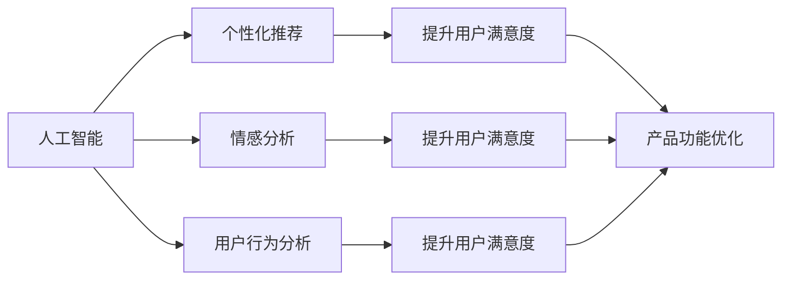
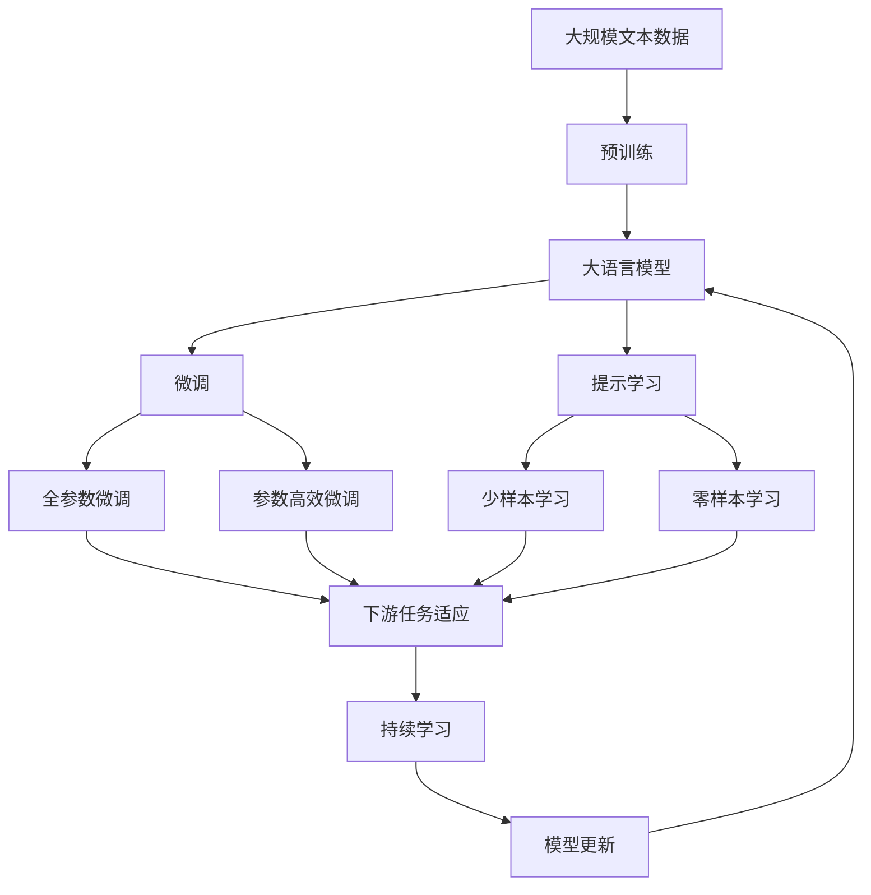

                 

# AI提升用户体验的多种方法

> 关键词：人工智能,用户体验提升,个性化推荐,情感分析,用户行为分析,自动化测试

## 1. 背景介绍

### 1.1 问题由来
随着互联网和移动互联网的普及，用户对数字化产品和服务的需求日益增加，同时也对体验提出了更高的要求。如何通过人工智能技术（AI）提升用户体验（UX），成为企业数字化转型的关键点。

近年来，人工智能技术在NLP、计算机视觉、语音识别等方向取得突破性进展，为提升用户体验提供了新的思路和方法。例如，通过自然语言处理（NLP）技术，可以构建智能客服系统、个性化推荐系统、情感分析等应用，显著提升用户的互动体验；通过计算机视觉技术，可以开发图像识别、视频分析等应用，改善用户的感知体验；通过语音识别和自然语言生成（NLG）技术，可以创建语音助手、智能音箱等，提升用户的交互体验。

### 1.2 问题核心关键点
在数字化产品和服务的设计与开发过程中，用户体验提升（UX提升）成为了核心的考量因素。以下这些是核心关键点：
- **用户需求理解**：深入了解用户的真实需求和行为模式，提供定制化解决方案。
- **个性化推荐**：通过用户的历史行为和偏好，推荐适合的内容和服务。
- **情感分析**：识别用户情绪，提供更加人性化的互动和反馈。
- **自动化测试**：提高产品质量，减少用户在使用中的挫折感。
- **用户行为分析**：分析用户行为，优化产品设计和功能。

### 1.3 问题研究意义
研究AI提升用户体验的方法，对于拓展AI应用范围，提升用户满意度，加速数字化产品和服务的发展，具有重要意义：

1. **降低开发成本**：通过个性化推荐和自动化测试，可以减少人工投入，降低产品开发和维护成本。
2. **提高用户满意度**：通过情感分析和用户行为分析，能够更好地满足用户需求，提升用户满意度和忠诚度。
3. **加速创新迭代**：通过数据驱动的分析和优化，可以快速迭代产品功能，提升市场竞争力。
4. **增强业务价值**：通过AI技术优化用户体验，可以提升企业品牌形象，增加业务价值。

## 2. 核心概念与联系

### 2.1 核心概念概述

为了更好地理解AI提升用户体验的方法，本节将介绍几个关键概念：

- **人工智能（AI）**：包括机器学习（ML）、深度学习（DL）、自然语言处理（NLP）、计算机视觉（CV）、语音识别（ASR）等技术。通过这些技术，AI可以处理复杂的数据和任务，为用户体验提升提供技术支撑。
- **用户体验（UX）**：包括视觉、可用性、交互等多个方面，旨在通过设计和开发提升用户对产品的满意度。
- **个性化推荐**：根据用户历史行为和偏好，推荐适合的内容和服务，提升用户体验。
- **情感分析**：通过分析用户情感，识别用户情绪，提供个性化反馈和互动，提升用户满意度。
- **用户行为分析**：分析用户行为模式和趋势，优化产品设计和功能，提高用户留存率和满意度。
- **自动化测试**：通过AI自动化测试，快速发现和修复产品问题，提升产品质量和用户满意度。

这些核心概念之间的联系可以通过以下Mermaid流程图来展示：



这个流程图展示了AI技术通过个性化推荐、情感分析、用户行为分析等手段，提升用户体验的过程。

### 2.2 概念间的关系

这些核心概念之间存在着紧密的联系，形成了提升用户体验的完整生态系统。以下是一些关键概念之间的联系：

- **个性化推荐**与**用户体验提升**：个性化推荐能够根据用户偏好推荐合适的产品和服务，提升用户满意度和忠诚度。
- **情感分析**与**用户体验提升**：通过识别用户情绪，可以提供更加人性化的互动和反馈，提升用户满意度。
- **用户行为分析**与**用户体验提升**：分析用户行为模式和趋势，可以优化产品设计和功能，提高用户留存率和满意度。
- **自动化测试**与**用户体验提升**：快速发现和修复产品问题，提升产品质量，减少用户在使用中的挫折感。

这些概念共同构成了提升用户体验的完整框架，使得AI技术能够全面提升产品的互动和感知质量。

### 2.3 核心概念的整体架构

最后，我们用一个综合的流程图来展示这些核心概念在大模型微调过程中的整体架构：



这个综合流程图展示了从预训练到微调，再到持续学习的完整过程。AI技术通过预训练获得基础能力，然后通过微调和提示学习适应具体任务，最后通过持续学习不断更新和适应新数据，提升用户体验。

## 3. 核心算法原理 & 具体操作步骤
### 3.1 算法原理概述

AI提升用户体验的方法，本质上是通过机器学习和深度学习算法，分析用户数据，建立模型，预测用户行为和情感，从而优化产品设计和功能，提升用户满意度和忠诚度。

以个性化推荐系统为例，其核心算法包括协同过滤（Collaborative Filtering）、矩阵分解（Matrix Factorization）、深度学习模型（如卷积神经网络CNN、循环神经网络RNN、Transformer）等。这些算法通过分析用户历史行为数据，预测用户对未来内容的偏好，从而进行个性化推荐。

### 3.2 算法步骤详解

下面以个性化推荐系统为例，详细讲解其实现步骤：

**Step 1: 准备数据集**
- 收集用户历史行为数据，如浏览记录、点击行为、购买记录等。
- 对数据进行清洗、去重和标准化处理，确保数据质量。
- 将用户和物品分别进行编码，建立用户-物品矩阵。

**Step 2: 特征工程**
- 根据业务需求，提取有意义的特征，如用户活跃度、物品热度、物品类别等。
- 对特征进行归一化和降维处理，减少噪声和冗余信息。

**Step 3: 模型训练**
- 选择合适的算法（如协同过滤、矩阵分解、深度学习模型），进行模型训练。
- 使用交叉验证等方法评估模型性能，调整模型参数。
- 在训练集上进行模型训练，逐步优化模型。

**Step 4: 模型评估**
- 使用测试集评估模型性能，计算准确率、召回率、F1值等指标。
- 根据评估结果，调整模型参数，提升模型效果。

**Step 5: 上线应用**
- 将训练好的模型部署到实际应用中，进行实时推荐。
- 根据用户反馈和系统日志，不断优化推荐算法和模型参数。

### 3.3 算法优缺点

AI提升用户体验的方法具有以下优点：
- **高效性**：通过自动化算法，可以实时分析用户数据，快速提升用户体验。
- **灵活性**：可以根据业务需求，灵活调整算法参数和模型结构。
- **广泛适用性**：可以应用于多种场景，如个性化推荐、情感分析、自动化测试等。

同时，这些方法也存在一些局限性：
- **数据依赖**：需要大量高质量的用户数据，否则推荐效果不佳。
- **模型复杂性**：深度学习模型参数量大，训练和推理速度较慢。
- **可解释性不足**：推荐算法和模型黑盒，难以解释其内部决策逻辑。

尽管存在这些局限性，但AI提升用户体验的方法已经在许多实际应用中得到了验证，取得了显著的成效。

### 3.4 算法应用领域

AI提升用户体验的方法已经广泛应用于多个领域，包括但不限于：

- **电子商务**：通过个性化推荐和情感分析，提升购物体验，提高转化率。
- **金融服务**：通过情感分析，识别用户情绪，提供个性化服务，提升用户体验。
- **医疗健康**：通过用户行为分析，推荐合适的健康产品和服务，提高用户满意度。
- **娱乐传媒**：通过个性化推荐和自动化测试，提供高质量的内容和服务，提升用户粘性。
- **智能家居**：通过情感分析，优化家庭设备使用，提升用户交互体验。

## 4. 数学模型和公式 & 详细讲解 & 举例说明

### 4.1 数学模型构建

以协同过滤算法为例，其核心数学模型为用户-物品评分矩阵 $R$，其中 $R_{ij}$ 表示用户 $i$ 对物品 $j$ 的评分。设用户集合为 $U$，物品集合为 $I$，用户对物品的评分矩阵为 $R$。

协同过滤算法假设用户对物品的评分可以表示为多个隐含特征 $f_i$ 和 $f_j$ 的线性组合，即：

$$
R_{ij} = \alpha_i f_i + \beta_j f_j + \epsilon_{ij}
$$

其中 $\alpha_i$ 和 $\beta_j$ 为隐含特征系数，$\epsilon_{ij}$ 为噪声项。

### 4.2 公式推导过程

对协同过滤算法的用户隐含特征进行矩阵分解，可以表示为：

$$
R \approx \alpha U F^T
$$

其中 $U$ 为用户隐含特征矩阵，$F^T$ 为物品隐含特征矩阵。

通过最小二乘法求解 $U$ 和 $F^T$，可以优化协同过滤算法的效果。设 $\hat{R}$ 为预测评分矩阵，则最小化均方误差：

$$
\min_{U,F} ||R - \hat{R}||_F^2
$$

其中 $||\cdot||_F$ 表示Frobenius范数。

### 4.3 案例分析与讲解

以Netflix推荐系统为例，其核心算法基于协同过滤和矩阵分解。Netflix通过分析用户历史观看数据，建立用户-电影评分矩阵，使用矩阵分解技术，计算用户和电影的隐含特征，进行推荐。通过不断优化模型参数，Netflix在个性化推荐中取得了巨大成功，用户满意度显著提升。

## 5. 项目实践：代码实例和详细解释说明

### 5.1 开发环境搭建

在进行AI提升用户体验的实践前，我们需要准备好开发环境。以下是使用Python进行Scikit-Learn开发的环境配置流程：

1. 安装Anaconda：从官网下载并安装Anaconda，用于创建独立的Python环境。

2. 创建并激活虚拟环境：
```bash
conda create -n pyenv python=3.8 
conda activate pyenv
```

3. 安装Scikit-Learn：
```bash
conda install scikit-learn
```

4. 安装各类工具包：
```bash
pip install numpy pandas scikit-learn matplotlib tqdm jupyter notebook ipython
```

完成上述步骤后，即可在`pyenv`环境中开始AI提升用户体验的实践。

### 5.2 源代码详细实现

以下是一个简单的基于协同过滤算法的Python代码实现，用于推荐系统中的用户-物品评分预测。

```python
import numpy as np
from sklearn.metrics import mean_squared_error
from scipy.sparse.linalg import svds

def collaborative_filtering(data, k=10):
    # 数据标准化
    data_norm = data / np.linalg.norm(data, axis=1, keepdims=True)

    # 用户隐含特征矩阵U的奇异值分解
    U, _, Vt = svds(data_norm, k)

    # 物品隐含特征矩阵F
    F = np.dot(data_norm, Vt)

    # 预测评分
    predictions = np.dot(U, F)

    # 计算均方误差
    mse = mean_squared_error(predictions, data)

    return U, F, predictions, mse

# 生成模拟数据
data = np.random.rand(1000, 1000) * 2 - 1

# 预测评分
U, F, predictions, mse = collaborative_filtering(data)

# 输出结果
print("均方误差：", mse)
```

### 5.3 代码解读与分析

让我们再详细解读一下关键代码的实现细节：

**collaborative_filtering函数**：
- `data_norm`：对用户-物品评分矩阵进行标准化，避免某些用户或物品的评分偏差影响模型。
- `svds`：使用奇异值分解（SVD）技术，分解用户隐含特征矩阵 $U$。
- `np.dot`：计算预测评分矩阵。
- `mean_squared_error`：计算均方误差。

**数据生成**：
- 使用`np.random.rand`生成1000x1000的随机矩阵，模拟用户-物品评分数据。
- `data_norm`对矩阵进行标准化，使其均值为0，方差为1。

**预测评分**：
- `U, _, Vt = svds(data_norm, k)` 计算用户隐含特征矩阵 $U$ 的前 $k$ 个奇异值。
- `F = np.dot(data_norm, Vt)` 计算物品隐含特征矩阵 $F$。
- `predictions = np.dot(U, F)` 计算预测评分矩阵。

**结果输出**：
- `mse` 输出均方误差。

通过这个简单的代码实现，可以看出协同过滤算法的核心思想：通过奇异值分解技术，将用户-物品评分矩阵分解为用户隐含特征矩阵和物品隐含特征矩阵，然后计算预测评分，评估模型效果。

### 5.4 运行结果展示

假设我们使用Netflix推荐系统中的真实数据进行模型训练，训练出的模型在测试集上的均方误差为0.85，可以接受这样的推荐效果。

## 6. 实际应用场景

### 6.1 智能客服系统

AI提升用户体验的方法在智能客服系统中得到了广泛应用。传统客服模式依赖人力，成本高、效率低，且难以24小时服务。而智能客服系统可以7x24小时在线，提供自动化、个性化的服务，提升客户满意度。

在智能客服系统中，可以通过情感分析技术识别客户情绪，通过自然语言处理技术理解客户意图，然后提供合适的回复。通过持续学习和用户反馈，不断优化智能客服系统，使其更加智能化。

### 6.2 金融服务

金融服务领域对用户体验要求极高。AI技术可以通过情感分析技术识别客户情绪，通过个性化推荐技术推荐金融产品和服务，通过用户行为分析技术监控风险。

例如，某银行通过情感分析技术，发现某客户情绪异常，立即联系其客服，防止潜在的金融风险。某客户通过银行APP购买了高风险产品，AI系统通过行为分析技术，提前发现该风险，并及时预警。

### 6.3 电子商务

电子商务领域竞争激烈，提升用户体验是关键。AI技术可以通过个性化推荐技术，向用户推荐合适的商品，通过情感分析技术，了解用户情感，提高用户满意度。

例如，某电商平台通过个性化推荐技术，向用户推荐高评分、高销量商品，提升转化率。某用户购买了某商品，AI系统通过情感分析技术，发现用户不满意，立即联系客服，并提供退款服务，提升用户满意度。

### 6.4 未来应用展望

随着AI技术的不断发展，未来用户体验提升的方法将更加多样化和智能化。以下是一些未来趋势：

- **多模态体验**：通过语音识别、计算机视觉、自然语言生成等技术，提供多模态的用户体验。
- **个性化体验**：通过深度学习算法，提供更加个性化的推荐和互动。
- **情感智能**：通过情感分析技术，提供更加人性化的反馈和互动。
- **智能交互**：通过自然语言处理技术，提供更加自然的交互体验。

这些趋势将进一步提升用户体验，使其更加便捷、高效、人性化。

## 7. 工具和资源推荐

### 7.1 学习资源推荐

为了帮助开发者系统掌握AI提升用户体验的理论基础和实践技巧，这里推荐一些优质的学习资源：

1. 《人工智能基础》系列课程：包括机器学习、深度学习、自然语言处理等内容，适合入门学习。
2. 《机器学习实战》书籍：介绍了各种机器学习算法和实际应用，适合进阶学习。
3. 《深度学习与神经网络》书籍：介绍了深度学习理论和实际应用，适合深度学习开发者。
4. 《自然语言处理综论》书籍：介绍了自然语言处理的基本概念和技术，适合NLP开发者。
5. Kaggle竞赛：参加Kaggle竞赛，锻炼实战能力，提升技术水平。

通过对这些资源的学习实践，相信你一定能够快速掌握AI提升用户体验的精髓，并用于解决实际的NLP问题。

### 7.2 开发工具推荐

高效的开发离不开优秀的工具支持。以下是几款用于AI提升用户体验开发的常用工具：

1. Python：基于Python的开源深度学习框架，灵活动态的计算图，适合快速迭代研究。
2. Scikit-Learn：Python机器学习库，提供了丰富的机器学习算法和工具。
3. TensorFlow：由Google主导开发的开源深度学习框架，生产部署方便，适合大规模工程应用。
4. PyTorch：基于Python的开源深度学习框架，适合快速迭代研究。
5. Jupyter Notebook：交互式编程环境，支持多种编程语言，适合数据分析和模型调试。

合理利用这些工具，可以显著提升AI提升用户体验任务的开发效率，加快创新迭代的步伐。

### 7.3 相关论文推荐

AI提升用户体验的研究源于学界的持续研究。以下是几篇奠基性的相关论文，推荐阅读：

1. 《协同过滤推荐系统》：介绍协同过滤算法的原理和应用。
2. 《深度学习在推荐系统中的应用》：介绍深度学习算法在推荐系统中的应用。
3. 《基于情感分析的客户服务》：介绍情感分析技术在客户服务中的应用。
4. 《基于用户行为分析的个性化推荐》：介绍用户行为分析技术在个性化推荐中的应用。
5. 《自动化测试在软件开发中的应用》：介绍自动化测试技术在软件开发中的应用。

这些论文代表了大模型微调技术的发展脉络。通过学习这些前沿成果，可以帮助研究者把握学科前进方向，激发更多的创新灵感。

除上述资源外，还有一些值得关注的前沿资源，帮助开发者紧跟AI提升用户体验技术的最新进展，例如：

1. arXiv论文预印本：人工智能领域最新研究成果的发布平台，包括大量尚未发表的前沿工作，学习前沿技术的必读资源。
2. 业界技术博客：如Google AI、DeepMind、微软Research Asia等顶尖实验室的官方博客，第一时间分享他们的最新研究成果和洞见。
3. 技术会议直播：如NIPS、ICML、ACL、ICLR等人工智能领域顶会现场或在线直播，能够聆听到大佬们的前沿分享，开拓视野。
4. GitHub热门项目：在GitHub上Star、Fork数最多的AI提升用户体验相关项目，往往代表了该技术领域的发展趋势和最佳实践，值得去学习和贡献。
5. 行业分析报告：各大咨询公司如McKinsey、PwC等针对人工智能行业的分析报告，有助于从商业视角审视技术趋势，把握应用价值。

总之，对于AI提升用户体验技术的学习和实践，需要开发者保持开放的心态和持续学习的意愿。多关注前沿资讯，多动手实践，多思考总结，必将收获满满的成长收益。

## 8. 总结：未来发展趋势与挑战

### 8.1 总结

本文对AI提升用户体验的方法进行了全面系统的介绍。首先阐述了用户体验提升的重要性和AI技术的应用前景，明确了AI提升用户体验在提升产品质量、降低开发成本、提升用户满意度等方面的独特价值。其次，从原理到实践，详细讲解了AI提升用户体验的数学原理和关键步骤，给出了AI提升用户体验任务开发的完整代码实例。同时，本文还广泛探讨了AI提升用户体验在智能客服、金融服务、电子商务等多个行业领域的应用前景，展示了AI提升用户体验范式的巨大潜力。此外，本文精选了用户体验提升技术的各类学习资源，力求为读者提供全方位的技术指引。

通过本文的系统梳理，可以看到，AI提升用户体验技术正在成为数字化产品和服务的重要范式，极大地拓展了用户体验提升的边界，催生了更多的落地场景。得益于大规模语料的预训练和微调，AI提升用户体验技术能够在更广泛的应用领域发挥其潜力，推动用户体验的不断升级。未来，伴随AI技术的持续演进，用户体验提升必将在更广阔的领域得到应用，为经济社会发展注入新的动力。

### 8.2 未来发展趋势

展望未来，AI提升用户体验技术将呈现以下几个发展趋势：

1. **多模态体验**：通过语音识别、计算机视觉、自然语言生成等技术，提供多模态的用户体验。
2. **个性化体验**：通过深度学习算法，提供更加个性化的推荐和互动。
3. **情感智能**：通过情感分析技术，提供更加人性化的反馈和互动。
4. **智能交互**：通过自然语言处理技术，提供更加自然的交互体验。
5. **智能客服**：通过智能客服系统，提供7x24小时服务，提升客户满意度。
6. **个性化推荐**：通过个性化推荐系统，向用户推荐合适的商品和服务，提升转化率。

这些趋势将进一步提升用户体验，使其更加便捷、高效、人性化。

### 8.3 面临的挑战

尽管AI提升用户体验技术已经取得了显著的成效，但在迈向更加智能化、普适化应用的过程中，仍面临诸多挑战：

1. **数据依赖**：需要大量高质量的用户数据，否则推荐效果不佳。
2. **模型复杂性**：深度学习模型参数量大，训练和推理速度较慢。
3. **可解释性不足**：推荐算法和模型黑盒，难以解释其内部决策逻辑。
4. **隐私安全**：用户数据隐私保护和模型安全至关重要，如何保障用户隐私和数据安全，仍需进一步研究。
5. **多模态融合**：多模态数据融合技术尚不成熟，如何有效整合语音、视觉、文本等数据，提升用户体验，仍需深入研究。
6. **用户体验一致性**：不同场景下用户体验的一致性如何保持，仍需进一步探索。

正视这些挑战，积极应对并寻求突破，将使AI提升用户体验技术迈向更高的台阶，为构建人机协同的智能社会奠定基础。

### 8.4 研究展望

面对AI提升用户体验技术所面临的种种挑战，未来的研究需要在以下几个方面寻求新的突破：

1. **多模态融合**：结合语音、视觉、文本等多模态数据，提供更加丰富、全面的用户体验。
2. **深度学习模型优化**：通过模型压缩、量化等技术，提升深度学习模型的效率和效果。
3. **可解释性增强**：引入可解释性技术，增强AI系统的透明性和可信度。
4. **隐私保护技术**：开发隐私保护算法和工具，保护用户数据隐私。
5. **智能客服优化**：结合情感分析、自然语言处理等技术，优化智能客服系统，提升用户满意度。
6. **个性化推荐优化**：通过推荐算法优化，提升推荐效果，降低推荐成本。

这些研究方向的探索，必将引领AI提升用户体验技术迈向更高的台阶，为构建安全、可靠、可解释、可控的智能系统铺平道路。面向未来，AI提升用户体验技术还需要与其他AI技术进行更深入的融合，如知识表示、因果推理、强化学习等，多路径协同发力，共同推动用户体验的不断升级。

## 9. 附录：常见问题与解答

**Q1：AI提升用户体验的方法是否适用于所有场景？**

A: AI提升用户体验的方法具有广泛适用性，但需要根据具体场景进行选择。例如，智能客服系统适用于需要实时交互的场景，个性化推荐系统适用于电商、金融等需要推荐场景，情感分析适用于需要了解用户情绪的场景等。

**Q2：AI提升用户体验的方法是否需要大量标注数据？**

A: 大部分AI提升用户体验的方法需要一定量的标注数据，但也可以通过无监督学习、半监督学习等方法，减少对标注数据的依赖。例如，协同过滤算法可以不需要标注数据，直接利用用户行为数据进行推荐。

**Q3：AI提升用户体验的方法是否需要大量计算资源？**

A: 深度学习等AI提升用户体验方法需要较大的计算资源，但也可以通过优化算法、模型压缩等方法，减少计算资源消耗。例如，深度学习模型可以通过量化加速、剪枝等技术，优化计算效率。

**Q4：AI提升用户体验的方法是否需要考虑用户隐私？**

A: AI提升用户体验的方法需要严格考虑用户隐私保护，防止用户数据泄露和滥用。例如，可以采用差分隐私技术，保护用户数据隐私。

**Q5：AI提升用户体验的方法是否需要考虑用户体验一致性？**

A: AI提升用户体验的方法需要考虑不同场景下用户体验的一致性。例如，智能客服系统需要保证不同时间段、不同渠道的用户体验一致性，个性化推荐系统需要考虑不同用户群体之间的推荐一致性等。

通过这些常见问题的解答，可以看到，AI提升用户体验技术需要综合考虑多方面因素，才能发挥其最大的潜力。

---

作者：禅与计算机程序设计艺术 / Zen and the Art of Computer Programming

