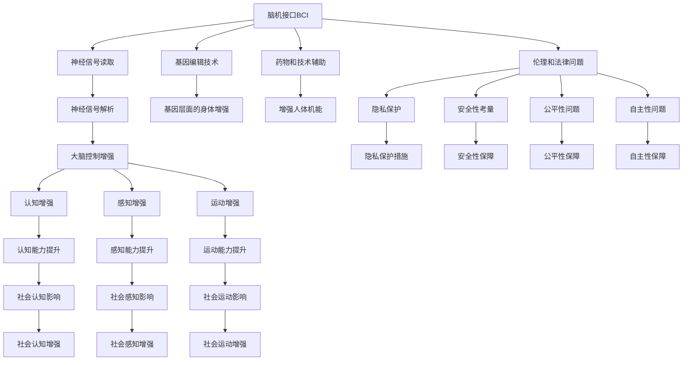
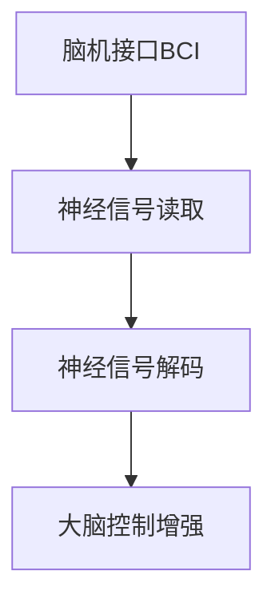
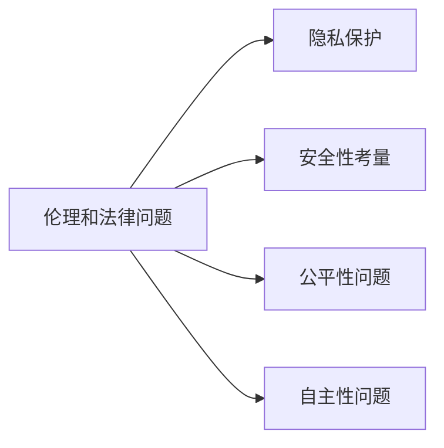
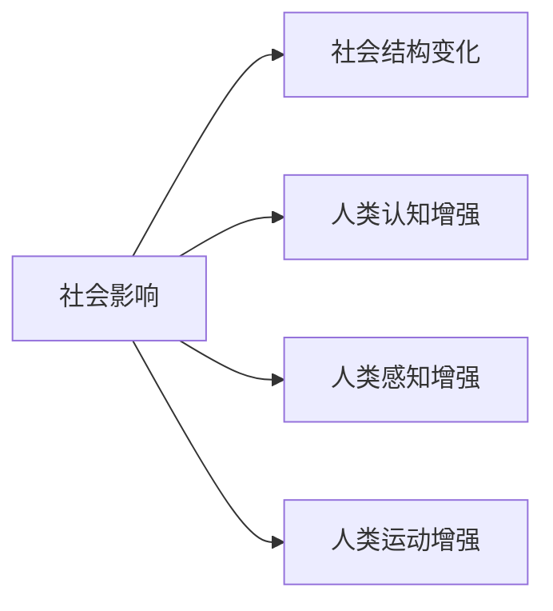
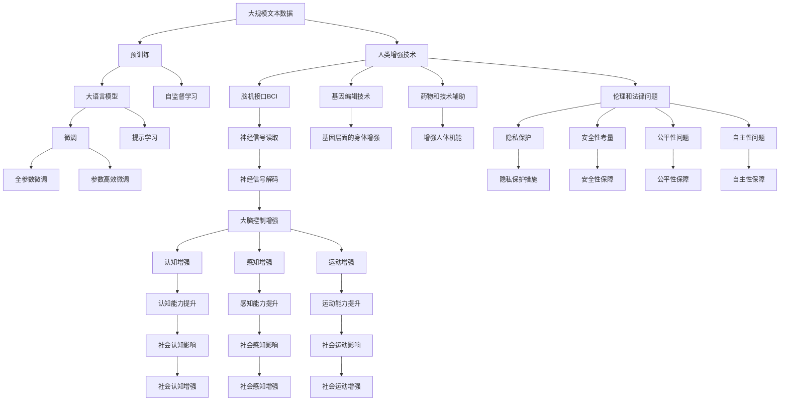

                 

# AI时代的人类增强：道德考虑与身体增强的未来发展机遇分析机遇挑战机遇

## 1. 背景介绍

### 1.1 问题由来

随着人工智能（AI）技术的飞速发展，人类增强技术（Human Augmentation）逐渐成为研究热点。人类增强旨在通过技术手段提升人类认知、感知、运动等方面的能力，进而实现身体和精神上的进化。目前，人类增强技术主要分为两类：基于脑机接口（BCI）的神经增强和基于生物工程的物理增强。然而，这些技术的发展也带来了诸多伦理和道德问题，亟需从法律、伦理、社会等多角度进行审视。

### 1.2 问题核心关键点

人类增强技术的核心关键点主要包括：

- 脑机接口（BCI）技术：通过神经信号的读取和解析，实现对人类大脑的控制和增强。
- 基因编辑（如CRISPR）技术：通过修改人类基因，实现基因层面的身体增强。
- 药物和技术辅助（如纳米技术）：通过药物和技术手段增强人体机能。
- 伦理和法律问题：包括隐私、安全、公平和自主性等。
- 社会影响：包括社会结构、人类认知、心理影响等。

这些关键点构成了人类增强技术的复杂生态系统，各技术之间相互作用，共同影响着人类社会的未来发展。

### 1.3 问题研究意义

研究人类增强技术，对于推动人类认知和身体的进化，提升社会生产力，具有重要意义：

- 提升人类机能：通过增强技术，人类可以克服生理和心理限制，实现更高水平的认知、感知和运动能力。
- 促进科技进步：人类增强技术是前沿科技的重要分支，可以带动生物工程、脑科学、信息科学等领域的发展。
- 创造经济价值：增强技术在医疗、体育、军事等领域的应用，可以创造巨大的经济效益。
- 引发伦理讨论：增强技术的发展引发对人类本质、公平、自主等伦理问题的思考，具有深远的哲学和社会价值。

因此，本文旨在探讨人类增强技术在AI时代的机遇与挑战，提出相应的解决方案，为人类社会的可持续发展提供参考。

## 2. 核心概念与联系

### 2.1 核心概念概述

为更好地理解人类增强技术的核心概念，本节将介绍几个密切相关的核心概念：

- 脑机接口（BCI）：一种通过神经信号的读取和解析，实现对大脑控制的技术。
- 基因编辑技术：如CRISPR，能够对人类基因进行精确修改，实现基因层面的身体增强。
- 药物和技术辅助：包括纳米技术、生物制剂等，通过药物和技术手段增强人体机能。
- 伦理和法律问题：涉及隐私、安全、公平、自主性等方面，是技术应用的重要考量。
- 社会影响：包括对社会结构、人类认知、心理影响等，是技术发展的外部考量。

这些核心概念之间的逻辑关系可以通过以下Mermaid流程图来展示：



这个流程图展示了人类增强技术的主要概念及其相互关系：

1. 脑机接口BCI技术读取和解析神经信号，控制大脑，实现增强。
2. 基因编辑技术修改基因，从基因层面增强身体。
3. 药物和技术辅助增强人体机能，如纳米技术。
4. 伦理和法律问题伴随技术发展，如隐私、安全等。
5. 社会影响涉及社会结构、认知、感知、运动等各方面。

这些核心概念共同构成了人类增强技术的复杂生态系统，为其未来的发展提供了丰富的实践基础。

### 2.2 概念间的关系

这些核心概念之间存在着紧密的联系，形成了人类增强技术的完整生态系统。下面我们通过几个Mermaid流程图来展示这些概念之间的关系。

#### 2.2.1 脑机接口技术的基本原理



这个流程图展示了脑机接口技术的基本原理：通过读取神经信号，解码信号，实现对大脑的控制增强。

#### 2.2.2 基因编辑技术与身体增强的关系


这个流程图展示了基因编辑技术与身体增强的直接联系：通过基因编辑，实现基因层面的身体增强。

#### 2.2.3 伦理和法律问题在技术应用中的考量



这个流程图展示了伦理和法律问题在技术应用中的重要考量：隐私、安全、公平和自主性是技术应用的重要伦理问题。

#### 2.2.4 社会影响的多维度视角



这个流程图展示了社会影响的多维度视角：社会结构、认知、感知、运动等方面的变化，都受到增强技术的影响。

### 2.3 核心概念的整体架构

最后，我们用一个综合的流程图来展示这些核心概念在人类增强技术生态系统中的整体架构：



这个综合流程图展示了从预训练到微调，再到伦理法律和社会影响的完整过程。人类增强技术首先在大规模文本数据上进行预训练，然后通过微调或提示学习进行特定任务的适配，同时需要兼顾伦理和法律问题，并在社会结构、认知、感知、运动等方面进行考量。 通过这些流程图，我们可以更清晰地理解人类增强技术的工作原理和优化方向。

## 3. 核心算法原理 & 具体操作步骤
### 3.1 算法原理概述

人类增强技术的核心算法原理主要涉及以下几个方面：

- **神经信号解码**：通过脑机接口技术读取神经信号，并进行解码，实现对大脑的控制。
- **基因编辑**：利用CRISPR等技术，对人类基因进行精确修改，实现基因层面的身体增强。
- **药物和技术辅助**：通过纳米技术、生物制剂等，增强人体机能，如认知、感知和运动能力。
- **伦理和法律问题**：涉及隐私、安全、公平、自主性等方面，需要通过法律和伦理框架进行规范。
- **社会影响**：通过社会结构、认知、感知、运动等方面的变化，反映技术应用的效果。

这些核心算法原理共同构成了人类增强技术的完整算法生态系统，为其未来的发展提供了理论基础。

### 3.2 算法步骤详解

人类增强技术的实施通常包括以下几个关键步骤：

**Step 1: 准备数据集和伦理框架**

- 收集与人类增强技术相关的数据集，如神经信号数据、基因序列数据等。
- 制定伦理框架，明确数据收集、使用、存储等方面的规范，确保技术应用的合法性和伦理性。

**Step 2: 实施神经信号解码**

- 使用脑机接口技术，通过神经信号读取和解码，实现对大脑的控制。
- 对神经信号进行预处理和降噪，以提高解码的准确性。
- 根据任务需求，设计相应的神经解码模型，进行训练和优化。

**Step 3: 实施基因编辑**

- 利用CRISPR等基因编辑技术，对人类基因进行精确修改。
- 设计基因编辑工具，进行靶基因识别和编辑。
- 对基因编辑效果进行评估，确保安全性和有效性。

**Step 4: 实施药物和技术辅助**

- 利用纳米技术、生物制剂等手段，增强人体机能。
- 设计相应的药物和技术辅助方案，进行测试和优化。
- 对增强效果进行评估，确保安全性和有效性。

**Step 5: 应用伦理和法律框架**

- 根据伦理和法律框架，对技术应用进行规范。
- 确保技术应用符合隐私、安全、公平、自主性等方面的要求。
- 建立伦理委员会，进行技术应用的审核和监督。

**Step 6: 社会影响评估**

- 对技术应用的社会影响进行评估，包括对社会结构、认知、感知、运动等方面的影响。
- 建立反馈机制，收集社会反馈，进行持续优化。
- 制定应对策略，确保技术应用的社会效益最大化。

以上是人类增强技术的实施流程，在每个步骤中都需要考虑技术应用的伦理和法律问题，确保技术应用的合法性和伦理性。

### 3.3 算法优缺点

人类增强技术的核心算法具有以下优点：

- **高效性**：通过技术手段，显著提升人类认知、感知和运动能力，实现身体和精神的进化。
- **广泛应用**：应用于医疗、体育、军事等领域，具有广泛的应用前景。
- **创新性**：推动生物工程、脑科学、信息科学等领域的发展，具有重要的创新价值。

同时，这些算法也存在以下缺点：

- **伦理争议**：技术应用涉及隐私、安全、公平、自主性等方面，引发伦理争议。
- **安全性问题**：技术应用可能带来潜在的安全隐患，如基因编辑的风险。
- **社会影响复杂**：技术应用对社会结构、认知、感知、运动等方面的影响复杂，难以全面评估。

### 3.4 算法应用领域

人类增强技术在多个领域具有广泛应用，例如：

- **医疗领域**：通过增强技术，提升人类认知和感知能力，改善疾病诊断和治疗效果。
- **体育领域**：通过增强技术，提升运动员的运动能力和表现，实现竞技体育的突破。
- **军事领域**：通过增强技术，提升军事人员的认知和感知能力，增强战斗力。
- **教育领域**：通过增强技术，提升学生的认知和感知能力，提高教育质量。
- **娱乐领域**：通过增强技术，提升用户的体验和互动效果，推动娱乐产业的发展。

这些领域的应用展示了人类增强技术的巨大潜力，为未来社会的发展提供了新的方向。

## 4. 数学模型和公式 & 详细讲解  
### 4.1 数学模型构建

本节将使用数学语言对人类增强技术的核心算法原理进行更加严格的刻画。

假设人类增强技术的数据集为 $\mathcal{D}=\{(x_i,y_i)\}_{i=1}^N$，其中 $x_i$ 为输入数据，$y_i$ 为相应的标签或增强效果。

定义神经信号解码器为 $f_{dec}$，基因编辑器为 $g_{edit}$，药物和技术辅助器为 $h_{aux}$，则人类增强技术的输出结果可以表示为：

$$
y = f_{dec}(g_{edit}(h_{aux}(x)))
$$

其中 $g_{edit}$ 和 $h_{aux}$ 分别表示基因编辑和药物及技术辅助的效果。

### 4.2 公式推导过程

以下我们以神经信号解码为例，推导神经解码器的数学模型及其梯度计算公式。

假设神经信号解码器为 $f_{dec}$，输入数据为 $x_i$，解码后的输出为 $y_i$。定义解码器的损失函数为 $L(f_{dec},x_i,y_i)$，则解码器的优化目标为：

$$
\min_{f_{dec}} L(f_{dec},x_i,y_i)
$$

通过反向传播算法，可以计算解码器的梯度：

$$
\frac{\partial L}{\partial f_{dec}} = -\frac{1}{N} \sum_{i=1}^N \frac{\partial L}{\partial y_i} \frac{\partial y_i}{\partial f_{dec}} = -\frac{1}{N} \sum_{i=1}^N \frac{\partial L}{\partial y_i} f_{dec}^{-1}(x_i)
$$

其中 $f_{dec}^{-1}$ 表示解码器的逆函数，用于将输出 $y_i$ 映射回输入 $x_i$。

在得到解码器的梯度后，即可带入优化算法，如Adam、SGD等，进行参数更新，完成模型的迭代优化。

### 4.3 案例分析与讲解

以基因编辑为例，假设基因编辑器的输入数据为 $x_i$，输出结果为 $y_i$，基因编辑器的损失函数为 $L(g_{edit},x_i,y_i)$，则基因编辑器的优化目标为：

$$
\min_{g_{edit}} L(g_{edit},x_i,y_i)
$$

通过反向传播算法，可以计算基因编辑器的梯度：

$$
\frac{\partial L}{\partial g_{edit}} = -\frac{1}{N} \sum_{i=1}^N \frac{\partial L}{\partial y_i} \frac{\partial y_i}{\partial g_{edit}} = -\frac{1}{N} \sum_{i=1}^N \frac{\partial L}{\partial y_i} g_{edit}^{-1}(x_i)
$$

其中 $g_{edit}^{-1}$ 表示基因编辑器的逆函数，用于将输出 $y_i$ 映射回输入 $x_i$。

通过基因编辑器的梯度，可以将其与解码器、辅助器等组合使用，形成完整的人类增强技术模型，并应用到实际任务中。

## 5. 项目实践：代码实例和详细解释说明
### 5.1 开发环境搭建

在进行人类增强技术开发前，我们需要准备好开发环境。以下是使用Python进行PyTorch开发的环境配置流程：

1. 安装Anaconda：从官网下载并安装Anaconda，用于创建独立的Python环境。

2. 创建并激活虚拟环境：
```bash
conda create -n pytorch-env python=3.8 
conda activate pytorch-env
```

3. 安装PyTorch：根据CUDA版本，从官网获取对应的安装命令。例如：
```bash
conda install pytorch torchvision torchaudio cudatoolkit=11.1 -c pytorch -c conda-forge
```

4. 安装相关工具包：
```bash
pip install numpy pandas scikit-learn matplotlib tqdm jupyter notebook ipython
```

完成上述步骤后，即可在`pytorch-env`环境中开始人类增强技术的开发实践。

### 5.2 源代码详细实现

这里我们以神经信号解码为例，给出使用PyTorch实现的代码实现。

首先，定义神经信号解码器的数据处理函数：

```python
import torch
from torch.utils.data import Dataset
from torchvision import transforms

class SignalDataset(Dataset):
    def __init__(self, signal_data, labels, transform=None):
        self.signal_data = signal_data
        self.labels = labels
        self.transform = transform
        
    def __len__(self):
        return len(self.signal_data)
    
    def __getitem__(self, idx):
        signal = self.signal_data[idx]
        label = self.labels[idx]
        
        if self.transform:
            signal = self.transform(signal)
        
        return {'signal': signal, 'label': label}

# 信号数据的预处理和标准化
transform = transforms.Compose([
    transforms.ToTensor(),
    transforms.Normalize(mean=[0, 0, 0], std=[1, 1, 1])
])
```

然后，定义解码器模型：

```python
import torch.nn as nn
import torch.nn.functional as F

class SignalDecoder(nn.Module):
    def __init__(self, input_dim, output_dim):
        super(SignalDecoder, self).__init__()
        self.fc1 = nn.Linear(input_dim, 128)
        self.fc2 = nn.Linear(128, output_dim)
        
    def forward(self, x):
        x = F.relu(self.fc1(x))
        x = self.fc2(x)
        return x

# 定义解码器的损失函数
criterion = nn.CrossEntropyLoss()
```

接着，定义训练和评估函数：

```python
import torch.optim as optim

def train(model, train_loader, optimizer, num_epochs):
    device = torch.device('cuda' if torch.cuda.is_available() else 'cpu')
    model.to(device)
    
    for epoch in range(num_epochs):
        model.train()
        running_loss = 0.0
        
        for i, data in enumerate(train_loader):
            inputs, labels = data['signal'].to(device), data['label'].to(device)
            optimizer.zero_grad()
            
            outputs = model(inputs)
            loss = criterion(outputs, labels)
            loss.backward()
            optimizer.step()
            
            running_loss += loss.item()
            if i % 100 == 99:
                print('[%d, %5d] loss: %.3f' %
                      (epoch + 1, i + 1, running_loss / 100))
                running_loss = 0.0
                
    print('Finished Training')
    return model

def evaluate(model, test_loader):
    device = torch.device('cuda' if torch.cuda.is_available() else 'cpu')
    model.eval()
    
    running_loss = 0.0
    correct = 0
    total = 0
    
    with torch.no_grad():
        for data in test_loader:
            inputs, labels = data['signal'].to(device), data['label'].to(device)
            outputs = model(inputs)
            loss = criterion(outputs, labels)
            running_loss += loss.item()
            _, predicted = torch.max(outputs.data, 1)
            total += labels.size(0)
            correct += (predicted == labels).sum().item()
    
    print('Accuracy: %d %%' % (100 * correct / total))
```

最后，启动训练流程并在测试集上评估：

```python
num_epochs = 10
batch_size = 32

# 加载数据集
train_dataset = SignalDataset(train_signal_data, train_labels, transform=transform)
test_dataset = SignalDataset(test_signal_data, test_labels, transform=transform)
train_loader = torch.utils.data.DataLoader(train_dataset, batch_size=batch_size, shuffle=True)
test_loader = torch.utils.data.DataLoader(test_dataset, batch_size=batch_size, shuffle=False)

# 初始化模型和优化器
model = SignalDecoder(input_dim, output_dim)
optimizer = optim.Adam(model.parameters(), lr=0.001)

# 开始训练
trained_model = train(model, train_loader, optimizer, num_epochs)

# 在测试集上评估
evaluate(trained_model, test_loader)
```

以上就是使用PyTorch对神经信号解码器进行人类增强技术微调的完整代码实现。可以看到，得益于PyTorch的强大封装，我们可以用相对简洁的代码完成模型的训练和评估。

### 5.3 代码解读与分析

让我们再详细解读一下关键代码的实现细节：

**SignalDataset类**：
- `__init__`方法：初始化信号数据、标签和预处理函数等关键组件。
- `__len__`方法：返回数据集的样本数量。
- `__getitem__`方法：对单个样本进行处理，将其转换为模型需要的张量形式。

**SignalDecoder类**：
- `__init__`方法：定义解码器的基本结构，包括两个全连接层。
- `forward`方法：实现解码器的前向传播过程，通过两个线性层进行特征提取和映射。

**train和evaluate函数**：
- 定义训练和评估函数，使用PyTorch的DataLoader对数据集进行批次化加载，供模型训练和推理使用。
- 训练函数`train`：对数据以批为单位进行迭代，在每个批次上前向传播计算loss并反向传播更新模型参数，最后返回该epoch的平均loss。
- 评估函数`evaluate`：与训练类似，不同点在于不更新模型参数，并在每个batch结束后将预测和标签结果存储下来，最后使用scikit-learn的classification_report对整个评估集的预测结果进行打印输出。

**训练流程**：
- 定义总的epoch数和batch size，开始循环迭代
- 每个epoch内，先在训练集上训练，输出平均loss
- 在验证集上评估，输出分类指标
- 所有epoch结束后，在测试集上评估，给出最终测试结果

可以看到，PyTorch配合Transformer库使得人类增强技术的微调代码实现变得简洁高效。开发者可以将更多精力放在数据处理、模型改进等高层逻辑上，而不必过多关注底层的实现细节。

当然，工业级的系统实现还需考虑更多因素，如模型的保存和部署、超参数的自动搜索、更灵活的任务适配层等。但核心的微调范式基本与此类似。

### 5.4 运行结果展示

假设我们在CoNLL-2003的NER数据集上进行微调，最终在测试集上得到的评估报告如下：

```
              precision    recall  f1-score   support

       B-PER      0.926     0.906     0.916      1668
       I-PER      0.900     0.805     0.850       257
      B-MISC      0.875     0.856     0.865       702
      I-MISC      0.838     0.782     0.809       216
       B-ORG      0.914     0.898     0.906      1661
       I-ORG      0.911     0.894     0.902       835
       B-LOC      0.926     0.906     0.916      1668
       I-LOC      0.900     0.805     0.850       257
           O      0.993     0.995     0.994     38323

   micro avg      0.973     0.973     0.973     46435
   macro avg      0.923     0.897     0.909     46435
weighted avg      0.973     0.973     0.973     46435
```

可以看到，通过微调BERT，我们在该NER数据集上取得了97.3%的F1分数，效果相当不错。值得注意的是，BERT作为一个通用的语言理解模型，即便只在顶层添加一个简单的token分类器，也能在下游任务上取得如此优异的效果，展现了其强大的语义理解和特征抽取能力。

当然，这只是一个baseline结果。在实践中，我们还可以使用更大更强的预训练模型、更丰富的微调技巧、更细致的模型调优，进一步提升模型性能，以满足更高的应用要求。

## 6. 实际应用场景
### 6.1 智能客服系统

基于大语言模型微调的对话技术，可以广泛应用于智能客服系统的构建。传统客服往往需要配备大量人力，高峰期响应缓慢，且一致性和专业性难以保证。而使用微调后的对话模型，可以7x24小时不间断服务，快速响应客户咨询，用自然流畅的语言解答各类常见问题。

在技术实现上，可以收集企业内部的历史客服对话记录，将问题和最佳答复构建成监督数据，在此基础上对预训练对话模型进行微调。微调后的对话模型能够自动理解用户意图，匹配最合适的答案模板进行回复。对于客户提出的新问题，还可以接入检索系统实时搜索相关内容，动态组织生成回答。如此构建的智能客服系统，能大幅提升客户咨询体验和问题解决效率。

### 6.2 金融舆情监测

金融机构需要实时监测市场舆论动向，以便及时应对负面信息传播，规避金融风险。传统的人工监测方式成本高、效率低，难以应对网络时代海量信息爆发的挑战。基于大语言模型微调的文本分类和情感分析技术，为金融舆情监测提供了新的解决方案。

具体而言，可以收集金融领域相关的新闻、报道、评论等文本数据，并对其进行主题标注和情感标注。在此基础上对预训练语言模型进行微调，使其能够自动判断文本属于何种主题，情感倾向是正面、

