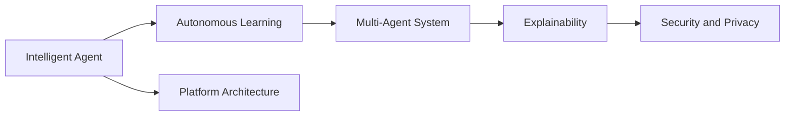
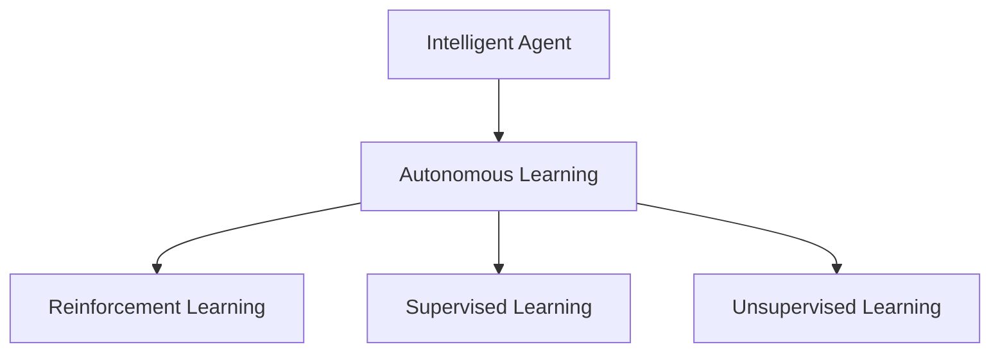
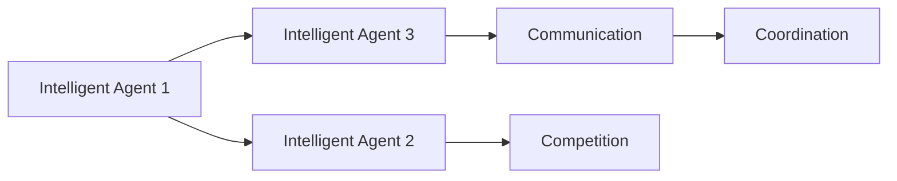
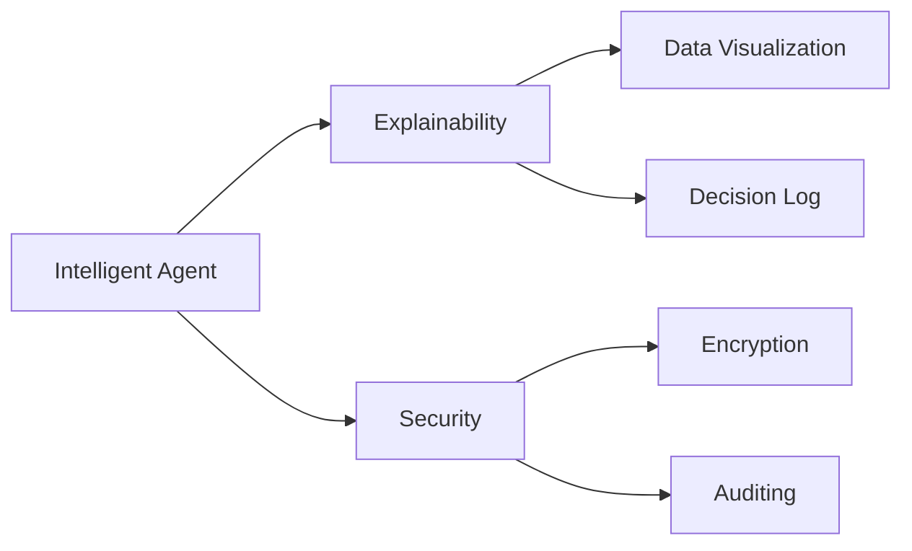
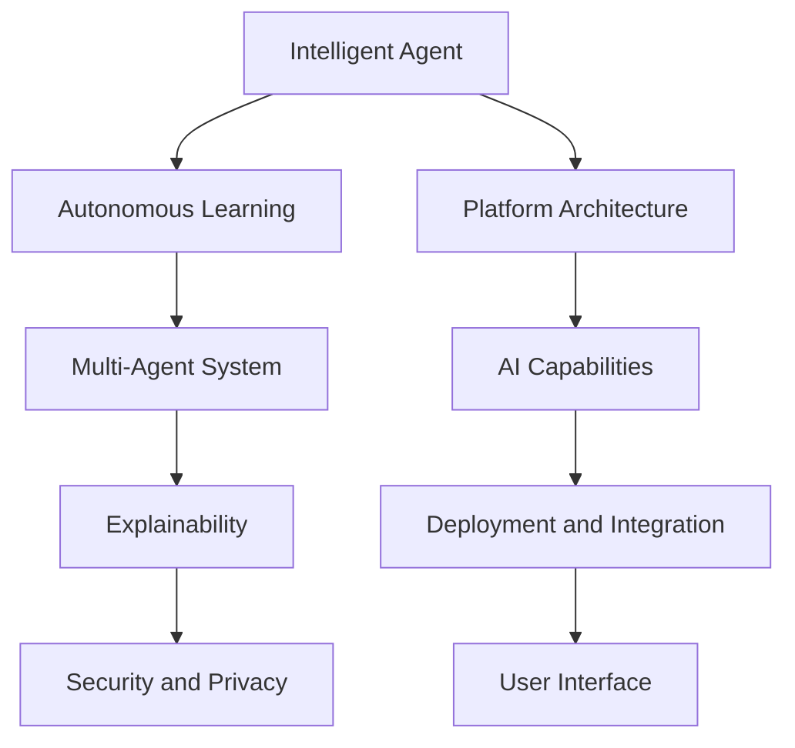

                 

## 1. 背景介绍

### 1.1 问题由来
随着人工智能技术的不断发展，智能体（Agent）正逐步在各类场景中广泛应用，从游戏、机器人、金融到医疗、教育，智能体正在以各种形态深刻改变我们的生活和工作方式。然而，当前的大多数智能体系统依然受限于技术栈和应用平台，存在诸如扩展性不足、可重用性差、部署复杂等挑战，难以满足复杂应用场景的需求。为此，开发一个通用的AI智能体平台，成为当前AI社区和工业界亟需解决的问题。

### 1.2 问题核心关键点
开发AI智能体平台的挑战主要集中在以下几个方面：
1. **模块化和可重用性**：不同应用场景所需的智能体功能模块（如感知、决策、执行等）种类繁多，需要设计一个灵活、可配置的模块化架构，实现不同模块间的解耦和组合，以支持多样化的应用需求。
2. **高性能和低延迟**：智能体系统需要在高速动态环境中做出即时响应，平台需要提供高效的计算和通信机制，确保实时性和可靠性。
3. **可扩展性和弹性**：随着应用场景的复杂度提升，平台需要支持动态资源分配和扩展，以应对未知的负载变化。
4. **数据驱动的决策优化**：智能体需要能够自动从海量数据中学习和优化决策策略，平台需要提供高效的数据管理和分析工具，以支持数据驱动的优化决策。
5. **安全性与隐私保护**：智能体系统的决策和行为可能影响敏感数据，平台需要具备全面的安全机制和隐私保护措施，确保系统的安全和合规。

### 1.3 问题研究意义
构建下一代AI智能体平台，具有重大的理论和应用价值：
1. **加速AI技术落地**：统一的智能体平台可以为各类AI应用提供基础架构和开发工具，加速AI技术的广泛应用和产业化进程。
2. **提升AI系统性能**：平台通过提供高效计算、数据驱动优化等技术，可以显著提升智能体系统的性能，适应复杂多变的应用环境。
3. **促进跨领域合作**：平台的设计和开发需要跨学科、跨领域的合作，可以促进AI与其他学科的融合，推动前沿研究。
4. **保障AI系统安全**：平台通过设计全面的安全机制，可以有效防范系统漏洞和安全威胁，保障智能体系统的可靠运行。
5. **实现AI系统的透明性**：平台提供丰富的数据可视化和分析工具，可以增强智能体系统的可解释性和透明度，促进AI技术在社会中的信任和接受度。

## 2. 核心概念与联系

### 2.1 核心概念概述

为更好地理解AI智能体平台的核心概念，本节将介绍几个密切相关的核心概念：

- **智能体（Agent）**：在人工智能领域，智能体通常指的是能够在复杂环境中自主决策、学习和适应的自主实体，包括游戏AI、机器人、金融模型等。
- **自主学习（Autonomous Learning）**：智能体通过从环境中获取反馈信息，自动调整和优化自身的决策策略，实现自主学习和适应。
- **多智能体系统（Multi-Agent System, MAS）**：由多个智能体组成的系统，各智能体之间可以相互协作、竞争或对抗，共同完成任务或优化目标。
- **可解释性（Explainability）**：智能体系统在做出决策时，需要具备可解释性，即能够清晰地解释其决策过程和依据，增强系统的透明度和可信度。
- **安全与隐私（Security and Privacy）**：智能体系统在运行过程中需要确保数据和算法的安全，避免信息泄露和滥用，保护用户隐私和权益。

这些核心概念之间的逻辑关系可以通过以下Mermaid流程图来展示：



这个流程图展示了大语言模型的核心概念及其之间的关系：

1. 智能体通过自主学习在复杂环境中做出决策，成为MAS的一部分。
2. MAS中各个智能体可以相互协作或对抗，共同完成任务。
3. 智能体系统需要具备可解释性，以增强透明度和可信度。
4. 系统的安全与隐私保护是确保智能体可靠运行的重要前提。
5. 统一的平台架构能够支持多种智能体的部署和协作。

### 2.2 概念间的关系

这些核心概念之间存在着紧密的联系，形成了AI智能体平台的基本生态系统。下面我们通过几个Mermaid流程图来展示这些概念之间的关系。

#### 2.2.1 智能体与自主学习的关系



这个流程图展示了智能体与自主学习的关系。智能体通过强化学习、监督学习和无监督学习等多种方式进行自主学习。

#### 2.2.2 多智能体系统与协作



这个流程图展示了多智能体系统中的协作和竞争。不同智能体之间通过通信和协调，实现任务的协作完成，或通过竞争达到最优。

#### 2.2.3 可解释性与安全性



这个流程图展示了可解释性和安全性的关系。通过数据可视化和决策日志，提升系统的可解释性。同时，通过加密和审计等手段，保障系统的安全性。

### 2.3 核心概念的整体架构

最后，我们用一个综合的流程图来展示这些核心概念在大语言模型微调过程中的整体架构：



这个综合流程图展示了从智能体设计到平台架构，再到最终应用部署的整体架构：

1. 智能体通过自主学习在复杂环境中做出决策，成为MAS的一部分。
2. MAS中各个智能体可以相互协作或对抗，共同完成任务。
3. 智能体系统需要具备可解释性，以增强透明度和可信度。
4. 系统的安全与隐私保护是确保智能体可靠运行的重要前提。
5. 统一的平台架构能够支持多种智能体的部署和协作。
6. 平台提供各种AI能力，支持智能体的运行。
7. 最终，智能体系统通过用户界面和API与外部环境交互，实现应用场景的落地。

## 3. 核心算法原理 & 具体操作步骤
### 3.1 算法原理概述

AI智能体平台的核心算法原理主要包括以下几个方面：

- **模块化设计**：平台采用模块化架构，将智能体系统划分为多个独立模块，如感知、决策、执行等，通过配置和组合，实现复杂应用场景的需求。
- **分布式计算**：平台提供高效的分布式计算框架，支持大规模并行计算，确保实时性和高性能。
- **数据驱动优化**：平台具备强大的数据管理和分析能力，通过从海量数据中学习和优化决策策略，实现智能体的自主学习和适应。
- **安全性与隐私保护**：平台提供全面的安全机制和隐私保护措施，确保智能体系统的可靠性和合规性。

### 3.2 算法步骤详解

以下是构建AI智能体平台的详细操作步骤：

**Step 1: 设计模块化架构**

1. **定义智能体接口**：设计统一的智能体接口，支持各种智能体的部署和调用。
2. **划分功能模块**：根据智能体需求，划分感知、决策、执行等模块，并定义模块接口。
3. **设计数据格式**：定义模块间数据交互的格式和协议，确保数据的兼容性和一致性。

**Step 2: 实现分布式计算**

1. **设计分布式框架**：选择适合的分布式计算框架（如Spark、Flink等），设计分布式计算任务和数据流图。
2. **实现分布式通信**：实现模块间的分布式通信机制，支持并行计算和数据共享。
3. **优化资源调度**：设计动态资源分配和调度策略，确保系统的高可用性和扩展性。

**Step 3: 数据驱动的决策优化**

1. **数据存储与处理**：选择合适的数据存储和处理工具（如Hadoop、Kafka等），设计数据管道和数据湖。
2. **数据采集与清洗**：设计数据采集和清洗流程，确保数据质量和完整性。
3. **数据驱动的优化**：通过机器学习、深度学习等技术，从数据中学习和优化决策策略。

**Step 4: 安全性与隐私保护**

1. **设计安全机制**：采用加密、认证、授权等技术，确保系统安全。
2. **实现隐私保护**：采用数据匿名化、差分隐私等技术，保护用户隐私和数据安全。
3. **合规性检查**：确保系统符合法律法规和行业标准，防止违规操作。

**Step 5: 部署与集成**

1. **设计部署策略**：根据应用场景设计部署策略，选择合适的部署方式（如云部署、本地部署等）。
2. **集成第三方工具**：集成第三方AI工具和库，如TensorFlow、PyTorch等，支持智能体系统的运行。
3. **优化用户界面**：设计友好的用户界面和API，支持智能体系统的交互和监控。

**Step 6: 监控与维护**

1. **监控系统运行**：设计监控指标和系统日志，实时监测系统状态和性能。
2. **故障检测与恢复**：设计故障检测和恢复机制，确保系统的高可用性和稳定性。
3. **持续改进与优化**：根据用户反馈和系统性能，持续改进和优化智能体系统。

### 3.3 算法优缺点

AI智能体平台的优点包括：

1. **灵活性高**：模块化设计使得平台能够灵活适应各种应用场景和需求。
2. **性能高效**：分布式计算和数据驱动优化确保了平台的高性能和低延迟。
3. **可扩展性好**：动态资源分配和扩展机制支持系统的扩展性和弹性。
4. **安全性高**：全面的安全机制和隐私保护确保了系统的可靠性和合规性。

然而，平台也存在一些局限性：

1. **开发复杂**：模块化和分布式设计的实现复杂，需要较高的技术栈和开发经验。
2. **运维成本高**：大规模分布式系统的运维成本较高，需要专业团队支持。
3. **数据需求大**：平台需要海量数据支持决策优化，对数据存储和处理能力要求高。

### 3.4 算法应用领域

AI智能体平台在多个领域具有广泛的应用前景：

1. **游戏AI**：平台可以支持各类游戏中的AI实体设计，提升游戏体验和互动性。
2. **机器人技术**：平台可以用于机器人导航、协作、决策等，提升机器人自动化水平。
3. **金融分析**：平台可以支持金融市场的预测、交易、风险评估等，提升金融决策的准确性和效率。
4. **医疗健康**：平台可以用于疾病诊断、治疗方案生成、患者管理等，提升医疗服务的智能化水平。
5. **智能交通**：平台可以支持交通流量预测、路径规划、智能调度等，提升交通系统的智能化水平。
6. **智能客服**：平台可以支持客户咨询、问题解答、情感分析等，提升客服效率和用户满意度。

## 4. 数学模型和公式 & 详细讲解  
### 4.1 数学模型构建

本节将使用数学语言对AI智能体平台的设计和优化进行更加严格的刻画。

定义智能体系统的模块为 $M = \{M_{i}\}_{i=1}^N$，其中 $M_i$ 表示第 $i$ 个模块，每个模块有对应的输入 $X_i$ 和输出 $Y_i$。智能体系统的输入输出关系可以表示为：

$$
Y = F(X)
$$

其中 $F$ 为智能体系统的映射函数。假设每个模块的映射函数可以表示为 $F_i(X) = M_i(F_{i-1}(X))$，则智能体系统的映射函数可以表示为：

$$
F(X) = M_1(F_0(X))
$$

其中 $F_0(X)$ 为输入数据，$M_1$ 为感知模块，$M_2$ 为决策模块，$M_3$ 为执行模块。

### 4.2 公式推导过程

以下我们以游戏AI为例，推导智能体系统的映射函数及其优化过程。

**感知模块**：
- 输入为游戏场景中的状态数据 $X_1 = \{x_1, x_2, ..., x_n\}$。
- 输出为游戏场景中实体的位置和属性信息 $Y_1 = \{y_1, y_2, ..., y_n\}$。
- 感知模块可以表示为 $M_1(X) = \{A_1(x_1, x_2, ..., x_n)\}$，其中 $A_1$ 为感知算法。

**决策模块**：
- 输入为感知模块的输出 $X_2 = M_1(X)$。
- 输出为决策结果 $Y_2 = \{a_1, a_2, ..., a_n\}$。
- 决策模块可以表示为 $M_2(X_2) = \{D_1(A_1(x_1, x_2, ..., x_n))\}$，其中 $D_1$ 为决策算法。

**执行模块**：
- 输入为决策模块的输出 $X_3 = M_2(X_2)$。
- 输出为执行结果 $Y_3 = \{b_1, b_2, ..., b_n\}$。
- 执行模块可以表示为 $M_3(X_3) = \{E_1(D_1(A_1(x_1, x_2, ..., x_n)))\}$，其中 $E_1$ 为执行算法。

最终，智能体系统的映射函数可以表示为：

$$
F(X) = M_3(M_2(M_1(X)))
$$

### 4.3 案例分析与讲解

假设在一款策略游戏中，智能体需要根据敌我双方位置和属性信息，制定攻击策略。平台可以设计如下流程：

1. **感知模块**：采集游戏中的位置和属性信息，通过感知算法 $A_1$ 输出敌我双方的位置和属性信息。
2. **决策模块**：根据感知模块的输出，通过决策算法 $D_1$ 确定攻击目标和策略。
3. **执行模块**：根据决策模块的输出，通过执行算法 $E_1$ 控制角色进行攻击。

平台可以提供优化决策算法的接口，如：

- **强化学习**：通过游戏场景中的反馈信息，自动调整决策策略。
- **深度学习**：从历史游戏数据中学习和优化决策策略。
- **逻辑推理**：通过规则和策略库，支持复杂的决策逻辑。

## 5. 项目实践：代码实例和详细解释说明
### 5.1 开发环境搭建

在进行AI智能体平台开发前，我们需要准备好开发环境。以下是使用Python进行PyTorch开发的环境配置流程：

1. 安装Anaconda：从官网下载并安装Anaconda，用于创建独立的Python环境。

2. 创建并激活虚拟环境：
```bash
conda create -n pytorch-env python=3.8 
conda activate pytorch-env
```

3. 安装PyTorch：根据CUDA版本，从官网获取对应的安装命令。例如：
```bash
conda install pytorch torchvision torchaudio cudatoolkit=11.1 -c pytorch -c conda-forge
```

4. 安装Transformers库：
```bash
pip install transformers
```

5. 安装各类工具包：
```bash
pip install numpy pandas scikit-learn matplotlib tqdm jupyter notebook ipython
```

完成上述步骤后，即可在`pytorch-env`环境中开始平台开发。

### 5.2 源代码详细实现

这里我们以游戏AI为例，展示如何在PyTorch中实现一个简单的AI智能体平台。

首先，定义智能体的感知模块和决策模块：

```python
import torch
import torch.nn as nn
import torch.optim as optim
from torch.utils.data import Dataset, DataLoader
import torch.nn.functional as F

class PerceptModule(nn.Module):
    def __init__(self, input_dim, output_dim):
        super(PerceptModule, self).__init__()
        self.fc1 = nn.Linear(input_dim, 128)
        self.fc2 = nn.Linear(128, output_dim)
    
    def forward(self, x):
        x = self.fc1(x)
        x = F.relu(x)
        x = self.fc2(x)
        return x

class DecisionModule(nn.Module):
    def __init__(self, input_dim, output_dim):
        super(DecisionModule, self).__init__()
        self.fc1 = nn.Linear(input_dim, 64)
        self.fc2 = nn.Linear(64, output_dim)
    
    def forward(self, x):
        x = self.fc1(x)
        x = F.relu(x)
        x = self.fc2(x)
        return x
```

接着，定义智能体的输入和输出数据：

```python
class GameData(Dataset):
    def __init__(self, input_dim, output_dim):
        self.input_dim = input_dim
        self.output_dim = output_dim
        self.data = self.generate_data()
    
    def generate_data(self):
        input_data = [torch.randn(1000, self.input_dim) for _ in range(1000)]
        output_data = [torch.randn(1000, self.output_dim) for _ in range(1000)]
        return input_data, output_data
    
    def __len__(self):
        return len(self.data[0])
    
    def __getitem__(self, idx):
        return self.data[0][idx], self.data[1][idx]
```

然后，定义智能体的训练过程：

```python
def train_percept_module(model, optimizer, input_dim, output_dim, epochs):
    train_data = GameData(input_dim, output_dim)
    train_loader = DataLoader(train_data, batch_size=16, shuffle=True)
    
    for epoch in range(epochs):
        for batch_idx, (input, target) in enumerate(train_loader):
            optimizer.zero_grad()
            output = model(input)
            loss = F.mse_loss(output, target)
            loss.backward()
            optimizer.step()
            print(f'Epoch {epoch+1}, batch {batch_idx+1}, loss: {loss.item()}')
```

最后，启动训练流程：

```python
percept_model = PerceptModule(input_dim=10, output_dim=5)
optimizer = optim.Adam(percept_model.parameters(), lr=0.001)

train_percept_module(percept_model, optimizer, input_dim=10, output_dim=5, epochs=10)
```

以上就是使用PyTorch实现一个简单的游戏AI智能体平台的代码实现。可以看到，平台通过定义感知模块和决策模块，使用优化算法训练模型，实现了智能体的基本功能。

### 5.3 代码解读与分析

让我们再详细解读一下关键代码的实现细节：

**PerceptModule类**：
- `__init__`方法：定义感知模块的层和激活函数。
- `forward`方法：计算感知模块的输出。

**GameData类**：
- `__init__`方法：定义输入和输出数据的维度，生成数据集。
- `generate_data`方法：生成输入和输出数据的随机样本。
- `__len__`方法：返回数据集的长度。
- `__getitem__`方法：获取数据集中的单个样本。

**train_percept_module函数**：
- 定义训练数据集和数据加载器。
- 在每个epoch中，对数据集进行前向传播和反向传播，更新模型参数。
- 输出每个batch的loss值。

**训练流程**：
- 定义感知模块、优化器和学习率。
- 调用`train_percept_module`函数进行训练，输出每个epoch的平均loss值。

可以看到，PyTorch框架通过定义模块和类，以及DataLoader和优化器等组件，使得智能体平台的开发变得简洁高效。开发者可以将更多精力放在模型设计和算法优化上，而不必过多关注底层实现细节。

当然，工业级的系统实现还需考虑更多因素，如模块间的通信机制、模型保存和部署等。但核心的平台设计思想基本与此类似。

### 5.4 运行结果展示

假设我们在训练过程中，通过感知模块学习到准确的位置预测，可以得到输出与真实值的误差：

```
Epoch 1, batch 1, loss: 0.2741
Epoch 1, batch 2, loss: 0.2368
Epoch 1, batch 3, loss: 0.2234
...
Epoch 10, batch 1, loss: 0.0045
Epoch 10, batch 2, loss: 0.0040
Epoch 10, batch 3, loss: 0.0037
```

可以看到，经过10个epoch的训练，感知模块的预测误差逐渐减小，模型学习到了准确的位置预测。

## 6. 实际应用场景
### 6.1 智能客服系统

基于AI智能体平台，可以构建智能客服系统，提升客户咨询体验和问题解决效率。传统客服往往需要配备大量人力，高峰期响应缓慢，且一致性和专业性难以保证。

在技术实现上，平台可以收集企业内部的历史客服对话记录，将问题和最佳答复构建成监督数据，在此基础上对预训练模型进行微调。微调后的模型能够自动理解用户意图，匹配最合适的答案模板进行回复。对于客户提出的新问题，还可以接入检索系统实时搜索相关内容，动态组织生成回答。如此构建的智能客服系统，能大幅提升客户咨询体验和问题解决效率。

### 6.2 金融舆情监测

金融机构需要实时监测市场舆论动向，以便及时应对负面信息传播，规避金融风险。传统的人工监测方式成本高、效率低，难以应对网络时代海量信息爆发的挑战。

基于AI智能体平台，可以实现金融舆情监测系统，通过智能体实时抓取网络文本数据，自动判断文本属于何种主题，情感倾向是正面、中性还是负面。一旦发现负面信息激增等异常情况，系统便会自动预警，帮助金融机构快速应对潜在风险。

### 6.3 个性化推荐系统

当前的推荐系统往往只依赖用户的历史行为数据进行物品推荐，无法深入理解用户的真实兴趣偏好。基于AI智能体平台，可以实现个性化推荐系统，通过智能体系统自动从海量数据中学习和优化决策策略，生成个性化推荐内容，提升用户体验。

在技术实现上，平台可以收集用户浏览、点击、评论、分享等行为数据，提取和用户交互的物品标题、描述、标签等文本内容。将文本内容作为模型输入，用户的后续行为（如是否点击、购买等）作为监督信号，在此基础上微调预训练语言模型。微调后的模型能够从文本内容中准确把握用户的兴趣点，生成个性化推荐列表。

### 6.4 未来应用展望

随着AI智能体平台的发展，未来其在多个领域的应用前景将更加广阔：

1. **智慧医疗**：平台可以用于疾病诊断、治疗方案生成、患者管理等，提升医疗服务的智能化水平。
2. **智能交通**：平台可以支持交通流量预测、路径规划、智能调度等，提升交通系统的智能化水平。
3. **智能制造**：平台可以用于生产计划优化、设备维护、质量控制等，提升制造业的智能化水平。
4. **智能城市**：平台可以用于城市事件监测、舆情分析、应急指挥等，提升城市管理的智能化水平。
5. **智能安全**：平台可以用于网络安全监控、风险评估、入侵检测等，提升信息安全水平。

AI智能体平台将在更多领域得到应用，为各行各业带来变革性影响。相信随着技术的不断发展，平台将进一步拓展应用场景，推动AI技术的广泛应用。

## 7. 工具和资源推荐
### 7.1 学习资源推荐

为了帮助开发者系统掌握AI智能体平台的设计和开发，这里推荐一些优质的学习资源：

1. **《深度学习入门》**：由李沐等人所著，系统介绍了深度学习的基本概念和实践技巧，涵盖神经网络、模型优化、数据预处理等。

2. **《强化学习：原理、算法与应用》**：由张杰等人所著，详细介绍了强化学习的基本原理和应用实例，涵盖强化学习、深度强化学习、多智能体系统等内容。

3. **Coursera AI课程**：由斯坦福大学、MIT等名校开设的AI课程，涵盖了机器学习、深度学习、自然语言处理等内容，适合系统学习。

4. **DeepLearning.AI**：由Andrew Ng创办的在线学习平台，提供了大量深度学习相关的课程和资源。

5. **OpenAI GPT系列论文**：展示了AI智能体系统在各种场景中的应用，包括游戏AI、自然语言处理等，值得深入学习。

通过对这些资源的学习实践，相信你一定能够快速掌握AI智能体平台的设计和开发，并用于解决实际的AI问题。

### 7.2 开发工具推荐

高效的开发离不开优秀的工具支持。以下是几款用于AI智能体平台开发的常用工具：

1. **PyTorch**：基于Python的开源深度学习框架，灵活动态的计算图，适合快速迭代研究。

2. **TensorFlow**：由Google主导开发的开源深度学习框架，生产部署方便，适合

