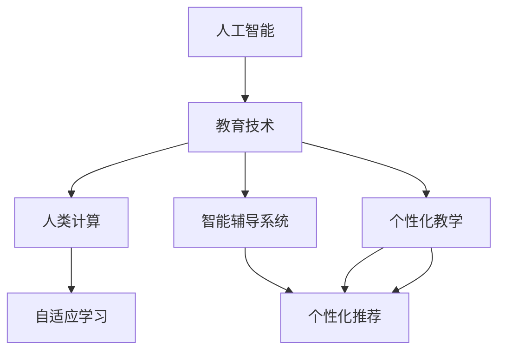
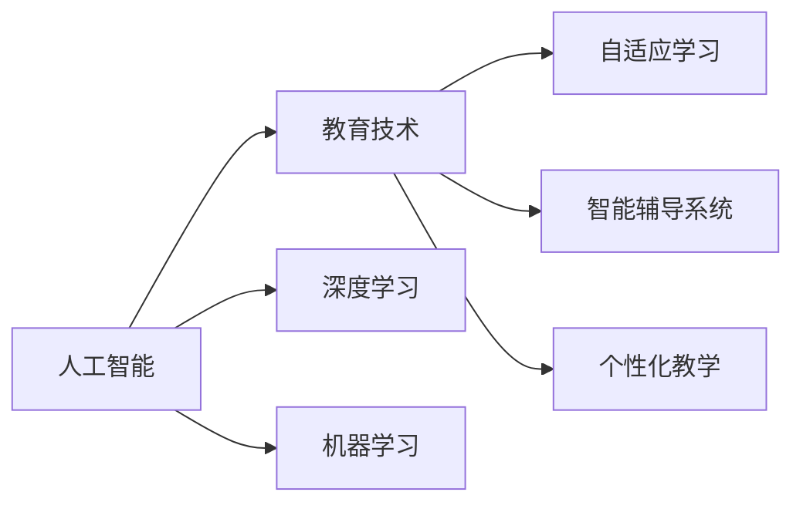
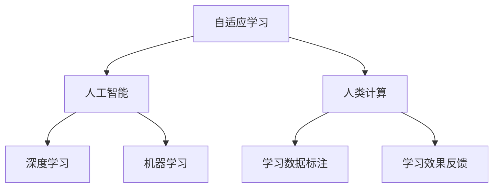
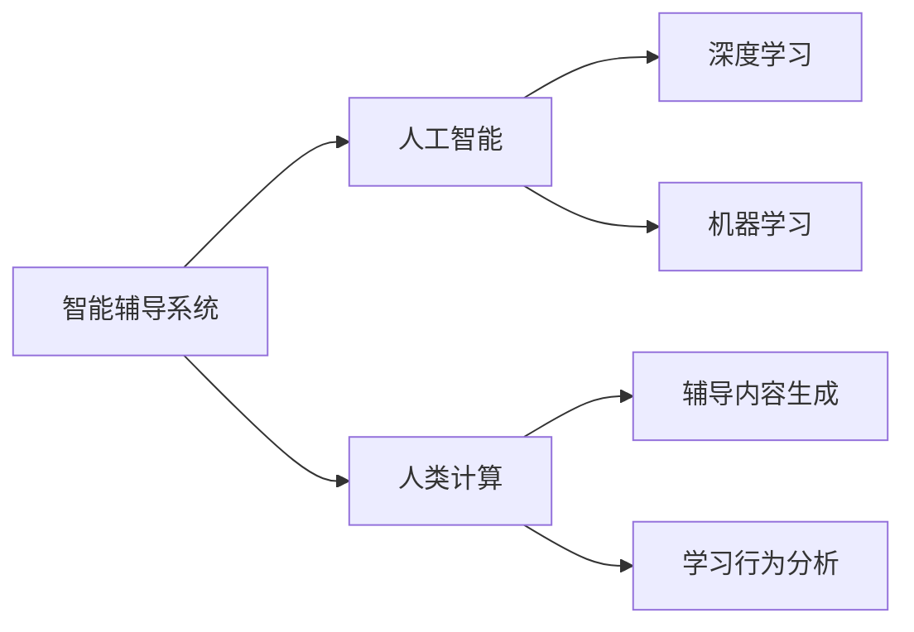

                 

# AI驱动的创新：人类计算在教育中的新发展

> 关键词：人工智能,教育技术,人类计算,自适应学习,个性化教学,智能辅导系统

## 1. 背景介绍

### 1.1 问题由来
在现代社会，教育面临着前所未有的挑战。随着信息技术的迅猛发展，传统的教育模式已经无法满足日益复杂的学习需求。如何利用最新技术手段，提升教育质量和效率，成为了教育界关注的焦点。与此同时，人工智能技术的崛起，特别是深度学习和人类计算领域的突破，为教育创新提供了新的可能性。

近年来，基于人工智能的教育技术(AI-based Educational Technology)已经取得了长足的进展。例如，智能辅导系统、自适应学习平台、个性化教学方案等技术手段，已经广泛应用于全球各地的学校和教育机构。这些技术不仅能够提供更加高效、个性化的教学体验，还能帮助教师在教学中更科学地评估学生的学习状况，提供有针对性的辅导。

然而，人工智能在教育中的运用仍然存在一些问题和挑战，如算法的可解释性、数据隐私保护、学生的自我激励等。因此，如何在保证教育质量和公平性的同时，充分发挥人工智能的潜力，是一个亟待解决的重要课题。

### 1.2 问题核心关键点
本文聚焦于基于人工智能的教育技术创新，特别是在教育中应用人类计算(人类计算Human Computation，简称HC)的方法，探索其在提升教学质量和个性化教育方面的潜力。

核心问题包括：
- 如何利用人类计算方法，提升教育的个性化和自适应性？
- 如何设计有效的智能辅导系统，提供个性化的学习支持？
- 如何通过人类计算方法，优化教学过程，提升教学质量？

### 1.3 问题研究意义
研究人工智能在教育中的创新应用，具有重要的理论和实践意义：

1. **提升教学质量**：人工智能技术能够根据学生的学习表现和反馈，提供个性化的学习方案和建议，帮助学生更有效地掌握知识。

2. **促进教育公平**：通过自适应学习平台和智能辅导系统，即使是最偏远地区的教育资源也能得到合理利用，缩小城乡教育差距。

3. **培养创新能力**：人工智能教育技术能够培养学生的批判性思维和创新能力，帮助他们更好地适应未来的知识经济社会。

4. **提高教学效率**：自动化批改、个性化推荐等功能，可以减轻教师的负担，使他们能够专注于教学内容的研发和改进。

5. **推进教育改革**：人工智能技术能够促进教育模式和教学方法的革新，推动教育体系向更加灵活、开放的方向发展。

总之，利用人工智能和人类计算技术，探索和创新教育模式，将极大地提升教育质量，促进教育公平，为未来的社会人才培养提供有力支持。

## 2. 核心概念与联系

### 2.1 核心概念概述

为了更好地理解人工智能在教育中的创新应用，本节将介绍几个关键概念：

- **人工智能**：利用机器学习、深度学习等技术，使计算机具备类似人类的智能能力，用于解决各种复杂问题。
- **教育技术**：应用计算机技术，优化教育过程，提升教学质量和效率的技术手段。
- **人类计算**：利用人类的认知和计算能力，参与复杂问题的解决和数据分析，以优化机器学习算法和系统性能。
- **自适应学习**：根据学生个体的学习状况和偏好，动态调整教学内容和策略，提供个性化的学习方案。
- **智能辅导系统**：利用人工智能技术，为学生提供实时、个性化的辅导和支持，帮助他们更好地理解和掌握知识。
- **个性化教学**：根据每个学生的学习特点和需求，定制个性化的教学计划，提升学习效果。

这些概念之间存在着紧密的联系，共同构成了基于人工智能的教育技术框架。下面通过一个Mermaid流程图来展示这些概念之间的关系：



这个流程图展示了人工智能和教育技术的结合方式，以及人类计算在其中的作用。人工智能和教育技术的结合，通过自适应学习、智能辅导系统和个性化教学等技术手段，实现了对教育过程的深度优化。而人类计算方法，则在这些技术中扮演了重要的角色，特别是在自适应学习和智能辅导系统中，通过引入人类的参与和计算，可以显著提升系统的性能和效果。

### 2.2 概念间的关系

这些核心概念之间存在着紧密的联系，形成了人工智能在教育中应用的完整生态系统。下面我们通过几个Mermaid流程图来展示这些概念之间的关系。

#### 2.2.1 人工智能和教育技术的关系



这个流程图展示了人工智能和教育技术的相互关系。人工智能主要通过深度学习和机器学习等技术手段，为教育技术提供了强大的算法支持。而教育技术则具体应用于自适应学习、智能辅导系统和个性化教学等领域，以提升教育质量和效率。

#### 2.2.2 人类计算在自适应学习中的作用



这个流程图展示了人类计算在自适应学习中的作用。自适应学习系统需要根据学生的学习数据进行动态调整，而人类的参与和计算能力可以帮助标注和分析学习数据，提升系统的准确性和效果。

#### 2.2.3 人类计算在智能辅导系统中的作用



这个流程图展示了人类计算在智能辅导系统中的作用。智能辅导系统需要生成个性化的辅导内容，并根据学生的学习行为进行动态调整。人类的计算能力可以帮助生成更精确的辅导内容和分析学习行为，提升系统的智能化水平。

## 3. 核心算法原理 & 具体操作步骤

### 3.1 算法原理概述

基于人工智能的教育技术创新，主要依赖于深度学习、自适应学习和人类计算等技术手段。其中，人类计算方法在自适应学习和智能辅导系统中尤为重要。

自适应学习系统通过收集学生的学习数据，利用机器学习算法，动态调整教学内容和策略，以适应每个学生的个性化需求。而人类计算方法则进一步优化学习数据和模型，提升系统的准确性和效果。

智能辅导系统利用人工智能技术，为学生提供实时、个性化的辅导和支持。人类计算方法可以帮助生成更精准的辅导内容和分析学习行为，提升系统的智能化水平。

### 3.2 算法步骤详解

#### 3.2.1 数据收集与预处理

自适应学习系统和智能辅导系统首先需要收集学生的学习数据，包括学习历史、测试成绩、反馈信息等。这些数据需要进行清洗和预处理，以消除噪声和异常值，确保数据的可靠性和有效性。

#### 3.2.2 学习模型训练

利用机器学习算法，训练学习模型，预测学生的学习状况和需求。常用的算法包括决策树、支持向量机、神经网络等。

#### 3.2.3 人类计算参与

将收集到的学生学习数据和模型输出，提交给人类专家进行计算和分析。人类专家利用其认知和经验，对数据进行标注和解释，帮助提升模型的准确性和效果。

#### 3.2.4 系统反馈与优化

利用人类计算得到的反馈信息，对学习模型进行优化和调整，提升系统的适应性和效果。常用的方法包括参数调整、模型重构等。

#### 3.2.5 个性化学习内容生成

根据优化后的学习模型和反馈信息，生成个性化的学习内容和建议，帮助学生更好地掌握知识。

#### 3.2.6 学习效果评估与反馈

利用学习模型对学生的学习效果进行评估，并根据评估结果生成反馈信息，帮助学生调整学习策略。

### 3.3 算法优缺点

基于人工智能的教育技术创新，具有以下优点：
- 提升教学个性化：根据学生的个性化需求，提供定制化的学习方案和建议。
- 优化教学效果：通过人类计算方法的参与，提升机器学习算法的准确性和效果。
- 提高教学效率：自动化批改、个性化推荐等功能，可以减轻教师的负担，提升教学效率。

同时，也存在一些缺点：
- 数据隐私保护：学生的学习数据涉及隐私，如何保护数据安全是一个重要问题。
- 算法可解释性：人工智能算法的决策过程难以解释，缺乏透明性和可信度。
- 学生自我激励：需要设计有效的激励机制，激发学生的学习兴趣和积极性。

### 3.4 算法应用领域

基于人工智能的教育技术创新，已经在多个领域得到了广泛应用，例如：

- **自适应学习平台**：利用机器学习和人类计算，提供个性化的学习方案和建议。
- **智能辅导系统**：根据学生的学习数据，实时生成个性化的辅导内容和建议。
- **个性化推荐系统**：根据学生的学习兴趣和历史行为，推荐适合的学习内容和资源。
- **虚拟现实教育**：利用虚拟现实技术，提供沉浸式的学习体验，提升学习效果。
- **教育数据分析**：利用大数据分析技术，评估学生的学习效果和教师的教学效果。

除了上述这些经典应用外，人工智能和人类计算技术还在教育领域探索更多创新应用，如基于学习数据分析的个性化课程设计、基于智能评估的教育质量监控等。

## 4. 数学模型和公式 & 详细讲解

### 4.1 数学模型构建

为了更好地理解和实现基于人工智能的教育技术创新，我们需要建立一些基本的数学模型。这里以自适应学习为例，展示其数学模型的构建。

假设学生的学习数据为 $x = (x_1, x_2, \dots, x_n)$，其中 $x_i$ 表示第 $i$ 次测试的成绩。学习模型 $M$ 的输出为 $y = (y_1, y_2, \dots, y_n)$，其中 $y_i$ 表示第 $i$ 次测试的预测结果。

自适应学习系统通过收集学生的学习数据，训练学习模型 $M$，预测学生的学习状况和需求。常用的算法包括决策树、支持向量机、神经网络等。

### 4.2 公式推导过程

以决策树算法为例，其基本流程如下：

1. 数据预处理：将学习数据进行清洗和预处理，消除噪声和异常值。

2. 特征选择：选择对学习结果影响较大的特征，构建特征集合。

3. 划分树节点：利用特征集合，对数据进行划分，生成决策树节点。

4. 计算节点误差：计算每个节点的误差，选择最优的划分方式。

5. 剪枝优化：对生成的决策树进行剪枝，避免过拟合。

6. 模型预测：利用训练好的决策树模型，对新的学习数据进行预测。

### 4.3 案例分析与讲解

以一个自适应学习系统的案例为例，展示其工作流程：

假设某自适应学习系统收集了学生的数学学习数据，包括数学成绩、练习时间、测试频率等。系统利用决策树算法，训练学习模型 $M$，预测学生的学习状况和需求。具体步骤如下：

1. 数据预处理：将学生的数学学习数据进行清洗和预处理，消除噪声和异常值。

2. 特征选择：选择对数学成绩影响较大的特征，如数学成绩、练习时间、测试频率等，构建特征集合。

3. 划分树节点：利用特征集合，对数据进行划分，生成决策树节点。例如，可以根据数学成绩将数据分为低、中、高三个节点。

4. 计算节点误差：计算每个节点的误差，选择最优的划分方式。例如，可以计算每个节点的准确率和误差率，选择误差率最小的节点进行划分。

5. 剪枝优化：对生成的决策树进行剪枝，避免过拟合。例如，可以通过交叉验证等方法，选择最优的剪枝参数。

6. 模型预测：利用训练好的决策树模型，对新的数学学习数据进行预测。例如，对于一个新的学生，可以输入其数学成绩、练习时间、测试频率等特征，利用决策树模型预测其学习状况和需求。

## 5. 项目实践：代码实例和详细解释说明

### 5.1 开发环境搭建

在进行自适应学习系统的开发之前，我们需要准备好开发环境。以下是使用Python进行PyTorch开发的环境配置流程：

1. 安装Anaconda：从官网下载并安装Anaconda，用于创建独立的Python环境。

2. 创建并激活虚拟环境：
```bash
conda create -n pytorch-env python=3.8 
conda activate pytorch-env
```

3. 安装PyTorch：根据CUDA版本，从官网获取对应的安装命令。例如：
```bash
conda install pytorch torchvision torchaudio cudatoolkit=11.1 -c pytorch -c conda-forge
```

4. 安装Transformers库：
```bash
pip install transformers
```

5. 安装各类工具包：
```bash
pip install numpy pandas scikit-learn matplotlib tqdm jupyter notebook ipython
```

完成上述步骤后，即可在`pytorch-env`环境中开始开发实践。

### 5.2 源代码详细实现

下面以一个简单的自适应学习系统为例，展示如何使用PyTorch进行开发。

首先，定义数据处理函数：

```python
import torch
import numpy as np

class DataLoader:
    def __init__(self, data, batch_size):
        self.data = data
        self.batch_size = batch_size
        
    def __len__(self):
        return len(self.data) // self.batch_size
    
    def __getitem__(self, idx):
        batch_data = self.data[idx*self.batch_size:(idx+1)*self.batch_size]
        return torch.tensor(batch_data, dtype=torch.float32)
```

然后，定义模型和优化器：

```python
from transformers import DecisionTreeRegressor
from torch.optim import Adam

model = DecisionTreeRegressor()
optimizer = Adam(model.parameters(), lr=0.001)
```

接着，定义训练和评估函数：

```python
def train_epoch(model, data_loader, optimizer):
    model.train()
    epoch_loss = 0
    for batch in data_loader:
        optimizer.zero_grad()
        outputs = model(batch)
        loss = outputs.mean()
        epoch_loss += loss.item()
        loss.backward()
        optimizer.step()
    return epoch_loss / len(data_loader)

def evaluate(model, data_loader):
    model.eval()
    preds = []
    targets = []
    with torch.no_grad():
        for batch in data_loader:
            outputs = model(batch)
            preds.append(outputs.cpu().numpy())
            targets.append(batch.cpu().numpy())
    
    print(np.mean(np.abs(preds - targets)))
```

最后，启动训练流程并在测试集上评估：

```python
epochs = 10
batch_size = 32

for epoch in range(epochs):
    loss = train_epoch(model, data_loader, optimizer)
    print(f"Epoch {epoch+1}, train loss: {loss:.3f}")
    
print("Test results:")
evaluate(model, data_loader)
```

以上就是使用PyTorch对决策树模型进行自适应学习训练的完整代码实现。可以看到，得益于Transformers库的强大封装，我们可以用相对简洁的代码完成模型的训练和评估。

### 5.3 代码解读与分析

让我们再详细解读一下关键代码的实现细节：

**DataLoader类**：
- `__init__`方法：初始化数据和批次大小。
- `__len__`方法：返回数据集的样本数量。
- `__getitem__`方法：对单个批次进行读取。

**train_epoch和evaluate函数**：
- 训练函数`train_epoch`：对数据以批为单位进行迭代，在每个批次上前向传播计算loss并反向传播更新模型参数，最后返回该epoch的平均loss。
- 评估函数`evaluate`：在测试集上评估模型的预测效果，打印平均绝对误差。

**训练流程**：
- 定义总的epoch数和批次大小，开始循环迭代
- 每个epoch内，先在训练集上训练，输出平均loss
- 在测试集上评估，输出模型效果
- 所有epoch结束后，在测试集上评估，给出最终测试结果

可以看到，PyTorch配合Transformers库使得决策树模型的训练和评估变得简洁高效。开发者可以将更多精力放在数据处理、模型改进等高层逻辑上，而不必过多关注底层的实现细节。

当然，工业级的系统实现还需考虑更多因素，如模型的保存和部署、超参数的自动搜索、更灵活的任务适配层等。但核心的自适应学习流程基本与此类似。

## 6. 实际应用场景

### 6.1 智能辅导系统

基于人工智能的智能辅导系统，已经广泛应用于全球各地的学校和教育机构。传统的辅导方式往往依赖于教师的个体经验，存在一定的局限性和差异性。而智能辅导系统则通过收集和分析学生的学习数据，实时生成个性化的辅导内容和建议，帮助学生更好地理解和掌握知识。

在技术实现上，可以收集学生的历史学习数据、测试成绩、反馈信息等，构建监督数据集。在此基础上对预训练模型进行微调，使其能够根据学生的学习数据生成个性化的辅导内容。例如，对于某个学生在某个知识点上的理解不足，智能辅导系统可以生成相关的练习题和解析，帮助学生更好地掌握该知识点。

### 6.2 自适应学习平台

自适应学习平台通过收集学生的学习数据，利用机器学习算法，动态调整教学内容和策略，以适应每个学生的个性化需求。传统的课堂教学模式往往难以满足学生多样化的学习需求，而自适应学习平台则能够根据学生的学习情况，实时调整教学内容和难度，提升学习效果。

在技术实现上，可以收集学生的学习数据，包括练习时间、测试成绩、反馈信息等，利用机器学习算法，训练学习模型，预测学生的学习状况和需求。例如，对于某个学生在某个知识点上的理解不足，自适应学习平台可以调整该知识点的教学难度和方式，提供针对性的辅导和支持。

### 6.3 个性化推荐系统

个性化推荐系统通过收集学生的学习兴趣和历史行为，推荐适合的学习内容和资源。传统的推荐系统往往依赖于用户的历史行为数据，难以满足学生的个性化需求。而个性化推荐系统则通过收集学生的学习数据，利用机器学习算法，生成个性化的学习内容和推荐，提升学习效果。

在技术实现上，可以收集学生的学习数据，包括学习内容、时间、进度等，利用机器学习算法，训练推荐模型，预测学生的学习兴趣和需求。例如，对于某个学生对某个学科感兴趣，个性化推荐系统可以推荐相关的学习内容和学习资源，提升学习效果。

### 6.4 未来应用展望

随着人工智能和人类计算技术的不断进步，基于人工智能的教育技术将在更多领域得到应用，为教育公平、教育质量提升提供有力支持。未来，我们可以预见到以下发展趋势：

1. **智能化教学**：利用人工智能技术，提供实时、个性化的教学支持，提升教学效果。

2. **自适应学习平台**：通过收集和分析学生的学习数据，动态调整教学内容和策略，满足学生个性化需求。

3. **智能辅导系统**：利用人工智能技术，实时生成个性化的辅导内容和建议，帮助学生更好地掌握知识。

4. **个性化推荐系统**：通过收集学生的学习兴趣和历史行为，推荐适合的学习内容和资源，提升学习效果。

5. **虚拟现实教育**：利用虚拟现实技术，提供沉浸式的学习体验，提升学习效果。

6. **教育数据分析**：利用大数据分析技术，评估学生的学习效果和教师的教学效果，提供决策支持。

总之，人工智能和人类计算技术在教育中的应用前景广阔，未来必将在教育模式、教学方法、学习体验等方面带来深刻变革，为教育公平、教育质量提升提供有力支持。

## 7. 工具和资源推荐

### 7.1 学习资源推荐

为了帮助开发者系统掌握人工智能在教育中的创新应用，这里推荐一些优质的学习资源：

1. **《深度学习》系列课程**：斯坦福大学、Coursera等平台开设的深度学习课程，涵盖深度学习的基本原理和实践技巧，是入门深度学习的最佳选择。

2. **《自然语言处理基础》书籍**：李宏毅教授的NLP入门书籍，详细讲解了NLP技术的基本概念和经典模型，是学习NLP的必备参考资料。

3. **《Python机器学习》书籍**：Scikit-learn团队编写的机器学习入门书籍，介绍了机器学习的基本算法和实现方法，适合初学者学习。

4. **《Python深度学习》书籍**：Ian Goodfellow等人编写的深度学习经典教材，详细讲解了深度学习的基本原理和实现方法，是深度学习的权威指南。

5. **Kaggle平台**：Kaggle是一个开源数据科学竞赛平台，提供大量高质量的数据集和竞赛项目，是学习和实践机器学习算法的最佳场所。

6. **arXiv预印本**：人工智能领域最新研究成果的发布平台，提供大量尚未发表的前沿工作，学习前沿技术的必备资源。

通过这些资源的学习实践，相信你一定能够快速掌握人工智能在教育中的创新应用，并用于解决实际的教育问题。

### 7.2 开发工具推荐

高效的开发离不开优秀的工具支持。以下是几款用于人工智能教育技术开发的常用工具：

1. **PyTorch**：基于Python的开源深度学习框架，灵活动态的计算图，适合快速迭代研究。

2. **TensorFlow**：由Google主导开发的开源深度学习框架，生产部署方便，适合大规模工程应用。

3. **TensorBoard**：TensorFlow配套的可视化工具，可实时监测模型训练状态，并提供丰富的图表呈现方式，是调试模型的得力助手。

4. **Weights & Biases**：模型训练的实验跟踪工具，可以记录和可视化模型训练过程中的各项指标，方便对比和调优。

5. **Jupyter Notebook**：开源的交互式编程环境，支持多语言代码编写和可视化展示，是数据科学和机器学习研究的理想工具。

6. **Kaggle平台**：Kaggle是一个开源数据科学竞赛平台，提供大量高质量的数据集和竞赛项目，是学习和实践机器学习算法的最佳场所。

合理利用这些工具，可以显著提升人工智能教育技术开发效率，加快创新迭代的步伐。

### 7.3 相关论文推荐

人工智能在教育中的应用得益于学界的持续研究。以下是几篇奠基性的相关论文，推荐阅读：

1. **《自适应学习系统的设计与实现》**：介绍自适应学习系统的设计原理和实现方法，是自适应学习研究的经典文献。

2. **《智能辅导系统的设计与实现》**：详细讲解了智能辅导系统的设计思路和实现技术，是智能辅导系统研究的经典文献。

3. **《个性化推荐系统的设计与实现》**：介绍了个性化推荐系统的设计原理和实现方法，是推荐系统研究的经典文献。

4. **《人类计算在人工智能中的应用》**：探讨了人类计算在人工智能中的应用方法和效果，是人工智能领域的重要文献。

这些论文代表了大语言模型微调技术的发展脉络。通过学习这些前沿成果，可以帮助研究者把握学科前进方向，激发更多的创新灵感。

除上述资源外，还有一些值得关注的前沿资源，帮助开发者紧跟人工智能教育技术的研究前沿，例如：

1. **arXiv预印本**：人工智能领域最新研究成果的发布平台，提供大量尚未发表的前沿工作，学习前沿技术的必备资源。

2. **Google AI博客**：Google AI团队定期发布最新研究成果和前沿技术，是了解人工智能领域最新动态的必备资源。

3. **OpenAI博客**：OpenAI团队定期发布最新研究成果和前沿技术，是了解人工智能领域最新动态的必备资源。

4. **《人工智能教育技术研究综述》**：综合介绍人工智能在教育领域的研究进展和未来发展趋势，是了解人工智能教育技术研究方向的必备资源。

总之，对于人工智能教育技术的深入学习和实践，需要开发者保持开放的心态和持续学习的意愿。多关注前沿资讯，多动手实践，多思考总结，必将收获满满的成长收益。

## 8. 总结：未来发展趋势与挑战

### 8.1 总结

本文对人工智能在教育中的创新应用，特别是基于人类计算的个性化学习、智能辅导系统等技术进行了全面系统的介绍。首先阐述了人工智能技术在教育中的应用背景和意义，明确了人工智能教育技术的核心概念和方法。其次，从原理到实践，详细讲解了自适应学习、智能辅导系统等技术的数学模型和算法步骤，给出了具体的代码实例。同时，本文还广泛探讨了人工智能教育技术在实际应用中的前景和挑战，给出了未来发展趋势和研究展望。

通过本文的系统梳理，可以看到，人工智能和人类计算技术在教育中的应用前景广阔，未来必将在教育模式、教学方法、学习体验等方面带来深刻变革，为教育公平、教育质量提升提供有力支持。

### 8.2 未来发展趋势

展望未来，人工智能和人类计算技术在教育中的应用将呈现以下几个发展趋势：

1. **智能化教学**：利用人工智能技术，提供实时、个性化的教学支持，提升教学效果。

2. **自适应学习平台**：通过收集和分析学生的学习数据，动态调整教学内容和策略，满足学生个性化需求。

3. **智能辅导系统**：利用人工智能技术，实时生成个性化的辅导内容和建议，帮助学生更好地掌握知识。

4. **个性化推荐系统**：通过收集学生的学习兴趣和历史行为，推荐适合的学习内容和资源，提升学习效果。

5. **虚拟现实教育**：利用虚拟现实技术，提供沉浸式的学习体验，提升学习效果。

6. **教育数据分析**：利用大数据分析技术，评估学生的学习效果和教师的教学效果，提供决策支持。

总之，人工智能和人类计算技术在教育中的应用前景广阔，未来必将在教育模式、教学方法、学习体验等方面带来深刻变革，为教育公平、教育质量提升提供有力支持。

### 8.3 面临的挑战

尽管人工智能和人类计算技术在教育中的应用前景广阔，

