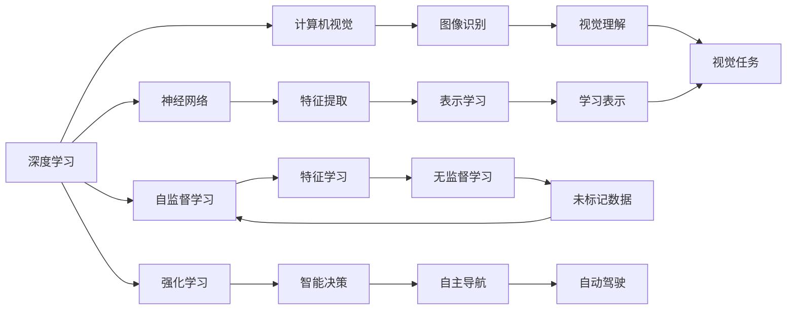

                 

# Andrej Karpathy：人工智能的未来发展前景

> 关键词：
- 人工智能
- 深度学习
- 神经网络
- 计算机视觉
- 自监督学习
- 强化学习
- 自动驾驶

## 1. 背景介绍

安德烈·卡帕西（Andrej Karpathy），作为人工智能领域的顶尖专家之一，他在计算机视觉、深度学习、自动驾驶等多个领域均有杰出的贡献。他的研究不仅推动了学术界和工业界的发展，也为人工智能的未来前景提供了深刻的见解。

本文将围绕安德烈·卡帕西的多个关键观点，探讨人工智能技术的未来发展趋势和面临的挑战，力求为读者提供一个全面的视角，并就如何应对这些挑战提出一些策略和建议。

## 2. 核心概念与联系

### 2.1 核心概念概述

安德烈·卡帕西的研究涉及多个核心概念，这些概念共同构成了人工智能技术的基石。以下是对这些概念的概述：

- **深度学习**：一种基于神经网络的机器学习技术，通过多层次的特征提取和抽象，实现复杂的模式识别和预测。
- **神经网络**：由多个神经元组成的网络结构，能够学习数据的复杂表示，广泛应用于图像识别、语音处理、自然语言处理等领域。
- **计算机视觉**：研究如何让计算机"看"图像，识别和理解视觉信息，是人工智能的重要分支之一。
- **自监督学习**：利用未标记的数据，通过学习数据的自身规律和特征，进行有效的特征提取和表示学习。
- **强化学习**：通过与环境的交互，智能体在不断的试错中学习最优策略，应用于机器人控制、游戏AI等领域。
- **自动驾驶**：通过计算机视觉、深度学习和强化学习等技术，实现车辆的自主导航和驾驶。

这些概念之间存在紧密的联系，共同推动了人工智能技术的发展和应用。例如，深度学习为计算机视觉提供了强大的特征提取能力，而强化学习为自动驾驶提供了智能决策的机制。自监督学习则通过利用未标记数据，降低了深度学习模型的标注成本。

### 2.2 核心概念的关系

以下是这些核心概念的Mermaid流程图，展示了它们之间的联系和相互影响：



这个流程图展示了深度学习在神经网络中的基础作用，以及它如何与计算机视觉、自监督学习和强化学习等概念相互关联。同时，特征提取和表示学习是深度学习的重要组成部分，而智能决策和自主导航则是强化学习的核心任务。

## 3. 核心算法原理 & 具体操作步骤

### 3.1 算法原理概述

安德烈·卡帕西在深度学习和计算机视觉领域的研究，涉及多个关键算法和原理。以下是对这些算法和原理的概述：

- **卷积神经网络（CNN）**：通过卷积操作提取图像的局部特征，应用于图像分类、目标检测等任务。
- **残差网络（ResNet）**：通过引入残差块，解决了深度网络训练中的梯度消失问题，提升了深度网络的训练深度。
- **生成对抗网络（GAN）**：通过生成器和判别器的对抗训练，生成高质量的合成数据，广泛应用于图像生成、风格迁移等任务。
- **自编码器（AE）**：通过将输入数据压缩为低维表示，再解码回原数据，实现数据的特征提取和去噪处理。
- **注意力机制（Attention）**：通过动态关注输入中的重要部分，提高模型的局部特征提取能力。

### 3.2 算法步骤详解

以下是对安德烈·卡帕西的一些算法步骤的详解：

#### 步骤1：模型选择与设计

在选择模型时，需要根据任务的需求和数据的特点进行选择。例如，对于图像分类任务，可以选择卷积神经网络；对于序列建模任务，可以选择循环神经网络（RNN）或变换器（Transformer）等。

#### 步骤2：数据准备与预处理

在训练模型前，需要对数据进行预处理，包括数据清洗、归一化、数据增强等。数据增强技术，如随机裁剪、旋转、翻转等，可以提高模型的泛化能力。

#### 步骤3：模型训练与优化

在训练模型时，需要选择合适的优化器（如SGD、Adam等）和损失函数，并设置合适的超参数。优化器用于计算梯度，损失函数用于衡量模型预测与真实标签之间的差异。

#### 步骤4：模型评估与调优

在模型训练完成后，需要在验证集上进行评估，计算各种指标（如准确率、精确率、召回率等），并根据评估结果进行模型调优。

#### 步骤5：模型部署与应用

在模型训练和调优完成后，可以将模型部署到实际应用场景中，例如自动驾驶、图像识别、语音识别等。

### 3.3 算法优缺点

#### 优点：

- **强大的特征提取能力**：深度学习模型通过多层非线性变换，能够学习到数据的高级特征，实现复杂的模式识别和预测。
- **泛化能力强**：自监督学习和数据增强技术，提高了模型在未见过的数据上的泛化能力。
- **应用广泛**：深度学习技术已经广泛应用于图像识别、自然语言处理、自动驾驶等多个领域。

#### 缺点：

- **计算资源需求高**：深度学习模型通常需要大量的计算资源进行训练，特别是在大规模深度网络中。
- **模型复杂性高**：深度学习模型的结构复杂，难以解释其内部机制，缺乏可解释性。
- **训练时间长**：深度学习模型的训练时间较长，特别是在大规模数据集上。

### 3.4 算法应用领域

安德烈·卡帕西的研究涵盖了多个应用领域，以下是一些主要的应用领域：

- **计算机视觉**：用于图像分类、目标检测、图像生成、风格迁移等任务。
- **自然语言处理**：用于文本分类、机器翻译、语音识别、问答系统等任务。
- **自动驾驶**：通过计算机视觉和深度学习技术，实现车辆的自主导航和驾驶。
- **游戏AI**：通过强化学习技术，实现游戏中的智能体行为决策。

## 4. 数学模型和公式 & 详细讲解

### 4.1 数学模型构建

在深度学习中，数学模型通常包括损失函数、优化器、激活函数等组成部分。以下是对这些模型的构建和推导的详细介绍：

#### 损失函数

深度学习模型的损失函数通常采用交叉熵损失或均方误差损失等，用于衡量模型预测与真实标签之间的差异。例如，对于二分类问题，交叉熵损失函数可以表示为：

$$
L(y, \hat{y}) = -\frac{1}{N}\sum_{i=1}^N(y_i\log \hat{y_i} + (1-y_i)\log(1-\hat{y_i}))
$$

其中，$y_i$ 表示真实标签，$\hat{y_i}$ 表示模型预测。

#### 优化器

优化器用于计算梯度，并更新模型参数。常见的优化器包括SGD、Adam等。例如，Adam优化器的更新公式可以表示为：

$$
\theta_{t+1} = \theta_t - \eta \frac{m_t}{\sqrt{v_t} + \epsilon}
$$

其中，$\theta_t$ 表示模型参数，$\eta$ 表示学习率，$m_t$ 表示梯度的一阶矩估计，$v_t$ 表示梯度的高阶矩估计，$\epsilon$ 表示数值稳定项。

#### 激活函数

激活函数用于引入非线性变换，增强模型的表达能力。常见的激活函数包括ReLU、sigmoid、tanh等。例如，ReLU函数的表达式可以表示为：

$$
f(x) = \max(0, x)
$$

### 4.2 公式推导过程

以下是对安德烈·卡帕西的一些关键公式的推导过程：

#### 公式推导过程

以ReLU激活函数为例，假设输入 $x$，激活函数的输出可以表示为：

$$
f(x) = \max(0, x)
$$

推导过程如下：

1. 当 $x < 0$ 时，$f(x) = 0$
2. 当 $x \geq 0$ 时，$f(x) = x$

因此，ReLU函数的表达能力非常强，被广泛应用于深度学习中。

### 4.3 案例分析与讲解

以自动驾驶为例，安德烈·卡帕西提出了一种基于视觉和深度学习的自动驾驶方案。该方案中，通过卷积神经网络提取图像特征，使用RNN处理时间序列数据，并使用强化学习进行智能决策。具体步骤如下：

1. 采集车辆周围的多角度摄像头图像，通过CNN提取图像特征。
2. 使用RNN处理时间序列数据，捕捉车辆行驶的动态信息。
3. 通过强化学习，智能体在不断的试错中学习最优决策策略，实现车辆的自主导航和驾驶。

## 5. 项目实践：代码实例和详细解释说明

### 5.1 开发环境搭建

以下是在PyTorch中搭建深度学习开发环境的步骤：

1. 安装Python 3.7或更高版本
2. 安装PyTorch：`pip install torch torchvision torchaudio`
3. 安装TensorBoard：`pip install tensorboard`
4. 安装NVIDIA CUDA工具包：`conda install -c pytorch cudatoolkit=11.0`

### 5.2 源代码详细实现

以下是一个简单的图像分类任务示例代码：

```python
import torch
import torchvision
import torchvision.transforms as transforms

# 加载数据集
transform = transforms.Compose([
    transforms.Resize(224),
    transforms.CenterCrop(224),
    transforms.ToTensor(),
    transforms.Normalize(mean=[0.485, 0.456, 0.406], std=[0.229, 0.224, 0.225])
])
train_dataset = torchvision.datasets.CIFAR10(root='./data', train=True, download=True, transform=transform)
test_dataset = torchvision.datasets.CIFAR10(root='./data', train=False, download=True, transform=transform)

# 加载模型
model = torchvision.models.resnet18(pretrained=True)

# 训练模型
import torch.nn.functional as F
optimizer = torch.optim.SGD(model.parameters(), lr=0.001, momentum=0.9)
criterion = torch.nn.CrossEntropyLoss()
device = torch.device("cuda" if torch.cuda.is_available() else "cpu")
model.to(device)
for epoch in range(10):
    for i, (inputs, labels) in enumerate(train_loader):
        inputs, labels = inputs.to(device), labels.to(device)
        optimizer.zero_grad()
        outputs = model(inputs)
        loss = criterion(outputs, labels)
        loss.backward()
        optimizer.step()
```

### 5.3 代码解读与分析

在代码中，我们首先加载了CIFAR-10数据集，并定义了模型和优化器。然后，通过SGD优化器和交叉熵损失函数进行模型训练。在训练过程中，我们将模型和数据转移到GPU上进行加速。

### 5.4 运行结果展示

在训练完成后，我们可以在测试集上进行评估，并输出模型的准确率：

```python
correct = 0
total = 0
with torch.no_grad():
    for inputs, labels in test_loader:
        inputs, labels = inputs.to(device), labels.to(device)
        outputs = model(inputs)
        _, predicted = torch.max(outputs.data, 1)
        total += labels.size(0)
        correct += (predicted == labels).sum().item()

print('Accuracy of the model on the test images: %d %%' % (100 * correct / total))
```

## 6. 实际应用场景

安德烈·卡帕西的研究成果已经在多个实际应用场景中得到了应用，以下是一些主要的应用场景：

### 6.1 自动驾驶

安德烈·卡帕西在自动驾驶领域的研究，主要包括计算机视觉和深度学习技术。他的团队开发了一种基于视觉和深度学习的自动驾驶方案，能够在各种复杂的道路环境中实现自主导航和驾驶。该方案已经在特斯拉等公司的自动驾驶系统中得到了应用。

### 6.2 游戏AI

安德烈·卡帕西在强化学习方面的研究，应用于游戏AI领域，开发了AlphaGo等具有高度智能的AI系统。这些AI系统能够在复杂的围棋游戏中实现超人类水平的决策能力。

### 6.3 医疗影像分析

安德烈·卡帕西在医疗影像分析领域的研究，主要包括图像分割和疾病诊断等任务。他的团队开发了一种基于卷积神经网络的图像分割算法，能够帮助医生更准确地定位和分析病变区域。

## 7. 工具和资源推荐

### 7.1 学习资源推荐

以下是一些安德烈·卡帕西的推荐学习资源：

1. 深度学习课程：Stanford大学的CS231n《卷积神经网络》课程，深入讲解计算机视觉基础和深度学习技术。
2. 强化学习课程：Coursera的《深度强化学习》课程，介绍强化学习的基本原理和应用。
3. GitHub开源项目：如TensorFlow、PyTorch等，提供丰富的深度学习框架和模型资源。

### 7.2 开发工具推荐

以下是一些常用的深度学习开发工具：

1. PyTorch：支持动态计算图，易于使用，广泛应用于深度学习研究和工程应用。
2. TensorFlow：支持静态和动态计算图，具有良好的分布式计算能力，广泛应用于工业应用。
3. Jupyter Notebook：交互式开发环境，方便调试和可视化。

### 7.3 相关论文推荐

以下是安德烈·卡帕西的一些关键论文：

1. "Learning to Drive: End-to-End Deep Learning for Self-Driving Cars"：介绍基于视觉和深度学习的自动驾驶方案。
2. "Human-Playable Go Monty Carlo Tree Search with Neural Networks"：介绍AlphaGo的深度学习部分。
3. "Deep Learning for Medical Imaging Analysis"：介绍基于卷积神经网络的医疗影像分析技术。

## 8. 总结：未来发展趋势与挑战

### 8.1 研究成果总结

安德烈·卡帕西的研究成果已经推动了深度学习、计算机视觉、自动驾驶等多个领域的发展。他的工作不仅提高了这些技术的性能和准确性，还推动了人工智能技术的广泛应用和产业化。

### 8.2 未来发展趋势

未来的深度学习技术将继续向着更高效、更泛化、更智能的方向发展。以下是一些主要的发展趋势：

1. **高效模型**：随着硬件性能的提升和优化算法的不断发展，深度学习模型将变得更加高效和轻量级。
2. **跨模态学习**：深度学习模型将越来越多地融合多种模态数据，实现跨模态学习和理解。
3. **自监督学习**：利用未标记数据进行自监督学习，降低深度学习模型的标注成本。
4. **神经网络结构优化**：研究新的神经网络结构，提升模型的表达能力和泛化能力。
5. **强化学习**：在机器人控制、游戏AI等领域，强化学习将继续发挥重要作用，推动智能体的自主决策和行为优化。

### 8.3 面临的挑战

尽管深度学习技术已经取得了显著的进展，但仍面临许多挑战：

1. **计算资源需求高**：深度学习模型需要大量的计算资源进行训练和推理，难以在低端设备上部署。
2. **模型可解释性不足**：深度学习模型的内部机制难以解释，缺乏可解释性。
3. **数据隐私和安全**：深度学习模型需要大量的数据进行训练，如何在保护隐私的前提下获取高质量数据，仍然是一个难题。
4. **鲁棒性和泛化能力**：深度学习模型在面对新数据时，泛化能力仍然不足，需要进一步改进。

### 8.4 研究展望

未来的深度学习研究需要在多个方面进行深入探索：

1. **高效模型的研究**：研究更高效、更轻量级的深度学习模型，降低计算资源需求，推动深度学习技术在更多场景中的应用。
2. **跨模态学习**：研究跨模态学习技术，实现多种模态数据的融合和协同建模。
3. **模型可解释性**：研究可解释性方法，提升深度学习模型的可解释性和可信度。
4. **数据隐私和安全**：研究数据隐私保护技术，确保深度学习模型的数据安全。
5. **模型鲁棒性和泛化能力**：研究鲁棒性和泛化能力提升方法，提高深度学习模型的实际应用价值。

## 9. 附录：常见问题与解答

### Q1：深度学习模型的可解释性问题如何解决？

A：深度学习模型的可解释性问题可以通过多种方法解决，例如：

1. 可视化技术：利用可视化工具，如TensorBoard、Visdom等，可视化模型的内部特征和决策过程。
2. 注意力机制：引入注意力机制，可视化模型对输入数据的关注点和特征提取过程。
3. 层级可解释性：通过分析模型的各层特征，理解模型对输入数据的理解过程。

### Q2：深度学习模型如何应对新数据的泛化能力不足问题？

A：深度学习模型应对新数据的泛化能力不足问题，可以通过以下方法解决：

1. 数据增强：利用数据增强技术，扩充训练数据集，提高模型的泛化能力。
2. 迁移学习：利用预训练模型，通过微调适应新任务，提高模型的泛化能力。
3. 正则化技术：利用正则化技术，如L2正则、Dropout等，提高模型的泛化能力。

### Q3：深度学习模型如何在计算资源有限的设备上部署？

A：深度学习模型在计算资源有限的设备上部署，可以通过以下方法解决：

1. 模型压缩：使用模型压缩技术，如剪枝、量化、知识蒸馏等，减小模型参数量和计算量。
2. 分布式计算：利用分布式计算技术，将模型任务分发到多台设备上并行计算。
3. 轻量级模型：研究轻量级深度学习模型，如MobileNet、SqueezeNet等，提升模型的计算效率。

通过以上方法，可以在计算资源有限的设备上，实现深度学习模型的高效部署和应用。

---

作者：禅与计算机程序设计艺术 / Zen and the Art of Computer Programming

