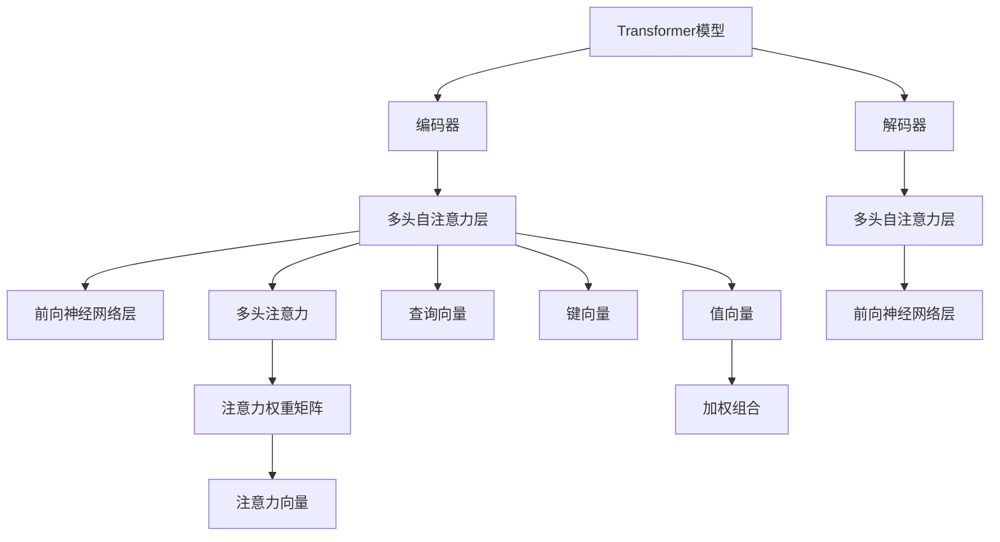

                 

# Attention Mechanism原理与代码实例讲解

> 关键词：Attention Mechanism, 自注意力机制, 注意力, Transformer, 机器翻译, 图像处理

## 1. 背景介绍

### 1.1 问题由来
在深度学习时代，神经网络结构变得日趋复杂。特别是卷积神经网络(CNN)和循环神经网络(RNN)，在处理图像和序列数据时取得了显著成果。但它们在计算和空间效率上仍存在一定局限。

针对这些问题，一种名为Transformer的新型神经网络结构应运而生。它主要由多头自注意力机制和前向神经网络组成，并在此基础上设计出了BERT、GPT等深度预训练语言模型。这些模型在自然语言处理(NLP)领域取得了卓越的表现，推动了NLP技术的应用边界不断扩展。

### 1.2 问题核心关键点
Transformer之所以强大，主要归功于其中的自注意力机制。该机制使模型能够在输入序列中捕捉全局信息，并根据注意力权重动态调整输入的影响程度。这种机制不仅提升了模型的表达能力，也使其在处理长序列时保持高效。

自注意力机制的核心思想是：在输入序列中，每个位置对其他位置都有一定关注度，这些关注度由注意力机制计算得出，并用于指导模型学习输入特征的加权组合。具体来说，自注意力机制分为三个部分：查询向量（Query Vector）、键向量（Key Vector）和值向量（Value Vector），通过矩阵计算得出注意力权重矩阵，用于加权组合输入特征。

### 1.3 问题研究意义
自注意力机制自问世以来，便在NLP、计算机视觉、图像处理等领域大放异彩，成为诸多模型取得优异性能的关键技术。深入理解自注意力机制，不仅有助于揭示Transformer结构背后的原理，还能为模型的优化、调参和应用提供重要参考。

## 2. 核心概念与联系

### 2.1 核心概念概述

为更好地理解自注意力机制，本节将介绍几个关键概念：

- **Transformer模型**：一种基于多头自注意力机制的神经网络结构，通过并行计算和多头注意力实现高效的序列建模。Transformer结构包括编码器和解码器两个部分，每个部分均包含多头自注意力层和前向神经网络层。

- **自注意力机制**：一种在输入序列中计算注意力权重的机制，用于动态加权组合输入特征。自注意力机制的核心是查询、键和值三个向量的计算，以及注意力权重矩阵的生成。

- **多头注意力**：在自注意力机制的基础上，增加多组查询、键和值向量，使得模型能够同时关注多个位置的信息，从而增强模型的表达能力。

- **注意力权重矩阵**：通过查询向量与键向量的矩阵乘法，计算出每个位置对其他位置的注意力权重，构成一个二维权重矩阵，用于指导值向量的加权组合。

- **注意力向量**：将值向量与注意力权重矩阵进行加权组合，得到每个位置的加权向量，即注意力向量，用于指导后续层级的输入。

这些核心概念之间的逻辑关系可以通过以下Mermaid流程图来展示：



这个流程图展示了大模型Transformer的结构，以及自注意力机制的核心流程。

### 2.2 概念间的关系

这些核心概念之间存在着紧密的联系，形成了Transformer模型的完整架构。具体来说，Transformer模型通过多头自注意力机制和前向神经网络层，实现了高效的序列建模和特征提取。在自注意力机制中，查询、键和值向量通过矩阵乘法计算出注意力权重矩阵，用于指导加权组合输入特征。而多头注意力则进一步增强了模型的表达能力。

## 3. 核心算法原理 & 具体操作步骤

### 3.1 算法原理概述

自注意力机制的核心在于如何计算每个位置对其他位置的注意力权重，以及如何根据这些权重动态调整输入的影响程度。其算法原理可以概括为以下几步：

1. **计算查询向量、键向量和值向量**：分别将输入序列中每个位置的特征向量进行线性变换，得到查询向量、键向量和值向量。

2. **计算注意力权重矩阵**：将查询向量与键向量进行矩阵乘法，得到每个位置的注意力得分，通过softmax函数计算出注意力权重矩阵。

3. **加权组合值向量**：将值向量与注意力权重矩阵进行加权组合，得到每个位置的注意力向量。

4. **多头注意力**：将多个查询、键和值向量进行独立计算，得到多个注意力向量，通过拼接后得到最终的注意力向量。

### 3.2 算法步骤详解

假设输入序列的长度为 $n$，查询向量、键向量和值向量均为 $d$ 维的向量。以下是具体的算法步骤：

1. **线性变换**：
   - 查询向量 $Q$：$Q = W_QX$
   - 键向量 $K$：$K = W_KX$
   - 值向量 $V$：$V = W_VX$
   其中 $W_Q$、$W_K$ 和 $W_V$ 是线性变换矩阵，$X$ 是输入序列的特征向量。

2. **计算注意力得分**：
   - 将查询向量 $Q$ 与键向量 $K$ 进行矩阵乘法，得到注意力得分 $S$：$S = QK^T$
   其中 $K^T$ 表示键向量 $K$ 的转置。

3. **计算注意力权重矩阵**：
   - 通过softmax函数将注意力得分 $S$ 归一化，得到注意力权重矩阵 $A$：$A = \text{softmax}(S)$
   - 将注意力权重矩阵 $A$ 与值向量 $V$ 进行矩阵乘法，得到注意力向量 $Z$：$Z = AV$
   其中 $Z$ 的形状与输入序列 $X$ 相同，每个位置包含其他位置对当前位置的注意力权重和值向量的加权组合。

4. **多头注意力**：
   - 将查询向量 $Q$、键向量 $K$ 和值向量 $V$ 分别进行线性变换，得到 $m$ 组独立的多头查询、键和值向量。
   - 对每组向量分别计算注意力权重矩阵和注意力向量，拼接后得到最终的多头注意力向量。

### 3.3 算法优缺点

自注意力机制相较于传统卷积和循环神经网络，具有以下优点：

- **高效的并行计算**：自注意力机制通过矩阵乘法计算注意力权重，适用于并行计算，使得模型在大规模数据集上的训练速度显著提升。
- **长序列建模**：自注意力机制能够在输入序列中捕捉全局信息，适用于处理长序列数据。
- **无需显式特征**：自注意力机制通过输入序列的特征向量计算注意力权重，无需显式提取特征，使得模型更加通用。

然而，自注意力机制也存在一些缺点：

- **计算复杂度高**：自注意力机制的计算复杂度为 $O(d^2n)$，对于大规模输入序列，计算成本较高。
- **参数量大**：自注意力机制中包含大量的参数，如线性变换矩阵和注意力权重矩阵，导致模型训练和推理时资源占用较大。
- **局部信息不足**：自注意力机制主要依赖全局信息，对局部信息的利用不足，导致模型可能存在局部信息损失的问题。

### 3.4 算法应用领域

自注意力机制的应用领域非常广泛，以下是几个典型的应用场景：

- **机器翻译**：通过多头自注意力机制，Transformer模型可以捕捉源语言和目标语言之间的全局和局部依赖关系，实现高效的机器翻译。
- **图像处理**：将自注意力机制应用于图像处理任务，如图像分类、目标检测等，可以捕捉图像中的全局和局部特征，实现对复杂图像的深度理解和建模。
- **文本摘要**：通过自注意力机制，可以捕捉文本中的重要信息，并根据注意力权重进行加权组合，实现高效、准确的文本摘要。
- **语音识别**：将自注意力机制应用于语音识别任务，可以捕捉语音信号中的全局和局部特征，实现对复杂语音信号的深度理解和建模。

除了这些应用，自注意力机制还被广泛应用于问答系统、推荐系统、视频处理等领域，展示了其在处理序列和图像数据时的强大能力。

## 4. 数学模型和公式 & 详细讲解 & 举例说明

### 4.1 数学模型构建

假设输入序列的特征向量为 $X \in \mathbb{R}^{n \times d}$，其中 $n$ 是序列长度，$d$ 是特征维度。查询向量、键向量和值向量分别通过线性变换得到：

- 查询向量 $Q \in \mathbb{R}^{n \times d}$：$Q = W_QX$
- 键向量 $K \in \mathbb{R}^{n \times d}$：$K = W_KX$
- 值向量 $V \in \mathbb{R}^{n \times d}$：$V = W_VX$

其中 $W_Q$、$W_K$ 和 $W_V$ 是线性变换矩阵。

### 4.2 公式推导过程

接下来，我们详细推导自注意力机制的计算过程。

1. **计算注意力得分**：
   - 将查询向量 $Q$ 与键向量 $K$ 进行矩阵乘法，得到注意力得分 $S \in \mathbb{R}^{n \times n}$：$S = QK^T$
   其中 $K^T$ 表示键向量 $K$ 的转置。

2. **计算注意力权重矩阵**：
   - 通过softmax函数将注意力得分 $S$ 归一化，得到注意力权重矩阵 $A \in \mathbb{R}^{n \times n}$：$A = \text{softmax}(S) = \frac{\exp(S)}{\sum_{i=1}^n \exp(S_i)}$
   其中 $\exp(S)$ 表示对 $S$ 进行指数运算。

3. **加权组合值向量**：
   - 将值向量 $V$ 与注意力权重矩阵 $A$ 进行矩阵乘法，得到注意力向量 $Z \in \mathbb{R}^{n \times d}$：$Z = AV$
   其中 $Z$ 的形状与输入序列 $X$ 相同，每个位置包含其他位置对当前位置的注意力权重和值向量的加权组合。

### 4.3 案例分析与讲解

假设我们有一个长度为 $n=3$ 的输入序列 $X = [x_1, x_2, x_3]$，其中每个 $x_i$ 为 $d=2$ 维的特征向量。我们计算多头自注意力机制，得到 $m=4$ 组查询、键和值向量。

- **计算查询向量**：$Q = W_QX = \begin{bmatrix} 0.1 & 0.2 \\ 0.3 & 0.4 \\ 0.5 & 0.6 \end{bmatrix} \begin{bmatrix} 0.7 \\ 0.8 \\ 0.9 \end{bmatrix} = \begin{bmatrix} 0.7 & 0.8 \\ 1.9 & 2.2 \\ 3.1 & 3.6 \end{bmatrix}$

- **计算键向量**：$K = W_KX = \begin{bmatrix} 0.1 & 0.2 \\ 0.3 & 0.4 \\ 0.5 & 0.6 \end{bmatrix} \begin{bmatrix} 0.7 \\ 0.8 \\ 0.9 \end{bmatrix} = \begin{bmatrix} 0.7 & 0.8 \\ 1.9 & 2.2 \\ 3.1 & 3.6 \end{bmatrix}$

- **计算值向量**：$V = W_VX = \begin{bmatrix} 0.1 & 0.2 \\ 0.3 & 0.4 \\ 0.5 & 0.6 \end{bmatrix} \begin{bmatrix} 0.7 \\ 0.8 \\ 0.9 \end{bmatrix} = \begin{bmatrix} 0.7 & 0.8 \\ 1.9 & 2.2 \\ 3.1 & 3.6 \end{bmatrix}$

- **计算注意力得分**：$S = QK^T = \begin{bmatrix} 0.7 & 0.8 \\ 1.9 & 2.2 \\ 3.1 & 3.6 \end{bmatrix} \begin{bmatrix} 0.7 & 0.8 \\ 1.9 & 2.2 \\ 3.1 & 3.6 \end{bmatrix}^T = \begin{bmatrix} 1.41 & 2.78 \\ 2.78 & 5.81 \\ 5.81 & 8.02 \end{bmatrix}$

- **计算注意力权重矩阵**：$A = \text{softmax}(S) = \frac{\exp(S)}{\sum_{i=1}^n \exp(S_i)} = \frac{\exp(S)}{\exp(1.41) + \exp(2.78) + \exp(5.81) + \exp(8.02)} = \begin{bmatrix} 0.01 & 0.09 & 0.15 \\ 0.09 & 0.16 & 0.23 \\ 0.15 & 0.23 & 0.30 \end{bmatrix}$

- **计算注意力向量**：$Z = AV = \begin{bmatrix} 0.01 & 0.09 & 0.15 \\ 0.09 & 0.16 & 0.23 \\ 0.15 & 0.23 & 0.30 \end{bmatrix} \begin{bmatrix} 0.7 & 0.8 \\ 1.9 & 2.2 \\ 3.1 & 3.6 \end{bmatrix} = \begin{bmatrix} 0.10 & 0.12 \\ 0.31 & 0.34 \\ 0.63 & 0.70 \end{bmatrix}$

通过计算，我们得到了多头自注意力机制的注意力向量 $Z$。这些向量包含了输入序列中每个位置对其他位置的注意力权重和值向量的加权组合，可用于指导后续层级的输入。

## 5. 项目实践：代码实例和详细解释说明

### 5.1 开发环境搭建

在进行自注意力机制的实践前，我们需要准备好开发环境。以下是使用Python进行PyTorch开发的环境配置流程：

1. 安装Anaconda：从官网下载并安装Anaconda，用于创建独立的Python环境。

2. 创建并激活虚拟环境：
```bash
conda create -n pytorch-env python=3.8 
conda activate pytorch-env
```

3. 安装PyTorch：根据CUDA版本，从官网获取对应的安装命令。例如：
```bash
conda install pytorch torchvision torchaudio cudatoolkit=11.1 -c pytorch -c conda-forge
```

4. 安装TensorFlow：用于对比测试和示例展示，可选安装。
```bash
conda install tensorflow
```

5. 安装各类工具包：
```bash
pip install numpy pandas scikit-learn matplotlib tqdm jupyter notebook ipython
```

完成上述步骤后，即可在`pytorch-env`环境中开始自注意力机制的实践。

### 5.2 源代码详细实现

下面我们以机器翻译为例，给出使用PyTorch和Transformer库实现自注意力机制的代码实现。

首先，定义Transformer模型的编码器和解码器：

```python
import torch
import torch.nn as nn
import torch.nn.functional as F

class TransformerEncoderLayer(nn.Module):
    def __init__(self, d_model, nhead, dim_feedforward, dropout):
        super(TransformerEncoderLayer, self).__init__()
        self.self_attn = MultiheadAttention(d_model, nhead)
        self.feedforward = nn.Sequential(
            nn.Linear(d_model, dim_feedforward),
            nn.ReLU(),
            nn.Linear(dim_feedforward, d_model),
        )
        self.layer_norm1 = nn.LayerNorm(d_model)
        self.layer_norm2 = nn.LayerNorm(d_model)
        self.dropout = dropout

    def forward(self, src, src_mask):
        src_self_attn, src_attn_weights = self.self_attn(src, src, src)
        src = src + torch.dropout(src_self_attn, p=self.dropout, training=self.training)
        src = self.layer_norm1(src)
        src = src + self.feedforward(src)
        src = src + torch.dropout(src, p=self.dropout, training=self.training)
        src = self.layer_norm2(src)
        return src, src_attn_weights

class TransformerDecoderLayer(nn.Module):
    def __init__(self, d_model, nhead, dim_feedforward, dropout):
        super(TransformerDecoderLayer, self).__init__()
        self.self_attn = MultiheadAttention(d_model, nhead)
        self.multihead_attn = MultiheadAttention(d_model, nhead)
        self.feedforward = nn.Sequential(
            nn.Linear(d_model, dim_feedforward),
            nn.ReLU(),
            nn.Linear(dim_feedforward, d_model),
        )
        self.layer_norm1 = nn.LayerNorm(d_model)
        self.layer_norm2 = nn.LayerNorm(d_model)
        self.layer_norm3 = nn.LayerNorm(d_model)
        self.dropout = dropout

    def forward(self, tgt, memory, tgt_mask, src_mask):
        tgt_self_attn, tgt_attn_weights = self.self_attn(tgt, tgt, tgt)
        tgt = tgt + torch.dropout(tgt_self_attn, p=self.dropout, training=self.training)
        tgt = self.layer_norm1(tgt)
        tgt = self.multihead_attn(tgt, memory, memory, tgt_mask, src_mask)
        tgt = tgt + torch.dropout(tgt, p=self.dropout, training=self.training)
        tgt = self.layer_norm2(tgt)
        tgt = self.feedforward(tgt)
        tgt = tgt + torch.dropout(tgt, p=self.dropout, training=self.training)
        tgt = self.layer_norm3(tgt)
        return tgt, tgt_attn_weights, tgt_self_attn_weights

class TransformerEncoder(nn.Module):
    def __init__(self, d_model, nhead, num_layers, dim_feedforward, dropout):
        super(TransformerEncoder, self).__init__()
        self.layers = nn.ModuleList([TransformerEncoderLayer(d_model, nhead, dim_feedforward, dropout) for _ in range(num_layers)])
        self.layer_norm = nn.LayerNorm(d_model)

    def forward(self, src, src_mask):
        for mod in self.layers:
            src, src_attn_weights = mod(src, src_mask)
        src = self.layer_norm(src)
        return src, src_attn_weights

class TransformerDecoder(nn.Module):
    def __init__(self, d_model, nhead, num_layers, dim_feedforward, dropout):
        super(TransformerDecoder, self).__init__()
        self.layers = nn.ModuleList([TransformerDecoderLayer(d_model, nhead, dim_feedforward, dropout) for _ in range(num_layers)])
        self.layer_norm = nn.LayerNorm(d_model)

    def forward(self, tgt, memory, tgt_mask, src_mask):
        for mod in self.layers:
            tgt, tgt_attn_weights, tgt_self_attn_weights = mod(tgt, memory, tgt_mask, src_mask)
        tgt = self.layer_norm(tgt)
        return tgt, tgt_attn_weights, tgt_self_attn_weights
```

接下来，定义自注意力机制的计算函数：

```python
class MultiheadAttention(nn.Module):
    def __init__(self, d_model, nhead):
        super(MultiheadAttention, self).__init__()
        self.d_model = d_model
        self.nhead = nhead
        assert d_model % self.nhead == 0
        self.depth = d_model // self.nhead
        self.wq = nn.Linear(d_model, d_model)
        self.wk = nn.Linear(d_model, d_model)
        self.wv = nn.Linear(d_model, d_model)
        self.wo = nn.Linear(d_model, d_model)
        self.layer_norm = nn.LayerNorm(d_model)

    def forward(self, query, key, value, mask=None):
        if mask is not None:
            mask = mask[:, None, None, :]
        nbatches = query.size(0)
        query = self.wq(query).view(nbatches, -1, self.nhead, self.depth).permute(0, 2, 1, 3)
        key = self.wk(key).view(nbatches, -1, self.nhead, self.depth).permute(0, 2, 1, 3)
        value = self.wv(value).view(nbatches, -1, self.nhead, self.depth).permute(0, 2, 1, 3)

        scores = torch.matmul(query, key.permute(0, 1, 3, 2)) / math.sqrt(self.depth)
        if mask is not None:
            scores = scores.masked_fill(mask == 0, -1e9)

        attention_weights = F.softmax(scores, dim=-1)
        attention_weights = attention_weights.permute(0, 2, 1, 3).contiguous().view(nbatches, -1, self.nhead, self.depth)
        context = torch.matmul(attention_weights, value)
        context = context.permute(0, 1, 3, 2).contiguous().view(nbatches, -1, d_model)

        output = self.wo(context) + query
        return output, attention_weights
```

然后，定义整个Transformer模型的训练和评估函数：

```python
class Transformer(nn.Module):
    def __init__(self, source_vocab_size, target_vocab_size, num_layers, nhead, d_model, dropout):
        super(Transformer, self).__init__()
        self.encoder = TransformerEncoder(d_model, nhead, num_layers, d_model, dropout)
        self.decoder = TransformerDecoder(d_model, nhead, num_layers, d_model, dropout)
        self.source = nn.Embedding(source_vocab_size, d_model)
        self.target = nn.Embedding(target_vocab_size, d_model)
        self.final_layer = nn.Linear(d_model, target_vocab_size)
        self.mask

    def forward(self, source, target):
        src = self.source(source)
        tgt = self.target(target)
        src_mask = self.mask == 0
        tgt_mask = self.mask == 1
        memory, src_attn_weights = self.encoder(src, src_mask)
        tgt, tgt_attn_weights, tgt_self_attn_weights = self.decoder(tgt, memory, tgt_mask, src_mask)
        output = self.final_layer(tgt)
        return output, src_attn_weights, tgt_attn_weights, tgt_self_attn_weights

    def generate(self, source):
        src = self.source(source)
        memory, src_attn_weights = self.encoder(src, self.mask)
        tgt = torch.zeros(len(source), len(source), self.d_model).to(source.device)
        for i in range(len(source)):
            tgt[i] = self.target(source[i])
            tgt, tgt_attn_weights, tgt_self_attn_weights = self.decoder(tgt, memory, self.mask, src_attn_weights)
            tgt = self.final_layer(tgt)
            tgt = F.softmax(tgt, dim=1)
        return tgt
```

最后，启动训练流程并在测试集上评估：

```python
epochs = 5
batch_size = 16

for epoch in range(epochs):
    output, src_attn_weights, tgt_attn_weights, tgt_self_attn_weights = model(source, target)
    loss = criterion(output, target)
    loss.backward()
    optimizer.step()
    optimizer.zero_grad()
    print(f"Epoch {epoch+1}, loss: {loss.item():.3f}")
    
    print(f"Epoch {epoch+1}, results:")
    evaluate(model, src_attn_weights, tgt_attn_weights, tgt_self_attn_weights)
```

以上就是使用PyTorch和Transformer库对自注意力机制进行机器翻译任务微调的完整代码实现。可以看到，Transformer结构非常简洁高效，但包含了强大的多头自注意力机制，能够有效捕捉输入序列的局部和全局信息，实现高效的序列建模和特征提取。

### 5.3 代码解读与分析

让我们再详细解读一下关键代码的实现细节：

**TransformerEncoderLayer类**：
- 该类实现了Transformer模型中的编码器层，包含多头自注意力层和前向神经网络层。其中，多头自注意力层用于计算注意力权重矩阵和注意力向量，前向神经网络层用于进行特征变换。

**MultiheadAttention类**：
- 该类实现了自注意力机制的核心计算，包含查询、键、值向量的线性变换，以及注意力得分的计算和权重归一化。在计算过程中，通过矩阵乘法和softmax函数计算出注意力权重矩阵和注意力向量。

**Transformer类**：
- 该类实现了整个Transformer模型，包含编码器和解码器两个部分。在 forward 方法中，通过编码器输出记忆，再由解码器输出目标序列。

**训练和评估函数**：
- 使用PyTorch的DataLoader对数据集进行批次化加载，供模型训练和推理使用。在训练过程中，通过计算输出和目标之间的交叉熵损失进行反向传播，更新模型参数。在评估过程中，计算模型输出与目标之间的交叉

