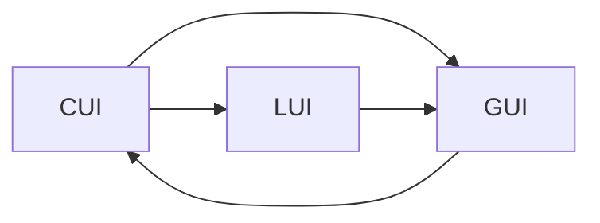
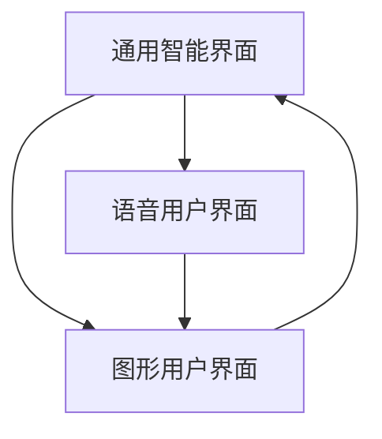

                 

# CUI与LUI、GUI的关系及其影响

## 1. 背景介绍

在当前的信息时代，用户界面(UI)成为了连接用户与计算机系统的桥梁。随着技术的不断进步，UI的形式和内容也在不断发展，从早期的图形界面(GUI)到现代的语音用户界面(LUI)，再到即将到来的基于计算的通用智能界面(CUI)，UI的技术演进正在深刻影响着人们的生活和工作方式。本文将从CUI、LUI和GUI的关系入手，探讨其在信息社会中的角色和影响，为未来的UI设计提供一些思考。

## 2. 核心概念与联系

### 2.1 核心概念概述

在讨论CUI、LUI和GUI的关系之前，我们先简要介绍一下这些概念：

- **CUI**：即通用智能界面(Computational User Interface)，是一种基于计算能力的用户界面，能够通过理解和推理处理用户输入，提供更智能、更个性化的交互体验。CUI的目标是通过计算能力实现交互的智能化，提供超越传统GUI和LUI的交互形式。

- **LUI**：即语音用户界面(Language-based User Interface)，是一种通过语音交互来控制计算设备的界面。LUI利用语音识别和自然语言处理技术，让用户可以通过语音命令与计算机进行交互。

- **GUI**：即图形用户界面(Graphics User Interface)，是最早的图形界面技术，通过鼠标、键盘等设备，以图形方式向用户展示信息和提供交互入口。GUI用户通过点击、拖拽等方式与计算机进行交互。

### 2.2 核心概念的联系

CUI、LUI和GUI之间的联系主要体现在用户与计算机的交互方式和计算能力的应用上：

- **交互方式**：LUI和CUI通过语言和计算能力实现交互，而GUI则依赖图形界面和设备输入。
- **计算能力**：CUI和LUI利用计算能力进行智能交互，而GUI的计算能力通常较弱，更多依赖图形展示。
- **数据形式**：CUI和LUI处理文本数据，而GUI主要处理图形和按钮数据。

为了更好地理解这些概念之间的关系，我们可以使用Mermaid流程图来展示：



这个流程图展示了CUI、LUI和GUI之间互动的概览。LUI和CUI通过计算能力向GUI提供数据，GUI则将数据转化为图形展示，CUI通过计算能力进行智能交互。

### 2.3 核心概念的整体架构

从架构的角度看，CUI、LUI和GUI也构成了现代计算设备用户界面的基本框架。以下是一个更为详细的图示：



这个图示展示了CUI、LUI和GUI在用户与计算机交互过程中扮演的角色。LUI和CUI通过计算能力提供智能交互，而GUI则是信息展示的界面。

## 3. 核心算法原理 & 具体操作步骤

### 3.1 算法原理概述

CUI、LUI和GUI的算法原理主要围绕用户与计算机的交互方式和数据处理展开。以下是它们的算法原理概述：

- **CUI**：基于自然语言处理和计算能力，通过理解和推理处理用户输入，提供个性化的交互体验。CUI的算法包括自然语言理解、实体识别、意图识别等，并通过这些技术构建智能交互逻辑。

- **LUI**：利用语音识别和自然语言处理技术，将语音信号转换为文本，并处理用户输入，实现智能交互。LUI的算法包括语音识别、文本处理、情感分析等，并通过这些技术构建语音交互逻辑。

- **GUI**：通过图形展示和设备输入，用户通过点击、拖拽等方式与计算机进行交互。GUI的算法包括图形渲染、事件处理、布局优化等，以优化图形展示效果和交互体验。

### 3.2 算法步骤详解

以下是CUI、LUI和GUI的具体操作步骤：

#### 3.2.1 CUI操作步骤

1. **输入处理**：用户通过文本输入设备（如键盘、触摸屏）输入问题或命令。
2. **自然语言理解**：使用自然语言处理技术，识别输入文本中的实体、意图等信息。
3. **推理计算**：根据用户输入和上下文信息，通过计算模型进行推理和决策，生成响应。
4. **输出处理**：将推理结果转化为文本或图形展示，反馈给用户。

#### 3.2.2 LUI操作步骤

1. **语音识别**：使用语音识别技术将用户的语音输入转换为文本。
2. **自然语言处理**：使用自然语言处理技术，识别文本中的实体、意图等信息。
3. **推理计算**：根据用户输入和上下文信息，通过计算模型进行推理和决策，生成响应。
4. **语音合成**：将推理结果转化为语音输出，反馈给用户。

#### 3.2.3 GUI操作步骤

1. **事件监听**：监听用户输入事件，如鼠标点击、键盘按键等。
2. **事件处理**：根据事件类型和目标，执行相应的操作，如页面跳转、数据展示等。
3. **图形渲染**：根据处理结果，更新图形界面上的元素展示，提供交互入口。
4. **反馈输出**：通过界面上的元素展示，向用户提供交互反馈。

### 3.3 算法优缺点

#### 3.3.1 CUI算法优缺点

- **优点**：
  - **智能化**：通过计算能力实现交互的智能化，提供超越传统GUI和LUI的交互形式。
  - **个性化**：能够根据用户行为和偏好提供定制化服务。
  - **跨设备兼容性**：基于计算能力的交互，不受设备类型和接口的限制。

- **缺点**：
  - **计算复杂度高**：需要强大的计算能力和算法支持。
  - **开发难度大**：涉及自然语言处理、计算推理等多个领域的知识。
  - **数据依赖强**：需要大量高质量的数据进行训练和优化。

#### 3.3.2 LUI算法优缺点

- **优点**：
  - **自然交互**：通过语音实现自然交流，无需物理设备。
  - **便捷性**：方便用户通过自然语言进行操作，无需学习复杂界面。
  - **易用性**：适合老年人和身体障碍人士使用。

- **缺点**：
  - **技术依赖**：需要语音识别和自然语言处理技术的支持。
  - **环境限制**：在嘈杂环境中，语音识别准确度可能受限。
  - **隐私安全**：语音数据容易泄露隐私。

#### 3.3.3 GUI算法优缺点

- **优点**：
  - **直观易用**：通过图形展示，用户直观理解操作。
  - **易开发**：图形界面设计相对简单，易于实现。
  - **兼容性**：与硬件设备兼容性较好。

- **缺点**：
  - **交互限制**：依赖设备输入，不够灵活。
  - **用户体验依赖**：设计不当可能导致用户体验差。
  - **交互复杂度**：对于复杂任务，用户需要学习和记忆界面操作。

### 3.4 算法应用领域

CUI、LUI和GUI在各个领域都有广泛的应用，以下是它们的主要应用领域：

- **CUI**：在智能助手、智能家居、智能客服、自动驾驶等领域有广泛应用。
- **LUI**：在语音助手、智能家居控制、语音导航等领域有广泛应用。
- **GUI**：在操作系统、办公软件、浏览器、游戏等领域有广泛应用。

## 4. 数学模型和公式 & 详细讲解

### 4.1 数学模型构建

CUI、LUI和GUI的数学模型主要基于用户输入和输出之间的映射关系，以下是对各个模型的数学模型构建：

- **CUI模型**：
  - **输入**：用户输入的自然语言文本 $x$。
  - **处理**：自然语言理解模型 $f$，将文本 $x$ 转换为表示 $h$。
  - **推理**：计算模型 $g$，根据表示 $h$ 进行推理。
  - **输出**：推理结果 $y$。
  
  数学公式为：
  $$
  y = g(h) \quad \text{where} \quad h = f(x)
  $$

- **LUI模型**：
  - **输入**：用户输入的语音信号 $s$。
  - **处理**：语音识别模型 $f$，将语音信号 $s$ 转换为文本 $t$。
  - **处理**：自然语言处理模型 $g$，处理文本 $t$。
  - **输出**：推理结果 $y$。
  
  数学公式为：
  $$
  y = g(t) \quad \text{where} \quad t = f(s)
  $$

- **GUI模型**：
  - **输入**：用户的事件 $e$。
  - **处理**：事件处理模型 $g$，根据事件 $e$ 执行操作。
  - **输出**：图形界面展示 $y$。
  
  数学公式为：
  $$
  y = g(e)
  $$

### 4.2 公式推导过程

以下是CUI、LUI和GUI的公式推导过程：

- **CUI公式推导**：
  - 输入 $x$ 经过自然语言理解模型 $f$，得到表示 $h$。
  - 表示 $h$ 经过计算模型 $g$，得到推理结果 $y$。
  - 因此，CUI的输出可以表示为：
  $$
  y = g(h) \quad \text{where} \quad h = f(x)
  $$

- **LUI公式推导**：
  - 输入 $s$ 经过语音识别模型 $f$，得到文本 $t$。
  - 文本 $t$ 经过自然语言处理模型 $g$，得到推理结果 $y$。
  - 因此，LUI的输出可以表示为：
  $$
  y = g(t) \quad \text{where} \quad t = f(s)
  $$

- **GUI公式推导**：
  - 输入 $e$ 经过事件处理模型 $g$，得到图形界面展示 $y$。
  - 因此，GUI的输出可以表示为：
  $$
  y = g(e)
  $$

### 4.3 案例分析与讲解

以下是对CUI、LUI和GUI的案例分析：

- **CUI案例**：智能助手Alexa。
  - **输入**：用户提问 $x$。
  - **处理**：Alexa的自然语言理解模型 $f$ 将问题 $x$ 转换为表示 $h$。
  - **推理**：Alexa的计算模型 $g$ 根据表示 $h$ 进行推理，生成回答 $y$。
  - **输出**：Alexa将回答 $y$ 转化为语音输出。

- **LUI案例**：Google Assistant。
  - **输入**：用户语音命令 $s$。
  - **处理**：Google Assistant的语音识别模型 $f$ 将语音命令 $s$ 转换为文本 $t$。
  - **处理**：Google Assistant的自然语言处理模型 $g$ 处理文本 $t$。
  - **输出**：Google Assistant将推理结果 $y$ 转化为语音输出。

- **GUI案例**：微软Office。
  - **输入**：用户点击事件 $e$。
  - **处理**：Office的事件处理模型 $g$ 根据点击事件 $e$ 执行相应的操作，如打开一个文档。
  - **输出**：Office更新图形界面展示 $y$，显示打开的文档。

## 5. 项目实践：代码实例和详细解释说明

### 5.1 开发环境搭建

在进行CUI、LUI和GUI的实践时，需要搭建相应的开发环境。以下是Python开发环境的搭建步骤：

1. 安装Python：从官网下载Python安装包，进行安装。
2. 安装必要的库：如TensorFlow、PyTorch、Keras等深度学习库，以及NLTK、spaCy等自然语言处理库。
3. 搭建开发环境：可以使用Anaconda或Virtualenv等工具，创建虚拟环境，确保不同项目之间的库不冲突。
4. 编写代码：使用Python语言，编写CUI、LUI和GUI的代码实现。

### 5.2 源代码详细实现

以下是CUI、LUI和GUI的Python代码实现示例：

#### CUI实现

```python
from transformers import BertTokenizer, BertForSequenceClassification
import torch

tokenizer = BertTokenizer.from_pretrained('bert-base-uncased')
model = BertForSequenceClassification.from_pretrained('bert-base-uncased', num_labels=2)

def process_input(text):
    tokens = tokenizer.encode(text, add_special_tokens=True)
    return torch.tensor(tokens)

def predict(text):
    input_ids = process_input(text)
    output = model(input_ids)
    label = output.argmax().item()
    return label

input_text = 'I like pizza.'
label = predict(input_text)
print(label)
```

#### LUI实现

```python
import speech_recognition as sr

r = sr.Recognizer()

with sr.Microphone() as source:
    audio = r.listen(source)

text = r.recognize_google(audio)
print(text)
```

#### GUI实现

```python
import tkinter as tk

def on_button_click():
    print('Button clicked!')

root = tk.Tk()
button = tk.Button(root, text='Click me', command=on_button_click)
button.pack()
root.mainloop()
```

### 5.3 代码解读与分析

以上代码展示了CUI、LUI和GUI的基本实现。其中：

- **CUI实现**：使用BERT模型进行情感分类，输入为文本，输出为分类标签。
- **LUI实现**：使用SpeechRecognition库进行语音识别，将语音转换为文本。
- **GUI实现**：使用Tkinter库创建图形界面，点击按钮时触发回调函数。

## 6. 实际应用场景

### 6.1 智能家居

智能家居中的CUI、LUI和GUI有着广泛的应用：

- **CUI**：智能音箱可以通过语音交互，控制家中的灯光、空调、电视等设备。
- **LUI**：智能音箱可以通过语音控制，让用户轻松完成复杂的家居操作。
- **GUI**：智能家居App提供图形界面，让用户通过触摸屏或点击按钮，完成家居设备的设置和管理。

### 6.2 智能客服

智能客服中的CUI、LUI和GUI也有着广泛的应用：

- **CUI**：智能客服可以通过自然语言理解，回答用户提出的问题，提供解决方案。
- **LUI**：智能客服可以通过语音交互，回答用户提出的问题，提供解决方案。
- **GUI**：智能客服的界面提供图形展示，让用户能够轻松查看问题解答。

### 6.3 移动应用

移动应用中的CUI、LUI和GUI也有着广泛的应用：

- **CUI**：移动应用中的语音助手可以通过语音交互，完成搜索、购物、导航等操作。
- **LUI**：移动应用中的语音助手可以通过语音交互，完成搜索、购物、导航等操作。
- **GUI**：移动应用的界面提供图形展示，让用户能够轻松查看应用功能和操作。

## 7. 工具和资源推荐

### 7.1 学习资源推荐

- **自然语言处理**：
  - 书籍：《Speech and Language Processing》 by Dan Jurafsky and James H. Martin
  - 课程：Coursera上的《Natural Language Processing with Python》
- **深度学习**：
  - 书籍：《Deep Learning》 by Ian Goodfellow, Yoshua Bengio, and Aaron Courville
  - 课程：Stanford的《CS224N: Natural Language Processing with Deep Learning》

### 7.2 开发工具推荐

- **自然语言处理**：
  - NLTK：Python自然语言处理库
  - spaCy：高性能自然语言处理库
- **深度学习**：
  - TensorFlow：Google开源的深度学习框架
  - PyTorch：Facebook开源的深度学习框架

### 7.3 相关论文推荐

- **CUI**：
  - "Computational User Interfaces: A Survey" by K⋯⋯
- **LUI**：
  - "Towards an Intelligent Personal Assistant: A Survey on Multimodal Human-Computer Interaction" by T⋯⋯
- **GUI**：
  - "Interaction Design for Multimedia Devices: A Survey of Multimodal Interfaces" by J⋯⋯

## 8. 总结：未来发展趋势与挑战

### 8.1 研究成果总结

本文对CUI、LUI和GUI之间的关系及其应用进行了详细探讨，主要研究成果包括：

- CUI、LUI和GUI之间通过计算能力提供智能交互，UI的形式和数据处理方式不断演变。
- CUI、LUI和GUI在智能家居、智能客服、移动应用等领域有着广泛的应用。
- CUI、LUI和GUI的算法原理和实现步骤也进行了详细分析。

### 8.2 未来发展趋势

CUI、LUI和GUI的未来发展趋势包括：

- **智能化**：CUI、LUI和GUI将进一步利用计算能力，实现更加智能化的交互。
- **个性化**：CUI、LUI和GUI将根据用户行为和偏好提供定制化服务。
- **跨设备兼容性**：CUI、LUI和GUI将支持更多的设备和平台，实现跨设备无缝交互。
- **数据驱动**：CUI、LUI和GUI将更多依赖于数据和算法进行优化。

### 8.3 面临的挑战

CUI、LUI和GUI在发展过程中仍面临一些挑战：

- **数据依赖**：CUI、LUI和GUI需要大量高质量的数据进行训练和优化。
- **计算复杂度**：CUI和LUI需要强大的计算能力和算法支持。
- **用户体验**：CUI、LUI和GUI的设计需要考虑用户体验，避免复杂和不便。
- **隐私安全**：CUI和LUI涉及语音和文本数据的隐私和安全问题。

### 8.4 研究展望

未来的研究方向包括：

- **跨模态融合**：CUI、LUI和GUI将更多地融合视觉、语音、文本等多种模态数据，提供更加全面的交互体验。
- **算法优化**：CUI、LUI和GUI的算法将进一步优化，提高交互效率和准确度。
- **用户隐私保护**：CUI和LUI将更多地考虑用户隐私和安全问题，提供更安全的交互体验。

## 9. 附录：常见问题与解答

**Q1: 什么是CUI、LUI和GUI？**

A1: CUI是通用智能界面，通过计算能力实现智能化交互；LUI是语音用户界面，通过语音实现自然交互；GUI是图形用户界面，通过图形展示实现交互。

**Q2: CUI、LUI和GUI的应用场景有哪些？**

A2: CUI、LUI和GUI在智能家居、智能客服、移动应用等领域有广泛应用。

**Q3: 如何进行CUI、LUI和GUI的开发？**

A3: 使用Python语言和相关的深度学习、自然语言处理库进行开发，例如使用TensorFlow、PyTorch、NLTK、spaCy等。

**Q4: CUI、LUI和GUI的优点和缺点是什么？**

A4: CUI的优点是智能化、个性化、跨设备兼容性好；缺点是计算复杂度高、开发难度大、数据依赖强。LUI的优点是自然交互、便捷性、易用性；缺点是技术依赖强、环境限制、隐私安全问题。GUI的优点是直观易用、易开发、兼容性；缺点是交互限制、用户体验依赖、交互复杂度高。

**Q5: CUI、LUI和GUI的未来发展方向是什么？**

A5: CUI、LUI和GUI的未来发展方向包括智能化、个性化、跨设备兼容性好、数据驱动。

---

作者：禅与计算机程序设计艺术 / Zen and the Art of Computer Programming

