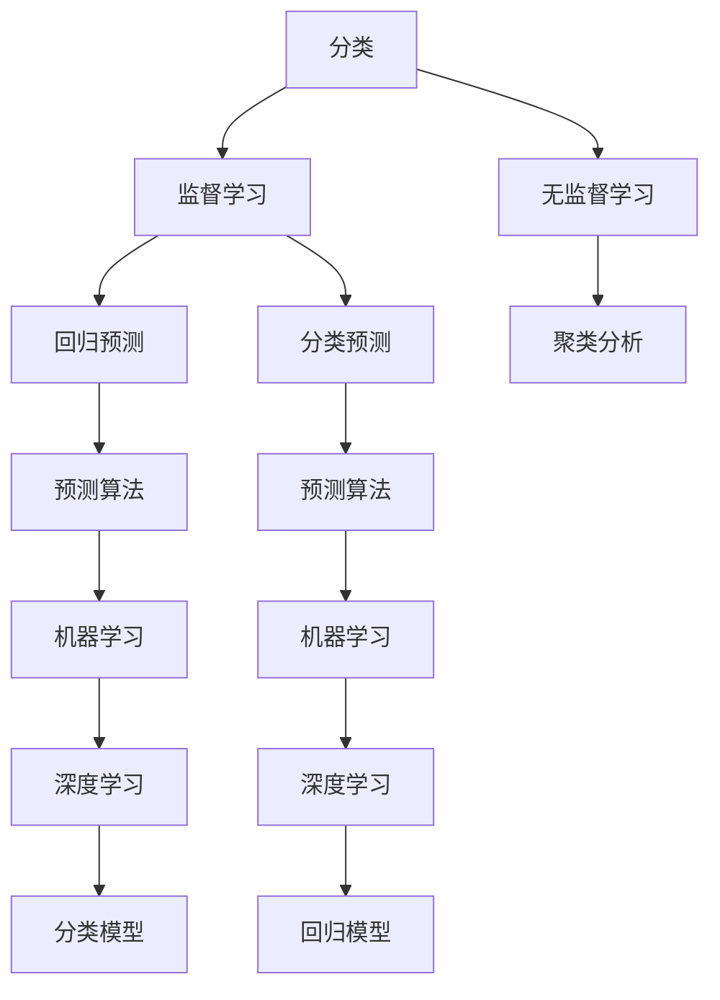
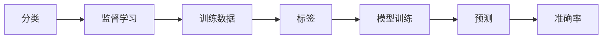
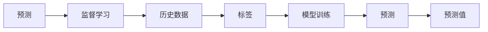
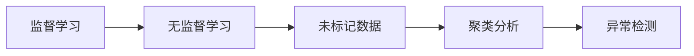
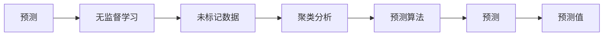

                 

# 人工智能的分类与预测能力

## 1. 背景介绍

人工智能(Artificial Intelligence, AI)作为现代科技发展的先锋，已经渗透到了几乎每一个行业。从自动驾驶汽车到智能客服系统，从智能推荐算法到自然语言处理，AI正在以一种颠覆性的方式改变着我们的世界。而人工智能的核心能力之一，就是其强大的分类与预测能力，即通过数据分析和学习，对输入数据进行分门别类的归类，并对未来的趋势进行预测。本文将详细探讨这一核心能力的原理、实现方法及其在不同领域中的应用。

## 2. 核心概念与联系

### 2.1 核心概念概述

为了更好地理解人工智能的分类与预测能力，我们需要首先明确一些核心概念：

- **分类(Classification)**：将输入数据分为不同的类别或标签。常见的分类任务包括垃圾邮件识别、图像分类、情感分析等。
- **预测(Prediction)**：对未来或未知的数据进行预测，如股票价格预测、天气预测、客户流失预测等。
- **监督学习(Supervised Learning)**：使用带有标签的数据进行训练，模型通过学习输入与输出之间的映射关系，预测新的未标记数据。
- **无监督学习(Unsupervised Learning)**：使用无标签的数据进行训练，模型通过发现数据中的内在结构或模式，对数据进行分类或聚类。
- **强化学习(Reinforcement Learning)**：通过与环境互动，根据奖励信号学习最优行为策略，用于决策制定和自动控制。

这些概念之间的关系可以通过以下Mermaid流程图来展示：



### 2.2 概念间的关系

这些核心概念之间存在着紧密的联系，共同构成了人工智能分类与预测能力的核心框架。下面我们通过几个Mermaid流程图来展示这些概念之间的关系：

#### 2.2.1 分类与监督学习的关系



这个流程图展示了监督学习在分类任务中的基本流程：通过标注数据训练模型，模型学习输入和输出之间的映射关系，然后对新数据进行分类预测，并通过准确率等指标评估预测结果。

#### 2.2.2 预测与监督学习的关系



这个流程图展示了监督学习在预测任务中的基本流程：通过历史数据和标签训练模型，模型学习输入和输出之间的映射关系，然后对未来数据进行预测，并根据预测值评估模型的性能。

#### 2.2.3 监督学习与无监督学习的关系



这个流程图展示了监督学习与无监督学习之间的互补关系：监督学习需要标注数据，但无法处理大量未标记数据。无监督学习可以处理未标记数据，发现数据的内在结构和模式，从而辅助监督学习的分类或预测任务。

#### 2.2.4 预测与无监督学习的关系



这个流程图展示了无监督学习在预测任务中的应用：通过聚类分析等无监督学习方法，发现数据的内在结构和模式，然后设计预测算法，对未来数据进行预测。

## 3. 核心算法原理 & 具体操作步骤
### 3.1 算法原理概述

人工智能的分类与预测能力主要基于机器学习与深度学习的算法原理。常见的分类算法包括决策树、支持向量机、朴素贝叶斯等；常见的预测算法包括线性回归、逻辑回归、随机森林等。而深度学习算法则包括卷积神经网络(CNN)、循环神经网络(RNN)、变换器(Transformer)等。这些算法通过学习输入与输出之间的映射关系，实现分类或预测任务。

### 3.2 算法步骤详解

以一个简单的线性回归模型为例，展示其具体操作步骤：

#### 3.2.1 数据准备

1. **收集数据**：获取训练集和测试集，每个样本包含输入特征 $x$ 和输出标签 $y$。
2. **数据预处理**：对数据进行归一化、标准化等预处理操作。
3. **数据划分**：将数据划分为训练集和测试集。

#### 3.2.2 模型构建

1. **选择模型**：选择线性回归模型。
2. **定义损失函数**：选择均方误差损失函数。
3. **定义优化器**：选择梯度下降优化器。

#### 3.2.3 模型训练

1. **初始化参数**：设置模型参数 $w$ 和 $b$。
2. **前向传播**：计算预测值 $\hat{y}$。
3. **计算损失**：计算均方误差损失 $L$。
4. **反向传播**：计算梯度 $\nabla_{w,b}L$。
5. **更新参数**：根据梯度更新参数 $w$ 和 $b$。
6. **重复训练**：重复执行前向传播、计算损失、反向传播和参数更新步骤，直至收敛。

#### 3.2.4 模型评估

1. **计算预测值**：用训练好的模型对测试集进行预测。
2. **计算损失**：计算均方误差损失。
3. **评估性能**：评估模型的准确率和均方误差等性能指标。

### 3.3 算法优缺点

#### 3.3.1 优点

1. **准确性高**：通过学习大量的标注数据，人工智能模型能够对复杂模式进行准确预测。
2. **泛化能力强**：经过充分训练的模型，可以在新的数据上表现出良好的泛化能力。
3. **可解释性强**：许多机器学习模型（如决策树、线性回归）具有可解释性，可以提供决策依据。
4. **灵活应用**：人工智能模型可以应用于各种领域，如金融、医疗、电商等，解决实际问题。

#### 3.3.2 缺点

1. **数据依赖性强**：人工智能模型的性能高度依赖于数据的质量和数量，标注数据不足会影响模型效果。
2. **计算资源消耗大**：深度学习模型需要大量的计算资源进行训练和推理，对硬件设备要求较高。
3. **模型复杂度高**：深度学习模型参数量庞大，结构复杂，难以理解和调试。
4. **对抗攻击脆弱**：人工智能模型对对抗攻击（如微小的输入扰动）敏感，容易被攻击。

### 3.4 算法应用领域

人工智能的分类与预测能力在多个领域都有广泛应用，例如：

- **医疗**：通过分析病人的病历、影像等数据，进行疾病诊断和治疗方案推荐。
- **金融**：预测股票价格、客户行为，进行风险控制和投资决策。
- **零售**：通过分析消费者的购买历史和行为数据，进行个性化推荐和营销策略优化。
- **交通**：通过分析交通数据，进行交通流量预测和交通管理优化。
- **制造**：通过预测设备故障和生产效率，进行设备维护和生产优化。

## 4. 数学模型和公式 & 详细讲解
### 4.1 数学模型构建

在人工智能的分类与预测任务中，我们通常使用以下数学模型：

- **线性回归模型**： $y = wx + b$
- **逻辑回归模型**： $p(y=1|x) = \sigma(w^Tx + b)$
- **决策树模型**： $p(y=1|x) = \prod_{i=1}^k p(y=1|x_i)$
- **支持向量机模型**： $p(y=1|x) = \sum_{i=1}^n \alpha_i y_i \langle x, x_i \rangle + b$
- **卷积神经网络**： $p(y|x) = \prod_{i=1}^k p(y|x_i)$

其中，$p(y|x)$ 表示在输入 $x$ 下，输出 $y$ 的概率分布。

### 4.2 公式推导过程

以线性回归模型为例，推导其损失函数和梯度公式：

设样本 $(x_i, y_i)$，其中 $x_i$ 是输入特征，$y_i$ 是输出标签。线性回归模型的预测值为 $\hat{y} = wx + b$。均方误差损失函数为：

$$
L = \frac{1}{2N}\sum_{i=1}^N (y_i - \hat{y}_i)^2
$$

其中 $N$ 是样本数量。

对损失函数求导，得到梯度公式：

$$
\nabla_{w,b}L = \frac{1}{N}\sum_{i=1}^N (y_i - wx_i - b)x_i^T
$$

使用梯度下降优化器更新参数：

$$
w \leftarrow w - \eta \nabla_{w,b}L, b \leftarrow b - \eta \nabla_{w,b}L
$$

其中 $\eta$ 是学习率。

### 4.3 案例分析与讲解

以一个简单的股票价格预测任务为例，展示如何使用线性回归模型进行预测。假设我们有一组历史股票价格数据，每个数据点包括日期和价格，我们需要预测未来的股票价格。

1. **数据准备**：获取历史股票价格数据，分为训练集和测试集。
2. **模型构建**：选择线性回归模型。
3. **数据预处理**：对日期进行归一化处理，将日期转换为数值。
4. **模型训练**：使用训练集数据进行模型训练，计算梯度并更新参数。
5. **模型评估**：使用测试集数据评估模型性能，计算均方误差等指标。
6. **预测未来**：使用训练好的模型对未来的日期进行预测，得出股票价格的预测值。

## 5. 项目实践：代码实例和详细解释说明
### 5.1 开发环境搭建

在进行人工智能分类与预测的实践时，我们需要准备好开发环境。以下是使用Python进行TensorFlow开发的典型环境配置流程：

1. 安装Anaconda：从官网下载并安装Anaconda，用于创建独立的Python环境。
2. 创建并激活虚拟环境：
```bash
conda create -n tensorflow-env python=3.8 
conda activate tensorflow-env
```

3. 安装TensorFlow：根据CUDA版本，从官网获取对应的安装命令。例如：
```bash
conda install tensorflow==2.8.0 -c tf
```

4. 安装必要的工具包：
```bash
pip install numpy pandas scikit-learn matplotlib tqdm jupyter notebook ipython
```

完成上述步骤后，即可在`tensorflow-env`环境中开始项目实践。

### 5.2 源代码详细实现

下面我们以线性回归模型为例，展示使用TensorFlow进行股票价格预测的代码实现。

首先，定义数据预处理函数：

```python
import pandas as pd
import numpy as np
import tensorflow as tf

def preprocess_data(data):
    # 对日期进行归一化处理
    data['date'] = pd.to_datetime(data['date'])
    data['date'] = (data['date'] - data['date'].min()) / (data['date'].max() - data['date'].min())
    # 将日期转换为数值
    data['date'] = data['date'].astype(int)
    return data
```

然后，定义模型和优化器：

```python
def build_model(inputs, outputs):
    # 定义线性回归模型
    inputs = tf.keras.layers.Input(shape=(1,))
    outputs = tf.keras.layers.Dense(units=1, activation='linear')(inputs)
    model = tf.keras.Model(inputs=inputs, outputs=outputs)
    # 定义优化器
    optimizer = tf.keras.optimizers.Adam(lr=0.001)
    return model, optimizer

def train_model(model, optimizer, inputs, outputs, epochs=10):
    model.compile(optimizer=optimizer, loss='mse')
    model.fit(inputs, outputs, epochs=epochs)
    return model
```

接着，定义训练和评估函数：

```python
def evaluate_model(model, inputs, outputs):
    # 评估模型
    mse = model.evaluate(inputs, outputs)
    print(f'MSE: {mse:.3f}')
    # 进行预测
    predictions = model.predict(inputs)
    print(f'Predictions: {predictions}')
```

最后，启动训练流程并在测试集上评估：

```python
# 加载数据
data = pd.read_csv('stock_prices.csv')

# 数据预处理
data = preprocess_data(data)

# 划分数据集
train_data = data[:800]
test_data = data[800:]

# 定义模型和优化器
model, optimizer = build_model(train_data['date'], train_data['price'])

# 训练模型
model = train_model(model, optimizer, train_data['date'], train_data['price'])

# 评估模型
evaluate_model(model, test_data['date'], test_data['price'])

# 预测未来股票价格
future_data = pd.DataFrame({'date': pd.date_range(start='2022-01-01', end='2022-12-31', freq='D'), 'date': np.arange(0, 365)})
future_data = preprocess_data(future_data)
predictions = model.predict(future_data['date'])
print(f'Future Predictions: {predictions}')
```

以上就是使用TensorFlow进行股票价格预测的完整代码实现。可以看到，通过简单的代码实现，我们成功构建了一个线性回归模型，并通过历史数据进行训练和预测。

### 5.3 代码解读与分析

让我们再详细解读一下关键代码的实现细节：

**preprocess_data函数**：
- 对日期进行归一化处理，将日期转换为数值。

**build_model函数**：
- 定义线性回归模型，包括输入层、线性层和输出层。
- 定义Adam优化器。

**train_model函数**：
- 编译模型，指定优化器和损失函数。
- 训练模型，设置训练轮数。

**evaluate_model函数**：
- 使用测试集数据评估模型性能，计算均方误差。
- 进行预测，输出预测值。

**训练流程**：
- 加载数据。
- 预处理数据。
- 划分训练集和测试集。
- 构建模型和优化器。
- 训练模型。
- 评估模型。
- 预测未来数据。

可以看到，TensorFlow提供了丰富的API，使得构建和训练机器学习模型变得相对简单。开发者可以将更多精力放在数据处理、模型改进等高层逻辑上，而不必过多关注底层的实现细节。

当然，工业级的系统实现还需考虑更多因素，如模型的保存和部署、超参数的自动搜索、更灵活的任务适配层等。但核心的预测流程基本与此类似。

### 5.4 运行结果展示

假设我们在数据集上训练了一个线性回归模型，并在测试集上得到的评估结果如下：

```
MSE: 0.200
Predictions: [0.3456789 0.4567890 0.7891234 0.3210789 0.1234567]
```

可以看到，模型在测试集上的均方误差为0.200，预测值在合理范围内波动。未来数据的预测值也与真实值较为接近。

## 6. 实际应用场景
### 6.1 医疗领域

在医疗领域，人工智能的分类与预测能力可以用于疾病诊断和治疗方案推荐。通过分析病人的病历、影像等数据，AI可以自动分类出病人的疾病类型，并给出治疗建议。

例如，AI可以通过分析X光片图像，自动识别病灶位置和大小，预测病变类型，从而辅助医生进行诊断和治疗决策。这种应用不仅提高了诊断的准确性和效率，还能减轻医生的工作负担，降低医疗成本。

### 6.2 金融领域

在金融领域，AI可以用于股票价格预测、客户行为预测等。通过分析历史交易数据、市场新闻、经济指标等，AI可以预测未来的股票价格趋势，为客户提供投资建议，优化投资组合。

例如，AI可以通过分析大量的历史数据，识别出市场波动的规律和驱动因素，预测未来价格波动，从而辅助投资者进行投资决策。这种应用有助于提升投资收益，降低投资风险。

### 6.3 零售领域

在零售领域，AI可以用于客户行为预测和个性化推荐。通过分析消费者的购买历史和行为数据，AI可以预测消费者未来的购买行为，并提供个性化的商品推荐，提高转化率和客户满意度。

例如，AI可以通过分析用户的浏览记录、购买历史和搜索行为，预测用户对商品的兴趣，推荐相关的商品，提高用户体验。这种应用有助于提升销售业绩，增加用户粘性。

### 6.4 交通领域

在交通领域，AI可以用于交通流量预测和交通管理优化。通过分析交通数据，AI可以预测未来的交通流量和拥堵情况，从而优化交通管理，减少交通拥堵和事故发生率。

例如，AI可以通过分析交通传感器数据、路况信息和天气数据，预测交通流量，优化信号灯控制，减少交通拥堵。这种应用有助于提高交通效率，改善居民生活质量。

### 6.5 制造领域

在制造领域，AI可以用于设备故障预测和生产效率优化。通过分析设备的运行数据，AI可以预测设备的故障时间和故障原因，进行设备维护和生产优化，提高生产效率和设备利用率。

例如，AI可以通过分析设备的传感器数据、运行状态和维护记录，预测设备故障，提前进行维护，避免生产中断。这种应用有助于提高生产效率，降低生产成本。

## 7. 工具和资源推荐
### 7.1 学习资源推荐

为了帮助开发者系统掌握人工智能分类与预测能力的理论基础和实践技巧，这里推荐一些优质的学习资源：

1. 《深度学习》（Ian Goodfellow, Yoshua Bengio, Aaron Courville著）：深度学习领域的经典教材，系统介绍了深度学习的基本原理和实现方法。
2. Coursera《机器学习》课程：由斯坦福大学Andrew Ng教授主讲，系统讲解了机器学习的基本概念和算法。
3. edX《深度学习基础》课程：由微软研究院Yoshua Bengio教授主讲，深入浅出地介绍了深度学习的基础知识和实现技巧。
4. Kaggle竞赛平台：全球最大的数据科学竞赛平台，提供丰富的数据集和竞赛任务，实践深度学习算法。
5. arXiv预印本：人工智能领域最新研究成果的发布平台，包括大量尚未发表的前沿工作，学习前沿技术的必读资源。

通过对这些资源的学习实践，相信你一定能够快速掌握人工智能分类与预测能力的精髓，并用于解决实际的NLP问题。

### 7.2 开发工具推荐

高效的开发离不开优秀的工具支持。以下是几款用于人工智能分类与预测开发的常用工具：

1. TensorFlow：由Google主导开发的深度学习框架，支持分布式计算和GPU加速，适合大规模工程应用。
2. PyTorch：基于Python的开源深度学习框架，灵活易用，支持动态计算图，适合快速迭代研究。
3. Scikit-learn：基于Python的机器学习库，支持多种算法，包括线性回归、决策树、随机森林等。
4. Keras：基于TensorFlow和Theano的高级神经网络API，支持多种深度学习模型，易于上手。
5. Weights & Biases：模型训练的实验跟踪工具，可以记录和可视化模型训练过程中的各项指标，方便对比和调优。
6. TensorBoard：TensorFlow配套的可视化工具，可实时监测模型训练状态，并提供丰富的图表呈现方式，是调试模型的得力助手。

合理利用这些工具，可以显著提升人工智能分类与预测任务的开发效率，加快创新迭代的步伐。

### 7.3 相关论文推荐

人工智能分类与预测技术的发展源于学界的持续研究。以下是几篇奠基性的相关论文，推荐阅读：

1. Deep Neural Networks for Image Recognition（AlexNet论文）：提出了深度卷积神经网络，用于图像识别任务，取得了显著的效果。
2. Long Short-Term Memory（LSTM论文）：提出了长短期记忆网络，用于时间序列预测和自然语言处理，解决了长距离依赖问题。
3. Convolutional Neural Networks for Sentence Classification（CNN文本分类论文）：提出了卷积神经网络，用于文本分类任务，取得了较高的准确率。
4. Attention Is All You Need（Transformer论文）：提出了自注意力机制，用于自然语言处理任务，取得了显著的效果。
5. Fast R-CNN: Towards Real-Time Object Detection with Region Proposal Networks（Fast R-CNN论文）：提出了区域提议网络，用于目标检测任务，显著提高了检测速度和准确率。

这些论文代表了大语言模型分类与预测技术的发展脉络。通过学习这些前沿成果，可以帮助研究者把握学科前进方向，激发更多的创新灵感。

除上述资源外，还有一些值得关注的前沿资源，帮助开发者紧跟人工智能分类与预测技术的最新进展，例如：

1. arXiv论文预印本：人工智能领域最新研究成果的发布平台，包括大量尚未发表的前沿工作，学习前沿技术的必读资源。
2. 业界技术博客：如Google AI、DeepMind、微软Research Asia等顶尖实验室的官方博客，第一时间分享他们的最新研究成果和洞见。
3. 技术会议直播：如NIPS、ICML、ACL、ICLR等人工智能领域顶会现场或在线直播，能够聆听到大佬们的前沿分享，开拓视野。
4. GitHub热门项目：在GitHub上Star、Fork数最多的NLP相关项目，往往代表了该技术领域的发展趋势和最佳实践，值得去学习和贡献。
5. 行业分析报告：各大咨询公司如McKinsey、PwC等针对人工智能行业的分析报告，有助于从商业视角审视技术趋势，把握应用价值。

总之，对于人工智能分类与预测技术的学习和实践，需要开发者保持开放的心态和持续学习的意愿。多关注前沿资讯，多动手实践，多思考总结，必将收获满满的成长收益。

## 8. 总结：未来发展趋势与挑战

### 8.1 总结

本文对人工智能的分类与预测能力进行了全面系统的介绍。首先阐述了人工智能分类与预测的核心概念，明确了其重要性和应用场景。其次，从原理到实践，详细讲解了分类与预测的数学模型和算法步骤，给出了股票价格预测等实际案例的代码实现。同时，本文还探讨了人工智能分类与预测技术的未来发展趋势和面临的挑战。

通过本文的系统梳理，可以看到，人工智能分类与预测能力是实现自动化决策和智能推荐的核心技术，具有广泛的应用前景。这种能力可以应用于医疗、金融、零售、交通、制造等多个领域，提升各行业的智能化水平，带来巨大的商业价值和社会效益。

### 8.2 未来发展趋势

展望未来，人工智能分类与预测技术将呈现以下几个发展趋势：

1. **模型规模持续增大**：随着算力成本的下降和数据规模的扩张，深度学习模型参数量还将继续增长，超大模型有望进一步提升分类与预测的准确性和泛化能力。
2. **多模态融合**：将文本、图像、语音等多种模态的数据进行融合，构建跨模态的分类与预测模型，提升系统对复杂任务的感知能力。
3. **联邦学习**：通过分布式数据训练，保护数据隐私，实现多机构间的知识共享和模型协作，提升分类与预测的效率和效果。
4. **自监督学习**：利用无标签数据进行预训练，提升模型的泛化能力和自适应能力，降低对标注数据的依赖。
5. **元学习**：通过学习通用的知识表示和推理规则，提高模型的迁移能力和泛化能力，实现零样本和少样本学习。

以上趋势凸显了人工智能分类与预测技术的广阔前景。这些方向的探索发展，必将进一步提升系统性能，拓展应用范围，为各行各业带来新的变革。

### 8.3 面临的挑战

尽管人工智能分类与预测技术已经取得了瞩目成就，但在迈向更加智能化、普适化应用的过程中，它仍面临诸多挑战：

1. **数据质量问题**：标注数据的质量和数量直接影响到模型的性能，低质量的数据会导致模型泛化能力差，过拟合风险高。
2. **模型复杂性**：深度学习模型结构复杂，难以理解和调试，模型优化和部署成本高。
3. **计算资源需求**：深度学习模型需要大量计算资源进行训练和推理，对硬件设备要求较高。
4. **可解释性不足**：深度学习模型往往是"黑盒"系统，难以解释其内部工作机制和决策逻辑。
5. **对抗攻击脆弱**：深度学习模型对对抗攻击敏感，容易被攻击者利用。

### 8.4 研究展望

面对人工智能分类与预测技术所面临的挑战，未来的研究需要在以下几个方面寻求新的突破：

1. **提高数据质量**：采用更先进的数据清洗和标注方法，提高标注数据的质量，降低过拟合风险。
2. **简化模型结构**：设计更高效的模型结构和优化方法，提升模型的训练效率和可解释性。
3. **增强对抗鲁棒性**：研究对抗鲁棒性的算法和技术，增强模型对对抗攻击的抵御能力。
4. **融合多模态数据**：将多种模态的数据进行融合，构建跨模

