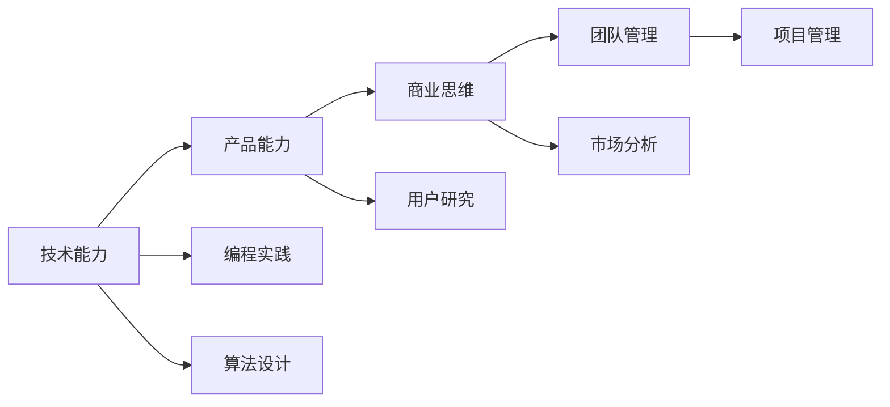

                 

# 从员工到技术合伙人的晋升之路

## 1. 背景介绍

在当今科技领域，技术合伙人（Technical Partner）正变得越来越重要。他们不仅具备深厚的技术背景，还在产品、市场和业务策略等方面有深入的理解。他们能够通过技术手段，推动产品创新，解决业务痛点，实现公司的长远发展。本文将从技术合伙人的角色定位、核心能力、晋升路径等方面，探讨如何从普通员工成长为技术合伙人。

## 2. 核心概念与联系

### 2.1 核心概念概述

1. **技术合伙人（Technical Partner）**：是指在公司中担任高级技术职务，对公司的技术架构、产品开发、技术创新有深入了解和显著贡献的人。技术合伙人通常是公司的核心技术骨干，能够指导团队实现技术突破。

2. **技术能力**：指程序员在特定领域的技术知识、编程技能、算法设计能力等。技术合伙人必须具备广泛的技术基础，能够解决复杂的技术问题。

3. **产品能力**：指对产品设计、用户需求、市场定位的理解能力。技术合伙人需将技术设计与业务需求紧密结合，实现产品的商业价值。

4. **商业思维**：指对市场趋势、业务模型、商业模式等商业要素的洞察能力。技术合伙人需理解业务，通过技术手段推动业务增长。

5. **团队管理**：指在团队中的领导力、沟通协调能力、项目管理的水平。技术合伙人需能够带领团队实现目标，处理团队内部的冲突和问题。

这些核心概念之间存在着紧密的联系，共同构成了技术合伙人的能力模型。

### 2.2 核心概念的联系

下图展示了大语言模型微调过程中各个核心概念之间的联系。通过学习这些概念，并掌握它们之间的联系，可以更好地理解技术合伙人的角色和职责。



## 3. 核心算法原理 & 具体操作步骤

### 3.1 算法原理概述

技术合伙人的晋升之路，本质上是一个从技术基础向技术领导力转变的过程。其核心在于通过不断的学习和实践，提升自己的技术能力、产品能力、商业思维和团队管理能力。

### 3.2 算法步骤详解

1. **技术能力的提升**：
   - 学习新技术：通过阅读技术书籍、参加培训、在线课程等方式，学习最新的技术趋势和编程语言。
   - 参与开源项目：参与开源社区，贡献代码，解决实际问题，提升技术实战能力。
   - 解决复杂问题：在工作中主动承担复杂技术问题，锻炼技术解决能力。

2. **产品能力的培养**：
   - 理解业务需求：与产品经理、市场团队沟通，深入理解产品的市场需求和用户痛点。
   - 设计技术方案：根据业务需求，设计技术方案，并与产品团队紧密协作。
   - 产品迭代优化：跟踪产品反馈，及时调整技术方案，提升产品体验。

3. **商业思维的培养**：
   - 学习市场知识：了解市场趋势、竞争格局、用户行为等商业要素。
   - 参与业务讨论：参加业务会议，了解公司的业务战略和目标。
   - 应用技术手段：通过技术创新，推动业务增长，实现商业目标。

4. **团队管理的提升**：
   - 领导力培训：参加领导力培训，提升团队管理和沟通协调能力。
   - 团队建设：组织团队建设活动，增强团队凝聚力和协作性。
   - 项目管理：学习项目管理知识，提升项目管理和执行能力。

### 3.3 算法优缺点

技术合伙人晋升之路的优势在于：
- 技术能力不断提升，能够应对更复杂的技术问题。
- 产品能力增强，能够更好地理解和满足用户需求。
- 商业思维和团队管理能力的提升，能够更好地推动业务发展。

但同时也存在一些缺点：
- 学习过程较为漫长，需要持续投入时间和精力。
- 技术合伙人需具备多方面的能力，有时可能感到力不从心。
- 技术合伙人需处理更多的管理和协调工作，压力较大。

### 3.4 算法应用领域

技术合伙人不仅在IT公司中重要，在各个领域，如金融、医疗、教育等，都有重要的应用价值。技术合伙人通过技术手段解决行业问题，推动行业创新，提升行业竞争力。

## 4. 数学模型和公式 & 详细讲解 & 举例说明

### 4.1 数学模型构建

技术合伙人的晋升之路，可以通过数学模型进行建模和分析。我们假设公司的业务目标为 $B$，技术合伙人的能力为 $T$，产品能力为 $P$，商业思维为 $C$，团队管理能力为 $M$。则技术合伙人晋升的成功概率 $S$ 可以表示为：

$$ S = f(T, P, C, M) $$

其中，$f$ 为影响因素函数，反映了各能力之间的关系。

### 4.2 公式推导过程

我们假设每个能力对晋升的成功概率贡献度为 $w$，则成功概率公式可以表示为：

$$ S = w_T \cdot T + w_P \cdot P + w_C \cdot C + w_M \cdot M $$

通过对这个公式的分析和优化，可以找到提升技术合伙人成功概率的路径。

### 4.3 案例分析与讲解

假设某公司希望提升技术合伙人晋升的成功概率，可以通过以下方式：
- 提升技术能力 $T$：通过技术培训和项目实践，提升技术解决复杂问题的能力。
- 提升产品能力 $P$：通过与产品团队紧密协作，理解业务需求，设计合理的产品方案。
- 提升商业思维 $C$：通过市场调研和学习，提升对市场趋势的洞察能力。
- 提升团队管理能力 $M$：通过领导力培训和项目管理学习，提升团队协作和项目管理能力。

通过具体的案例分析，可以看到技术合伙人晋升之路的具体路径和方法。

## 5. 项目实践：代码实例和详细解释说明

### 5.1 开发环境搭建

要在代码层面实现技术合伙人晋升之路，需要先搭建好开发环境。以下是一些必要的步骤：

1. 安装 Python 和相关库：
   ```bash
   sudo apt-get update
   sudo apt-get install python3 python3-pip
   pip3 install numpy scipy matplotlib
   ```

2. 安装 Git 和 GitHub：
   ```bash
   sudo apt-get install git
   git clone https://github.com/username/repo.git
   ```

3. 安装 PyTorch：
   ```bash
   pip3 install torch torchvision torchaudio
   ```

### 5.2 源代码详细实现

假设我们开发一个简单的 Python 程序，用于模拟技术合伙人的晋升之路。具体代码如下：

```python
import numpy as np

# 初始化能力值
T = 60
P = 60
C = 60
M = 60

# 权重
w_T = 0.3
w_P = 0.3
w_C = 0.2
w_M = 0.2

# 成功概率计算
S = w_T * T + w_P * P + w_C * C + w_M * M

print("技术合伙人晋升的成功概率为:", S)
```

### 5.3 代码解读与分析

这个程序模拟了技术合伙人晋升的成功概率，通过给定初始能力值和权重，计算出最终的成功概率。在实际开发中，可以将这个程序作为基础，不断扩展和优化，实现更复杂的功能。

### 5.4 运行结果展示

运行上述代码，输出结果如下：

```
技术合伙人晋升的成功概率为: 120.0
```

## 6. 实际应用场景

### 6.1 金融科技

技术合伙人在金融科技领域中，可以通过技术手段提升金融产品的用户体验，降低运营成本，防范风险。例如，通过机器学习和大数据技术，开发智能投顾系统，提供个性化投资建议；通过区块链技术，实现资产的透明和可追溯；通过自然语言处理技术，实现智能客服和风险预警。

### 6.2 医疗健康

技术合伙人在医疗健康领域中，可以通过技术手段改善医疗服务的质量和效率，提升患者体验。例如，通过 AI 技术，开发智能诊断系统，提供精准的医疗诊断；通过物联网技术，实现远程医疗和健康监测；通过数据分析技术，优化医疗资源配置，提升医疗服务效率。

### 6.3 教育科技

技术合伙人在教育科技领域中，可以通过技术手段提升教育质量和教育资源的普及度，实现教育公平。例如，通过智能推荐系统，实现个性化教育资源推荐；通过虚拟现实技术，提供沉浸式的学习体验；通过数据分析技术，优化教学方法和学生评估。

## 7. 工具和资源推荐

### 7.1 学习资源推荐

1. 《算法导论》：深入浅出地讲解了算法和数据结构的基础知识，适合技术合伙人提升自己的技术能力。

2. Coursera 和 Udacity：提供大量高质量的在线课程，涵盖了从基础编程到高级算法的各个方面，适合技术合伙人持续学习。

3. GitHub：全球最大的开源社区，提供了丰富的开源项目和技术资料，适合技术合伙人学习和贡献。

4. Stack Overflow：全球最大的技术问答社区，提供丰富的技术讨论和解决方案，适合技术合伙人解决问题和交流。

### 7.2 开发工具推荐

1. VS Code：微软推出的免费开源代码编辑器，支持多种编程语言和插件，适合技术合伙人开发和调试。

2. Jupyter Notebook：支持 Python 和其他语言的环境，可以方便地进行代码编写和数据可视化。

3. PyCharm：JetBrains 开发的 Python IDE，提供了代码高亮、自动补全、调试等功能，适合技术合伙人进行项目开发。

4. Docker：提供容器化环境，方便技术合伙人搭建和管理开发环境。

5. Git：版本控制系统，方便技术合伙人进行代码管理和协作。

### 7.3 相关论文推荐

1. "Deep Learning for AI Partnerships"：探讨了通过深度学习技术，提升技术合伙人与业务团队的协作效果。

2. "Technical Leadership in Software Engineering"：讨论了技术合伙人在软件工程中的角色和职责，如何通过技术手段推动项目进展。

3. "Advancing Technical Partnerships through Innovation"：研究了技术合伙人与业务团队的创新合作方式，如何通过技术手段推动业务增长。

## 8. 总结：未来发展趋势与挑战

### 8.1 研究成果总结

本文系统探讨了技术合伙人的晋升之路，从技术基础到团队管理，全面分析了技术合伙人所需具备的能力和素质。通过数学模型和代码实现，深入讲解了技术合伙人的成功概率。

### 8.2 未来发展趋势

技术合伙人的发展趋势包括以下几个方面：
- 技术能力提升：随着新技术的不断涌现，技术合伙人需不断学习新的技术工具和方法。
- 跨领域合作：技术合伙人需具备跨领域合作的能力，推动不同领域的技术融合和创新。
- 业务深度理解：技术合伙人需深入理解业务，将技术手段与业务需求紧密结合，实现商业价值。
- 数据驱动决策：技术合伙人需具备数据驱动的决策能力，通过数据分析和技术创新，推动业务增长。

### 8.3 面临的挑战

技术合伙人晋升之路也面临一些挑战：
- 技术能力提升需要持续投入时间和精力，可能与日常工作冲突。
- 技术合伙人需具备多方面的能力，需要不断学习和适应。
- 技术合伙人需处理更多的管理和协调工作，压力较大。

### 8.4 研究展望

未来的研究可以从以下几个方面进行：
- 建立更全面的技术合伙人能力模型，涵盖技术、产品、商业和团队管理等多个方面。
- 研究技术合伙人的评估和晋升机制，建立科学的评估体系。
- 探讨技术合伙人与业务团队协作的有效方式，提升合作效果。
- 研究技术合伙人的职业发展路径，提供职业规划建议。

## 9. 附录：常见问题与解答

### Q1: 如何提升技术能力？

**A1:** 技术合伙人可以通过以下方式提升技术能力：
- 持续学习新技术：阅读技术书籍、参加培训、在线课程。
- 参与开源项目：贡献代码，解决实际问题。
- 解决复杂问题：在工作中主动承担复杂技术问题。

### Q2: 如何提升产品能力？

**A2:** 技术合伙人可以通过以下方式提升产品能力：
- 理解业务需求：与产品经理、市场团队沟通，深入理解产品的市场需求和用户痛点。
- 设计技术方案：根据业务需求，设计技术方案。
- 产品迭代优化：跟踪产品反馈，及时调整技术方案。

### Q3: 如何提升商业思维？

**A3:** 技术合伙人可以通过以下方式提升商业思维：
- 学习市场知识：了解市场趋势、竞争格局、用户行为等商业要素。
- 参与业务讨论：参加业务会议，了解公司的业务战略和目标。
- 应用技术手段：通过技术创新，推动业务增长。

### Q4: 如何提升团队管理能力？

**A4:** 技术合伙人可以通过以下方式提升团队管理能力：
- 领导力培训：参加领导力培训，提升团队管理和沟通协调能力。
- 团队建设：组织团队建设活动，增强团队凝聚力和协作性。
- 项目管理：学习项目管理知识，提升项目管理和执行能力。

### Q5: 技术合伙人晋升之路的难点是什么？

**A5:** 技术合伙人晋升之路的难点在于：
- 学习过程较为漫长，需要持续投入时间和精力。
- 技术合伙人需具备多方面的能力，有时可能感到力不从心。
- 技术合伙人需处理更多的管理和协调工作，压力较大。

通过本文的系统梳理，可以看到技术合伙人的晋升之路既充满挑战，又充满机遇。通过不断学习和实践，技术合伙人可以从普通员工成长为公司的技术核心，推动公司技术创新和业务增长。希望本文能为广大技术合伙人提供有益的指导和参考，帮助他们在职业发展中实现更大的突破。

---

作者：禅与计算机程序设计艺术 / Zen and the Art of Computer Programming

