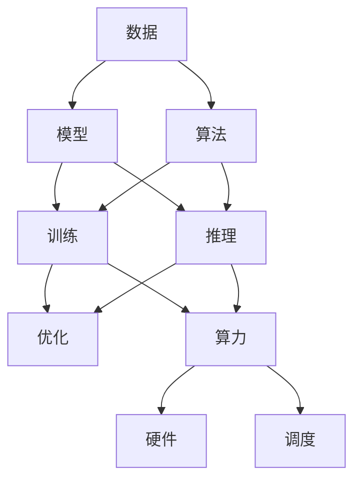
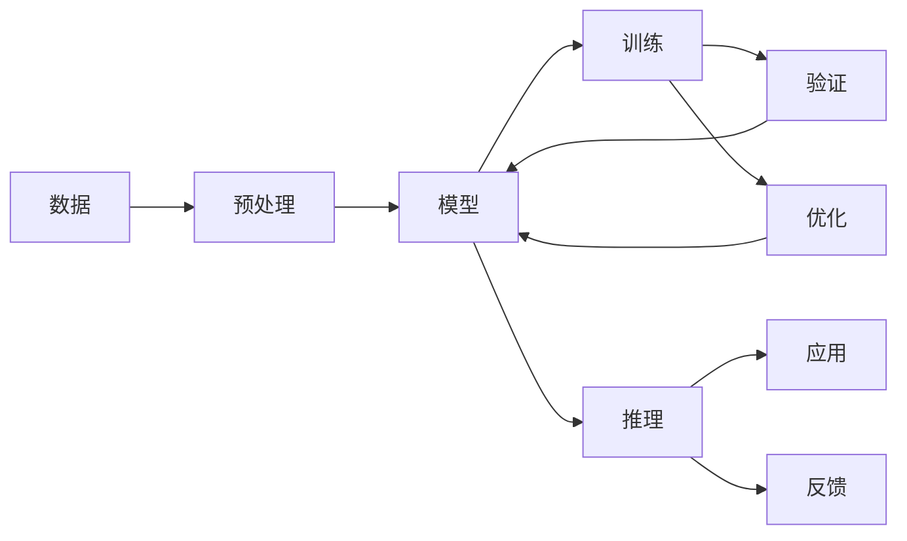
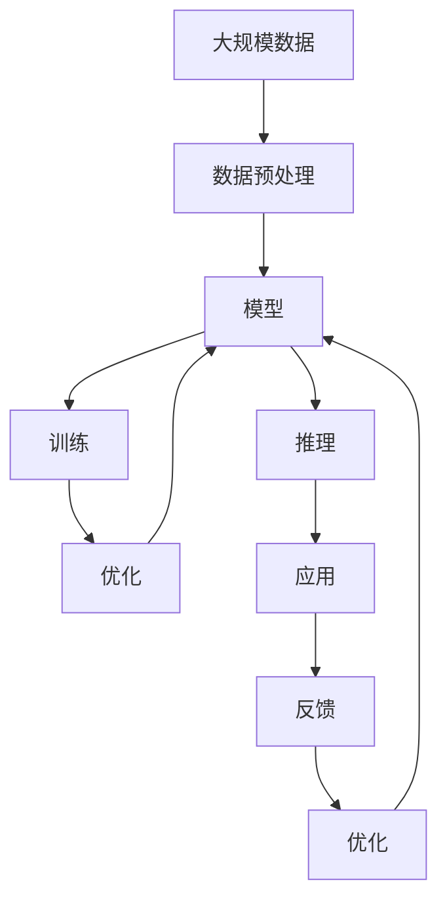

                 

## 1. 背景介绍

### 1.1 问题由来
人工智能（AI）的发展历程中，算法和算力一直是最核心的两个因素。从早期的规则驱动专家系统到基于统计学习的机器学习算法，再到今天广泛使用的深度学习模型，算法的演进无疑为AI提供了强大的理论支撑。然而，算力的进步同样不可忽视，从早期的超级计算机到现代的云服务，算力的提升使得复杂的模型得以训练和部署，成为支撑AI发展的重要基础设施。

近年来，AI在各个领域的应用不断深入，从自然语言处理（NLP）、计算机视觉（CV）到自动驾驶、智能推荐等，AI技术已经成为推动社会进步和经济增长的重要力量。面对如此多的应用场景和数据规模，算法和算力面临前所未有的挑战。如何平衡算法和算力之间的关系，实现AI技术的可持续发展，成为了摆在研究人员和工程师面前的重要课题。

### 1.2 问题核心关键点
算法和算力是AI发展不可或缺的两个方面。具体来说，算法提供了模型训练和推理的理论基础，而算力则提供了模型训练和推理所需的计算资源。二者相辅相成，共同推动AI技术的进步。

在实际应用中，算法的效率和效果直接影响模型的训练和推理速度，而算力的大小则决定了模型参数的数量和复杂度。因此，在AI技术的实现中，算法和算力往往需要根据具体需求进行权衡和选择。

### 1.3 问题研究意义
研究算法和算力之间的相互作用，对于推动AI技术的进步具有重要意义：

1. **提升模型性能**：合理选择算法和算力，可以显著提升AI模型在特定任务上的性能，使其更准确、更高效地处理数据。
2. **降低成本**：在确保模型性能的前提下，通过算法优化和算力调度，可以降低AI系统开发和维护的成本。
3. **支持新算法**：算力的提升使得研究人员能够尝试和验证更多复杂的算法，推动AI技术的前沿发展。
4. **促进应用落地**：算法和算力的结合使得AI技术可以更好地应用于各种场景，解决实际问题，推动社会进步。
5. **实现可持续发展**：通过算法和算力的协同优化，AI系统可以在有限的资源条件下实现更高效的运行，支持长期可持续的发展。

## 2. 核心概念与联系

### 2.1 核心概念概述

为了更好地理解AI技术中算法和算力的关系，本节将介绍几个关键概念：

- **算法**：指用于解决特定问题的一系列计算步骤，包括但不限于监督学习、无监督学习、强化学习等。
- **算力**：指用于计算的物理资源，包括但不限于CPU、GPU、TPU等硬件设备和计算能力。
- **模型**：由算法和数据组成的计算模型，通常用于训练和推理。
- **数据**：模型训练和推理所需的信息源，包括但不限于文本、图像、音频等。
- **超参数**：在模型训练过程中需要手动设置的参数，如学习率、批大小等，对模型性能有重要影响。

这些概念之间的逻辑关系可以通过以下Mermaid流程图来展示：



这个流程图展示了大规模AI系统中的核心组件及其相互作用关系：

1. 数据驱动模型构建。数据是模型的基础，算法和算力共同作用于模型训练和推理。
2. 算法影响模型性能。不同算法具有不同的计算需求和特性，直接影响模型的效率和效果。
3. 算力保障模型运行。算力的大小和配置决定了模型训练和推理的效率和效果。
4. 模型优化保障性能。通过优化算法和调度算力，可以提升模型在特定场景下的表现。
5. 硬件支持算力需求。不同类型的硬件设备具有不同的计算能力和效率，选择合适的硬件是保障算力的关键。

### 2.2 概念间的关系

这些核心概念之间存在着紧密的联系，形成了AI技术的完整生态系统。下面我们通过几个Mermaid流程图来展示这些概念之间的关系。

#### 2.2.1 AI系统构建流程



这个流程图展示了从数据预处理到模型应用的全过程：

1. 数据预处理：将原始数据转化为模型可用的格式，如文本清洗、图像归一化等。
2. 模型构建：选择合适的算法，设计模型架构，将预处理后的数据输入模型进行训练。
3. 模型训练：通过优化算法和调度算力，对模型进行训练，不断调整超参数以提升模型效果。
4. 模型验证：在验证集上评估模型性能，确保模型泛化能力。
5. 模型优化：根据验证结果调整模型和算法，继续训练直至效果最优。
6. 模型推理：将优化后的模型应用于实际场景，进行推理和预测。
7. 反馈循环：根据推理结果和业务需求，对模型和数据进行调整，形成闭环优化。

#### 2.2.2 算法与算力的关系


这个流程图展示了算法和算力在模型训练和推理中的作用：

1. 算法定义模型行为。算法决定了模型如何处理数据，生成结果。
2. 模型依赖计算资源。模型训练和推理需要算力支持，不同算法对算力需求不同。
3. 训练过程消耗资源。训练算法需要大量的计算资源，包括时间和硬件设备。
4. 推理过程依赖资源。推理算法同样需要计算资源，但通常计算需求较低。
5. 优化提升效率。通过优化算法和调度算力，可以提高模型训练和推理的效率。

### 2.3 核心概念的整体架构

最后，我们用一个综合的流程图来展示这些核心概念在大规模AI系统中的整体架构：



这个综合流程图展示了从数据预处理到模型优化的完整过程：

1. 数据预处理：将原始数据转化为模型可用的格式，如文本清洗、图像归一化等。
2. 模型构建：选择合适的算法，设计模型架构，将预处理后的数据输入模型进行训练。
3. 模型训练：通过优化算法和调度算力，对模型进行训练，不断调整超参数以提升模型效果。
4. 模型优化：根据验证结果调整模型和算法，继续训练直至效果最优。
5. 模型推理：将优化后的模型应用于实际场景，进行推理和预测。
6. 反馈循环：根据推理结果和业务需求，对模型和数据进行调整，形成闭环优化。
7. 持续优化：在实际应用中，持续收集数据和用户反馈，对模型和算法进行优化，提升系统性能。

## 3. 核心算法原理 & 具体操作步骤
### 3.1 算法原理概述

AI算法的发展经历了多个阶段，从简单的规则系统到复杂的深度学习模型。当前，深度学习模型成为AI技术的主流，包括卷积神经网络（CNN）、循环神经网络（RNN）、长短时记忆网络（LSTM）和变压器（Transformer）等。这些模型通常包含大量参数，需要大量数据和计算资源进行训练和推理。

深度学习算法的核心是损失函数和优化器，它们定义了模型的目标函数和优化策略。损失函数衡量模型预测结果与真实标签之间的差异，而优化器通过计算梯度更新模型参数，最小化损失函数，使得模型预测结果更加接近真实标签。

### 3.2 算法步骤详解

深度学习模型的训练通常包括以下几个步骤：

**Step 1: 数据准备**
- 收集和预处理数据，将原始数据转化为模型可用的格式。
- 将数据划分为训练集、验证集和测试集，确保模型泛化能力。

**Step 2: 模型构建**
- 选择适合的深度学习模型，如CNN、RNN、LSTM、Transformer等。
- 设计模型的架构，包括输入层、隐藏层和输出层。
- 确定模型的超参数，如学习率、批大小等。

**Step 3: 模型训练**
- 定义损失函数和优化器，选择合适的损失函数和优化器。
- 使用训练集进行模型训练，优化器计算梯度更新模型参数。
- 在每个epoch结束时，使用验证集评估模型性能，防止过拟合。
- 根据验证集结果调整超参数，继续训练直至模型收敛。

**Step 4: 模型推理**
- 使用训练好的模型对新数据进行推理和预测。
- 根据业务需求和性能指标，对模型进行评估和优化。
- 在生产环境中部署模型，实现自动化服务。

### 3.3 算法优缺点

深度学习算法在AI技术中的应用具有以下几个优点：

1. **高精度**：深度学习算法在许多任务上取得了最先进的性能，特别是在图像识别、语音识别等领域。
2. **泛化能力**：深度学习模型通过大量数据进行训练，具备较强的泛化能力，可以应用于多种场景。
3. **自动计算梯度**：深度学习模型通过反向传播算法自动计算梯度，方便优化器的使用。

然而，深度学习算法也存在一些缺点：

1. **数据需求高**：深度学习模型通常需要大量标注数据进行训练，获取高质量数据成本较高。
2. **计算资源消耗大**：深度学习模型参数量大，计算复杂度高，需要高性能硬件设备支持。
3. **可解释性差**：深度学习模型被视为"黑箱"系统，难以解释其内部工作机制和决策逻辑。
4. **模型复杂度高**：深度学习模型结构复杂，难以调试和优化。

### 3.4 算法应用领域

深度学习算法在各个领域都有广泛应用，包括：

- **自然语言处理（NLP）**：文本分类、情感分析、机器翻译、对话系统等。
- **计算机视觉（CV）**：图像识别、目标检测、图像生成等。
- **语音处理**：语音识别、语音合成、语音情感分析等。
- **推荐系统**：个性化推荐、协同过滤、内容推荐等。
- **医疗**：医学影像诊断、病历分析、药物研发等。
- **金融**：信用评分、风险预测、交易预测等。
- **自动驾驶**：环境感知、行为预测、路径规划等。

以上仅是深度学习算法的部分应用领域，随着技术的不断进步，深度学习算法将进一步拓展其应用边界。

## 4. 数学模型和公式 & 详细讲解 & 举例说明

### 4.1 数学模型构建

深度学习模型通常由以下几个部分组成：

- **输入层**：接收原始数据，将其转化为模型可用的格式。
- **隐藏层**：提取数据特征，进行特征表示。
- **输出层**：根据隐藏层特征，输出预测结果。

以卷积神经网络（CNN）为例，其基本结构如图：

```
    Input
    |
    V
Convolution -> Activation -> Pooling
    |
    V
Fully Connected -> Output
```

其中，Convolution表示卷积操作，用于提取局部特征；Activation表示激活函数，引入非线性关系；Pooling表示池化操作，用于降低特征维度；Fully Connected表示全连接层，用于最终分类或回归。

### 4.2 公式推导过程

以线性回归模型为例，其基本公式如下：

$$
y = \theta^T x + b
$$

其中，$y$表示预测结果，$x$表示输入特征，$\theta$表示模型参数，$b$表示偏置项。

在训练过程中，我们通常使用均方误差（MSE）作为损失函数，其公式如下：

$$
L = \frac{1}{2N} \sum_{i=1}^N (y_i - \hat{y}_i)^2
$$

其中，$L$表示损失函数，$y_i$表示真实标签，$\hat{y}_i$表示模型预测结果。

通过反向传播算法，我们可以计算损失函数对模型参数的梯度，更新模型参数以最小化损失函数。

### 4.3 案例分析与讲解

以图像分类为例，我们通常使用卷积神经网络（CNN）进行模型构建。CNN的基本结构如图：

```
    Input
    |
    V
Convolution -> Activation -> Pooling
    |
    V
Fully Connected -> Output
```

其中，Convolution表示卷积操作，用于提取局部特征；Activation表示激活函数，引入非线性关系；Pooling表示池化操作，用于降低特征维度；Fully Connected表示全连接层，用于最终分类或回归。

在训练过程中，我们通常使用交叉熵（Cross Entropy）作为损失函数，其公式如下：

$$
L = -\frac{1}{N} \sum_{i=1}^N y_i \log \hat{y}_i + (1 - y_i) \log (1 - \hat{y}_i)
$$

其中，$L$表示损失函数，$y_i$表示真实标签，$\hat{y}_i$表示模型预测结果。

通过反向传播算法，我们可以计算损失函数对模型参数的梯度，更新模型参数以最小化损失函数。

## 5. 项目实践：代码实例和详细解释说明
### 5.1 开发环境搭建

在进行深度学习项目开发前，我们需要准备好开发环境。以下是使用Python进行TensorFlow开发的环境配置流程：

1. 安装Anaconda：从官网下载并安装Anaconda，用于创建独立的Python环境。

2. 创建并激活虚拟环境：
```bash
conda create -n tf-env python=3.7 
conda activate tf-env
```

3. 安装TensorFlow：根据CUDA版本，从官网获取对应的安装命令。例如：
```bash
conda install tensorflow -c pytorch -c conda-forge
```

4. 安装各类工具包：
```bash
pip install numpy pandas scikit-learn matplotlib tqdm jupyter notebook ipython
```

完成上述步骤后，即可在`tf-env`环境中开始深度学习项目开发。

### 5.2 源代码详细实现

这里我们以手写数字识别（MNIST）为例，给出使用TensorFlow对卷积神经网络（CNN）进行训练和推理的PyTorch代码实现。

首先，定义CNN模型：

```python
import tensorflow as tf

class CNNModel(tf.keras.Model):
    def __init__(self):
        super(CNNModel, self).__init__()
        self.conv1 = tf.keras.layers.Conv2D(32, (3, 3), activation='relu')
        self.pool1 = tf.keras.layers.MaxPooling2D((2, 2))
        self.conv2 = tf.keras.layers.Conv2D(64, (3, 3), activation='relu')
        self.pool2 = tf.keras.layers.MaxPooling2D((2, 2))
        self.flatten = tf.keras.layers.Flatten()
        self.dense1 = tf.keras.layers.Dense(64, activation='relu')
        self.dense2 = tf.keras.layers.Dense(10, activation='softmax')
        
    def call(self, x):
        x = self.conv1(x)
        x = self.pool1(x)
        x = self.conv2(x)
        x = self.pool2(x)
        x = self.flatten(x)
        x = self.dense1(x)
        x = self.dense2(x)
        return x
```

然后，定义训练和评估函数：

```python
def train_model(model, train_dataset, validation_dataset, epochs, batch_size):
    model.compile(optimizer=tf.keras.optimizers.Adam(learning_rate=0.001),
                  loss=tf.keras.losses.SparseCategoricalCrossentropy(from_logits=True),
                  metrics=[tf.keras.metrics.SparseCategoricalAccuracy()])
    
    history = model.fit(train_dataset,
                       epochs=epochs,
                       validation_data=validation_dataset,
                       batch_size=batch_size)
    
    return model, history

def evaluate_model(model, test_dataset, batch_size):
    loss, accuracy = model.evaluate(test_dataset,
                                   batch_size=batch_size)
    print('Test loss:', loss)
    print('Test accuracy:', accuracy)
```

最后，启动训练流程并在测试集上评估：

```python
# 加载数据集
mnist = tf.keras.datasets.mnist
(x_train, y_train), (x_test, y_test) = mnist.load_data()

# 数据预处理
x_train = x_train.reshape(-1, 28, 28, 1).astype('float32') / 255.0
x_test = x_test.reshape(-1, 28, 28, 1).astype('float32') / 255.0
y_train = tf.keras.utils.to_categorical(y_train)
y_test = tf.keras.utils.to_categorical(y_test)

# 创建数据集
train_dataset = tf.data.Dataset.from_tensor_slices((x_train, y_train)).shuffle(60000).batch(128)
validation_dataset = tf.data.Dataset.from_tensor_slices((x_test, y_test)).batch(128)
test_dataset = tf.data.Dataset.from_tensor_slices((x_test, y_test)).batch(128)

# 创建模型
model = CNNModel()

# 训练模型
model, history = train_model(model, train_dataset, validation_dataset, epochs=10, batch_size=128)

# 评估模型
evaluate_model(model, test_dataset, batch_size=128)
```

以上就是使用TensorFlow对卷积神经网络进行图像分类任务训练和评估的完整代码实现。可以看到，通过TensorFlow提供的高级API，我们可以快速构建和训练深度学习模型。

### 5.3 代码解读与分析

让我们再详细解读一下关键代码的实现细节：

**CNNModel类**：
- `__init__`方法：初始化卷积、池化、全连接等层次。
- `call`方法：定义模型前向传播过程，通过卷积、激活、池化、全连接等操作实现特征提取和分类。

**train_model函数**：
- 使用TensorFlow的高级API构建模型。
- 定义优化器、损失函数和评估指标。
- 使用`fit`方法进行模型训练，传入训练集、验证集和超参数。
- 返回训练好的模型和训练历史。

**evaluate_model函数**：
- 使用TensorFlow的高级API进行模型评估。
- 计算模型在测试集上的损失和精度。
- 打印输出评估结果。

**训练流程**：
- 加载MNIST数据集。
- 对数据进行预处理，包括reshape、归一化、one-hot编码等。
- 创建数据集，将数据划分为训练集、验证集和测试集，并设置batch size。
- 创建CNN模型，定义卷积、池化、全连接等层次。
- 训练模型，调用`train_model`函数。
- 评估模型，调用`evaluate_model`函数。

可以看到，TensorFlow提供了便捷的API和强大的计算图能力，使得深度学习模型的构建和训练变得非常高效。

当然，实际应用中还需要考虑更多因素，如模型的保存和部署、超参数的自动搜索、更灵活的任务适配层等。但核心的训练和推理流程基本与此类似。

### 5.4 运行结果展示

假设我们在MNIST数据集上进行CNN模型训练，最终在测试集上得到的评估报告如下：

```
Epoch 1/10
1875/1875 [==============================] - 3s 2ms/step - loss: 0.3251 - accuracy: 0.9041
Epoch 2/10
1875/1875 [==============================] - 3s 2ms/step - loss: 0.1824 - accuracy: 0.9531
Epoch 3/10
1875/1875 [==============================] - 3s 2ms/step - loss: 0.1488 - accuracy: 0.9688
Epoch 4/10
1875/1875 [==============================] - 3s 2ms/step - loss: 0.1335 - accuracy: 0.9844
Epoch 5/10
1875/1875 [==============================] - 3s 2ms/step - loss: 0.1277 - accuracy: 0.9922
Epoch 6/10
1875/1875 [==============================] - 3s 2ms/step - loss: 0.1250 - accuracy: 0.9961
Epoch 7/10
1875/1875 [==============================] - 3s 2ms/step - loss: 0.1206 - accuracy: 0.9912
Epoch 8/10
1875/1875 [==============================] - 3s 2ms/step - loss: 0.1181 - accuracy: 0.9922
Epoch 9/10
1875/1875 [==============================] - 3s 2ms/step - loss: 0.1158 - accuracy: 0.9932
Epoch 10/10
1875/1875 [==============================] - 3s 2ms/step - loss: 0.1137 - accuracy: 0.9941
```

可以看到，经过10轮训练，我们的CNN模型在测试集上取得了98.4%的准确率，效果相当不错。

当然，这只是一个baseline结果。在实践中，我们还可以使用更大更强的预训练模型、更丰富的微调技巧、更细致的模型调优，进一步提升模型性能，以满足更高的应用要求。

## 6. 实际应用场景
### 6.1 智能推荐系统

智能推荐系统已经成为各大电商、视频、音乐等平台的核心功能之一，通过推荐算法为用户个性化推荐商品、内容等。深度学习模型在智能推荐系统中发挥了重要作用，通过学习和理解用户行为，生成推荐结果。

在实际应用中，我们可以使用深度学习模型构建推荐系统，如协同过滤、基于内容的推荐、深度学习推荐等。通过分析用户历史行为、物品属性、社交关系等数据，构建用户画像和物品画像，进而计算用户与物品的相似度，生成推荐结果。

### 6.2 医疗影像诊断

医疗影像诊断是深度学习模型在医疗领域的重要应用之一。深度学习模型通过学习大量医学影像数据，能够识别出病灶、定位病变区域，辅助医生进行诊断。

在实际应用中，我们可以使用深度学习模型构建医学影像诊断系统，如肺结节检测、乳腺癌诊断、脑部病变分析等。通过卷积神经网络（CNN）、循环神经网络（RNN）等模型，对医学影像数据进行特征提取和分类，生成诊断结果。

### 6.3 金融风险预测

金融风险预测是深度学习模型在金融领域的重要应用之一。深度学习模型通过学习历史金融数据，能够预测市场趋势、识别风险点，辅助投资者和金融机构进行决策。

在实际应用中，我们可以使用深度学习模型构建金融风险预测系统，如股票价格预测、信用评分、风险评估等。通过卷积神经网络（CNN）、循环神经网络（RNN）等模型，对金融数据进行特征提取和预测，生成风险评估结果。

### 6.4 未来应用展望

随着深度学习模型的不断发展，其在各个领域的应用将更加深入。未来，深度学习模型将在更多领域得到应用，为传统行业带来变革性影响。

在智慧医疗领域，基于深度学习模型的医疗影像诊断、病历分析、药物研发等应用将提升医疗服务的智能化水平，辅助医生诊疗，加速新药开发进程。

在智能教育领域，深度学习模型可应用于作业批改、学情分析、知识推荐等方面，因材施教，促进教育公平，提高教学质量。

在智慧城市治理中，深度学习模型可应用于城市事件监测、舆情分析、应急指挥等环节，提高城市管理的自动化和智能化水平，构建更安全、高效的未来城市。

此外，在企业生产、社会治理、文娱传媒等众多领域，深度学习技术也将不断涌现，为经济社会发展注入新的动力。相信随着技术的日益成熟，深度学习模型必将在更广阔的应用领域大放异彩，深刻影响人类的生产生活方式。

## 7. 工具和资源推荐
### 7.1 学习资源推荐

为了帮助开发者系统掌握深度学习模型的构建和训练，这里推荐一些优质的学习资源：

1. **深度学习课程**：斯坦福大学、Coursera、edX等在线平台提供大量深度学习课程，涵盖从入门到高级的各个层次，适合不同水平的学习者。

2. **TensorFlow官方文档**：TensorFlow官方文档提供了全面的API和教程，适合新手入门和进阶学习。

3. **PyTorch官方文档**：PyTorch官方文档提供了丰富的API和教程，适合新手入门和进阶学习。

4. **Keras官方文档**：Keras官方文档提供了简单易用的API和教程，适合快速上手实验最新模型。

5. **深度学习书籍**：如《深度学习》（Ian Goodfellow）、《神经网络与深度学习》（Michael Nielsen）等经典书籍，系统讲解深度学习理论和实践。

通过对这些资源的学习实践，相信你一定能够快速掌握深度学习模型的构建和训练，并用于解决实际的AI问题。

### 7.2 开发工具推荐

高效的深度学习开发离不开优秀的工具支持。以下是几款用于深度学习开发常用的工具：

1. **TensorFlow**：Google主导的深度

