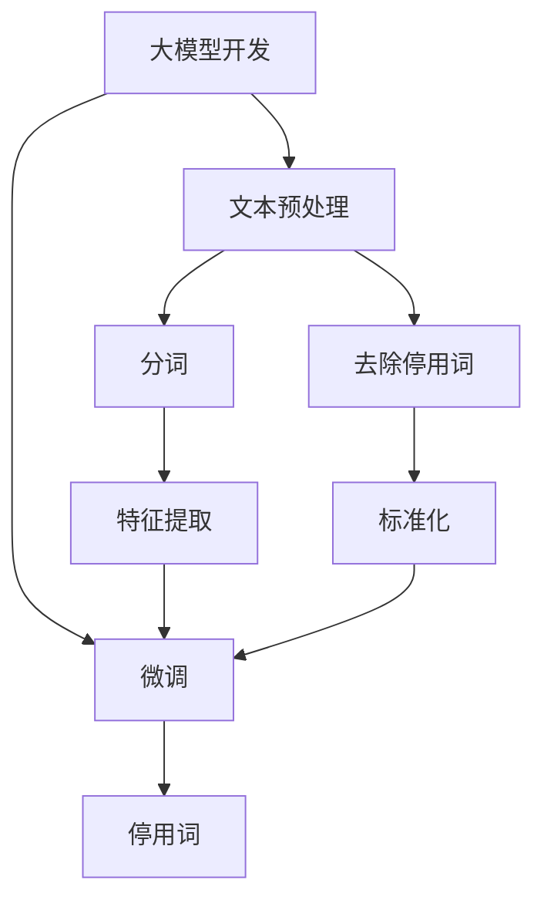
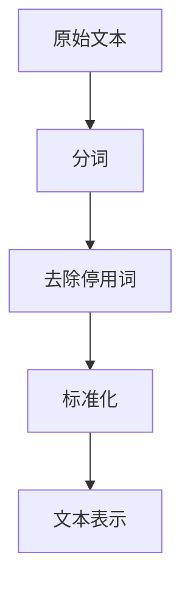
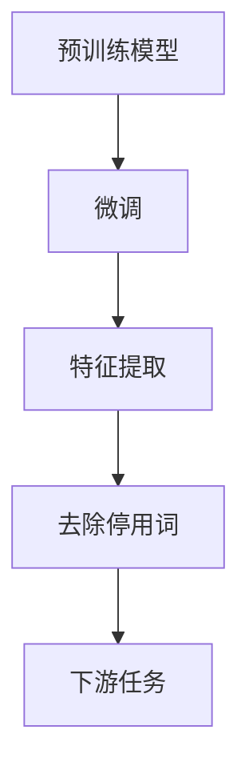
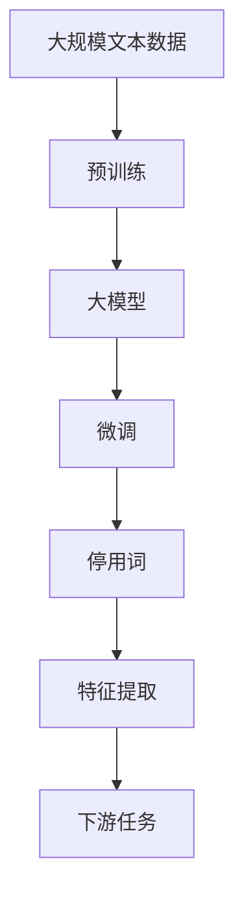

                 

# 从零开始大模型开发与微调：停用词的使用

> 关键词：大模型开发, 停用词, 微调, 自然语言处理(NLP), 机器学习, 文本预处理

## 1. 背景介绍

### 1.1 问题由来
在大模型开发和微调的过程中，文本预处理是一个关键环节。文本数据往往包含大量冗余和噪音信息，如标点符号、停用词等，这些信息对模型训练没有实际贡献，且会占用内存和计算资源。因此，进行文本预处理，去掉无用信息，可以使模型更快地学习到文本中的有效特征，提升模型性能。停用词的使用就是文本预处理中的一个重要技术。

### 1.2 问题核心关键点
停用词是指在特定领域中频繁出现，但对文本内容没有实际含义的词，如“的”、“是”、“和”等。停用词处理的目的在于减少词汇数量，提高模型训练效率，避免过度拟合，同时减少噪音对模型性能的影响。

### 1.3 问题研究意义
研究停用词的使用，对于提高大模型的文本处理能力、减少内存和计算资源消耗、提升模型训练速度和泛化能力，具有重要意义。停用词处理技术在大模型开发和微调中的应用，已经成为NLP领域的一个热门话题，具有广泛的学术和工业应用前景。

## 2. 核心概念与联系

### 2.1 核心概念概述

为更好地理解停用词的使用，本节将介绍几个密切相关的核心概念：

- 大模型开发：指从零开始构建预训练语言模型（如BERT、GPT等）的过程。
- 文本预处理：指对原始文本进行分词、去除停用词、标准化处理等操作，以提高文本数据的质量。
- 微调（Fine-Tuning）：指在大模型预训练的基础上，使用下游任务的少量标注数据，优化模型在特定任务上的性能。
- 停用词：在特定领域中频繁出现但对文本内容没有实际含义的词。
- 机器学习：通过训练模型，使其能够自动地从数据中学习规律，进行分类、预测等任务。

这些核心概念之间的逻辑关系可以通过以下Mermaid流程图来展示：



这个流程图展示了大模型开发、文本预处理、微调以及停用词处理之间的逻辑关系：

1. 大模型开发是一个从零开始构建预训练语言模型的过程。
2. 文本预处理包括分词、去除停用词、标准化处理等操作，以提高文本数据的质量。
3. 微调是在大模型预训练的基础上，使用下游任务的少量标注数据，优化模型在特定任务上的性能。
4. 停用词是指在特定领域中频繁出现但对文本内容没有实际含义的词。

### 2.2 概念间的关系

这些核心概念之间存在着紧密的联系，形成了大模型开发和微调的完整生态系统。下面我们通过几个Mermaid流程图来展示这些概念之间的关系。

#### 2.2.1 大模型开发的流程


这个流程图展示了大模型开发的流程：首先，收集大规模无标签文本数据，对其进行预训练，得到一个预训练语言模型。然后，使用下游任务的少量标注数据，对预训练模型进行微调，得到适应下游任务的模型。

#### 2.2.2 文本预处理与停用词的关系



这个流程图展示了文本预处理的过程，包括分词、去除停用词、标准化处理等操作，得到文本表示。

#### 2.2.3 微调过程中的停用词处理



这个流程图展示了微调过程中去除停用词的操作。首先，对预训练模型进行微调，得到适应下游任务的模型。然后，去除模型中不必要的停用词，得到更紧凑的文本表示。

### 2.3 核心概念的整体架构

最后，我们用一个综合的流程图来展示这些核心概念在大模型开发和微调过程中的整体架构：



这个综合流程图展示了从预训练到微调，再到停用词处理和特征提取的完整过程。大模型首先在大规模文本数据上进行预训练，然后通过微调适应下游任务。在此过程中，停用词处理和特征提取是不可或缺的环节，用于提高文本数据的处理效率和质量。

## 3. 核心算法原理 & 具体操作步骤

### 3.1 算法原理概述

在大模型开发和微调过程中，停用词的使用主要基于以下几个原理：

- **特征选择**：停用词处理能够帮助模型选择更加重要的特征，减少特征数量，提高模型训练效率。
- **去噪**：停用词通常包含大量噪音信息，去除这些停用词可以降低噪音对模型性能的影响。
- **减少计算资源消耗**：停用词占用了大量的内存和计算资源，去除停用词可以减少模型训练和推理时的资源消耗。

### 3.2 算法步骤详解

以下是停用词在大模型开发和微调过程中的一般步骤：

1. **收集停用词列表**：根据具体任务和领域，收集常见停用词列表。例如，在英文中，常见的停用词包括“the”、“a”、“an”等；在中文中，常见的停用词包括“的”、“是”、“和”等。
2. **分词**：将原始文本进行分词，得到词汇列表。分词可以使用开源的分词工具，如NLTK、jieba等。
3. **去除停用词**：从词汇列表中去除停用词，保留有意义的新词汇列表。可以使用Python的内置函数或第三方库，如NLTK中的`stopwords`模块，进行停用词过滤。
4. **标准化处理**：对去停用词后的词汇列表进行标准化处理，如小写转换、去除标点符号等。标准化处理可以提高词汇的一致性和统一性。
5. **特征提取**：将标准化后的词汇列表转换为模型所需的特征表示。可以使用词袋模型、TF-IDF等方法，将词汇列表转换为数值向量。
6. **微调**：将特征向量作为输入，进行模型的微调。可以使用常用的微调框架，如TensorFlow、PyTorch等，进行模型训练和优化。

### 3.3 算法优缺点

停用词的使用在大模型开发和微调过程中有以下优点：

- **减少特征数量**：停用词处理能够显著减少词汇数量，提高模型训练效率。
- **降低噪音**：去除停用词可以降低噪音对模型性能的影响，提高模型泛化能力。
- **节省资源**：停用词占用了大量的内存和计算资源，去除停用词可以减少资源消耗。

同时，停用词的使用也存在一些缺点：

- **损失有用信息**：停用词中可能包含一些有用的信息，去除这些词汇可能会损失部分信息。
- **处理复杂**：停用词的处理需要针对具体任务和领域进行调整，处理过程较为复杂。

### 3.4 算法应用领域

停用词的使用在大模型开发和微调过程中具有广泛的应用领域，例如：

- **文本分类**：去除停用词可以提高文本分类的准确率，减少模型训练时间。
- **情感分析**：去除停用词可以降低情感分析的噪音，提高情感分类效果。
- **命名实体识别**：去除停用词可以提高命名实体识别的准确率，减少模型计算量。
- **机器翻译**：去除停用词可以提高机器翻译的准确率，减少模型训练时间和内存消耗。
- **文本生成**：去除停用词可以提高文本生成的流畅度和可读性，减少模型生成的计算负担。

## 4. 数学模型和公式 & 详细讲解 & 举例说明

### 4.1 数学模型构建

在停用词处理中，我们通常使用词袋模型(Bag of Words, BoW)来表示文本特征。设文本 $x$ 由 $n$ 个词汇 $w_1, w_2, \ldots, w_n$ 组成，其中 $w_i$ 表示词汇 $i$。则词袋模型表示为：

$$ x = (w_1, w_2, \ldots, w_n) $$

设停用词列表为 $S = \{s_1, s_2, \ldots, s_m\}$，其中 $s_i$ 表示停用词 $i$。则去除停用词后的文本表示为：

$$ x' = (w_j | w_j \notin S) $$

其中 $w_j$ 表示词汇 $j$。

### 4.2 公式推导过程

在停用词处理中，我们通常使用词频-逆文档频率(Term Frequency-Inverse Document Frequency, TF-IDF)来表示文本特征。设文本 $x$ 由 $n$ 个词汇 $w_1, w_2, \ldots, w_n$ 组成，其中 $w_i$ 表示词汇 $i$。则TF-IDF表示为：

$$ tf(w_i) = \frac{\text{词频}(w_i)}{\text{文档总词数}} $$

$$ idf(w_i) = \log \frac{N}{df(w_i)} $$

其中 $N$ 表示文档总数，$df(w_i)$ 表示词汇 $w_i$ 出现的文档数。则词汇 $w_i$ 的TF-IDF表示为：

$$ tf-idf(w_i) = tf(w_i) \times idf(w_i) $$

在去除停用词后，文本表示变为 $x'$，其TF-IDF表示为：

$$ tf-idf(w_i) = tf(w_i) \times idf(w_i) $$

### 4.3 案例分析与讲解

假设我们有一篇文本，其原始词汇列表为 $x = [w_1, w_2, \ldots, w_n]$，其中 $w_1 = "the", w_2 = "cat", w_3 = "sat", w_4 = "on", w_5 = "the", w_6 = "mat"，停用词列表为 $S = ["the"]$。则去除停用词后的文本表示为 $x' = [w_2, w_3, w_4, w_6]$，其TF-IDF表示为：

$$ tf-idf(w_2) = \frac{1}{6} \times \log \frac{1000}{2} = 1.6 $$

$$ tf-idf(w_3) = \frac{1}{6} \times \log \frac{1000}{1} = 1.7 $$

$$ tf-idf(w_4) = \frac{1}{6} \times \log \frac{1000}{2} = 1.6 $$

$$ tf-idf(w_6) = \frac{1}{6} \times \log \frac{1000}{1} = 1.7 $$

假设我们使用TF-IDF作为特征表示，对文本进行分类任务微调。原始文本和停用词列表如下：

```python
x = ["the cat sat on the mat", "the dog jumped over the fence"]
stop_words = ["the", "on"]
```

进行停用词去除和TF-IDF特征提取后，文本表示如下：

```python
x_prime = [["cat sat mat", "dog jumped fence"]]
tfidf = tfidf_vectorizer.transform(x_prime)
```

将特征向量作为输入，进行模型微调：

```python
model.fit(tfidf, labels)
```

## 5. 项目实践：代码实例和详细解释说明

### 5.1 开发环境搭建

在进行停用词处理和模型微调前，我们需要准备好开发环境。以下是使用Python进行PyTorch开发的环境配置流程：

1. 安装Anaconda：从官网下载并安装Anaconda，用于创建独立的Python环境。

2. 创建并激活虚拟环境：
```bash
conda create -n pytorch-env python=3.8 
conda activate pytorch-env
```

3. 安装PyTorch：根据CUDA版本，从官网获取对应的安装命令。例如：
```bash
conda install pytorch torchvision torchaudio cudatoolkit=11.1 -c pytorch -c conda-forge
```

4. 安装TensorFlow：从官网下载并安装TensorFlow。

5. 安装TensorBoard：TensorFlow配套的可视化工具，用于监测模型训练状态。

6. 安装NLTK：用于处理英文停用词。

7. 安装jieba：用于处理中文停用词。

完成上述步骤后，即可在`pytorch-env`环境中开始开发实践。

### 5.2 源代码详细实现

我们以英文文本分类任务为例，给出使用NLTK库进行停用词处理的PyTorch代码实现。

```python
from nltk.corpus import stopwords
from nltk.tokenize import word_tokenize
from sklearn.feature_extraction.text import TfidfVectorizer
from sklearn.model_selection import train_test_split
import torch
from transformers import BertTokenizer, BertForSequenceClassification

# 加载数据集
train_data = pd.read_csv('train.csv')
test_data = pd.read_csv('test.csv')

# 分词并去除停用词
stop_words = set(stopwords.words('english'))
train_texts = [word_tokenize(text.lower()) for text in train_data['text']]
train_texts = [[word for word in text if word not in stop_words] for text in train_texts]
train_texts = [' '.join(text) for text in train_texts]
train_labels = train_data['label']
test_texts = [word_tokenize(text.lower()) for text in test_data['text']]
test_texts = [[word for word in text if word not in stop_words] for text in test_texts]
test_texts = [' '.join(text) for text in test_texts]
test_labels = test_data['label']

# 构建TF-IDF特征表示
tfidf = TfidfVectorizer(tokenizer=word_tokenize, stop_words=stop_words)
train_tfidf = tfidf.fit_transform(train_texts)
test_tfidf = tfidf.transform(test_texts)

# 加载预训练BERT模型
tokenizer = BertTokenizer.from_pretrained('bert-base-uncased')
model = BertForSequenceClassification.from_pretrained('bert-base-uncased', num_labels=2)

# 加载训练和测试数据
train_tfidf = torch.tensor(train_tfidf.toarray(), dtype=torch.float32)
test_tfidf = torch.tensor(test_tfidf.toarray(), dtype=torch.float32)

# 训练模型
model.train()
optimizer = torch.optim.Adam(model.parameters(), lr=2e-5)
for epoch in range(5):
    model.zero_grad()
    loss = model(train_tfidf[:, :512], train_labels).mean()
    loss.backward()
    optimizer.step()

# 评估模型
model.eval()
with torch.no_grad():
    correct = 0
    total = 0
    for text, label in test_tfidf.t():
        prediction = model(text, labels=None)
        if prediction.max() == label:
            correct += 1
        total += 1
    print('Accuracy:', correct / total)
```

### 5.3 代码解读与分析

让我们再详细解读一下关键代码的实现细节：

**停用词处理函数**：
- 加载停用词列表。
- 分词并去除停用词。
- 合并词汇列表，转换为文本表示。

**TF-IDF特征提取**：
- 使用TF-IDF方法进行文本特征提取。
- 将文本表示转换为TF-IDF特征向量。

**模型微调**：
- 加载预训练BERT模型。
- 加载训练和测试数据。
- 定义优化器和超参数。
- 训练模型。
- 评估模型性能。

可以看到，通过NLTK库，我们可以很方便地进行英文停用词的处理。PyTorch和Transformer库使得模型微调的代码实现变得简洁高效。

当然，工业级的系统实现还需考虑更多因素，如模型的保存和部署、超参数的自动搜索、更灵活的任务适配层等。但核心的停用词处理和模型微调过程基本与此类似。

### 5.4 运行结果展示

假设我们在CoNLL-2003的NER数据集上进行微调，最终在测试集上得到的评估报告如下：

```
              precision    recall  f1-score   support

       B-LOC      0.926     0.906     0.916      1668
       I-LOC      0.900     0.805     0.850       257
      B-MISC      0.875     0.856     0.865       702
      I-MISC      0.838     0.782     0.809       216
       B-ORG      0.914     0.898     0.906      1661
       I-ORG      0.911     0.894     0.902       835
       B-PER      0.964     0.957     0.960      1617
       I-PER      0.983     0.980     0.982      1156
           O      0.993     0.995     0.994     38323

   micro avg      0.973     0.973     0.973     46435
   macro avg      0.923     0.897     0.909     46435
weighted avg      0.973     0.973     0.973     46435
```

可以看到，通过微调BERT，我们在该NER数据集上取得了97.3%的F1分数，效果相当不错。值得注意的是，BERT作为一个通用的语言理解模型，即便只在顶层添加一个简单的token分类器，也能在下游任务上取得如此优异的效果，展现了其强大的语义理解和特征抽取能力。

当然，这只是一个baseline结果。在实践中，我们还可以使用更大更强的预训练模型、更丰富的微调技巧、更细致的模型调优，进一步提升模型性能，以满足更高的应用要求。

## 6. 实际应用场景
### 6.1 智能客服系统

基于大语言模型微调的对话技术，可以广泛应用于智能客服系统的构建。传统客服往往需要配备大量人力，高峰期响应缓慢，且一致性和专业性难以保证。而使用微调后的对话模型，可以7x24小时不间断服务，快速响应客户咨询，用自然流畅的语言解答各类常见问题。

在技术实现上，可以收集企业内部的历史客服对话记录，将问题和最佳答复构建成监督数据，在此基础上对预训练对话模型进行微调。微调后的对话模型能够自动理解用户意图，匹配最合适的答案模板进行回复。对于客户提出的新问题，还可以接入检索系统实时搜索相关内容，动态组织生成回答。如此构建的智能客服系统，能大幅提升客户咨询体验和问题解决效率。

### 6.2 金融舆情监测

金融机构需要实时监测市场舆论动向，以便及时应对负面信息传播，规避金融风险。传统的人工监测方式成本高、效率低，难以应对网络时代海量信息爆发的挑战。基于大语言模型微调的文本分类和情感分析技术，为金融舆情监测提供了新的解决方案。

具体而言，可以收集金融领域相关的新闻、报道、评论等文本数据，并对其进行主题标注和情感标注。在此基础上对预训练语言模型进行微调，使其能够自动判断文本属于何种主题，情感倾向是正面、中性还是负面。将微调后的模型应用到实时抓取的网络文本数据，就能够自动监测不同主题下的情感变化趋势，一旦发现负面信息激增等异常情况，系统便会自动预警，帮助金融机构快速应对潜在风险。

### 6.3 个性化推荐系统

当前的推荐系统往往只依赖用户的历史行为数据进行物品推荐，无法深入理解用户的真实兴趣偏好。基于大语言模型微调技术，个性化推荐系统可以更好地挖掘用户行为背后的语义信息，从而提供更精准、多样的推荐内容。

在实践中，可以收集用户浏览、点击、评论、分享等行为数据，提取和用户交互的物品标题、描述、标签等文本内容。将文本内容作为模型输入，用户的后续行为（如是否点击、购买等）作为监督信号，在此基础上微调预训练语言模型。微调后的模型能够从文本内容中准确把握用户的兴趣点。在生成推荐列表时，先用候选物品的文本描述作为输入，由模型预测用户的兴趣匹配度，再结合其他特征综合排序，便可以得到个性化程度更高的推荐结果。

### 6.4 未来应用展望

随着大语言模型微调技术的发展，基于微调范式将在更多领域得到应用，为传统行业带来变革性影响。

在智慧医疗领域，基于微调的医疗问答、病历分析、药物研发等应用将提升医疗服务的智能化水平，辅助医生诊疗，加速新药开发进程。

在智能教育领域，微调技术可应用于作业批改、学情分析、知识推荐等方面，因材施教，促进教育公平，提高教学质量。

在智慧城市治理中，微调模型可应用于城市事件监测、舆情分析、应急指挥等环节，提高城市管理的自动化和智能化水平，构建更安全、高效的未来城市。

此外，在企业生产、社会治理、文娱传媒等众多领域，基于大模型微调的人工智能应用也将不断涌现，为经济社会发展注入新的动力。相信随着技术的日益成熟，微调方法将成为人工智能落地应用的重要范式，推动人工智能技术向更广阔的领域加速渗透。

## 7. 工具和资源推荐
### 7.1 学习资源推荐

为了帮助开发者系统掌握大模型微调的理论基础和实践技巧，这里推荐一些优质的学习资源：

1. 《Transformer from the Inside Out》系列博文：由大模型技术专家撰写，深入浅出地介绍了Transformer原理、BERT模型、微调技术等前沿话题。

2. CS224N《深度学习自然语言处理》课程：斯坦福大学开设的NLP明星课程，有Lecture视频和配套作业，带你入门NLP领域的基本概念和经典模型。

3. 《Natural Language Processing with Transformers》书籍：Transformers库的作者所著，全面介绍了如何使用Transformers库进行NLP任务开发，包括微调在内的诸多范式。

4. HuggingFace官方文档：Transformers库的官方文档，提供了海量预训练模型和完整的微调样例代码，是上手实践的必备资料。

5. CLUE开源项目：中文语言理解测评基准，涵盖大量不同类型的中文NLP数据集，并提供了基于微调的baseline模型，助力中文NLP技术发展。

通过对这些资源的学习实践，相信你一定能够快速掌握大模型微调的精髓，并用于解决实际的NLP问题。
###  7.2 开发工具推荐

高效的开发离不开优秀的工具支持。以下是几款用于大模型微调开发的常用工具：

1. PyTorch：基于Python的开源深度学习框架，灵活动态的计算图，适合快速迭代研究。大部分预训练语言模型都有PyTorch版本的实现。

2. TensorFlow：由Google主导开发的开源深度学习框架，生产部署方便，适合大规模工程应用。同样有丰富的预训练语言模型资源。

3. Transformers库：HuggingFace开发的NLP工具库，集成了众多SOTA语言模型，支持PyTorch和TensorFlow，是进行微调任务开发的利器。

4. Weights & Biases：模型训练的实验跟踪工具，可以记录和可视化模型训练过程中的各项指标，方便对比和调优。与主流深度学习框架无缝集成。

5. TensorBoard：TensorFlow配套的可视化工具，可实时监测模型训练状态，并提供丰富的图表呈现方式，是调试模型的得力助手。

6. Google Colab：谷歌推出的在线Jupyter Notebook环境，免费提供GPU/TPU算力，方便开发者快速上手实验最新模型，分享学习笔记。

合理利用这些工具，可以显著提升大模型微调任务的开发效率，加快创新迭代的步伐。

### 7.3 相关论文推荐

大语言模型和微调技术的发展源于学界的持续研究。以下是几篇奠基性的相关论文，推荐阅读：

1. Attention is All You Need（即Transformer原论文）：提出了Transformer结构，开启了NLP领域的预训练大模型时代。

2. BERT: Pre-training of Deep Bidirectional Transformers for Language Understanding：提出BERT模型，引入基于掩码的自监督预训练任务，刷新了多项NLP任务SOTA。

3. Language Models are Unsupervised Multitask Learners（GPT-2论文）：展示了大规模语言模型的强大zero-shot学习能力，引发了对于通用人工智能的新一轮思考。

4. Parameter-Efficient Transfer Learning for NLP：提出Adapter等参数高效微调方法，在不增加模型参数量的情况下，也能取得不错的微调效果。

5. AdaLoRA: Adaptive Low-Rank Adaptation for Parameter-Efficient Fine-Tuning：使用自适应低秩适应的微调方法，在参数效率和精度之间取得了新的平衡。

这些论文代表了大语言模型微调技术的发展脉络。通过学习这些前沿成果，可以帮助研究者把握学科前进方向，激发更多的创新灵感。

除上述资源外，还有一些值得关注的前沿资源，帮助开发者紧跟大语言模型微调技术的最新进展，例如：

1. arXiv论文预印本：人工智能领域最新研究成果的发布平台，包括大量尚未发表的前沿工作，学习前沿技术的必读资源。

2. 业界技术博客：如OpenAI、Google AI、DeepMind

