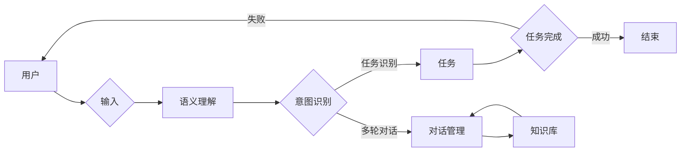

# 任务导向设计思维在CUI中的应用

> 关键词：任务导向设计思维，CUI设计，用户体验，交互设计，对话系统，人工智能，自然语言处理

## 1. 背景介绍

随着人工智能技术的飞速发展，自然语言交互界面（CUI，Chatbot User Interface）逐渐成为人机交互的重要形式。CUI利用自然语言处理（NLP）和机器学习技术，能够模拟人类对话，为用户提供便捷的服务和信息获取途径。然而，CUI的设计并非易事，需要综合考虑用户体验、交互逻辑、技术实现等多方面因素。本文将探讨任务导向设计思维在CUI设计中的应用，旨在帮助设计师和开发者构建更加智能、高效、人性化的CUI。

### 1.1 CUI设计的挑战

CUI设计面临以下挑战：

- **用户体验**：如何让用户在使用CUI时感到舒适、便捷、高效？
- **交互逻辑**：如何设计合理的对话流程，确保用户能够顺利完成目标任务？
- **技术实现**：如何利用NLP和机器学习技术，实现智能、准确的对话交互？
- **可扩展性**：如何设计可扩展的架构，适应不同场景和用户需求？

### 1.2 任务导向设计思维

任务导向设计思维是一种以用户任务为中心的设计理念。它强调在设计过程中关注用户的目标和需求，以任务为导向，从用户的角度出发，设计出符合用户认知和操作习惯的产品。任务导向设计思维在CUI设计中的应用，有助于解决上述挑战，提升用户体验和交互效率。

## 2. 核心概念与联系

### 2.1 核心概念

#### 2.1.1 任务

任务是指用户在使用CUI时希望完成的特定目标。例如，查询天气、预订机票、咨询产品信息等。

#### 2.1.2 交互流程

交互流程是指用户与CUI之间进行的对话序列。它包括用户的输入、CUI的响应以及双方的交互过程。

#### 2.1.3 语义理解

语义理解是指CUI对用户输入的语言进行解析和识别，理解用户的意图和需求。

#### 2.1.4 知识库

知识库是CUI的知识存储系统，包括事实知识、规则知识和常识知识等。

#### 2.1.5 对话管理

对话管理是指CUI对交互流程进行控制，包括对话状态跟踪、意图识别、对话策略等。

### 2.2 核心概念原理和架构的 Mermaid 流程图



### 2.3 核心概念联系

在CUI设计中，用户通过输入与CUI进行交互，CUI通过语义理解和意图识别理解用户的任务需求，并根据任务类型调用知识库和对话管理模块，完成用户任务。

## 3. 核心算法原理 & 具体操作步骤

### 3.1 算法原理概述

CUI的核心算法包括：

- **自然语言处理（NLP）**：对用户输入进行分词、句法分析、语义理解等处理。
- **机器学习**：通过训练模型，实现意图识别、实体识别、对话管理等任务。

### 3.2 算法步骤详解

#### 3.2.1 语义理解

1. 分词：将用户输入的文本分割成词语。
2. 句法分析：分析词语之间的关系，构建句法树。
3. 语义角色标注：标注词语在句子中的语义角色。
4. 实体识别：识别句子中的实体，如人名、地名、组织机构等。
5. 意图识别：根据语义角色标注和实体识别结果，判断用户的意图。

#### 3.2.2 意图识别

1. 特征提取：提取用户输入文本的特征。
2. 模型训练：使用机器学习算法训练模型。
3. 意图分类：根据特征和模型预测，判断用户意图。

#### 3.2.3 对话管理

1. 状态跟踪：记录对话过程中的状态信息。
2. 对话策略：根据当前状态和用户意图，选择合适的对话策略。
3. 响应生成：根据对话策略和知识库，生成合适的响应。

### 3.3 算法优缺点

#### 3.3.1 优点

- **准确度高**：通过机器学习算法训练，意图识别和实体识别准确度较高。
- **鲁棒性强**：能够处理不同语境下的用户输入。
- **可扩展性强**：可以根据需求添加新的功能和知识。

#### 3.3.2 缺点

- **计算复杂度高**：需要大量的计算资源。
- **数据依赖性强**：需要大量标注数据。
- **可解释性差**：模型决策过程难以解释。

### 3.4 算法应用领域

CUI算法在以下领域得到广泛应用：

- **客服系统**：自动回答用户咨询，提高客服效率。
- **信息检索**：帮助用户快速找到所需信息。
- **语音助手**：提供语音交互服务，方便用户操作设备。
- **智能问答**：回答用户提出的问题。

## 4. 数学模型和公式 & 详细讲解 & 举例说明

### 4.1 数学模型构建

CUI的数学模型主要包括：

- **词嵌入模型**：将词语映射到高维空间，捕捉词语之间的语义关系。
- **循环神经网络（RNN）**：处理序列数据，如句子。
- **长短期记忆网络（LSTM）**：解决RNN的梯度消失问题。
- **卷积神经网络（CNN）**：提取文本特征。
- **注意力机制**：关注句子中重要的词语。

### 4.2 公式推导过程

#### 4.2.1 词嵌入

假设词语集合为 $V$，则词嵌入模型将词语映射到 $R^d$ 空间：

$$
\phi(w) = e^{v_w} \in R^d
$$

其中，$v_w$ 为词语 $w$ 的向量表示。

#### 4.2.2 RNN

假设输入序列为 $x = (x_1, x_2, ..., x_T)$，隐藏状态为 $h = (h_1, h_2, ..., h_T)$，则RNN的递推关系为：

$$
h_t = f(W_x x_t + W_h h_{t-1} + b_h)
$$

其中，$W_x$ 和 $W_h$ 为权重矩阵，$b_h$ 为偏置向量，$f$ 为非线性激活函数。

#### 4.2.3 LSTM

LSTM是一种特殊的RNN，其递推关系为：

$$
\begin{align*}
i_t &= \sigma(W_{xi} x_t + W_{hi} h_{t-1} + b_i) \\
f_t &= \sigma(W_{xf} x_t + W_{hf} h_{t-1} + b_f) \\
g_t &= \tanh(W_{xg} x_t + W_{hg} h_{t-1} + b_g) \\
o_t &= \sigma(W_{x\omega} x_t + W_{h\omega} h_{t-1} + b_\omega) \\
h_t &= o_t \cdot g_t
\end{align*}
$$

其中，$\sigma$ 为Sigmoid函数，$\tanh$ 为双曲正切函数。

#### 4.2.4 注意力机制

注意力机制的计算公式为：

$$
a_t = \frac{e^{h_t^T W_a h_{t-1}}}{\sum_{j=1}^T e^{h_t^T W_a h_{j}}}
$$

其中，$W_a$ 为权重矩阵，$h_t$ 和 $h_{t-1}$ 为LSTM的隐藏状态。

### 4.3 案例分析与讲解

以下以一个简单的客服机器人为例，说明CUI算法的应用。

1. **用户输入**：用户输入“我想查询天气预报”。

2. **分词**：将输入文本分割成词语：我、想、查、询、天、气、预、报。

3. **句法分析**：构建句法树，分析词语之间的关系。

4. **语义角色标注**：标注词语的语义角色：我（主语）、想（谓语）、查询（宾语）、天气（宾语补足语）、预报（定语）。

5. **实体识别**：识别句子中的实体：天气（实体类型：天气情况）。

6. **意图识别**：根据语义角色标注和实体识别结果，判断用户意图为“查询天气”。

7. **对话管理**：根据意图识别结果，调用天气预报接口，获取天气信息。

8. **响应生成**：将获取的天气信息生成回复，如“当前天气为晴朗”。

## 5. 项目实践：代码实例和详细解释说明

### 5.1 开发环境搭建

以下是在Python环境中使用NLTK库进行CUI开发的基本步骤：

1. 安装Python和pip。
2. 安装NLTK库：
   ```
   pip install nltk
   ```
3. 导入相关模块：
   ```python
   import nltk
   from nltk.tokenize import word_tokenize
   from nltk.tag import pos_tag
   from nltk.chunk import ne_chunk
   ```

### 5.2 源代码详细实现

以下是一个简单的客服机器人代码示例：

```python
import nltk

def query_weather(query):
    # 分词
    words = word_tokenize(query)
    # 词性标注
    pos_tags = pos_tag(words)
    # 命名实体识别
    ne_tree = ne_chunk(pos_tags)
    # 意图识别
    if 'ORG' in [tag for word, tag in ne_tree]:
        return "您想查询哪个组织的天气？"
    else:
        return "请告诉我您想查询哪个地方的天气？"

# 示例
query = "我想查询北京的天气"
print(query_weather(query))
```

### 5.3 代码解读与分析

上述代码使用了NLTK库进行分词、词性标注和命名实体识别，实现了简单的意图识别功能。在实际应用中，可以结合机器学习算法，实现更复杂的意图识别和实体识别。

### 5.4 运行结果展示

假设用户输入“我想查询北京的天气”，程序将输出“请告诉我您想查询哪个地方的天气？”

## 6. 实际应用场景

### 6.1 客服系统

客服系统是CUI最典型的应用场景之一。通过CUI，用户可以随时随地与客服人员进行交流，提高服务效率。

### 6.2 信息检索

CUI可以应用于信息检索系统，帮助用户快速找到所需信息。

### 6.3 语音助手

语音助手是CUI在智能家居领域的应用，为用户提供语音交互服务。

### 6.4 智能问答

智能问答系统可以应用于教育培训、咨询等领域，为用户提供专业知识和解答。

## 7. 工具和资源推荐

### 7.1 学习资源推荐

1. 《自然语言处理入门》
2. 《深度学习与自然语言处理》
3. 《对话系统设计与实现》

### 7.2 开发工具推荐

1. NLTK
2. spaCy
3. Transformers

### 7.3 相关论文推荐

1.《Neural谈话：对话系统的最新研究进展》
2.《基于深度学习的对话系统》
3.《知识图谱在对话系统中的应用》

## 8. 总结：未来发展趋势与挑战

### 8.1 研究成果总结

本文介绍了任务导向设计思维在CUI设计中的应用，阐述了CUI的核心算法原理和具体操作步骤，并提供了项目实践和代码示例。通过分析实际应用场景，总结了CUI的潜在价值和发展方向。

### 8.2 未来发展趋势

1. **多模态交互**：结合语音、图像等多模态信息，提升用户体验。
2. **个性化推荐**：根据用户行为和偏好，提供个性化的服务。
3. **知识图谱**：利用知识图谱，提供更加全面、准确的信息。
4. **迁移学习**：利用迁移学习，降低模型训练成本。

### 8.3 面临的挑战

1. **数据标注**：需要大量高质量的数据进行标注，成本较高。
2. **模型可解释性**：如何提高模型的可解释性，增强用户信任。
3. **隐私保护**：如何保护用户隐私，避免数据泄露。
4. **伦理道德**：如何确保CUI的应用符合伦理道德规范。

### 8.4 研究展望

随着人工智能技术的不断发展，CUI将在更多领域得到应用，为人们的生活带来便利。未来，CUI设计将更加注重用户体验、智能化和可解释性，同时关注数据安全和伦理道德问题，为构建更加美好的智能时代贡献力量。

## 9. 附录：常见问题与解答

**Q1：CUI设计的关键点是什么？**

A1：CUI设计的关键点包括用户体验、交互逻辑、技术实现、可扩展性等。

**Q2：如何提高CUI的意图识别准确率？**

A2：提高CUI的意图识别准确率可以从以下方面入手：
1. 使用高质量的标注数据。
2. 采用先进的机器学习算法。
3. 引入领域知识。
4. 进行模型调优。

**Q3：如何保证CUI的隐私安全？**

A3：为了保证CUI的隐私安全，可以从以下方面入手：
1. 对用户数据进行脱敏处理。
2. 使用加密技术保护数据。
3. 限制数据访问权限。
4. 建立数据安全管理制度。

**Q4：CUI在哪些领域具有应用价值？**

A4：CUI在客服系统、信息检索、语音助手、智能问答等领域具有广泛的应用价值。

**Q5：如何评估CUI的性能？**

A5：评估CUI的性能可以从以下方面入手：
1. 准确率：意图识别和实体识别的准确率。
2. 响应速度：CUI的响应时间。
3. 用户满意度：用户对CUI的满意度。

---

作者：禅与计算机程序设计艺术 / Zen and the Art of Computer Programming