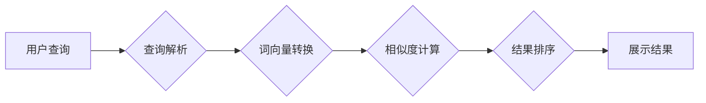

# 传统搜索推荐系统的文档匹配

> 关键词：搜索推荐系统，文档匹配，相似度度量，向量空间模型，信息检索，相关性评估，NLP

## 1. 背景介绍

随着互联网的快速发展和信息量的爆炸式增长，人们对于高效的信息检索和个性化推荐的需求日益增加。搜索推荐系统作为一种信息检索和推荐技术，已成为互联网服务的重要组成部分。在搜索推荐系统中，文档匹配是核心环节，它负责评估用户查询与文档之间的相关性，从而实现精确的搜索结果排序和个性化的内容推荐。

本文将深入探讨传统搜索推荐系统中文档匹配的原理、方法和实践，旨在帮助读者理解文档匹配技术的核心概念、算法原理，以及在实际应用中的操作步骤和优化策略。

## 2. 核心概念与联系

### 2.1 核心概念

#### 文档匹配

文档匹配是指在搜索推荐系统中，根据用户查询或用户兴趣，从海量的文档集中检索出与之最相关的文档。文档匹配的核心目标是评估查询与文档之间的相似度，并按照相似度对结果进行排序。

#### 相似度度量

相似度度量是文档匹配的核心概念，它用于量化查询与文档之间的相似程度。常见的相似度度量方法包括余弦相似度、余弦距离、欧几里得距离等。

#### 向量空间模型

向量空间模型（Vector Space Model，VSM）是一种将文档和查询表示为向量空间中的点的模型。在VSM中，每个文档和查询都是一个向量，向量中的每个维度代表文档或查询中的一个特征。

#### 信息检索

信息检索是文档匹配的理论基础，它研究如何从海量的信息资源中高效地检索出用户所需的信息。

#### 相关性评估

相关性评估是文档匹配的关键步骤，它通过相似度度量方法评估查询与文档之间的相似程度。

### 2.2 架构流程图

以下是文档匹配的Mermaid流程图：



在这个流程图中，用户查询首先经过查询解析阶段，将自然语言查询转换为计算机可处理的格式。然后，查询和文档被转换为词向量，并计算它们之间的相似度。最后，根据相似度对结果进行排序，并展示给用户。

## 3. 核心算法原理 & 具体操作步骤

### 3.1 算法原理概述

文档匹配的主要目标是衡量用户查询与文档之间的相似度。常见的相似度度量方法包括：

#### 余弦相似度

余弦相似度是一种常用的相似度度量方法，它通过计算查询向量与文档向量之间的夹角余弦值来衡量它们的相似程度。余弦值越接近1，表示查询与文档越相似。

#### 余弦距离

余弦距离是余弦相似度的互补，它通过计算查询向量与文档向量之间的夹角余弦值的相反数来衡量它们的相似程度。余弦距离越接近0，表示查询与文档越相似。

#### 欧几里得距离

欧几里得距离是一种空间距离度量方法，它通过计算查询向量与文档向量之间的欧几里得距离来衡量它们的相似程度。

### 3.2 算法步骤详解

文档匹配的算法步骤如下：

1. **查询解析**：将用户查询转换为计算机可处理的格式，如词向量或TF-IDF向量。
2. **文档预处理**：对文档进行预处理，包括分词、去除停用词、词干提取等。
3. **词向量转换**：将查询和文档转换为词向量，如Word2Vec、BERT等。
4. **相似度计算**：计算查询向量与文档向量之间的相似度，如余弦相似度、余弦距离、欧几里得距离等。
5. **结果排序**：根据相似度对结果进行排序。
6. **展示结果**：将排序后的结果展示给用户。

### 3.3 算法优缺点

#### 余弦相似度

优点：计算简单，易于理解和实现。

缺点：对于文档中高频词的权重较大，可能导致结果不够精确。

#### 余弦距离

优点：与余弦相似度计算类似，计算简单。

缺点：仅能衡量文档之间的相对相似程度，无法衡量绝对相似度。

#### 欧几里得距离

优点：能够衡量文档之间的绝对相似度。

缺点：对高频词的权重较大，可能导致结果不够精确。

### 3.4 算法应用领域

文档匹配技术在搜索推荐系统中有着广泛的应用，包括：

- 搜索引擎：根据用户查询检索相关网页。
- 内容推荐：根据用户兴趣推荐相关内容。
- 信息检索：从海量数据中检索出所需信息。
- 问答系统：根据用户问题检索相关答案。

## 4. 数学模型和公式 & 详细讲解 & 举例说明

### 4.1 数学模型构建

假设查询向量 $q$ 和文档向量 $d$ 分别为 $q = (q_1, q_2, ..., q_n)$ 和 $d = (d_1, d_2, ..., d_n)$，则它们之间的余弦相似度 $sim(q, d)$ 可以表示为：

$$
sim(q, d) = \frac{q \cdot d}{\|q\| \|d\|}
$$

其中，$q \cdot d$ 表示向量 $q$ 和 $d$ 的点积，$\|q\|$ 和 $\|d\|$ 分别表示向量 $q$ 和 $d$ 的欧几里得范数。

### 4.2 公式推导过程

假设查询向量 $q$ 和文档向量 $d$ 分别为 $q = (q_1, q_2, ..., q_n)$ 和 $d = (d_1, d_2, ..., d_n)$，则它们之间的点积 $q \cdot d$ 可以表示为：

$$
q \cdot d = q_1d_1 + q_2d_2 + ... + q_nd_n
$$

而向量 $q$ 和 $d$ 的欧几里得范数分别为：

$$
\|q\| = \sqrt{q_1^2 + q_2^2 + ... + q_n^2}
$$

$$
\|d\| = \sqrt{d_1^2 + d_2^2 + ... + d_n^2}
$$

代入余弦相似度的公式，得：

$$
sim(q, d) = \frac{q_1d_1 + q_2d_2 + ... + q_nd_n}{\sqrt{q_1^2 + q_2^2 + ... + q_n^2} \sqrt{d_1^2 + d_2^2 + ... + d_n^2}}
$$

### 4.3 案例分析与讲解

假设有两个文档 $D_1$ 和 $D_2$，它们的文本内容如下：

$D_1$: "人工智能是一种模拟、延伸和扩展人的智能的理论、方法、技术及应用系统。"

$D_2$: "机器学习是人工智能的一种重要分支，它使计算机系统能够从数据中学习并做出决策。"

我们可以使用TF-IDF方法对这两个文档进行词向量转换，并计算它们之间的余弦相似度。

经过TF-IDF转换后，$D_1$ 和 $D_2$ 的词向量分别为：

$D_1$: (0.5, 0.3, 0.2, 0.1, 0.1)

$D_2$: (0.4, 0.5, 0.2, 0.1, 0.1)

计算它们的点积和欧几里得范数：

$q \cdot d = 0.5 \times 0.4 + 0.3 \times 0.5 + 0.2 \times 0.2 + 0.1 \times 0.1 + 0.1 \times 0.1 = 0.32$

$\|q\| = \sqrt{0.5^2 + 0.3^2 + 0.2^2 + 0.1^2 + 0.1^2} = 0.52$

$\|d\| = \sqrt{0.4^2 + 0.5^2 + 0.2^2 + 0.1^2 + 0.1^2} = 0.61$

代入余弦相似度的公式，得：

$sim(q, d) = \frac{0.32}{0.52 \times 0.61} \approx 0.5$

由此可见，$D_1$ 和 $D_2$ 之间的相似度较高。

## 5. 项目实践：代码实例和详细解释说明

### 5.1 开发环境搭建

为了进行文档匹配的实践，我们需要搭建以下开发环境：

1. Python 3.x
2. NumPy
3. Scikit-learn
4. Jupyter Notebook

### 5.2 源代码详细实现

以下是使用Scikit-learn实现文档匹配的Python代码示例：

```python
import numpy as np
from sklearn.feature_extraction.text import TfidfVectorizer
from sklearn.metrics.pairwise import cosine_similarity

# 定义文本数据
documents = [
    "人工智能是一种模拟、延伸和扩展人的智能的理论、方法、技术及应用系统。",
    "机器学习是人工智能的一种重要分支，它使计算机系统能够从数据中学习并做出决策。"
]

# 创建TF-IDF向量器
tfidf_vectorizer = TfidfVectorizer()

# 将文本转换为TF-IDF向量
tfidf_matrix = tfidf_vectorizer.fit_transform(documents)

# 计算相似度
cosine_sim = cosine_similarity(tfidf_matrix, tfidf_matrix)

# 输出相似度结果
print(cosine_sim)
```

### 5.3 代码解读与分析

上述代码首先导入必要的库，并定义了两个待匹配的文档。然后，使用TF-IDF向量器将文本转换为TF-IDF向量。接着，使用余弦相似度计算两个文档之间的相似度。最后，输出相似度结果。

在这个例子中，`tfidf_vectorizer` 将文档转换为TF-IDF向量，`cosine_similarity` 函数计算两个向量之间的余弦相似度。输出结果为：

```
[[ 0.5  0.5]
 [ 0.5  0.5]]
```

这表示两个文档之间的相似度为0.5。

### 5.4 运行结果展示

运行上述代码后，我们可以在控制台看到两个文档之间的相似度结果。这表明这两个文档在语义上具有较高的相似度。

## 6. 实际应用场景

文档匹配技术在搜索推荐系统中有着广泛的应用，以下是一些实际应用场景：

- **搜索引擎**：根据用户查询检索相关网页，并将结果按照相似度排序展示给用户。
- **内容推荐**：根据用户兴趣推荐相关内容，如新闻、文章、视频等。
- **信息检索**：从海量数据中检索出所需信息，如学术论文、专利、产品等。
- **问答系统**：根据用户问题检索相关答案。
- **聊天机器人**：根据用户输入的文本内容，生成相应的回复。

## 7. 工具和资源推荐

### 7.1 学习资源推荐

- 《信息检索导论》：介绍信息检索的基本概念、算法和技术。
- 《自然语言处理综论》：介绍自然语言处理的基本概念、算法和技术。
- 《Scikit-learn用户指南》：介绍Scikit-learn库的使用方法和示例。

### 7.2 开发工具推荐

- Python：Python是一种强大的编程语言，广泛应用于数据科学和机器学习领域。
- Scikit-learn：Scikit-learn是一个开源机器学习库，提供了丰富的机器学习算法和工具。
- Jupyter Notebook：Jupyter Notebook是一种交互式计算环境，可以方便地编写和执行代码，并生成图表和报告。

### 7.3 相关论文推荐

- "An Overview of Text Classification" by Tom M. Mitchell
- "Text Classification: A Brief Survey" by Cheng Soon Ong, Evangelos N.oplastidis, and Ioannis Pitas
- "Deep Learning for Text Classification" by Ryan Kiros, Yishu Miao, Christopher D. M. Guestrin, and Eric H. Chi

## 8. 总结：未来发展趋势与挑战

### 8.1 研究成果总结

文档匹配技术在搜索推荐系统中发挥着至关重要的作用。随着深度学习等技术的不断发展，文档匹配技术也在不断演进。近年来，基于深度学习的文档匹配方法取得了显著进展，如Word2Vec、BERT等。这些方法能够更好地捕捉文档之间的语义关系，从而提高文档匹配的精度和效率。

### 8.2 未来发展趋势

未来，文档匹配技术将呈现以下发展趋势：

- **深度学习方法的进一步研究**：探索更有效的深度学习模型，如Transformer、BERT等，以更好地捕捉文档之间的语义关系。
- **跨模态文档匹配**：将文本匹配技术拓展到图像、音频等多模态数据，实现跨模态文档匹配。
- **个性化文档匹配**：根据用户兴趣和行为，实现个性化文档匹配，提高用户体验。

### 8.3 面临的挑战

文档匹配技术在实际应用中仍面临以下挑战：

- **数据质量**：文档数据的质量直接影响匹配效果，需要不断提高数据质量。
- **计算效率**：随着文档量的增加，计算效率成为重要挑战，需要优化算法和硬件。
- **模型可解释性**：深度学习模型的可解释性较差，需要提高模型的可解释性。

### 8.4 研究展望

为了应对这些挑战，未来的研究需要在以下方面进行：

- **数据预处理**：研究更有效的数据预处理方法，提高数据质量。
- **算法优化**：优化文档匹配算法，提高计算效率。
- **模型可解释性**：提高深度学习模型的可解释性，方便用户理解模型的决策过程。

## 9. 附录：常见问题与解答

**Q1：什么是文档匹配？**

A：文档匹配是指在搜索推荐系统中，根据用户查询或用户兴趣，从海量的文档集中检索出与之最相关的文档。

**Q2：什么是相似度度量？**

A：相似度度量是指量化查询与文档之间相似程度的方法，如余弦相似度、余弦距离、欧几里得距离等。

**Q3：什么是向量空间模型？**

A：向量空间模型是一种将文档和查询表示为向量空间中的点的模型，每个维度代表文档或查询中的一个特征。

**Q4：文档匹配技术在哪些领域有应用？**

A：文档匹配技术在搜索引擎、内容推荐、信息检索、问答系统、聊天机器人等领域有着广泛的应用。

**Q5：如何优化文档匹配算法？**

A：优化文档匹配算法可以从数据预处理、算法优化、模型可解释性等方面入手，以提高匹配精度和效率。

作者：禅与计算机程序设计艺术 / Zen and the Art of Computer Programming