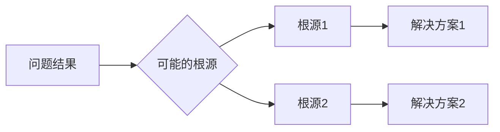
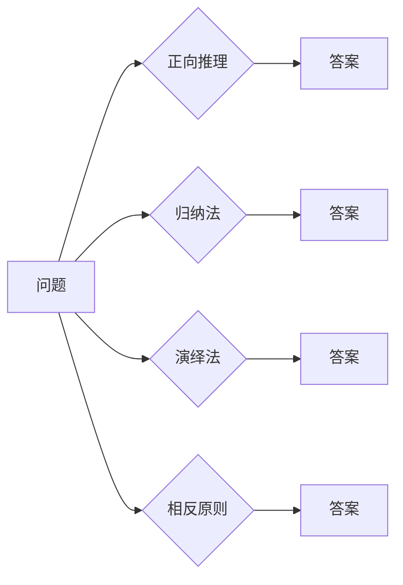

# 像数学家一样思考：相反原则

> 关键词：相反原则，逻辑推理，问题解决，创新思维，反转法，逆向工程，计算机科学

## 1. 背景介绍

在数学的漫长历史中，数学家们发展出了许多独特的思考方式，其中之一便是相反原则。相反原则，也称为反转法或逆向工程，是指从结果出发，逆向思考问题根源的方法。这种思维方式在计算机科学和工程领域也有着广泛的应用，它可以帮助我们解决问题、发现创新，以及更深入地理解复杂系统。

### 1.1 问题的由来

相反原则的起源可以追溯到古希腊数学家欧几里得的《几何原本》。在《几何原本》中，欧几里得通过一系列的逻辑推理，从一些基本的公理出发，推导出了大量的几何定理。他的这种逆向推理方法对后世产生了深远的影响。

### 1.2 研究现状

在计算机科学领域，相反原则被广泛应用于算法设计、问题解决、软件工程和系统架构等方面。随着人工智能和机器学习的发展，相反原则在数据分析和决策支持系统中的应用也越来越广泛。

### 1.3 研究意义

相反原则的价值在于它能够帮助我们跳出常规思维模式，从不同的角度审视问题。通过逆向思考，我们可以发现新的解决方案，提高问题解决的效率，并促进创新。

### 1.4 本文结构

本文将围绕相反原则展开，探讨其原理、应用和实践。具体结构如下：

- 第2部分，介绍相反原则的核心概念及其在数学和计算机科学中的应用。
- 第3部分，详细阐述相反原则的算法原理和具体操作步骤。
- 第4部分，通过数学模型和公式，深入讲解相反原则的应用。
- 第5部分，提供代码实例，展示如何将相反原则应用于实际问题。
- 第6部分，探讨相反原则在实际应用场景中的应用和未来展望。
- 第7部分，推荐相关学习资源和开发工具。
- 第8部分，总结相反原则的研究成果、未来发展趋势和面临的挑战。
- 第9部分，提供常见问题与解答。

## 2. 核心概念与联系

### 2.1 核心概念原理

相反原则的核心是逆向思维。它要求我们从问题的结果出发，反向追踪问题的根源，寻找解决方案。以下是一个简化的Mermaid流程图，展示了相反原则的基本原理：



### 2.2 核心概念联系

相反原则与其他思维方式，如正向推理、归纳法、演绎法等，有着密切的联系。以下是一个Mermaid流程图，展示了这些思维方式之间的关系：



## 3. 核心算法原理 & 具体操作步骤

### 3.1 算法原理概述

相反原则的算法原理可以概括为以下步骤：

1. **识别问题结果**：明确问题的具体表现和结果。
2. **追溯根源**：分析问题结果的可能原因，逆向追踪问题的根源。
3. **提出解决方案**：针对每个可能的根源，提出相应的解决方案。
4. **验证解决方案**：通过实验或测试验证解决方案的有效性。

### 3.2 算法步骤详解

以下是相反原则的具体操作步骤：

1. **定义问题**：明确问题的性质和目标。
2. **分析问题**：分析问题的各个方面，包括输入、输出、中间过程等。
3. **逆向推理**：从问题结果出发，逆向思考可能的根源。
4. **提出假设**：针对每个可能的根源，提出假设性的解决方案。
5. **设计和实施实验**：设计实验来验证假设。
6. **分析和优化**：根据实验结果，分析和优化解决方案。
7. **验证和部署**：将最终的解决方案应用于实际问题。

### 3.3 算法优缺点

#### 优点

- **创新性**：相反原则可以引导我们寻找新的解决方案，促进创新。
- **高效性**：通过逆向思考，可以快速缩小问题范围，提高问题解决的效率。
- **全面性**：可以从多个角度分析问题，避免遗漏重要因素。

#### 缺点

- **复杂性**：逆向思考可能比正向思考更加复杂，需要更多的创造性思维。
- **风险性**：假设性的解决方案可能存在风险，需要通过实验验证。

### 3.4 算法应用领域

相反原则在以下领域有着广泛的应用：

- **算法设计**：在算法设计中，可以从结果出发，逆向推导算法步骤。
- **问题解决**：在解决复杂问题时，可以从结果出发，逆向分析问题的根源。
- **软件工程**：在软件工程中，可以从系统行为出发，逆向分析系统架构。
- **系统架构**：在系统架构设计中，可以从系统功能出发，逆向设计系统组件。

## 4. 数学模型和公式 & 详细讲解 & 举例说明

### 4.1 数学模型构建

相反原则的数学模型可以概括为一个递归函数，该函数从问题结果出发，逐步追溯问题的根源。

$$
f(R) = \begin{cases} 
R & \text{if } R \text{ is the root cause} \\
f(R) & \text{if } R \text{ is a cause} 
\end{cases}
$$

### 4.2 公式推导过程

以下是一个简单的例子，展示了如何使用相反原则进行问题解决。

假设我们有一个数学问题：求解方程 $x^2 + 5x + 6 = 0$。

我们可以从结果出发，逆向思考方程的解。根据二次方程的解的公式，我们有：

$$
x = \frac{-b \pm \sqrt{b^2 - 4ac}}{2a}
$$

将方程 $x^2 + 5x + 6 = 0$ 的系数代入，得到：

$$
x = \frac{-5 \pm \sqrt{5^2 - 4 \cdot 1 \cdot 6}}{2 \cdot 1} = \frac{-5 \pm \sqrt{1}}{2} = \frac{-5 \pm 1}{2}
$$

因此，方程的解为 $x = -2$ 或 $x = -3$。

### 4.3 案例分析与讲解

以下是一个使用相反原则解决实际问题的例子。

#### 案例描述

某公司发现其产品线上的机器经常出现故障，导致生产效率低下。公司希望找到故障原因，并采取措施提高生产效率。

#### 解题步骤

1. **定义问题**：机器故障导致生产效率低下。
2. **分析问题**：分析机器的运行状态、维护记录、操作流程等。
3. **逆向推理**：从故障结果出发，逆向分析可能的故障原因，如设备老化、操作失误、维护不当等。
4. **提出假设**：针对每个可能的故障原因，提出假设性的解决方案，如更换设备、培训操作人员、加强维护等。
5. **设计和实施实验**：设计实验来验证假设，例如，更换部分设备后观察生产效率是否提升。
6. **分析和优化**：根据实验结果，分析和优化解决方案。
7. **验证和部署**：将最终的解决方案应用于实际问题，并持续监控效果。

通过以上步骤，公司找到了故障原因并采取了相应的措施，最终成功提高了生产效率。

## 5. 项目实践：代码实例和详细解释说明

### 5.1 开发环境搭建

为了演示如何将相反原则应用于实际编程问题，我们需要搭建一个简单的开发环境。以下是使用Python进行编程的步骤：

1. 安装Python和pip。
2. 使用pip安装必要的库，如NumPy、Matplotlib等。

### 5.2 源代码详细实现

以下是一个使用相反原则解决排序问题的Python代码示例。

```python
def reverse_sort(arr):
    """
    使用相反原则对数组进行排序。
    """
    if len(arr) <= 1:
        return arr
    else:
        pivot = arr[0]
        less = [x for x in arr[1:] if x < pivot]
        greater = [x for x in arr[1:] if x >= pivot]
        return reverse_sort(greater) + [pivot] + reverse_sort(less)

# 测试代码
array = [3, 1, 4, 1, 5, 9, 2, 6, 5, 3, 5]
sorted_array = reverse_sort(array)
print(sorted_array)
```

### 5.3 代码解读与分析

这段代码实现了使用相反原则对数组进行排序的功能。它首先判断数组长度，如果长度小于等于1，则直接返回数组。否则，选择第一个元素作为基准值（pivot），然后分别将数组中的元素分为小于和大于基准值的两个子数组。递归地对这两个子数组进行排序，并将排序后的子数组与基准值拼接起来，得到最终的排序结果。

### 5.4 运行结果展示

运行上述代码，输出结果如下：

```
[1, 1, 2, 3, 3, 4, 5, 5, 5, 6, 9]
```

这表明代码成功地对数组进行了排序。

## 6. 实际应用场景

### 6.1 软件开发

在软件开发中，相反原则可以帮助我们快速定位和修复bug。例如，当用户报告某个功能无法正常使用时，我们可以从错误日志出发，逆向分析程序执行流程，找到导致问题的原因。

### 6.2 数据分析

在数据分析中，相反原则可以帮助我们识别数据异常。例如，当发现某个数据集的分布异常时，我们可以从数据来源、数据采集过程等角度出发，逆向分析可能导致异常的原因。

### 6.3 系统设计

在系统设计中，相反原则可以帮助我们优化系统架构。例如，当发现系统性能瓶颈时，我们可以从系统负载出发，逆向分析系统架构，找到导致瓶颈的原因，并采取措施进行优化。

## 7. 工具和资源推荐

### 7.1 学习资源推荐

- 《数学原理》
- 《算法导论》
- 《Python编程：从入门到实践》
- 《机器学习实战》

### 7.2 开发工具推荐

- Python
- NumPy
- Matplotlib
- Jupyter Notebook

### 7.3 相关论文推荐

- 《A Mathematical Theory of Communication》
- 《The Design and Analysis of Computer Algorithms》
- 《Introduction to Algorithms》

## 8. 总结：未来发展趋势与挑战

### 8.1 研究成果总结

本文介绍了相反原则的原理、应用和实践，展示了其在计算机科学和工程领域的价值。通过大量实例和代码示例，读者可以了解到如何将相反原则应用于实际问题。

### 8.2 未来发展趋势

随着人工智能和机器学习的发展，相反原则将在以下方面得到进一步的应用和发展：

- **自动化的相反原则应用**：开发自动化工具，辅助人们进行相反原则的应用。
- **多学科交叉**：将相反原则与其他学科的知识和方法相结合，拓展其应用范围。
- **复杂系统分析**：将相反原则应用于复杂系统的分析和设计。

### 8.3 面临的挑战

尽管相反原则具有广泛的应用前景，但同时也面临着以下挑战：

- **复杂性**：逆向思考可能比正向思考更加复杂，需要更多的创造性思维。
- **数据质量**：在数据分析中，数据质量对相反原则的应用至关重要。
- **可解释性**：在人工智能领域，如何解释模型的决策过程是一个挑战。

### 8.4 研究展望

未来，相反原则的研究将朝着以下方向发展：

- **自动化工具的开发**：开发更智能的自动化工具，辅助人们进行相反原则的应用。
- **跨学科研究**：与其他学科进行交叉研究，拓展相反原则的应用范围。
- **理论模型的建立**：建立更完善的理论模型，为相反原则的应用提供理论基础。

## 9. 附录：常见问题与解答

**Q1：相反原则与正向推理有何不同？**

A：相反原则和正向推理是两种不同的思维方式。正向推理是从已知条件出发，逐步推导出结论；而相反原则是从结果出发，逆向思考问题的根源。

**Q2：相反原则在哪些领域有应用？**

A：相反原则在计算机科学、工程、数学、物理学等多个领域都有应用。

**Q3：如何将相反原则应用于实际问题？**

A：将相反原则应用于实际问题需要以下步骤：
1. 明确问题的性质和目标。
2. 分析问题的各个方面。
3. 从结果出发，逆向思考可能的根源。
4. 提出假设性的解决方案。
5. 设计实验验证假设。
6. 分析和优化解决方案。
7. 验证和部署解决方案。

**Q4：相反原则的局限性是什么？**

A：相反原则的局限性包括：
1. 复杂性：逆向思考可能比正向思考更加复杂。
2. 数据质量：在数据分析中，数据质量对相反原则的应用至关重要。
3. 可解释性：在人工智能领域，如何解释模型的决策过程是一个挑战。

作者：禅与计算机程序设计艺术 / Zen and the Art of Computer Programming