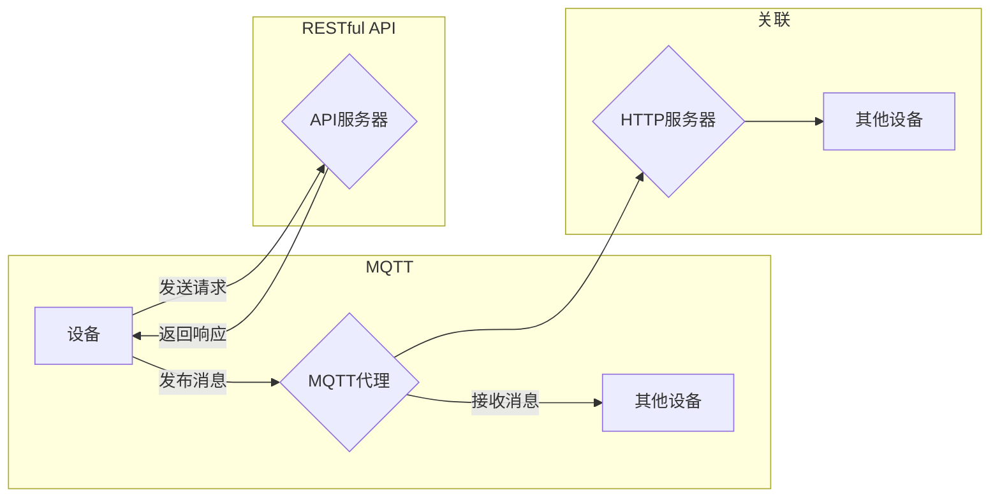

# 基于MQTT协议和RESTful API的智能家居设备互操作性研究

> 关键词：MQTT协议，RESTful API，智能家居，设备互操作性，物联网，数据通信，服务架构，安全认证

## 1. 背景介绍

随着物联网（Internet of Things, IoT）技术的快速发展，智能家居市场正在迎来爆发式增长。智能家居系统通过将家庭中的各种设备连接到互联网，实现设备之间的互联互通，为用户带来更加便捷、智能的生活方式。然而，由于不同厂商和设备之间缺乏统一的通信标准和接口规范，智能家居设备之间的互操作性成为一个亟待解决的问题。

MQTT（Message Queuing Telemetry Transport）协议和RESTful API是两种常见的智能家居设备通信协议。本文将探讨这两种协议在智能家居设备互操作性中的应用，并分析它们的优缺点，以期为智能家居系统的设计和开发提供参考。

## 2. 核心概念与联系

### 2.1 MQTT协议

MQTT是一种轻量级的消息发布/订阅协议，适用于低带宽、低功耗的物联网场景。它具有以下核心特点：

- **轻量级**：MQTT协议的报文格式简单，数据传输效率高，适合在带宽受限的网络环境中使用。
- **发布/订阅模式**：MQTT协议支持发布者和订阅者之间的消息传递，可以实现设备之间的点对点、点对多点的通信。
- **QoS级别**：MQTT协议支持三个QoS级别（0、1、2），确保消息传递的可靠性。
- **持久化会话**：MQTT协议支持持久化会话，即使设备断开连接，也能恢复之前的通信状态。

### 2.2 RESTful API

RESTful API是一种基于HTTP协议的应用编程接口，广泛应用于Web服务和移动应用开发。它具有以下核心特点：

- **无状态**：RESTful API采用无状态的请求-响应模式，简化了服务器的实现和维护。
- **简单性**：RESTful API遵循简单的协议和格式，易于理解和使用。
- **可扩展性**：RESTful API支持资源的增删改查操作，方便扩展和维护。

### 2.3 MQTT协议与RESTful API的联系与区别

MQTT协议和RESTful API都是智能家居设备通信的常用协议，它们之间既有联系也有区别：

- **联系**：两者都可以用于智能家居设备的通信，实现设备之间的互联互通。
- **区别**：MQTT协议适用于低带宽、低功耗的场景，而RESTful API适用于高带宽、高处理能力的场景。此外，MQTT协议支持发布/订阅模式，而RESTful API基于请求-响应模式。

### 2.4 Mermaid流程图

以下是基于MQTT协议和RESTful API的智能家居设备通信流程的Mermaid流程图：



## 3. 核心算法原理 & 具体操作步骤

### 3.1 算法原理概述

智能家居设备互操作性研究主要涉及以下几个方面：

- **设备识别与认证**：实现设备之间的身份识别和认证，确保通信的安全性。
- **数据通信协议**：选择合适的通信协议，实现设备之间的数据传输。
- **服务架构设计**：设计合理的系统架构，实现设备之间的协同工作。
- **接口规范**：制定统一的接口规范，确保设备之间的互操作性。

### 3.2 算法步骤详解

1. **设备识别与认证**：
    - 设备通过接入网关或直接连接到互联网。
    - 设备获取唯一标识符，如MAC地址、IMEI等。
    - 设备通过证书或密钥进行认证，确保通信的安全性。

2. **数据通信协议**：
    - 选择合适的通信协议，如MQTT或RESTful API。
    - 设备和网关/服务器之间建立连接。
    - 设备发送和接收数据报文。

3. **服务架构设计**：
    - 设计中心化的网关或去中心化的设备集群架构。
    - 设备之间通过网关或直接进行通信。
    - 系统提供统一的设备管理、数据管理和消息管理等服务。

4. **接口规范**：
    - 制定统一的接口规范，如JSON格式、RESTful API接口等。
    - 设备和网关/服务器之间按照规范进行数据交换。

### 3.3 算法优缺点

- **优点**：
    - 提高设备之间的互操作性。
    - 保障通信的安全性。
    - 简化系统设计和开发。
- **缺点**：
    - 需要统一规范和协议。
    - 实现难度较大。

### 3.4 算法应用领域

智能家居设备互操作性研究可以应用于以下领域：

- 智能家居系统
- 智能交通系统
- 智能工厂
- 智能城市

## 4. 数学模型和公式 & 详细讲解 & 举例说明

### 4.1 数学模型构建

智能家居设备互操作性的数学模型可以采用图论模型进行描述。图中的节点代表设备，边代表设备之间的连接关系。

### 4.2 公式推导过程

设G=(V,E)为智能家居设备的图模型，其中V为设备集合，E为连接关系集合。则设备互操作性可以表示为：

$$
M = \frac{|E|}{|V| \times (|V|-1)}
$$

其中M为互操作性指标，|E|为边数，|V|为节点数。

### 4.3 案例分析与讲解

假设一个智能家居系统包含5个设备，它们之间的连接关系如下：

```
A -- B
|    |
C -- D
```

则设备互操作性指标为：

$$
M = \frac{6}{5 \times (5-1)} = 0.6
$$

这表示该智能家居系统的设备互操作性为60%，还有40%的连接关系未被充分利用。

## 5. 项目实践：代码实例和详细解释说明

### 5.1 开发环境搭建

1. 安装Python环境。
2. 安装paho-mqtt库，用于MQTT协议通信。
3. 安装Flask库，用于RESTful API开发。

### 5.2 源代码详细实现

以下是一个基于MQTT协议和RESTful API的智能家居设备通信示例：

```python
# MQTT客户端
import paho.mqtt.client as mqtt

def on_connect(client, userdata, flags, rc):
    print("Connected with result code "+str(rc))
    client.subscribe("home/sensor/#")

def on_message(client, userdata, msg):
    print(msg.topic+" "+str(msg.payload))

client = mqtt.Client()
client.on_connect = on_connect
client.on_message = on_message

client.connect("mqtt.example.com", 1883, 60)

client.loop_forever()

# RESTful API服务器
from flask import Flask, jsonify, request

app = Flask(__name__)

@app.route('/sensor/data', methods=['POST'])
def sensor_data():
    data = request.json
    print(data)
    return jsonify({"status": "success"})

if __name__ == '__main__':
    app.run(host='0.0.0.0', port=5000)
```

### 5.3 代码解读与分析

该示例中，我们创建了一个MQTT客户端和一个RESTful API服务器。

- MQTT客户端连接到MQTT代理，并订阅主题`home/sensor/#`。
- 当有设备发布消息时，MQTT客户端会接收到消息并打印出来。
- RESTful API服务器提供了一个`/sensor/data`接口，用于接收设备发送的数据。

通过MQTT协议和RESTful API的结合，我们可以实现智能家居设备之间的通信和数据交换。

### 5.4 运行结果展示

1. 运行MQTT客户端，连接到MQTT代理。
2. 运行RESTful API服务器。
3. 通过MQTT客户端或RESTful API接口发送数据。

## 6. 实际应用场景

智能家居设备互操作性研究可以应用于以下实际场景：

- **家庭安防**：通过MQTT协议将门禁、摄像头等设备连接到中心服务器，实现实时监控和报警功能。
- **智能家居控制**：通过RESTful API接口，用户可以通过手机APP或其他设备远程控制家中的灯光、空调等设备。
- **能源管理**：通过MQTT协议和RESTful API，实现家庭用电、用水等数据的实时监测和节能控制。

## 7. 工具和资源推荐

### 7.1 学习资源推荐

- 《物联网：概念、架构与技术》
- 《RESTful API设计指南》
- MQTT官方文档：http://mosquitto.org/docs/latest/html/index.html
- RESTful API设计最佳实践：https://restfulapi.net/

### 7.2 开发工具推荐

- MQTT协议客户端：Paho MQTT
- RESTful API开发框架：Flask、Django
- 智能家居平台：Home Assistant、OpenHAB

### 7.3 相关论文推荐

- 《An Overview of the MQTT Internet of Things Protocol》
- 《RESTful API Design: Best Practices and Common Mistakes》

## 8. 总结：未来发展趋势与挑战

### 8.1 研究成果总结

本文对基于MQTT协议和RESTful API的智能家居设备互操作性进行了研究，分析了两种协议的特点和优缺点，并探讨了智能家居设备互操作性的关键技术和应用场景。

### 8.2 未来发展趋势

- **标准化**：智能家居设备互操作性将越来越依赖于统一的标准化协议和接口规范。
- **智能化**：智能家居设备将具备更加智能化的功能，如自动识别、自主学习、主动推送等。
- **开放性**：智能家居系统将更加开放，支持与其他智能家居平台和设备的互联互通。

### 8.3 面临的挑战

- **安全性**：智能家居设备的互操作性将面临更大的安全风险，需要加强安全防护措施。
- **兼容性**：不同厂商的智能家居设备之间可能存在兼容性问题，需要制定统一的接口规范。
- **可靠性**：智能家居设备需要在各种复杂环境下稳定运行，需要提高设备的可靠性。

### 8.4 研究展望

智能家居设备互操作性研究将推动智能家居行业的健康发展，为用户提供更加便捷、智能的生活方式。未来，随着物联网技术的不断进步，智能家居设备互操作性将迎来更加广阔的发展空间。

## 9. 附录：常见问题与解答

**Q1：什么是MQTT协议？**

A：MQTT是一种轻量级的消息发布/订阅协议，适用于低带宽、低功耗的物联网场景。

**Q2：什么是RESTful API？**

A：RESTful API是一种基于HTTP协议的应用编程接口，广泛应用于Web服务和移动应用开发。

**Q3：MQTT协议和RESTful API的区别是什么？**

A：MQTT协议适用于低带宽、低功耗的场景，而RESTful API适用于高带宽、高处理能力的场景。

**Q4：如何提高智能家居设备的互操作性？**

A：制定统一的接口规范，选择合适的通信协议，加强设备之间的认证和授权，提高设备的兼容性和可靠性。

**Q5：智能家居设备互操作性研究有哪些实际应用场景？**

A：家庭安防、智能家居控制、能源管理等。

作者：禅与计算机程序设计艺术 / Zen and the Art of Computer Programming