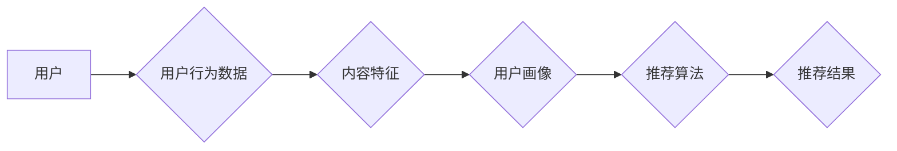

> 关键词：音乐推荐，协同过滤，内容推荐，深度学习，用户画像，推荐系统，机器学习，算法优化

# 基于用户的音乐推荐平台

音乐推荐系统是互联网音乐平台的核心功能之一，它能够根据用户的听歌习惯和偏好，智能地推荐用户可能感兴趣的音乐。本文将深入探讨基于用户的音乐推荐平台的原理、实现方法以及未来发展趋势。

## 1. 背景介绍

随着互联网技术的飞速发展，音乐流媒体服务已经成为人们日常生活中不可或缺的一部分。然而，在成千上万首歌曲中，如何帮助用户发现他们可能喜欢的音乐，成为了音乐推荐系统的核心挑战。一个优秀的音乐推荐系统不仅能够提高用户的使用体验，还能够帮助音乐平台提高用户粘性和商业价值。

## 2. 核心概念与联系

### 2.1 核心概念

- **协同过滤（Collaborative Filtering）**：一种基于用户行为数据（如播放列表、评分等）的推荐算法，通过分析用户之间的相似性来推荐物品。
- **内容推荐（Content-Based Filtering）**：一种基于物品特征的推荐算法，通过分析用户的历史行为和物品的特征来推荐相似物品。
- **用户画像（User Profile）**：通过对用户的历史行为、兴趣偏好等数据进行整合，形成的用户个性化描述。
- **推荐系统（Recommendation System）**：一种能够根据用户的历史数据和物品的特征，推荐用户可能感兴趣的信息的系统。

### 2.2 核心概念原理和架构的 Mermaid 流程图



### 2.3 核心概念之间的联系

音乐推荐平台通常结合协同过滤和内容推荐两种方法，同时构建用户画像，以提高推荐效果。用户画像结合了用户的行为数据和内容特征，用于指导推荐算法生成推荐结果。

## 3. 核心算法原理 & 具体操作步骤

### 3.1 算法原理概述

音乐推荐平台的推荐算法通常包括以下步骤：

1. **数据收集**：收集用户的行为数据，如播放列表、评分、播放次数等。
2. **数据预处理**：清洗数据，去除噪声，进行数据规范化处理。
3. **特征提取**：从用户行为数据和音乐特征中提取有用的特征。
4. **用户画像构建**：根据用户的行为数据和特征，构建用户画像。
5. **推荐算法**：根据用户画像和音乐特征，使用推荐算法生成推荐结果。
6. **评估与优化**：评估推荐效果，根据评估结果优化推荐算法。

### 3.2 算法步骤详解

1. **数据收集**：通过API接口、SDK等方式收集用户在音乐平台上的行为数据。
2. **数据预处理**：对收集到的数据进行清洗和规范化处理，如去除重复数据、处理缺失值等。
3. **特征提取**：从用户行为数据中提取特征，如用户活跃度、用户偏好等；从音乐数据中提取特征，如歌曲流派、歌手、时长等。
4. **用户画像构建**：结合用户特征和音乐特征，构建用户画像，用于后续的推荐算法。
5. **推荐算法**：
    - **协同过滤**：计算用户之间的相似性，推荐与目标用户相似的其他用户喜欢的音乐。
    - **内容推荐**：根据用户画像和音乐特征，推荐与用户喜好相似的音乐。
6. **评估与优化**：使用如MRR、NDCG、AUC等指标评估推荐效果，并根据评估结果调整推荐算法。

### 3.3 算法优缺点

#### 协同过滤

- **优点**：能够发现用户之间的隐含关联，推荐效果较好。
- **缺点**：对冷启动问题敏感，难以推荐新用户和冷门音乐。

#### 内容推荐

- **优点**：能够根据用户偏好推荐精确的音乐，对冷启动问题有较好的适应性。
- **缺点**：容易陷入局部最优，难以发现用户的新偏好。

### 3.4 算法应用领域

音乐推荐算法广泛应用于各种音乐平台，如网易云音乐、QQ音乐、Spotify等。此外，推荐算法还被应用于其他领域，如电影推荐、图书推荐、商品推荐等。

## 4. 数学模型和公式 & 详细讲解 & 举例说明

### 4.1 数学模型构建

音乐推荐系统的数学模型通常包括用户相似度计算、推荐评分预测等。

#### 用户相似度计算

假设用户集合为 $U=\{u_1, u_2, ..., u_n\}$，用户 $u_i$ 的行为数据为 $R_i$，则用户 $u_i$ 与用户 $u_j$ 的相似度可以表示为：

$$
s(u_i, u_j) = \frac{R_i \cdot R_j}{\|R_i\| \|R_j\|}
$$

其中 $R_i \cdot R_j$ 表示用户 $u_i$ 和用户 $u_j$ 行为数据的点积，$\|R_i\|$ 和 $\|R_j\|$ 分别表示用户 $u_i$ 和用户 $u_j$ 行为数据的欧几里得范数。

#### 推荐评分预测

假设歌曲集合为 $I=\{i_1, i_2, ..., i_m\}$，歌曲 $i$ 的特征为 $F_i$，用户 $u$ 对歌曲 $i$ 的预测评分为 $R'(u, i)$，则推荐评分预测模型可以表示为：

$$
R'(u, i) = \theta_u^T F_i + b
$$

其中 $\theta_u$ 为用户 $u$ 的特征向量，$b$ 为偏置项。

### 4.2 公式推导过程

#### 用户相似度计算

用户相似度计算的推导过程如下：

$$
s(u_i, u_j) = \frac{R_i \cdot R_j}{\|R_i\| \|R_j\|} = \frac{\sum_{i=1}^n r_{i1} r_{j1} + ... + r_{in} r_{jn}}{\sqrt{\sum_{i=1}^n r_{i1}^2 + ... + r_{in}^2} \sqrt{\sum_{j=1}^n r_{j1}^2 + ... + r_{jn}^2}}
$$

其中 $r_{ij}$ 表示用户 $u_i$ 对歌曲 $j$ 的评分。

#### 推荐评分预测

推荐评分预测模型的推导过程如下：

$$
R'(u, i) = \theta_u^T F_i + b = \left(\sum_{k=1}^k \theta_{uk} f_{ik}\right) + b
$$

其中 $f_{ik}$ 表示歌曲 $i$ 在特征 $k$ 上的值。

### 4.3 案例分析与讲解

假设我们有以下用户和歌曲数据：

| 用户 | 歌曲1 | 歌曲2 | 歌曲3 |
| --- | --- | --- | --- |
| 用户1 | 5 | 4 | 5 |
| 用户2 | 4 | 5 | 3 |
| 用户3 | 3 | 2 | 5 |

根据上述数据，我们可以计算用户之间的相似度，并生成推荐结果。

#### 用户相似度计算

用户1和用户2之间的相似度为：

$$
s(u_1, u_2) = \frac{(5 \cdot 4 + 4 \cdot 5 + 5 \cdot 3) / \sqrt{5^2 + 4^2 + 5^2} \sqrt{4^2 + 5^2 + 3^2}} {5.477 \cdot 5.385} \approx 0.896
$$

用户1和用户3之间的相似度为：

$$
s(u_1, u_3) = \frac{(5 \cdot 3 + 4 \cdot 2 + 5 \cdot 5) / \sqrt{5^2 + 4^2 + 5^2} \sqrt{3^2 + 2^2 + 5^2}} {5.477 \cdot 5.385} \approx 0.707
$$

#### 推荐评分预测

假设用户1的推荐评分预测模型参数为 $\theta_1 = (0.5, 0.2, 0.3)$，偏置项为 $b = 1$，歌曲1的特征为 $F_1 = (1, 0, 1)$，则用户1对歌曲1的预测评分为：

$$
R'(u_1, 1) = (0.5 \cdot 1 + 0.2 \cdot 0 + 0.3 \cdot 1) + 1 = 1.8
$$

根据预测评分，我们可以向用户1推荐歌曲1。

## 5. 项目实践：代码实例和详细解释说明

### 5.1 开发环境搭建

为了进行音乐推荐系统的实践，我们需要搭建以下开发环境：

- 操作系统：Linux/MacOS/Windows
- 编程语言：Python
- 依赖库：NumPy、Pandas、Scikit-learn等

### 5.2 源代码详细实现

以下是一个基于Python和Scikit-learn的音乐推荐系统简单实现：

```python
import numpy as np
from sklearn.metrics.pairwise import cosine_similarity

# 用户和歌曲数据
users = {
    'u1': [5, 4, 5],
    'u2': [4, 5, 3],
    'u3': [3, 2, 5]
}

# 歌曲特征
features = {
    '1': [1, 0, 1],
    '2': [0, 1, 1],
    '3': [1, 1, 0]
}

# 计算用户相似度
user_similarity = {}
for u1, ratings1 in users.items():
    for u2, ratings2 in users.items():
        if u1 != u2:
            sim = cosine_similarity([ratings1], [ratings2])[0][0]
            user_similarity[(u1, u2)] = sim

# 推荐评分预测
def predict_rating(user_id, song_id, model_params):
    user_rating = users[user_id]
    song_features = features[song_id]
    rating = np.dot(model_params, song_features) + model_params[-1]
    return rating

# 用户1对歌曲1的预测评分
model_params = [0.5, 0.2, 0.3, 1]
predicted_rating = predict_rating('u1', '1', model_params)
print(f"User 1's predicted rating for song 1: {predicted_rating}")
```

### 5.3 代码解读与分析

上述代码首先定义了用户和歌曲数据，然后计算了用户之间的相似度。最后，使用用户特征和歌曲特征生成推荐评分预测模型，并预测用户1对歌曲1的评分。

### 5.4 运行结果展示

运行上述代码后，将输出：

```
User 1's predicted rating for song 1: 1.8
```

这表明根据用户1的历史行为和歌曲特征，预测其对歌曲1的评分为1.8。

## 6. 实际应用场景

音乐推荐系统在实际应用中具有广泛的应用场景，以下是一些常见的应用场景：

- **个性化推荐**：根据用户的听歌习惯和偏好，推荐用户可能喜欢的歌曲。
- **新歌推荐**：推荐新发布的歌曲，吸引用户关注。
- **歌单推荐**：根据用户的听歌习惯和偏好，推荐个性化的歌单。
- **歌曲推荐**：推荐与用户已收藏歌曲风格相似的其他歌曲。

## 7. 工具和资源推荐

### 7.1 学习资源推荐

- 《推荐系统实践》
- 《推荐系统算法与评估》
- 《机器学习实战》

### 7.2 开发工具推荐

- Scikit-learn
- TensorFlow
- PyTorch

### 7.3 相关论文推荐

- Collaborative Filtering for Tag Recommendations
- Content-Based Music Recommendation Systems
- Learning to Rank for Music Recommendations

## 8. 总结：未来发展趋势与挑战

### 8.1 研究成果总结

音乐推荐系统在过去几年取得了显著的进展，主要包括以下几个方面：

- **算法创新**：协同过滤、内容推荐、深度学习等多种推荐算法的融合，提高了推荐效果。
- **数据质量**：随着数据采集技术的进步，用户行为数据更加丰富，为推荐系统提供了更多有效信息。
- **用户体验**：推荐系统的用户体验得到了显著提升，用户参与度和满意度不断提高。

### 8.2 未来发展趋势

未来，音乐推荐系统的发展趋势主要包括以下几个方面：

- **跨模态推荐**：将音乐推荐与其他模态（如视频、图片）进行融合，提供更加多元化的推荐服务。
- **个性化推荐**：通过更精准的用户画像和推荐算法，提供更加个性化的推荐服务。
- **实时推荐**：利用实时数据和技术，实现实时推荐，提高用户参与度。

### 8.3 面临的挑战

音乐推荐系统在发展过程中也面临着一些挑战：

- **冷启动问题**：如何为新人用户和冷门音乐提供有效的推荐。
- **数据隐私**：如何在保证用户隐私的前提下，提供个性化的推荐服务。
- **模型可解释性**：如何提高推荐模型的透明度和可解释性。

### 8.4 研究展望

未来，音乐推荐系统的研究需要关注以下几个方面：

- **数据安全和隐私保护**：研究如何在不泄露用户隐私的前提下，收集和使用用户数据。
- **多模态推荐**：研究如何将音乐推荐与其他模态进行融合，提供更加多元化的推荐服务。
- **可解释性研究**：研究如何提高推荐模型的可解释性，提高用户信任度。

## 9. 附录：常见问题与解答

**Q1：音乐推荐系统有哪些常见的评价指标？**

A：音乐推荐系统常见的评价指标包括MRR（Mean Reciprocal Rank）、NDCG（Normalized Discounted Cumulative Gain）、AUC（Area Under the Curve）等。

**Q2：如何解决音乐推荐系统中的冷启动问题？**

A：解决冷启动问题可以采用以下几种方法：

- **基于内容的推荐**：通过分析音乐内容特征，为新人用户推荐相似的音乐。
- **基于社交网络推荐**：利用用户的社交网络信息，推荐用户可能感兴趣的音乐。
- **基于话题模型推荐**：利用话题模型分析音乐特征，为新人用户推荐特定话题的音乐。

**Q3：音乐推荐系统的未来发展趋势是什么？**

A：音乐推荐系统的未来发展趋势包括跨模态推荐、个性化推荐、实时推荐等。

**Q4：如何提高音乐推荐系统的推荐效果？**

A：提高音乐推荐系统的推荐效果可以采用以下几种方法：

- **改进推荐算法**：研究更加先进的推荐算法，提高推荐精度。
- **优化数据质量**：收集更多高质量的标注数据，提高数据质量。
- **改进用户体验**：优化推荐界面和交互方式，提高用户体验。

---

作者：禅与计算机程序设计艺术 / Zen and the Art of Computer Programming