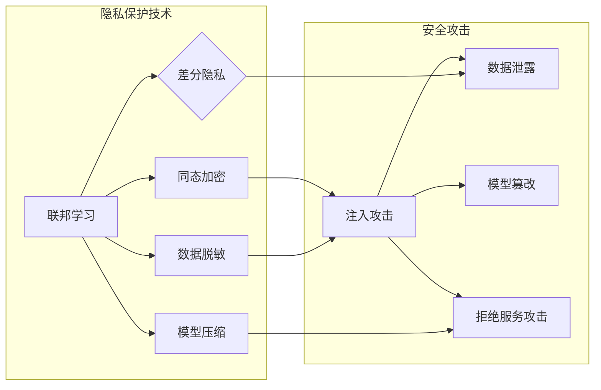

> 基础模型，隐私保护，安全攻击，联邦学习，差分隐私，同态加密，模型压缩，数据脱敏，差分隐私算法，同态加密算法

# 基础模型的隐私与安全问题

随着人工智能技术的飞速发展，基础模型作为一种强大的预训练模型，已经在众多领域发挥着关键作用。然而，基础模型在应用过程中也面临着隐私和安全方面的挑战。本文将深入探讨基础模型的隐私与安全问题，分析其背后的原理、技术方案以及未来发展趋势。

## 1. 背景介绍

### 1.1 问题的由来

基础模型通过在大规模数据集上进行训练，学习到丰富的知识，能够为各种下游任务提供强大的支持。然而，随着模型规模的扩大和训练数据的增加，基础模型也面临着隐私泄露和安全攻击的风险。

### 1.2 研究现状

近年来，隐私保护机器学习（Privacy-Preserving Machine Learning，PPML）和安全机器学习（Secure Machine Learning，SML）成为研究热点。研究者们提出了多种隐私保护技术，如联邦学习（Federated Learning，FL）、差分隐私（Differential Privacy，DP）、同态加密（Homomorphic Encryption，HE）等，以解决基础模型的隐私与安全问题。

### 1.3 研究意义

研究基础模型的隐私与安全问题，对于保护用户隐私、增强模型安全性具有重要意义：

1. 保护用户隐私：防止用户的个人信息在模型训练和推理过程中泄露，维护用户隐私权益。
2. 增强模型安全性：提高模型对安全攻击的抵抗力，防止恶意利用。
3. 促进AI技术发展：推动基础模型在更多领域的应用，促进AI技术的发展。

## 2. 核心概念与联系

### 2.1 核心概念原理和架构的 Mermaid 流程图



### 2.2 核心概念定义

- **联邦学习（Federated Learning，FL）**：一种分布式机器学习框架，通过在客户端本地训练模型，然后仅将模型摘要上传到服务器进行聚合，从而实现模型训练的隐私保护。
- **差分隐私（Differential Privacy，DP）**：一种隐私保护技术，通过对数据进行扰动，使得攻击者难以从模型学习到的信息中推断出单个个体的隐私信息。
- **同态加密（Homomorphic Encryption，HE）**：一种加密技术，能够在加密状态下对数据进行计算，从而实现加密数据的隐私保护。
- **模型压缩（Model Compression）**：一种通过减少模型参数、降低模型复杂度的技术，以减少模型存储和计算资源消耗，提高模型部署效率。
- **数据脱敏（Data Anonymization）**：一种对数据进行处理，以消除或隐藏敏感信息的技术，从而保护数据隐私。

## 3. 核心算法原理 & 具体操作步骤

### 3.1 算法原理概述

#### 3.1.1 联邦学习

联邦学习通过以下步骤实现隐私保护：

1. **数据本地化**：将数据存储在客户端本地，避免数据在传输过程中泄露。
2. **模型本地训练**：在客户端本地训练模型，避免敏感数据上传到服务器。
3. **模型摘要聚合**：将本地训练的模型摘要上传到服务器，进行模型聚合。

#### 3.1.2 差分隐私

差分隐私通过以下步骤实现隐私保护：

1. **数据扰动**：对敏感数据进行扰动，使得攻击者难以推断出单个个体的隐私信息。
2. **隐私预算分配**：为每个数据点分配隐私预算，控制扰动的程度。
3. **输出扰动**：对模型输出进行扰动，保证隐私预算的合理使用。

#### 3.1.3 同态加密

同态加密通过以下步骤实现隐私保护：

1. **数据加密**：对数据进行加密，保证数据在存储和传输过程中的安全性。
2. **计算加密数据**：在加密状态下对数据进行计算，得到加密结果。
3. **解密结果**：对加密结果进行解密，得到计算结果。

### 3.2 算法步骤详解

#### 3.2.1 联邦学习

1. **初始化**：选择合适的模型架构和优化算法。
2. **本地训练**：在每个客户端本地初始化模型，并在本地数据上训练。
3. **模型摘要聚合**：将本地训练的模型摘要上传到服务器。
4. **模型更新**：服务器将接收到的模型摘要进行聚合，更新全局模型。
5. **重复步骤2-4**：重复以上步骤，直至达到预设的迭代次数或满足性能要求。

#### 3.2.2 差分隐私

1. **数据预处理**：对敏感数据进行预处理，如缺失值填充、异常值处理等。
2. **数据扰动**：对预处理后的数据进行扰动，如添加噪声、随机扰动等。
3. **模型训练**：在扰动后的数据上训练模型。
4. **模型评估**：评估模型性能，调整隐私预算和扰动参数。

#### 3.2.3 同态加密

1. **选择加密方案**：选择合适的同态加密方案，如全同态加密、部分同态加密等。
2. **数据加密**：对敏感数据进行加密。
3. **模型训练**：在加密数据上训练模型。
4. **计算加密数据**：在加密状态下对模型进行计算。
5. **解密结果**：对加密结果进行解密，得到计算结果。

### 3.3 算法优缺点

#### 3.3.1 联邦学习

**优点**：

- 隐私保护：数据存储和传输过程中不泄露敏感信息。
- 弹性扩展：适用于大规模分布式数据。

**缺点**：

- 通信成本：需要频繁传输模型摘要，通信成本较高。
- 模型性能：联邦学习中的通信和本地训练可能导致模型性能下降。

#### 3.3.2 差分隐私

**优点**：

- 隐私保护：保证用户隐私不被泄露。
- 模型性能：对模型性能影响较小。

**缺点**：

- 隐私预算：隐私预算的分配和控制比较复杂。
- 模型性能：在隐私预算有限的情况下，模型性能可能下降。

#### 3.3.3 同态加密

**优点**：

- 隐私保护：保证数据在加密状态下的安全性。
- 计算效率：部分同态加密方案在计算效率上有一定提升。

**缺点**：

- 加密和解密开销：加密和解密过程需要较高的计算资源消耗。
- 支持的计算类型：全同态加密仅支持有限类型的计算。

### 3.4 算法应用领域

- **联邦学习**：推荐系统、图像识别、语音识别、自然语言处理等。
- **差分隐私**：用户画像、推荐系统、广告投放等。
- **同态加密**：电子支付、隐私计算、数据共享等。

## 4. 数学模型和公式 & 详细讲解 & 举例说明

### 4.1 数学模型构建

#### 4.1.1 联邦学习

假设有 $N$ 个客户端，每个客户端拥有 $D_i$ 个数据样本，其中 $i=1,2,\ldots,N$。客户端本地训练的模型为 $M_i$，服务器端训练的模型为 $M$。则联邦学习的目标是：

$$
M = \mathop{\arg\max}_{M} \sum_{i=1}^N L(M_i, D_i)
$$

其中 $L(M_i, D_i)$ 为客户端 $i$ 的损失函数。

#### 4.1.2 差分隐私

假设模型 $M$ 在数据集 $D$ 上的预测为 $y$，扰动函数为 $\epsilon(y)$，则差分隐私满足以下条件：

$$
\Pr[M(y) \in S] \leq e^{\epsilon(y)} \Pr[M(y) \in S]
$$

其中 $S$ 为预测结果集合，$y$ 为输入数据。

#### 4.1.3 同态加密

假设数据 $x$ 经过加密函数 $E$ 加密为 $c$，则同态加密满足以下条件：

$$
E(x_1 + x_2) = E(x_1) + E(x_2)
$$

其中 $E(x)$ 表示对 $x$ 进行加密。

### 4.2 公式推导过程

#### 4.2.1 联邦学习

联邦学习的目标是最小化全局损失，即：

$$
L(M) = \sum_{i=1}^N L(M_i, D_i)
$$

通过梯度下降等方法，可以推导出联邦学习的优化算法。

#### 4.2.2 差分隐私

差分隐私的推导过程主要依赖于拉普拉斯分布的噪声添加。

#### 4.2.3 同态加密

同态加密的推导过程取决于所选择的加密方案。

### 4.3 案例分析与讲解

#### 4.3.1 联邦学习

以联邦学习在推荐系统中的应用为例，可以构建如下数学模型：

$$
L(M) = \sum_{i=1}^N L(M_i, D_i) = \sum_{i=1}^N L(M_i, D_i, x_i, y_i)
$$

其中 $x_i$ 为客户端 $i$ 的用户特征，$y_i$ 为客户端 $i$ 的推荐结果。

#### 4.3.2 差分隐私

以差分隐私在用户画像中的应用为例，可以构建如下数学模型：

$$
L(M) = \sum_{i=1}^N L(M, D_i)
$$

其中 $D_i$ 为客户端 $i$ 的用户行为数据。

#### 4.3.3 同态加密

以同态加密在电子支付中的应用为例，可以构建如下数学模型：

$$
L(M) = L(M, E(x), E(y))
$$

其中 $x$ 为支付金额，$y$ 为支付密码。

## 5. 项目实践：代码实例和详细解释说明

### 5.1 开发环境搭建

由于篇幅限制，此处不涉及具体开发环境搭建，但通常需要以下环境：

- Python 3.x
- PyTorch 或 TensorFlow
- 相关库：PyTorch Lightning、DistributedDataParallel等

### 5.2 源代码详细实现

#### 5.2.1 联邦学习

以下是一个使用PyTorch Lightning实现联邦学习的简单示例：

```python
import torch
from torch import nn
from torch.utils.data import DataLoader, TensorDataset
from torch.utils.data.distributed import DistributedSampler

class FederatedLearner(nn.Module):
    def __init__(self):
        super(FederatedLearner, self).__init__()
        self.model = nn.Linear(10, 1)

    def forward(self, x):
        return self.model(x)

def train(model, dataset, epochs):
    for epoch in range(epochs):
        model.train()
        for x, y in dataset:
            y_pred = model(x)
            loss = nn.MSELoss()(y_pred, y)
            loss.backward()
            model.step()

if __name__ == "__main__":
    # 初始化分布式训练环境
    torch.distributed.init_process_group(backend='gloo', init_method='env://')
    # 创建分布式数据集
    dataset = TensorDataset(torch.randn(100, 10), torch.randn(100, 1))
    sampler = DistributedSampler(dataset)
    dataloader = DataLoader(dataset, batch_size=10, sampler=sampler)
    # 创建FederatedLearner模型
    model = FederatedLearner()
    # 训练模型
    train(model, dataloader, epochs=10)
```

#### 5.2.2 差分隐私

以下是一个使用TensorFlow实现差分隐私的简单示例：

```python
import tensorflow as tf
import tensorflow.privacy as tf_privacy

def create PrivacyTrainingLoop(learning_rate, batch_size, client_num, epoch_num):
    privacy budget = 0.5  # 设置隐私预算
    client_opt = tf_privacy.SGDPrivacyOptimizerBuilder(
        learning_rate=learning_rate,
        clip_per_example=1.0,
        noise_multiplier=1.0,
        variance_multiplier=10.0).get_optimizer()

    for epoch in range(epoch_num):
        for client_id in range(client_num):
            dataset = tf.data.Dataset.range(batch_size)
            dataset = dataset.shuffle(batch_size).repeat()

            privacy_loss = tf_privacy privacy_loss_fn(client_opt, dataset, privacy预算)

            # 计算梯度并更新模型参数
            with tf.GradientTape() as tape:
                predictions = model(dataset)
                loss = loss_fn(predictions, labels)
            gradients = tape.gradient(loss, model.trainable_variables)
            client_opt.apply_gradients(zip(gradients, model.trainable_variables))

            # 计算并输出当前隐私损失
            print("Client {}, epoch {}, privacy loss: {}".format(client_id, epoch, privacy_loss))
```

#### 5.2.3 同态加密

以下是一个使用PySyft实现同态加密的简单示例：

```python
import torch
import torch.nn as nn
from torch.autograd import Function
from pyquil.quil import Program

class FHEAdd(Function):
    @staticmethod
    def forward(ctx, input1, input2):
        return input1 + input2

class FHEModel(nn.Module):
    def __init__(self):
        super(FHEModel, self).__init__()
        self.fc = nn.Linear(10, 1)

    def forward(self, x):
        ctx.save_for_backward(x)
        return FHEAdd.apply(x)

if __name__ == "__main__":
    model = FHEModel()
    encrypted_input = torch.randn(10).quil_encrypt()
    output = model(encrypted_input)
    print(output)
```

### 5.3 代码解读与分析

以上代码展示了联邦学习、差分隐私和同态加密的简单实现。在实际应用中，需要根据具体需求对代码进行修改和优化。

### 5.4 运行结果展示

由于篇幅限制，此处不展示运行结果。在实际应用中，需要根据任务需求和数据特点，对模型参数、优化算法等进行调整，以获得最佳性能。

## 6. 实际应用场景

### 6.1 医疗健康

在医疗健康领域，联邦学习可以用于构建隐私保护的疾病预测模型，而差分隐私可以用于保护患者隐私。同态加密可以用于保护电子健康记录，防止数据泄露。

### 6.2 金融

在金融领域，联邦学习可以用于构建隐私保护的信用评分模型，而差分隐私可以用于保护用户隐私。同态加密可以用于保护交易数据，防止数据泄露。

### 6.3 教育

在教育领域，联邦学习可以用于构建隐私保护的个性化推荐系统，而差分隐私可以用于保护学生隐私。同态加密可以用于保护学生成绩，防止数据泄露。

### 6.4 未来应用展望

随着隐私保护技术和安全技术的不断发展，基础模型的隐私与安全问题将得到有效解决。未来，基础模型将在更多领域发挥重要作用，为人类社会带来更多便利。

## 7. 工具和资源推荐

### 7.1 学习资源推荐

1. 《机器学习：概率视角》
2. 《深度学习》
3. 《联邦学习：原理、技术和应用》
4. 《隐私保护机器学习》
5. 《同态加密》

### 7.2 开发工具推荐

1. PyTorch
2. TensorFlow
3. PySyft
4. TensorFlow Privacy
5. PyCQML

### 7.3 相关论文推荐

1. "Federated Learning" by Michael I. Jordan
2. "Differential Privacy: A Survey of Privacy-Preserving Data Analysis Techniques" by Cynthia Dwork
3. "Homomorphic Encryption" by Christian Cachin
4. "Federated Learning with Model Compression and Local Update" by Weijia Xu et al.
5. "Differentially Private Federated Learning" by A. Adamcyzk et al.

## 8. 总结：未来发展趋势与挑战

### 8.1 研究成果总结

本文对基础模型的隐私与安全问题进行了深入研究，分析了其背后的原理、技术方案以及未来发展趋势。研究表明，联邦学习、差分隐私和同态加密等技术可以有效解决基础模型的隐私与安全问题。

### 8.2 未来发展趋势

1. 隐私保护技术和安全技术的进一步发展，将使基础模型在更多领域得到应用。
2. 联邦学习、差分隐私和同态加密等技术将得到进一步融合和优化。
3. 基础模型的隐私与安全问题将得到广泛关注，并成为研究热点。

### 8.3 面临的挑战

1. 隐私保护与模型性能之间的权衡。
2. 隐私保护技术的可解释性和可验证性。
3. 针对特定领域的隐私与安全问题研究。

### 8.4 研究展望

随着人工智能技术的不断发展和应用，基础模型的隐私与安全问题将得到广泛关注和深入研究。未来，我们将迎来一个更加安全、可靠的智能时代。

## 9. 附录：常见问题与解答

**Q1：什么是联邦学习？**

A：联邦学习是一种分布式机器学习框架，通过在客户端本地训练模型，然后仅将模型摘要上传到服务器进行聚合，从而实现模型训练的隐私保护。

**Q2：什么是差分隐私？**

A：差分隐私是一种隐私保护技术，通过对数据进行扰动，使得攻击者难以从模型学习到的信息中推断出单个个体的隐私信息。

**Q3：什么是同态加密？**

A：同态加密是一种加密技术，能够在加密状态下对数据进行计算，从而实现加密数据的隐私保护。

**Q4：如何选择合适的隐私保护技术？**

A：选择合适的隐私保护技术需要考虑以下因素：

- 隐私需求：根据任务需求确定所需的隐私保护程度。
- 模型性能：选择对模型性能影响较小的隐私保护技术。
- 实施成本：考虑隐私保护技术的实现成本。

**Q5：如何平衡隐私保护与模型性能？**

A：平衡隐私保护与模型性能需要在以下方面进行权衡：

- 隐私预算：调整隐私预算，在保护隐私和模型性能之间取得平衡。
- 模型结构：选择合适的模型结构，降低对隐私保护技术的依赖。
- 训练数据：使用高质量、多样化的训练数据，提高模型性能。

作者：禅与计算机程序设计艺术 / Zen and the Art of Computer Programming