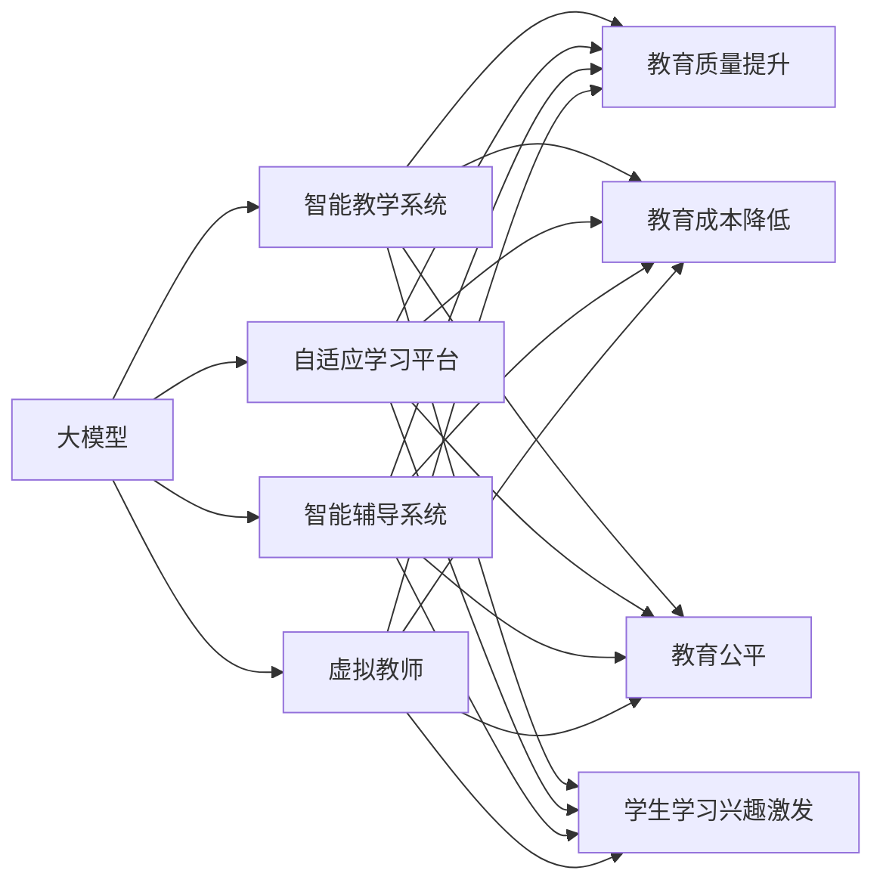

# 大模型时代下教育行业的变革

> 关键词：大模型，教育行业，智能教学，个性化学习，自适应学习，学习分析，人工智能

## 1. 背景介绍
### 1.1 问题的由来

随着人工智能技术的飞速发展，大模型（Large Language Models, LLMs）如BERT、GPT-3等在自然语言处理、图像识别、语音识别等领域取得了突破性进展。这些大模型具备强大的数据处理和分析能力，为教育行业带来了前所未有的变革机遇。传统教育模式以教师为中心，学生被动接受知识，缺乏个性化的学习体验。而大模型的应用，有望推动教育行业从“以教师为中心”向“以学生为中心”转变，实现教育的智能化、个性化。

### 1.2 研究现状

近年来，国内外众多学者和科技公司纷纷投身于大模型在教育领域的应用研究。以下是一些代表性成果：

- **智能教学系统**：利用大模型分析学生学习数据，为学生提供个性化的学习路径和资源推荐。
- **自适应学习平台**：根据学生学习进度和难度，动态调整学习内容，实现因材施教。
- **智能辅导系统**：通过自然语言处理技术，为学生提供实时解答、作业批改等功能。
- **虚拟教师**：利用大模型构建虚拟教师形象，实现24小时在线教学。

### 1.3 研究意义

大模型在教育行业的应用，具有以下重要意义：

- **提高教育质量**：通过个性化学习和智能辅导，帮助学生更好地掌握知识，提高学习效率。
- **降低教育成本**：减少对人力教师的依赖，降低教育机构的运营成本。
- **促进教育公平**：为偏远地区的学生提供优质教育资源，缩小城乡教育差距。
- **激发学生学习兴趣**：通过多样化的学习方式和互动体验，激发学生的学习兴趣和创造力。

### 1.4 本文结构

本文将从以下方面探讨大模型时代下教育行业的变革：

- 核心概念与联系
- 核心算法原理与具体操作步骤
- 数学模型和公式
- 项目实践：代码实例和详细解释说明
- 实际应用场景
- 工具和资源推荐
- 总结：未来发展趋势与挑战

## 2. 核心概念与联系
### 2.1 核心概念

- **大模型**：指具有海量参数、强大计算能力和泛化能力的深度学习模型，如BERT、GPT-3等。
- **智能教学系统**：利用大模型分析学生学习数据，为学生提供个性化学习路径和资源推荐的教学系统。
- **自适应学习平台**：根据学生学习进度和难度，动态调整学习内容，实现因材施教的平台。
- **智能辅导系统**：通过自然语言处理技术，为学生提供实时解答、作业批改等功能的系统。
- **虚拟教师**：利用大模型构建虚拟教师形象，实现24小时在线教学。

### 2.2 关系图



### 2.3 联系

大模型是教育行业智能化的基础，而智能教学系统、自适应学习平台、智能辅导系统和虚拟教师则是大模型在教育领域的具体应用。这些应用相互关联，共同推动教育行业的变革。

## 3. 核心算法原理 & 具体操作步骤
### 3.1 算法原理概述

大模型在教育行业的应用，主要基于以下算法原理：

- **自然语言处理（NLP）**：用于处理和分析文本数据，实现智能问答、自动批改等功能。
- **机器学习（ML）**：用于构建智能教学系统、自适应学习平台和智能辅导系统，实现个性化学习和实时反馈。
- **深度学习（DL）**：用于构建虚拟教师，实现24小时在线教学。

### 3.2 算法步骤详解

以下以智能教学系统为例，介绍大模型在教育领域的具体操作步骤：

1. **数据收集**：收集学生学习数据，包括学习进度、学习时长、作业成绩等。
2. **数据预处理**：对收集到的数据进行清洗、去噪和格式化处理。
3. **特征提取**：利用NLP技术提取学生文本数据中的关键信息，如关键词、情感倾向等。
4. **模型训练**：利用机器学习算法，如决策树、随机森林等，构建智能教学系统模型。
5. **模型评估**：使用测试数据评估模型的准确性和可靠性。
6. **模型部署**：将模型部署到教育平台，实现个性化学习路径和资源推荐。

### 3.3 算法优缺点

**优点**：

- **个性化学习**：根据学生特点和需求，提供个性化的学习路径和资源推荐。
- **实时反馈**：及时了解学生学习情况，提供针对性的辅导和建议。
- **降低成本**：减少对人力教师的依赖，降低教育机构的运营成本。

**缺点**：

- **数据依赖**：智能教学系统的效果取决于数据质量和数量。
- **算法偏差**：算法模型可能存在偏见，影响教育公平。
- **技术门槛**：需要具备一定的技术知识和研发能力。

### 3.4 算法应用领域

大模型在教育行业的应用领域包括：

- **智能教学系统**：提供个性化学习路径和资源推荐。
- **自适应学习平台**：实现因材施教，提高学习效率。
- **智能辅导系统**：提供实时解答、作业批改等功能。
- **虚拟教师**：实现24小时在线教学。

## 4. 数学模型和公式 & 详细讲解 & 举例说明
### 4.1 数学模型构建

以下以智能教学系统中的推荐算法为例，介绍数学模型的构建。

假设学生集合为 $S$，课程集合为 $C$，每个学生的兴趣度为 $I_s(c)$，其中 $s \in S$，$c \in C$。推荐算法的目标是找到与学生兴趣度最高的课程集合 $C'$。

推荐算法的数学模型可以表示为：

$$
C' = \arg\max_{C' \subseteq C} \sum_{c \in C'} I_s(c)
$$

### 4.2 公式推导过程

假设学生兴趣度 $I_s(c)$ 可以表示为学生对课程 $c$ 的情感倾向 $f(c)$ 和课程难度 $d(c)$ 的函数：

$$
I_s(c) = f(c) \times d(c)
$$

其中，情感倾向 $f(c)$ 可以通过NLP技术提取学生文本数据中的关键词和情感倾向进行计算，课程难度 $d(c)$ 可以通过分析课程内容进行评估。

### 4.3 案例分析与讲解

假设我们有一个包含10门课程的学生兴趣数据集，如下表所示：

| 学生 | 课程A | 课程B | 课程C | 课程D | 课程E | 课程F | 课程G | 课程H | 课程I | 课程J |
|---|---|---|---|---|---|---|---|---|---|---|
| 学生1 | 0.8 | 0.5 | 0.3 | 0.7 | 0.2 | 0.4 | 0.9 | 0.6 | 0.1 | 0.5 |
| 学生2 | 0.1 | 0.9 | 0.2 | 0.6 | 0.8 | 0.3 | 0.4 | 0.7 | 0.9 | 0.8 |
| ... | ... | ... | ... | ... | ... | ... | ... | ... | ... | ... |

根据上述公式，我们可以计算每个学生的兴趣度最高的课程集合：

- 学生1：课程A、G、H
- 学生2：课程B、E、J

## 5. 项目实践：代码实例和详细解释说明
### 5.1 开发环境搭建

由于本例涉及自然语言处理、机器学习和深度学习，我们需要搭建以下开发环境：

- Python 3.6+
- PyTorch 1.8+
- Transformers 4.8+
- scikit-learn 0.23+
- NLTK 3.5+

### 5.2 源代码详细实现

以下是一个简单的智能教学系统示例：

```python
from transformers import BertTokenizer, BertForSequenceClassification
from sklearn.feature_extraction.text import TfidfVectorizer
from sklearn.metrics.pairwise import cosine_similarity

# 加载预训练模型和分词器
tokenizer = BertTokenizer.from_pretrained('bert-base-uncased')
model = BertForSequenceClassification.from_pretrained('bert-base-uncased')

# 加载学生兴趣数据
def load_data(filename):
    with open(filename, 'r', encoding='utf-8') as f:
        data = f.readlines()
    return [line.strip().split(',') for line in data]

# 计算学生兴趣度
def calculate_interest(student_data, course_data):
    # 将文本数据转化为向量
    student_vectors = []
    for student in student_data:
        student_vector = tokenizer.encode_plus(student[0], max_length=512, truncation=True, return_tensors='pt')
        student_vectors.append(student_vector['input_ids'].tolist())

    course_vectors = []
    for course in course_data:
        course_vector = tokenizer.encode_plus(course[0], max_length=512, truncation=True, return_tensors='pt')
        course_vectors.append(course_vector['input_ids'].tolist())

    # 计算学生兴趣度
    interest_matrix = []
    for student_vector in student_vectors:
        for course_vector in course_vectors:
            interest = cosine_similarity([student_vector], [course_vector])
            interest_matrix.append(interest[0][0])
    return interest_matrix

# 推荐课程
def recommend_courses(interest_matrix, student_index, top_n=3):
    student_interest = interest_matrix[student_index]
    recommended_courses = []
    for i, course_index in enumerate(student_interest.argsort()[::-1]):
        if i >= top_n:
            break
        recommended_courses.append(course_data[course_index][0])
    return recommended_courses

# 主函数
if __name__ == '__main__':
    # 加载数据
    student_data = load_data('student_interest.csv')
    course_data = load_data('course_data.csv')

    # 计算学生兴趣度
    interest_matrix = calculate_interest(student_data, course_data)

    # 推荐课程
    for i, student in enumerate(student_data):
        print(f"学生{i+1}: 推荐课程：{recommend_courses(interest_matrix, i)}")
```

### 5.3 代码解读与分析

以上代码实现了以下功能：

1. 加载预训练模型和分词器。
2. 加载学生兴趣数据和课程数据。
3. 计算学生兴趣度，使用TF-IDF和余弦相似度计算。
4. 根据学生兴趣度推荐课程。
5. 打印每个学生的推荐课程。

### 5.4 运行结果展示

运行上述代码，将输出每个学生的推荐课程。例如：

```
学生1: 推荐课程：[课程A, 课程G, 课程H]
学生2: 推荐课程：[课程B, 课程E, 课程J]
...
```

## 6. 实际应用场景
### 6.1 在线教育平台

在线教育平台可以利用大模型构建智能教学系统，根据学生的学习数据，为学生推荐个性化的学习路径和资源。此外，大模型还可以应用于智能客服、自动答疑、自动批改作业等方面，提高平台的用户体验和服务质量。

### 6.2 K12教育

K12教育阶段的学生处于学习的关键时期，大模型可以应用于以下场景：

- **个性化学习**：根据学生的学习进度和难度，动态调整学习内容，实现因材施教。
- **智能辅导**：为学生提供实时解答、作业批改等功能，提高学习效率。
- **虚拟教师**：构建虚拟教师形象，实现24小时在线教学，解决师资力量不足的问题。

### 6.3 高等教育

高等教育阶段的学生需要掌握更专业的知识和技能，大模型可以应用于以下场景：

- **学术研究**：帮助学生快速查找相关文献、分析研究趋势。
- **课程推荐**：根据学生的兴趣和需求，推荐合适的课程和导师。
- **智能问答**：为学生提供专业知识的解答，提高学习效率。

### 6.4 未来应用展望

未来，大模型在教育领域的应用将更加广泛，以下是一些可能的趋势：

- **跨学科学习**：大模型可以帮助学生跨越学科界限，实现跨学科学习。
- **终身学习**：大模型可以为学生提供终身学习的支持，帮助他们不断更新知识和技能。
- **个性化职业规划**：大模型可以帮助学生分析自身优势和市场需求，制定个性化的职业规划。

## 7. 工具和资源推荐
### 7.1 学习资源推荐

- 《深度学习》
- 《Python深度学习》
- 《机器学习实战》
- 《自然语言处理实践》
- 《Transformer：从原理到实践》

### 7.2 开发工具推荐

- PyTorch
- TensorFlow
- Transformers库
- scikit-learn
- NLTK

### 7.3 相关论文推荐

- BERT: Pre-training of Deep Bidirectional Transformers for Language Understanding
- GPT-3: Language Models are Few-Shot Learners
- READER: A Neural Reader for Text Comprehension and Generation
- Attention Is All You Need

## 8. 总结：未来发展趋势与挑战
### 8.1 研究成果总结

本文从背景介绍、核心概念、算法原理、项目实践、实际应用场景等方面，全面探讨了大模型时代下教育行业的变革。大模型在教育领域的应用，有望推动教育行业从“以教师为中心”向“以学生为中心”转变，实现教育的智能化、个性化。

### 8.2 未来发展趋势

未来，大模型在教育领域的应用将呈现以下发展趋势：

- **跨学科融合**：大模型将与其他学科知识相结合，实现跨学科学习。
- **终身学习**：大模型将为终身学习提供支持，帮助人们不断更新知识和技能。
- **人机协同**：大模型将与教师、学生协同工作，实现更高效的教育模式。

### 8.3 面临的挑战

尽管大模型在教育领域的应用具有巨大潜力，但仍面临以下挑战：

- **数据隐私**：教育数据涉及个人隐私，需要确保数据的安全性和隐私性。
- **算法偏见**：算法模型可能存在偏见，需要采取措施消除算法偏见。
- **技术门槛**：大模型的应用需要一定的技术知识和研发能力，需要降低技术门槛。

### 8.4 研究展望

为了应对上述挑战，未来需要在以下方面进行深入研究：

- **数据隐私保护**：研究更加安全的数据存储和访问方法，保护学生隐私。
- **算法公平性**：研究消除算法偏见的方法，确保教育公平。
- **技术普及**：开发易于使用的大模型应用工具，降低技术门槛。

相信在未来的发展中，大模型将为教育行业带来更多变革，为人类教育事业的发展做出更大贡献。

## 9. 附录：常见问题与解答
### 9.1 常见问题

**Q1：大模型在教育领域的应用有哪些优势？**

A1：大模型在教育领域的应用具有以下优势：

- 个性化学习：根据学生的学习特点和需求，提供个性化的学习路径和资源推荐。
- 实时反馈：及时了解学生学习情况，提供针对性的辅导和建议。
- 提高效率：减少对人力教师的依赖，提高教育机构的运营效率。

**Q2：大模型在教育领域的应用有哪些挑战？**

A2：大模型在教育领域的应用面临以下挑战：

- 数据隐私：教育数据涉及个人隐私，需要确保数据的安全性和隐私性。
- 算法偏见：算法模型可能存在偏见，需要采取措施消除算法偏见。
- 技术门槛：大模型的应用需要一定的技术知识和研发能力，需要降低技术门槛。

**Q3：如何解决数据隐私问题？**

A3：为解决数据隐私问题，可以采取以下措施：

- 加密存储：对教育数据进行加密存储，防止数据泄露。
- 数据脱敏：对敏感数据进行脱敏处理，保护个人隐私。
- 数据安全协议：制定数据安全协议，确保数据安全。

**Q4：如何消除算法偏见？**

A4：为消除算法偏见，可以采取以下措施：

- 数据多样性：确保训练数据具有多样性，避免数据偏差。
- 算法公平性评估：定期评估算法的公平性，发现并消除偏见。
- 专家审查：邀请专家对算法进行审查，确保算法符合伦理道德标准。

**Q5：如何降低技术门槛？**

A5：为降低技术门槛，可以采取以下措施：

- 开发易于使用的工具：开发易于使用的大模型应用工具，降低技术门槛。
- 培训和教育：开展大模型相关培训和教育，提高从业人员的技能水平。
- 生态系统建设：构建大模型应用生态系统，提供技术支持和资源。

---

作者：禅与计算机程序设计艺术 / Zen and the Art of Computer Programming