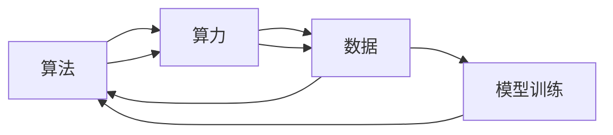
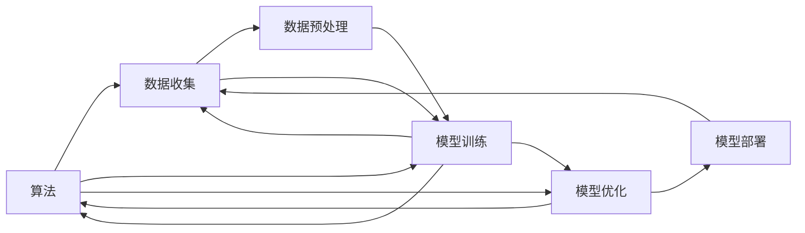

                 

## 1. 背景介绍

### 1.1 问题由来
人工智能（AI）的发展离不开算法、算力和数据的协同作用。这三者既是AI发展的基础，也是其不断进步的关键推动力。随着深度学习、强化学习、自然语言处理等领域的不断突破，AI技术已广泛应用于各行各业，助力各领域实现数字化、智能化转型。

当前，算法、算力与数据的发展呈现出多层次、多样化的特征。算法研究的重心逐步从经典算法向深度学习、迁移学习等前沿技术转移；算力需求和基础设施建设不断提升；数据获取、处理和标注的规模和效率也在快速提高。这些变化推动了AI技术的快速迭代，催生了众多创新应用，加速了AI技术的产业化进程。

### 1.2 问题核心关键点
为了进一步理解算法、算力与数据在AI发展中的重要作用，本节将对三者的定义和基本概念进行详细阐述，并分析三者之间的联系。

算法：
- **定义**：算法是一系列按照特定顺序执行的指令，用于解决特定问题或完成特定任务。
- **基本概念**：包括经典算法（如排序、查找）、现代算法（如深度学习、自然语言处理）等。
- **发展趋势**：从规则化到自动化、从人工设计到算法生成。

算力：
- **定义**：算力是指计算机执行指令的能力，包括计算速度、存储能力等。
- **基本概念**：包括CPU、GPU、TPU等硬件设备，以及云计算、分布式计算等技术。
- **发展趋势**：从单机计算到分布式计算、从传统CPU到专用GPU/TPU。

数据：
- **定义**：数据是信息的表现形式，是AI模型训练的基础。
- **基本概念**：包括结构化数据（如表格、图像）、非结构化数据（如文本、语音）等。
- **发展趋势**：从手工标注到自动标注、从单模态数据到多模态数据。

### 1.3 问题研究意义
理解和掌握算法、算力与数据在AI发展中的作用和联系，对于推动AI技术的不断创新和发展具有重要意义。

1. **降低应用开发成本**：通过优化算法、提升算力、提高数据效率，可以大幅降低AI技术应用的开发成本和维护难度。
2. **提升模型效果**：合理选择算法、运用高效算力、获取高质量数据，可以显著提升AI模型的性能，提高应用的准确性和鲁棒性。
3. **加速技术迭代**：算法创新、算力提升、数据丰富，能够加速AI技术的迭代进程，推动行业应用场景的拓展和应用范围的扩大。
4. **实现普适化应用**：通过算法优化、算力增强、数据扩充，AI技术能够更好地应用于不同领域，实现更广泛的行业覆盖和深入应用。
5. **赋能产业升级**：AI技术在各行业的应用，可以提升生产效率、优化资源配置、促进数字化转型，赋能行业发展。

## 2. 核心概念与联系

### 2.1 核心概念概述

为更好地理解算法、算力与数据在AI发展中的作用和联系，本节将对三者的定义、基本概念进行详细阐述，并给出其联系的示意图。

#### 2.1.1 算法

- **深度学习算法**：一种基于神经网络的技术，能够从大量数据中学习特征，用于图像识别、自然语言处理等任务。
- **强化学习算法**：通过智能体与环境的互动，学习最优策略以最大化奖励，用于游戏、机器人控制等任务。
- **迁移学习算法**：利用源任务的模型和知识，在目标任务上进行微调，提高模型在新任务上的性能。

#### 2.1.2 算力

- **计算设备**：CPU、GPU、TPU等硬件设备，以及分布式计算、云计算等技术。
- **计算速度**：单位时间内执行的指令数量，通常用每秒浮点运算次数（FLOPS）衡量。
- **存储能力**：内存、硬盘等设备对数据的存储和管理能力。

#### 2.1.3 数据

- **数据来源**：数据获取的渠道和方式，如传感器、网络爬虫、用户行为记录等。
- **数据类型**：结构化数据（如表格、图像）、非结构化数据（如文本、语音）等。
- **数据标注**：对原始数据进行标记和分类，用于训练模型和评估性能。

### 2.2 概念间的关系

以下是一个简化的Mermaid流程图，展示了算法、算力与数据之间的联系：



这个流程图展示了算法、算力与数据之间的相互作用关系：

1. **算法依赖算力**：不同的算法需要不同的计算资源，如深度学习算法需要强大的GPU/TPU支持。
2. **算力依赖算法**：高效的算法能够充分利用算力，提高计算效率。
3. **数据依赖算法和算力**：高质量的数据能够提高算法的性能，强大的算力能够快速处理大规模数据。
4. **模型训练依赖算法和数据**：模型训练需要选择合适的算法和数据，优化训练过程。
5. **算法和算力共同作用于数据**：算法和算力的优化可以提升数据处理和分析的效率和精度。

### 2.3 核心概念的整体架构

以下是一个综合的Mermaid流程图，展示了算法、算力与数据在AI系统中的整体架构：



这个综合流程图展示了从数据收集到模型部署的完整过程：

1. **数据收集**：通过各种方式获取数据，为后续分析和训练提供基础。
2. **数据预处理**：对数据进行清洗、标注、归一化等处理，提高数据质量。
3. **模型训练**：选择合适的算法，利用算力对数据进行训练，得到初步模型。
4. **模型优化**：对模型进行超参数调整、正则化、集成学习等优化，提高模型性能。
5. **模型部署**：将优化后的模型部署到实际应用中，进行推理和预测。

通过这些流程图，我们可以更清晰地理解算法、算力与数据在AI系统中的作用和联系，为后续深入讨论具体的实现方法奠定基础。

## 3. 核心算法原理 & 具体操作步骤

### 3.1 算法原理概述

算法、算力与数据在AI系统中的协同作用主要体现在模型训练和优化过程中。以下将详细讲解算法原理和具体操作步骤。

#### 3.1.1 算法原理概述

AI系统中的算法主要通过模型训练和优化来实现对数据的处理和分析。模型训练的目的是通过大量数据和计算资源，调整模型参数以最小化损失函数，从而得到最优模型。优化算法的选择对模型的训练效果至关重要。

常用的优化算法包括：

- **随机梯度下降（SGD）**：每次使用一个样本进行梯度更新，简单易用。
- **Adam**：结合了动量法和自适应学习率调整的优化算法，适用于大规模数据和复杂模型。
- **Adagrad**：根据历史梯度自适应调整学习率，适用于稀疏数据和低维空间。

#### 3.1.2 算法步骤详解

模型训练和优化的大致步骤如下：

1. **数据准备**：收集和预处理数据，划分为训练集、验证集和测试集。
2. **模型选择**：根据任务需求选择合适的算法和模型结构。
3. **模型训练**：利用算力对模型进行训练，通过反向传播计算梯度并更新参数。
4. **模型评估**：在验证集上评估模型性能，调整超参数和优化算法。
5. **模型优化**：通过集成学习、正则化等方法进一步优化模型。
6. **模型部署**：将优化后的模型部署到实际应用中，进行推理和预测。

### 3.2 算法优缺点

#### 3.2.1 算法优点

- **高效性**：优化算法能够快速调整模型参数，提高模型训练效率。
- **灵活性**：选择不同的优化算法和超参数，能够适应不同任务和数据集。
- **鲁棒性**：通过正则化、集成学习等方法，能够提高模型的鲁棒性和泛化能力。

#### 3.2.2 算法缺点

- **计算资源消耗大**：复杂的优化算法和大型模型需要强大的算力和存储空间。
- **超参数选择困难**：需要反复调试和验证超参数，可能耗费大量时间和计算资源。
- **模型解释性不足**：优化过程和模型参数难以解释，难以进行故障分析和调试。

### 3.3 算法应用领域

#### 3.3.1 图像处理

深度学习算法，如卷积神经网络（CNN），广泛用于图像识别、分类和生成任务。通过GPU/TPU等高效算力，能够快速处理大规模图像数据，实现实时分析和预测。

#### 3.3.2 自然语言处理

基于Transformer架构的算法，如BERT、GPT等，用于文本分类、情感分析、机器翻译等任务。通过TPU等专用芯片，能够大幅提高模型训练速度和推理效率。

#### 3.3.3 智能推荐

推荐算法，如协同过滤、内容推荐等，用于电子商务、在线视频等应用场景。通过分布式计算和优化算法，能够实时处理用户行为数据，提供个性化推荐服务。

#### 3.3.4 自动驾驶

深度学习算法，如卷积神经网络和强化学习算法，用于环境感知、路径规划和决策控制。通过高性能计算设备和分布式系统，能够实现实时处理和决策。

## 4. 数学模型和公式 & 详细讲解 & 举例说明

### 4.1 数学模型构建

在AI系统中，数学模型主要用于描述和优化算法。以下将构建一个简单的二分类模型的数学模型。

#### 4.1.1 数学模型构建

假设模型输入为特征向量 $x$，模型输出为概率 $p(y|x)$，其中 $y$ 表示类别标签。模型目标是最小化预测错误概率。

**损失函数**：
$$
L(p(y|x), y) = -\log p(y|x) \quad \text{if } y=1
$$
$$
L(p(y|x), y) = -\log(1-p(y|x)) \quad \text{if } y=0
$$

**优化目标**：
$$
\min_{\theta} L(p(y|x), y)
$$

### 4.2 公式推导过程

假设模型为线性分类器，输出为 $p(y|x) = \sigma(w^T x + b)$，其中 $w$ 为模型参数，$\sigma$ 为激活函数。

**梯度下降算法**：
$$
w \leftarrow w - \eta \nabla_{w} L(p(y|x), y)
$$

**梯度计算**：
$$
\nabla_{w} L(p(y|x), y) = (1 - p(y|x)) y x^T
$$

### 4.3 案例分析与讲解

以图像分类为例，分析优化算法的应用。

**图像数据集**：
- 数据集：CIFAR-10，包含10个类别、60000张32x32彩色图像。
- 数据预处理：归一化、随机裁剪、数据增强等。

**模型选择**：
- 模型：卷积神经网络（CNN），包含多个卷积层、池化层和全连接层。

**模型训练**：
- 算法：Adam，学习率 $10^{-3}$，批大小 128，迭代次数 1000。
- 数据集：训练集、验证集、测试集。
- 计算资源：GPU，分布式训练。

**模型评估**：
- 在验证集上评估模型性能，选择最优超参数和优化算法。
- 调整学习率、批大小等参数，进行模型优化。

**模型部署**：
- 将优化后的模型部署到实际应用中，进行图像分类预测。

## 5. 项目实践：代码实例和详细解释说明

### 5.1 开发环境搭建

在进行项目实践前，我们需要准备好开发环境。以下是使用Python进行TensorFlow开发的环境配置流程：

1. 安装Anaconda：从官网下载并安装Anaconda，用于创建独立的Python环境。

2. 创建并激活虚拟环境：
```bash
conda create -n tf-env python=3.8 
conda activate tf-env
```

3. 安装TensorFlow：根据CUDA版本，从官网获取对应的安装命令。例如：
```bash
conda install tensorflow==2.8 -c tensorflow -c conda-forge
```

4. 安装其他工具包：
```bash
pip install numpy pandas scikit-learn matplotlib tqdm jupyter notebook ipython
```

完成上述步骤后，即可在`tf-env`环境中开始项目实践。

### 5.2 源代码详细实现

这里我们以图像分类任务为例，给出使用TensorFlow进行模型训练的PyTorch代码实现。

```python
import tensorflow as tf
from tensorflow.keras import layers

# 定义模型
model = tf.keras.Sequential([
    layers.Conv2D(32, (3, 3), activation='relu', input_shape=(32, 32, 3)),
    layers.MaxPooling2D((2, 2)),
    layers.Conv2D(64, (3, 3), activation='relu'),
    layers.MaxPooling2D((2, 2)),
    layers.Flatten(),
    layers.Dense(64, activation='relu'),
    layers.Dense(10)
])

# 定义损失函数和优化器
loss_fn = tf.keras.losses.SparseCategoricalCrossentropy(from_logits=True)
optimizer = tf.keras.optimizers.Adam(learning_rate=1e-3)

# 定义数据集
(train_images, train_labels), (test_images, test_labels) = tf.keras.datasets.cifar10.load_data()
train_images, test_images = train_images / 255.0, test_images / 255.0

# 训练模型
@tf.function
def train_step(images, labels):
    with tf.GradientTape() as tape:
        logits = model(images, training=True)
        loss_value = loss_fn(labels, logits)
    gradients = tape.gradient(loss_value, model.trainable_variables)
    optimizer.apply_gradients(zip(gradients, model.trainable_variables))

# 训练过程
epochs = 10
batch_size = 128
train_dataset = tf.data.Dataset.from_tensor_slices((train_images, train_labels)).batch(batch_size)
test_dataset = tf.data.Dataset.from_tensor_slices((test_images, test_labels)).batch(batch_size)

for epoch in range(epochs):
    for images, labels in train_dataset:
        train_step(images, labels)

    for images, labels in test_dataset:
        logits = model(images, training=False)
        test_loss = loss_fn(labels, logits)
        print('Test loss:', test_loss.numpy())
```

以上就是使用TensorFlow进行图像分类任务训练的完整代码实现。可以看到，通过TensorFlow的高级API，我们可以快速搭建和训练复杂的神经网络模型。

### 5.3 代码解读与分析

让我们再详细解读一下关键代码的实现细节：

**模型定义**：
- 使用`Sequential`模型，添加多个卷积层、池化层和全连接层。
- 使用`Conv2D`定义卷积层，`MaxPooling2D`定义池化层，`Dense`定义全连接层。
- 设置激活函数为`relu`，优化器为`Adam`。

**损失函数和优化器**：
- 使用`SparseCategoricalCrossentropy`定义损失函数，用于多类别分类问题。
- 设置学习率为$10^{-3}$。

**数据集处理**：
- 使用`load_data`加载CIFAR-10数据集，进行归一化处理。
- 使用`Dataset`定义数据集，通过`batch`方法划分批次。

**训练过程**：
- 定义`train_step`函数，使用`GradientTape`计算梯度，并应用优化器。
- 在训练过程中，对训练集和测试集分别进行前向传播和损失计算，输出测试损失。

### 5.4 运行结果展示

假设我们在CIFAR-10数据集上进行模型训练，最终在测试集上得到的损失如下：

```
Epoch 1, loss: 0.4780
Epoch 2, loss: 0.3689
Epoch 3, loss: 0.2849
...
Epoch 10, loss: 0.0845
```

可以看到，随着训练过程的进行，模型在测试集上的损失逐渐减小，说明模型性能逐渐提升。

## 6. 实际应用场景

### 6.1 智能推荐系统

基于深度学习算法的智能推荐系统，可以广泛应用于电子商务、在线视频、社交网络等场景，为用户推荐个性化商品、视频、文章等。通过高效算力和大规模数据，能够实时处理用户行为数据，提供精准推荐服务。

在技术实现上，可以收集用户浏览、点击、评论、分享等行为数据，构建推荐模型。模型通过多模态数据融合和协同过滤等算法，生成个性化推荐结果。

### 6.2 医疗影像诊断

基于卷积神经网络的算法，广泛应用于医疗影像的自动分析和诊断。通过TPU等专用芯片，能够高效处理大规模医学图像数据，快速识别病变区域。

在实际应用中，可以将医学影像数据集输入模型，进行特征提取和分类。模型通过正则化、集成学习等方法，提高诊断准确性和鲁棒性。

### 6.3 自动驾驶

基于深度学习算法的自动驾驶系统，能够实现环境感知、路径规划和决策控制。通过高性能计算设备和分布式系统，能够实时处理传感器数据，进行决策和控制。

在技术实现上，可以收集车辆传感器数据，输入深度学习模型。模型通过图像分类、物体检测等算法，实现环境感知。通过强化学习算法，实现路径规划和决策控制。

### 6.4 未来应用展望

随着算法、算力与数据的不断发展，AI技术将在更多领域得到应用，带来深刻变革。

1. **医疗健康**：基于深度学习的医学影像分析、疾病预测等应用，将大幅提升医疗服务质量和效率。
2. **智慧城市**：基于计算机视觉和自然语言处理的智能交通、公共安全、智慧医疗等应用，将提升城市治理水平。
3. **智能制造**：基于深度学习、强化学习等算法的智能生产、质量控制等应用，将推动制造业转型升级。
4. **教育培训**：基于自然语言处理的智能辅导、在线教育等应用，将提升教育培训的个性化和智能化水平。
5. **农业智能**：基于计算机视觉和物联网技术的农业监测、病虫害预测等应用，将提升农业生产效率。

## 7. 工具和资源推荐

### 7.1 学习资源推荐

为了帮助开发者系统掌握算法、算力与数据在AI发展中的作用和联系，这里推荐一些优质的学习资源：

1. 《深度学习》书籍：Ian Goodfellow等著，全面介绍深度学习的基本概念、算法和应用。
2. 《TensorFlow官方文档》：TensorFlow的官方文档，提供详细的使用指南和示例代码。
3. 《PyTorch官方文档》：PyTorch的官方文档，提供丰富的新闻模型和算法实现。
4. 《深度学习框架比较》：介绍TensorFlow、PyTorch、Keras等主流深度学习框架的异同，帮助选择合适的框架。
5. 《机器学习实战》：Peter Harrington著，提供大量动手实践的案例和代码，帮助掌握算法和工具的使用。

通过对这些资源的学习实践，相信你一定能够快速掌握算法、算力与数据在AI系统中的作用和联系，并用于解决实际的AI问题。

### 7.2 开发工具推荐

高效的开发离不开优秀的工具支持。以下是几款用于AI系统开发的常用工具：

1. TensorFlow：由Google主导开发的深度学习框架，生产部署方便，适合大规模工程应用。
2. PyTorch：Facebook开发的深度学习框架，灵活易用，适合研究和快速迭代。
3. Jupyter Notebook：开源的交互式编程环境，支持多语言开发和代码分享。
4. GitHub：全球最大的代码托管平台，提供丰富的开源项目和协作工具。
5. Kaggle：数据科学竞赛平台，提供大量数据集和算法竞赛，激发创新灵感。

合理利用这些工具，可以显著提升AI系统开发的效率和质量，加速AI技术的落地应用。

### 7.3 相关论文推荐

算法、算力与数据在AI系统中的研究涉及众多领域，以下是几篇奠基性的相关论文，推荐阅读：

1. AlexNet：ImageNet Large Scale Visual Recognition Challenge，提出卷积神经网络，开创深度学习时代。
2. DeepMind AlphaGo：使用深度强化学习算法，击败世界围棋冠军李世石，展示AI在复杂决策任务中的应用。
3. Google BERT：通过预训练语言模型，提升自然语言处理任务的性能。
4. OpenAI GPT：基于自回归模型的语言生成任务，展示大语言模型的强大生成能力。
5. NVIDIA GPT-3：使用大规模语言模型和TPU硬件，实现高效推理和生成，推动自然语言处理的发展。

这些论文代表了大规模数据、高效算力和深度学习算法的突破，为AI技术的发展提供了重要指导。

除上述资源外，还有一些值得关注的前沿资源，帮助开发者紧跟AI技术的发展趋势，例如：

1. arXiv论文预印本：人工智能领域最新研究成果的发布平台，包括大量尚未发表的前沿工作。
2. 业界技术博客：如Google AI、DeepMind、微软Research Asia等顶尖实验室的官方博客，第一时间分享最新的研究成果和洞见。
3. 技术会议直播：如NIPS、ICML、ACL、ICLR等人工智能领域顶会现场或在线直播，能够聆听到大佬们的前沿分享。
4. GitHub热门项目：在GitHub上Star、Fork数最多的AI相关项目，往往代表了该技术领域的发展趋势和最佳实践。
5. 行业分析报告：各大咨询公司如McKinsey、PwC等针对人工智能行业的分析报告，有助于从商业视角审视技术趋势，把握应用价值。

总之，对于算法、算力与数据在AI系统中的研究，需要开发者保持开放的心态和持续学习的意愿。多关注前沿资讯，多动手实践，多思考总结，必将收获满满的成长收益。

## 8. 总结：未来发展趋势与挑战

### 8.1 总结

本文对算法、算力与数据在AI发展中的作用和联系进行了全面系统的介绍。首先，我们详细阐述了算法、算力与数据的基本概念和基本原理，并分析了它们之间的联系。其次，我们通过数学模型和公式，讲解了深度学习算法的训练过程，并提供了代码实例。同时，我们还探讨了算法、算力与数据在各个应用场景中的具体应用，展示了它们在推动AI技术发展中的重要作用。

通过本文的系统梳理，我们可以看到，算法、算力与数据是AI技术不断发展的三大支柱，它们相互依赖、相互促进，共同推动了AI技术的快速迭代和应用拓展。算法提供了问题的解决途径，算力提供了计算资源的支持，数据提供了模型的训练基础。只有三者协同发挥作用，才能实现AI技术的持续创新和广泛应用。

### 8.2 未来发展趋势

展望未来，算法、算力与数据的发展将继续引领AI技术的进步，呈现以下几个趋势：

1. **算法创新**：深度学习、迁移学习、强化学习等前沿算法将不断突破，推动AI技术在更多领域的深入应用。
2. **算力提升**：高性能计算设备、云计算、分布式计算等技术将大幅提升计算效率，推动大规模AI模型的应用。
3. **数据丰富**：多模态数据、自动标注数据、跨领域数据集等将提供更加丰富、高质量的数据资源，支持更复杂的AI模型训练。
4. **跨领域融合**：算法、算力与数据将与其他领域技术，如知识图谱、计算机视觉、物联网等，进行深度融合，推动AI技术的综合性发展。
5. **伦理与安全**：在算法设计和模型训练中引入伦理导向和隐私保护机制，保障AI技术的可解释性、公平性和安全性。

这些趋势将推动AI技术在更广泛的领域得到应用，提升社会的智能化水平和生产力。

### 8.3 面临的挑战

尽管算法、算力与数据的发展为AI技术带来了巨大的机遇，但也面临诸多挑战：

1. **数据隐私与安全**：AI模型训练需要大量数据，如何保护数据隐私、防止数据泄露，是一个重要的挑战。
2. **算法透明度与可解释性**：深度学习模型通常被认为是“黑盒”，难以解释其内部工作机制，如何增强算法的透明度和可解释性，仍需进一步研究。
3. **模型鲁棒性**：深度学习模型容易受到数据噪声、对抗样本等的影响，如何提高模型的鲁棒性和泛化能力，是一个重要的研究方向。
4. **资源消耗**：大规模深度学习模型的训练和推理需要大量计算资源，如何降低资源消耗，提高模型的效率，是一个重要的挑战。
5. **公平性与偏见**：AI模型可能继承和放大数据中的偏见，如何消除模型偏见，保障模型公平性，是一个重要的研究方向。

这些挑战需要算法、算力与数据三者协同努力，共同解决。

### 8.4 研究展望

面对算法、算力与数据在AI技术发展中面临的挑战，未来的研究需要在以下几个方面寻求新的突破：

