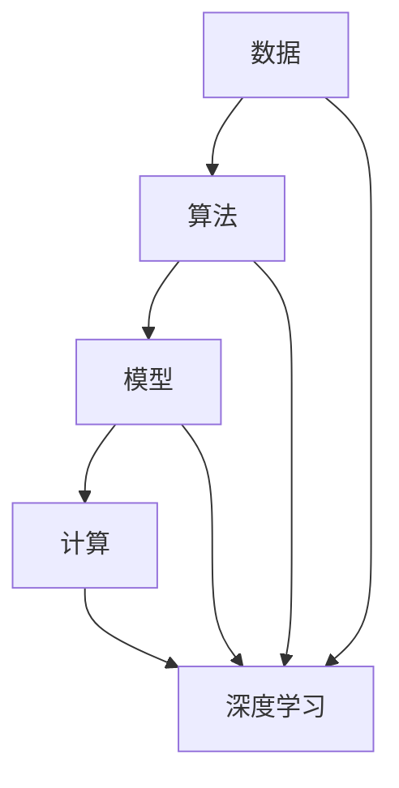
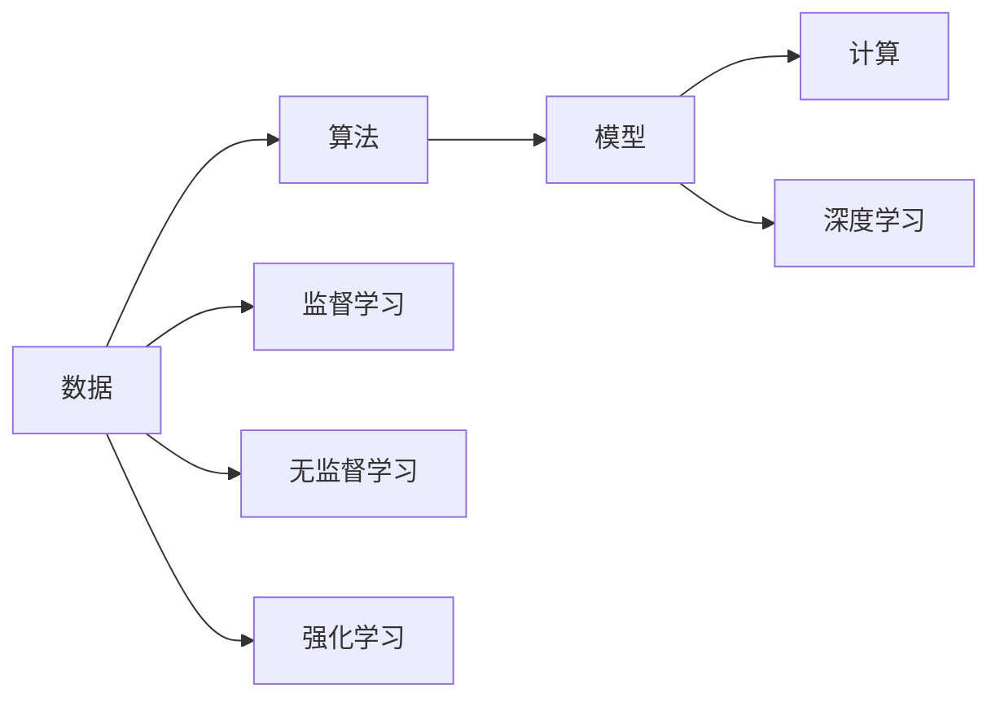
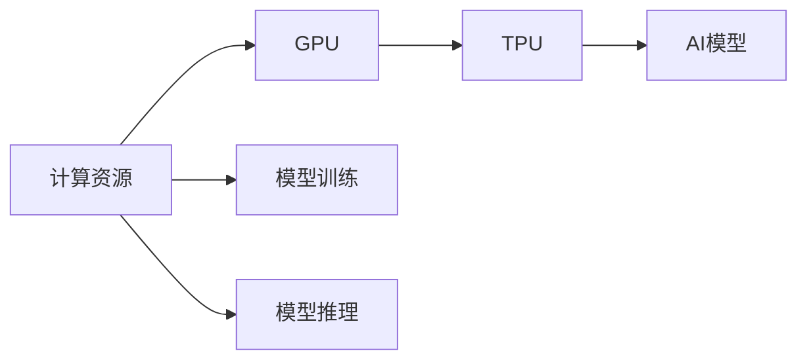
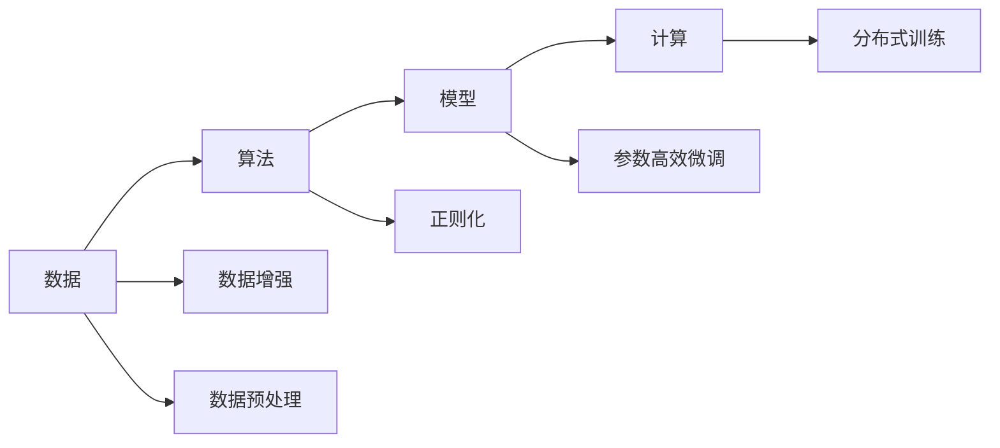
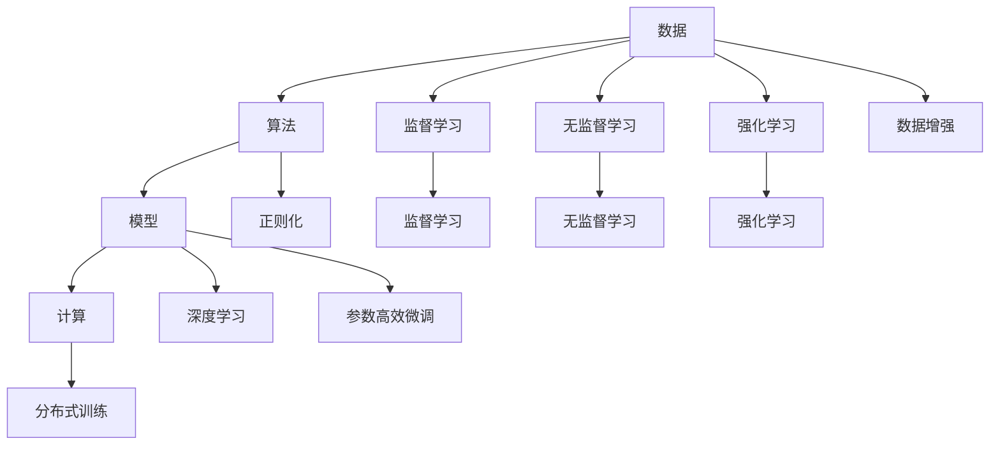

                 

## 1. 背景介绍

### 1.1 问题由来
人工智能（AI）是21世纪最重要的技术之一，它正在深刻地改变着各行各业的运作方式，从自动驾驶、医疗诊断、到金融交易，无所不包。然而，AI的发展并非一帆风顺，它面临着诸多挑战，如数据质量、算法复杂性、安全性等。为了更好地应对这些挑战，AI的发展离不开三个核心力量：数据、算法和计算。本文将深入探讨这三个核心力量，探讨它们如何驱动AI的进步，以及未来可能的发展趋势。

### 1.2 问题核心关键点
数据、算法和计算是AI发展的三大核心力量，它们相辅相成，共同推动了AI技术的发展。具体来说：

- **数据**：数据是AI的基石，高质量的数据是训练出高性能模型的前提。
- **算法**：算法是AI的大脑，决定了模型如何从数据中提取有价值的特征。
- **计算**：计算是AI的肌肉，决定了模型的训练和推理速度。

数据、算法和计算相互依存，共同驱动着AI的发展和应用。

### 1.3 问题研究意义
深入理解AI发展的三大核心力量，对于推动AI技术的进步，探索其潜在的商业应用，具有重要意义。研究这些核心力量，能够帮助我们更好地应对未来AI技术带来的挑战，同时也为AI的可持续发展奠定基础。

## 2. 核心概念与联系

### 2.1 核心概念概述

为了更好地理解AI发展的三大核心力量，本文将介绍几个关键概念：

- **数据**：AI的训练数据集，包括结构化数据、非结构化数据等。
- **算法**：AI模型的训练和推理过程，如监督学习、无监督学习、强化学习等。
- **计算**：AI模型训练和推理所需的计算资源，包括GPU、TPU等高性能计算设备。
- **模型**：由算法和数据训练出来的AI模型，用于解决特定问题。
- **深度学习**：一种基于神经网络的机器学习技术，适用于处理大规模复杂数据。

这些核心概念之间的关系可以通过以下Mermaid流程图来展示：



这个流程图展示了数据、算法、计算和模型在AI发展中的相互关系和作用。

### 2.2 概念间的关系

这些核心概念之间存在着紧密的联系，形成了AI发展的完整生态系统。下面我们通过几个Mermaid流程图来展示这些概念之间的关系。

#### 2.2.1 AI的发展范式



这个流程图展示了AI发展中的三种主要范式：监督学习、无监督学习和强化学习。这些范式都依赖于数据和算法，共同驱动了模型的发展和优化。

#### 2.2.2 计算与AI的关系



这个流程图展示了计算资源如何支持AI模型的训练和推理。随着计算能力的提升，AI模型的复杂度和规模也在不断扩大，推动了AI技术的发展。

#### 2.2.3 数据、算法和计算的协同作用



这个流程图展示了数据、算法和计算在协同作用下的AI模型优化过程。数据预处理和增强技术、算法设计和优化、计算资源的合理分配和利用，共同推动了AI模型的性能提升。

### 2.3 核心概念的整体架构

最后，我们用一个综合的流程图来展示这些核心概念在AI发展中的整体架构：



这个综合流程图展示了数据、算法、计算和模型在AI发展中的相互作用和影响，以及它们如何共同推动AI技术的进步。

## 3. 核心算法原理 & 具体操作步骤
### 3.1 算法原理概述

AI的核心算法主要分为三大类：监督学习、无监督学习和强化学习。下面将对这三类算法进行详细讲解。

#### 3.1.1 监督学习

监督学习是一种有监督的学习方法，它通过已标注的数据集来训练模型，使其能够对新的未标注数据进行分类或预测。监督学习的基本流程包括：

1. **数据预处理**：清洗和处理数据，包括缺失值处理、异常值处理等。
2. **特征工程**：选择和构造特征，提取有用的信息，以提高模型的预测性能。
3. **模型训练**：使用训练数据集训练模型，优化模型参数，使其能够最小化预测误差。
4. **模型评估**：使用验证数据集对模型进行评估，选择性能最优的模型。
5. **模型部署**：将模型部署到实际应用中，进行推理和预测。

#### 3.1.2 无监督学习

无监督学习是一种无标注的数据学习方法，它通过数据本身的特征来进行学习。无监督学习的基本流程包括：

1. **数据预处理**：清洗和处理数据，包括缺失值处理、异常值处理等。
2. **特征学习**：从数据中自动学习特征，无需人工干预。
3. **模型训练**：使用无标注数据集训练模型，优化模型参数，使其能够发现数据中的潜在结构。
4. **模型评估**：使用测试数据集对模型进行评估，选择性能最优的模型。
5. **模型部署**：将模型部署到实际应用中，进行推理和预测。

#### 3.1.3 强化学习

强化学习是一种通过试错来学习的方法，它通过与环境的交互来学习最优的策略。强化学习的基本流程包括：

1. **环境定义**：定义环境，包括状态、动作、奖励等。
2. **模型训练**：使用环境进行训练，优化策略参数，使其能够最大化长期奖励。
3. **模型评估**：使用测试环境对模型进行评估，选择性能最优的策略。
4. **模型部署**：将模型部署到实际应用中，进行策略应用。

### 3.2 算法步骤详解

#### 3.2.1 监督学习步骤

1. **数据预处理**：清洗和处理数据，包括缺失值处理、异常值处理等。
2. **特征工程**：选择和构造特征，提取有用的信息，以提高模型的预测性能。
3. **模型选择**：选择适合问题的模型，如线性回归、逻辑回归、支持向量机等。
4. **模型训练**：使用训练数据集训练模型，优化模型参数，使其能够最小化预测误差。
5. **模型评估**：使用验证数据集对模型进行评估，选择性能最优的模型。
6. **模型部署**：将模型部署到实际应用中，进行推理和预测。

#### 3.2.2 无监督学习步骤

1. **数据预处理**：清洗和处理数据，包括缺失值处理、异常值处理等。
2. **特征学习**：从数据中自动学习特征，无需人工干预。
3. **模型选择**：选择适合问题的模型，如K-Means、PCA等。
4. **模型训练**：使用无标注数据集训练模型，优化模型参数，使其能够发现数据中的潜在结构。
5. **模型评估**：使用测试数据集对模型进行评估，选择性能最优的模型。
6. **模型部署**：将模型部署到实际应用中，进行推理和预测。

#### 3.2.3 强化学习步骤

1. **环境定义**：定义环境，包括状态、动作、奖励等。
2. **策略选择**：选择适合问题的策略，如Q-learning、Deep Q-Network等。
3. **模型训练**：使用环境进行训练，优化策略参数，使其能够最大化长期奖励。
4. **模型评估**：使用测试环境对模型进行评估，选择性能最优的策略。
5. **模型部署**：将模型部署到实际应用中，进行策略应用。

### 3.3 算法优缺点

#### 3.3.1 监督学习的优缺点

**优点**：

- 数据标注成本低：监督学习需要较少的数据标注，训练时间较短。
- 模型性能高：由于使用了标注数据，模型的预测性能较高。

**缺点**：

- 数据标注成本高：某些任务需要大量标注数据，标注成本较高。
- 数据分布偏差：标注数据可能存在分布偏差，影响模型的泛化性能。

#### 3.3.2 无监督学习的优缺点

**优点**：

- 数据标注成本低：无监督学习无需标注数据，训练时间较短。
- 模型泛化性能高：无监督学习可以从数据中学习到更广泛的知识，泛化性能较高。

**缺点**：

- 模型性能不稳定：无监督学习对数据的质量和特征选择要求较高，模型性能可能不稳定。
- 数据处理难度大：无监督学习需要较强的特征选择和特征提取能力，处理难度较大。

#### 3.3.3 强化学习的优缺点

**优点**：

- 适应性强：强化学习可以适应动态变化的环境，适应性强。
- 自动学习策略：强化学习可以自动学习最优策略，无需人工干预。

**缺点**：

- 训练时间较长：强化学习需要较长的训练时间，数据效率较低。
- 策略收敛困难：强化学习的策略收敛可能较慢，需要较长时间的学习。

### 3.4 算法应用领域

监督学习、无监督学习和强化学习在各个领域都有着广泛的应用：

- **监督学习**：适用于分类、回归、预测等任务，如图像分类、语音识别、推荐系统等。
- **无监督学习**：适用于聚类、降维、异常检测等任务，如客户分群、图像降维、异常检测等。
- **强化学习**：适用于游戏、机器人、自动驾驶等任务，如AlphaGo、自动驾驶、机器人控制等。

## 4. 数学模型和公式 & 详细讲解 & 举例说明

### 4.1 数学模型构建

本文将以线性回归模型为例，介绍监督学习的数学模型构建。

设训练数据集为$D=\{(x_i,y_i)\}_{i=1}^N$，其中$x_i$为输入特征，$y_i$为输出标签。线性回归模型的目标是最小化预测值与真实值之间的平方误差，数学表达式如下：

$$
\min_{\theta} \sum_{i=1}^N (y_i - \theta^T x_i)^2
$$

其中$\theta$为模型参数，$x_i^T$为输入特征的转置，$y_i$为输出标签。

### 4.2 公式推导过程

为了求解上述最小化问题，我们需要对模型参数$\theta$进行优化。通过最小二乘法，可以求得$\theta$的解析解，公式如下：

$$
\theta = (X^TX)^{-1}X^Ty
$$

其中$X=\begin{bmatrix}x_1^T \\ x_2^T \\ \vdots \\ x_n^T \end{bmatrix}$为输入特征的矩阵，$y=\begin{bmatrix}y_1 \\ y_2 \\ \vdots \\ y_n \end{bmatrix}$为输出标签的向量。

### 4.3 案例分析与讲解

假设我们有一个简单的线性回归问题，输入特征$x_i$为房价，输出标签$y_i$为房屋面积。我们收集了10个房屋的房价和面积数据，构建线性回归模型，进行训练和预测。

首先，我们对数据进行预处理，计算输入特征的平均值和标准差，进行标准化处理。然后，将标准化后的数据代入上述线性回归模型，求解模型参数$\theta$，得到预测房价与实际房价的误差，进行模型评估。

## 5. 项目实践：代码实例和详细解释说明

### 5.1 开发环境搭建

在进行AI模型开发前，我们需要准备好开发环境。以下是使用Python进行TensorFlow开发的开发环境配置流程：

1. 安装Anaconda：从官网下载并安装Anaconda，用于创建独立的Python环境。

2. 创建并激活虚拟环境：
```bash
conda create -n tensorflow-env python=3.8 
conda activate tensorflow-env
```

3. 安装TensorFlow：从官网获取对应的安装命令。例如：
```bash
pip install tensorflow
```

4. 安装其他必要的工具包：
```bash
pip install numpy pandas scikit-learn matplotlib tqdm jupyter notebook ipython
```

完成上述步骤后，即可在`tensorflow-env`环境中开始AI模型开发。

### 5.2 源代码详细实现

下面我们以线性回归模型为例，给出使用TensorFlow进行模型开发的PyTorch代码实现。

```python
import tensorflow as tf
import numpy as np
from sklearn.datasets import load_boston
from sklearn.model_selection import train_test_split
from sklearn.preprocessing import StandardScaler

# 加载数据
boston = load_boston()
X = boston.data
y = boston.target

# 数据划分
X_train, X_test, y_train, y_test = train_test_split(X, y, test_size=0.2, random_state=42)

# 标准化处理
scaler = StandardScaler()
X_train = scaler.fit_transform(X_train)
X_test = scaler.transform(X_test)

# 定义模型
model = tf.keras.Sequential([
    tf.keras.layers.Dense(1, input_shape=(X_train.shape[1],), activation='linear')
])

# 定义损失函数和优化器
loss_fn = tf.keras.losses.MeanSquaredError()
optimizer = tf.keras.optimizers.SGD(learning_rate=0.01)

# 定义评估指标
metrics = [tf.keras.metrics.MeanSquaredError()]

# 编译模型
model.compile(optimizer=optimizer, loss=loss_fn, metrics=metrics)

# 训练模型
history = model.fit(X_train, y_train, epochs=100, batch_size=32, validation_data=(X_test, y_test))

# 评估模型
test_loss = model.evaluate(X_test, y_test)

print('Test loss:', test_loss)
```

以上代码实现了线性回归模型的训练和评估。首先，我们加载波士顿房价数据集，对其进行数据划分和标准化处理。然后，定义一个简单的线性回归模型，使用均方误差作为损失函数，SGD优化器进行模型优化。最后，在训练集和测试集上分别训练和评估模型，输出测试损失。

### 5.3 代码解读与分析

让我们再详细解读一下关键代码的实现细节：

**数据加载和预处理**：
- 使用`load_boston`函数加载波士顿房价数据集，包含了房屋特征和房价标签。
- 使用`train_test_split`函数将数据集划分为训练集和测试集。
- 使用`StandardScaler`对特征进行标准化处理，避免模型因数据量级差异较大而产生的训练问题。

**模型定义**：
- 定义一个简单的线性回归模型，使用`Sequential`模型层堆叠，添加一个全连接层。
- 设置模型的输入形状为特征向量，激活函数为线性函数，适合线性回归问题。

**模型训练和评估**：
- 定义均方误差损失函数，使用SGD优化器进行模型优化。
- 在训练集上使用`fit`函数进行模型训练，设置迭代轮数和批次大小。
- 在测试集上使用`evaluate`函数进行模型评估，输出测试损失。

**模型优化和调试**：
- 使用TensorFlow提供的`callbacks`工具，可以在训练过程中监控模型性能，如 EarlyStopping、ModelCheckpoint等。
- 使用TensorBoard工具，可以在训练过程中可视化模型性能和训练过程，帮助调试和优化模型。

## 6. 实际应用场景

### 6.1 智能推荐系统

基于AI推荐系统的应用场景非常广泛，如电商平台、视频网站、社交媒体等。通过分析用户的兴趣和行为数据，AI推荐系统可以为用户推荐个性化内容，提高用户满意度和粘性。

在技术实现上，可以使用协同过滤、基于内容的推荐、深度学习推荐等方法，构建推荐模型。例如，使用协同过滤方法，可以基于用户行为数据和物品特征进行推荐。使用基于内容的推荐方法，可以基于物品的特征进行推荐。使用深度学习推荐方法，可以使用神经网络模型进行推荐。

### 6.2 自然语言处理

自然语言处理（NLP）是AI的重要应用领域之一，包括文本分类、情感分析、机器翻译、问答系统等。通过使用深度学习模型和自然语言理解技术，AI可以在大规模文本数据上进行学习和推理。

在技术实现上，可以使用预训练语言模型如BERT、GPT等进行模型训练和微调。例如，使用BERT模型进行文本分类任务，可以在训练集上训练模型，然后在测试集上进行分类预测。使用GPT模型进行机器翻译任务，可以在训练集上训练模型，然后在测试集上进行翻译预测。

### 6.3 自动驾驶

自动驾驶是AI的另一个重要应用领域，通过使用传感器数据和地图信息，AI可以实现车辆的自动驾驶功能。自动驾驶技术包括路径规划、障碍物检测、驾驶行为预测等。

在技术实现上，可以使用深度学习模型和强化学习算法，构建自动驾驶系统。例如，使用深度学习模型进行障碍物检测，使用强化学习算法进行路径规划和驾驶行为预测。

## 7. 工具和资源推荐

### 7.1 学习资源推荐

为了帮助开发者系统掌握AI的核心概念和实践技巧，这里推荐一些优质的学习资源：

1. 《深度学习》课程：由斯坦福大学开设的深度学习课程，涵盖了深度学习的基础理论和实践应用。

2. 《Python深度学习》书籍：由斯坦福大学深度学习小组编写的深度学习教程，介绍了深度学习的理论基础和实际应用。

3. 《TensorFlow官方文档》：TensorFlow的官方文档，提供了详细的API和使用指南，适合深入学习和使用TensorFlow。

4. 《机器学习实战》书籍：由Peter Harrington编写的机器学习实战教程，介绍了机器学习的基本理论和实践应用。

5. 《强化学习：从理论到算法》书籍：由Richard S. Sutton和Andrew G. Barto编写的强化学习教材，介绍了强化学习的基本理论和算法。

通过对这些资源的学习实践，相信你一定能够快速掌握AI的核心概念和实践技巧，并用于解决实际的AI问题。

### 7.2 开发工具推荐

高效的开发离不开优秀的工具支持。以下是几款用于AI模型开发的常用工具：

1. TensorFlow：由Google主导开发的开源深度学习框架，适合大规模工程应用。

2. PyTorch：由Facebook开发的深度学习框架，适合快速原型设计和研究。

3. Keras：基于TensorFlow和Theano的高级深度学习API，易于使用，适合初学者和快速原型设计。

4. Jupyter Notebook：开源的交互式编程环境，支持Python、R等语言，适合进行数据分析和模型训练。

5. Google Colab：谷歌提供的免费Jupyter Notebook环境，支持GPU、TPU等高性能计算资源，适合进行大规模模型训练。

合理利用这些工具，可以显著提升AI模型的开发效率，加快创新迭代的步伐。

### 7.3 相关论文推荐

AI技术的发展离不开学界的持续研究。以下是几篇奠基性的相关论文，推荐阅读：

1. 《深度学习》论文：Hinton等人在2012年提出的深度学习框架，奠定了深度学习的基础理论。

2. 《ImageNet分类挑战赛》论文：Krizhevsky等人在2012年提出的卷积神经网络模型，在ImageNet分类挑战赛中取得了优异的成绩。

3. 《自然语言处理综述》论文：Manning等人在2011年编写的自然语言处理教材，介绍了自然语言处理的基本理论和应用。

4. 《强化学习：从理论到算法》论文：Sutton等人在2018年编写的强化学习教材，介绍了强化学习的基本理论和算法。

这些论文代表了大规模深度学习和强化学习的理论进展，对于深入理解AI的核心算法和思想具有重要意义。

除上述资源外，还有一些值得关注的前沿资源，帮助开发者紧跟AI技术的发展趋势，例如：

1. arXiv论文预印本：人工智能领域最新研究成果的发布平台，包括大量尚未发表的前沿工作，学习前沿技术的必读资源。

2. 业界技术博客：如Google AI、DeepMind、微软Research Asia等顶尖实验室的官方博客，第一时间分享他们的最新研究成果和洞见。

3. 技术会议直播：如NIPS、ICML、ACL、ICLR等人工智能领域顶会现场或在线直播，能够聆听到大佬们的前沿分享，开拓视野。

4. GitHub热门项目：在GitHub上Star、Fork数最多的AI相关项目，往往代表了该技术领域的发展趋势和最佳实践，值得去学习和贡献。

5. 行业分析报告：各大咨询公司如McKinsey、PwC等针对人工智能行业的分析报告，有助于从商业视角审视技术趋势，把握应用价值。

总之，对于AI技术的学习和实践，需要开发者保持开放的心态和持续学习的意愿。多关注前沿资讯，多动手实践，多思考总结，必将收获满满的成长收益。

## 8. 总结：未来发展趋势与挑战

### 8.1 总结

本文对AI发展的三大核心力量进行了全面系统的介绍。首先，我们探讨了数据、算法和计算在AI发展中的重要性，明确了它们如何推动AI技术的进步。其次，我们详细讲解了监督学习、无监督学习和强化学习这三大核心算法，并通过代码实例展示了它们的实际应用。最后，我们探讨了AI在推荐系统、自然语言处理和自动驾驶等领域的应用前景，并推荐了一些学习资源和工具。

通过本文的系统梳理，可以看到，AI的发展离不开数据、算法和计算的协同作用，它们共同驱动了AI技术的进步和应用。未来，随着AI技术的不断演进，数据、算法和计算将继续扮演着重要的角色，推动AI技术走向更加智能化、普适化。

### 8.2 未来发展趋势

展望未来，AI的发展将呈现以下几个趋势：

1. **数据质量不断提升**：随着数据收集技术的不断进步，高质量的数据将不断增多，为AI技术的发展提供更多素材。

2. **算法优化不断优化**：随着算法的不断演进，AI模型将变得更加高效、准确、可解释。

3. **计算能力不断提升**：随着计算技术的不断进步，AI模型将变得更加复杂、强大，能够处理更大规模、更复杂的数据。

4. **多模态融合不断深入**：未来的AI模型将越来越多地融合多模态数据，如视觉、语音、文本等，实现更加全面、深入的智能。

5. **跨领域应用不断扩展**：未来的AI技术将越来越多地应用于医疗、金融、教育等领域，为各行各业带来变革性影响。

6. **伦理道德不断重视**：未来的AI技术将越来越注重伦理道德问题，如隐私保护、公平性、安全性等，确保AI技术的发展符合人类价值观。

### 8.3 面临的挑战

尽管AI的发展已经取得了瞩目成就，但在迈向更加智能化、普适化应用的过程中，它仍面临着诸多挑战：

1. **数据隐私和安全问题**：AI模型需要大量的数据进行训练，如何保护数据隐私和安全，避免数据滥用，是未来AI技术发展的关键问题。

2. **模型复杂度和可解释性问题**：AI模型的复杂度不断增加，如何提升模型的可解释性，使人类能够理解模型的决策过程，是未来AI技术发展的难点。

3. **计算资源消耗问题**：AI模型的计算资源消耗不断增加，如何优化模型的计算效率，降低计算成本，是未来AI技术发展的瓶颈。

4. **伦理道德和社会公平问题**：AI模型可能会带有偏见、有害信息，如何确保模型的公平性、鲁棒性，避免对特定群体造成不利影响，是未来AI技术发展的重大挑战。

5. **法律法规和政策问题**：AI技术的发展需要遵循法律法规和政策，如何制定合理的法律法规和政策，促进AI技术的健康发展，是未来AI技术发展的关键问题。

### 8.4 研究展望

面对AI技术面临的挑战，未来的研究需要在以下几个方面寻求新的突破：

1. **数据隐私和安全保护**：开发更加安全、隐私保护的数据处理和存储技术，确保数据的安全性和隐私性。

2. **模型可解释性和鲁棒性**：开发更加可解释、鲁棒性强的AI模型，使人类能够理解模型的决策过程，避免模型偏见和有害信息。

3. **计算资源优化**：开发更加高效、低成本的计算技术，如边缘计算、分布式计算等，降低AI模型的计算成本。

4. **伦理道德与社会公平**：在模型设计和应用中，重视伦理道德和社会公平问题，确保AI技术的发展符合人类价值观和伦理道德。

5. **跨领域应用推广**：将AI技术推广到更多领域，如医疗、金融、教育等，为各行各业带来变革性影响。

这些研究方向的探索，必将引领AI技术的进步，推动AI技术更好地造福人类社会。面向未来，AI技术需要在数据、算法、计算、伦理道德等方面进行全面优化，方能实现可持续

