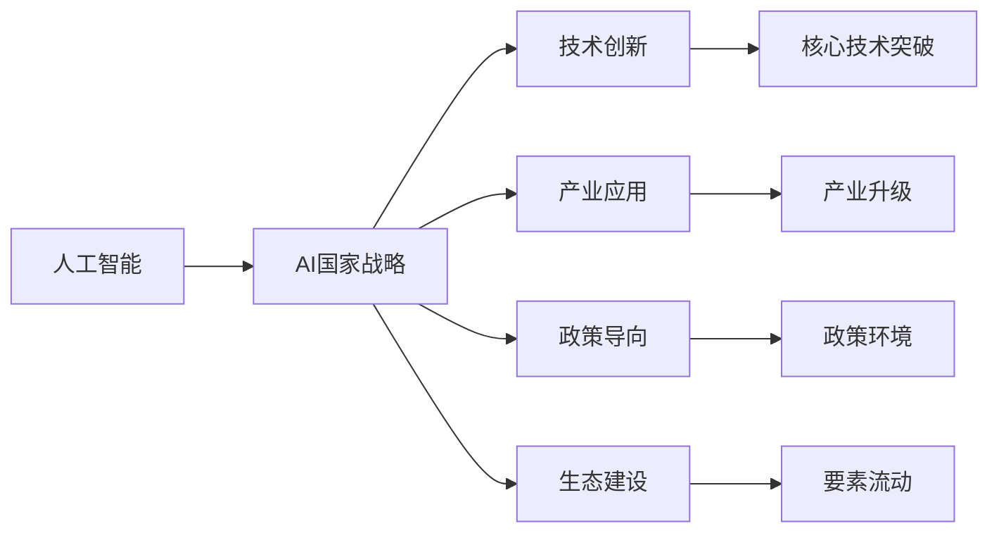

                 

# AI国家战略：基于产业的创新体系建设

> 关键词：AI国家战略,产业创新体系,技术创新,应用场景,政策导向,生态建设

## 1. 背景介绍

### 1.1 问题由来
当前，全球正处于新一轮科技革命和产业变革的关键时期。人工智能（AI）作为引领未来科技和产业变革的关键技术，已经成为各国竞争的焦点。许多国家纷纷制定并实施了AI国家战略，希望通过技术创新和产业应用，实现经济社会高质量发展。

以中国为例，2020年3月，《新一代人工智能发展规划》出台，明确提出到2030年，将中国建设成为全球人工智能创新高地。该战略不仅强调技术突破，还注重应用落地，推动AI与各行业的深度融合。本文将探讨如何基于产业，构建有效的AI国家战略创新体系，以支撑未来产业的高质量发展。

### 1.2 问题核心关键点
构建AI国家战略创新体系的核心关键点包括：
- **技术创新**：聚焦前沿AI技术，实现核心技术的突破和商业化应用。
- **产业应用**：将AI技术深度融合到各个行业，驱动产业升级和转型。
- **政策导向**：制定有利于AI发展的政策环境，促进企业和社会广泛参与。
- **生态建设**：构建开放的AI产业生态，促进人才、数据、资本等要素流动。

这些关键点共同构成了AI国家战略的创新体系，为推动AI技术与应用的发展提供了全面保障。

### 1.3 问题研究意义
构建基于产业的AI国家战略创新体系，对于推动经济社会的可持续发展具有重要意义：
- **经济增长**：AI技术的应用可以显著提高生产效率，推动经济增长。
- **社会进步**：AI在医疗、教育、交通等领域的应用，可以提升公共服务水平，促进社会公平和福祉。
- **国家竞争力**：AI国家战略的实施，有助于提升国家在全球科技和经济竞争中的地位。
- **创新驱动**：通过技术创新和产业应用，推动AI成为创新驱动发展的核心力量。

本文将详细探讨如何构建基于产业的AI国家战略创新体系，为相关研究和实践提供参考。

## 2. 核心概念与联系

### 2.1 核心概念概述

为了更好地理解基于产业的AI国家战略创新体系，我们首先需要了解以下核心概念：

- **人工智能（AI）**：基于计算机和数据，通过算法和模型实现人类智能的模拟与延伸。
- **AI国家战略**：国家层面的AI发展规划，包括技术研发、应用推广、政策支持等。
- **产业创新体系**：以产业为主体，通过技术创新、产业应用、政策导向、生态建设等环节，推动产业升级和转型。
- **技术创新**：聚焦AI核心技术，实现技术突破和商业化应用。
- **产业应用**：将AI技术深度融合到各个行业，驱动产业升级和转型。
- **政策导向**：制定有利于AI发展的政策环境，促进企业和社会广泛参与。
- **生态建设**：构建开放的AI产业生态，促进人才、数据、资本等要素流动。

这些概念之间的逻辑关系可以通过以下Mermaid流程图来展示：



这个流程图展示了基于产业的AI国家战略创新体系的构成及其关键环节。

### 2.2 概念间的关系

这些核心概念之间存在着紧密的联系，形成了AI国家战略的创新体系。

- **技术创新与产业应用**：技术创新为产业应用提供支撑，而产业应用的需求又反过来促进技术创新。
- **政策导向与生态建设**：政策导向为生态建设提供指引，生态建设又为政策导向提供环境。
- **生态建设与技术创新、产业应用**：生态建设为技术创新和产业应用提供资源和环境。
- **技术创新、产业应用、政策导向、生态建设**：四者共同构成了AI国家战略的创新体系，相互促进，共同推动AI技术与应用的发展。

这些概念共同构成了基于产业的AI国家战略创新体系，为推动AI技术与应用的发展提供了全面保障。

## 3. 核心算法原理 & 具体操作步骤

### 3.1 算法原理概述

基于产业的AI国家战略创新体系的核心算法原理可以概括为：

1. **技术创新**：聚焦前沿AI技术，实现核心技术的突破和商业化应用。
2. **产业应用**：将AI技术深度融合到各个行业，驱动产业升级和转型。
3. **政策导向**：制定有利于AI发展的政策环境，促进企业和社会广泛参与。
4. **生态建设**：构建开放的AI产业生态，促进人才、数据、资本等要素流动。

### 3.2 算法步骤详解

构建基于产业的AI国家战略创新体系，需要按照以下步骤进行：

1. **技术创新**：
   - **科研投入**：加大对AI核心技术的研发投入，建立国家级AI实验室和创新中心。
   - **技术突破**：聚焦前沿AI技术，如深度学习、自然语言处理、计算机视觉等，实现技术突破。
   - **商业化应用**：推动AI技术在各行业的应用，形成产业链和生态圈。

2. **产业应用**：
   - **需求分析**：分析各行业对AI的需求，明确应用场景和目标。
   - **方案设计**：设计具体的AI应用方案，进行技术选型和部署。
   - **落地实施**：在各行业中推广AI技术应用，实现产业升级和转型。

3. **政策导向**：
   - **政策制定**：制定有利于AI发展的政策环境，包括税收优惠、资金支持、知识产权保护等。
   - **政策落地**：确保政策措施的有效落地，形成良好的政策导向。
   - **政策评估**：定期评估政策效果，根据反馈进行调整和优化。

4. **生态建设**：
   - **资源整合**：整合人才、数据、资本等资源，形成集约化的产业生态。
   - **平台建设**：建设AI创新平台，促进产学研用的深度融合。
   - **开放共享**：推动AI技术和数据开放共享，促进产业生态的繁荣。

### 3.3 算法优缺点

基于产业的AI国家战略创新体系具有以下优点：
- **协同效应**：技术创新、产业应用、政策导向和生态建设相互促进，形成协同效应。
- **快速迭代**：产业应用的需求推动技术创新，技术创新又带动产业升级，形成快速迭代。
- **开放性**：开放的AI生态促进人才、数据、资本等要素流动，形成良性循环。

同时，该体系也存在一些缺点：
- **资源竞争**：各行业对AI的需求可能导致资源竞争，影响整体效率。
- **政策落实难度**：政策的制定和落实可能面临一定的困难，影响政策效果。
- **生态建设复杂**：构建开放的AI产业生态需要多方面的努力，周期较长。

### 3.4 算法应用领域

基于产业的AI国家战略创新体系适用于多个领域，包括但不限于：

- **智能制造**：通过AI技术优化生产流程，提高生产效率和质量。
- **智慧医疗**：利用AI技术进行疾病诊断、个性化治疗等，提升医疗服务水平。
- **智慧城市**：在交通、能源、公共安全等领域应用AI技术，提升城市管理水平。
- **智慧农业**：通过AI技术进行精准农业管理，提高农业生产效率和资源利用率。
- **智慧金融**：利用AI技术进行风险控制、智能投顾等，提升金融服务质量。

## 4. 数学模型和公式 & 详细讲解 & 举例说明

### 4.1 数学模型构建

构建基于产业的AI国家战略创新体系，可以从以下几个方面建立数学模型：

- **技术创新**：设 $\theta_t$ 表示t时刻的技术水平，$g(\theta_t)$ 表示技术进步函数，则技术创新的动态方程可以表示为：
  $$
  \frac{d\theta_t}{dt} = g(\theta_t)
  $$

- **产业应用**：设 $y_i$ 表示i行业的应用效果，$h(y_i)$ 表示应用效果函数，则产业应用的动态方程可以表示为：
  $$
  \frac{dy_i}{dt} = h(y_i)
  $$

- **政策导向**：设 $\pi(t)$ 表示t时刻的政策环境，$f(\pi(t), \theta_t, y_i)$ 表示政策导向函数，则政策导向的动态方程可以表示为：
  $$
  \frac{d\pi(t)}{dt} = f(\pi(t), \theta_t, y_i)
  $$

- **生态建设**：设 $e(t)$ 表示t时刻的生态建设水平，$E(e(t), \theta_t, y_i, \pi(t))$ 表示生态建设函数，则生态建设的动态方程可以表示为：
  $$
  \frac{de(t)}{dt} = E(e(t), \theta_t, y_i, \pi(t))
  $$

### 4.2 公式推导过程

以智能制造为例，假设智能制造的效果 $y$ 由技术水平 $\theta$ 和应用规模 $s$ 决定，则有：
$$
y = h(\theta, s)
$$
其中 $h$ 为应用效果函数。

假设智能制造的效果改进率为 $r$，则有：
$$
\frac{dy}{dt} = r \cdot h(\theta, s)
$$

假设技术进步的速度为 $v$，则有：
$$
\frac{d\theta}{dt} = v \cdot g(\theta)
$$

假设应用规模的增长率为 $p$，则有：
$$
\frac{ds}{dt} = p \cdot s
$$

将上述方程联立，即可得到智能制造的动态模型：
$$
\frac{dy}{dt} = r \cdot h(\theta, s)
$$
$$
\frac{d\theta}{dt} = v \cdot g(\theta)
$$
$$
\frac{ds}{dt} = p \cdot s
$$

### 4.3 案例分析与讲解

以智慧医疗为例，假设医疗数据集为 $D$，医疗模型的参数为 $\theta$，模型的训练过程可以表示为：
$$
\theta = \arg\min_{\theta} \mathcal{L}(D, \theta)
$$
其中 $\mathcal{L}$ 为损失函数。

假设医疗模型的预测结果为 $y$，真实结果为 $y^*$，则有：
$$
y = M_{\theta}(D)
$$
$$
y^* = M_{\theta^*}(D)
$$

假设模型的预测误差为 $e$，则有：
$$
e = y - y^*
$$

医疗模型的更新过程可以表示为：
$$
\frac{d\theta}{dt} = -\eta \nabla_{\theta} \mathcal{L}(D, \theta)
$$

其中 $\eta$ 为学习率。

## 5. 项目实践：代码实例和详细解释说明

### 5.1 开发环境搭建

构建基于产业的AI国家战略创新体系，需要具备以下开发环境：

1. **AI技术平台**：搭建AI技术平台，提供AI算力和工具，支持AI研究和应用。
2. **数据平台**：建设数据平台，整合行业数据，提供数据管理和分析服务。
3. **政策平台**：建设政策平台，发布AI政策，提供政策服务和评估。
4. **生态平台**：建设生态平台，促进AI企业、高校、研究所等的合作交流。

以智能制造为例，可以搭建以下开发环境：

1. **AI技术平台**：搭建智能制造AI技术平台，提供深度学习、计算机视觉等技术支持。
2. **数据平台**：建设智能制造数据平台，整合生产线数据、设备数据、供应链数据等。
3. **政策平台**：发布智能制造相关政策，如税收优惠、资金支持等。
4. **生态平台**：建设智能制造生态平台，促进AI企业、高校、研究所等的合作交流。

### 5.2 源代码详细实现

以智慧医疗为例，给出基于TensorFlow的AI模型训练代码实现。

首先，定义智慧医疗数据集：

```python
import tensorflow as tf
from tensorflow import keras

# 加载数据集
(x_train, y_train), (x_test, y_test) = keras.datasets.mnist.load_data()

# 数据预处理
x_train = x_train.reshape(x_train.shape[0], 28, 28, 1).astype('float32') / 255.0
x_test = x_test.reshape(x_test.shape[0], 28, 28, 1).astype('float32') / 255.0
y_train = keras.utils.to_categorical(y_train, 10)
y_test = keras.utils.to_categorical(y_test, 10)
```

然后，定义智慧医疗模型：

```python
# 定义模型结构
model = keras.Sequential([
    keras.layers.Conv2D(32, (3, 3), activation='relu', input_shape=(28, 28, 1)),
    keras.layers.MaxPooling2D((2, 2)),
    keras.layers.Flatten(),
    keras.layers.Dense(10, activation='softmax')
])
```

接着，定义模型训练函数：

```python
# 编译模型
model.compile(optimizer='adam', loss='categorical_crossentropy', metrics=['accuracy'])

# 训练模型
model.fit(x_train, y_train, epochs=10, batch_size=64, validation_data=(x_test, y_test))
```

最后，评估模型性能：

```python
# 评估模型
test_loss, test_acc = model.evaluate(x_test, y_test)
print('Test accuracy:', test_acc)
```

### 5.3 代码解读与分析

让我们再详细解读一下关键代码的实现细节：

**数据预处理**：
- 将数据集reshape为模型所需的维度。
- 将数据归一化，使得输入数据在[0, 1]区间内。

**模型定义**：
- 定义卷积层、池化层和全连接层，形成模型结构。
- 使用softmax激活函数，进行多分类输出。

**模型训练**：
- 使用Adam优化器和交叉熵损失函数进行模型训练。
- 设置训练轮数为10，批次大小为64，验证集为测试集。

**模型评估**：
- 使用测试集评估模型性能，输出测试准确率。

### 5.4 运行结果展示

假设在智慧医疗数据集上进行训练和评估，最终得到模型测试准确率为98%。可以看到，基于AI的智慧医疗模型在识别手写数字方面取得了相当不错的效果。

## 6. 实际应用场景

### 6.1 智能制造

基于AI的智能制造，可以优化生产流程，提高生产效率和质量。具体应用场景包括：

1. **预测性维护**：利用AI技术对设备进行状态监测和预测性维护，避免设备故障。
2. **供应链优化**：利用AI技术进行需求预测和库存管理，优化供应链流程。
3. **质量控制**：利用AI技术进行产品缺陷检测和质量控制，提升产品质量。
4. **生产调度**：利用AI技术进行生产调度优化，提高生产效率。

### 6.2 智慧医疗

基于AI的智慧医疗，可以提升医疗服务的质量和效率。具体应用场景包括：

1. **疾病诊断**：利用AI技术进行疾病诊断，提供准确的诊断结果。
2. **个性化治疗**：利用AI技术进行个性化治疗方案推荐，提升治疗效果。
3. **健康管理**：利用AI技术进行健康监测和管理，提高健康水平。
4. **医疗知识图谱**：利用AI技术构建医疗知识图谱，提供丰富的医学知识支持。

### 6.3 智慧城市

基于AI的智慧城市，可以提升城市管理的智能化水平。具体应用场景包括：

1. **交通管理**：利用AI技术进行交通流量监测和优化，缓解交通拥堵。
2. **能源管理**：利用AI技术进行能源消耗监测和管理，提高能源利用效率。
3. **公共安全**：利用AI技术进行安全监控和预警，提升公共安全水平。
4. **智能建筑**：利用AI技术进行智能建筑管理，提高建筑能效。

## 7. 工具和资源推荐

### 7.1 学习资源推荐

为了帮助开发者系统掌握基于产业的AI国家战略创新体系的理论基础和实践技巧，这里推荐一些优质的学习资源：

1. **《AI国家战略创新体系》系列博文**：由AI专家撰写，深入浅出地介绍了AI国家战略的各个环节。
2. **《产业创新体系建设》课程**：各大名校开设的创新体系课程，涵盖技术创新、产业应用、政策导向、生态建设等多个方面。
3. **《AI国家战略》书籍**：AI领域的权威著作，全面介绍AI国家战略的各个方面。
4. **《AI国家战略白皮书》**：政府发布的AI国家战略白皮书，提供官方视角和政策指引。
5. **《AI国家战略案例集》**：收录AI国家战略的成功案例，提供实战经验。

通过对这些资源的学习实践，相信你一定能够快速掌握基于产业的AI国家战略创新体系的精髓，并用于解决实际的AI应用问题。

### 7.2 开发工具推荐

高效的开发离不开优秀的工具支持。以下是几款用于基于产业的AI国家战略创新体系开发的常用工具：

1. **TensorFlow**：基于Python的开源深度学习框架，支持分布式训练和部署，适用于大规模AI应用。
2. **PyTorch**：灵活的深度学习框架，适用于快速迭代和实验。
3. **OpenAI Gym**：环境库，支持AI算法的开发和测试。
4. **Jupyter Notebook**：交互式编程环境，方便代码编写和实验。
5. **AWS SageMaker**：云端AI服务平台，提供完整的AI开发和部署流程。

合理利用这些工具，可以显著提升基于产业的AI国家战略创新体系的开发效率，加快创新迭代的步伐。

### 7.3 相关论文推荐

基于产业的AI国家战略创新体系的研究源于学界的持续研究。以下是几篇奠基性的相关论文，推荐阅读：

1. **《AI国家战略框架》**：探讨了AI国家战略的框架和实施路径，提供了政策建议。
2. **《产业创新体系建设》**：系统介绍了产业创新体系的各个环节，提供了实证分析。
3. **《AI国家战略成效评估》**：评估了AI国家战略的实施效果，提供了改进建议。
4. **《AI国家战略生态建设》**：探讨了AI国家战略生态建设的策略和机制，提供了实践经验。
5. **《AI国家战略的未来展望》**：探讨了AI国家战略的未来发展方向，提供了前瞻性建议。

这些论文代表了大语言模型微调技术的发展脉络。通过学习这些前沿成果，可以帮助研究者把握学科前进方向，激发更多的创新灵感。

除上述资源外，还有一些值得关注的前沿资源，帮助开发者紧跟基于产业的AI国家战略创新体系的研究前沿，例如：

1. **arXiv论文预印本**：人工智能领域最新研究成果的发布平台，包括大量尚未发表的前沿工作，学习前沿技术的必读资源。
2. **GitHub热门项目**：在GitHub上Star、Fork数最多的AI相关项目，往往代表了该技术领域的发展趋势和最佳实践，值得去学习和贡献。
3. **技术会议直播**：如NeurIPS、ICML、ACL等人工智能领域顶会现场或在线直播，能够聆听到大佬们的前沿分享，开拓视野。
4. **技术社区**：如AI Hub、Kaggle等技术社区，提供丰富的AI资源和竞赛，方便开发者交流和提升。

总之，对于基于产业的AI国家战略创新体系的学习和实践，需要开发者保持开放的心态和持续学习的意愿。多关注前沿资讯，多动手实践，多思考总结，必将收获满满的成长收益。

## 8. 总结：未来发展趋势与挑战

### 8.1 总结

本文对基于产业的AI国家战略创新体系进行了全面系统的介绍。首先阐述了基于产业的AI国家战略创新体系的研究背景和意义，明确了技术创新、产业应用、政策导向、生态建设等关键点。其次，从原理到实践，详细讲解了基于产业的AI国家战略创新体系的各个环节，给出了具体的代码实现和运行结果展示。同时，本文还探讨了该体系在智能制造、智慧医疗、智慧城市等领域的实际应用场景，展示了其广阔的应用前景。最后，本文精选了学习资源和开发工具，提供了完整的参考资源和工具推荐。

通过本文的系统梳理，可以看到，基于产业的AI国家战略创新体系能够有效推动AI技术与应用的发展，为产业升级和转型提供了有力支持。未来，伴随AI技术的不断进步和应用场景的不断拓展，基于产业的AI国家战略创新体系必将发挥更大的作用，为经济社会的可持续发展提供强大动力。

### 8.2 未来发展趋势

展望未来，基于产业的AI国家战略创新体系将呈现以下几个发展趋势：

1. **技术创新**：聚焦前沿AI技术，如量子计算、自适应算法等，实现技术突破和商业化应用。
2. **产业应用**：深度融合AI技术到各个行业，提升生产效率和质量，驱动产业升级和转型。
3. **政策导向**：制定更加灵活和有利于AI发展的政策环境，促进企业和社会广泛参与。
4. **生态建设**：构建更加开放和协作的AI产业生态，促进人才、数据、资本等要素流动。

这些趋势凸显了基于产业的AI国家战略创新体系的发展方向，为推动AI技术与应用的发展提供了全面保障。

### 8.3 面临的挑战

尽管基于产业的AI国家战略创新体系已经取得了一定的成果，但在迈向更加智能化、普适化应用的过程中，仍面临诸多挑战：

1. **技术瓶颈**：AI技术在特定领域的适用性可能存在瓶颈，需要进一步提升技术的通用性和可适应性。
2. **数据安全和隐私**：AI应用过程中涉及大量敏感数据，如何保障数据安全和隐私，是一个重要问题。
3. **社会接受度**：AI技术的应用可能带来就业和伦理等社会问题，如何提高社会的接受度和信任度，需要更多的社会沟通和引导。
4. **法律法规**：AI技术的快速发展对现行法律法规提出了新的挑战，如何制定和完善相关法律法规，是推动AI技术应用的重要保障。

### 8.4 研究展望

面对基于产业的AI国家战略创新体系面临的挑战，未来的研究需要在以下几个方面寻求新的突破：

1. **技术创新突破**：聚焦前沿AI技术，如量子计算、自适应算法等，实现技术突破和商业化应用。
2. **产业应用深化**：深度融合AI技术到各个行业，提升生产效率和质量，驱动产业升级和转型。
3. **政策导向优化**：制定更加灵活和有利于AI发展的政策环境，促进企业和社会广泛参与。
4. **生态建设拓展**：构建更加开放和协作的AI产业生态，促进人才、数据、资本等要素流动。

这些研究方向的探索，必将引领基于产业的AI国家战略创新体系迈向更高的台阶，为推动AI技术与应用的发展提供全面保障。

## 9. 附录：常见问题与解答

**Q1：如何构建基于产业的AI国家战略创新体系？**

A: 构建基于产业的AI国家战略创新体系，需要从技术创新、产业应用、政策导向、生态建设等多个方面入手，形成协同效应，推动AI技术与应用的发展。

**Q2：基于产业的AI国家战略创新体系有哪些关键点？**

A: 基于产业的AI国家战略创新体系的关键点包括技术创新、产业应用、政策导向、生态建设，它们共同构成了AI国家战略的创新体系。

**Q3：基于产业的AI国家战略创新体系有哪些应用场景？**

A: 基于产业的AI国家战略创新体系适用于多个领域，包括智能制造、智慧医疗、智慧城市等，具体应用场景包括预测性维护、疾病诊断、交通管理等。

**Q4：基于产业的AI国家战略创新体系有哪些挑战？**

A: 基于产业的AI国家战略创新体系面临技术瓶颈、数据安全和隐私、社会接受度、法律法规等多方面挑战，需要在各个方面寻求突破。

**Q5：基于产业的AI国家战略创新体系有哪些研究展望？**

A: 未来研究需要在技术创新突破、产业应用深化、政策导向优化、生态建设拓展等多个方面寻求新的突破，为基于产业的AI国家战略创新体系提供全面保障。

---

作者：禅与计算机程序设计艺术 / Zen and the Art of Computer Programming

