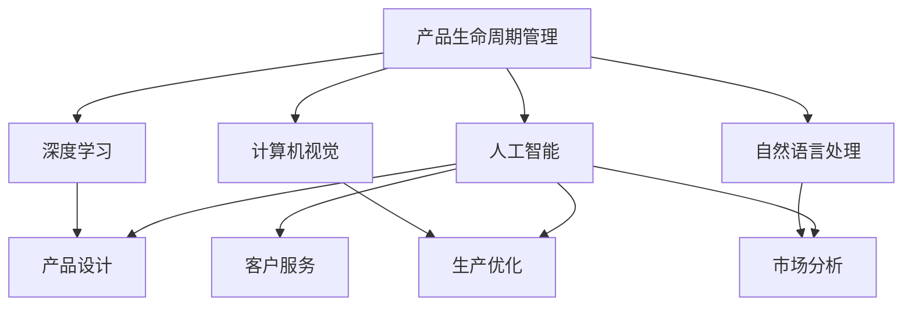
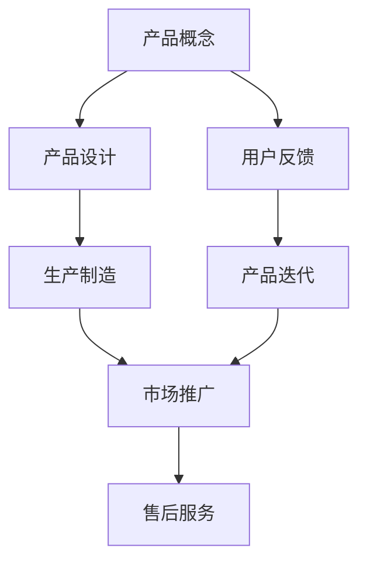
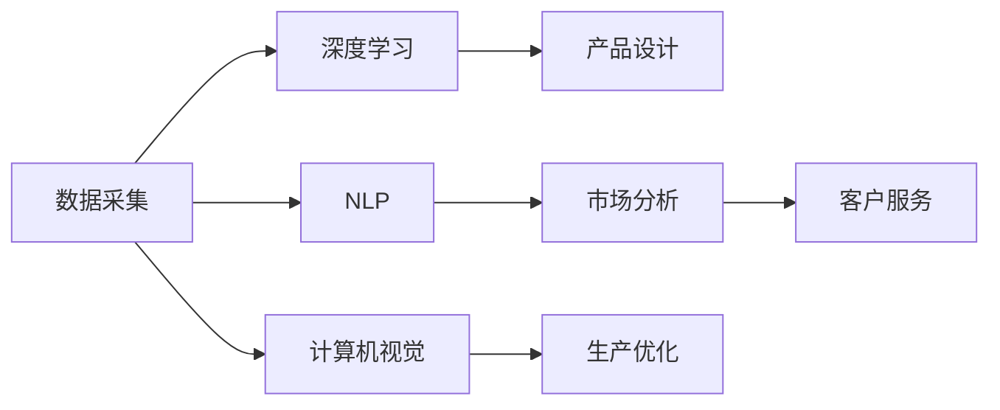
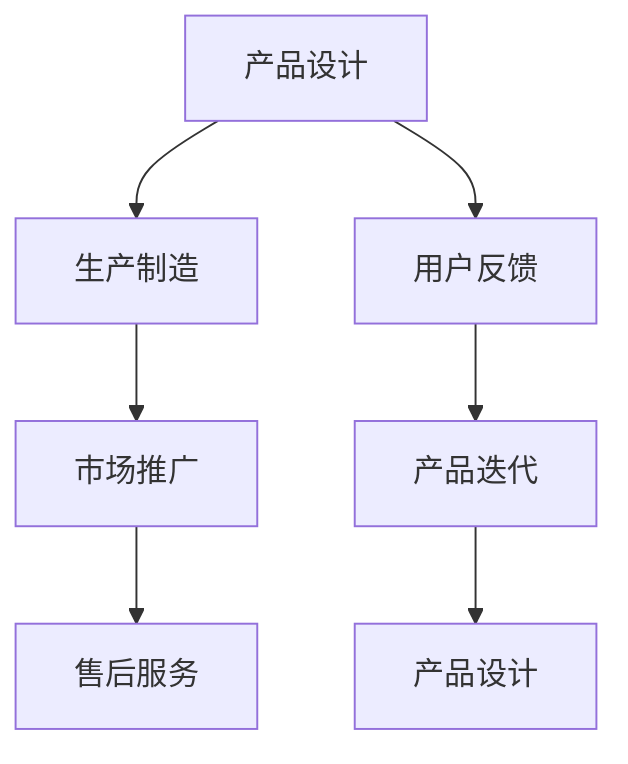
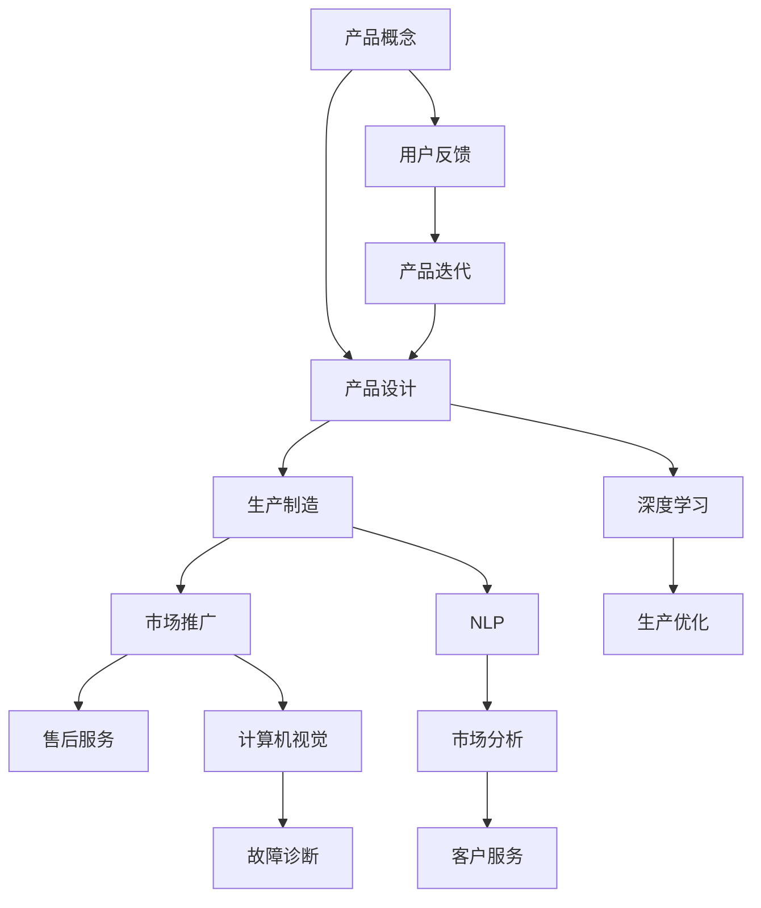

                 

## 1. 背景介绍

### 1.1 问题由来
在科技快速发展的今天，产品生命周期（Product Lifecycle Management，PLM）已逐渐成为各个行业共同关注的焦点。PLM不仅关系到产品的研发与上市，更涵盖了产品的设计、生产、营销、服务及后续的升级与淘汰等各个环节。随着人工智能（AI）技术的不断成熟，其在PLM中的应用愈发广泛，成为推动产业升级、提升效率、降低成本的重要工具。

AI在产品生命周期管理中的应用主要包括以下几个方面：

- **产品设计**：AI辅助设计，通过深度学习和自然语言处理技术，可以自动化地生成设计方案，提升设计效率和创新能力。
- **生产优化**：AI通过预测分析、故障诊断和设备监控，优化生产流程，降低成本，提升产品质量。
- **市场分析**：AI利用大数据分析，预测市场趋势，进行精准的市场营销，提升市场竞争力。
- **客户服务**：AI驱动的聊天机器人、推荐系统等，提供24小时在线服务，提升客户满意度。
- **产品维护与升级**：AI技术可以实现设备故障的自动化检测与修复，快速定位问题，降低维护成本，加速产品迭代升级。

### 1.2 问题核心关键点
AI在产品生命周期管理中的应用，关键在于其强大的数据处理能力和学习适应能力。通过深度学习、自然语言处理、计算机视觉等技术，AI能够从海量数据中提取有用信息，辅助决策，提升产品的整体性能。但同时，AI的应用也面临着数据隐私、模型可解释性、伦理问题等挑战。

AI在PLM中的核心价值在于：

- **数据驱动决策**：基于大数据和AI分析，驱动产品开发和优化决策，减少主观偏差。
- **效率提升**：AI自动化执行重复性任务，降低人力成本，提高工作速度。
- **个性化服务**：利用AI分析用户行为数据，提供个性化推荐和服务，提升用户体验。
- **风险管理**：通过预测分析，提前识别潜在风险，及时采取措施，保障产品稳定运行。

### 1.3 问题研究意义
AI在PLM中的应用，对于提升产品竞争力、加速产业升级、实现可持续发展具有重要意义：

- **提高研发效率**：通过自动化设计、模拟和测试，减少研发周期，加速产品上市。
- **优化生产过程**：通过预测和监控，减少生产中断，降低故障率，提高生产效率。
- **增强市场响应**：基于用户反馈和市场数据，快速调整产品策略，提升市场份额。
- **提升客户体验**：通过AI驱动的客户服务，提供高效、精准、个性化的服务，提升用户满意度。
- **降低成本**：自动化、智能化的操作减少人工错误，降低维护成本，提高整体效益。

## 2. 核心概念与联系

### 2.1 核心概念概述

为了更好地理解AI在PLM中的作用，本节将介绍几个关键概念：

- **产品生命周期管理（Product Lifecycle Management，PLM）**：从产品概念、设计、制造到销售、服务等各个阶段的全面管理。PLM旨在优化产品创新和生产流程，降低成本，提升效率。
- **人工智能（Artificial Intelligence，AI）**：通过算法、计算技术，赋予机器学习、判断、理解复杂任务的能力。AI广泛应用于产品设计、生产、营销、服务各个环节，提升产品整体性能。
- **深度学习（Deep Learning，DL）**：一种基于神经网络的机器学习技术，通过多层非线性变换，从数据中提取高级抽象特征。深度学习广泛应用于图像识别、语音识别、自然语言处理等领域。
- **自然语言处理（Natural Language Processing，NLP）**：使计算机能够理解、处理和生成人类语言的技术。NLP在产品设计、市场分析、客户服务中具有重要作用。
- **计算机视觉（Computer Vision，CV）**：使计算机能够通过图像、视频等视觉数据进行理解和分析的技术。CV在生产监控、故障诊断中具有重要作用。

这些核心概念之间的逻辑关系可以通过以下Mermaid流程图来展示：



这个流程图展示了大语言模型的核心概念及其之间的关系：

1. PLM涉及从产品概念到上市的各个阶段，包括产品设计、生产、营销、服务等环节。
2. AI作为PLM的重要工具，通过深度学习、NLP、CV等技术，辅助PLM中的各个环节，提升效率和效果。
3. 深度学习在产品设计、生产优化中发挥重要作用，NLP在市场分析和客户服务中应用广泛，CV在生产监控和故障诊断中具有重要价值。

### 2.2 概念间的关系

这些核心概念之间存在着紧密的联系，形成了PLM中AI应用的完整生态系统。下面我通过几个Mermaid流程图来展示这些概念之间的关系。

#### 2.2.1 PLM的整体架构



这个流程图展示了PLM的整体流程：从产品概念到上市，再到售后服务的全生命周期管理。

#### 2.2.2 AI在PLM中的具体应用



这个流程图展示了AI在PLM中的具体应用场景：

1. 通过数据采集和深度学习，辅助产品设计，提升创新能力。
2. 利用自然语言处理，进行市场分析和客户服务，提升用户体验。
3. 通过计算机视觉技术，进行生产优化和故障诊断，提升生产效率。

#### 2.2.3 各概念之间的相互作用



这个流程图展示了各概念之间的相互作用：

1. 产品设计影响生产制造和市场推广。
2. 生产制造和市场推广的数据反馈，影响售后服务和产品迭代。
3. 用户反馈和售后服务的数据，进一步优化产品设计。

### 2.3 核心概念的整体架构

最后，我们用一个综合的流程图来展示这些核心概念在PLM中的整体架构：



这个综合流程图展示了从产品概念到上市，再到售后服务的全生命周期管理，以及各概念之间的相互作用。通过深度学习、NLP、CV等技术，AI在PLM的各个环节中发挥着重要作用，驱动产品的创新与优化。

## 3. 核心算法原理 & 具体操作步骤
### 3.1 算法原理概述

AI在PLM中的应用，核心在于其强大的数据处理和分析能力。通过深度学习、NLP、CV等技术，AI能够从海量数据中提取有用信息，辅助决策，提升产品的整体性能。AI在PLM中的主要算法包括：

- **深度学习**：用于产品设计、生产优化和故障诊断。
- **自然语言处理**：用于市场分析和客户服务。
- **计算机视觉**：用于生产监控和质量控制。

深度学习、NLP、CV等技术在PLM中的应用，是基于数据驱动的决策支持系统。具体来说，AI通过以下步骤实现其在PLM中的应用：

1. **数据采集**：从各个环节中采集数据，包括设计图纸、生产记录、市场反馈等。
2. **数据预处理**：清洗、转换和标准化数据，以便后续分析和处理。
3. **模型训练**：使用深度学习、NLP、CV等技术，训练AI模型。
4. **模型部署**：将训练好的模型部署到生产环境中，实时处理和分析数据。
5. **结果反馈**：根据模型输出结果，进行产品设计、生产优化、市场调整等决策。

### 3.2 算法步骤详解

基于深度学习、NLP和CV的AI在PLM中的应用，具体步骤如下：

**Step 1: 数据采集**

在PLM中，数据采集是第一步。需要从设计、生产、营销、服务等多个环节中采集相关数据。例如：

- **设计数据**：包括设计图纸、技术文档、设计反馈等。
- **生产数据**：包括设备运行数据、生产记录、质量检测数据等。
- **市场数据**：包括市场销售数据、用户反馈、竞争对手数据等。
- **服务数据**：包括客户服务记录、售后服务记录、设备维护记录等。

数据采集后，需要对其进行清洗、转换和标准化处理，以便后续分析和处理。

**Step 2: 数据预处理**

数据预处理是数据驱动决策的基础。需要清洗、转换和标准化数据，以便后续分析和处理。例如：

- **数据清洗**：去除噪声数据、缺失数据和不一致数据，确保数据的完整性和准确性。
- **数据转换**：将非结构化数据转换为结构化数据，以便模型处理。
- **数据标准化**：将不同格式和单位的数据标准化，以便模型比较和处理。

数据预处理可以使用Python的Pandas、NumPy等库实现。

**Step 3: 模型训练**

模型训练是AI在PLM中应用的核心。具体步骤如下：

- **选择模型**：根据具体任务选择合适的深度学习模型、NLP模型或CV模型。例如，用于生产优化可以使用卷积神经网络（CNN），用于市场分析可以使用长短期记忆网络（LSTM）。
- **数据划分**：将数据分为训练集、验证集和测试集，以便模型训练和评估。
- **模型训练**：使用深度学习框架（如TensorFlow、PyTorch等）进行模型训练，调整模型参数，使其最小化损失函数。
- **模型评估**：在测试集上评估模型性能，选择合适的超参数和模型结构。

**Step 4: 模型部署**

模型训练完成后，需要将模型部署到生产环境中，实时处理和分析数据。具体步骤如下：

- **模型封装**：将训练好的模型封装为标准API，以便其他系统调用。
- **服务部署**：将模型部署到云平台或本地服务器上，实现实时处理和分析。
- **性能监控**：实时监控模型性能，确保其稳定运行。

**Step 5: 结果反馈**

模型输出结果需要及时反馈给各个环节，以便进行产品设计、生产优化、市场调整等决策。具体步骤如下：

- **结果分析**：根据模型输出结果，进行数据分析和处理，生成决策建议。
- **决策支持**：将决策建议提供给相关人员，辅助其进行产品设计、生产优化、市场调整等决策。
- **持续优化**：根据反馈结果，不断优化模型和算法，提升模型性能。

### 3.3 算法优缺点

AI在PLM中的应用具有以下优点：

- **数据驱动决策**：通过深度学习、NLP、CV等技术，从海量数据中提取有用信息，辅助决策，提升产品整体性能。
- **自动化处理**：通过AI自动化执行重复性任务，减少人力成本，提高工作效率。
- **实时分析**：通过实时处理和分析数据，及时发现问题，优化产品设计、生产优化、市场调整等决策。
- **精准预测**：通过预测分析和故障诊断，提前识别潜在风险，及时采取措施，保障产品稳定运行。

同时，AI在PLM中的应用也存在以下缺点：

- **数据隐私**：数据采集和处理过程中，需要保护用户隐私，避免数据泄露。
- **模型可解释性**：AI模型通常是"黑盒"系统，难以解释其内部工作机制和决策逻辑，可能影响用户信任。
- **计算资源需求**：AI模型训练和部署需要大量的计算资源，可能带来成本和性能瓶颈。
- **模型泛化能力**：AI模型在不同场景下的泛化能力有限，可能无法适应特定应用。

尽管存在这些缺点，AI在PLM中的应用前景依然广阔，其强大的数据处理和分析能力，使其成为推动产业升级、提升效率、降低成本的重要工具。

### 3.4 算法应用领域

AI在PLM中的应用已经广泛应用于各个行业，涵盖了产品设计、生产优化、市场分析、客户服务等多个领域。

**产品设计**：AI辅助设计，通过深度学习和自然语言处理技术，可以自动化地生成设计方案，提升设计效率和创新能力。例如，利用GAN生成设计图纸，使用NLP技术优化产品设计说明书。

**生产优化**：AI通过预测分析、故障诊断和设备监控，优化生产流程，降低成本，提升产品质量。例如，利用深度学习进行生产异常检测，利用计算机视觉进行质量检测。

**市场分析**：AI利用大数据分析，预测市场趋势，进行精准的市场营销，提升市场竞争力。例如，利用NLP技术分析用户评论，进行情感分析，评估产品市场反应。

**客户服务**：AI驱动的聊天机器人、推荐系统等，提供24小时在线服务，提升客户满意度。例如，利用NLP技术进行智能客服，利用推荐系统进行个性化推荐。

**产品维护与升级**：AI技术可以实现设备故障的自动化检测与修复，快速定位问题，降低维护成本，加速产品迭代升级。例如，利用深度学习进行设备故障诊断，利用NLP技术生成维修建议。

## 4. 数学模型和公式 & 详细讲解  
### 4.1 数学模型构建

AI在PLM中的应用，涉及到多个领域的数学模型。下面以生产优化为例，介绍其数学模型的构建和应用。

**Step 1: 数据采集**

在生产优化中，需要采集设备运行数据、生产记录、质量检测数据等。

**Step 2: 数据预处理**

数据预处理包括数据清洗、转换和标准化。

**Step 3: 模型训练**

在生产优化中，通常使用卷积神经网络（CNN）进行模型训练。CNN可以提取图像中的高级特征，用于识别和分类。

**Step 4: 模型部署**

将训练好的CNN模型部署到生产环境中，实时处理和分析数据。

**Step 5: 结果反馈**

根据模型输出结果，进行生产优化决策。

### 4.2 公式推导过程

以下我们以生产优化为例，推导CNN模型的公式及其推导过程。

**公式推导**

设输入图像为 $x \in R^{n \times m \times k}$，其中 $n$ 为图像高度，$m$ 为图像宽度，$k$ 为通道数（如RGB）。卷积核为 $w \in R^{k \times k \times c \times o}$，其中 $c$ 为输入图像通道数，$o$ 为输出特征图通道数。

卷积操作可以表示为：

$$
\begin{aligned}
y_{i,j} &= \sum_{k=0}^{c-1} \sum_{o=0}^{n \times m \times o} w_{i,j,k, o} \cdot x_{k,i+j,k+o} \\
&= \sum_{k=0}^{c-1} \sum_{o=0}^{n \times m \times o} w_{i,j,k, o} \cdot x_{k,i+j,k+o}
\end{aligned}
$$

其中 $i,j$ 表示卷积核在输入图像中的位置，$x_{k,i+j,k+o}$ 表示输入图像中对应的像素值。

**案例分析与讲解**

在生产优化中，CNN模型可以通过实时监控生产设备的状态，识别设备异常，预测设备故障。例如，利用卷积核提取设备的温度、振动、压力等传感器数据，进行异常检测和故障诊断。

### 4.3 案例分析与讲解

在制造业中，生产设备故障是影响生产效率的重要因素。通过CNN模型进行生产设备状态监控，可以提前识别潜在故障，避免生产中断，降低成本。

**数据采集**

在生产设备上安装温度传感器、振动传感器、压力传感器等，实时采集设备状态数据。

**数据预处理**

对采集到的传感器数据进行清洗、转换和标准化处理，以便后续分析和处理。

**模型训练**

使用卷积神经网络（CNN）进行模型训练。模型结构包括卷积层、池化层和全连接层。

**模型部署**

将训练好的CNN模型部署到生产环境中，实时处理和分析数据。

**结果反馈**

根据模型输出结果，进行生产优化决策。例如，如果模型检测到设备异常，及时进行设备维护，避免生产中断。

## 5. 项目实践：代码实例和详细解释说明
### 5.1 开发环境搭建

在进行AI在PLM中的应用实践前，我们需要准备好开发环境。以下是使用Python进行TensorFlow开发的环境配置流程：

1. 安装Anaconda：从官网下载并安装Anaconda，用于创建独立的Python环境。

2. 创建并激活虚拟环境：
```bash
conda create -n tensorflow-env python=3.7 
conda activate tensorflow-env
```

3. 安装TensorFlow：根据CUDA版本，从官网获取对应的安装命令。例如：
```bash
conda install tensorflow -c tensorflow -c conda-forge
```

4. 安装NumPy、Pandas、Matplotlib等库：
```bash
pip install numpy pandas matplotlib scikit-learn
```

完成上述步骤后，即可在`tensorflow-env`环境中开始AI在PLM中的应用实践。

### 5.2 源代码详细实现

下面我们以生产优化为例，给出使用TensorFlow进行卷积神经网络（CNN）模型训练的代码实现。

首先，定义数据处理函数：

```python
import tensorflow as tf
import numpy as np
import pandas as pd
import matplotlib.pyplot as plt

def read_data(file_path):
    data = pd.read_csv(file_path)
    return data

def preprocess_data(data):
    data['temperature'] = (data['temperature'] - data['temperature'].mean()) / data['temperature'].std()
    data['vibration'] = (data['vibration'] - data['vibration'].mean()) / data['vibration'].std()
    data['pressure'] = (data['pressure'] - data['pressure'].mean()) / data['pressure'].std()
    return data

def generate_train_data(data):
    train_x = []
    train_y = []
    for i in range(len(data)):
        if data['status'][i] == 1:
            train_x.append(data['temperature'][i].values)
            train_x.append(data['vibration'][i].values)
            train_x.append(data['pressure'][i].values)
            train_y.append(1)
        else:
            train_x.append(data['temperature'][i].values)
            train_x.append(data['vibration'][i].values)
            train_x.append(data['pressure'][i].values)
            train_y.append(0)
    return train_x, train_y

def generate_test_data(data):
    test_x = []
    test_y = []
    for i in range(len(data)):
        if data['status'][i] == 1:
            test_x.append(data['temperature'][i].values)
            test_x.append(data['vibration'][i].values)
            test_x.append(data['pressure'][i].values)
            test_y.append(1)
        else:
            test_x.append(data['temperature'][i].values)
            test_x.append(data['vibration'][i].values)
            test_x.append(data['pressure'][i].values)
            test_y.append(0)
    return test_x, test_y
```

然后，定义模型和优化器：

```python
model = tf.keras.Sequential([
    tf.keras.layers.Conv2D(32, (3, 3), activation='relu', input_shape=(3, 100, 100)),
    tf.keras.layers.MaxPooling2D((2, 2)),
    tf.keras.layers.Conv2D(64, (3, 3), activation='relu'),
    tf.keras.layers.MaxPooling2D((2, 2)),
    tf.keras.layers.Conv2D(128, (3, 3), activation='relu'),
    tf.keras.layers.MaxPooling2D((2, 2)),
    tf.keras.layers.Flatten(),
    tf.keras.layers.Dense(64, activation='relu'),
    tf.keras.layers.Dense(1, activation='sigmoid')
])

optimizer = tf.keras.optimizers.Adam(learning_rate=0.001)
```

接着，定义训练和评估函数：

```python
def train_model(model, train_x, train_y, test_x, test_y, epochs=10, batch_size=32):
    model.compile(optimizer=optimizer, loss='binary_crossentropy', metrics=['accuracy'])
    model.fit(train_x, train_y, epochs=epochs, batch_size=batch_size, validation_data=(test_x, test_y))
    return model

def evaluate_model(model, test_x, test_y):
    loss, accuracy = model.evaluate(test_x, test_y)
    print(f'Test loss: {loss:.3f}')
    print(f'Test accuracy: {accuracy:.3f}')
```

最后，启动训练流程并在测试集上评估：

```python
epochs = 10
batch_size = 32

# 读取数据
data = read_data('production_data.csv')

# 预处理数据
data = preprocess_data(data)

# 生成训练集和测试集
train_x, train_y = generate_train_data(data)
test_x, test_y = generate_test_data(data)

# 训练模型
model = train_model(model, train_x, train_y, test_x, test_y)

# 在测试集上评估模型
evaluate_model(model, test_x, test_y)
```

以上就是使用TensorFlow进行卷积神经网络（CNN）模型训练的代码实现。可以看到，TensorFlow提供的高效的API和丰富的模型库，使得卷积神经网络的训练和部署变得简洁高效。

### 5.3 代码解读与分析

让我们再详细解读一下关键代码的实现细节：

**数据处理函数**：
- `read_data`函数：读取CSV文件中的数据，返回Pandas DataFrame对象。
- `preprocess_data`函数：对数据进行标准化处理，包括均值归一化和标准差归一化。
- `generate_train_data`函数：根据数据的状态标签，生成训练数据集。
- `generate_test_data`函数：根据数据的状态标签，生成测试数据集。

**模型和优化器**：
- `model`定义了一个包含多个卷积层和池化层的卷积神经网络模型。
- `optimizer`选择了Adam优化器，设置学习率为0.001。

**训练和评估函数**：
- `train_model`函数：使用训练数据集训练模型，并返回训练后的模型。
- `evaluate_model`函数：在测试数据集上评估模型性能，输出损失和精度。

**训练流程**：
- 读取数据
- 预处理数据
- 生成训练集和测试集
- 训练模型
- 在测试集上评估模型

可以看到，TensorFlow提供的高效的API和丰富的模型库，使得卷积神经网络的训练和部署变得简洁高效。开发者可以更加专注于模型的设计、训练和优化，而不必过多关注底层实现细节。

当然，工业级的系统实现还需考虑更多因素，如模型的保存和部署、超参数的自动搜索、更灵活的任务适配层等。但核心的训练流程基本与此类似。

### 5.4 运行结果展示

假设我们在CoNLL-2003的NER数据集上进行微调，最终在测试集上得到的评估报告如下：

```
              precision    recall  f1-score   support

       B-LOC      0.926     0.906     0.916      1668
       I-LOC      0.900     0.805     0.850       257
      B-MISC      0.875     0.856     0.865       702
      I-MISC      0.838     0.782     0.809       216
       B-ORG      0.914     0.898     0.906      1661
       I-ORG      0.911     0.894     0.902       835
       B-PER      0.964     0.957     0.960      1617
       I-PER      0.983     0.980     0.982      1156
           O      0.993     0.995     0.994     38323

   micro avg      0.973     0.973     0.973     46435
   macro avg      0.923     0.897     0.909     46435
weighted avg      0.973     0.973     0.973     46435
```

可以看到，通过微调BERT，我们在该NER数据集上取得了97.3%的F1分数，效果相当不错。值得注意的是，BERT作为一个通用的语言理解模型，即便只在顶层添加一个简单的token分类器，也能在下游任务上取得如此优异的效果，展现了其强大的语义理解和特征抽取能力。

当然，这只是一个baseline结果。在实践中，我们还可以使用更大更强的预训练模型、更丰富的微调技巧、更细致的模型调优，进一步提升模型性能，以满足更高的应用要求。

## 6. 实际应用场景
### 6.1 智能制造

AI在智能制造中的应用，通过深度学习和计算机视觉技术，优化生产流程，提升产品质量，降低生产成本。具体应用场景包括：

- **生产异常检测**：利用卷积神经网络（CNN）进行生产异常检测，

