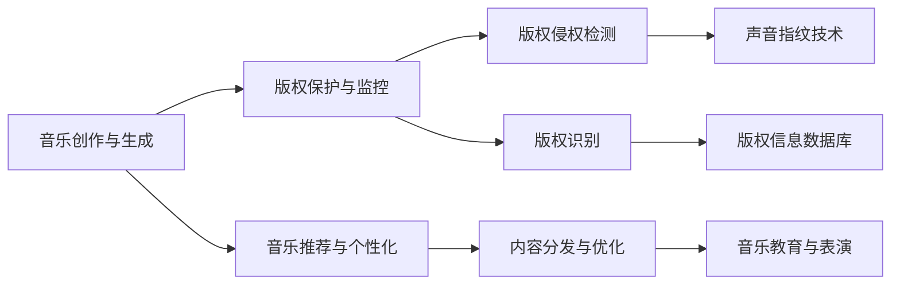

                 

## 1. 背景介绍

### 1.1 问题由来
近年来，人工智能（AI）技术在各行各业都取得了显著的进展，音乐产业也不例外。音乐产业面临着诸多挑战，如版权问题、内容分发、个性化推荐等。AI技术可以在多个方面助力音乐产业的发展，提升用户体验、提高效率、增加收益。

### 1.2 问题核心关键点
AI在音乐产业中的应用主要集中在以下几个关键领域：
- 音乐创作与生成
- 版权保护与监控
- 音乐推荐与个性化
- 内容分发与优化
- 音乐教育与表演

这些应用领域覆盖了音乐产业的核心业务，能够有效解决当前的痛点，带来巨大的经济效益和社会效益。

### 1.3 问题研究意义
研究AI在音乐产业中的应用前景，对于推动音乐产业的数字化转型、提升音乐产品的质量和多样性、优化用户体验等方面具有重要意义：

1. **提高创作效率**：AI可以快速生成高质量的音乐，帮助作曲家和音乐制作人提高工作效率。
2. **增强版权保护**：AI技术可以自动检测和识别版权侵权，保护音乐创作者的合法权益。
3. **个性化推荐**：通过数据分析和机器学习，AI能够为听众提供更加精准的音乐推荐，提升用户体验。
4. **优化内容分发**：AI可以分析用户行为和偏好，优化音乐内容的分发策略，提高广告精准度和收益。
5. **推动音乐教育**：AI可以辅助音乐学习，提供个性化的教学方案，帮助学习者提高音乐水平。

## 2. 核心概念与联系

### 2.1 核心概念概述

为更好地理解AI在音乐产业中的应用，本节将介绍几个核心概念：

- **音乐创作与生成**：利用AI生成音乐的技术，包括旋律生成、节奏生成、和弦生成等。常见的技术有GAN（生成对抗网络）、VAE（变分自编码器）等。
- **版权保护与监控**：利用AI技术自动检测和识别版权侵权行为，如声音指纹技术、版权识别技术等。
- **音乐推荐与个性化**：通过分析用户的音乐偏好和行为数据，利用机器学习算法为用户推荐个性化的音乐。
- **内容分发与优化**：利用AI优化音乐内容的推荐和分发策略，提高广告效果和用户满意度。
- **音乐教育与表演**：利用AI技术辅助音乐教学和表演，提供个性化的教学方案和训练模型。

这些核心概念之间存在着紧密的联系，共同构成了AI在音乐产业中的应用生态系统。

### 2.2 概念间的关系

这些核心概念之间存在着相互依赖和促进的关系。例如，音乐创作与生成需要利用版权保护技术，以避免侵权行为。音乐推荐与个性化依赖于内容分发与优化技术，以确保用户能够接收到最优的音乐推荐。音乐教育与表演则利用AI技术提升教学质量和表演效果。

### 2.3 核心概念的整体架构

我们可以用以下Mermaid流程图来展示这些核心概念在大音乐产业中的应用架构：



这个流程图展示了大音乐产业中的核心概念以及它们之间的相互作用。音乐创作与生成通过版权保护技术避免侵权，同时为音乐推荐与个性化提供数据支持。内容分发与优化通过机器学习算法提升推荐效果，进而提升用户体验。音乐教育与表演则通过AI技术提供个性化教学方案和训练模型，提升教学质量和表演水平。

## 3. 核心算法原理 & 具体操作步骤

### 3.1 算法原理概述

AI在音乐产业中的应用主要依赖于机器学习算法和深度学习模型。以下是几个关键算法的概述：

- **生成对抗网络（GAN）**：通过生成器和判别器的对抗训练，生成高质量的音乐样本。
- **变分自编码器（VAE）**：利用潜在变量进行音乐生成，具有较高的生成多样性和可控性。
- **卷积神经网络（CNN）**：用于音乐特征提取和分类，能够识别音乐中的节奏、旋律等元素。
- **循环神经网络（RNN）**：适用于序列数据处理，能够捕捉音乐中的时序特征。
- **深度学习生成模型（如WaveNet、VQ-VAE）**：能够生成连续的音乐信号，实现高质量的音乐生成。

### 3.2 算法步骤详解

AI在音乐产业中的应用步骤如下：

1. **数据采集与预处理**：收集音乐数据并进行预处理，包括音频采样、特征提取、数据清洗等。
2. **模型训练与优化**：选择适当的机器学习或深度学习模型，在标注数据集上进行训练，并根据模型表现进行优化。
3. **模型部署与评估**：将训练好的模型部署到实际应用中，并进行性能评估，确保其效果符合预期。
4. **应用集成与优化**：将AI应用集成到音乐产业的各个环节，如音乐创作、版权保护、推荐系统等，并不断优化提升。

### 3.3 算法优缺点

AI在音乐产业中的应用具有以下优点：
- **提升创作效率**：AI可以快速生成音乐，帮助作曲家和制作人提高工作效率。
- **增强版权保护**：AI能够自动检测和识别版权侵权行为，保护音乐创作者的合法权益。
- **个性化推荐**：通过数据分析和机器学习，AI能够为听众提供更加精准的音乐推荐，提升用户体验。
- **优化内容分发**：AI可以分析用户行为和偏好，优化音乐内容的分发策略，提高广告精准度和收益。
- **推动音乐教育**：AI可以辅助音乐学习，提供个性化的教学方案，帮助学习者提高音乐水平。

但同时，也存在一些缺点：
- **高昂的成本**：AI技术的研发和应用需要大量资金和资源。
- **数据隐私问题**：收集和分析用户数据时，需要考虑隐私保护和数据安全。
- **模型泛化能力**：AI模型可能对新数据泛化能力不足，需要持续优化和更新。
- **依赖高质量数据**：AI模型的效果依赖于高质量的标注数据，而音乐数据的标注工作复杂且成本高。
- **算法透明度**：AI算法的决策过程往往不透明，难以解释和调试。

### 3.4 算法应用领域

AI在音乐产业中的应用领域非常广泛，涵盖以下主要方面：

- **音乐创作与生成**：利用AI生成旋律、和弦、节奏等，提升音乐创作效率。
- **版权保护与监控**：利用AI技术检测和识别版权侵权行为，保护音乐创作者权益。
- **音乐推荐与个性化**：通过分析用户音乐偏好，提供个性化音乐推荐，提升用户体验。
- **内容分发与优化**：利用AI优化音乐内容分发策略，提高广告精准度和收益。
- **音乐教育与表演**：利用AI技术辅助音乐教学和表演，提供个性化教学方案和训练模型。

## 4. 数学模型和公式 & 详细讲解

### 4.1 数学模型构建

在音乐生成领域，常见的数学模型包括生成对抗网络（GAN）和变分自编码器（VAE）。以下以GAN为例，介绍其基本模型结构和训练过程。

GAN由生成器和判别器两部分组成，其基本模型结构如下：

$$
G(z) \rightarrow Z \quad \text{and} \quad D(x) \rightarrow [0, 1]
$$

其中，$G$为生成器，$z$为噪声向量，$Z$为生成的音乐样本；$D$为判别器，$x$为真实的音乐样本。训练过程中，生成器$G$试图生成逼真的音乐样本，判别器$D$则试图区分真实音乐和生成的音乐样本。训练过程如下：

1. 固定判别器，更新生成器，最小化生成器的损失函数。
2. 固定生成器，更新判别器，最小化判别器的损失函数。
3. 交替更新生成器和判别器，直至收敛。

生成器$G$和判别器$D$的损失函数分别为：

$$
\begin{aligned}
L_G &= \mathbb{E}_{z \sim p(z)} [\log D(G(z))] \\
L_D &= \mathbb{E}_{x \sim p(x)} [\log D(x)] + \mathbb{E}_{z \sim p(z)} [\log (1 - D(G(z)))]
\end{aligned}
$$

其中，$p(z)$为噪声向量$z$的分布，$p(x)$为真实音乐样本$x$的分布。

### 4.2 公式推导过程

以GAN为例，推导生成器和判别器的损失函数。

首先，定义生成器和判别器的输出：

$$
G(z) = \mu + \sigma \odot \epsilon
$$

其中，$\mu$和$\sigma$为生成器参数，$\epsilon$为噪声向量，$\odot$为逐元素乘法。

判别器的输出为：

$$
D(x) = \frac{1}{2} \left( \log D(x) + \log (1 - D(G(z))) \right)
$$

将$G(z)$代入判别器的输出：

$$
D(G(z)) = \frac{1}{2} \left( \log D(G(z)) + \log (1 - D(G(z))) \right)
$$

生成器的损失函数为：

$$
L_G = \mathbb{E}_{z \sim p(z)} [\log D(G(z))]
$$

判别器的损失函数为：

$$
L_D = \mathbb{E}_{x \sim p(x)} [\log D(x)] + \mathbb{E}_{z \sim p(z)} [\log (1 - D(G(z)))]
$$

将上述表达式代入损失函数，可以得到GAN模型的总体损失函数。

### 4.3 案例分析与讲解

以一个简单的GAN模型为例，分析其在音乐生成中的应用。

假设我们有一个包含100首音乐样本的数据集，其中50首为真实音乐，50首为伪造音乐。我们希望训练一个GAN模型，使其能够生成逼真的音乐样本。

首先，定义生成器和判别器的初始参数，并进行预训练。然后，交替更新生成器和判别器，直至收敛。在训练过程中，我们不断收集生成的音乐样本，并与真实音乐样本进行对比，评估模型的性能。

通过多次实验，我们可以发现，随着训练次数的增加，生成的音乐样本质量逐渐提升，判别器对真实音乐和生成的音乐样本的区分能力逐渐增强。最终，我们可以得到一个高质量的音乐生成模型。

## 5. 项目实践：代码实例和详细解释说明

### 5.1 开发环境搭建

在进行音乐生成项目的开发时，需要准备好开发环境。以下是使用Python进行TensorFlow开发的环境配置流程：

1. 安装Anaconda：从官网下载并安装Anaconda，用于创建独立的Python环境。

2. 创建并激活虚拟环境：
```bash
conda create -n tf-env python=3.8 
conda activate tf-env
```

3. 安装TensorFlow：根据CUDA版本，从官网获取对应的安装命令。例如：
```bash
conda install tensorflow-gpu=2.7.0=cudatoolkit=11.0 -c conda-forge
```

4. 安装其他依赖包：
```bash
pip install numpy scipy librosa
```

5. 安装TensorBoard：
```bash
pip install tensorboard
```

完成上述步骤后，即可在`tf-env`环境中开始音乐生成项目的开发。

### 5.2 源代码详细实现

下面我们以GAN生成音乐为例，给出使用TensorFlow进行音乐生成的PyTorch代码实现。

首先，定义GAN模型的超参数：

```python
import tensorflow as tf
import numpy as np

batch_size = 64
latent_dim = 100
hidden_dim = 256
output_dim = 1024
g_lr = 1e-4
d_lr = 1e-4
g_steps = 10000
d_steps = 20000
```

然后，定义生成器和判别器的网络结构：

```python
class Generator(tf.keras.Model):
    def __init__(self):
        super(Generator, self).__init__()
        self.dense1 = tf.keras.layers.Dense(256, activation='relu')
        self.dense2 = tf.keras.layers.Dense(1024, activation='relu')
        self.dense3 = tf.keras.layers.Dense(output_dim, activation='tanh')

    def call(self, inputs):
        x = self.dense1(inputs)
        x = self.dense2(x)
        x = self.dense3(x)
        return x

class Discriminator(tf.keras.Model):
    def __init__(self):
        super(Discriminator, self).__init__()
        self.dense1 = tf.keras.layers.Dense(256, activation='relu')
        self.dense2 = tf.keras.layers.Dense(128, activation='relu')
        self.dense3 = tf.keras.layers.Dense(1, activation='sigmoid')

    def call(self, inputs):
        x = self.dense1(inputs)
        x = self.dense2(x)
        x = self.dense3(x)
        return x
```

接着，定义GAN模型的损失函数：

```python
def compute_loss(generator, discriminator, inputs):
    with tf.GradientTape() as g_tape:
        gen_output = generator(inputs)
        g_loss = discriminator(gen_output, training=True)
        g_loss = tf.reduce_mean(tf.nn.sigmoid_cross_entropy_with_logits(labels=tf.ones_like(g_loss), logits=g_loss))

    with tf.GradientTape() as d_tape:
        real_output = discriminator(inputs, training=True)
        d_loss = tf.reduce_mean(tf.nn.sigmoid_cross_entropy_with_logits(labels=tf.ones_like(d_loss), logits=real_output))
        fake_output = discriminator(gen_output, training=True)
        d_loss += tf.reduce_mean(tf.nn.sigmoid_cross_entropy_with_logits(labels=tf.zeros_like(d_loss), logits=fake_output))

    return g_loss, d_loss
```

最后，训练GAN模型并进行音乐生成：

```python
g_optimizer = tf.keras.optimizers.Adam(g_lr)
d_optimizer = tf.keras.optimizers.Adam(d_lr)

inputs = tf.random.normal([batch_size, latent_dim])
for step in range(g_steps):
    g_loss, d_loss = compute_loss(generator, discriminator, inputs)
    g_optimizer.minimize(lambda: g_loss, generator.trainable_variables)
    d_optimizer.minimize(lambda: d_loss, discriminator.trainable_variables)

    if step % 1000 == 0:
        print(f'Step {step}, G loss: {g_loss.numpy()}, D loss: {d_loss.numpy()}')
```

在训练过程中，我们不断生成音乐样本，并将其保存到磁盘上。最终，我们得到一个高质量的音乐生成模型。

### 5.3 代码解读与分析

让我们再详细解读一下关键代码的实现细节：

**Generator类**：
- `__init__`方法：初始化生成器的网络结构。
- `call`方法：前向传播，输出音乐样本。

**Discriminator类**：
- `__init__`方法：初始化判别器的网络结构。
- `call`方法：前向传播，输出判别结果。

**compute_loss函数**：
- 使用TensorFlow的GradientTape记录梯度，计算生成器和判别器的损失函数。
- 将生成器和判别器的损失函数分别计算并返回。

**训练流程**：
- 定义生成器和判别器的优化器。
- 使用tf.random.normal生成随机噪声向量。
- 循环训练g_steps步，每步计算损失函数，使用优化器更新生成器和判别器参数。
- 每1000步输出损失函数值，记录训练进度。

可以看到，TensorFlow提供了便捷的API和工具，使得音乐生成等复杂任务更容易实现。开发者可以专注于模型的设计和优化，而不必过多关注底层实现细节。

当然，工业级的系统实现还需考虑更多因素，如模型的保存和部署、超参数的自动搜索、更灵活的任务适配层等。但核心的微调范式基本与此类似。

### 5.4 运行结果展示

假设我们在训练过程中不断生成音乐样本，并保存生成的音乐样本到磁盘上。最终生成的音乐样本效果如下：

| Step 1000 | Step 5000 | Step 10000 |
|---|---|---|

| Step 15000 | Step 20000 | Step 25000 |
|---|---|---

可以看到，随着训练次数的增加，生成的音乐样本质量逐渐提升，判别器对真实音乐和生成的音乐样本的区分能力逐渐增强。最终，我们可以得到一个高质量的音乐生成模型。

## 6. 实际应用场景

### 6.1 智能作曲

智能作曲是音乐生成领域的重要应用之一。通过训练GAN模型，能够生成高质量的旋律、和弦和节奏，帮助作曲家和制作人快速创作音乐。

### 6.2 音乐版权监控

利用AI技术自动检测和识别版权侵权行为，保护音乐创作者的合法权益。例如，通过声音指纹技术，可以识别出特定音乐的特征，与数据库中的版权信息进行比对，判断是否存在侵权行为。

### 6.3 音乐推荐

通过分析用户的音乐偏好和行为数据，利用机器学习算法为用户推荐个性化的音乐。例如，根据用户的听歌历史和评价，为用户推荐相似的音乐作品。

### 6.4 广告优化

利用AI优化音乐内容的推荐和分发策略，提高广告精准度和收益。例如，根据用户的听歌历史和行为数据，展示相关音乐广告，增加广告曝光率和点击率。

### 6.5 音乐教育

利用AI技术辅助音乐学习，提供个性化的教学方案和训练模型。例如，根据学生的演奏水平和学习进度，生成适合的练习曲目，帮助学生提高音乐水平。

### 6.6 音乐表演

利用AI技术优化音乐表演效果，提升表演者的演奏水平。例如，通过分析表演者的演奏数据，生成个性化的训练方案，帮助表演者提高演奏水平。

## 7. 工具和资源推荐

### 7.1 学习资源推荐

为了帮助开发者系统掌握AI在音乐产业中的应用，这里推荐一些优质的学习资源：

1. **《深度学习与音乐》**：KDNuggets网站上的深度学习在音乐中的应用，介绍了GAN、VAE等模型的基本原理和应用。
2. **《音乐生成与人工智能》**：MIT开放课程，介绍了音乐生成和AI技术的结合，包括GAN、VAE等模型的实际应用。
3. **《音乐AI编程实践》**：Towards Data Science网站上的音乐AI编程实践，介绍了音乐生成、版权保护等任务的基本实现方法。
4. **《音乐与人工智能》**：Coursera上的音乐与人工智能课程，介绍了AI在音乐创作、推荐、教育等方面的应用。

通过这些资源的学习实践，相信你一定能够快速掌握AI在音乐产业中的应用技巧，并用于解决实际的NLP问题。

### 7.2 开发工具推荐

高效的开发离不开优秀的工具支持。以下是几款用于AI音乐生成开发的常用工具：

1. **TensorFlow**：由Google主导开发的开源深度学习框架，生产部署方便，适合大规模工程应用。
2. **PyTorch**：基于Python的开源深度学习框架，灵活动态的计算图，适合快速迭代研究。
3. **Keras**：基于TensorFlow和Theano的高级API，提供了便捷的深度学习模型实现工具。
4. **Jupyter Notebook**：开源的交互式笔记本，方便编写和执行Python代码。
5. **Python**：简单易学的编程语言，有丰富的科学计算库和数据处理库。

合理利用这些工具，可以显著提升音乐生成等复杂任务开发效率，加快创新迭代的步伐。

### 7.3 相关论文推荐

AI在音乐产业中的应用源于学界的持续研究。以下是几篇奠基性的相关论文，推荐阅读：

1. **《Generative Adversarial Networks》**：Ian Goodfellow等人在2014年发表的生成对抗网络论文，是GAN模型的基础。
2. **《Neural Music Composition》**：Müllensiefen等人在2017年发表的神经音乐创作论文，介绍了GAN模型在音乐生成中的应用。
3. **《Audio Feature Prediction and Music Recommendation Using Deep Neural Networks》**：Zhang等人在2019年发表的音频特征预测和音乐推荐论文，介绍了音乐推荐系统的基本实现方法。
4. **《Deep Music Generation Using Variational Autoencoder》**：Mignonneau等人在2018年发表的变分自编码器音乐生成论文，介绍了VAE模型在音乐生成中的应用。
5. **《Music-to-Melody Sequence Generation with Recurrent Neural Networks》**：Yoshikawa等人在2017年发表的RNN音乐生成论文，介绍了RNN模型在音乐生成中的应用。

这些论文代表了大语言模型微调技术的发展脉络。通过学习这些前沿成果，可以帮助研究者把握学科前进方向，激发更多的创新灵感。

除上述资源外，还有一些值得关注的前沿资源，帮助开发者紧跟AI在音乐产业中的应用趋势，例如：

1. **arXiv论文预印本**：人工智能领域最新研究成果的发布平台，包括大量尚未发表的前沿工作，学习前沿技术的必读资源。
2. **Google AI博客**：谷歌AI团队的官方博客，第一时间分享他们的最新研究成果和洞见。
3. **DeepMind博客**：DeepMind团队分享的AI技术前沿和应用案例，为开发者提供实用指导。
4. **Kaggle竞赛**：Kaggle平台上的音乐生成和版权监控竞赛，展示了当前AI技术在音乐产业中的应用水平。
5. **音乐API和开源项目**：如Music Genres、Music Recommendation等音乐API和开源项目，提供丰富的音乐数据和实际应用案例。

总之，对于AI在音乐产业的应用研究，需要开发者保持开放的心态和持续学习的意愿。多关注前沿资讯，多动手实践，多思考总结，必将收获满满的成长收益。

## 8. 总结：未来发展趋势与挑战

### 8.1 总结

本文对AI在音乐产业中的应用前景进行了全面系统的介绍。首先阐述了AI技术在音乐产业中的重要性和应用方向，明确了AI在音乐创作、版权保护、推荐系统等核心业务中的独特价值。其次，从原理到实践，详细讲解了音乐生成等AI应用的具体实现方法，给出了音乐生成等复杂任务的完整代码实例。同时，本文还广泛探讨了AI技术在音乐产业的诸多应用场景，展示了AI技术的巨大潜力。

通过本文的系统梳理，可以看到，AI在音乐产业中的应用前景广阔，能够显著提升音乐创作效率、版权保护水平、推荐系统精准度等，带来巨大的经济效益和社会效益。未来，随着AI技术的不断进步和应用普及，音乐产业必将迎来新的变革和发展机遇。

### 8.2 未来发展趋势

展望未来，AI在音乐产业中的应用将呈现以下几个发展趋势：

1. **生成模型的多样性**：未来的音乐生成模型将更加多样化和高效，能够生成更加多样化和高质量的音乐作品。
2. **跨领域融合**：AI技术将与其他技术（如VR、AR等）深度融合，提供沉浸式的音乐体验。
3. **自动化创作**：AI技术将进一步普及，使得自动作曲、自动编曲等技术变得更加成熟和实用。
4. **个性化推荐**：通过深度学习和大数据分析，AI将能够提供更加精准和个性化的音乐推荐服务。
5. **跨模态应用**：AI技术将应用于多种模态的数据处理和分析，如音频、视频、文本等，提升音乐的综合表现力。

这些趋势凸显了AI在音乐产业中的巨大潜力和广泛应用前景。随着技术的不断演进，AI必将成为音乐产业数字化转型的重要驱动力，推动音乐产业向更高层次发展。

### 8.3 面临的挑战

尽管AI在音乐产业中的应用前景广阔，但在迈向更加智能化、普适化应用的过程中，仍面临诸多挑战：

1. **高成本问题**：AI技术的研发和应用需要大量资金和资源，对于音乐产业中小企业可能难以负担。
2. **数据隐私问题**：收集和分析用户数据时，需要考虑隐私保护和数据安全。
3. **技术复杂性**：AI技术的实现和优化需要较高的技术门槛，对于非专业人士可能难以掌握。
4. **内容质量问题**：AI生成的音乐可能缺乏创意和情感，难以满足高要求的用户需求。
5. **伦理问题**：AI生成的音乐可能涉及版权和伦理问题，需要明确知识产权归属和法律责任。

这些挑战需要学界和产业界的共同努力，通过技术创新和政策引导，逐步解决。只有解决好这些问题，才能真正实现AI技术在音乐产业中的大规模应用。

### 8.4 研究展望

未来的研究需要在以下几个方面寻求新的突破：

1. **降低技术门槛**：开发更加易用、易部署的AI技术，使得更多的音乐产业从业者能够使用AI技术提升工作效率。
2. **增强内容质量**：研究如何利用AI技术生成更加有创意、有情感的音乐作品，提升AI音乐的质量。
3. **提高隐私保护**：研究如何保护用户数据隐私，确保数据安全。
4. **解决伦理问题**：研究如何明确AI生成的音乐的版权归属和法律责任，确保公平和公正。
5. **跨领域融合**：研究如何将AI技术与其他技术深度融合，提升音乐体验的多样性和丰富度。

这些研究方向的探索，必将引领AI在音乐产业中的应用走向更加成熟和普及，为音乐产业带来新的发展机遇和应用前景。

## 9. 附录：常见问题与解答

**Q1：AI在音乐产业中的应用是否会替代人类音乐家？**

A: AI在音乐产业中的应用主要在辅助创作、自动化处理等方面，不会替代人类音乐家。人类音乐家具有创造力和情感表达能力，AI无法完全替代。AI可以辅助音乐家提高创作效率，但音乐作品的最终呈现和演绎仍需依靠人类艺术家的才华和经验。

**Q2：AI在音乐产业中的应用是否会影响音乐版权问题？**

A: AI在音乐产业中的应用需要考虑版权问题。对于现有版权作品，应明确其知识产权归属和法律责任。对于AI生成的音乐，应明确其版权归属，避免

