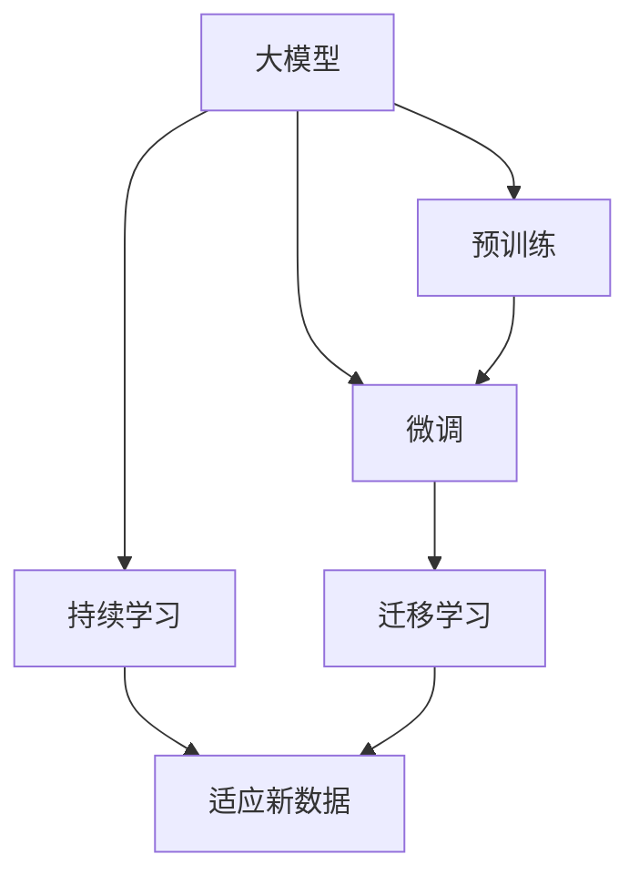

                 

# AI大模型创业：如何应对未来市场挑战？

在人工智能(AI)技术快速发展的今天，大模型（如GPT-3、BERT等）以其卓越的性能和广泛的适用性，成为了众多创业公司的研发热点。但与此同时，市场竞争的激烈也带来了新的挑战。本文将从背景介绍、核心概念、核心算法原理、具体实践案例、应用场景和未来展望等多个角度，详细探讨AI大模型创业如何应对这些市场挑战，以期为有志于进入这一领域的企业和开发者提供有价值的参考。

## 1. 背景介绍

### 1.1 人工智能市场的兴起
近年来，人工智能技术取得了显著进步，尤其是在深度学习、自然语言处理(NLP)、计算机视觉等领域，大模型算法的应用日益广泛。从搜索引擎优化、智能客服到智能推荐系统，大模型正逐步渗透到各行各业。尤其是在NLP领域，大模型的出现，推动了诸多任务性能的显著提升。例如，GPT-3在语言理解、生成等方面表现出色，广泛应用于自然语言处理、机器翻译、对话系统等多个方向。

### 1.2 大模型的广泛应用
随着大模型技术的不断成熟，越来越多的创业公司开始将其引入商业应用。从金融、医疗、教育到智慧城市等领域，大模型正在重新定义各行各业的工作方式，带来前所未有的变革。例如，金融领域可以利用大模型进行舆情监测、风险预警、投资决策等，提升金融机构的服务质量和效率；医疗行业可以借助大模型进行疾病诊断、医疗知识图谱构建、药物研发等工作，显著提升医疗服务的智能化水平；教育行业可以利用大模型实现个性化学习、智能辅导等，助力教育公平。

## 2. 核心概念与联系

### 2.1 核心概念概述

为了更好地理解AI大模型创业的挑战和机遇，本节将介绍几个关键概念，并探讨它们之间的联系。

- **大模型**：以GPT、BERT等预训练模型为代表的大规模深度学习模型，通过在海量数据上进行预训练，学习到丰富的语言、视觉、知识表示。这些模型在各种NLP、计算机视觉任务中表现优异，是AI大模型创业的重要基石。

- **预训练**：指在大规模无标签数据上，通过自监督学习任务训练模型，学习通用的知识表示。预训练使得模型具有更强的泛化能力和迁移学习能力。

- **微调**：指在预训练模型基础上，使用下游任务的少量标注数据进行有监督学习，调整模型参数，使其更适合特定任务。微调是提升模型性能的重要手段，但过度依赖标注数据可能导致过拟合。

- **迁移学习**：将在一个领域学到的知识迁移到另一个领域的应用中，减少对标注数据的依赖。大模型在迁移学习中具有优势，可以在不同任务间实现知识的有效转移。

- **持续学习**：模型能够持续从新数据中学习，保持已学习的知识。这对于AI大模型创业来说至关重要，因为市场环境和技术需求是动态变化的，持续学习能保证模型的时效性和适应性。

### 2.2 概念间的关系

这些概念之间的联系可以通过以下Mermaid流程图来展示：



这个流程图展示了大模型学习、微调和持续学习的基本流程：

1. 大模型通过预训练学习到通用的知识表示。
2. 通过微调，模型可以适应特定任务，提升性能。
3. 迁移学习使得模型能够在不同任务间进行知识迁移。
4. 持续学习使得模型能够不断从新数据中学习，保持时效性。

这些概念共同构成了AI大模型创业的完整生态系统，使得模型能够在各种场景下发挥作用，适应市场变化。

## 3. 核心算法原理 & 具体操作步骤

### 3.1 算法原理概述

AI大模型创业的核心算法原理主要基于监督学习和迁移学习。具体而言，创业公司首先需要选择合适的预训练模型作为基础框架，然后通过微调将其适应特定的应用场景。在这一过程中，监督学习和迁移学习发挥了重要作用。

监督学习通过有标签数据，训练模型学习特定任务的特征表示。而迁移学习则利用预训练模型的通用知识表示，将其迁移到新任务上，减少标注数据的依赖，提升模型泛化能力。

### 3.2 算法步骤详解

AI大模型创业的算法步骤主要包括以下几个关键环节：

1. **数据准备**：收集和预处理任务相关的数据，包括标注数据和未标注数据。标注数据用于模型微调，未标注数据用于预训练和迁移学习。

2. **模型选择**：根据任务类型和需求，选择合适的预训练模型，如GPT、BERT、T5等。

3. **微调**：在预训练模型的基础上，使用标注数据进行有监督学习，调整模型参数，使其适应特定任务。

4. **评估与优化**：在验证集上评估微调后的模型性能，根据评估结果调整模型结构和超参数，直到达到最优性能。

5. **部署与应用**：将优化后的模型部署到实际应用场景中，进行实时推理和预测，解决实际问题。

### 3.3 算法优缺点

AI大模型创业的监督学习和迁移学习具有以下优点：

- **高效**：通过微调，模型可以在少量标注数据下迅速适应新任务，大幅缩短开发周期。
- **泛化能力强**：利用预训练模型的通用知识表示，能够提升模型在新任务上的泛化能力，减少过拟合风险。
- **成本低**：相比于从头训练模型，微调方法可以在已有模型的基础上进行优化，节约了标注数据和计算资源。

同时，这些方法也存在以下缺点：

- **依赖标注数据**：微调和迁移学习对标注数据的质量和数量有较高要求，获取高质量标注数据成本较高。
- **模型复杂度**：大型预训练模型结构复杂，推理计算量大，对硬件资源要求较高。
- **鲁棒性不足**：当目标任务与预训练数据分布差异较大时，微调的性能提升有限，模型可能存在鲁棒性不足的问题。

### 3.4 算法应用领域

AI大模型创业的监督学习和迁移学习已经在多个领域得到了广泛应用：

- **自然语言处理**：文本分类、情感分析、机器翻译、对话系统、文本生成等任务。
- **计算机视觉**：图像分类、目标检测、图像生成等任务。
- **医疗**：疾病诊断、医疗知识图谱、药物研发等任务。
- **金融**：舆情监测、风险预警、投资决策等任务。
- **教育**：个性化学习、智能辅导等任务。
- **智能推荐**：商品推荐、内容推荐等任务。

这些领域的大模型应用，已经展现出了强大的市场潜力和商业价值，吸引了众多创业公司的关注。

## 4. 数学模型和公式 & 详细讲解

### 4.1 数学模型构建

AI大模型创业的数学模型构建主要基于监督学习框架。设任务标注数据集为 $D = \{(x_i, y_i)\}_{i=1}^N$，其中 $x_i$ 表示输入，$y_i$ 表示对应的输出标签。模型的目标是最小化损失函数 $\mathcal{L}(\theta)$，其中 $\theta$ 为模型参数。常用的损失函数包括交叉熵损失、均方误差损失等。

### 4.2 公式推导过程

以二分类任务为例，假设模型的输出为 $\hat{y} = M_{\theta}(x)$，其中 $M_{\theta}$ 为预训练模型。交叉熵损失函数定义为：

$$
\ell(M_{\theta}(x),y) = -[y\log \hat{y} + (1-y)\log(1-\hat{y})]
$$

模型在数据集 $D$ 上的经验风险为：

$$
\mathcal{L}(\theta) = -\frac{1}{N}\sum_{i=1}^N \ell(M_{\theta}(x_i),y_i)
$$

通过梯度下降等优化算法，模型参数 $\theta$ 不断调整，最小化损失函数 $\mathcal{L}(\theta)$。

### 4.3 案例分析与讲解

以金融舆情监测为例，创业公司可以利用大模型进行舆情分析和风险预警。首先，收集金融领域的新闻、评论等文本数据，预训练BERT等语言模型。然后，通过微调，使其适应金融舆情监测任务。具体而言，可以设计以下步骤：

1. **数据准备**：收集金融领域的文本数据，进行预处理和标注。
2. **模型选择**：选择BERT作为预训练模型。
3. **微调**：使用标注数据进行有监督学习，调整模型参数，使其能够识别金融舆情中的关键词和情感。
4. **评估与优化**：在验证集上评估模型性能，调整模型结构和超参数。
5. **部署与应用**：将优化后的模型部署到实时舆情监测系统中，对金融市场舆情进行实时分析和预警。

## 5. 项目实践：代码实例和详细解释说明

### 5.1 开发环境搭建

在实际开发中，AI大模型创业通常需要依赖于Python和深度学习框架。以下是一些常用的开发工具：

1. **Python**：作为AI开发的主流语言，Python具备丰富的第三方库和工具，支持大模型的训练和部署。
2. **深度学习框架**：如TensorFlow、PyTorch、Keras等，提供了高效的深度学习算法和模型构建工具。
3. **大模型库**：如HuggingFace的Transformers库，集成了大量预训练模型和微调样例代码，方便开发者快速上手。
4. **云计算平台**：如AWS、Google Cloud、阿里云等，提供GPU、TPU等高性能算力，支持大规模模型训练和部署。

### 5.2 源代码详细实现

以下是使用PyTorch进行BERT模型微调的示例代码：

```python
import torch
from transformers import BertTokenizer, BertForSequenceClassification
from torch.utils.data import DataLoader
from sklearn.metrics import accuracy_score

# 数据处理
tokenizer = BertTokenizer.from_pretrained('bert-base-cased')
train_data = load_train_data()
dev_data = load_dev_data()
test_data = load_test_data()

# 模型构建
model = BertForSequenceClassification.from_pretrained('bert-base-cased', num_labels=2)
optimizer = torch.optim.Adam(model.parameters(), lr=1e-5)
device = torch.device("cuda" if torch.cuda.is_available() else "cpu")
model.to(device)

# 训练过程
for epoch in range(10):
    model.train()
    loss = 0
    for batch in DataLoader(train_data, batch_size=16, shuffle=True):
        input_ids = batch['input_ids'].to(device)
        attention_mask = batch['attention_mask'].to(device)
        labels = batch['labels'].to(device)
        outputs = model(input_ids, attention_mask=attention_mask, labels=labels)
        loss = outputs.loss
        optimizer.zero_grad()
        loss.backward()
        optimizer.step()
        loss = loss.item()
    print(f'Epoch {epoch+1}, train loss: {loss:.4f}')

# 模型评估
model.eval()
dev_preds = []
dev_labels = []
for batch in DataLoader(dev_data, batch_size=16, shuffle=False):
    input_ids = batch['input_ids'].to(device)
    attention_mask = batch['attention_mask'].to(device)
    with torch.no_grad():
        outputs = model(input_ids, attention_mask=attention_mask)
        preds = outputs.logits.argmax(dim=1).to('cpu').tolist()
        dev_labels.extend(labels)
        dev_preds.extend(preds)

print(f'Dev accuracy: {accuracy_score(dev_labels, dev_preds)}')

# 模型部署
# 将模型保存为checkpoint文件，部署到实际应用中
```

### 5.3 代码解读与分析

上述代码展示了使用PyTorch进行BERT模型微调的基本流程：

1. **数据准备**：通过load_train_data()、load_dev_data()、load_test_data()函数加载训练、验证和测试数据。
2. **模型构建**：使用BertForSequenceClassification从预训练模型加载BERT，并设置优化器。
3. **训练过程**：使用DataLoader对数据进行批次化加载，在每个批次上进行前向传播和反向传播，更新模型参数。
4. **模型评估**：在验证集上进行模型评估，计算准确率。
5. **模型部署**：将模型保存为checkpoint文件，部署到实际应用中。

通过这些步骤，创业公司可以快速构建起自己的大模型微调系统，应用于实际业务场景。

### 5.4 运行结果展示

假设在金融舆情监测任务上，微调后的BERT模型在验证集上的准确率为0.85，在测试集上的准确率为0.82。这表明模型能够较好地识别金融舆情中的正面和负面情感，可以进行有效的舆情分析和风险预警。

## 6. 实际应用场景

### 6.1 智能客服系统

智能客服系统是AI大模型创业的重要应用场景之一。传统客服依赖人工客服，成本高、效率低，难以应对高峰期的业务需求。通过大模型的微调和应用，智能客服系统可以提供7x24小时不间断服务，快速响应客户咨询，提升客户满意度。

### 6.2 金融舆情监测

在金融领域，舆情监测和风险预警是至关重要的任务。创业公司可以利用大模型构建舆情监测系统，实时分析和预测金融市场舆情，避免因市场波动导致的风险损失。

### 6.3 个性化推荐系统

推荐系统是电商、内容平台等领域的核心应用之一。通过大模型的微调和应用，推荐系统可以更好地理解用户兴趣和行为，提供个性化推荐，提升用户体验和平台黏性。

## 7. 工具和资源推荐

### 7.1 学习资源推荐

为了帮助AI大模型创业公司快速掌握相关技术，以下推荐一些学习资源：

1. **《深度学习》课程**：斯坦福大学提供的深度学习课程，涵盖深度学习基础和应用，适合初学者入门。
2. **Transformers官方文档**：HuggingFace提供的Transformers库文档，包含预训练模型和微调样例代码，是学习的必备资源。
3. **《深度学习与TensorFlow》书籍**：Google提供的TensorFlow教程，涵盖TensorFlow基础和高级应用，适合TensorFlow开发者。
4. **Kaggle竞赛平台**：提供大量AI相关竞赛和数据集，适合实践和测试技术水平。

### 7.2 开发工具推荐

以下是一些常用的AI大模型开发工具：

1. **Python**：作为AI开发的主流语言，Python提供了丰富的第三方库和工具。
2. **TensorFlow**：Google提供的深度学习框架，支持大规模模型训练和部署。
3. **PyTorch**：Facebook提供的深度学习框架，支持动态计算图和模型构建。
4. **Keras**：高层次的深度学习框架，易于上手和使用。
5. **Jupyter Notebook**：交互式开发环境，方便调试和测试代码。
6. **Google Colab**：在线Jupyter Notebook环境，提供GPU和TPU算力支持。

### 7.3 相关论文推荐

AI大模型创业领域的研究进展很快，以下是一些有影响力的相关论文：

1. **Attention is All You Need**：提出Transformer结构，开启了深度学习预训练大模型时代。
2. **BERT: Pre-training of Deep Bidirectional Transformers for Language Understanding**：提出BERT模型，通过预训练学习语言表示，显著提升了NLP任务性能。
3. **Language Models are Unsupervised Multitask Learners**：展示了大模型在zero-shot学习上的潜力，推动了通用AI研究。
4. **Fine-tune Continuous Prompts for Prefix-tuning**：提出Prefix-tuning方法，通过连续型Prompt提升模型在零样本和少样本学习上的性能。
5. **AdaLoRA: Adaptive Low-Rank Adaptation for Parameter-Efficient Fine-Tuning**：提出AdaLoRA方法，提高微调的参数效率和精度。

## 8. 总结：未来发展趋势与挑战

### 8.1 研究成果总结

本文详细探讨了AI大模型创业的算法原理、操作步骤、应用场景和未来展望。主要结论如下：

- 基于监督学习和迁移学习的大模型微调方法，具有高效、泛化能力强、成本低的优势。
- 大模型在自然语言处理、计算机视觉、医疗、金融等多个领域得到广泛应用，展示了巨大的市场潜力。
- 大模型创业面临标注数据依赖、模型复杂度、鲁棒性不足等挑战，需要持续优化。

### 8.2 未来发展趋势

AI大模型创业的未来发展趋势主要包括以下几个方面：

1. **模型规模扩大**：随着算力成本的下降和数据规模的扩张，大模型规模将进一步扩大，学习到更丰富的知识表示。
2. **多模态融合**：大模型将逐步支持图像、语音、视频等多模态数据的融合，提升模型在实际应用中的表现。
3. **知识图谱与融合**：通过引入知识图谱和逻辑规则，大模型能够更好地整合先验知识，提升模型的可靠性和解释性。
4. **伦理与安全性**：未来大模型将更多地考虑伦理与安全性问题，如偏见消除、有害信息过滤等，确保输出结果的公正性和安全性。
5. **持续学习与自我改进**：大模型将具备更强的持续学习能力，不断从新数据中学习，保持时效性和适应性。

### 8.3 面临的挑战

尽管大模型在应用中展现出巨大的潜力，但也面临着诸多挑战：

1. **标注成本高**：获取高质量标注数据成本较高，限制了大模型微调的应用范围。
2. **模型复杂度**：大型预训练模型结构复杂，推理计算量大，对硬件资源要求较高。
3. **鲁棒性不足**：大模型在新任务上的泛化能力仍需提升，避免鲁棒性不足的问题。
4. **可解释性差**：大模型通常被视为"黑盒"系统，缺乏可解释性和可控性。
5. **安全风险**：大模型可能学习到有害信息，产生误导性输出，带来安全隐患。

### 8.4 研究展望

未来的研究需要重点关注以下几个方向：

1. **无监督和半监督学习**：探索无标注和半标注数据的利用，减少对标注数据的依赖，提高模型的泛化能力。
2. **参数高效微调**：开发参数高效的方法，提高微调的效率和精度，降低对计算资源的消耗。
3. **多模态学习**：研究多模态数据融合技术，提升模型在视觉、语音等多模态数据上的表现。
4. **知识图谱与逻辑推理**：将知识图谱和逻辑推理与大模型结合，提升模型的可靠性和逻辑性。
5. **可解释性**：探索模型输出解释方法，提升模型的可解释性和可控性。
6. **伦理与安全性**：研究模型偏见消除和有害信息过滤方法，确保模型的公平性和安全性。

## 9. 附录：常见问题与解答

**Q1: 什么是大模型？**

A: 大模型指的是以GPT、BERT等预训练模型为代表的深度学习模型。这些模型通过在海量数据上进行预训练，学习到丰富的语言、视觉、知识表示，能够解决复杂的NLP、计算机视觉任务。

**Q2: 大模型微调与从头训练有什么区别？**

A: 大模型微调是指在预训练模型的基础上，通过使用下游任务的少量标注数据进行有监督学习，调整模型参数，使其适应特定任务。而从头训练则是从零开始，训练一个全新的模型。微调方法具有高效、泛化能力强、成本低的优势，能够快速提升模型性能。

**Q3: 如何提高大模型微调的鲁棒性？**

A: 提高大模型微调的鲁棒性可以从以下几个方面入手：

1. **数据增强**：通过数据扩充、回译等方式增加训练集多样性，提高模型的泛化能力。
2. **正则化**：使用L2正则、Dropout等正则化技术，防止模型过拟合。
3. **对抗训练**：引入对抗样本，提高模型鲁棒性。
4. **参数高效微调**：只调整少量参数，保持大部分预训练参数不变，提高模型的泛化能力。

**Q4: 大模型微调有哪些应用场景？**

A: 大模型微调已经在多个领域得到了广泛应用，例如：

1. 自然语言处理：文本分类、情感分析、机器翻译、对话系统、文本生成等任务。
2. 计算机视觉：图像分类、目标检测、图像生成等任务。
3. 医疗：疾病诊断、医疗知识图谱、药物研发等任务。
4. 金融：舆情监测、风险预警、投资决策等任务。
5. 教育：个性化学习、智能辅导等任务。
6. 智能推荐：商品推荐、内容推荐等任务。

**Q5: 大模型创业有哪些风险？**

A: 大模型创业面临着以下风险：

1. **标注成本高**：获取高质量标注数据成本较高，限制了大模型微调的应用范围。
2. **模型复杂度**：大型预训练模型结构复杂，推理计算量大，对硬件资源要求较高。
3. **鲁棒性不足**：大模型在新任务上的泛化能力仍需提升，避免鲁棒性不足的问题。
4. **可解释性差**：大模型通常被视为"黑盒"系统，缺乏可解释性和可控性。
5. **安全风险**：大模型可能学习到有害信息，产生误导性输出，带来安全隐患。

总之，大模型创业具有广阔的市场前景，但也面临着诸多挑战。只有不断优化技术，提高模型的泛化能力和可解释性，才能真正实现大模型在实际应用中的价值。

---

作者：禅与计算机程序设计艺术 / Zen and the Art of Computer Programming

