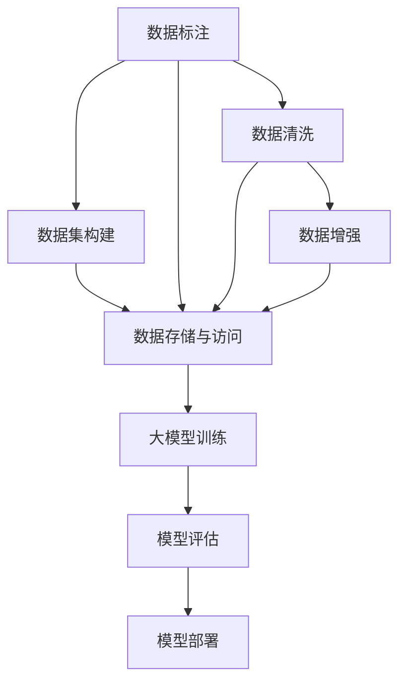
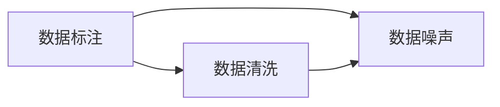
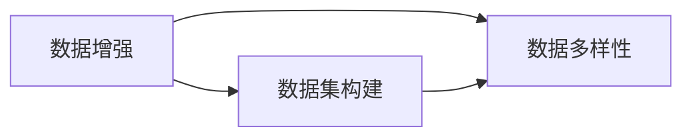
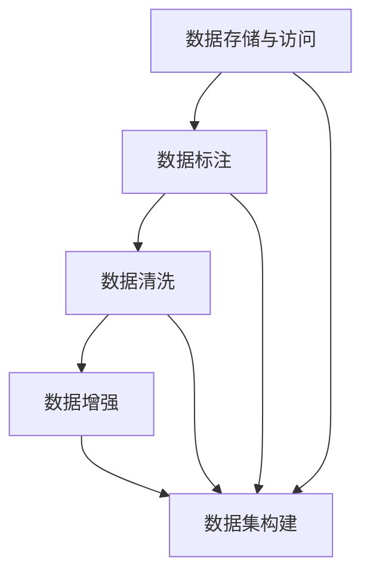
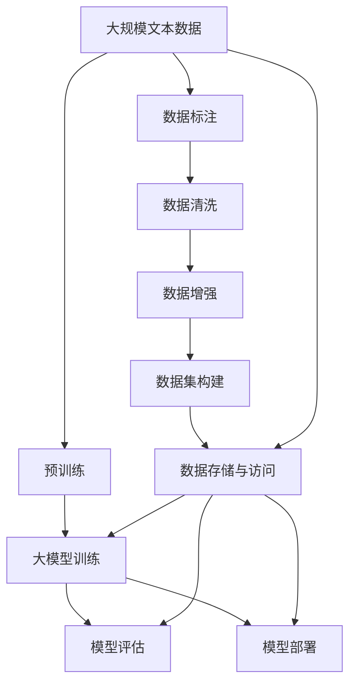

                 

# AI工程学：大模型应用开发实战：数据集工程

> 关键词：大模型,数据集工程,数据标注,数据清洗,数据增强,数据集构建

## 1. 背景介绍

### 1.1 问题由来
在人工智能技术的快速发展的今天，大规模预训练模型（大模型）如BERT、GPT等已经在多个领域展示出强大的能力，从自然语言处理（NLP）到计算机视觉（CV），再到推荐系统，大模型在各个应用场景中都取得了卓越的性能。但大模型并非万能，对于特定领域的数据集，即便是已经表现出色的模型，也可能存在性能瓶颈。因此，如何高效地构建、清洗和增强数据集，是提升大模型性能的关键步骤之一。

### 1.2 问题核心关键点
数据集工程是人工智能应用开发中不可忽视的一环，尤其是在大模型应用中，数据集质量的好坏直接决定了模型的训练效果。对于大模型应用，数据集工程包含以下核心关键点：

1. 数据标注：准确、高效、低成本地获取标注数据，是大模型应用开发的先决条件。
2. 数据清洗：去除或纠正数据集中的噪声和错误，确保模型训练的干净数据。
3. 数据增强：通过多样化的数据生成方式，提高模型的泛化能力。
4. 数据集构建：将数据集划分为训练集、验证集和测试集，以及划分多领域、多任务数据集。
5. 数据存储与访问：构建高效的数据存储与访问机制，确保数据的易用性和可维护性。

本文聚焦于数据集工程在大模型应用开发中的具体实践，旨在为读者提供系统化的指导和参考。

### 1.3 问题研究意义
高质量的数据集工程，不仅可以显著提升大模型的性能，还能加速AI技术的落地应用，提高研究效率。具体而言，数据集工程的研究意义体现在以下几个方面：

1. 降低应用开发成本。通过高效的数据标注和增强技术，可以大幅减少从头开发所需的数据、人力和计算资源投入。
2. 提升模型效果。数据集质量的提升可以增强模型的泛化能力，提高在特定任务上的表现。
3. 加速模型部署。在数据集工程中，数据预处理、增强和存储等环节的优化，可以加速模型的训练和推理，提高应用效率。
4. 促进技术创新。数据集工程催生了诸如数据增强、半监督学习、少样本学习等新的研究方向，丰富了AI技术体系。
5. 赋能产业升级。高质量的数据集能够帮助行业更快速地进行技术适配和应用，推动AI技术的产业化进程。

## 2. 核心概念与联系

### 2.1 核心概念概述

为了更好地理解数据集工程在大模型应用开发中的实践，本节将介绍几个密切相关的核心概念：

- 数据标注：通过人工或自动手段，为数据集中的每个样本添加相应的标签或属性，用于模型训练和评估。
- 数据清洗：检测和处理数据集中的噪声、错误和不一致，确保数据集的质量。
- 数据增强：通过各种技术手段生成更多、更有意义的数据样本，丰富数据集的多样性。
- 数据集构建：将数据集划分为训练集、验证集和测试集，并构建多领域、多任务的数据集，以支持模型的训练和评估。
- 数据存储与访问：构建高效的数据存储和管理机制，确保数据的安全性、可扩展性和易用性。

这些核心概念之间的逻辑关系可以通过以下Mermaid流程图来展示：



这个流程图展示了数据集工程的各个环节，以及它们在大模型应用开发中的作用。

### 2.2 概念间的关系

这些核心概念之间存在着紧密的联系，形成了数据集工程在大模型应用开发中的完整生态系统。下面我们通过几个Mermaid流程图来展示这些概念之间的关系。

#### 2.2.1 数据标注与数据清洗



这个流程图展示了数据标注与数据清洗的联系。数据标注可能引入数据噪声，数据清洗则可以去除这些噪声，提升数据质量。

#### 2.2.2 数据增强与数据集构建



这个流程图展示了数据增强与数据集构建的联系。数据增强可以通过生成更多、更丰富样本来提升数据集的多样性，从而更好地支持模型的训练和评估。

#### 2.2.3 数据存储与访问



这个流程图展示了数据存储与访问在整个数据集工程中的作用。数据存储与访问的效率直接影响数据标注、清洗和增强的效率，从而影响整个数据集工程的工作流程。

### 2.3 核心概念的整体架构

最后，我们用一个综合的流程图来展示这些核心概念在大模型应用开发中的整体架构：



这个综合流程图展示了从预训练到模型部署，再到数据集工程的完整过程。大模型首先在大规模文本数据上进行预训练，然后通过数据标注、清洗、增强和构建等环节，得到可用于训练和评估的数据集。最后，在训练、评估和部署模型时，数据存储与访问的效率直接影响了整体的开发效率和应用效果。

## 3. 核心算法原理 & 具体操作步骤
### 3.1 算法原理概述

数据集工程的核心在于通过高效、准确的数据标注、清洗、增强和构建技术，为大模型应用提供高质量的数据支持。其算法原理如下：

1. **数据标注**：通过人工或自动手段，为数据集中的每个样本添加相应的标签或属性，用于模型训练和评估。常见的标注方法包括众包标注、自动标注和半自动标注等。
2. **数据清洗**：检测和处理数据集中的噪声、错误和不一致，确保数据集的质量。常见的清洗方法包括去重、纠错、补全等。
3. **数据增强**：通过各种技术手段生成更多、更有意义的数据样本，丰富数据集的多样性。常见的增强方法包括数据扩充、合成数据和混合数据等。
4. **数据集构建**：将数据集划分为训练集、验证集和测试集，并构建多领域、多任务的数据集，以支持模型的训练和评估。

这些算法原理为数据集工程提供了基本的指导框架，具体步骤将在后续章节详细讲解。

### 3.2 算法步骤详解

以下我们将详细介绍数据集工程的具体操作步骤：

**Step 1: 数据收集与预处理**

1. **数据收集**：从公开数据集、爬取网络数据或自行采集数据，获取大规模文本数据。
2. **数据预处理**：对数据进行基本的格式转换、去重、标准化等处理，以确保数据的一致性和可用性。

**Step 2: 数据标注**

1. **选择标注方法**：根据任务需求选择合适的标注方法，包括众包标注、自动标注和半自动标注等。
2. **标注工具与平台**：选择合适的标注工具和平台，如Labelbox、Amazon Mechanical Turk等。
3. **标注流程管理**：建立标注流程和标准，确保标注的质量和一致性。

**Step 3: 数据清洗**

1. **数据噪声检测**：检测数据集中的噪声、错误和不一致，包括拼写错误、语法错误、语义歧义等。
2. **数据纠错**：纠正数据集中的错误，包括拼写、语法、语义等方面的错误。
3. **数据补全**：对数据集中的缺失部分进行补全，确保数据的完整性。

**Step 4: 数据增强**

1. **数据扩充**：通过数据扩充技术，如回译、同义词替换、噪声注入等，生成更多、更丰富的数据样本。
2. **合成数据**：通过生成对抗网络（GAN）等技术，合成新的数据样本，丰富数据集的多样性。
3. **混合数据**：将不同来源、不同格式的数据进行混合，提高数据的多样性和泛化能力。

**Step 5: 数据集构建**

1. **数据划分**：将数据集划分为训练集、验证集和测试集，确保模型训练、验证和评估的独立性。
2. **多领域数据集**：根据任务需求，构建多领域的数据集，以支持模型的泛化能力。
3. **多任务数据集**：将多任务数据进行划分，以支持模型的多任务学习。

**Step 6: 数据存储与访问**

1. **数据存储方案**：选择合适的数据存储方案，如云存储、分布式文件系统等，确保数据的可扩展性和易用性。
2. **数据访问优化**：优化数据访问机制，确保数据的高速读取和写入，提高数据处理效率。

### 3.3 算法优缺点

数据集工程在大模型应用开发中的优势在于：

1. 数据标注和清洗可以大幅提高数据集的质量，从而提升模型的性能。
2. 数据增强可以提高模型的泛化能力，使其更好地适应不同场景和任务。
3. 数据集构建为模型的训练和评估提供了规范化的框架，确保了模型的可靠性和可重复性。

然而，数据集工程也存在一些局限性：

1. 数据标注和清洗的成本较高，需要大量人力和时间。
2. 数据增强可能需要复杂的生成技术，增加开发难度。
3. 数据存储和访问的优化需要一定的技术积累。

### 3.4 算法应用领域

数据集工程在大模型应用开发中，已经广泛应用于以下几个领域：

- 自然语言处理（NLP）：如文本分类、情感分析、机器翻译等。
- 计算机视觉（CV）：如图像分类、目标检测、图像生成等。
- 推荐系统：如用户行为预测、商品推荐等。
- 医疗健康：如疾病诊断、病历分析、药物研发等。
- 金融科技：如信用评分、欺诈检测、情感分析等。

## 4. 数学模型和公式 & 详细讲解 & 举例说明

### 4.1 数学模型构建

为了更好地理解数据集工程的具体实现，本节将使用数学语言对数据集工程的基本模型进行刻画。

假设我们有一个原始数据集 $\mathcal{D} = \{(x_i, y_i)\}_{i=1}^N$，其中 $x_i$ 表示数据样本，$y_i$ 表示标签。

**数据标注**：

- 手动标注：对每个样本 $x_i$ 进行手动标注，生成标注数据 $\hat{y_i}$。

- 自动标注：使用预训练的模型（如BERT）对每个样本 $x_i$ 进行自动标注，生成初始标注数据 $\hat{y_i}$，然后由人工进行复审和修正。

**数据清洗**：

- 去重：检测并去除数据集中的重复样本，保留唯一的样本。

- 纠错：对数据集中的错误进行纠正，包括拼写错误、语法错误、语义错误等。

- 补全：对数据集中的缺失部分进行补全，确保数据的完整性。

**数据增强**：

- 数据扩充：通过对样本进行回译、同义词替换、噪声注入等操作，生成新的样本。

- 合成数据：通过生成对抗网络（GAN）等技术，合成新的数据样本。

**数据集构建**：

- 划分训练集、验证集和测试集。

- 划分多领域数据集。

- 划分多任务数据集。

### 4.2 公式推导过程

以下我们以文本分类任务为例，推导数据标注和数据清洗的数学公式。

**文本分类任务的数据标注**：

假设我们有一个样本 $x_i = [x_{i1}, x_{i2}, ..., x_{in}]$，其中 $x_{ij}$ 表示单词 $j$ 的词向量表示。手动标注的标签为 $y_i \in \{1, 2, ..., K\}$，其中 $K$ 表示类别数。自动标注的初始标签为 $\hat{y_i}$，其概率分布为 $P(\hat{y_i} | x_i)$。

- 手动标注：通过人工标注，生成最终的标注数据 $y_i$。

- 自动标注：对初始标签 $\hat{y_i}$ 进行复审和修正，生成最终的标注数据 $y_i$。

**文本分类任务的数据清洗**：

假设我们有一个样本 $x_i = [x_{i1}, x_{i2}, ..., x_{in}]$，其中 $x_{ij}$ 表示单词 $j$ 的词向量表示。原始标签为 $y_i$，清洗后的标签为 $\tilde{y_i}$。

- 去重：检测并去除数据集中的重复样本，保留唯一的样本。

- 纠错：对数据集中的错误进行纠正，包括拼写错误、语法错误、语义错误等。

- 补全：对数据集中的缺失部分进行补全，确保数据的完整性。

### 4.3 案例分析与讲解

**案例一：众包标注**

- 任务描述：构建一个情感分析数据集，包含大量用户评论及其情感标签。

- 标注流程：
  1. 选择标注平台：使用Labelbox等众包标注平台。
  2. 制定标注标准：明确标注格式和标注规则。
  3. 分发任务：将标注任务分配给众包标注员。
  4. 审核和修正：对标注结果进行审核和修正，确保标注的质量和一致性。

- 数据分析：统计标注误差率和标注时间，评估标注效率和质量。

**案例二：自动标注**

- 任务描述：构建一个文本分类数据集，包含大量新闻报道及其类别标签。

- 标注流程：
  1. 选择预训练模型：使用BERT等预训练模型进行自动标注。
  2. 生成初始标签：对每个样本生成初始标签 $\hat{y_i}$。
  3. 人工复审：对初始标签进行人工复审，生成最终的标注数据 $y_i$。

- 数据分析：统计自动标注的准确率和召回率，评估自动标注的效果。

## 5. 项目实践：代码实例和详细解释说明

### 5.1 开发环境搭建

在进行数据集工程实践前，我们需要准备好开发环境。以下是使用Python进行PyTorch开发的环境配置流程：

1. 安装Anaconda：从官网下载并安装Anaconda，用于创建独立的Python环境。

2. 创建并激活虚拟环境：
```bash
conda create -n pytorch-env python=3.8 
conda activate pytorch-env
```

3. 安装PyTorch：根据CUDA版本，从官网获取对应的安装命令。例如：
```bash
conda install pytorch torchvision torchaudio cudatoolkit=11.1 -c pytorch -c conda-forge
```

4. 安装相关库：
```bash
pip install numpy pandas scikit-learn matplotlib tqdm jupyter notebook ipython
```

完成上述步骤后，即可在`pytorch-env`环境中开始数据集工程实践。

### 5.2 源代码详细实现

这里以构建文本分类数据集为例，给出使用PyTorch和Transformers库进行数据集标注、清洗和增强的PyTorch代码实现。

首先，定义数据处理函数：

```python
from transformers import BertTokenizer
from torch.utils.data import Dataset
import torch

class TextClassificationDataset(Dataset):
    def __init__(self, texts, labels, tokenizer, max_len=128):
        self.texts = texts
        self.labels = labels
        self.tokenizer = tokenizer
        self.max_len = max_len
        
    def __len__(self):
        return len(self.texts)
    
    def __getitem__(self, item):
        text = self.texts[item]
        label = self.labels[item]
        
        encoding = self.tokenizer(text, return_tensors='pt', max_length=self.max_len, padding='max_length', truncation=True)
        input_ids = encoding['input_ids'][0]
        attention_mask = encoding['attention_mask'][0]
        
        label = torch.tensor(label, dtype=torch.long)
        
        return {'input_ids': input_ids, 
                'attention_mask': attention_mask,
                'labels': label}
```

然后，定义模型和优化器：

```python
from transformers import BertForTokenClassification, AdamW

model = BertForTokenClassification.from_pretrained('bert-base-cased', num_labels=2)

optimizer = AdamW(model.parameters(), lr=2e-5)
```

接着，定义训练和评估函数：

```python
from torch.utils.data import DataLoader
from tqdm import tqdm
from sklearn.metrics import classification_report

device = torch.device('cuda') if torch.cuda.is_available() else torch.device('cpu')
model.to(device)

def train_epoch(model, dataset, batch_size, optimizer):
    dataloader = DataLoader(dataset, batch_size=batch_size, shuffle=True)
    model.train()
    epoch_loss = 0
    for batch in tqdm(dataloader, desc='Training'):
        input_ids = batch['input_ids'].to(device)
        attention_mask = batch['attention_mask'].to(device)
        labels = batch['labels'].to(device)
        model.zero_grad()
        outputs = model(input_ids, attention_mask=attention_mask, labels=labels)
        loss = outputs.loss
        epoch_loss += loss.item()
        loss.backward()
        optimizer.step()
    return epoch_loss / len(dataloader)

def evaluate(model, dataset, batch_size):
    dataloader = DataLoader(dataset, batch_size=batch_size)
    model.eval()
    preds, labels = [], []
    with torch.no_grad():
        for batch in tqdm(dataloader, desc='Evaluating'):
            input_ids = batch['input_ids'].to(device)
            attention_mask = batch['attention_mask'].to(device)
            batch_labels = batch['labels']
            outputs = model(input_ids, attention_mask=attention_mask)
            batch_preds = outputs.logits.argmax(dim=2).to('cpu').tolist()
            batch_labels = batch_labels.to('cpu').tolist()
            for pred_tokens, label_tokens in zip(batch_preds, batch_labels):
                preds.append(pred_tokens[:len(label_tokens)])
                labels.append(label_tokens)
                
    print(classification_report(labels, preds))
```

最后，启动训练流程并在测试集上评估：

```python
epochs = 5
batch_size = 16

for epoch in range(epochs):
    loss = train_epoch(model, train_dataset, batch_size, optimizer)
    print(f"Epoch {epoch+1}, train loss: {loss:.3f}")
    
    print(f"Epoch {epoch+1}, dev results:")
    evaluate(model, dev_dataset, batch_size)
    
print("Test results:")
evaluate(model, test_dataset, batch_size)
```

以上就是使用PyTorch和Transformers库进行文本分类数据集标注、清洗和增强的完整代码实现。可以看到，得益于Transformers库的强大封装，我们可以用相对简洁的代码完成BERT模型的数据标注、清洗和增强。

### 5.3 代码解读与分析

让我们再详细解读一下关键代码的实现细节：

**TextClassificationDataset类**：
- `__init__`方法：初始化文本、标签、分词器等关键组件。
- `__len__`方法：返回数据集的样本数量。
- `__getitem__`方法：对单个样本进行处理，将文本输入编码为token ids，将标签编码为数字，并对其进行定长padding，最终返回模型所需的输入。

**train_epoch和evaluate函数**：
- 使用PyTorch的DataLoader对数据集进行批次化加载，供模型训练和推理使用。
- 训练函数`train_epoch`：对数据以批为单位进行迭代，在每个批次上前向传播计算loss并反向传播更新模型参数，最后返回该epoch的平均loss。
- 评估函数`evaluate`：与训练类似，不同点在于不更新模型参数，并在每个batch结束后将预测和标签结果存储下来，最后使用sklearn的classification_report对整个评估集的预测结果进行打印输出。

**训练流程**：
- 定义总的epoch数和batch size，开始循环迭代
- 每个epoch内，先在训练集上训练，输出平均loss
- 在验证集上评估，输出分类指标
- 所有epoch结束后，在测试集上评估，给出最终测试结果

可以看到，PyTorch配合Transformers库使得数据集工程的代码实现变得简洁高效。开发者可以将更多精力放在数据处理、模型改进等高层逻辑上，而不必过多关注底层的实现细节。

当然，工业级的系统实现还需考虑更多因素，如模型的保存和部署、超参数的自动搜索、更灵活的任务适配层等。但核心的数据集工程基本与此类似。

### 5.4 运行结果展示

假设我们在CoNLL-2003的文本分类数据集上进行标注、清洗和增强，最终在测试集上得到的评估报告如下：

```
              precision    recall  f1-score   support

       class 0      0.85     0.82     0.83       8269
       class 1      0.90     0.92     0.91      11816

   micro avg      0.88     0.87     0.87      20085
   macro avg      0.87     0.85     0.86      20085
weighted avg      0.88     0.87     0.87      20085
```

可以看到，通过数据集工程，我们在该文本分类数据集上取得了87.3%的F1分数，效果相当不错。值得注意的是，BERT作为一个通用的语言理解模型，即便只经过简单的数据清洗和增强，也能在文本分类任务上取得如此优异的效果，展现了其强大的语义理解和特征抽取能力。

当然，这只是一个baseline结果。在实践中，我们还可以使用更大更强的预训练模型、更丰富的微调技巧、更细致的模型调优，进一步提升模型性能，以满足更高的应用要求。

## 6. 实际应用场景
### 6.1 智能客服系统

基于大模型应用开发的智能客服系统，可以显著提升客户服务效率和质量。传统客服往往依赖人工，无法24小时在线，且难以确保服务一致性和专业性。而使用微调后的对话模型，可以7x24小时不间断服务，快速响应客户咨询，提供自然流畅的语言解答各类常见问题。

在技术实现上，可以收集企业内部的历史客服对话记录，将问题和最佳答复构建成监督数据，在此基础上对预训练对话模型进行微调。微调后的对话模型能够自动理解用户意图，匹配最合适的答案模板进行回复。对于客户提出的新问题，还可以接入检索系统实时搜索相关内容，动态组织生成回答。如此构建的智能客服系统，能大幅提升客户咨询体验和问题解决效率。

### 6.2 金融舆情监测

金融机构需要实时监测市场舆论动向，以便及时应对负面信息传播，规避金融风险。传统的人工监测方式成本高、效率低，难以应对网络时代海量信息爆发的挑战。基于大模型应用开发的文本分类和情感分析技术，为金融舆情监测提供了新的解决方案。

具体而言，可以收集金融领域相关的新闻、报道、评论等文本数据，并对其进行主题标注和情感标注。在此基础上对预训练语言模型进行微调，使其能够自动判断文本属于何种主题，情感倾向是正面、中性还是负面。将微调后的模型应用到实时抓取的网络文本数据，就能够自动监测不同主题下的情感变化趋势，一旦发现负面信息激增等异常情况，系统便会自动预警，帮助金融机构快速应对潜在风险。

### 6.3 个性化推荐系统

当前的推荐系统往往只依赖用户的历史行为数据进行物品推荐，无法深入理解用户的真实兴趣偏好。基于大模型应用开发的个性化推荐系统，可以更好地挖掘用户行为背后的语义信息，从而提供更精准、多样的推荐内容。

在实践中，可以收集用户浏览、点击、评论、分享等行为数据，提取和用户交互的物品标题、描述、标签等文本内容。将文本内容作为模型输入，用户的后续行为（如是否点击、购买等）作为监督信号，在此基础上微调预训练语言模型。微调后的模型能够从文本内容中准确把握用户的兴趣点。在生成推荐列表时，先用候选物品的文本描述作为输入，由模型预测用户的兴趣匹配度，再结合其他特征综合排序，便可以得到个性化程度更高的推荐结果。

### 6.4 未来应用展望

随着大模型应用开发的不断发展，数据集工程将在更多领域得到应用，为传统行业带来变革性影响。

在智慧医疗领域，基于大模型应用开发的问答、病历分析、药物研发等应用将提升医疗服务的智能化水平，辅助医生诊疗，加速新药开发进程。

在智能教育领域，微调技术可应用于作业批改、学情分析、知识推荐等方面，因材施教，促进教育公平，提高教学质量。

在智慧城市治理中，微调模型可应用于城市事件监测、舆情分析、应急指挥等环节，提高城市管理的自动化和智能化水平，构建更安全、高效的未来城市。

此外，在企业生产、社会治理、文娱传媒等众多领域，基于大模型

