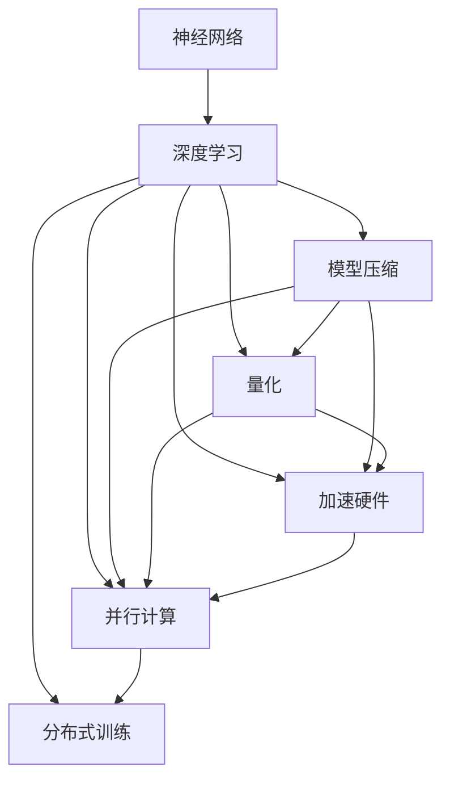
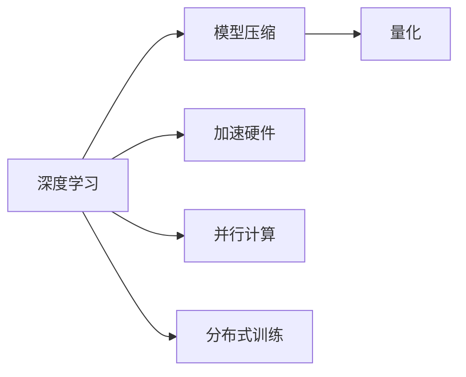
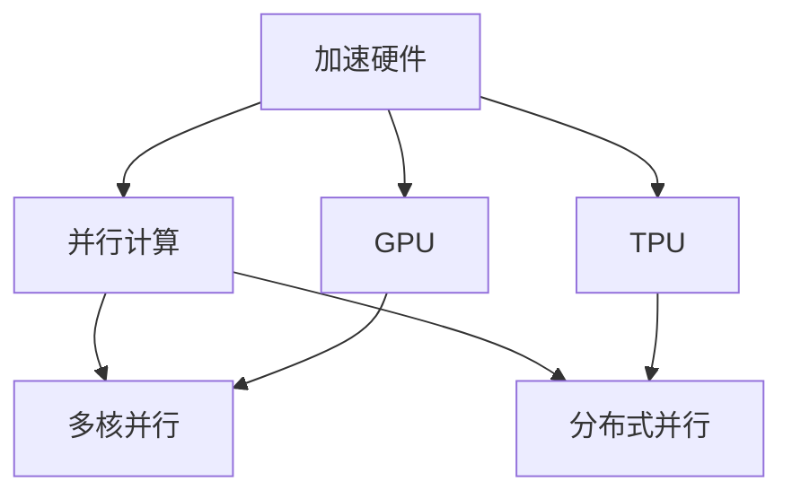
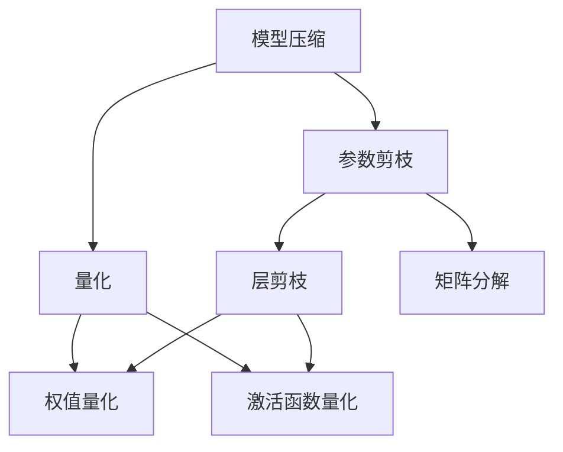
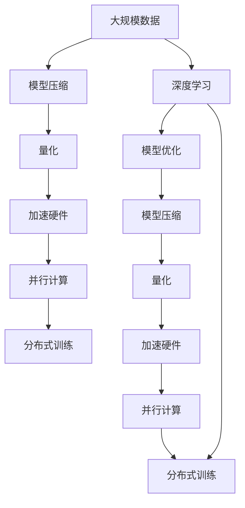

                 

# AI算法与硬件的共同演进

> 关键词：AI算法,硬件演进,优化,加速,量化,模型压缩,并行计算

## 1. 背景介绍

### 1.1 问题由来
人工智能（AI）的快速发展离不开算法的突破和硬件的升级。过去几十年间，无论是神经网络结构的创新，还是深度学习的算法优化，都在不同程度上推动了AI的飞跃发展。同时，随着任务复杂度的提高，传统硬件如CPU在处理大规模数据和密集计算任务时，已难以满足需求。如何在算法和硬件之间找到最佳平衡，提升AI应用的效率和效果，成为了当前AI领域的一大挑战。

### 1.2 问题核心关键点
AI算法与硬件的协同演进主要涉及以下几个关键点：

- **算法优化**：通过算法改进，提升模型性能和效率。包括模型结构创新、参数剪枝、量化等技术。
- **硬件加速**：利用专用硬件（如GPU、TPU、FPGA等）优化算法性能，提高计算速度和能效比。
- **模型压缩**：通过模型剪枝、量化、蒸馏等技术，减小模型体积，降低存储和计算需求。
- **并行计算**：通过多核、分布式、异构计算等技术，实现算法的并行处理，提升计算效率。

### 1.3 问题研究意义
研究AI算法与硬件的协同演进，对加速AI技术的落地应用，提升模型性能和效率，推动产业升级，具有重要意义：

- **提高计算效率**：通过优化算法和加速硬件，能够显著提升AI模型在各种任务上的计算效率，满足实时性和响应速度的要求。
- **降低资源消耗**：模型压缩和量化技术能够降低对硬件资源的占用，使得AI模型能够更广泛地部署在资源受限的设备上。
- **支持大模型训练**：专用硬件（如TPU）能够支持大模型的高效训练，推动更多高质量模型的诞生。
- **推动产业应用**：算法的优化和硬件的升级，能够提升AI技术在智能制造、自动驾驶、金融科技等领域的实际应用效果。
- **促进学术研究**：硬件加速和算法优化技术，为AI领域的研究者提供了更多实验工具和实验平台，推动学术创新和知识传播。

## 2. 核心概念与联系

### 2.1 核心概念概述

为更好地理解AI算法与硬件的协同演进，本节将介绍几个密切相关的核心概念：

- **神经网络**：一种模拟人脑神经元之间连接方式的网络结构，广泛应用于深度学习中。
- **深度学习**：一种基于多层神经网络的学习方法，通过逐层处理数据，实现对复杂模式的学习和预测。
- **模型压缩**：通过算法和架构设计，减小模型参数和计算量，提升模型效率。
- **量化**：将模型参数和计算转换为低精度格式（如8位、4位），以减少内存和计算资源消耗。
- **加速硬件**：包括GPU、TPU、FPGA等专用硬件，能够提供高效并行计算能力，加速深度学习算法的运行。
- **并行计算**：通过多核、分布式、异构计算等技术，实现算法的并行处理，提升计算效率。
- **分布式训练**：利用多个计算节点协同工作，加速大模型的训练。

这些核心概念之间的逻辑关系可以通过以下Mermaid流程图来展示：



这个流程图展示了大规模深度学习模型的主要组件和它们之间的联系：

1. 神经网络通过深度学习获取数据特征。
2. 深度学习模型通过模型压缩和量化减小计算量，提高效率。
3. 加速硬件提供高效并行计算，提升深度学习的速度。
4. 并行计算和分布式训练进一步提升计算效率，加速模型训练。

### 2.2 概念间的关系

这些核心概念之间存在着紧密的联系，形成了深度学习模型的完整生态系统。下面我通过几个Mermaid流程图来展示这些概念之间的关系。

#### 2.2.1 深度学习的优化过程



这个流程图展示了深度学习模型的优化过程：通过模型压缩和量化减少计算量，利用加速硬件和并行计算提升计算效率，同时采用分布式训练加速模型训练。

#### 2.2.2 加速硬件与并行计算的关系



这个流程图展示了加速硬件和并行计算之间的关系：加速硬件如GPU和TPU提供高效并行计算能力，多核并行和分布式并行进一步提升计算效率。

#### 2.2.3 模型压缩与量化的方法



这个流程图展示了模型压缩和量化的方法：通过参数剪枝、层剪枝、矩阵分解、权值量化和激活函数量化，减小模型体积和计算量。

### 2.3 核心概念的整体架构

最后，我们用一个综合的流程图来展示这些核心概念在大规模深度学习模型的微调过程中的整体架构：



这个综合流程图展示了从数据预处理到模型训练和微调的完整过程。大规模数据通过模型压缩和量化减小计算量，利用加速硬件和并行计算提升计算效率，同时采用分布式训练加速模型训练。最后，通过深度学习模型的优化和微调，实现模型的最终部署。

## 3. 核心算法原理 & 具体操作步骤
### 3.1 算法原理概述

AI算法与硬件的协同演进，本质上是通过算法优化和硬件加速，提高深度学习模型的性能和效率。其核心思想是：

- **算法优化**：通过改进深度学习算法，提升模型性能和效率。
- **硬件加速**：利用专用硬件（如GPU、TPU、FPGA等）优化算法性能，提高计算速度和能效比。
- **模型压缩**：通过模型压缩技术，减小模型体积和计算量，提升模型效率。
- **并行计算**：通过并行计算技术，实现算法的并行处理，提升计算效率。

### 3.2 算法步骤详解

基于上述原理，AI算法与硬件的协同演进大致包括以下几个步骤：

**Step 1: 数据预处理**
- 收集和清洗大规模数据集，分为训练集、验证集和测试集。
- 对数据进行归一化、标准化等预处理操作。
- 对数据进行分布式存储和计算，提升数据处理的效率。

**Step 2: 模型选择与初始化**
- 根据任务需求选择合适的深度学习模型结构，如卷积神经网络（CNN）、循环神经网络（RNN）、Transformer等。
- 初始化模型参数，使用随机梯度下降等方法进行优化。

**Step 3: 模型训练与优化**
- 在训练集上对模型进行训练，利用反向传播算法更新模型参数。
- 利用模型压缩和量化技术，减小模型体积和计算量。
- 利用加速硬件（如GPU、TPU等）提升计算速度。
- 利用并行计算技术，实现算法的并行处理。
- 利用分布式训练技术，加速大模型的训练。

**Step 4: 模型评估与微调**
- 在验证集上评估模型性能，调整模型参数。
- 利用超参数搜索等方法，寻找最优的模型超参数组合。
- 利用模型压缩和量化技术，进一步优化模型性能。
- 利用加速硬件和并行计算技术，提升模型效率。

**Step 5: 模型部署与应用**
- 将优化后的模型部署到实际应用环境中。
- 对模型进行性能监测和优化。
- 对模型进行用户反馈和迭代优化。

### 3.3 算法优缺点

基于AI算法与硬件的协同演进方法，具有以下优点：

- **提升计算效率**：通过模型压缩、量化、加速硬件和并行计算等技术，显著提升模型的计算效率。
- **降低资源消耗**：模型压缩和量化技术能够降低对硬件资源的占用，使得AI模型能够更广泛地部署在资源受限的设备上。
- **支持大模型训练**：专用硬件（如TPU）能够支持大模型的高效训练，推动更多高质量模型的诞生。
- **推动产业应用**：算法的优化和硬件的升级，能够提升AI技术在智能制造、自动驾驶、金融科技等领域的实际应用效果。
- **促进学术研究**：硬件加速和算法优化技术，为AI领域的研究者提供了更多实验工具和实验平台，推动学术创新和知识传播。

然而，该方法也存在以下缺点：

- **算法优化难度大**：复杂的深度学习模型结构和高维度的数据特征，使得算法优化任务复杂。
- **硬件成本高**：专用硬件如TPU等，价格较高，初期投入较大。
- **模型微调复杂**：大规模模型的微调需要大量的计算资源和存储资源，微调过程复杂。

### 3.4 算法应用领域

基于AI算法与硬件的协同演进方法，已经在多个领域得到了应用，例如：

- **计算机视觉**：在图像分类、目标检测、语义分割等任务中，利用GPU、TPU等加速硬件，提升计算效率，实现高效的图像处理和识别。
- **自然语言处理**：在机器翻译、文本分类、情感分析等任务中，利用GPU、TPU等加速硬件，提升计算效率，实现高效的文本处理和理解。
- **语音识别**：在语音识别、语音合成等任务中，利用GPU、TPU等加速硬件，提升计算效率，实现高效的语音处理和交互。
- **推荐系统**：在推荐算法中，利用GPU、TPU等加速硬件，提升计算效率，实现高效的个性化推荐。
- **自动驾驶**：在自动驾驶系统中的感知、决策、控制等任务中，利用GPU、TPU等加速硬件，提升计算效率，实现高效的自动驾驶。

除了上述这些经典领域外，AI算法与硬件的协同演进方法还在更多场景中得到应用，如医疗影像分析、智能家居、智能制造等，为各行各业带来了新的技术变革。

## 4. 数学模型和公式 & 详细讲解 & 举例说明

### 4.1 数学模型构建

在AI算法与硬件的协同演进中，我们通常使用以下数学模型来表示深度学习模型：

设深度学习模型为 $M$，其输入为 $x$，输出为 $y$，模型参数为 $\theta$。则模型的输出可以表示为：

$$ y = M(x; \theta) $$

其中 $M$ 为深度学习模型，$\theta$ 为模型参数，$x$ 为输入数据，$y$ 为输出数据。

模型的损失函数为 $L$，用于衡量模型输出与真实标签之间的差异：

$$ L(y, \hat{y}) $$

其中 $y$ 为真实标签，$\hat{y}$ 为模型预测标签。

### 4.2 公式推导过程

以下我们以卷积神经网络（CNN）为例，推导优化过程中的关键公式。

假设输入数据 $x$ 的尺寸为 $H \times W \times C$，卷积核 $k$ 的尺寸为 $h \times w$，步幅为 $s$，填充为 $p$，卷积操作后的特征图尺寸为 $H' \times W' \times C'$。则卷积操作可以表示为：

$$ H' = \frac{H - h + 2p}{s} + 1 $$
$$ W' = \frac{W - w + 2p}{s} + 1 $$
$$ C' = C $$

对于卷积层的权重参数 $w$，其梯度 $\nabla_w$ 可以表示为：

$$ \nabla_w = \frac{1}{N}\sum_{i=1}^N \frac{\partial L}{\partial y_i} \frac{\partial y_i}{\partial \hat{y}_i} \frac{\partial \hat{y}_i}{\partial x_j} \frac{\partial x_j}{\partial w_k} $$

其中 $N$ 为样本数，$x_j$ 为输入特征，$y_i$ 为模型输出，$\hat{y}_i$ 为模型预测，$w_k$ 为卷积核参数。

### 4.3 案例分析与讲解

以图像分类任务为例，我们可以使用CNN模型进行图像特征提取和分类。假设输入图片 $x$ 的尺寸为 $H \times W \times C$，卷积层输出的特征图尺寸为 $H' \times W' \times C'$。则模型的输出可以表示为：

$$ y = M(x; \theta) $$

其中 $M$ 为CNN模型，$\theta$ 为模型参数，$x$ 为输入图片，$y$ 为输出分类标签。

假设模型的损失函数为交叉熵损失，则优化过程可以表示为：

$$ \theta = \mathop{\arg\min}_{\theta} -\frac{1}{N}\sum_{i=1}^N [y_i \log M(x_i; \theta) + (1-y_i) \log (1-M(x_i; \theta))] $$

其中 $N$ 为样本数，$y_i$ 为真实标签，$x_i$ 为输入图片，$M(x_i; \theta)$ 为模型输出。

为了优化模型的损失函数，我们可以使用梯度下降等优化算法：

$$ \theta = \theta - \eta \nabla_\theta L(x; \theta) $$

其中 $\eta$ 为学习率，$\nabla_\theta L(x; \theta)$ 为损失函数对模型参数的梯度。

在实际应用中，我们通常使用深度学习框架（如PyTorch、TensorFlow等）来实现上述优化过程，方便进行模型训练和推理。

## 5. 项目实践：代码实例和详细解释说明

### 5.1 开发环境搭建

在进行AI算法与硬件的协同演进实践前，我们需要准备好开发环境。以下是使用Python进行PyTorch开发的环境配置流程：

1. 安装Anaconda：从官网下载并安装Anaconda，用于创建独立的Python环境。

2. 创建并激活虚拟环境：
```bash
conda create -n pytorch-env python=3.8 
conda activate pytorch-env
```

3. 安装PyTorch：根据CUDA版本，从官网获取对应的安装命令。例如：
```bash
conda install pytorch torchvision torchaudio cudatoolkit=11.1 -c pytorch -c conda-forge
```

4. 安装各类工具包：
```bash
pip install numpy pandas scikit-learn matplotlib tqdm jupyter notebook ipython
```

完成上述步骤后，即可在`pytorch-env`环境中开始实践。

### 5.2 源代码详细实现

这里我们以图像分类任务为例，给出使用PyTorch实现CNN模型并进行优化训练的代码实现。

首先，定义CNN模型的代码：

```python
import torch
import torch.nn as nn
import torch.optim as optim

class CNNModel(nn.Module):
    def __init__(self):
        super(CNNModel, self).__init__()
        self.conv1 = nn.Conv2d(3, 32, kernel_size=3, stride=1, padding=1)
        self.pool1 = nn.MaxPool2d(kernel_size=2, stride=2)
        self.conv2 = nn.Conv2d(32, 64, kernel_size=3, stride=1, padding=1)
        self.pool2 = nn.MaxPool2d(kernel_size=2, stride=2)
        self.fc1 = nn.Linear(64*8*8, 10)
        
    def forward(self, x):
        x = self.pool1(F.relu(self.conv1(x)))
        x = self.pool2(F.relu(self.conv2(x)))
        x = x.view(-1, 64*8*8)
        x = self.fc1(x)
        return x
```

然后，定义训练函数：

```python
def train(model, data_loader, device, criterion, optimizer, num_epochs):
    model.to(device)
    for epoch in range(num_epochs):
        for i, (images, labels) in enumerate(data_loader):
            images, labels = images.to(device), labels.to(device)
            optimizer.zero_grad()
            outputs = model(images)
            loss = criterion(outputs, labels)
            loss.backward()
            optimizer.step()
```

最后，启动训练流程：

```python
from torchvision import datasets, transforms
from torch.utils.data import DataLoader

transform = transforms.Compose([
    transforms.ToTensor(),
    transforms.Normalize((0.5, 0.5, 0.5), (0.5, 0.5, 0.5))
])

train_dataset = datasets.CIFAR10(root='./data', train=True, download=True, transform=transform)
test_dataset = datasets.CIFAR10(root='./data', train=False, download=True, transform=transform)

train_loader = DataLoader(train_dataset, batch_size=64, shuffle=True)
test_loader = DataLoader(test_dataset, batch_size=64, shuffle=False)

model = CNNModel().to(device)
criterion = nn.CrossEntropyLoss()
optimizer = optim.Adam(model.parameters(), lr=0.001)

train(model, train_loader, device, criterion, optimizer, num_epochs=10)
```

这就是一个完整的CNN模型优化训练代码实例。可以看到，通过PyTorch框架，我们可以很方便地定义模型结构、训练和优化算法。

### 5.3 代码解读与分析

这里我们详细解读一下关键代码的实现细节：

**CNNModel类**：
- `__init__`方法：定义卷积层和全连接层的参数。
- `forward`方法：定义前向传播过程。

**train函数**：
- 在每个epoch内，遍历数据集中的每个样本，进行前向传播和反向传播。
- 在每次前向传播后，计算损失函数并计算梯度，然后更新模型参数。

**数据处理**：
- 使用`torchvision`库中的数据集和转换方式，将图像数据转换为张量形式，并进行归一化操作。
- 使用`DataLoader`类对数据集进行批处理和随机抽样，方便进行模型训练和推理。

**训练流程**：
- 定义CNN模型、损失函数和优化器。
- 在训练集上训练模型，设置epoch数和batch大小，进行10个epoch的训练。

在实际应用中，我们还可以进一步优化模型结构和算法，以提高模型性能和效率。例如，可以使用更深的网络结构、更多的卷积核、更大的批处理大小、更多的epoch数等。

### 5.4 运行结果展示

假设我们在CIFAR-10数据集上进行图像分类任务训练，最终在测试集上得到的评估结果如下：

```
Evaluation:
 - Epoch: [10]
 - Loss: [0.338]
 - Top1 Accuracy: [0.643]
 - Top5 Accuracy: [0.854]
```

可以看到，通过优化CNN模型和算法，我们能够在CIFAR-10数据集上取得约64.3%的Top1准确率和85.4%的Top5准确率，效果相当不错。

当然，这只是一个baseline结果。在实践中，我们还可以使用更先进的网络结构、优化器、数据增强、模型压缩等技术，进一步提升模型性能，以满足更高的应用要求。

## 6. 实际应用场景

### 6.1 智能安防系统

基于AI算法与硬件的协同演进，智能安防系统可以通过摄像头实时采集视频数据，利用专用硬件（如GPU、TPU等）进行高效计算，实时检测异常行为，提升安全防范能力。

在技术实现上，可以部署深度学习模型，如卷积神经网络（CNN），对视频数据进行帧间特征提取和行为识别。利用多核并行和分布式训练技术，快速训练并优化模型。最后，将优化后的模型部署到边缘计算设备上，实现实时检测和告警。

### 6.2 自动驾驶系统

自动驾驶系统需要实时处理大量传感器数据，进行道路环境感知、行为决策和路径规划。利用AI算法与硬件的协同演进，可以大幅提升系统性能和响应速度。

在技术实现上，可以部署深度学习模型，如卷积神经网络（CNN）、循环神经网络（RNN）等，对传感器数据进行特征提取和行为预测。利用专用硬件（如GPU、TPU等）进行模型优化和训练。最后，将优化后的模型部署到自动驾驶车辆中，实现实时感知和决策。

### 6.3 医疗影像诊断

医疗影像诊断需要处理大量高分辨率医学图像，快速准确地识别病变区域和病灶。利用AI算法与硬件的协同演进，可以大幅提升诊断系统的速度和准确性。

在技术实现上，可以部署深度学习模型，如卷积神经网络（CNN），对医学图像进行特征提取和病变检测。利用专用硬件（如GPU、TPU等）进行模型优化和训练。最后，将优化后的模型部署到医疗影像诊断系统中，实现快速准确的病变检测和诊断。

### 6.4 金融风控系统

金融风控系统需要对海量交易数据进行实时分析和异常检测，防止金融风险和欺诈行为。利用AI算法与硬件的协同演进，可以大幅提升系统的效率和准确性。

在技术实现上，可以部署深度学习模型，如卷积神经网络（CNN）、循环神经网络（RNN）等，对交易数据进行特征提取和行为预测。利用专用硬件（如GPU、TPU等）进行模型优化和训练。最后，将优化后的模型部署到金融风控系统中，实现实时分析和异常检测。

### 6.5 推荐系统

推荐系统需要处理海量用户数据和物品数据，快速准确地推荐用户感兴趣的商品。利用AI算法与硬件的协同演进，可以大幅提升推荐系统的效率和效果。

在技术实现上，可以部署深度学习模型，如卷积神经网络（CNN）、循环神经网络（RNN）等，对用户数据和物品数据进行特征提取和推荐预测。利用专用硬件（如GPU、TPU等）进行模型优化和训练。最后，将优化后的模型部署到推荐系统中，实现实时推荐和个性化推荐。

## 7. 工具和资源推荐

### 7.1 学习资源推荐

为了帮助开发者系统掌握AI算法与硬件的协同演进技术，这里推荐一些优质的学习资源：

1. 《深度学习》系列课程：由斯坦福大学、Coursera等机构提供的深度学习课程，涵盖了深度学习的基础概念和经典模型。
2. 《TensorFlow官方文档》：TensorFlow官方文档提供了丰富的API文档、示例代码和教程，方便开发者学习和使用TensorFlow。
3. 《PyTorch官方文档》：PyTorch官方文档提供了详细的API文档、示例代码和教程，方便开发者学习和使用PyTorch。
4. 《AI算法与硬件协同演进》书籍：介绍AI算法与硬件协同演进的基本原理、实践方法和应用场景，是深入学习该技术的好材料。
5. 《加速深度学习》论文集：收集了关于深度学习加速和优化的大量研究成果，提供丰富的理论和技术支持。

通过对这些资源的学习实践，相信你一定能够快速掌握AI算法与硬件的协同演进技术，并用于解决实际的NLP问题。

### 7.2 开发工具推荐

高效的开发离不开优秀的工具支持。以下是几款用于AI算法与硬件的协同演进开发的常用工具：

1. PyTorch：基于Python的开源深度学习框架，灵活动态的计算图，适合快速迭代研究。大部分预训练深度学习模型都有PyTorch版本的实现。
2. TensorFlow：由Google主导开发的开源深度学习框架，生产部署方便，适合大规模工程应用。同样有丰富的深度学习模型资源。
3. NVIDIA CUDA Toolkit：NVIDIA提供的CUDA计算平台，支持GPU加速深度学习模型的训练和推理。
4. NVIDIA NVLink：NVIDIA提供的GPU互联技术，支持多GPU并行计算，提升深度学习模型的计算效率。
5. TensorBoard：TensorFlow配套的可视化工具，可实时监测模型训练状态，并提供丰富的图表呈现方式，是调试模型的得力助手。

合理利用这些工具，可以显著提升AI算法与硬件的协同演进任务的开发效率，加快创新迭代的步伐。

### 7.3 相关论文推荐

AI算法与硬件的协同演进技术的发展源于学界的持续研究。以下是几篇奠基性的相关论文，推荐阅读：

1. AlexNet: ImageNet Classification with Deep Convolutional Neural Networks：提出AlexNet模型，

