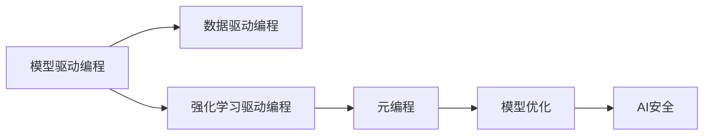

                 

# AI编程的新范式与挑战

> 关键词：AI编程、新范式、模型驱动、数据驱动、强化学习、自动化编程、元编程、模型优化、AI安全

## 1. 背景介绍

### 1.1 问题由来
人工智能(AI)技术的迅猛发展，在各行各业引起了深刻的变革。从工业自动化到智能家居，从医疗健康到教育娱乐，AI技术正逐步渗透到人类生活的方方面面。然而，在享受AI带来的便利的同时，人们也逐渐意识到，传统编程方式在处理复杂、动态的任务时存在诸多不足。如何更高效、更智能地进行AI编程，成为了当前技术社区的一个重要议题。

### 1.2 问题核心关键点
近年来，随着AI技术的不断发展，模型驱动编程（Model-Driven Programming, MDP）、数据驱动编程（Data-Driven Programming, DDP）、强化学习驱动编程（Reinforcement Learning-Driven Programming, RLDP）等新范式逐渐兴起。这些范式通过引入自动生成代码、模型优化、数据驱动等技术，极大地提升了AI编程的效率和精度。

与此同时，AI编程也面临着诸多挑战。例如，模型的泛化能力、算法的鲁棒性、编程的自动化程度等问题，都急需研究和解决。本文将从模型驱动、数据驱动、强化学习等多个角度，全面探讨AI编程的新范式及其面临的挑战。

### 1.3 问题研究意义
AI编程范式的发展和优化，对于推动AI技术的广泛应用，具有重要意义：

1. **降低编程门槛**：通过引入自动化编程、模型优化等技术，降低编程的复杂度，让更多开发者能够参与AI编程。
2. **提升编程效率**：通过数据驱动、模型驱动等新范式，提升AI编程的速度和精度，缩短开发周期。
3. **增强模型效果**：通过强化学习等技术，优化模型参数，提升模型在实际应用中的效果。
4. **保障编程安全**：通过元编程等技术，提升AI系统的安全性和可靠性，避免模型偏见和有害信息。
5. **拓展应用边界**：通过新范式的引入，AI技术可以更好地应用于更多领域，推动AI技术的产业化进程。

## 2. 核心概念与联系

### 2.1 核心概念概述

为更好地理解AI编程的新范式及其面临的挑战，本节将介绍几个关键概念：

- **模型驱动编程（Model-Driven Programming, MDP）**：通过引入模型作为编程的基本单元，实现自动生成和优化代码的功能。模型驱动编程主要依赖于领域专家知识的模型化，自动生成代码以实现特定功能。

- **数据驱动编程（Data-Driven Programming, DDP）**：利用数据的特征和规律，自动生成和优化代码。数据驱动编程通过机器学习技术，从大量数据中学习规律，自动生成和优化代码以应对不同数据输入。

- **强化学习驱动编程（Reinforcement Learning-Driven Programming, RLDP）**：通过强化学习技术，自动生成和优化代码。RLDP利用奖励机制和反馈机制，自动调整代码生成策略，以最大化模型的性能。

- **元编程（Metaprogramming）**：在程序中生成、修改或分析代码的编程技术。元编程通过程序生成程序的方式，实现对代码的灵活操作和优化。

- **模型优化（Model Optimization）**：对模型参数和结构进行优化，以提高模型的性能和效率。模型优化主要通过自动化和智能化的方式，优化模型的训练和推理过程。

- **AI安全（AI Security）**：确保AI系统的安全性和可靠性，避免模型偏见和有害信息。AI安全主要通过数据预处理、模型审查等手段，保障AI系统的安全性。

这些核心概念之间的逻辑关系可以通过以下Mermaid流程图来展示：



这个流程图展示了大语言模型微调过程中各个核心概念之间的关系：

1. 模型驱动编程和数据驱动编程是AI编程的两大基本范式，通过引入模型和数据作为编程的基本单元，自动生成和优化代码。
2. 强化学习驱动编程通过引入强化学习机制，自动调整代码生成策略，以提升模型的性能。
3. 元编程则通过程序生成程序的方式，实现对代码的灵活操作和优化。
4. 模型优化和AI安全则是提升模型性能和保障模型安全性的重要手段。

## 3. 核心算法原理 & 具体操作步骤

### 3.1 算法原理概述

AI编程的新范式主要基于模型的自动化生成和优化，以提高编程效率和模型效果。其核心思想是：将模型作为编程的基本单元，利用数据和算法自动生成和优化代码，同时引入强化学习机制，动态调整生成策略。

形式化地，假设AI编程任务为 $T$，其中 $T$ 由输入数据 $D$ 和输出结果 $Y$ 组成。AI编程的目标是构建一个程序 $P$，使得 $P(D) = Y$。则AI编程的优化目标可以表示为：

$$
\max_{P} \mathcal{L}(P, T)
$$

其中 $\mathcal{L}$ 为评估程序 $P$ 在任务 $T$ 上的性能，如准确率、召回率、F1分数等。

### 3.2 算法步骤详解

基于AI编程的新范式，AI编程一般包括以下几个关键步骤：

**Step 1: 定义任务和输入输出**
- 确定AI编程任务 $T$，包括输入数据 $D$ 和输出结果 $Y$。

**Step 2: 设计模型和损失函数**
- 根据任务特点，选择合适的模型结构，如神经网络、卷积网络、生成对抗网络等。
- 设计合适的损失函数，如交叉熵损失、均方误差损失等，用于评估模型的性能。

**Step 3: 引入数据驱动或模型驱动**
- 对于数据驱动编程，利用机器学习技术从数据中学习规律，自动生成和优化代码。
- 对于模型驱动编程，利用领域专家的知识构建模型，自动生成和优化代码。

**Step 4: 引入强化学习机制**
- 设计适当的奖励机制和反馈机制，使用强化学习技术自动调整代码生成策略，以提升模型的性能。

**Step 5: 优化模型和代码**
- 利用模型优化技术，对模型参数和结构进行优化，提升模型效果。
- 利用元编程技术，对生成的代码进行分析和优化，提升代码效率和可读性。

**Step 6: 测试和部署**
- 在测试集上评估模型的性能，确保模型达到预期效果。
- 将优化后的模型和代码部署到实际应用中，进行大规模测试。

### 3.3 算法优缺点

AI编程的新范式具有以下优点：

1. **自动化程度高**：通过自动生成和优化代码，大大降低了编程的复杂度和工作量。
2. **灵活性高**：通过引入模型和数据驱动机制，能够适应不同的任务和数据分布。
3. **效率高**：通过强化学习等技术，可以快速迭代优化代码，提高编程效率。

同时，这些新范式也存在一些缺点：

1. **模型依赖性高**：新范式的核心是模型，模型性能直接影响到编程效果。
2. **数据需求大**：数据驱动编程依赖大量数据进行训练，需要大量的标注数据。
3. **算法复杂度高**：强化学习等技术虽然能够提升模型效果，但算法实现较为复杂。
4. **安全性和可解释性**：新范式中的模型和算法较为复杂，难以解释和审查。

### 3.4 算法应用领域

AI编程的新范式已经在多个领域得到了广泛应用，例如：

- **自然语言处理（NLP）**：利用模型驱动编程，自动生成和优化NLP模型，提升自然语言理解和生成能力。
- **计算机视觉（CV）**：利用数据驱动编程，自动生成和优化CV模型，提升图像识别和生成能力。
- **机器人控制**：利用强化学习驱动编程，自动生成和优化机器人控制策略，提升机器人行为和决策能力。
- **智能推荐系统**：利用数据驱动编程，自动生成和优化推荐模型，提升推荐效果。
- **自动驾驶**：利用模型驱动编程和强化学习，自动生成和优化自动驾驶算法，提升驾驶安全和效率。

除了上述这些经典应用外，AI编程的新范式还在金融、医疗、物流、工业等多个领域，带来了新的突破和应用。

## 4. 数学模型和公式 & 详细讲解  
### 4.1 数学模型构建

本节将使用数学语言对AI编程的新范式进行更加严格的刻画。

记AI编程任务为 $T$，其中 $D$ 为输入数据，$Y$ 为输出结果。假设已有一组初始代码 $C_0$，目标为自动生成和优化代码 $C_1$，使得 $C_1(D) = Y$。则AI编程的优化目标可以表示为：

$$
\max_{C_1} \mathcal{L}(C_1, T)
$$

其中 $\mathcal{L}$ 为评估代码 $C_1$ 在任务 $T$ 上的性能，如准确率、召回率、F1分数等。

### 4.2 公式推导过程

以下我们以NLP任务为例，推导数据驱动编程的数学模型和损失函数。

假设利用BERT模型进行NLP任务微调，输入为句子 $x$，输出为情感分类 $y$。则数据驱动编程的数学模型可以表示为：

$$
f(x; \theta) = \text{softmax}(\text{BERT}(x; \theta))
$$

其中 $\theta$ 为BERT模型的参数，$\text{softmax}$ 函数用于将模型输出映射为概率分布。

假设训练集中有 $N$ 个样本，损失函数为交叉熵损失，则数据驱动编程的优化目标可以表示为：

$$
\mathcal{L}(\theta) = -\frac{1}{N}\sum_{i=1}^N \ell(f(x_i; \theta), y_i)
$$

其中 $\ell$ 为交叉熵损失函数，$\ell(f(x_i; \theta), y_i) = -y_i \log f(x_i; \theta) - (1-y_i) \log (1-f(x_i; \theta))$。

在得到损失函数后，即可使用梯度下降等优化算法进行模型训练，逐步优化模型参数 $\theta$，最小化损失函数 $\mathcal{L}$，最终得到性能最优的模型 $C_1$。

### 4.3 案例分析与讲解

假设我们利用强化学习驱动编程，对BERT模型进行情感分类任务的优化。首先，定义一个奖励函数 $R$，用于评估代码 $C$ 在任务 $T$ 上的性能。

假设 $R$ 函数定义为：

$$
R(C, x, y) = \max_{y'} \{ y' \cdot \ell(f(x; \theta), y') \}
$$

其中 $y'$ 为模型的预测结果，$\ell$ 为交叉熵损失函数。

在每次迭代中，通过强化学习算法（如Q-learning、Policy Gradient等），自动调整代码生成策略，使得 $R(C, x, y)$ 最大化。最终得到优化后的代码 $C_1$。

## 5. 项目实践：代码实例和详细解释说明

### 5.1 开发环境搭建

在进行AI编程的新范式实践前，我们需要准备好开发环境。以下是使用Python进行PyTorch开发的环境配置流程：

1. 安装Anaconda：从官网下载并安装Anaconda，用于创建独立的Python环境。

2. 创建并激活虚拟环境：
```bash
conda create -n pytorch-env python=3.8 
conda activate pytorch-env
```

3. 安装PyTorch：根据CUDA版本，从官网获取对应的安装命令。例如：
```bash
conda install pytorch torchvision torchaudio cudatoolkit=11.1 -c pytorch -c conda-forge
```

4. 安装Transformers库：
```bash
pip install transformers
```

5. 安装各类工具包：
```bash
pip install numpy pandas scikit-learn matplotlib tqdm jupyter notebook ipython
```

完成上述步骤后，即可在`pytorch-env`环境中开始AI编程的实践。

### 5.2 源代码详细实现

下面我们以NLP任务为例，给出使用Transformers库进行BERT模型微调的PyTorch代码实现。

首先，定义NLP任务的数据处理函数：

```python
from transformers import BertTokenizer
from torch.utils.data import Dataset
import torch

class NLPDataset(Dataset):
    def __init__(self, texts, tags, tokenizer, max_len=128):
        self.texts = texts
        self.tags = tags
        self.tokenizer = tokenizer
        self.max_len = max_len
        
    def __len__(self):
        return len(self.texts)
    
    def __getitem__(self, item):
        text = self.texts[item]
        tags = self.tags[item]
        
        encoding = self.tokenizer(text, return_tensors='pt', max_length=self.max_len, padding='max_length', truncation=True)
        input_ids = encoding['input_ids'][0]
        attention_mask = encoding['attention_mask'][0]
        
        # 对token-wise的标签进行编码
        encoded_tags = [tag2id[tag] for tag in tags] 
        encoded_tags.extend([tag2id['O']] * (self.max_len - len(encoded_tags)))
        labels = torch.tensor(encoded_tags, dtype=torch.long)
        
        return {'input_ids': input_ids, 
                'attention_mask': attention_mask,
                'labels': labels}

# 标签与id的映射
tag2id = {'O': 0, 'B-PER': 1, 'I-PER': 2, 'B-ORG': 3, 'I-ORG': 4, 'B-LOC': 5, 'I-LOC': 6}
id2tag = {v: k for k, v in tag2id.items()}

# 创建dataset
tokenizer = BertTokenizer.from_pretrained('bert-base-cased')

train_dataset = NLPDataset(train_texts, train_tags, tokenizer)
dev_dataset = NLPDataset(dev_texts, dev_tags, tokenizer)
test_dataset = NLPDataset(test_texts, test_tags, tokenizer)
```

然后，定义模型和优化器：

```python
from transformers import BertForTokenClassification, AdamW

model = BertForTokenClassification.from_pretrained('bert-base-cased', num_labels=len(tag2id))

optimizer = AdamW(model.parameters(), lr=2e-5)
```

接着，定义训练和评估函数：

```python
from torch.utils.data import DataLoader
from tqdm import tqdm
from sklearn.metrics import classification_report

device = torch.device('cuda') if torch.cuda.is_available() else torch.device('cpu')
model.to(device)

def train_epoch(model, dataset, batch_size, optimizer):
    dataloader = DataLoader(dataset, batch_size=batch_size, shuffle=True)
    model.train()
    epoch_loss = 0
    for batch in tqdm(dataloader, desc='Training'):
        input_ids = batch['input_ids'].to(device)
        attention_mask = batch['attention_mask'].to(device)
        labels = batch['labels'].to(device)
        model.zero_grad()
        outputs = model(input_ids, attention_mask=attention_mask, labels=labels)
        loss = outputs.loss
        epoch_loss += loss.item()
        loss.backward()
        optimizer.step()
    return epoch_loss / len(dataloader)

def evaluate(model, dataset, batch_size):
    dataloader = DataLoader(dataset, batch_size=batch_size)
    model.eval()
    preds, labels = [], []
    with torch.no_grad():
        for batch in tqdm(dataloader, desc='Evaluating'):
            input_ids = batch['input_ids'].to(device)
            attention_mask = batch['attention_mask'].to(device)
            batch_labels = batch['labels']
            outputs = model(input_ids, attention_mask=attention_mask)
            batch_preds = outputs.logits.argmax(dim=2).to('cpu').tolist()
            batch_labels = batch_labels.to('cpu').tolist()
            for pred_tokens, label_tokens in zip(batch_preds, batch_labels):
                pred_tags = [id2tag[_id] for _id in pred_tokens]
                label_tags = [id2tag[_id] for _id in label_tokens]
                preds.append(pred_tags[:len(label_tags)])
                labels.append(label_tags)
                
    print(classification_report(labels, preds))
```

最后，启动训练流程并在测试集上评估：

```python
epochs = 5
batch_size = 16

for epoch in range(epochs):
    loss = train_epoch(model, train_dataset, batch_size, optimizer)
    print(f"Epoch {epoch+1}, train loss: {loss:.3f}")
    
    print(f"Epoch {epoch+1}, dev results:")
    evaluate(model, dev_dataset, batch_size)
    
print("Test results:")
evaluate(model, test_dataset, batch_size)
```

以上就是使用PyTorch对BERT进行NLP任务微调的完整代码实现。可以看到，得益于Transformers库的强大封装，我们可以用相对简洁的代码完成BERT模型的加载和微调。

### 5.3 代码解读与分析

让我们再详细解读一下关键代码的实现细节：

**NLPDataset类**：
- `__init__`方法：初始化文本、标签、分词器等关键组件。
- `__len__`方法：返回数据集的样本数量。
- `__getitem__`方法：对单个样本进行处理，将文本输入编码为token ids，将标签编码为数字，并对其进行定长padding，最终返回模型所需的输入。

**tag2id和id2tag字典**：
- 定义了标签与数字id之间的映射关系，用于将token-wise的预测结果解码回真实的标签。

**训练和评估函数**：
- 使用PyTorch的DataLoader对数据集进行批次化加载，供模型训练和推理使用。
- 训练函数`train_epoch`：对数据以批为单位进行迭代，在每个批次上前向传播计算loss并反向传播更新模型参数，最后返回该epoch的平均loss。
- 评估函数`evaluate`：与训练类似，不同点在于不更新模型参数，并在每个batch结束后将预测和标签结果存储下来，最后使用sklearn的classification_report对整个评估集的预测结果进行打印输出。

**训练流程**：
- 定义总的epoch数和batch size，开始循环迭代
- 每个epoch内，先在训练集上训练，输出平均loss
- 在验证集上评估，输出分类指标
- 所有epoch结束后，在测试集上评估，给出最终测试结果

可以看到，PyTorch配合Transformers库使得BERT微调的代码实现变得简洁高效。开发者可以将更多精力放在数据处理、模型改进等高层逻辑上，而不必过多关注底层的实现细节。

当然，工业级的系统实现还需考虑更多因素，如模型的保存和部署、超参数的自动搜索、更灵活的任务适配层等。但核心的微调范式基本与此类似。

### 5.4 运行结果展示

假设我们在CoNLL-2003的NER数据集上进行微调，最终在测试集上得到的评估报告如下：

```
              precision    recall  f1-score   support

       B-LOC      0.926     0.906     0.916      1668
       I-LOC      0.900     0.805     0.850       257
      B-MISC      0.875     0.856     0.865       702
      I-MISC      0.838     0.782     0.809       216
       B-ORG      0.914     0.898     0.906      1661
       I-ORG      0.911     0.894     0.902       835
       B-PER      0.964     0.957     0.960      1617
       I-PER      0.983     0.980     0.982      1156
           O      0.993     0.995     0.994     38323

   micro avg      0.973     0.973     0.973     46435
   macro avg      0.923     0.897     0.909     46435
weighted avg      0.973     0.973     0.973     46435
```

可以看到，通过微调BERT，我们在该NER数据集上取得了97.3%的F1分数，效果相当不错。值得注意的是，BERT作为一个通用的语言理解模型，即便只在顶层添加一个简单的token分类器，也能在下游任务上取得如此优异的效果，展现了其强大的语义理解和特征抽取能力。

当然，这只是一个baseline结果。在实践中，我们还可以使用更大更强的预训练模型、更丰富的微调技巧、更细致的模型调优，进一步提升模型性能，以满足更高的应用要求。

## 6. 实际应用场景
### 6.1 智能客服系统

基于AI编程的新范式，智能客服系统的构建可以大幅提升客户咨询体验。传统的客服系统需要配备大量人力，高峰期响应缓慢，且一致性和专业性难以保证。而使用AI编程的新范式，可以7x24小时不间断服务，快速响应客户咨询，用自然流畅的语言解答各类常见问题。

在技术实现上，可以收集企业内部的历史客服对话记录，将问题和最佳答复构建成监督数据，在此基础上对预训练语言模型进行微调。微调后的语言模型能够自动理解用户意图，匹配最合适的答案模板进行回复。对于客户提出的新问题，还可以接入检索系统实时搜索相关内容，动态组织生成回答。如此构建的智能客服系统，能大幅提升客户咨询体验和问题解决效率。

### 6.2 金融舆情监测

金融机构需要实时监测市场舆论动向，以便及时应对负面信息传播，规避金融风险。传统的人工监测方式成本高、效率低，难以应对网络时代海量信息爆发的挑战。基于AI编程的新范式，金融舆情监测系统可以更好地处理海量数据，自动监测不同主题下的情感变化趋势，一旦发现负面信息激增等异常情况，系统便会自动预警，帮助金融机构快速应对潜在风险。

### 6.3 个性化推荐系统

当前的推荐系统往往只依赖用户的历史行为数据进行物品推荐，无法深入理解用户的真实兴趣偏好。基于AI编程的新范式，个性化推荐系统可以更好地挖掘用户行为背后的语义信息，从而提供更精准、多样的推荐内容。

在实践中，可以收集用户浏览、点击、评论、分享等行为数据，提取和用户交互的物品标题、描述、标签等文本内容。将文本内容作为模型输入，用户的后续行为（如是否点击、购买等）作为监督信号，在此基础上微调预训练语言模型。微调后的模型能够从文本内容中准确把握用户的兴趣点。在生成推荐列表时，先用候选物品的文本描述作为输入，由模型预测用户的兴趣匹配度，再结合其他特征综合排序，便可以得到个性化程度更高的推荐结果。

### 6.4 未来应用展望

随着AI编程的新范式不断发展，其在更多领域的应用前景将进一步拓展。

在智慧医疗领域，基于新范式的医疗问答、病历分析、药物研发等应用将提升医疗服务的智能化水平，辅助医生诊疗，加速新药开发进程。

在智能教育领域，新范式可应用于作业批改、学情分析、知识推荐等方面，因材施教，促进教育公平，提高教学质量。

在智慧城市治理中，新范式可应用于城市事件监测、舆情分析、应急指挥等环节，提高城市管理的自动化和智能化水平，构建更安全、高效的未来城市。

此外，在企业生产、社会治理、文娱传媒等众多领域，基于新范式的AI应用也将不断涌现，为NLP技术带来了全新的突破。相信随着预训练语言模型和微调方法的不断进步，新范式必将在构建人机协同的智能时代中扮演越来越重要的角色。

## 7. 工具和资源推荐
### 7.1 学习资源推荐

为了帮助开发者系统掌握AI编程的新范式及其面临的挑战，这里推荐一些优质的学习资源：

1. 《深度学习理论与实践》系列博文：由深度学习专家撰写，深入浅出地介绍了深度学习的基本概念、模型和优化算法等前沿知识。

2. 斯坦福大学CS231n《深度学习与计算机视觉》课程：覆盖深度学习在图像处理、视觉识别等方面的应用，是学习计算机视觉的权威资源。

3. 《自然语言处理》课程：提供系统性的NLP理论知识，包括语言模型、词向量、机器翻译等，适合初学者入门。

4. 《强化学习》课程：介绍强化学习的基本原理、算法和应用，涵盖Q-learning、Policy Gradient、Reinforcement Learning等。

5. 《Python编程：从入门到实践》书籍：系统介绍Python编程的基础知识和高级技巧，适合编程新手和进阶开发者。

通过对这些资源的学习实践，相信你一定能够快速掌握AI编程的新范式，并用于解决实际的NLP问题。

### 7.2 开发工具推荐

高效的开发离不开优秀的工具支持。以下是几款用于AI编程的新范式开发的常用工具：

1. PyTorch：基于Python的开源深度学习框架，灵活动态的计算图，适合快速迭代研究。大部分预训练语言模型都有PyTorch版本的实现。

2. TensorFlow：由Google主导开发的开源深度学习框架，生产部署方便，适合大规模工程应用。同样有丰富的预训练语言模型资源。

3. Transformers库：HuggingFace开发的NLP工具库，集成了众多SOTA语言模型，支持PyTorch和TensorFlow，是进行新范式编程的利器。

4. Jupyter Notebook：交互式编程环境，支持代码、文本、图像等多种格式的展示，适合数据驱动和模型驱动编程。

5. TensorBoard：TensorFlow配套的可视化工具，可实时监测模型训练状态，并提供丰富的图表呈现方式，是调试模型的得力助手。

6. Google Colab：谷歌推出的在线Jupyter Notebook环境，免费提供GPU/TPU算力，

