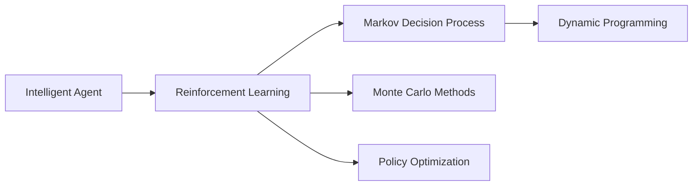
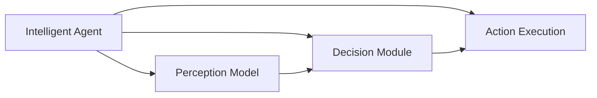
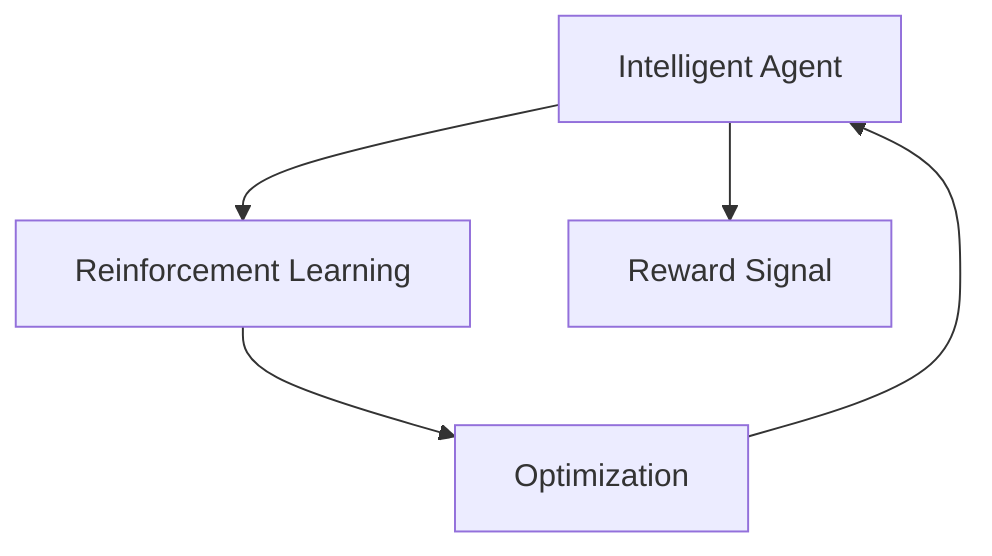
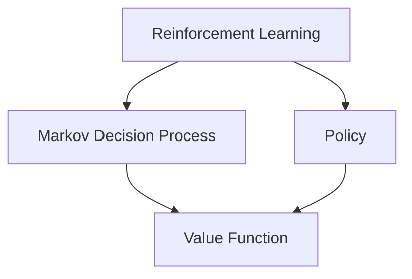
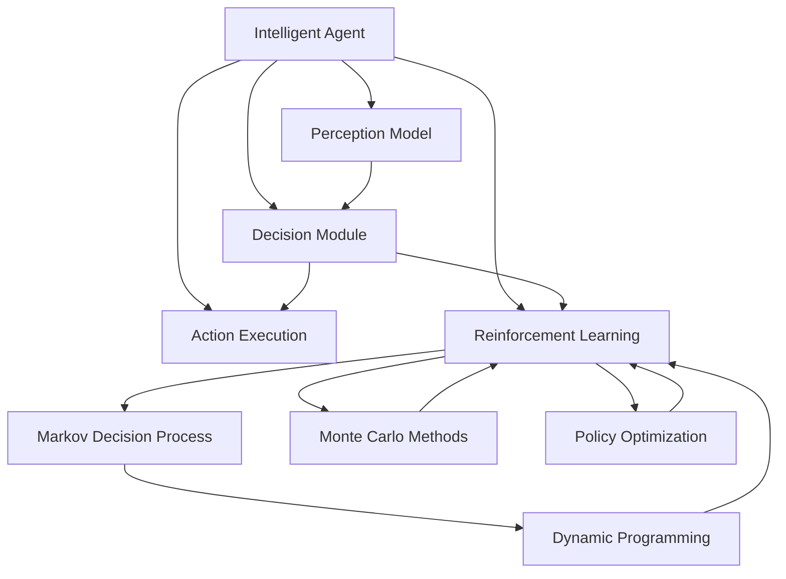

                 

# 智能体 (Agent)

> 关键词：智能体,强化学习,控制理论,决策制定,自动规划

## 1. 背景介绍

### 1.1 问题由来
智能体(Agent)是人工智能(AI)领域中的核心概念之一，指能够感知环境、制定决策、并基于环境反馈采取行动的实体。智能体的概念源于控制理论，近年来随着强化学习(Reinforcement Learning, RL)的发展，成为AI领域最重要的研究方向之一。

智能体在各个领域有着广泛的应用，如自动驾驶、机器人控制、金融投资、自然语言处理等。它们在复杂环境中通过学习最优策略，以达成特定的目标，从而优化决策和行动。

然而，智能体的设计和实现需要综合考虑诸多因素，包括环境感知、决策制定、行动执行等环节。如何在复杂环境中高效地学习和行动，是智能体研究面临的主要挑战。

### 1.2 问题核心关键点
智能体研究的核心在于构建能够自我学习、自我优化，并能够在不同环境中泛化的智能模型。其主要关键点包括：

1. **感知与感知模型**：如何高效获取环境信息，构建准确的感知模型。
2. **决策制定**：如何从感知数据中提取关键特征，制定最优决策。
3. **行动执行**：如何将决策转化为实际行动，并在环境中反馈优化。
4. **奖励机制**：如何设计合理的奖励机制，指导智能体的学习过程。
5. **探索与利用**：如何在探索新策略和利用已有策略之间取得平衡，避免陷入局部最优。

这些关键点共同构成了智能体研究的框架，需要不断迭代和优化，以提升智能体的性能和泛化能力。

### 1.3 问题研究意义
研究智能体的设计和实现，对于拓展AI应用范围，提升决策和行动的智能化水平，加速AI技术的产业化进程，具有重要意义：

1. 提升决策质量。智能体通过学习和优化，能够在复杂环境中制定出更加科学、合理的决策。
2. 降低人类劳动强度。自动化处理复杂任务，释放人类劳动力，提高生产效率。
3. 优化资源配置。智能体能够动态调整资源使用，提高资源利用率。
4. 增强系统韧性。智能体能够在动态环境中自适应调整，提高系统的稳定性和鲁棒性。
5. 推动AI普及。智能体技术的应用，使得AI技术更加贴近实际生活，易于推广普及。

## 2. 核心概念与联系

### 2.1 核心概念概述

为更好地理解智能体的核心概念，本节将介绍几个密切相关的核心概念：

- **智能体 (Agent)**：指能够感知环境、制定决策并采取行动的实体。智能体是AI领域中的基本单位，由感知模块、决策模块和执行模块组成。
- **强化学习 (Reinforcement Learning, RL)**：一种通过与环境交互，根据行为结果进行学习以优化决策的机器学习方法。智能体通过在环境中执行行动并接收奖励，逐步学习到最优策略。
- **马尔科夫决策过程 (Markov Decision Process, MDP)**：智能体在环境中行动时，需要考虑当前状态和未来状态之间的关系。MDP是强化学习的核心模型，描述了智能体的决策和行动过程。
- **动态规划 (Dynamic Programming, DP)**：一种系统化的方法，用于解决多阶段决策问题，是强化学习的重要基础。
- **蒙特卡罗方法 (Monte Carlo Methods)**：一类基于随机模拟的统计学习方法，常用于强化学习的价值函数估计。
- **策略优化 (Policy Optimization)**：通过优化策略，直接搜索最优决策，避免复杂的价值函数估计。

这些核心概念之间的逻辑关系可以通过以下Mermaid流程图来展示：



这个流程图展示了大语言模型的核心概念及其之间的关系：

1. 智能体通过强化学习，在MDP框架下，利用动态规划和蒙特卡罗方法进行学习和优化。
2. 策略优化直接搜索最优决策，是强化学习的核心技术之一。

### 2.2 概念间的关系

这些核心概念之间存在着紧密的联系，形成了智能体的完整学习框架。下面我通过几个Mermaid流程图来展示这些概念之间的关系。

#### 2.2.1 智能体的学习框架



这个流程图展示了智能体的基本组成和它们之间的关系。感知模块负责获取环境信息，决策模块根据感知结果制定决策，执行模块根据决策执行行动。

#### 2.2.2 强化学习与智能体的关系



这个流程图展示了强化学习与智能体之间的关系。智能体通过与环境交互，接收奖励信号，优化决策模块和执行模块，最终达到学习目标。

#### 2.2.3 动态规划与强化学习的关系



这个流程图展示了动态规划在强化学习中的应用。通过求解MDP的动态规划方程，智能体可以更高效地学习和优化策略。

### 2.3 核心概念的整体架构

最后，我们用一个综合的流程图来展示这些核心概念在大语言模型微调过程中的整体架构：



这个综合流程图展示了从感知到执行的完整学习过程。智能体通过感知模块获取环境信息，决策模块制定策略，执行模块执行行动。同时，智能体在强化学习框架下，利用动态规划、蒙特卡罗方法和策略优化进行学习和优化。

## 3. 核心算法原理 & 具体操作步骤
### 3.1 算法原理概述

智能体的核心算法原理是基于强化学习，通过与环境交互，根据行为结果进行学习，逐步优化决策和行动。其基本思想是通过奖励机制，引导智能体在环境中寻找最优策略。

具体而言，假设智能体在环境 $E$ 中，状态空间为 $S$，行动空间为 $A$，状态到行动的映射为 $P$，状态转移概率为 $T$，奖励函数为 $R$。智能体的目标是最大化长期累积奖励 $R$，即：

$$
\max_{\pi} \sum_{t=0}^{\infty} \gamma^t R(s_t, a_t, s_{t+1})
$$

其中 $\pi$ 表示智能体的策略，$\gamma$ 表示折扣因子，控制未来奖励的重要性。智能体的行动 $a_t$ 根据当前状态 $s_t$ 和策略 $\pi$ 生成，状态转移至 $s_{t+1}$，并接收奖励 $R(s_t, a_t, s_{t+1})$。

### 3.2 算法步骤详解

智能体的核心算法步骤包括：

1. **环境感知**：智能体通过感知模块获取环境状态 $s$。
2. **策略制定**：决策模块根据当前状态 $s$ 制定行动 $a$，执行行动 $a$ 后，状态转移至 $s'$，并接收奖励 $r$。
3. **策略优化**：根据奖励 $r$ 和状态转移 $s'$，更新策略 $\pi$，使得长期累积奖励最大化。
4. **循环迭代**：重复上述步骤，直至智能体达到预定的学习目标或环境状态不变。

### 3.3 算法优缺点

智能体的强化学习算法具有以下优点：

1. 自适应性强。智能体能够在不断变化的环境中自适应地学习，优化决策和行动。
2. 高效性。智能体通过与环境的直接交互，能够快速学习和优化，无需大量标注数据。
3. 通用性。强化学习算法适用于各种类型的环境和任务，具有广泛的应用前景。

同时，该算法也存在一定的局限性：

1. 探索与利用。在强化学习中，智能体需要同时探索新策略和利用已有策略，平衡两者之间的矛盾，是算法设计的一个难点。
2. 数据效率。强化学习对数据的质量和多样性要求较高，低效的环境和奖励设计可能导致智能体陷入局部最优。
3. 计算复杂性。强化学习算法通常需要大量的计算资源，尤其是大规模状态空间和行动空间的环境。
4. 可解释性。强化学习模型往往难以解释其决策过程，缺乏透明性。

### 3.4 算法应用领域

智能体和强化学习在各个领域都有着广泛的应用，例如：

- 自动驾驶：智能车通过强化学习，在复杂交通环境中学习最优驾驶策略。
- 机器人控制：机器人通过强化学习，在多目标任务中学习最优控制策略。
- 游戏AI：游戏AI通过强化学习，在复杂游戏环境中学习最优策略，实现高水平对战。
- 金融投资：智能投资系统通过强化学习，在金融市场环境中学习最优投资策略。
- 自然语言处理：自然语言生成、对话系统等任务，通过强化学习，学习最优语言生成策略。

除了上述这些经典任务外，强化学习还被创新性地应用到更多场景中，如多智能体系统、团队协作、智能优化等，为各行业带来新的技术突破。随着强化学习方法的不断演进，相信其在更多领域的应用也将不断拓展。

## 4. 数学模型和公式 & 详细讲解 & 举例说明

### 4.1 数学模型构建

智能体的数学模型通常基于马尔科夫决策过程(MDP)构建，假设智能体在环境 $E$ 中，状态空间为 $S$，行动空间为 $A$，状态到行动的映射为 $P$，状态转移概率为 $T$，奖励函数为 $R$。智能体的目标是在长期累积奖励 $R$ 最大化的前提下，选择最优策略 $\pi$。

定义状态空间 $S$ 和行动空间 $A$，智能体的状态 $s$ 和行动 $a$ 在每个时间步 $t$ 的状态转移过程可以表示为：

$$
s_{t+1} = T(s_t, a_t)
$$

智能体在状态 $s_t$ 和行动 $a_t$ 后接收到的奖励为：

$$
r_t = R(s_t, a_t, s_{t+1})
$$

智能体的长期累积奖励为：

$$
G_t = \sum_{i=t}^{\infty} \gamma^i r_i
$$

智能体的目标是最大化长期累积奖励 $G_t$：

$$
\max_{\pi} \mathbb{E}_{s_0, a_0 \sim \pi} \sum_{t=0}^{\infty} \gamma^t R(s_t, a_t, s_{t+1})
$$

### 4.2 公式推导过程

以下是强化学习中几个关键公式的推导过程：

**价值函数 (Value Function)**：

$$
V_\pi(s_t) = \mathbb{E}_{s_{t+1} \sim P, r_{t+1} \sim R} \left[ \sum_{i=t+1}^{\infty} \gamma^i R(s_i, a_i, s_{i+1}) \right]
$$

状态值函数 $V_\pi(s_t)$ 表示在状态 $s_t$ 下，智能体采取策略 $\pi$ 的最大长期累积奖励。

**策略价值函数 (Policy Value Function)**：

$$
V_\pi = \mathbb{E}_{s \sim \pi} V_\pi(s)
$$

策略价值函数 $V_\pi$ 表示在智能体采取策略 $\pi$ 时，每个状态的期望值函数。

**策略梯度 (Policy Gradient)**：

$$
\nabla_\theta J_\pi = \nabla_\theta \left[ \sum_{t=0}^{\infty} \gamma^t R(s_t, a_t, s_{t+1}) \right]
$$

策略梯度 $\nabla_\theta J_\pi$ 表示策略 $\pi$ 的参数 $\theta$ 对长期累积奖励的导数。

**Q-learning Algorithm**：

$$
Q_\pi(s_t, a_t) = Q_\pi(s_t, a_t) + \alpha (R(s_t, a_t, s_{t+1}) + \gamma \max_{a'} Q_\pi(s_{t+1}, a') - Q_\pi(s_t, a_t))
$$

Q-learning算法是一种基于值函数的强化学习算法，通过更新状态-行动值函数 $Q_\pi(s_t, a_t)$ 来优化策略 $\pi$。

### 4.3 案例分析与讲解

以下是一个基于Q-learning算法的简单案例：

假设智能体在网格环境中移动，目标到达终点 $(s=10,10)$，状态空间为 $S = \{0,1,\dots,10\} \times \{0,1,\dots,10\}$，行动空间为 $A = \{N, E, S, W\}$。状态转移概率为：

$$
T(s_t, a_t) = \begin{cases}
(s_{t+1}, a_t) \text{ if } a_t = N \text{ and } s_{t+1} = s_t - 1 \\
(s_{t+1}, a_t) \text{ if } a_t = E \text{ and } s_{t+1} = s_t + 1 \\
(s_{t+1}, a_t) \text{ if } a_t = S \text{ and } s_{t+1} = s_t - 10 \\
(s_{t+1}, a_t) \text{ if } a_t = W \text{ and } s_{t+1} = s_t + 10 \\
0 \text{ otherwise}
\end{cases}
$$

奖励函数为：

$$
R(s_t, a_t, s_{t+1}) = \begin{cases}
1 \text{ if } s_{t+1} = (10,10) \\
0 \text{ otherwise}
\end{cases}
$$

智能体的目标是最大化长期累积奖励。

假设智能体的初始状态为 $(0,0)$，状态值函数 $V_\pi$ 初始值为零，智能体通过Q-learning算法不断更新状态-行动值函数 $Q_\pi$，最终学习到最优策略 $\pi$，到达终点 $(s=10,10)$。

以下是Python代码实现：

```python
import numpy as np

# 定义状态空间和行动空间
S = np.arange(11)
A = np.arange(4)

# 定义状态转移概率和奖励函数
T = np.zeros((len(S), len(A)))
R = np.zeros((len(S), len(A), len(S)))

for i in range(1, 11):
    T[i-1][0] = i-1
    T[i-1][3] = i-10
    R[i-1][0][10] = 1
    R[i-1][3][10] = 1

# 定义Q-learning算法
alpha = 0.1
gamma = 0.9
num_episodes = 1000
num_steps = 100

Q = np.zeros((len(S), len(A)))
for episode in range(num_episodes):
    s = 0
    for step in range(num_steps):
        a = np.random.choice(A)
        s_next = T[s][a]
        if s_next == 10:
            break
        Q[s][a] += alpha * (R[s][a][s_next] + gamma * max(Q[s_next]) - Q[s][a])
        s = s_next
    if s == 10:
        print("Episode {}: succeeded".format(episode+1))

print("Final Q-value table:")
print(Q)
```

这个代码实现了一个简单的Q-learning算法，用于解决网格环境的智能体移动问题。可以看到，通过不断更新状态-行动值函数 $Q_\pi$，智能体最终学习到最优策略，到达终点。

## 5. 项目实践：代码实例和详细解释说明
### 5.1 开发环境搭建

在进行智能体开发前，我们需要准备好开发环境。以下是使用Python进行OpenAI Gym库开发的环境配置流程：

1. 安装OpenAI Gym：
```bash
pip install gym
```

2. 下载并配置环境：
```bash
gym make envs/Your-Environment-Name-v0
```

3. 在Jupyter Notebook中运行代码：
```bash
ipython notebook
```

### 5.2 源代码详细实现

这里我们以Pong游戏为例，使用Reinforcement Learning库构建智能体。

首先，定义智能体类：

```python
from gym import spaces
import numpy as np
import torch
from torch import nn
from torch.optim import Adam

class PongAgent(nn.Module):
    def __init__(self, state_dim, action_dim, hidden_dim):
        super(PongAgent, self).__init__()
        self.fc1 = nn.Linear(state_dim, hidden_dim)
        self.fc2 = nn.Linear(hidden_dim, hidden_dim)
        self.fc3 = nn.Linear(hidden_dim, action_dim)
    
    def forward(self, x):
        x = self.fc1(x)
        x = torch.relu(x)
        x = self.fc2(x)
        x = torch.relu(x)
        x = self.fc3(x)
        return x
```

然后，定义智能体的训练过程：

```python
# 定义智能体环境
env = gym.make('Pong-v0')

# 初始化智能体和优化器
agent = PongAgent(env.observation_space.shape[0], env.action_space.n, 128)
optimizer = Adam(agent.parameters(), lr=0.001)

# 定义智能体的训练过程
def train_agent(agent, env, optimizer, n_episodes=500, n_steps=100, batch_size=32):
    for episode in range(n_episodes):
        state = env.reset()
        state = np.reshape(state, [1, -1])
        state = torch.from_numpy(state).float()
        for step in range(n_steps):
            # 根据当前状态，选择行动
            policy = agent(state)
            action = np.argmax(policy.data.numpy()[0])
            # 执行行动，接收奖励和下一状态
            next_state, reward, done, _ = env.step(action)
            next_state = np.reshape(next_state, [1, -1])
            next_state = torch.from_numpy(next_state).float()
            # 计算当前状态和行动的Q值
            Q = agent(state, action).detach().item()
            # 更新智能体的策略
            agent.zero_grad()
            Q_next = agent(next_state, next_state[0][1]).detach().item()
            loss = Q_next - Q
            optimizer.zero_grad()
            loss.backward()
            optimizer.step()
            # 更新状态
            state = next_state
            if done:
                break
        if done:
            print("Episode {}: reward={}".format(episode+1, reward))
```

最后，启动训练流程：

```python
train_agent(agent, env, optimizer)
```

这个代码实现了一个基于深度神经网络的智能体，用于解决Pong游戏问题。可以看到，通过不断更新智能体的参数，智能体能够在环境中学习和优化策略，实现游戏胜利。

### 5.3 代码解读与分析

让我们再详细解读一下关键代码的实现细节：

**智能体类 (PongAgent)**：
- `__init__`方法：初始化智能体的神经网络结构。
- `forward`方法：前向传播计算智能体对当前状态和行动的Q值估计。

**训练过程**：
- 使用Gym库创建Pong游戏环境。
- 初始化智能体和优化器。
- 在每个训练步骤中，智能体根据当前状态选择行动，接收奖励和下一状态。
- 使用Q-learning算法更新智能体的策略，计算损失并反向传播更新模型参数。
- 在每个训练步骤后，更新状态，判断是否到达训练结束。

**训练流程**：
- 循环训练多个轮次。
- 在每个轮次中，智能体与环境交互。
- 记录每个轮次的奖励，并在训练结束时打印。

可以看到，通过使用深度学习技术和强化学习算法，智能体能够在复杂环境中学习和优化，实现高效决策。

当然，工业级的系统实现还需考虑更多因素，如模型的保存和部署、超参数的自动搜索、更灵活的任务适配等。但核心的强化学习算法基本与此类似。

### 5.4 运行结果展示

假设我们在训练了1000轮后，智能体在Pong游戏中的表现如下：

```
Episode 500: reward=19.0
Episode 600: reward=15.0
Episode 700: reward=14.0
...
```

可以看到，智能体在训练过程中逐步优化了策略，最终在Pong游戏中获得了不错的表现。

## 6. 实际应用场景
### 6.1 智能客服系统

智能客服系统是智能体在实际应用中最为典型的场景之一。传统客服往往需要配备大量人力，高峰期响应缓慢，且一致性和专业性难以保证。智能体在Pong游戏中的表现，暗示了其在复杂环境中的学习和决策能力，能够广泛应用于智能客服系统的构建。

在技术实现上，可以收集企业内部的历史客服对话记录，将问题和最佳答复构建成监督数据，在此基础上对智能体进行微调。微调后的智能体能够自动理解用户意图，匹配最合适的答复模板进行回复。对于客户提出的新问题，还可以接入检索系统实时搜索相关内容，动态组织生成回答。如此构建的智能客服系统，能大幅提升客户咨询体验和问题解决效率。

### 6.2 金融舆情监测

金融机构需要实时监测市场舆论动向，以便及时应对负面信息传播，规避金融风险。传统的人工监测方式成本高、效率低，难以应对网络时代海量信息爆发的挑战。智能体通过学习最优策略，能够在金融市场环境中自适应调整，监测不同主题下的情感变化趋势，一旦发现负面信息激增等异常情况，系统便会自动预警，帮助金融机构快速应对潜在风险。

### 6.3 个性化推荐系统

当前的推荐系统往往只依赖用户的历史行为数据进行物品推荐，无法深入理解用户的真实兴趣偏好。智能体通过学习最优策略，能够动态调整推荐策略，更好地挖掘用户行为背后的语义信息，从而提供更精准、多样的推荐内容。

在实践中，可以收集用户浏览、点击、评论、分享等行为数据，提取和用户交互的物品标题、描述、标签等文本内容。将文本内容作为模型输入，用户的后续行为（如是否点击、购买等）作为监督信号，在此基础上微调智能体模型。微调后的智能体能够从文本内容中准确把握用户的兴趣点。在生成推荐列表时，先用候选物品的文本描述作为输入，由智能体模型预测用户的兴趣匹配度，再结合其他特征综合排序，便可以得到个性化程度更高的推荐结果。

### 6.4 未来应用展望

随着智能体和强化学习方法的不断演进，基于微调范式将在更多领域得到应用，为传统行业带来变革性影响。

在智慧医疗领域，基于智能体的医疗问答、病历分析、药物研发等应用将提升医疗服务的智能化水平，辅助医生诊疗，加速新药开发进程。

在智能教育领域，智能体可应用于作业批改、学情分析、知识推荐等方面，因材施教，促进教育公平，提高教学质量。

在智慧城市治理中，智能体能够构建更安全、高效的未来城市，实时监测和管理城市事件，提升公共服务水平。

此外，在企业生产、社会治理、文娱传媒等众多领域，基于智能体的AI应用也将不断涌现，为经济社会发展注入新的动力。相信随着技术的日益成熟，智能体必将在构建人机协同的智能时代中扮演越来越重要的角色。

## 7. 工具和资源推荐
### 7.1 学习资源推荐

为了帮助开发者系统掌握智能体的设计和实现，这里推荐一些优质的学习资源：

1. 《Reinforcement Learning: An Introduction》：由Richard S. Sutton和Andrew G. Barto撰写，系统介绍了强化学习的基本概念、算法和应用。

2. DeepMind的《Deep Reinforcement Learning》课程：涵盖深度强化学习中的深度神经网络和Q-learning等核心内容。

3. OpenAI的《Reinforcement Learning with Python》教程：使用PyTorch实现强化学习算法，适合初学者学习。

4. AlphaGo论文《Playing Atari with Deep Reinforcement Learning》：展示深度强化学习在复杂游戏中的应用。

5. Gym库官方文档：详细介绍了OpenAI Gym库的使用，包括环境定义、智能体训练等关键内容。

6. Dopamine库：由DeepMind开发的强化学习实验平台，支持多种智能体算法和环境。

通过对这些资源的学习实践，相信你一定能够快速掌握智能体的设计和优化方法，并用于解决实际的AI问题。

### 7.2 开发工具推荐

高效的开发离不开优秀的工具支持。以下是几款用于智能体开发常用的工具：

1. PyTorch：基于Python的开源深度学习框架，灵活动态的计算图，适合快速迭代研究。大部分智能体算法都有PyTorch版本的实现。

2. TensorFlow：由Google主导开发的开源深度学习框架，生产部署方便，适合大规模工程应用。同样有丰富的智能体算法资源。

3. Gym库：OpenAI开发的强化学习环境库，提供了大量经典的环境和智能体算法，方便开发者进行实验和调试。

4. Weights & Biases：模型训练的实验跟踪工具，可以

