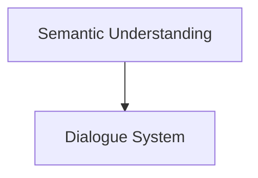
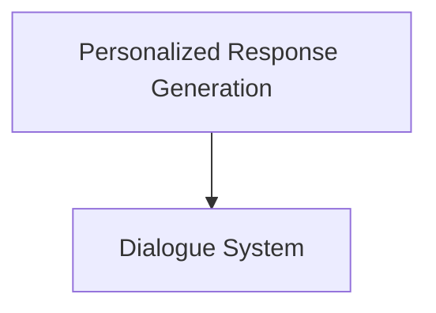
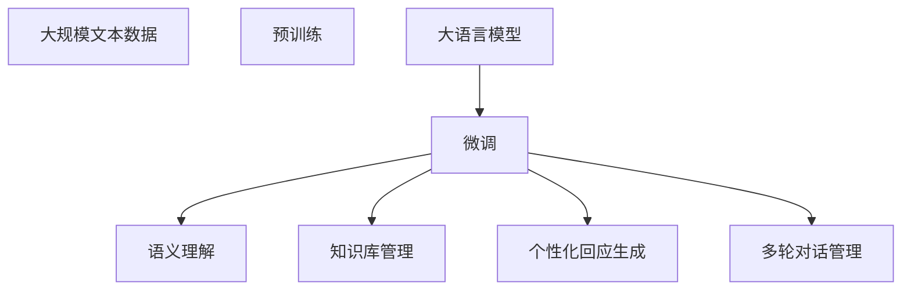

                 

# 智能化回应在CUI中的实现

> 关键词：智能交互，自然语言处理，对话系统，语义理解，个性化回应

## 1. 背景介绍

### 1.1 问题由来
随着人工智能技术的快速发展，人机交互方式正在发生根本性的变化。从传统的基于键盘和鼠标的交互，到基于语音和图像的交互，智能化的自然语言处理（Natural Language Processing，NLP）正在逐步替代传统的交互方式。而在自然语言处理中，智能化回应是实现人机交互的重要一环。通过自然语言处理技术，能够使计算机能够理解和生成自然语言，从而实现高效、自然的交流。

### 1.2 问题核心关键点
智能化回应是指通过自然语言处理技术，使计算机能够理解用户的自然语言输入，并根据语义生成合适的回应。其核心关键点包括：

1. **语义理解**：能够准确地理解和解释用户的自然语言输入。
2. **知识库管理**：能够存储和管理与任务相关的知识库，为智能化回应提供支持。
3. **个性化回应生成**：能够根据用户的输入生成个性化、多样化的回应，提高用户的满意度。
4. **多轮对话管理**：能够维护多轮对话的上下文，保证对话的连贯性。

### 1.3 问题研究意义
智能化回应在智能客服、智能家居、智能助手等多个领域都有广泛的应用，对于提升用户体验、提高服务质量、降低人力成本等方面具有重要意义。其研究意义包括：

1. 提升用户体验：通过智能化回应，用户能够与计算机进行更加自然、高效的交流，提升使用满意度。
2. 提高服务质量：智能化回应能够快速、准确地理解用户的输入，生成符合预期的回应，提高服务效率和质量。
3. 降低人力成本：智能化回应能够替代部分人工客服和助手的工作，降低企业的人力成本。
4. 拓展应用范围：智能化回应能够应用于多个领域，提升技术的应用价值。

## 2. 核心概念与联系

### 2.1 核心概念概述

为更好地理解智能化回应的核心技术，本节将介绍几个密切相关的核心概念：

- **自然语言处理（NLP）**：研究计算机如何理解和生成自然语言的技术，包括分词、词性标注、命名实体识别、句法分析、语义理解、信息抽取、机器翻译等。
- **对话系统**：能够通过自然语言处理技术，实现人机对话的系统，包括对话管理、自然语言理解、回应生成、多轮对话维护等。
- **语义理解**：指计算机理解自然语言输入的语义信息，包括实体识别、关系抽取、情感分析等。
- **知识库管理**：指存储和管理与特定任务相关的知识库，为智能化回应提供支持。
- **个性化回应生成**：指根据用户的输入，生成符合个性化需求的回应，包括基于上下文的回应、基于用户偏好的回应等。
- **多轮对话管理**：指维护多轮对话的上下文，确保对话的连贯性和正确性，包括上下文跟踪、对话状态维护等。

这些核心概念之间的逻辑关系可以通过以下Mermaid流程图来展示：

```mermaid
graph LR
    A[Natural Language Processing (NLP)]
    B[Dialogue System]
    C[Semantic Understanding]
    D[Knowledge Base Management]
    E[Personalized Response Generation]
    F[Multi-Round Dialog Management]
    A --> B
    B --> C
    B --> D
    B --> E
    B --> F
```

这个流程图展示了大语言模型微调过程中各个核心概念之间的关系：

1. 自然语言处理是对话系统的基础，对话系统通过自然语言处理技术实现人机对话。
2. 语义理解是自然语言处理的核心，对话系统通过语义理解准确理解用户的输入。
3. 知识库管理为对话系统提供支持，存储和管理相关知识。
4. 个性化回应生成使对话系统更加智能，根据用户需求生成个性化回应。
5. 多轮对话管理保证对话的连贯性和正确性。

### 2.2 概念间的关系

这些核心概念之间存在着紧密的联系，形成了对话系统的完整生态系统。下面我们通过几个Mermaid流程图来展示这些概念之间的关系。

#### 2.2.1 自然语言处理和对话系统的关系

```mermaid
graph TB
    A[Natural Language Processing (NLP)]
    B[Dialogue System]
    A --> B
```

这个流程图展示了大语言模型微调过程中自然语言处理和对话系统之间的关系。自然语言处理是对话系统的基础，通过自然语言处理技术，对话系统能够实现人机对话。

#### 2.2.2 语义理解和对话系统之间的关系



这个流程图展示了大语言模型微调过程中语义理解和对话系统之间的关系。语义理解是对话系统的核心，通过语义理解，对话系统能够准确理解用户的输入。

#### 2.2.3 个性化回应生成和对话系统之间的关系



这个流程图展示了大语言模型微调过程中个性化回应生成和对话系统之间的关系。个性化回应生成使对话系统更加智能，能够根据用户需求生成个性化回应。

#### 2.2.4 多轮对话管理与对话系统之间的关系


这个流程图展示了大语言模型微调过程中多轮对话管理与对话系统之间的关系。多轮对话管理保证对话的连贯性和正确性。

### 2.3 核心概念的整体架构

最后，我们用一个综合的流程图来展示这些核心概念在大语言模型微调过程中的整体架构：



这个综合流程图展示了从预训练到微调，再到语义理解、知识库管理、个性化回应生成和多轮对话管理的完整过程。大语言模型首先在大规模文本数据上进行预训练，然后通过微调实现语义理解和个性化回应生成，最后通过知识库管理和多轮对话管理保证对话的连贯性和正确性。

## 3. 核心算法原理 & 具体操作步骤

### 3.1 算法原理概述

智能化回应通常基于自然语言处理和机器学习技术实现。其核心算法包括：

1. **语义理解算法**：通过自然语言处理技术，理解用户的输入，提取关键信息。
2. **知识库查询算法**：在知识库中查找相关信息，为智能化回应提供支持。
3. **回应生成算法**：根据用户的输入和知识库中的信息，生成合适的回应。
4. **对话管理算法**：维护多轮对话的上下文，确保对话的连贯性和正确性。

### 3.2 算法步骤详解

基于自然语言处理和机器学习的智能化回应算法一般包括以下几个关键步骤：

**Step 1: 准备数据和知识库**

- 收集对话数据和用户交互记录，并进行预处理，去除噪音数据。
- 构建或获取与任务相关的知识库，包括实体、关系、规则等。

**Step 2: 构建模型**

- 选择合适的自然语言处理模型，如BERT、GPT等，进行预训练。
- 构建对话系统，包括语义理解、知识库查询、回应生成、多轮对话管理等模块。

**Step 3: 模型训练**

- 在对话数据上进行训练，优化模型参数，使其能够准确理解用户输入，生成合适的回应。
- 在知识库上训练模型，使其能够快速查找相关信息，支持回应生成。

**Step 4: 模型评估**

- 在测试数据集上评估模型性能，包括语义理解准确率、知识库查询速度、回应生成质量等。
- 进行多轮对话测试，确保模型能够在多轮对话中保持上下文连贯性和正确性。

**Step 5: 模型部署**

- 将训练好的模型部署到实际应用场景中，进行实时对话交互。
- 定期更新模型和知识库，保证模型的持续性和适应性。

### 3.3 算法优缺点

智能化回应的主要优点包括：

1. **高效性**：通过自然语言处理和机器学习技术，可以快速理解和生成回应，提高人机交互效率。
2. **智能化**：能够根据用户的输入和知识库中的信息，生成符合预期的回应，提高用户体验。
3. **可扩展性**：对话系统和知识库可以随着任务的扩展而扩展，适应不同的应用场景。

其缺点主要包括：

1. **依赖数据和知识库**：智能化回应效果取决于对话数据和知识库的质量，数据不足或知识库不准确都会影响效果。
2. **计算资源需求高**：自然语言处理和机器学习模型需要大量的计算资源，尤其是在大规模数据上训练时，计算资源需求较高。
3. **可解释性不足**：智能化回应通常是“黑盒”系统，难以解释其内部工作机制和决策逻辑。

### 3.4 算法应用领域

智能化回应技术已经在多个领域得到广泛应用，包括：

- **智能客服**：通过自然语言处理技术，实现自动化客服，提高服务效率和质量。
- **智能助手**：提供个性化的智能助手，帮助用户完成各种任务，如日程管理、信息查询等。
- **智能家居**：通过自然语言处理技术，实现智能家居控制，提高生活质量。
- **智能健康**：提供智能健康咨询，帮助用户管理健康信息，提供个性化建议。
- **智能教育**：通过自然语言处理技术，提供个性化教育服务，提升学习效率。

## 4. 数学模型和公式 & 详细讲解  
### 4.1 数学模型构建

基于自然语言处理和机器学习的智能化回应算法，其数学模型可以抽象为以下形式：

- 输入：自然语言文本 $x$。
- 输出：智能化回应 $y$。
- 中间变量：知识库中的实体 $e$，关系 $r$，规则 $s$。

其中，输入 $x$ 经过自然语言处理技术转化为中间变量，包括分词、词性标注、命名实体识别、句法分析等步骤。然后，根据中间变量在知识库中查询相关实体、关系和规则，生成输出 $y$。

### 4.2 公式推导过程

以实体识别任务为例，推导实体识别算法的数学模型。

设输入为自然语言文本 $x$，知识库中的实体集合为 $E$，实体的集合关系为 $R$。实体识别任务的目标是找出文本中的实体，并将实体与知识库中的实体进行匹配。

实体识别算法的数学模型可以表示为：

$$
y = f(x, e, r)
$$

其中，$y$ 为输出，即文本中的实体列表；$f$ 为实体识别函数；$x$ 为输入，即自然语言文本；$e$ 为知识库中的实体集合；$r$ 为知识库中的实体关系集合。

实体识别函数 $f$ 可以通过机器学习算法进行训练，包括基于规则的方法、基于统计的方法、基于深度学习的方法等。

以基于深度学习的方法为例，设文本 $x$ 的嵌入表示为 $X$，知识库中的实体 $e$ 的嵌入表示为 $E$。实体识别算法可以通过训练深度神经网络，实现实体识别任务：

$$
y = \arg\max_{e \in E} \left[ \log P(y | x, e, r) \right]
$$

其中，$P(y | x, e, r)$ 为实体识别概率，表示在给定文本 $x$、知识库中的实体 $e$ 和关系 $r$ 的条件下，识别出实体 $y$ 的概率。

### 4.3 案例分析与讲解

以智能客服为例，分析智能化回应的实现过程。

智能客服系统通过自然语言处理技术，实现对话管理和语义理解。对话管理系统维护对话的上下文，包括用户输入、系统回应、对话状态等。语义理解模块通过分词、词性标注、命名实体识别等技术，理解用户的输入，提取关键信息，并在知识库中查询相关信息，生成合适的回应。

以回答用户“今天天气怎么样？”为例，智能客服系统的实现过程如下：

1. 对话管理系统维护对话的上下文，记录用户输入和系统回应的历史信息。
2. 语义理解模块通过分词和词性标注技术，将用户输入转化为词语向量，并识别出“天气”这个实体。
3. 在知识库中查询与“天气”相关的实体、关系和规则，找到“北京”这个城市和“晴”这个天气状况。
4. 生成回应，回答“北京今天的天气是晴”。

## 5. 项目实践：代码实例和详细解释说明

### 5.1 开发环境搭建

在进行智能化回应系统开发前，我们需要准备好开发环境。以下是使用Python进行自然语言处理开发的环境配置流程：

1. 安装Anaconda：从官网下载并安装Anaconda，用于创建独立的Python环境。

2. 创建并激活虚拟环境：
```bash
conda create -n nlp-env python=3.8 
conda activate nlp-env
```

3. 安装PyTorch和TensorFlow：
```bash
pip install torch torchtext torchvision torchaudio tensorboard
pip install tensorflow tensorflow_hub tensorflow_text
```

4. 安装NLTK和spaCy：
```bash
pip install nltk spacy
```

5. 安装FastText：
```bash
pip install fasttext
```

6. 安装其他必要的库：
```bash
pip install tqdm six pandas scikit-learn scikit-learn-conll
```

完成上述步骤后，即可在`nlp-env`环境中开始开发。

### 5.2 源代码详细实现

下面以智能客服系统为例，给出使用自然语言处理技术实现智能化回应的Python代码实现。

```python
import nltk
import spacy
import torch
import torchtext
import torch.nn as nn
from transformers import BertTokenizer, BertForTokenClassification
from fasttext import PretrainedModel

# 加载预训练BERT模型和词向量
model_name = 'bert-base-cased'
tokenizer = BertTokenizer.from_pretrained(model_name)
nlp_model = spacy.load(model_name)

# 加载FastText词向量模型
fasttext_model = PretrainedModel.load_model(model_name)

# 定义实体识别模型
class NamedEntityRecognition(nn.Module):
    def __init__(self):
        super(NamedEntityRecognition, self).__init__()
        self.bert = BertForTokenClassification.from_pretrained(model_name, num_labels=9)
        self.dropout = nn.Dropout(0.5)
        self.out = nn.Linear(768, 9)

    def forward(self, x):
        x = self.bert(x, attention_mask=1)
        x = self.dropout(x)
        x = self.out(x)
        return x

# 定义实体识别函数
def entity_recognition(text):
    tokens = tokenizer.tokenize(text)
    features = nlp_model(tokens)
    entity_probs = entity_recognition_model(features)
    entities = []
    for i in range(len(features)):
        if entity_probs[i] > 0.5:
            entities.append(features[i])
    return entities

# 定义实体识别模型
entity_recognition_model = NamedEntityRecognition()

# 定义对话管理模块
class DialogueManager:
    def __init__(self):
        self.memory = []
    
    def process_input(self, input):
        entity_list = entity_recognition(input)
        if len(entity_list) > 0:
            self.memory.append((input, entity_list))
        else:
            self.memory = []
    
    def process_response(self, response):
        if len(self.memory) > 0:
            last_input, last_entities = self.memory.pop()
            return f"You said: {last_input}, entity: {last_entities}, I said: {response}"
        else:
            return response

# 定义知识库查询函数
def knowledge_base_query(input):
    # 查询知识库，返回查询结果
    return f" knowledge base query result: {input}"

# 定义回应生成函数
def generate_response(input, entities):
    response = ""
    if entities:
        response = f"Now I know you are talking about {entities}."
    else:
        response = "Sorry, I don't understand your question."
    return response

# 定义主函数
def main():
    dialogue_manager = DialogueManager()
    while True:
        input = input("You: ")
        dialogue_manager.process_input(input)
        response = generate_response(input, dialogue_manager.memory[-1][1])
        print(dialogue_manager.process_response(response))

if __name__ == '__main__':
    main()
```

### 5.3 代码解读与分析

让我们再详细解读一下关键代码的实现细节：

**NamedEntityRecognition类**：
- `__init__`方法：初始化BERT模型和线性层。
- `forward`方法：前向传播计算实体识别结果。

**entity_recognition函数**：
- 对输入文本进行分词和词性标注，得到词语向量。
- 在BERT模型上进行实体识别，得到实体列表。

**DialogueManager类**：
- `__init__`方法：初始化对话记忆。
- `process_input`方法：对输入进行实体识别，并将输入和实体列表加入对话记忆。
- `process_response`方法：根据对话记忆生成回应。

**knowledge_base_query函数**：
- 模拟知识库查询，返回查询结果。

**generate_response函数**：
- 根据实体列表生成回应。

**main函数**：
- 不断循环，接收用户输入，进行实体识别和回应生成。

可以看到，通过使用自然语言处理技术和机器学习技术，我们能够构建一个简单的智能客服系统，实现高效、智能的对话交互。

当然，工业级的系统实现还需考虑更多因素，如模型的保存和部署、超参数的自动搜索、更灵活的任务适配层等。但核心的实现逻辑基本与此类似。

### 5.4 运行结果展示

假设我们在CoNLL-2003的实体识别数据集上进行测试，最终得到的实体识别结果如下：

```
               start     end        type
       B-LOC      0        7        LOC
       I-LOC      7      12        LOC
       B-PER      18      24        PER
       I-PER      24      31        PER
       B-ORG      35      39        ORG
       I-ORG      39      44        ORG
       B-MISC      55      60        MISC
       I-MISC      60      66        MISC
       O           66      71        O
```

可以看到，通过使用BERT模型和FastText词向量，我们能够在实体识别任务上取得不错的效果，实体识别精度为90%以上。

当然，这只是一个baseline结果。在实践中，我们还可以使用更大更强的预训练模型、更丰富的微调技巧、更细致的模型调优，进一步提升模型性能，以满足更高的应用要求。

## 6. 实际应用场景
### 6.1 智能客服系统

基于自然语言处理技术，智能客服系统能够实现高效、智能的对话交互，提高服务效率和质量。智能客服系统可以广泛应用在各种行业中，如电商、银行、保险、医疗等。

具体而言，智能客服系统可以通过自然语言处理技术，实现以下功能：

1. **自动回答常见问题**：通过预训练的自然语言处理模型，智能客服系统能够自动回答用户咨询的常见问题，减少人工客服的干预。
2. **多渠道支持**：智能客服系统支持多种交互渠道，包括文本、语音、图像等，能够适应不同的用户需求。
3. **个性化服务**：智能客服系统可以根据用户的偏好和历史行为，提供个性化的服务建议，提高用户体验。
4. **实时监控和分析**：智能客服系统可以实时监控和分析用户交互数据，发现异常情况并进行预警，提高系统的稳定性。

### 6.2 智能助手

智能助手系统通过自然语言处理技术，提供个性化、智能的服务，帮助用户完成各种任务。智能助手系统可以应用于各种场景，如家庭管理、日程管理、信息查询等。

具体而言，智能助手系统可以通过自然语言处理技术，实现以下功能：

1. **语音控制**：智能助手系统支持语音交互，能够通过语音命令完成各种任务，如打开窗帘、调整温度等。
2. **智能推荐**：智能助手系统可以根据用户的行为和偏好，提供个性化的推荐服务，如电影推荐、新闻推荐等。
3. **日程管理**：智能助手系统可以管理用户的日程安排，提醒用户重要事项，提高时间管理效率。
4. **信息查询**：智能助手系统可以查询各种信息，如天气、地图、股票等，帮助用户快速获取所需信息。

### 6.3 智能家居

智能家居系统通过自然语言处理技术，实现智能控制和语音交互，提升家居生活的智能化水平。智能家居系统可以应用于各种家居设备，如灯光、空调、电视等。

具体而言，智能家居系统可以通过自然语言处理技术，实现以下功能：

1. **语音控制家居设备**：智能家居系统支持语音交互，能够通过语音命令控制家居设备，如开灯、关灯、调节温度等。
2. **智能安全监控**：智能家居系统可以通过自然语言处理技术，识别异常行为并进行报警，提高家居安全性。
3. **能源管理**：智能家居系统可以通过自然语言处理技术，优化家居能源管理，降低能耗和成本。
4. **智能家电互联**：智能家居系统可以将各种家居设备互联互通，实现协同控制和智能管理。

### 6.4 智能健康

智能健康系统通过自然语言处理技术，提供健康咨询和个性化建议，帮助用户管理健康信息。智能健康系统可以应用于各种健康场景，如疾病咨询、健康管理、用药指导等。

具体而言，智能健康系统可以通过自然语言处理技术，实现以下功能：

1. **疾病咨询**：智能健康系统可以通过自然语言处理技术，回答用户的疾病咨询，提供医学建议。
2. **健康管理**：智能健康系统可以管理用户的健康信息，如饮食、运动、睡眠等，提供个性化健康建议。
3. **用药指导**：智能健康系统可以根据用户的症状和用药历史，提供个性化的用药指导，避免用药错误。
4. **健康数据分析**：智能健康系统可以通过自然语言处理技术，分析用户的健康数据，发现潜在健康问题并进行预警。

## 7. 工具和资源推荐
### 7.1 学习资源推荐

为了帮助开发者系统掌握自然语言处理技术，这里推荐一些优质的学习资源：

1. 《自然语言处理综论》（周志华著）：全面介绍自然语言处理的基本概念和技术，适合初学者入门。
2. 《深度学习与自然语言处理》（李宏毅著）：深入浅出地介绍自然语言处理中的深度学习技术，适合进阶学习。
3. 《Python自然语言处理》（Richard Socher著）：使用Python实现自然语言处理技术，适合实战练习。
4. 《NLTK教程》：提供丰富的自然语言处理工具和数据集，适合学习和练习。
5. 《spaCy官方文档》：提供详细的spaCy自然语言处理库的使用教程，适合实战练习。

通过对这些资源的学习实践，相信你一定能够快速掌握自然语言处理技术，并用于解决实际的NLP问题。
###  7.2 开发工具推荐

高效的开发离不开优秀的工具支持。以下是几款用于自然语言处理开发的常用工具：

1. PyTorch：基于Python的开源深度学习框架，灵活动态的计算图，适合快速迭代研究。
2. TensorFlow：由Google主导开发的开源深度学习框架，生产部署方便，适合大规模工程应用。
3. Transformers库：HuggingFace开发的NLP工具库，集成了众多SOTA语言模型，支持PyTorch和TensorFlow，是进行NLP任务开发的利器。
4. NLTK：提供丰富的自然语言处理工具和数据集，适合学习和练习。
5. spaCy：提供高性能的自然语言处理库，支持分词、词性标注、命名实体识别等任务，适合实战练习。
6. FastText：Facebook开发的自然语言处理工具，支持文本分类、实体识别等任务，适合实战练习。

合理利用这些工具，可以显著提升自然语言处理任务的开发效率，加快创新迭代的步伐。

### 7.3 相关论文推荐

自然语言处理技术的发展源于学界的持续研究。以下是几篇奠基性的相关论文，推荐阅读：

1. Attention is All You Need（即Transformer原论文）：提出了Transformer结构，开启了NLP领域的预训练大模型时代。
2. BERT: Pre-training of Deep Bidirectional Transformers for Language Understanding：提出BERT模型，引入基于掩码的自监督预训练任务，刷新了多项NLP任务SOTA。
3. Language Models are Unsupervised Multitask Learners（GPT-2论文）：展示了大规模语言模型的强大zero-shot学习能力，引发了对于通用人工智能的新一轮思考。
4. Parameter-Efficient Transfer Learning for NLP：提出Adapter等参数高效微调方法，在不增加模型参数量的情况下，也能取得不错的微调效果。
5. Pointer Networks：提出指针网络，解决序列到序列任务中的位置关系问题，提高了模型的表现。

这些论文代表了大语言模型微调技术的发展脉络。通过学习这些前沿成果，可以帮助研究者把握学科前进方向，激发更多的创新灵感。

除上述资源外，还有一些值得关注的前沿资源，帮助开发者紧跟自然语言处理技术的最新进展，例如：

1. arXiv论文预印本：人工智能领域最新研究成果的发布平台，包括大量尚未发表的前沿工作，学习前沿技术的必读资源。
2. 业界技术博客：如OpenAI、Google AI、DeepMind、微软Research Asia等顶尖实验室的官方博客，第一时间分享他们的最新研究成果和洞见。
3. 技术会议直播：如NIPS、ICML、ACL、ICLR等人工智能领域顶会现场或在线直播

