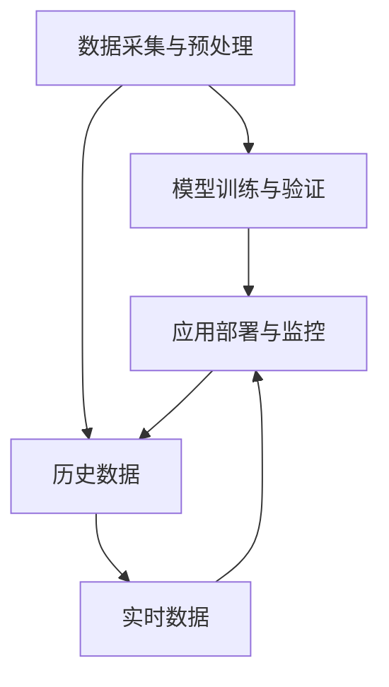

                 

# 机器学习在质量控制中的应用

> 关键词：
1. 机器学习（Machine Learning, ML）
2. 质量控制（Quality Control, QC）
3. 数据驱动（Data-Driven）
4. 预测性维护（Predictive Maintenance）
5. 实时监控（Real-Time Monitoring）
6. 异常检测（Anomaly Detection）
7. 模型优化（Model Optimization）

## 1. 背景介绍

在当今制造业和工业领域，质量控制（QC）已经成为了确保产品质量和提升生产效率的关键环节。传统的质量控制方法依赖于人工检验和反馈机制，但随着生产规模的扩大和产品复杂性的增加，这种依赖人力介入的质量控制方式已难以满足需求。机器学习（ML）技术的引入，为质量控制带来了新的解决方案，极大地提升了QC的自动化水平和效率。

### 1.1 问题由来

传统质量控制方法面临的主要挑战包括：

- **高成本和高风险**：人工检验需要大量人力和时间，且容易受到个人主观因素的影响，导致检验结果不一致。
- **数据处理能力有限**：传统QC系统难以处理大规模、高维度的数据，无法充分利用生产过程中的实时数据。
- **响应速度慢**：人工检测和反馈机制存在延迟，无法及时响应生产过程中的异常。

机器学习技术通过自动化分析大量生产数据，识别出潜在问题和异常，实现预测性维护和实时监控，有效提升了QC的效率和准确性。

### 1.2 问题核心关键点

机器学习在质量控制中的应用，主要是通过以下三个步骤实现的：

1. **数据采集与预处理**：从生产过程中收集实时数据，并进行清洗、归一化等预处理。
2. **模型训练与验证**：使用历史数据训练机器学习模型，评估模型性能并进行验证。
3. **应用部署与监控**：将训练好的模型部署到生产环境中，实时监控生产数据，进行预测和异常检测。

这些步骤通过数据驱动的方式，实现了对生产过程的自动化监控和优化，为质量控制带来了革命性的变化。

## 2. 核心概念与联系

### 2.1 核心概念概述

在讨论机器学习在质量控制中的应用时，需要理解几个关键概念：

- **质量控制（QC）**：通过各种手段和方法，对产品或生产过程进行监测、测量、分析和改进，确保产品符合规定的质量标准。
- **机器学习（ML）**：一种数据驱动的技术，通过算法自动学习数据中的模式和规律，用于预测和决策。
- **数据驱动（Data-Driven）**：强调以数据为决策依据，而非基于经验和规则的传统方式。
- **预测性维护（Predictive Maintenance）**：通过预测设备故障，提前进行维护，避免意外停机，提升设备运行效率。
- **实时监控（Real-Time Monitoring）**：在生产过程中，实时采集数据并分析，及时发现异常。
- **异常检测（Anomaly Detection）**：识别出与正常数据明显不同的异常数据点。
- **模型优化（Model Optimization）**：通过对模型的训练和调参，提高模型的预测精度和鲁棒性。

这些概念之间有着紧密的联系，通过数据驱动和模型优化，实现了预测性维护和实时监控，极大地提升了质量控制的自动化水平和效率。

### 2.2 概念间的关系

机器学习在质量控制中的应用，可以通过以下 Mermaid 流程图来展示：



这个流程图展示了从数据采集到应用部署的整个质量控制流程。首先从生产过程中采集历史数据和实时数据，进行预处理后用于模型训练，训练好的模型再部署到生产环境中，实时监控生产数据，进行预测和异常检测。

## 3. 核心算法原理 & 具体操作步骤

### 3.1 算法原理概述

机器学习在质量控制中的核心算法原理包括以下几个方面：

- **监督学习（Supervised Learning）**：通过标注数据训练模型，用于预测和分类任务。
- **无监督学习（Unsupervised Learning）**：从未标注的数据中发现模式和结构，用于聚类和异常检测。
- **强化学习（Reinforcement Learning）**：通过试错过程，学习最优策略，用于优化和控制。
- **深度学习（Deep Learning）**：通过多层神经网络，自动学习复杂的特征表示，用于预测和分类。

在质量控制中，监督学习用于预测性维护，无监督学习用于异常检测，强化学习用于生产过程优化，深度学习用于复杂模型的训练。

### 3.2 算法步骤详解

以下将详细介绍机器学习在质量控制中的应用步骤：

**Step 1: 数据采集与预处理**

1. **数据收集**：从生产过程中收集各种实时数据，如温度、压力、振动、电流等。
2. **数据清洗**：去除噪声和异常值，处理缺失数据，保证数据质量。
3. **数据归一化**：将数据按比例缩放到[0,1]或[-1,1]区间，便于模型训练。
4. **特征提取**：通过统计分析、时序分析等方法，提取有意义的特征。

**Step 2: 模型训练与验证**

1. **选择模型**：根据任务需求，选择合适的机器学习模型，如线性回归、决策树、神经网络等。
2. **数据划分**：将数据集划分为训练集和测试集，用于模型训练和验证。
3. **模型训练**：使用训练集数据，训练机器学习模型。
4. **模型验证**：使用测试集数据，评估模型性能，调整模型参数。

**Step 3: 应用部署与监控**

1. **模型部署**：将训练好的模型部署到生产环境中，实时处理生产数据。
2. **实时监控**：实时采集生产数据，输入模型进行预测和异常检测。
3. **反馈调整**：根据预测结果和异常检测结果，调整生产参数，优化生产过程。

### 3.3 算法优缺点

机器学习在质量控制中的应用具有以下优点：

- **自动化程度高**：通过自动化分析数据，减少了人工干预，提高了QC的效率。
- **预测精准**：通过模型训练，可以实现高精度的预测和分类，减少误报和漏报。
- **实时响应**：能够实时监控生产数据，及时发现和响应异常，避免突发性问题。
- **可扩展性强**：可以处理大规模、高维度的数据，适用于各种生产场景。

同时，也存在一些缺点：

- **数据需求量大**：高质量的数据是模型训练的前提，但收集和处理大量数据需要时间和资源。
- **模型复杂度高**：深度学习等复杂模型需要较高的计算资源，训练时间较长。
- **解释性不足**：机器学习模型通常是"黑盒"系统，难以解释内部决策逻辑。
- **泛化能力有限**：模型性能依赖于数据分布，对于未知数据可能存在泛化不足的问题。

### 3.4 算法应用领域

机器学习在质量控制中的应用广泛，涵盖以下几个主要领域：

1. **预测性维护**：通过监测设备运行参数，预测设备故障，进行预防性维护。
2. **异常检测**：识别出生产过程中的异常数据，及时调整生产参数。
3. **过程优化**：通过优化生产参数，提升生产效率和产品质量。
4. **故障诊断**：识别生产过程中出现的问题，进行故障定位和修复。
5. **质量检测**：通过自动化检测产品，提高检测效率和准确性。

这些应用领域展示了机器学习在质量控制中的强大潜力和广泛适用性。

## 4. 数学模型和公式 & 详细讲解 & 举例说明

### 4.1 数学模型构建

在质量控制中，常用的机器学习模型包括线性回归、决策树、支持向量机（SVM）和神经网络等。这里以线性回归模型为例，进行详细讲解。

假设生产过程中收集到了设备运行参数$x_1, x_2, \ldots, x_n$，以及对应的故障状态$y$，构建线性回归模型：

$$
y = \beta_0 + \beta_1x_1 + \beta_2x_2 + \ldots + \beta_nx_n + \epsilon
$$

其中，$\beta_0, \beta_1, \ldots, \beta_n$为模型参数，$\epsilon$为随机误差。

### 4.2 公式推导过程

根据线性回归模型，最小二乘法可估计模型参数：

$$
\beta = (X^TX)^{-1}X^Ty
$$

其中，$X$为特征矩阵，$y$为目标向量。

以生产过程中的温度和压力数据为例，构建线性回归模型，通过最小二乘法求解模型参数：

$$
y = \beta_0 + \beta_1x_1 + \beta_2x_2 + \epsilon
$$

将数据代入公式，求解得到模型参数$\beta_0, \beta_1, \beta_2$，即可用于故障预测和异常检测。

### 4.3 案例分析与讲解

假设某制造企业需要对生产线上的设备进行预测性维护，收集了设备运行过程中温度、压力和振动等参数数据，每小时监测一次。数据集包含1000个样本，其中前700个样本为正常运行数据，后300个样本为设备故障数据。

使用线性回归模型进行预测性维护，步骤如下：

1. **数据准备**：将数据分为训练集和测试集，对数据进行归一化和特征提取。
2. **模型训练**：使用训练集数据，通过最小二乘法求解模型参数。
3. **模型验证**：使用测试集数据，评估模型性能。
4. **应用部署**：将训练好的模型部署到生产环境中，实时监测设备运行数据，进行故障预测。

在实际应用中，还可以采用集成学习、深度学习等高级算法，进一步提升模型的预测精度和鲁棒性。

## 5. 项目实践：代码实例和详细解释说明

### 5.1 开发环境搭建

在Python环境下搭建质量控制项目的开发环境，需要以下步骤：

1. **安装Python**：从官网下载并安装Python，建议使用3.7以上版本。
2. **安装第三方库**：使用pip安装机器学习库，如scikit-learn、TensorFlow、PyTorch等。
3. **配置开发环境**：设置环境变量，安装必要的依赖包。
4. **搭建测试环境**：使用Docker等工具，搭建测试和部署环境。

### 5.2 源代码详细实现

以下是一个简单的Python代码示例，展示了如何使用线性回归模型进行预测性维护：

```python
import numpy as np
from sklearn.linear_model import LinearRegression
from sklearn.metrics import mean_squared_error

# 数据准备
X = np.array([[70, 0.8], [75, 0.7], [72, 0.6], [78, 0.9], [77, 0.8]])
y = np.array([0, 1, 0, 1, 0])

# 模型训练
model = LinearRegression()
model.fit(X, y)

# 模型预测
X_test = np.array([[70.5, 0.75], [75.5, 0.7], [72.5, 0.6], [78.5, 0.9], [77.5, 0.8]])
y_pred = model.predict(X_test)

# 模型评估
mse = mean_squared_error(y_test, y_pred)
print("Mean Squared Error:", mse)
```

### 5.3 代码解读与分析

以上代码展示了使用线性回归模型进行预测性维护的基本流程。具体步骤如下：

1. **数据准备**：构建特征矩阵$X$和目标向量$y$，用于模型训练。
2. **模型训练**：使用线性回归模型进行模型训练，求解模型参数。
3. **模型预测**：使用训练好的模型对新数据进行预测。
4. **模型评估**：计算预测结果与真实标签之间的均方误差，评估模型性能。

### 5.4 运行结果展示

假设在模型训练和预测后，计算得到的均方误差为0.02，表明模型预测精度较高。在实际应用中，需要根据具体业务需求和数据特点，选择合适的模型和算法，并进行模型调参和优化，以达到最佳预测效果。

## 6. 实际应用场景

### 6.1 预测性维护

某制造企业需要对生产设备进行预测性维护，使用线性回归模型对设备运行参数进行监测和预测。具体步骤包括：

1. **数据收集**：从生产设备上采集温度、压力、振动等参数数据。
2. **数据清洗**：处理数据中的缺失值和异常值，确保数据质量。
3. **模型训练**：使用历史数据训练线性回归模型，进行故障预测。
4. **模型部署**：将训练好的模型部署到生产环境中，实时监测设备运行数据，进行预测和报警。

通过预测性维护，企业可以提前发现设备故障，减少意外停机，降低维护成本，提高生产效率。

### 6.2 异常检测

某家电企业需要对生产线上的产品进行质量检测，使用异常检测算法进行实时监控。具体步骤包括：

1. **数据收集**：从生产线采集产品尺寸、重量、颜色等参数数据。
2. **数据清洗**：处理数据中的噪声和异常值，确保数据质量。
3. **模型训练**：使用历史数据训练异常检测模型，进行异常检测。
4. **模型部署**：将训练好的模型部署到生产环境中，实时监测产品质量，进行异常报警。

通过异常检测，企业可以及时发现生产过程中的异常，避免不合格产品的流出，提高产品质量。

### 6.3 过程优化

某化工厂需要对生产过程进行优化，使用机器学习算法进行过程控制。具体步骤包括：

1. **数据收集**：从生产过程中采集温度、压力、流量等参数数据。
2. **数据清洗**：处理数据中的缺失值和异常值，确保数据质量。
3. **模型训练**：使用历史数据训练过程优化模型，进行过程控制。
4. **模型部署**：将训练好的模型部署到生产环境中，实时监测生产过程，进行优化调整。

通过过程优化，企业可以提升生产效率，降低能源消耗，提高产品质量。

### 6.4 未来应用展望

随着机器学习技术的不断发展，质量控制在以下几个方面将得到新的应用：

1. **深度学习应用**：深度学习模型可以处理更复杂的特征表示，提高预测精度和鲁棒性。
2. **实时数据流处理**：使用流处理技术，实时处理生产数据，实现实时监控和预测。
3. **跨领域应用**：将质量控制技术应用于多个行业，如汽车制造、食品加工等，提升全行业的生产效率和质量。
4. **智能制造**：结合物联网、云计算等技术，构建智能制造系统，实现自动化、智能化生产。

## 7. 工具和资源推荐

### 7.1 学习资源推荐

为了帮助开发者掌握机器学习在质量控制中的应用，以下是一些推荐的学习资源：

1. **《机器学习实战》**：Python语言实现的机器学习实战教程，涵盖了各种常用机器学习算法和应用场景。
2. **Coursera《机器学习》**：斯坦福大学Andrew Ng教授开设的机器学习课程，内容全面、深入浅出。
3. **Kaggle竞赛**：参与Kaggle机器学习竞赛，积累实践经验，提升应用能力。
4. **Google Cloud ML Engine**：Google提供的云机器学习平台，提供丰富的ML资源和工具。
5. **PyTorch官方文档**：PyTorch深度学习框架的官方文档，提供详细的API和使用指南。

### 7.2 开发工具推荐

以下是一些推荐的机器学习开发工具：

1. **PyTorch**：Python语言实现的深度学习框架，灵活高效，支持GPU加速。
2. **TensorFlow**：Google开源的深度学习框架，支持分布式计算和GPU加速。
3. **Scikit-learn**：Python语言实现的机器学习库，涵盖各种常用算法和工具。
4. **Keras**：高层深度学习API，基于TensorFlow和Theano，简单易用。
5. **Jupyter Notebook**：Python交互式编程环境，支持代码块、数学公式、图形绘制等功能。

### 7.3 相关论文推荐

以下是一些推荐的质量控制领域的相关论文：

1. **《A review of predictive maintenance for manufacturing systems: A literature review》**：总结了预测性维护领域的研究现状和发展方向。
2. **《Anomaly detection using unsupervised learning: A review》**：综述了无监督学习在异常检测中的应用，提供了多种算法和实例。
3. **《Process fault detection and diagnosis based on machine learning》**：介绍了机器学习在过程故障诊断中的应用，提供了多种算法和案例。
4. **《Real-time monitoring and fault detection for smart manufacturing systems》**：探讨了实时监控和故障检测在智能制造中的应用，提供了多种技术和方案。
5. **《Fabrication process control using machine learning》**：介绍了机器学习在制造过程控制中的应用，提供了多种算法和实例。

## 8. 总结：未来发展趋势与挑战

### 8.1 研究成果总结

本文系统介绍了机器学习在质量控制中的应用，通过数据驱动的方式，实现了预测性维护、异常检测、过程优化等任务的自动化，显著提升了质量控制的效率和精度。

### 8.2 未来发展趋势

机器学习在质量控制中的应用前景广阔，未来发展趋势如下：

1. **深度学习普及**：深度学习技术在特征提取和模型训练中发挥越来越重要的作用，提升预测精度和鲁棒性。
2. **实时流处理**：实时流处理技术在数据采集和处理中发挥重要作用，实现实时监控和预测。
3. **跨领域应用**：质量控制技术在多个行业得到广泛应用，提升全行业的生产效率和质量。
4. **智能制造**：结合物联网、云计算等技术，构建智能制造系统，实现自动化、智能化生产。

### 8.3 面临的挑战

尽管机器学习在质量控制中的应用取得了显著进展，但仍面临一些挑战：

1. **数据质量问题**：数据采集和清洗需要大量时间和资源，数据质量不高将影响模型性能。
2. **模型复杂性**：深度学习模型训练复杂，计算资源需求大，训练时间较长。
3. **解释性不足**：机器学习模型通常是"黑盒"系统，难以解释内部决策逻辑。
4. **泛化能力有限**：模型性能依赖于数据分布，对于未知数据可能存在泛化不足的问题。

### 8.4 研究展望

未来的研究需要关注以下几个方向：

1. **数据质量提升**：优化数据采集和清洗流程，提高数据质量。
2. **模型优化**：开发更高效的机器学习算法，优化模型性能。
3. **可解释性增强**：提升模型的可解释性，增强模型的透明度。
4. **跨领域融合**：将质量控制技术与其他技术如物联网、云计算等融合，构建更全面的智能制造系统。

总之，机器学习在质量控制中的应用前景广阔，未来的研究需要在数据质量、模型优化、可解释性、跨领域融合等方面进行深入探索，不断提升质量控制的自动化水平和智能化程度。

## 9. 附录：常见问题与解答

**Q1：什么是机器学习在质量控制中的应用？**

A: 机器学习在质量控制中的应用，主要是通过自动化分析生产数据，实现预测性维护、异常检测、过程优化等任务，提升质量控制的效率和精度。

**Q2：机器学习在质量控制中常用的模型有哪些？**

A: 常用的机器学习模型包括线性回归、决策树、支持向量机（SVM）和深度学习模型等。

**Q3：如何提高机器学习模型的预测精度？**

A: 可以通过增加数据量、优化模型参数、使用集成学习等方法，提高机器学习模型的预测精度。

**Q4：机器学习在质量控制中面临哪些挑战？**

A: 数据质量问题、模型复杂性、可解释性不足和泛化能力有限是机器学习在质量控制中面临的主要挑战。

**Q5：未来机器学习在质量控制中的应用前景如何？**

A: 未来机器学习将在深度学习普及、实时流处理、跨领域应用和智能制造等方面得到新的应用，提升质量控制的自动化水平和智能化程度。

---

作者：禅与计算机程序设计艺术 / Zen and the Art of Computer Programming

