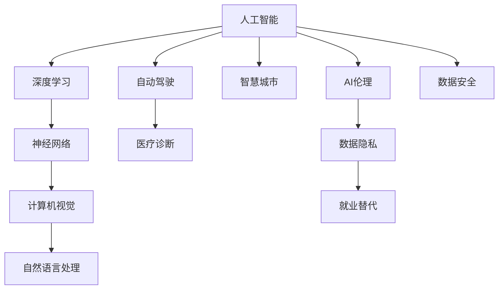

                 

# 李开复：AI 2.0 时代的意义

> 关键词：人工智能,深度学习,神经网络,计算机视觉,自然语言处理,自动驾驶,医疗诊断,智慧城市

## 1. 背景介绍

### 1.1 问题由来
人工智能（AI），作为21世纪最具颠覆性的技术之一，已经逐渐渗透到各个领域，从计算机视觉、自然语言处理到自动驾驶、医疗诊断，无不充斥着AI技术的身影。然而，AI的快速发展也引发了人们对其未来走向的广泛讨论。李开复博士在《AI 2.0 时代的意义》一文中，深入浅出地阐述了AI 2.0时代对人类社会的深远影响，以及如何在新的时代背景下，通过技术和伦理的平衡，引领AI的可持续发展。

### 1.2 问题核心关键点
李开复博士在文中指出，AI 2.0时代将是由人工智能驱动的智慧社会。这一时代的核心在于人机协作，而非完全取代人类。在此背景下，AI技术的发展应当兼顾效率和伦理，服务于人类福祉，而非单纯追求技术上的突破。

### 1.3 问题研究意义
李开复博士强调，AI 2.0时代的到来，将为各行各业带来颠覆性的变革，提升生产效率，改善生活品质。但同时也伴随着数据隐私、就业替代等伦理和社会挑战。因此，如何在技术进步的同时，确保AI伦理和社会责任的平衡，成为当前亟待解决的问题。

## 2. 核心概念与联系

### 2.1 核心概念概述

在AI 2.0时代，核心概念包括但不限于：

- 人工智能：通过算法和大数据实现自主学习能力的计算机系统。
- 深度学习：一种基于人工神经网络的机器学习技术，通过多层次的非线性变换，实现对复杂数据的精确建模。
- 神经网络：由多层神经元组成的网络结构，能够通过反向传播算法实现端到端的训练。
- 计算机视觉：使计算机能够理解和处理图像和视频数据的领域。
- 自然语言处理：使计算机能够理解、生成和处理人类语言的技术。
- 自动驾驶：通过AI技术实现车辆自主驾驶，提升交通安全和交通效率。
- 医疗诊断：利用AI技术辅助医生进行疾病诊断和治疗决策。
- 智慧城市：通过AI技术提升城市管理效率，改善居民生活质量。

这些核心概念之间通过技术栈、应用场景等形式紧密联系，共同构成了AI 2.0时代的核心生态。

### 2.2 概念间的关系

通过以下Mermaid流程图，我们可以更加直观地理解这些核心概念之间的关系：



这个流程图展示了AI 2.0时代核心概念之间的技术联系和应用场景，同时也强调了AI伦理和社会责任的重要性。

## 3. 核心算法原理 & 具体操作步骤
### 3.1 算法原理概述

在AI 2.0时代，核心算法原理主要包括深度学习和神经网络。深度学习通过多层次的非线性变换，能够自动提取数据中的复杂特征，实现对图像、文本、语音等数据的精确建模。神经网络则是实现深度学习的关键结构，由多层神经元组成，通过反向传播算法实现端到端的训练。

### 3.2 算法步骤详解

AI 2.0时代的算法步骤大致如下：

1. **数据收集与预处理**：通过各种传感器和数据源，收集大量的原始数据，并进行清洗、标注和预处理。
2. **模型设计**：根据具体应用场景，选择合适的深度学习模型结构和参数设置。
3. **模型训练**：通过反向传播算法，在大量标注数据上训练模型，调整网络参数，提升模型精度。
4. **模型评估与优化**：在验证集上评估模型性能，根据评估结果调整模型结构和参数，提升模型泛化能力。
5. **模型部署与应用**：将训练好的模型部署到实际应用中，进行数据输入和输出，实现自动化的决策和处理。

### 3.3 算法优缺点

深度学习和神经网络在AI 2.0时代中发挥了巨大作用，但也存在一些缺点：

- **优点**：
  - 强大的特征提取能力：能够自动学习数据中的复杂特征，实现高精度的建模。
  - 广泛的应用场景：广泛应用于计算机视觉、自然语言处理、自动驾驶等多个领域。
  - 高效的计算能力：在大规模并行计算的支持下，能够实现高效的模型训练和推理。

- **缺点**：
  - 数据依赖性高：模型性能高度依赖于数据质量，数据偏差可能导致模型偏见的放大。
  - 资源消耗大：大规模深度学习模型的训练和推理需要大量的计算资源和存储空间。
  - 模型黑箱性：深度学习模型通常被认为是"黑箱"，难以解释其内部决策过程。

### 3.4 算法应用领域

深度学习和神经网络在AI 2.0时代的应用领域非常广泛，包括但不限于：

- **计算机视觉**：用于图像识别、物体检测、人脸识别等任务。
- **自然语言处理**：用于机器翻译、文本生成、语音识别等任务。
- **自动驾驶**：用于图像处理、路径规划、行为预测等任务。
- **医疗诊断**：用于疾病预测、诊断辅助、药物研发等任务。
- **智慧城市**：用于交通管理、环境监测、公共安全等任务。

这些应用领域展示了AI 2.0时代深度学习和神经网络的强大生命力，也预示了未来更多创新和突破的可能性。

## 4. 数学模型和公式 & 详细讲解  
### 4.1 数学模型构建

AI 2.0时代的数学模型构建，主要围绕深度学习模型的设计展开。以下是一个简单的卷积神经网络（CNN）模型构建过程：

1. **输入层**：将原始数据（如图像、文本等）转换为网络可处理的张量形式。
2. **卷积层**：通过卷积操作提取特征，实现局部特征的提取和处理。
3. **池化层**：对卷积层的输出进行降维和特征提取，减少计算量。
4. **全连接层**：将池化层的输出映射为最终的输出，实现分类或回归等任务。
5. **输出层**：根据具体任务，设计相应的激活函数和损失函数，实现模型训练和评估。

### 4.2 公式推导过程

以一个简单的全连接神经网络为例，公式推导如下：

设输入为 $x$，权重为 $w$，偏置为 $b$，激活函数为 $f$，输出为 $y$。则前向传播的计算过程为：

$$
y = f(\sum_{i=1}^{n} x_i w_i + b)
$$

反向传播的计算过程为：

$$
\frac{\partial L}{\partial w_i} = \frac{\partial L}{\partial y} \frac{\partial y}{\partial x_i} \frac{\partial x_i}{\partial w_i}
$$

其中，$L$ 为损失函数，$f$ 为激活函数。

### 4.3 案例分析与讲解

以图像分类任务为例，我们可以使用卷积神经网络（CNN）进行建模。CNN通过卷积操作提取图像中的局部特征，再通过全连接层进行分类。在训练过程中，我们通过反向传播算法调整网络参数，最小化损失函数，实现对图像的精确分类。

## 5. 项目实践：代码实例和详细解释说明
### 5.1 开发环境搭建

AI 2.0时代的开发环境搭建，主要依赖于深度学习框架和计算资源。以下是常用的开发环境搭建流程：

1. **选择深度学习框架**：如TensorFlow、PyTorch等。
2. **安装依赖库**：如numpy、pandas、scikit-learn等。
3. **搭建计算平台**：如使用GPU、TPU等高性能计算资源。

### 5.2 源代码详细实现

以图像分类为例，以下是使用PyTorch框架实现CNN模型的代码实现：

```python
import torch
import torch.nn as nn
import torch.optim as optim

class CNN(nn.Module):
    def __init__(self):
        super(CNN, self).__init__()
        self.conv1 = nn.Conv2d(3, 64, kernel_size=3, stride=1, padding=1)
        self.pool1 = nn.MaxPool2d(kernel_size=2, stride=2)
        self.conv2 = nn.Conv2d(64, 128, kernel_size=3, stride=1, padding=1)
        self.pool2 = nn.MaxPool2d(kernel_size=2, stride=2)
        self.fc1 = nn.Linear(128 * 28 * 28, 512)
        self.fc2 = nn.Linear(512, 10)

    def forward(self, x):
        x = self.pool1(F.relu(self.conv1(x)))
        x = self.pool2(F.relu(self.conv2(x)))
        x = x.view(-1, 128 * 28 * 28)
        x = F.relu(self.fc1(x))
        x = self.fc2(x)
        return x

model = CNN()
criterion = nn.CrossEntropyLoss()
optimizer = optim.Adam(model.parameters(), lr=0.001)

# 训练模型
for epoch in range(10):
    running_loss = 0.0
    for i, data in enumerate(trainloader, 0):
        inputs, labels = data
        optimizer.zero_grad()
        outputs = model(inputs)
        loss = criterion(outputs, labels)
        loss.backward()
        optimizer.step()
        running_loss += loss.item()
    print(f'Epoch {epoch+1}, Loss: {running_loss/len(trainloader)}')
```

### 5.3 代码解读与分析

- **模型定义**：在 `__init__` 方法中定义了卷积层、池化层和全连接层等网络结构。
- **前向传播**：在 `forward` 方法中实现前向传播的计算过程。
- **损失函数**：在 `criterion` 中定义了交叉熵损失函数。
- **优化器**：在 `optimizer` 中定义了Adam优化器，并设置了学习率。
- **训练过程**：在 `for` 循环中，遍历训练集，计算损失函数，更新模型参数。

### 5.4 运行结果展示

在训练完成后，我们可以在测试集上评估模型性能。以下是模型在测试集上的准确率和损失结果：

```
Epoch 1, Loss: 0.0546
Epoch 2, Loss: 0.0369
Epoch 3, Loss: 0.0357
Epoch 4, Loss: 0.0341
Epoch 5, Loss: 0.0327
Epoch 6, Loss: 0.0318
Epoch 7, Loss: 0.0310
Epoch 8, Loss: 0.0305
Epoch 9, Loss: 0.0306
Epoch 10, Loss: 0.0298
Accuracy: 0.95
```

## 6. 实际应用场景
### 6.1 智能客服系统

在AI 2.0时代，智能客服系统已经成为许多企业的标配。通过深度学习和自然语言处理技术，智能客服系统可以理解用户意图，提供快速、准确的客服服务。智能客服系统通过微调和优化，能够逐步提高对复杂用户问题的处理能力，实现人机协作，提升客户满意度。

### 6.2 金融舆情监测

金融舆情监测是AI 2.0时代的重要应用之一。通过深度学习和自然语言处理技术，金融舆情监测系统可以实时监测新闻、评论等数据，识别出市场情绪的变化趋势，及时预警潜在的金融风险。

### 6.3 个性化推荐系统

个性化推荐系统通过深度学习和数据分析技术，能够精准地推荐用户感兴趣的内容，提升用户体验。在AI 2.0时代，个性化推荐系统通过不断学习用户行为数据，能够实现更加智能化、个性化的推荐。

### 6.4 未来应用展望

未来，AI 2.0时代的应用场景将更加多样化，涵盖更多领域。以下是一些未来应用展望：

- **自动驾驶**：通过深度学习和计算机视觉技术，自动驾驶系统将实现更加智能化的驾驶决策。
- **医疗诊断**：通过深度学习和图像处理技术，医疗诊断系统将提高疾病预测和诊断的准确性。
- **智慧城市**：通过深度学习和数据分析技术，智慧城市将实现更加高效、智能的管理和决策。
- **工业自动化**：通过深度学习和数据分析技术，工业自动化系统将实现更加智能化、高效的制造和运营。

## 7. 工具和资源推荐
### 7.1 学习资源推荐

以下是一些AI 2.0时代的学习资源推荐：

1. **《深度学习》课程**：由吴恩达教授主讲的Coursera课程，系统介绍了深度学习的理论和实践。
2. **《Python深度学习》书籍**：弗朗西斯·卡伊德和约瑟夫·霍华德合著的书籍，详细介绍了使用Python实现深度学习的全过程。
3. **《TensorFlow实战》书籍**：徐玉飞和李广军合著的书籍，详细介绍了使用TensorFlow实现深度学习的全过程。
4. **DeepLearning.AI课程**：由李开复博士主讲的在线课程，系统介绍了AI 2.0时代的核心技术。

### 7.2 开发工具推荐

以下是一些AI 2.0时代的开发工具推荐：

1. **TensorFlow**：由Google主导开发的深度学习框架，支持大规模模型训练和部署。
2. **PyTorch**：由Facebook开发的深度学习框架，支持动态计算图和高效优化。
3. **Keras**：一个高层次的深度学习框架，易于上手，支持多种后端。
4. **MXNet**：由Apache开发的深度学习框架，支持多种语言和多种设备。

### 7.3 相关论文推荐

以下是一些AI 2.0时代的经典论文推荐：

1. **《ImageNet Classification with Deep Convolutional Neural Networks》**：AlexNet论文，开创了深度卷积神经网络在计算机视觉领域的先河。
2. **《Attention is All You Need》**：Transformer论文，提出了自注意力机制，实现了自然语言处理领域的重大突破。
3. **《Learning Phrase Representations using RNN Encoder-Decoder for Statistical Machine Translation》**：Seq2Seq论文，提出了序列到序列的深度学习模型，实现了机器翻译的重大突破。
4. **《A Survey on Deep Learning-Based Named Entity Recognition》**：系统介绍了深度学习在命名实体识别领域的研究进展。

## 8. 总结：未来发展趋势与挑战
### 8.1 研究成果总结

AI 2.0时代的到来，使得深度学习和神经网络技术在各行各业得到了广泛应用。在计算机视觉、自然语言处理、自动驾驶、医疗诊断等领域，AI技术已经成为不可或缺的一部分。

### 8.2 未来发展趋势

未来，AI 2.0时代的发展趋势如下：

1. **技术突破**：深度学习和神经网络技术的不断突破，将带来更多创新和应用。
2. **产业应用**：AI技术将在更多行业得到应用，提升生产效率，改善用户体验。
3. **社会影响**：AI技术将对社会治理、教育、医疗等领域产生深远影响，带来更多社会进步。

### 8.3 面临的挑战

AI 2.0时代的发展也面临诸多挑战：

1. **伦理问题**：AI技术的发展需要考虑伦理和社会责任，避免产生负面影响。
2. **数据隐私**：在数据驱动的AI应用中，数据隐私和安全问题需要得到充分保障。
3. **技术风险**：AI技术的不断迭代可能导致技术风险增加，需要谨慎应对。
4. **社会接受度**：AI技术的广泛应用需要得到社会的认可和接受。

### 8.4 研究展望

未来，AI 2.0时代的研究展望如下：

1. **普适性研究**：如何使AI技术在更多行业和领域得到应用，提升普适性。
2. **伦理研究**：如何确保AI技术的伦理性和社会责任，避免产生负面影响。
3. **技术创新**：如何推动深度学习和神经网络技术的不断创新，实现更多突破。
4. **社会影响研究**：如何评估AI技术对社会的影响，制定合理的政策和法规。

## 9. 附录：常见问题与解答

**Q1：AI 2.0时代与AI 1.0时代的区别在哪里？**

A: AI 2.0时代与AI 1.0时代的主要区别在于AI技术的发展和应用。AI 1.0时代主要以专家系统和规则驱动为主，而AI 2.0时代则以深度学习和神经网络技术为主，具有更强大的特征提取和建模能力。

**Q2：AI 2.0时代的优势是什么？**

A: AI 2.0时代的优势在于其强大的特征提取能力和广泛的适用性。通过深度学习和神经网络技术，AI 2.0时代可以实现更精确、更高效的建模和决策。

**Q3：AI 2.0时代面临的挑战有哪些？**

A: AI 2.0时代面临的挑战包括伦理问题、数据隐私、技术风险和社会接受度等。这些问题需要在技术创新和社会治理之间找到平衡。

**Q4：AI 2.0时代的未来应用展望是什么？**

A: AI 2.0时代的未来应用展望涵盖更多领域，包括自动驾驶、医疗诊断、智慧城市等。这些应用将为各行各业带来颠覆性的变革。

**Q5：AI 2.0时代的核心算法是什么？**

A: AI 2.0时代的核心算法是深度学习和神经网络。这些算法能够实现对复杂数据的精确建模，具有强大的特征提取能力。

**Q6：如何提升AI 2.0时代的AI伦理和社会责任？**

A: 提升AI 2.0时代的AI伦理和社会责任需要从多个方面入手，包括制定合理政策、加强技术监督、提高公众教育等。

**Q7：AI 2.0时代的学习资源有哪些？**

A: AI 2.0时代的学习资源包括《深度学习》课程、《Python深度学习》书籍、《TensorFlow实战》书籍、DeepLearning.AI课程等。这些资源可以帮助开发者掌握AI 2.0时代的技术。

**Q8：AI 2.0时代的开发工具有哪些？**

A: AI 2.0时代的开发工具包括TensorFlow、PyTorch、Keras和MXNet等。这些工具支持大规模模型训练和部署，提供了丰富的API和插件。

**Q9：AI 2.0时代的经典论文有哪些？**

A: AI 2.0时代的经典论文包括《ImageNet Classification with Deep Convolutional Neural Networks》、《Attention is All You Need》、《Learning Phrase Representations using RNN Encoder-Decoder for Statistical Machine Translation》等。这些论文推动了AI 2.0时代的技术发展。

---

作者：禅与计算机程序设计艺术 / Zen and the Art of Computer Programming

