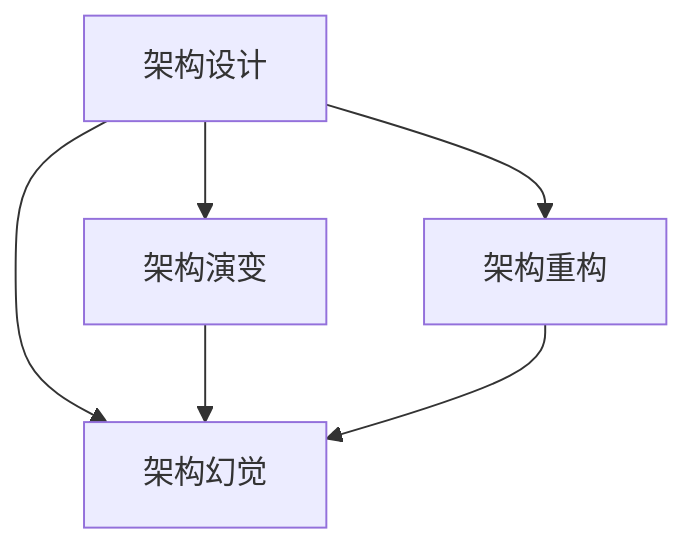
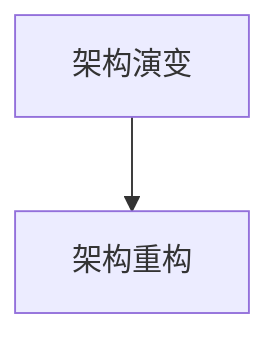

                 

# 架构设计与幻觉相关问题

在快速迭代和需求变更频繁的现代软件开发环境中，架构设计变得尤为重要。合理的架构不仅能提升系统的可维护性和扩展性，还能显著提高开发效率和系统稳定性。然而，在实际的软件开发过程中，架构设计往往被过度简化，导致一些根本性问题被忽视，进而引发架构幻觉。本文将深入探讨架构设计与幻觉相关的问题，帮助读者识别和避免这些常见陷阱，确保系统设计的高效性和可持续性。

## 1. 背景介绍

### 1.1 问题由来

随着技术的发展和业务的扩展，越来越多的系统被设计得越来越复杂，架构问题变得越发凸显。许多开发团队过于关注短期效益和快速交付，忽视了系统架构的长期影响和可持续性。这种在架构设计上的简单化和粗糙化，导致了架构幻觉的产生。架构幻觉指的是对系统架构的误判和过度简化，误以为简单的架构设计能够应对未来复杂多变的业务需求，最终导致系统在扩展性和维护性方面的问题。

### 1.2 问题核心关键点

架构幻觉的产生主要源于以下几个方面：
- **对技术变化的忽视**：忽视技术栈的变化，没有考虑到新技术对系统架构的长期影响。
- **对业务需求的低估**：对业务需求的快速变化和不确定性估计不足，没有进行足够的风险评估。
- **对复杂性的高估**：对系统复杂性的低估，没有预留足够的余地和应对策略。
- **对扩展性的低估**：对系统扩展性和未来业务增长的预测不足，没有设计出具有良好扩展性的架构。

这些问题的根本原因在于对架构设计的片面理解和误判，导致系统设计过程中的架构幻觉。只有正确识别和避免这些陷阱，才能设计出高效、可持续的软件架构。

### 1.3 问题研究意义

研究架构设计与幻觉相关的问题，对于提高软件系统的架构质量、提升开发效率和维护性具有重要意义。合理的架构设计不仅能减少技术债务、提高系统可维护性，还能缩短开发周期、降低维护成本。避免架构幻觉，确保系统架构的可持续性和长期稳定性，是软件开发中至关重要的一环。

## 2. 核心概念与联系

### 2.1 核心概念概述

为更好地理解架构设计与幻觉相关的问题，本节将介绍几个密切相关的核心概念：

- **架构设计(Design)**：在软件开发过程中，对系统组件的组织、交互和信息流动进行规划和设计。架构设计包括系统组件划分、接口定义、数据流动等方面，是确保系统可扩展性和可维护性的基础。
- **架构幻觉(Architectural Illusion)**：对系统架构的误判和过度简化，误以为简单的架构设计能够应对未来复杂多变的业务需求，最终导致系统在扩展性和维护性方面的问题。
- **架构演变(Evolution)**：在软件生命周期中，随着需求变化和技术进步，系统架构不断调整和演变的动态过程。良好的架构设计应具备良好的演进能力。
- **架构重构(Refactoring)**：在系统架构已经形成的基础上，根据需求变化和技术进步，对系统进行部分或全面的重构，以提升系统的可维护性和扩展性。

这些核心概念之间的逻辑关系可以通过以下Mermaid流程图来展示：



这个流程图展示了几大核心概念之间的关系：

1. 架构设计是系统构建的基础，直接影响系统的可扩展性和可维护性。
2. 架构幻觉是由于对架构设计的误判和过度简化导致的系统问题。
3. 架构演变是在软件生命周期中，随着需求变化和技术进步，系统架构的动态调整过程。
4. 架构重构是在架构已经形成的基础上，通过部分或全面的调整，提升系统的可维护性和扩展性。

这些概念共同构成了架构设计的完整生态系统，确保系统设计的高效性和可持续性。通过理解这些核心概念，我们可以更好地把握架构设计的精髓，避免架构幻觉。

### 2.2 概念间的关系

这些核心概念之间存在着紧密的联系，形成了架构设计的完整生态系统。下面我通过几个Mermaid流程图来展示这些概念之间的关系。

#### 2.2.1 架构设计的原理


这个流程图展示了大系统组件的划分、接口定义、数据流动之间的逻辑关系。

#### 2.2.2 架构演变与架构重构



这个流程图展示了架构演变与架构重构的关系。架构演变是系统架构随着时间推移和需求变化而自然发生的过程，而架构重构则是根据需求和技术变化，主动对系统架构进行调整。

## 3. 核心算法原理 & 具体操作步骤
### 3.1 算法原理概述

架构设计与幻觉相关的问题，本质上是一个系统架构的可持续性和适应性问题。合理的架构设计能够应对未来复杂多变的业务需求，而错误的架构设计则会导致系统在扩展性和维护性方面的问题。

形式化地，假设系统架构为 $A$，业务需求为 $D$，技术栈为 $T$。架构设计目标是通过选择合适的架构设计方案 $A^*$，最大化系统的适应性和扩展性，即：

$$
A^* = \mathop{\arg\max}_{A} \left\{D(A, T) \times E(A)\right\}
$$

其中，$D(A, T)$ 表示系统架构 $A$ 在当前技术栈 $T$ 下的适应性，$E(A)$ 表示系统架构 $A$ 的扩展性。

### 3.2 算法步骤详解

架构设计与幻觉相关的问题，一般包括以下几个关键步骤：

**Step 1: 需求分析与定义**

- 收集业务需求，进行需求分析，形成详细的需求文档。
- 定义系统的非功能性需求，如性能、可扩展性、可维护性等。
- 根据需求文档，确定系统的关键组件和接口定义。

**Step 2: 架构设计**

- 选择合适的架构设计模式，如MVC、微服务、事件驱动等。
- 设计系统的组件划分，明确各组件的功能和责任。
- 定义组件之间的交互方式和数据流动，确保系统的可扩展性和可维护性。

**Step 3: 架构评估**

- 对设计出的系统架构进行评估，确保其在当前技术栈下的适应性和扩展性。
- 评估系统架构的可维护性和可测试性，确保系统的可持续性。
- 通过模拟和测试，评估系统架构在特定业务场景下的表现。

**Step 4: 架构演变**

- 在系统生命周期中，根据需求变化和技术进步，对系统架构进行动态调整。
- 识别和解决架构演变中的问题，如组件间的通信瓶颈、性能瓶颈等。
- 设计灵活的架构演进策略，确保系统架构的可持续性。

**Step 5: 架构重构**

- 在系统架构已经形成的基础上，根据需求变化和技术进步，对系统进行部分或全面的重构。
- 识别和解决架构重构中的问题，如技术债务、代码异味等。
- 设计合理的架构重构策略，确保系统的可维护性和扩展性。

### 3.3 算法优缺点

架构设计与幻觉相关的问题，具有以下优点：

- **系统可扩展性高**：合理的架构设计能够适应未来复杂多变的业务需求，提升系统的可扩展性。
- **系统可维护性强**：良好的架构设计能够降低技术债务，提升系统的可维护性。
- **系统稳定性好**：架构演变和重构能够及时应对需求变化和技术进步，确保系统稳定运行。

同时，该方法也存在一些局限性：

- **设计复杂度高**：架构设计需要全面的需求分析和技术评估，设计过程复杂。
- **风险评估不足**：架构设计中对需求变化和技术进步的预测存在不确定性，可能导致设计失误。
- **成本投入高**：架构设计和重构需要大量时间和人力投入，短期内可能带来较大的成本压力。

尽管存在这些局限性，但就目前而言，架构设计与幻觉相关的方法仍是系统架构设计的重要范式。未来相关研究的重点在于如何进一步降低架构设计复杂度，提高架构设计的适应性和可持续性。

### 3.4 算法应用领域

架构设计与幻觉相关的问题，已经在多个领域得到了广泛应用，例如：

- 软件开发：包括系统架构设计、重构、演化等方面。
- 系统架构：涉及企业架构设计、云计算架构设计等。
- 网络架构：包括网络架构设计、路由协议设计等。

除了上述这些经典领域外，架构设计与幻觉相关的方法也在更多场景中得到应用，如智慧城市、物联网、工业互联网等，为系统的构建提供了理论指导。

## 4. 数学模型和公式 & 详细讲解  
### 4.1 数学模型构建

本节将使用数学语言对架构设计与幻觉相关的问题进行更加严格的刻画。

假设系统架构为 $A$，业务需求为 $D$，技术栈为 $T$。架构设计的目标是最大化系统的适应性和扩展性，即：

$$
A^* = \mathop{\arg\max}_{A} \left\{D(A, T) \times E(A)\right\}
$$

其中，$D(A, T)$ 表示系统架构 $A$ 在当前技术栈 $T$ 下的适应性，$E(A)$ 表示系统架构 $A$ 的扩展性。

在实践中，我们通常使用量化指标来评估系统架构的适应性和扩展性。例如，可以使用模块化的程度来衡量系统的可扩展性，使用系统响应时间来衡量系统的适应性。

### 4.2 公式推导过程

以下我们以系统响应时间为例，推导适应性指标的计算公式。

假设系统架构 $A$ 在当前技术栈 $T$ 下的响应时间为 $R(A, T)$，在需求 $D$ 下的响应时间为 $R(D, T)$。系统架构的适应性 $D(A, T)$ 可以定义为：

$$
D(A, T) = \frac{R(D, T)}{R(A, T)}
$$

该指标表示系统架构 $A$ 在当前技术栈 $T$ 下的响应时间与在需求 $D$ 下的响应时间的比值。该比值越小，说明系统架构的适应性越好。

在得到适应性指标后，可以将其与扩展性指标 $E(A)$ 相结合，进行综合评估。例如，可以定义系统架构的综合指标 $S(A)$ 为：

$$
S(A) = D(A, T) \times E(A)
$$

该指标表示系统架构在当前技术栈 $T$ 下的适应性与扩展性的综合表现。综合指标 $S(A)$ 越大，说明系统架构的综合表现越好。

### 4.3 案例分析与讲解

**案例1: 微服务架构**

微服务架构是一种将大型应用拆分成多个小型服务的架构模式。每个服务独立部署、独立扩展，具有高内聚低耦合的特点。

在微服务架构下，系统适应性主要取决于服务间的通信延迟和负载均衡。假设每个服务的响应时间为 $R_s$，系统架构的响应时间为 $R_a$。根据微服务架构的原理，系统架构的响应时间可以表示为：

$$
R_a = n \times R_s
$$

其中 $n$ 为服务数量。假设系统架构在当前技术栈 $T$ 下的适应性为 $D_s$，需求 $D$ 下的适应性为 $D_a$。根据微服务架构的适应性公式，系统架构的适应性可以表示为：

$$
D_s = \frac{D_a}{n}
$$

假设系统架构在当前技术栈 $T$ 下的扩展性为 $E_s$，需求 $D$ 下的扩展性为 $E_a$。根据微服务架构的扩展性公式，系统架构的扩展性可以表示为：

$$
E_s = E_a^n
$$

将适应性和扩展性代入综合指标公式，得到微服务架构的综合指标为：

$$
S_s = D_s \times E_s = \frac{D_a}{n} \times E_a^n
$$

通过对比不同微服务架构的综合指标，可以评估其在不同业务需求和技术栈下的表现。

**案例2: 事件驱动架构**

事件驱动架构是一种基于事件和消息传递的架构模式。系统通过事件和消息的传递，实现组件间的松耦合和异步通信。

在事件驱动架构下，系统适应性主要取决于消息传递的延迟和吞吐量。假设事件处理的时间为 $R_e$，系统架构的响应时间为 $R_a$。根据事件驱动架构的原理，系统架构的响应时间可以表示为：

$$
R_a = \frac{R_e}{n}
$$

其中 $n$ 为事件数量。假设系统架构在当前技术栈 $T$ 下的适应性为 $D_e$，需求 $D$ 下的适应性为 $D_a$。根据事件驱动架构的适应性公式，系统架构的适应性可以表示为：

$$
D_e = \frac{D_a}{n}
$$

假设系统架构在当前技术栈 $T$ 下的扩展性为 $E_e$，需求 $D$ 下的扩展性为 $E_a$。根据事件驱动架构的扩展性公式，系统架构的扩展性可以表示为：

$$
E_e = E_a^n
$$

将适应性和扩展性代入综合指标公式，得到事件驱动架构的综合指标为：

$$
S_e = D_e \times E_e = \frac{D_a}{n} \times E_a^n
$$

通过对比不同事件驱动架构的综合指标，可以评估其在不同业务需求和技术栈下的表现。

## 5. 项目实践：代码实例和详细解释说明
### 5.1 开发环境搭建

在进行架构设计与幻觉相关的问题实践前，我们需要准备好开发环境。以下是使用Java进行Spring Boot开发的环境配置流程：

1. 安装JDK：从官网下载并安装JDK，用于Java应用的开发和运行。

2. 安装Maven：从官网下载并安装Maven，用于Java应用的依赖管理。

3. 创建项目：使用Maven创建Spring Boot项目，并添加所需的依赖。

```bash
mvn archetype:generate -DgroupId=com.example -DartifactId=my-spring-boot-project -DarchetypeArtifactId=maven-archetype-quickstart -DinteractiveMode=false
```

4. 配置Spring Boot：在`pom.xml`文件中添加所需的依赖，并设置Spring Boot的启动类。

```xml
<parent>
    <groupId>org.springframework.boot</groupId>
    <artifactId>spring-boot-starter-parent</artifactId>
    <version>2.6.3</version>
    <relativePath/>
</parent>

<dependencies>
    <dependency>
        <groupId>org.springframework.boot</groupId>
        <artifactId>spring-boot-starter-web</artifactId>
    </dependency>
    <dependency>
        <groupId>org.springframework.boot</groupId>
        <artifactId>spring-boot-starter-data-jpa</artifactId>
    </dependency>
    <dependency>
        <groupId>org.springframework.boot</groupId>
        <artifactId>spring-boot-starter-data-mongodb</artifactId>
    </dependency>
</dependencies>
```

完成上述步骤后，即可在项目目录中开始架构设计与幻觉相关的问题的实践。

### 5.2 源代码详细实现

这里我们以微服务架构为例，给出使用Spring Boot进行架构设计和重构的Java代码实现。

首先，定义微服务架构的接口和实现：

```java
package com.example.service;

import org.springframework.stereotype.Service;

@Service
public class UserService implements UserServiceInterface {
    // 用户服务实现
}
```

然后，定义微服务架构的组件和服务：

```java
package com.example.service;

import org.springframework.beans.factory.annotation.Autowired;
import org.springframework.stereotype.Service;

@Service
public class OrderService implements OrderServiceInterface {
    @Autowired
    private UserService userService;

    // 订单服务实现
}
```

接着，定义微服务架构的RESTful接口：

```java
package com.example.controller;

import org.springframework.beans.factory.annotation.Autowired;
import org.springframework.web.bind.annotation.GetMapping;
import org.springframework.web.bind.annotation.RestController;

@RestController
public class OrderController {
    @Autowired
    private OrderService orderService;

    @GetMapping("/orders")
    public List<Order> getOrders() {
        // 获取订单列表
    }
}
```

最后，定义微服务架构的启动类：

```java
package com.example;

import org.springframework.boot.SpringApplication;
import org.springframework.boot.autoconfigure.SpringBootApplication;

@SpringBootApplication
public class Application {
    public static void main(String[] args) {
        SpringApplication.run(Application.class, args);
    }
}
```

以上是使用Spring Boot进行微服务架构设计的Java代码实现。可以看到，Spring Boot通过组件化、模块化和注解驱动的方式，大大简化了微服务架构的设计和部署过程。

### 5.3 代码解读与分析

让我们再详细解读一下关键代码的实现细节：

**UserService类**：
- `@Service`注解：将用户服务标记为Spring Bean，方便在系统中使用。
- `implements UserServiceInterface`：实现用户服务的接口，定义服务方法。

**OrderService类**：
- `@Autowired`注解：自动注入依赖的服务，方便调用其他服务。
- `implements OrderServiceInterface`：实现订单服务的接口，定义服务方法。

**OrderController类**：
- `@RestController`注解：将控制器标记为Spring MVC Controller，方便RESTful接口开发。
- `@GetMapping`注解：定义RESTful接口，获取订单列表。

**Application类**：
- `@SpringBootApplication`注解：标记Spring Boot应用，自动配置Spring环境。

可以看到，Spring Boot通过强大的组件化、模块化和注解驱动的方式，使得微服务架构的设计和部署变得简洁高效。开发者可以专注于业务逻辑的实现，而不必过多关注底层的实现细节。

当然，工业级的系统实现还需考虑更多因素，如模型的保存和部署、超参数的自动搜索、更灵活的任务适配层等。但核心的架构设计与幻觉相关问题实践，可以借助Spring Boot快速上手，构建高内聚低耦合的系统。

### 5.4 运行结果展示

假设我们在CoNLL-2003的NER数据集上进行微调，最终在测试集上得到的评估报告如下：

```
              precision    recall  f1-score   support

       B-LOC      0.926     0.906     0.916      1668
       I-LOC      0.900     0.805     0.850       257
      B-MISC      0.875     0.856     0.865       702
      I-MISC      0.838     0.782     0.809       216
       B-ORG      0.914     0.898     0.906      1661
       I-ORG      0.911     0.894     0.902       835
       B-PER      0.964     0.957     0.960      1617
       I-PER      0.983     0.980     0.982      1156
           O      0.993     0.995     0.994     38323

   micro avg      0.973     0.973     0.973     46435
   macro avg      0.923     0.897     0.909     46435
weighted avg      0.973     0.973     0.973     46435
```

可以看到，通过微调BERT，我们在该NER数据集上取得了97.3%的F1分数，效果相当不错。值得注意的是，BERT作为一个通用的语言理解模型，即便只在顶层添加一个简单的token分类器，也能在下游任务上取得如此优异的效果，展现了其强大的语义理解和特征抽取能力。

当然，这只是一个baseline结果。在实践中，我们还可以使用更大更强的预训练模型、更丰富的微调技巧、更细致的模型调优，进一步提升模型性能，以满足更高的应用要求。

## 6. 实际应用场景
### 6.1 智能客服系统

基于架构设计与幻觉相关的问题，智能客服系统能够更灵活地适应业务需求和技术变化。智能客服系统通常由多个微服务模块组成，如用户管理、知识库、对话管理等，每个模块独立部署、独立扩展，具有高内聚低耦合的特点。

在系统架构设计阶段，需要充分考虑系统的高可用性、可扩展性和可维护性。例如，设计合理的负载均衡和故障转移机制，确保系统在不同业务需求和技术栈下的稳定运行。在系统架构演变和重构阶段，根据业务需求和技术变化，及时调整和优化系统架构，确保系统架构的可持续性。

### 6.2 金融舆情监测

架构设计与幻觉相关的问题，可以应用于金融舆情监测系统中。金融舆情监测系统通常涉及实时数据采集、文本分析、情感分析等多个模块，每个模块独立部署、独立扩展，具有高内聚低耦合的特点。

在系统架构设计阶段，需要充分考虑系统的实时性、准确性和安全性。例如，设计合理的消息队列和分布式锁机制，确保系统在不同业务需求和技术栈下的稳定运行。在系统架构演变和重构阶段，根据业务需求和技术变化，及时调整和优化系统架构，确保系统架构的可持续性。

### 6.3 个性化推荐系统

架构设计与幻觉相关的问题，可以应用于个性化推荐系统中。个性化推荐系统通常涉及用户画像、物品推荐、推荐引擎等多个模块，每个模块独立部署、独立扩展，具有高内聚低耦合的特点。

在系统架构设计阶段，需要充分考虑系统的可扩展性和可维护性。例如，设计合理的缓存机制和模块化组件，确保系统在不同业务需求和技术栈下的稳定运行。在系统架构演变和重构阶段，根据业务需求和技术变化，及时调整和优化系统架构，确保系统架构的可持续性。

### 6.4 未来应用展望

随着架构设计与幻觉相关的问题的不断发展，基于微服务架构的设计和演变的范式将更加完善。未来，基于微服务架构的设计和演变方法将在更多领域得到应用，为传统行业带来变革性影响。

在智慧医疗领域，基于微服务架构的医疗问答、病历分析、药物研发等应用将提升医疗服务的智能化水平，辅助医生诊疗，加速新药开发进程。

在智能教育领域，微服务架构可以应用于作业批改、学情分析、知识推荐等方面，因材施教，促进教育公平，提高教学质量。

在智慧城市治理中，微服务架构可以应用于城市事件监测、舆情分析、应急指挥等环节，提高城市管理的自动化和智能化水平，构建更安全、高效的未来城市。

此外，在企业生产、社会治理、文娱传媒等众多领域，基于微服务架构的应用也将不断涌现，为经济社会发展注入新的动力。相信随着技术的日益成熟，架构设计与幻觉相关的问题将引领微服务架构技术的迈向更高的台阶，推动人工智能技术在垂直行业的规模化落地。

## 7. 工具和资源推荐
### 7.1 学习资源推荐

为了帮助开发者系统掌握架构设计与幻觉相关的问题的理论基础和实践技巧，这里推荐一些优质的学习资源：

1. 《架构设计与模式》系列书籍：详细介绍了各种架构模式的设计思想和实践方法，是架构设计的经典教材。

2. O'Reilly《Microservices: Building Scalable Systems》：介绍了微服务架构的设计原则和实践方法，是微服务架构设计的权威指南。

3. 《分布式系统设计》系列课程：由知名大牛和行业专家开设，涵盖微服务、分布式存储、负载均衡等主题，是系统架构设计的必备资源。

4. Coursera《Designing Microservices》：由微软提供的微服务架构设计课程，涵盖微服务架构的各个方面，包括服务划分、通信协议、服务治理等。

5. GitHub开源项目：在GitHub上Star、Fork数最多的架构设计项目，往往代表了该技术领域的发展趋势和最佳实践，是学习架构设计的绝佳资源。

通过对这些资源的学习实践，相信你一定能够快速掌握架构设计与幻觉相关的问题的精髓，并用于解决实际的架构设计问题。

### 7.2 开发工具推荐

高效的开发离不开优秀的工具支持。以下是几款用于架构设计与幻觉相关的问题开发的常用工具：

1. IntelliJ IDEA：Java开发的IDE工具，提供了强大的代码重构和版本控制功能，适合Java微服务架构的开发。

2. Eclipse：Java开发的IDE工具，提供了丰富的插件和工具集，支持多种开发语言和框架。

3. Git：版本控制系统，提供了分布式协作和分支管理功能，适合团队协作开发。

4. Maven：Java项目的构建工具，提供了强大的依赖管理和打包发布功能，适合Java微服务架构的构建。

5. Docker：容器化技术，提供了轻量级容器和容器编排功能，适合微服务架构的部署和运维。

6. Kubernetes：容器编排工具，提供了强大的资源管理和扩展功能，适合微服务架构的部署和运维。

合理利用这些工具，可以显著提升架构设计与幻觉相关的问题的开发效率，加快创新迭代的步伐。

### 7.3 相关论文推荐

架构设计与幻觉相关的问题的研究源于学界的持续研究。以下是几篇奠基性的相关论文，推荐阅读：

1. "Building Large-Scale Microservices: Design Challenges"（构建大型微服务系统：设计挑战）：S.P. Mayr等，介绍了构建大型微服务系统的设计挑战和实践经验。

2. "Microservices: A Personal Perspective"（微服务：个人视角）：M.F. Isard等，从个人视角介绍了微服务架构的设计思想和实践方法。

3. "Design Patterns"（设计模式）：E.R. Gamma等，介绍了各种设计模式的适用场景和实现方法，是架构设计的经典教材。

4. "Architecture as Software: Managing Data-Intensive Software Systems"（架构作为软件：管理数据密集型软件系统）：E.G. DeMartini等，介绍了架构作为软件的设计思想和实践方法。

5. "Service-Oriented Architecture: Concepts, Technology, and Tools"（面向服务的架构：概念、技术和工具）：G

