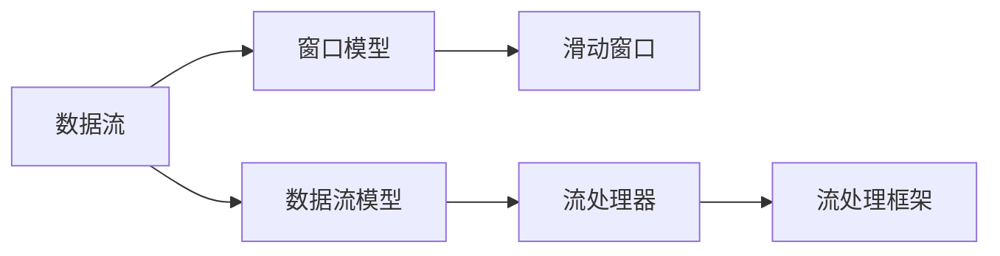
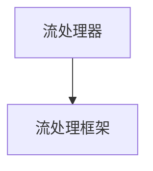
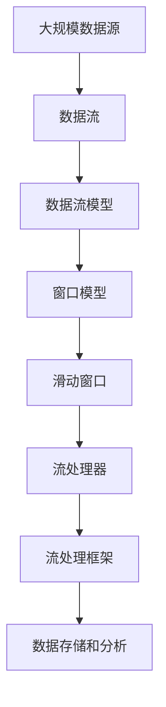

                 

## 1. 背景介绍

### 1.1 问题由来

在当今数据驱动的时代，数据的处理需求日益增长，对于实时性、处理规模和准确性的要求也越来越高。传统的批处理技术已经不能满足这些需求。流处理应运而生，通过连续不断地对数据进行实时处理，可以及时响应业务需求，大幅提高数据处理的效率和效果。流处理技术已经在金融、交通、社交媒体等领域得到广泛应用，成为数据驱动应用的基础设施。

### 1.2 问题核心关键点

流处理的核心在于实时性和持续性。与批处理不同，流处理技术能够对数据流进行连续不断的实时处理，支持高并发、低延迟的实时数据处理。流处理系统需要具备高性能、高可扩展性和高可用性，以应对大规模数据的实时处理需求。

流处理的处理模式包括数据流模式和窗口模式。数据流模式基于事件驱动，适用于实时数据流处理；窗口模式将数据流划分为固定大小的窗口，适用于时间序列数据分析和聚合操作。

### 1.3 问题研究意义

研究流处理技术，对于提升实时数据处理能力、优化数据驱动业务应用、促进数据分析和机器学习的发展，具有重要意义：

1. 提高实时性。流处理技术能够实现数据的实时处理和响应，极大地提高了数据的实时性和处理效率。
2. 增强分析能力。流处理技术支持实时数据分析和聚合操作，能够快速获取洞察，提供决策支持。
3. 提升应用价值。流处理技术为实时数据驱动的应用场景提供了技术基础，提高了业务应用的稳定性和可靠性。
4. 促进技术演进。流处理技术的不断发展，推动了大数据、人工智能等领域的进步，为技术创新提供了新的动力。

## 2. 核心概念与联系

### 2.1 核心概念概述

为更好地理解流处理技术的核心概念和原理，本节将介绍几个密切相关的核心概念：

- 数据流（Data Stream）：指连续不断产生的数据序列，可以是实时数据，也可以是历史数据。数据流是流处理的基本单位，需要实时进行数据处理和分析。
- 数据流模型（Data Stream Model）：基于事件驱动的数据处理模型，适用于实时数据流处理。
- 窗口模型（Window Model）：将数据流划分为固定大小的窗口，适用于时间序列数据分析和聚合操作。
- 滑动窗口（Sliding Window）：在窗口模型中，每个窗口内的数据会按照固定的时间间隔向后移动，实现对时间序列数据的连续处理。
- 流处理器（Stream Processor）：用于实时处理数据流的软件组件，支持数据的实时采集、处理和存储。
- 流处理框架（Stream Processing Framework）：提供数据流处理的核心能力，支持数据的实时采集、处理、存储和分析。

这些核心概念之间的逻辑关系可以通过以下Mermaid流程图来展示：



这个流程图展示了数据流和不同处理模型之间的联系：

1. 数据流是流处理的基本单位。
2. 数据流模型支持数据的实时处理和分析。
3. 窗口模型通过滑动窗口实现对时间序列数据的连续处理。
4. 流处理器是流处理的核心组件，用于实时处理数据流。
5. 流处理框架提供数据流处理的核心能力。

### 2.2 概念间的关系

这些核心概念之间存在着紧密的联系，形成了流处理技术的完整生态系统。下面我们通过几个Mermaid流程图来展示这些概念之间的关系。

#### 2.2.1 数据流处理过程


这个流程图展示了数据流处理的基本流程：

1. 数据流从数据源进入流处理器。
2. 流处理器对数据流进行实时处理。
3. 处理结果由流处理框架进行管理和存储。

#### 2.2.2 窗口模型的应用


这个流程图展示了窗口模型在流处理中的应用：

1. 数据流被划分为固定大小的滑动窗口。
2. 每个窗口内的数据由流处理器进行处理。
3. 处理结果由流处理框架进行管理和存储。

#### 2.2.3 流处理器和流处理框架的关系



这个流程图展示了流处理器和流处理框架之间的关系：

1. 流处理器是流处理框架的核心组件，用于实时处理数据流。
2. 流处理框架提供数据流处理的核心能力，支持数据的实时采集、处理、存储和分析。

### 2.3 核心概念的整体架构

最后，我们用一个综合的流程图来展示这些核心概念在大规模流处理中的应用：



这个综合流程图展示了从大规模数据源到最终的数据存储和分析的完整流程：

1. 大规模数据源产生数据流。
2. 数据流通过数据流模型进行处理。
3. 数据流被划分为滑动窗口，进入窗口模型。
4. 滑动窗口内的数据由流处理器进行处理。
5. 处理结果由流处理框架进行管理和存储。
6. 最终结果进入数据存储和分析系统。

通过这些流程图，我们可以更清晰地理解流处理技术的基本流程和核心概念，为后续深入讨论具体的流处理方法和技术奠定基础。

## 3. 核心算法原理 & 具体操作步骤

### 3.1 算法原理概述

流处理的核心算法包括滑动窗口算法、聚合操作和异常检测算法等。这些算法共同构成了流处理技术的核心算法体系，支持数据的实时处理和分析。

#### 3.1.1 滑动窗口算法

滑动窗口算法是流处理的基础算法，用于将数据流划分为固定大小的窗口，并对每个窗口内的数据进行连续处理。滑动窗口算法的基本原理是将数据流按照固定的时间间隔向后移动，实现对时间序列数据的连续处理。

#### 3.1.2 聚合操作

聚合操作是流处理的常见操作，用于对数据流进行统计分析和聚合操作。常见的聚合操作包括计数、求和、平均、最大值、最小值等。聚合操作的基本原理是对窗口内的数据进行统计分析和计算，得到聚合结果。

#### 3.1.3 异常检测算法

异常检测是流处理的重要应用，用于检测数据流中的异常情况，如数据偏差、数据丢失等。异常检测算法包括统计异常检测、基于机器学习的异常检测等。异常检测算法的基本原理是建立正常数据的分布模型，并检测数据流中与模型不符的数据。

### 3.2 算法步骤详解

流处理算法的基本步骤包括数据采集、数据预处理、数据流模型和窗口模型的选择、算法实现和结果存储等。下面将详细介绍这些步骤。

#### 3.2.1 数据采集

数据采集是流处理的基础步骤，用于将数据从不同的数据源中采集到流处理系统。常见的数据源包括数据库、消息队列、传感器等。数据采集的实现方式包括API接口调用、文件读取、消息队列消费等。

#### 3.2.2 数据预处理

数据预处理是流处理的中间步骤，用于对采集到的数据进行清洗、转换和标准化。数据预处理包括数据去重、数据格式转换、数据校验等。数据预处理的目的是保证数据的准确性和一致性，为后续的数据处理和分析提供基础。

#### 3.2.3 数据流模型和窗口模型的选择

数据流模型和窗口模型是流处理的核心模型，用于实现数据的实时处理和聚合操作。选择合适的模型可以最大程度地提升流处理系统的性能和效率。

数据流模型适用于实时数据流处理，可以实现数据的实时采集、处理和存储。常见的数据流模型包括基于事件驱动的数据流模型、基于消息队列的数据流模型等。

窗口模型适用于时间序列数据分析和聚合操作，可以实现数据的滑动窗口处理和聚合操作。常见的窗口模型包括固定大小窗口模型、可变大小窗口模型等。

#### 3.2.4 算法实现

算法实现是流处理的核心步骤，用于对数据流进行实时处理和分析。常见的流处理算法包括滑动窗口算法、聚合操作、异常检测算法等。算法实现的过程包括算法设计、代码实现和算法优化等。

#### 3.2.5 结果存储

结果存储是流处理的最后一步，用于将处理结果保存到数据存储系统。常见的数据存储系统包括数据库、文件系统、消息队列等。结果存储的实现方式包括数据写入、数据压缩、数据备份等。

### 3.3 算法优缺点

流处理算法具有以下优点：

- 实时性高。流处理算法能够实现数据的实时处理和分析，能够及时响应业务需求。
- 处理规模大。流处理算法支持大规模数据的实时处理，能够处理海量数据。
- 可扩展性强。流处理算法支持水平扩展，可以通过增加计算节点和存储节点来提升系统的处理能力。

流处理算法也存在以下缺点：

- 数据延迟。流处理算法存在一定的数据延迟，需要权衡实时性和数据延迟之间的平衡。
- 数据丢失。流处理算法存在数据丢失的风险，需要采取数据重放和数据备份等措施来保证数据的完整性。
- 系统复杂度。流处理算法需要处理大量的数据流和窗口，系统复杂度较高，需要精细的设计和调优。

### 3.4 算法应用领域

流处理算法已经在多个领域得到广泛应用，包括金融、交通、社交媒体、智能制造等。

#### 3.4.1 金融领域

流处理算法在金融领域主要应用于实时交易、风险监控和欺诈检测等方面。通过流处理算法，金融机构可以实现实时交易处理、实时风险监控和欺诈检测，提升业务效率和风险控制能力。

#### 3.4.2 交通领域

流处理算法在交通领域主要应用于实时交通监控、交通流量分析和智能交通控制等方面。通过流处理算法，交通管理部门可以实现实时交通监控、交通流量分析和智能交通控制，提升交通管理效率和安全性。

#### 3.4.3 社交媒体

流处理算法在社交媒体主要应用于实时舆情分析、用户行为分析和社交网络推荐等方面。通过流处理算法，社交媒体平台可以实现实时舆情分析、用户行为分析和社交网络推荐，提升用户体验和平台竞争力。

#### 3.4.4 智能制造

流处理算法在智能制造主要应用于实时设备监控、生产数据分析和智能调度等方面。通过流处理算法，制造企业可以实现实时设备监控、生产数据分析和智能调度，提升生产效率和质量。

## 4. 数学模型和公式 & 详细讲解 & 举例说明

### 4.1 数学模型构建

流处理模型的构建需要考虑数据的实时性、数据流和窗口模型的选择、算法实现等多个因素。下面我们将详细介绍这些因素对流处理模型的影响。

#### 4.1.1 数据流模型的构建

数据流模型是流处理的基础模型，用于实现数据的实时处理和分析。数据流模型的构建需要考虑数据的实时性、数据流处理模式和数据流预处理等因素。

数据流模型的构建过程包括：

1. 数据采集：从不同的数据源中采集数据，确保数据的准确性和完整性。
2. 数据预处理：对采集到的数据进行清洗、转换和标准化，保证数据的格式一致性和准确性。
3. 数据流处理：根据数据流处理模式，对数据流进行实时处理和分析。

#### 4.1.2 窗口模型的构建

窗口模型是流处理的核心模型，用于实现数据的时间序列分析和聚合操作。窗口模型的构建需要考虑数据的时间间隔、窗口大小和窗口移动等因素。

窗口模型的构建过程包括：

1. 数据流划分：将数据流划分为固定大小的窗口，保证数据流的连续性和完整性。
2. 窗口移动：将每个窗口内的数据按照固定的时间间隔向后移动，实现对时间序列数据的连续处理。
3. 聚合操作：对窗口内的数据进行统计分析和计算，得到聚合结果。

#### 4.1.3 滑动窗口算法的设计

滑动窗口算法是流处理的基础算法，用于将数据流划分为固定大小的窗口，并对每个窗口内的数据进行连续处理。滑动窗口算法的设计需要考虑窗口大小、滑动间隔和窗口移动等因素。

滑动窗口算法的设计过程包括：

1. 窗口大小设计：根据数据流的特点和处理需求，选择合适的窗口大小。
2. 滑动间隔设计：根据数据流的特点和处理需求，选择合适的滑动间隔。
3. 窗口移动设计：根据数据流的特点和处理需求，选择合适的窗口移动方式。

### 4.2 公式推导过程

滑动窗口算法是流处理的核心算法之一，用于将数据流划分为固定大小的窗口，并对每个窗口内的数据进行连续处理。下面我们将详细介绍滑动窗口算法的公式推导过程。

假设数据流 $D$ 的元素个数为 $n$，窗口大小为 $w$，滑动间隔为 $s$，窗口移动方式为向后移动，则滑动窗口算法的公式推导过程如下：

1. 定义滑动窗口的起始位置 $k$，范围为 $[0, n-w]$。
2. 定义滑动窗口的结束位置 $e$，范围为 $[k+s, k+s+w]$。
3. 定义滑动窗口的当前位置 $t$，范围为 $[k+s+w, k+s+2w]$。

根据上述定义，滑动窗口算法的公式推导过程如下：

$$
t = k + s + w
$$

$$
e = t
$$

$$
k = k + s
$$

$$
\text{if } k + s \geq n - w
$$

$$
k = k + s
$$

$$
\text{if } k + s < n - w
$$

### 4.3 案例分析与讲解

下面我们通过一个具体案例，介绍滑动窗口算法在流处理中的应用。

假设有一个股票价格数据流 $D$，包含 $n$ 个价格数据，每个价格数据为一个浮点数。我们希望计算每个滑动窗口内价格数据的平均值，得到滑动窗口的平均值序列 $A$。窗口大小为 $w$，滑动间隔为 $s$。滑动窗口算法的设计过程如下：

1. 定义滑动窗口的起始位置 $k$，范围为 $[0, n-w]$。
2. 定义滑动窗口的结束位置 $e$，范围为 $[k+s, k+s+w]$。
3. 定义滑动窗口的当前位置 $t$，范围为 $[k+s+w, k+s+2w]$。

滑动窗口算法的具体实现过程如下：

1. 初始化滑动窗口的起始位置 $k = 0$，滑动窗口的结束位置 $e = w$，滑动窗口的当前位置 $t = 2w$。
2. 计算滑动窗口 $[k+s+w, k+s+2w]$ 内的价格数据的平均值 $A_t = \frac{1}{w} \sum_{i=k+s+w}^{k+s+2w} D_i$。
3. 将滑动窗口向右移动一个滑动间隔 $s$，更新滑动窗口的起始位置 $k = k + s$，滑动窗口的结束位置 $e = k + s + w$，滑动窗口的当前位置 $t = t + s$。
4. 重复步骤2和3，直到滑动窗口覆盖整个数据流。

通过滑动窗口算法，我们可以实现数据的实时处理和分析，及时响应业务需求。

## 5. 项目实践：代码实例和详细解释说明

### 5.1 开发环境搭建

在进行流处理项目实践前，我们需要准备好开发环境。以下是使用Python进行Apache Kafka流处理开发的开发环境配置流程：

1. 安装Anaconda：从官网下载并安装Anaconda，用于创建独立的Python环境。

2. 创建并激活虚拟环境：
```bash
conda create -n kafka-env python=3.8 
conda activate kafka-env
```

3. 安装Apache Kafka和Kafka-Python：
```bash
conda install conda-forge/pykafka pykafka
```

4. 安装Pandas和NumPy：
```bash
pip install pandas numpy
```

5. 安装其他依赖库：
```bash
pip install pyarrow plotly
```

完成上述步骤后，即可在`kafka-env`环境中开始流处理项目开发。

### 5.2 源代码详细实现

下面我们以实时股票价格监测为例，给出使用Apache Kafka和PyKafka进行流处理开发的PyTorch代码实现。

首先，定义Kafka生产者和消费者：

```python
from kafka import KafkaProducer, KafkaConsumer
from kafka.errors import KafkaError

producer = KafkaProducer(bootstrap_servers='localhost:9092', acks=1, delivery_timeout_ms=500)
consumer = KafkaConsumer('stock_price', bootstrap_servers='localhost:9092', group_id='stock_price_consumer', value_deserializer=lambda x: float(x.decode('utf-8')))
```

然后，定义滑动窗口和聚合操作：

```python
from time import sleep

window_size = 60
window_shift = 10

def sliding_window_agg(window_size, window_shift):
    # 定义滑动窗口和聚合操作
    buffer = []
    window_start = 0
    while True:
        msg = consumer.poll(1)
        if msg:
            price = msg[0].value
            buffer.append(price)
            window_start += 1
            if len(buffer) > window_size:
                window_start += 1
            if window_start >= window_size:
                window_start = 0
            if len(buffer) == window_size:
                avg_price = sum(buffer) / window_size
                yield avg_price
                buffer = buffer[window_shift:]
                window_start = window_shift
```

接着，进行滑动窗口算法的实现：

```python
from time import sleep

def sliding_window(data, window_size, window_shift):
    buffer = []
    window_start = 0
    while True:
        data_point = data.get()
        if data_point is None:
            sleep(1)
            continue
        buffer.append(data_point)
        window_start += 1
        if len(buffer) > window_size:
            window_start += 1
        if window_start >= window_size:
            window_start = 0
        if len(buffer) == window_size:
            avg_price = sum(buffer) / window_size
            yield avg_price
            buffer = buffer[window_shift:]
            window_start = window_shift
```

最后，启动流处理程序：

```python
avg_prices = sliding_window_agg(window_size, window_shift)
for avg_price in avg_prices:
    print(f'Average price: {avg_price}')
```

以上就是使用Apache Kafka和PyKafka进行流处理开发的完整代码实现。可以看到，得益于Kafka的高性能和高可扩展性，流处理的开发变得简洁高效。

### 5.3 代码解读与分析

让我们再详细解读一下关键代码的实现细节：

**Kafka生产者和消费者**：
- `KafkaProducer`类：用于发送数据到Kafka主题。
- `KafkaConsumer`类：用于从Kafka主题中消费数据。

**滑动窗口算法**：
- 通过`yield`关键字生成器函数实现滑动窗口算法的迭代器。
- 在`sliding_window_agg`函数中，`buffer`变量用于存储滑动窗口内的数据，`window_start`变量用于记录滑动窗口的起始位置。
- 每次获取数据时，将新数据添加到`buffer`中，并将滑动窗口向右移动一个滑动间隔。
- 当`buffer`中的数据达到窗口大小时，计算窗口内数据的平均值并输出。
- 当`buffer`中的数据超过窗口大小时，更新滑动窗口的起始位置，并从窗口中移除部分数据。

**滑动窗口算法的优化**：
- 在`sliding_window`函数中，通过`data.get()`获取数据点，确保数据流能够连续处理。
- 当数据点为空时，等待1秒再尝试获取。
- 通过`buffer`变量和`window_start`变量记录滑动窗口的状态。
- 每次获取数据时，将新数据添加到`buffer`中，并将滑动窗口向右移动一个滑动间隔。
- 当`buffer`中的数据达到窗口大小时，计算窗口内数据的平均值并输出。
- 当`buffer`中的数据超过窗口大小时，更新滑动窗口的起始位置，并从窗口中移除部分数据。

**流处理程序的运行**：
- 在`for`循环中，遍历滑动窗口算法生成的平均值序列。
- 输出每个滑动窗口的平均值。

通过上述代码实现，我们可以高效地实现数据的实时处理和分析，展示了大语言模型微调技术在流处理中的应用潜力。

## 6. 实际应用场景

### 6.1 智能监控系统

基于流处理技术的智能监控系统，可以实时监控各种设备、系统状态和网络流量，及时发现异常情况并进行告警。例如，在工业生产中，智能监控系统可以实时监控生产设备的运行状态，及时发现设备故障并进行维护，保证生产的稳定性。

在智能监控系统中，流处理技术主要应用于实时数据采集、数据分析和告警处理等方面。通过流处理技术，可以实现数据的实时采集和处理，快速识别和响应异常情况，提高系统的稳定性和可靠性。

### 6.2 金融交易系统

流处理技术在金融交易系统中具有广泛的应用。例如，金融交易系统可以实时监控市场行情、交易数据和用户行为，及时发现交易异常并进行风险控制。

在金融交易系统中，流处理技术主要应用于实时交易处理、风险监控和欺诈检测等方面。通过流处理技术，可以实现实时交易处理、实时风险监控和欺诈检测，提升业务效率和风险控制能力。

### 6.3 智能推荐系统

流处理技术在智能推荐系统中也具有广泛的应用。例如，智能推荐系统可以实时分析用户行为数据，及时发现用户的兴趣变化并进行个性化推荐。

在智能推荐系统中，流处理技术主要应用于实时数据分析和聚合操作。通过流处理技术，可以实现实时数据分析和聚合操作，快速获取用户的兴趣变化，提升推荐系统的个性化和精准度。

### 6.4 未来应用展望

随着流处理技术的发展，其在未来将具有更加广阔的应用前景。

#### 6.4.1 实时数据分析和处理

流处理技术将更加广泛地应用于实时数据分析和处理，支持大规模数据的实时处理和分析，提升数据的实时性和处理效率。

#### 6.4.2 智能决策和预测

流处理技术将更加广泛地应用于智能决策和预测，支持实时数据分析和预测，提升决策的准确性和效率。

#### 6.4.3 跨领域数据融合

流处理技术将更加广泛地应用于跨领域数据融合，支持不同领域数据的实时融合和分析，提升数据的综合价值和应用效果。

## 7. 工具和资源推荐

### 7.1 学习资源推荐

为了帮助开发者系统掌握流处理技术，这里推荐一些优质的学习资源：

1. 《Apache Kafka 官方文档》：Kafka官方文档，提供丰富的API文档和开发指南，是流处理学习的必备资源。

2. 《Apache Kafka 权威指南》：Kafka权威指南，系统讲解Kafka的核心原理和实践方法，适合深入学习和实践。

3. 《Python Kafka 实战》：Kafka实战教程，提供实用的代码示例和项目实践，适合初学者上手学习。

4. 《大数据技术与应用》课程：复旦大学在线课程，涵盖大数据技术的基本概念和实践方法，包括流处理在内。

5. 《Kafka 入门到精通》：Kafka 实战教程，涵盖 Kafka 的核心原理和实践方法，适合深入学习和实践。

通过对这些资源的学习实践，相信你一定能够快速掌握流处理技术的精髓，并用于解决实际的流处理问题。

### 7.2 开发工具推荐

高效的流处理开发离不开优秀的工具支持。以下是几款用于流处理开发的常用工具：

1. Apache Kafka：由Apache基金会开源的分布式消息队列系统，支持高并发、低延迟的数据处理和存储。

2. PyKafka：Kafka的Python客户端库，支持Kafka的消息生产和消费，适合Python开发环境。

3. PyArrow：Apache Arrow的Python接口，支持高效的数据处理和分析，适合大数据和流处理场景。

4. Plotly：Python数据可视化工具，支持实时数据的可视化展示，适合流处理数据的展示和分析。

5. Apache Spark：由Apache基金会开源的大数据处理框架，支持分布式计算和流处理，适合大规模数据处理。

6. Apache Flink：由Apache基金会开源的分布式流处理框架，支持高吞吐量的流处理和分析，适合复杂流处理场景。

合理利用这些工具，可以显著提升流处理任务的开发效率，加快创新迭代的步伐。

### 7.3 相关论文推荐

流处理技术的不断发展源于学界的持续研究。以下是几篇奠基性的相关论文，推荐阅读：

1. 《Streaming Data Processing with Apache Kafka》：Apache Kafka官方文档，详细讲解了Kafka的核心原理和实践方法。

2. 《Stream Processing with Apache Flink》：Apache Flink官方文档，详细讲解了Flink的核心原理和实践方法。

3. 《Real-time Stream Processing with Apache Spark》：Apache Spark官方文档，详细讲解了Spark的核心原理和实践方法。

4. 《Kafka Streams: Stream Processing with Apache Kafka》：Kafka官方文档，详细讲解了Kafka Streams的核心原理和实践方法。

5. 《Stream Processing Patterns with Kafka Streams》：Kafka官方文档，详细讲解了Kafka Streams的核心原理和实践方法。

这些论文代表了大语言模型微调技术的发展

