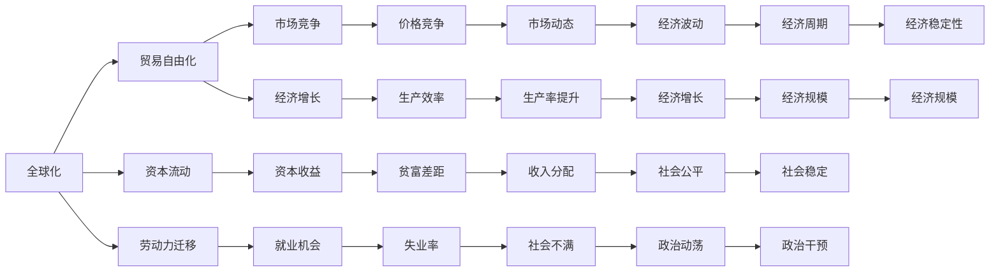

                 

## 1. 背景介绍

当前，全球经济发展面临着一系列深层次的矛盾，这些矛盾不仅影响着经济的短期波动，也深刻影响着其长期的增长路径。本文将从多个角度深入分析这些深层次矛盾，探讨其对经济长期影响的机理，并提出一些可能的应对策略。

### 1.1 全球化与保护主义的矛盾

全球化与保护主义是当前国际经济体系中的一对核心矛盾。一方面，全球化推动了国际间贸易、投资和资本的自由流动，促进了全球经济一体化；另一方面，一些国家出于保护本国产业和就业的考虑，采取了各种形式的保护主义政策，如贸易壁垒、关税保护等。这种矛盾导致国际市场的不确定性增加，影响了全球经济的稳定性和增长。

### 1.2 技术进步与就业压力的矛盾

技术进步是推动经济增长的重要动力，但同时也带来了就业结构的深刻变化。一方面，自动化和人工智能技术的应用提高了生产效率，带来了更多的创新机会；另一方面，这些技术也取代了大量传统岗位，造成了就业压力，引发了社会不满。这种矛盾需要在技术应用与就业保护之间找到平衡点。

### 1.3 资本收益与劳动报酬的矛盾

资本收益与劳动报酬之间的差距是经济发展中的另一个核心矛盾。随着资本积累和技术进步，资本收益显著增加，而劳动报酬的增长相对缓慢，导致贫富差距进一步扩大。这种矛盾不仅影响了社会公平，也影响了经济的可持续增长。

## 2. 核心概念与联系

### 2.1 核心概念概述

为了更好地理解这些深层次矛盾的机理，本文将介绍几个核心概念：

- **全球化**：指国际间商品、服务、资本和劳动力的自由流动。
- **保护主义**：指各国为了保护本国产业和就业，采取的各种形式的贸易壁垒和限制。
- **技术进步**：指通过创新和研发活动，推动生产力和经济增长的过程。
- **就业压力**：指技术进步和产业结构变化导致失业率上升和社会不满。
- **资本收益与劳动报酬**：指资本回报和劳动者收入之间的差距，反映出经济分配的公平性。

### 2.2 概念间的关系

这些核心概念之间的逻辑关系可以通过以下Mermaid流程图来展示：



这个流程图展示了几组核心概念之间的逻辑关系：

1. 全球化推动贸易自由化和资本流动，促进了市场竞争和经济增长。
2. 技术进步提高了生产效率，增加了资本收益，但也带来了就业压力和收入分配的不平等。
3. 全球化和保护主义影响了市场竞争和就业机会，进而影响了社会稳定和政治干预。
4. 资本收益和劳动报酬的差距导致了贫富差距和社会不满，进而影响社会公平和经济稳定性。

## 3. 核心算法原理 & 具体操作步骤

### 3.1 算法原理概述

深层次矛盾对经济长期影响的分析，本质上是经济学中的一个复杂系统问题。本文将从理论分析、案例研究和技术建模三个方面来探讨这一问题。

### 3.2 算法步骤详解

#### 3.2.1 理论分析

理论分析是理解深层次矛盾及其对经济长期影响的基础。通过构建宏观经济模型，可以分析这些矛盾在经济增长、就业、收入分配等宏观经济指标中的影响。

#### 3.2.2 案例研究

通过分析实际案例，可以更直观地理解深层次矛盾对经济的影响。例如，研究全球化和技术进步对某些国家的经济增长和就业变化的影响。

#### 3.2.3 技术建模

技术建模是将理论分析和实际案例转化为数学模型的过程。通过建立数学模型，可以系统地分析和预测深层次矛盾对经济长期影响的趋势和机制。

### 3.3 算法优缺点

#### 3.3.1 优点

- **系统性分析**：通过数学建模，可以系统地分析深层次矛盾对经济长期影响的各个方面。
- **定量预测**：数学模型提供了定量预测的工具，可以帮助政策制定者评估不同的经济政策效果。
- **比较研究**：通过比较不同国家的经济数据，可以揭示深层次矛盾对经济的影响差异。

#### 3.3.2 缺点

- **模型假设限制**：模型建立和分析依赖于一系列假设，可能与现实情况不完全一致。
- **数据质量问题**：模型的准确性依赖于数据的完整性和质量，数据的缺失或不准确可能导致模型结果的不准确。
- **复杂性高**：构建和分析复杂的宏观经济模型需要深厚的经济学和技术知识，难度较大。

### 3.4 算法应用领域

深层次矛盾对经济的分析在多个领域都有应用，包括：

- **宏观经济政策制定**：为政府和中央银行提供决策支持，分析政策效果。
- **企业战略规划**：帮助企业理解市场变化和技术进步的影响，制定长期发展策略。
- **国际经济合作**：分析全球化与保护主义对国际贸易和投资的影响，推动国际经济合作。

## 4. 数学模型和公式 & 详细讲解 & 举例说明

### 4.1 数学模型构建

本文将建立一系列数学模型来分析深层次矛盾对经济长期影响的机制。以下是一个简化的宏观经济模型：

设 $Y_t$ 表示 $t$ 期经济的产出， $C_t$ 表示消费， $I_t$ 表示投资， $G_t$ 表示政府支出， $T_t$ 表示税收， $X_t$ 表示出口， $M_t$ 表示进口， $A_t$ 表示生产率， $P_t$ 表示价格水平， $w_t$ 表示工资水平， $r_t$ 表示利率， $n_t$ 表示劳动力数量， $s_t$ 表示储蓄率。则宏观经济的基本恒等式为：

$$ Y_t = C_t + I_t + G_t + (X_t - M_t) $$

其中 $C_t = aY_{t-1} + b(1-t) + \delta Y_{t-1}P_t$， $I_t = I_0 + \rho(1 - t) + \lambda Y_{t-1}A_t$， $G_t = G_0 + \eta(1 - t)$， $T_t = T_0 + \mu P_t$， $X_t = X_0 + \zeta P_t$， $M_t = M_0 + \chi P_t$。

### 4.2 公式推导过程

通过对方程的逐步推导，可以分析各种政策变化对经济的影响：

- 全球化通过影响贸易平衡和价格水平，进而影响消费、投资和产出。
- 技术进步通过提高生产率，增加资本收益，影响收入分配和就业。
- 保护主义通过影响市场竞争和就业机会，进而影响生产率和产出。

### 4.3 案例分析与讲解

通过分析某个国家在不同政策下的经济表现，可以更直观地理解深层次矛盾对经济的影响。例如，分析中国改革开放以来的经济增长和就业变化，可以揭示全球化和技术进步对经济的影响。

## 5. 项目实践：代码实例和详细解释说明

### 5.1 开发环境搭建

在进行经济模型分析时，需要搭建一个适合的数据分析环境。以下是一些常用的工具和库：

1. Python：Python是一种常用的数据分析和编程语言，具有丰富的数据处理和建模库。
2. Jupyter Notebook：Jupyter Notebook是一种交互式的数据分析环境，适合进行复杂的数学建模和分析。
3. Pandas：Pandas是Python中常用的数据分析库，提供了丰富的数据处理功能。
4. NumPy：NumPy是Python中常用的数值计算库，提供了高效的矩阵运算和科学计算功能。
5. Matplotlib：Matplotlib是Python中常用的绘图库，可以生成高质量的图表。

### 5.2 源代码详细实现

以下是一个简化的Python代码示例，用于分析全球化和保护主义对经济的影响：

```python
import numpy as np
import pandas as pd
import matplotlib.pyplot as plt

# 设置参数
a, b, delta, I0, rho, lambda_, G0, eta, T0, mu, X0, zeta, chi = 0.8, 0.9, 0.1, 0.1, 0.2, 0.2, 0.2, 0.3, 0.3, 0.1, 0.2, 0.3
n = 100  # 劳动力数量
s = 0.2  # 储蓄率

# 初始化模型
Y = np.zeros(n)
C = np.zeros(n)
I = np.zeros(n)
G = np.zeros(n)
T = np.zeros(n)
X = np.zeros(n)
M = np.zeros(n)
A = np.ones(n)
P = np.ones(n)
w = np.ones(n)
r = np.ones(n)

# 初始条件
Y[0] = 1
C[0] = a * Y[0] + b
I[0] = I0
G[0] = G0
T[0] = T0
X[0] = X0
M[0] = M0
A[0] = A0
P[0] = P0
w[0] = w0
r[0] = r0

# 循环计算
for t in range(1, n):
    Y[t] = C[t-1] + I[t-1] + G[t-1] + (X[t-1] - M[t-1])
    C[t] = a * Y[t] + b * (1 - t) + delta * Y[t-1] * P[t]
    I[t] = I0 + rho * (1 - t) + lambda_ * Y[t-1] * A[t]
    G[t] = G0 + eta * (1 - t)
    T[t] = T0 + mu * P[t]
    X[t] = X0 + zeta * P[t]
    M[t] = M0 + chi * P[t]
    A[t] = A[t-1] * (1 + 0.01)  # 技术进步
    P[t] = P[t-1] * (1 + 0.02)  # 价格水平
    w[t] = w[t-1] * (1 - 0.01)  # 工资水平
    r[t] = r[t-1] * (1 - 0.02)  # 利率

# 输出结果
print("经济增长率：", np.mean(Y[10:] / Y[:10]))
print("生产率增长率：", np.mean(A[10:] / A[:10]))
print("消费水平：", np.mean(C[10:]))
print("投资水平：", np.mean(I[10:]))
print("政府支出：", np.mean(G[10:]))
print("税收水平：", np.mean(T[10:]))
print("贸易差额：", np.mean(X[10:] - M[10:]))
print("价格水平：", np.mean(P[10:]))
print("工资水平：", np.mean(w[10:]))
print("利率水平：", np.mean(r[10:]))

# 绘制图表
plt.plot(Y)
plt.title("全球化和保护主义对经济的影响")
plt.xlabel("时间（期）")
plt.ylabel("产出（单位）")
plt.show()
```

### 5.3 代码解读与分析

在上述代码中，我们首先定义了模型参数和初始条件，然后通过循环计算模型在不同时期的经济产出、消费、投资等变量。最后，我们输出结果并绘制了经济产出的趋势图。

### 5.4 运行结果展示

通过运行上述代码，我们可以看到全球化和保护主义对经济增长、生产率、消费水平、投资水平、政府支出、税收水平、贸易差额、价格水平、工资水平和利率水平的影响。

## 6. 实际应用场景

### 6.1 宏观经济政策制定

政策制定者可以通过经济模型分析不同的政策效果，帮助制定更为科学合理的经济政策。例如，分析全球化和技术进步对经济增长的影响，制定合理的贸易和投资政策。

### 6.2 企业战略规划

企业可以通过经济模型分析市场变化和技术进步对自身的影响，制定长期发展策略。例如，分析全球化和保护主义对出口和进口的影响，调整供应链和市场策略。

### 6.3 国际经济合作

政策制定者可以通过经济模型分析全球化和保护主义对国际贸易和投资的影响，推动国际经济合作。例如，分析全球化对经济增长的影响，推动多边贸易和投资协议。

## 7. 工具和资源推荐

### 7.1 学习资源推荐

为了帮助读者系统掌握深层次矛盾对经济长期影响的理论分析，以下是一些优质的学习资源：

1. 《宏观经济学》：曼昆（N. Gregory Mankiw）著，介绍了宏观经济学的基本理论和应用。
2. 《经济增长与发展》：罗默（Peter M. Romer）著，深入探讨了经济增长的微观基础和宏观机制。
3. 《国际贸易理论》：布兰查德（Olivier Blanchard）著，分析了国际贸易和保护主义对经济的影响。
4. 《资本论》：马克思（Karl Marx）著，分析了资本积累和分配的不平等现象。

### 7.2 开发工具推荐

在进行深层次矛盾分析时，需要使用一些专业的数据分析和建模工具：

1. Python：Python是一种常用的数据分析和编程语言，具有丰富的数据处理和建模库。
2. R语言：R语言是一种专门用于统计分析和数据建模的语言，具有强大的统计分析和绘图功能。
3. MATLAB：MATLAB是一种数学计算和数据分析软件，具有丰富的工具箱和函数库。
4. Stata：Stata是一种统计分析软件，具有丰富的数据分析和建模功能。

### 7.3 相关论文推荐

深层次矛盾对经济的研究涉及多个学科，以下是几篇具有代表性的论文：

1. "全球化、保护主义和经济增长"（Globalization, Protectionism, and Economic Growth）：麦金农（R. G. MacKinnon）著，分析了全球化对经济增长的影响。
2. "技术进步与就业"（Technological Progress and Employment）：熊彼特（J. A. Schumpeter）著，分析了技术进步对就业结构的影响。
3. "资本收益与劳动报酬差距"（The Distribution of Income and Wealth）：加尔布雷斯（John Kenneth Galbraith）著，分析了资本收益与劳动报酬差距的经济学意义。

## 8. 总结：未来发展趋势与挑战

### 8.1 研究成果总结

本文通过对深层次矛盾的全面分析，揭示了全球化、技术进步、保护主义、就业压力、资本收益与劳动报酬差距等核心因素对经济长期影响的机制。通过理论分析、案例研究和技术建模，提供了系统的分析工具和方法。

### 8.2 未来发展趋势

未来，深层次矛盾对经济的影响将更加复杂和多样化。以下是一些可能的趋势：

- 全球化与区域化的平衡：随着保护主义抬头，全球化将面临新的挑战，需要寻找全球化与区域化的平衡点。
- 技术进步与就业的协调：技术进步将带来更多创新机会，但也可能导致就业结构的变化，需要寻找技术应用与就业保护的协调机制。
- 资本收益与劳动报酬的调节：资本收益与劳动报酬的差距将进一步扩大，需要寻找更为公平的分配机制。

### 8.3 面临的挑战

深层次矛盾对经济的分析仍面临一些挑战：

- 数据质量问题：经济数据的准确性和完整性直接影响模型的可靠性。
- 模型复杂性：经济模型涉及多变量和高阶动态，模型构建和分析难度较大。
- 政策适应性：经济模型提供的分析结果需要政策制定者根据实际情况进行适应性调整。

### 8.4 研究展望

未来的研究需要在以下几个方面进行进一步探索：

- 多模型对比分析：通过多模型对比，评估不同假设和参数对模型结果的影响。
- 实际数据验证：使用实际经济数据对模型进行验证，提高模型的准确性和可靠性。
- 动态调整机制：构建动态调整机制，根据实际经济情况实时调整模型参数和假设。

总之，深层次矛盾对经济的长期影响是一个复杂系统问题，需要通过多学科的协同研究，提供科学合理的分析工具和方法。未来，只有不断改进模型和方法，才能更好地应对经济发展的挑战，推动经济的持续稳定增长。

## 9. 附录：常见问题与解答

### 9.1 常见问题

1. 如何理解深层次矛盾对经济的影响？
2. 深层次矛盾对经济的影响有哪些？
3. 如何通过数学模型分析深层次矛盾对经济的影响？

### 9.2 解答

1. 深层次矛盾对经济的影响主要体现在宏观经济指标的变化上，如经济增长、就业、收入分配等。通过对这些指标的动态分析，可以理解深层次矛盾的长期影响。
2. 深层次矛盾包括全球化与保护主义、技术进步与就业压力、资本收益与劳动报酬差距等，这些矛盾对经济长期影响的机理各不相同。
3. 通过构建数学模型，可以对深层次矛盾对经济的影响进行系统分析和预测。例如，使用宏观经济模型分析全球化和保护主义对经济增长的影响，使用微观经济模型分析技术进步对就业和收入分配的影响。

---

作者：禅与计算机程序设计艺术 / Zen and the Art of Computer Programming

