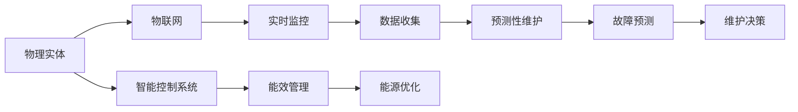
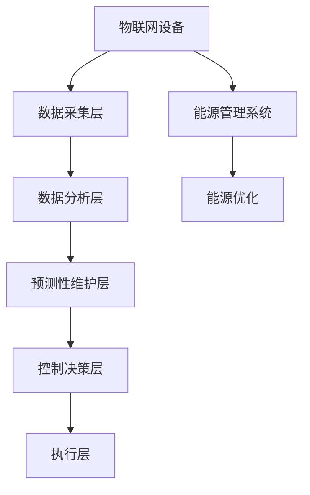

                 

## 1. 背景介绍

### 1.1 问题由来
随着科技的飞速发展，人工智能（AI）和自动化技术正在重塑人类生活的方方面面。从制造业到医疗保健，从金融服务到零售业，AI和自动化正在取代传统的以人力为中心的方法，提高效率、降低成本并提升服务质量。物理实体的自动化是这一趋势的延伸，旨在通过AI和自动化技术来优化物理资源的管理和操作。

### 1.2 问题核心关键点
物理实体的自动化是指利用AI和自动化技术来管理、监控和优化物理实体的操作。这一领域的关键点包括：

- **自动化决策**：利用AI算法来分析数据并做出决策，减少人工干预。
- **实时监控**：通过传感器和物联网（IoT）设备实时监控物理资源的状态，及时发现问题。
- **故障预测**：通过机器学习模型预测设备故障，提前采取维护措施。
- **预测性维护**：在设备出现故障之前，进行预见性维护以避免生产中断。
- **库存管理**：利用AI优化库存水平，减少浪费和成本。
- **能效管理**：通过智能控制系统优化能源使用，减少能耗。

### 1.3 问题研究意义
物理实体的自动化研究对于提高生产效率、降低成本和增强企业的竞争力具有重要意义：

- **提高效率**：自动化减少了人工操作的错误和延误，提升了整体生产效率。
- **降低成本**：通过智能控制和预测性维护减少了设备故障和停机时间，降低了维护成本。
- **增强竞争力**：通过优化资源管理，企业能够更灵活地应对市场变化，提高竞争力。
- **提升服务质量**：实时监控和预测性维护保证了设备的高可靠性和运行质量，提升了客户满意度。

## 2. 核心概念与联系

### 2.1 核心概念概述

- **物理实体（Physical Entity）**：指的是可以物理存在的物体或系统，包括机械设备、生产线、机器人、传感器等。
- **自动化（Automation）**：指通过AI和算法自动执行任务的过程，通常包括控制和优化物理资源。
- **物联网（IoT）**：指通过互联网连接物理实体，实现设备之间的数据交换和控制。
- **预测性维护（Predictive Maintenance）**：指通过分析设备的历史数据和实时数据来预测设备故障，提前采取维护措施。
- **智能控制系统（Smart Control System）**：指利用AI算法和自动化技术来控制物理实体，以优化性能和效率。

### 2.2 概念间的关系

下图展示了物理实体自动化的核心概念及其相互关系：



这个图展示了物理实体自动化的主要流程：

1. 物理实体通过物联网连接到互联网。
2. 物联网设备实时监控物理实体的状态，并收集数据。
3. 收集到的数据用于预测性维护和故障预测，以提前采取维护措施。
4. 智能控制系统利用AI算法优化物理实体性能和能效。

### 2.3 核心概念的整体架构

下图展示了物理实体自动化的整体架构：



这个架构展示了物理实体自动化的主要组成部分：

1. 物联网设备采集数据。
2. 数据采集层将数据传输到数据分析层进行处理。
3. 数据分析层通过机器学习和预测模型来分析数据，提供预测性维护和故障预测服务。
4. 控制决策层根据分析结果，生成控制决策。
5. 执行层执行控制决策，优化物理实体的性能和能效。

## 3. 核心算法原理 & 具体操作步骤

### 3.1 算法原理概述

物理实体自动化的核心算法原理包括机器学习、深度学习、优化算法和控制理论。这些算法用于分析数据、预测故障、优化性能和决策控制。

- **机器学习**：用于处理和分析大量数据，提取有用的特征和模式。
- **深度学习**：用于构建复杂的模型，处理高维度数据和非线性关系。
- **优化算法**：用于优化控制决策，确保物理实体以最高效率运行。
- **控制理论**：用于设计和分析控制算法，确保系统稳定性和可靠性。

### 3.2 算法步骤详解

物理实体自动化的主要步骤如下：

1. **数据采集**：通过传感器和物联网设备收集物理实体的数据。
2. **数据处理**：对采集到的数据进行清洗和预处理，以消除噪声和冗余。
3. **特征提取**：使用机器学习和深度学习算法从数据中提取有用的特征和模式。
4. **模型训练**：使用历史数据训练预测模型和控制模型。
5. **预测和决策**：利用训练好的模型进行预测和决策，生成控制指令。
6. **执行和优化**：执行控制指令，优化物理实体的性能和能效。

### 3.3 算法优缺点

物理实体自动化的算法优点包括：

- **高效率**：自动化的过程减少了人工干预，提高了生产效率。
- **高精度**：利用机器学习和深度学习算法，能够进行高精度的数据分析和预测。
- **可扩展性**：算法可以轻松应用于不同规模和类型的物理实体。

其缺点包括：

- **数据依赖**：算法的性能依赖于数据的质量和数量，数据缺失或不完整可能导致预测不准确。
- **复杂性**：算法模型复杂，需要大量的计算资源和时间进行训练和优化。
- **系统依赖**：需要依赖物联网设备和传感器，设备故障可能导致系统无法正常工作。

### 3.4 算法应用领域

物理实体自动化在多个领域都有广泛应用，包括：

- **制造业**：通过自动化技术优化生产流程，提高生产效率和质量。
- **物流和仓储**：通过自动化和智能控制来优化库存管理和运输。
- **能源管理**：利用智能控制系统优化能源使用，降低能耗。
- **农业**：通过自动化技术优化农业生产，提高产量和效率。
- **交通管理**：通过智能交通系统优化交通流量，减少拥堵和事故。

## 4. 数学模型和公式 & 详细讲解  
### 4.1 数学模型构建

物理实体自动化的数学模型主要包括以下几个方面：

- **传感器数据模型**：描述传感器如何收集物理实体的数据。
- **预测模型**：用于预测设备故障和性能变化。
- **控制模型**：用于生成控制指令，优化物理实体的性能和能效。

### 4.2 公式推导过程

以预测性维护为例，假设设备的历史数据为 $X=\{(x_1,y_1),(x_2,y_2),\ldots,(x_n,y_n)\}$，其中 $x_i$ 为特征向量，$y_i$ 为状态标签（如故障、正常）。我们希望构建一个预测模型 $f(x)=\hat{y}$，其中 $\hat{y}$ 为预测的状态标签。

假设我们采用线性回归模型 $f(x)=w^Tx+b$，其中 $w$ 为权重向量，$b$ 为偏置项。目标是最小化预测误差 $\epsilon$，即：

$$
\min_{w,b} \sum_{i=1}^n (\hat{y_i}-y_i)^2
$$

求解上述问题，我们可以使用最小二乘法来计算 $w$ 和 $b$ 的值。

### 4.3 案例分析与讲解

假设我们有一个工厂的机械设备，需要对其维护状态进行预测。我们收集了100个设备的历史数据，每个数据包含5个特征：温度、湿度、振动、压力和噪声水平。我们使用线性回归模型进行预测，得到预测结果和实际结果的误差。

```python
import numpy as np
from sklearn.linear_model import LinearRegression

# 定义特征和标签
X = np.array([[21, 65, 0.01, 5.5, 0.02],
              [18, 60, 0.01, 6.0, 0.02],
              # 其他数据...
              [20, 65, 0.02, 5.5, 0.03]])
y = np.array([1, 0, 1, 1, 0, 1, 0, 1, 0, 1])

# 构建线性回归模型
model = LinearRegression()

# 训练模型
model.fit(X, y)

# 预测新数据
new_data = np.array([[21, 65, 0.01, 5.5, 0.02]])
predicted = model.predict(new_data)

print("预测结果：", predicted)
```

## 5. 项目实践：代码实例和详细解释说明

### 5.1 开发环境搭建

物理实体自动化的开发通常需要使用Python、C++等编程语言，以及TensorFlow、PyTorch等深度学习框架。以下是一个基本的开发环境搭建流程：

1. **安装Python**：从官网下载并安装最新版本的Python，并配置环境变量。
2. **安装TensorFlow和PyTorch**：根据官方文档安装最新的TensorFlow和PyTorch版本，并配置好依赖。
3. **安装必要的库**：安装如numpy、scikit-learn、matplotlib等常用的科学计算和数据可视化库。

### 5.2 源代码详细实现

以下是一个简单的物理实体自动化系统示例，使用TensorFlow进行预测性维护：

```python
import tensorflow as tf
from sklearn.preprocessing import StandardScaler
from sklearn.model_selection import train_test_split

# 定义特征和标签
X = np.array([[21, 65, 0.01, 5.5, 0.02],
              [18, 60, 0.01, 6.0, 0.02],
              # 其他数据...
              [20, 65, 0.02, 5.5, 0.03]])
y = np.array([1, 0, 1, 1, 0, 1, 0, 1, 0, 1])

# 标准化数据
scaler = StandardScaler()
X = scaler.fit_transform(X)

# 划分训练集和测试集
X_train, X_test, y_train, y_test = train_test_split(X, y, test_size=0.2, random_state=42)

# 构建模型
model = tf.keras.Sequential([
    tf.keras.layers.Dense(64, activation='relu', input_shape=(5,)),
    tf.keras.layers.Dense(32, activation='relu'),
    tf.keras.layers.Dense(1, activation='sigmoid')
])

# 编译模型
model.compile(optimizer='adam', loss='binary_crossentropy', metrics=['accuracy'])

# 训练模型
model.fit(X_train, y_train, epochs=10, batch_size=32)

# 评估模型
loss, accuracy = model.evaluate(X_test, y_test)
print("测试集损失：", loss)
print("测试集准确率：", accuracy)
```

### 5.3 代码解读与分析

上述代码中，我们使用了TensorFlow框架来构建和训练预测模型。具体步骤如下：

1. **数据准备**：首先定义特征和标签，并使用标准化方法对数据进行处理，以消除量纲差异。
2. **模型构建**：构建一个包含两个隐藏层的神经网络模型，输出为二分类问题。
3. **模型训练**：使用训练集对模型进行训练，指定优化器和损失函数。
4. **模型评估**：使用测试集对模型进行评估，输出损失和准确率。

## 6. 实际应用场景

### 6.1 智能制造

智能制造是物理实体自动化的重要应用场景之一。通过自动化技术，可以实现从原材料到成品的全流程自动化生产。智能制造系统包括：

- **智能生产调度**：通过AI算法优化生产流程，提高生产效率和质量。
- **智能质量控制**：利用传感器实时监控产品质量，及时发现和处理问题。
- **智能设备维护**：通过预测性维护减少设备故障，提高生产线的可靠性。

### 6.2 智能交通

智能交通系统通过自动化和智能控制来优化交通流量，减少拥堵和事故。智能交通系统包括：

- **智能信号控制**：通过实时数据分析，调整信号灯的时长和顺序，优化交通流量。
- **智能导航**：通过AI算法提供个性化导航建议，避免拥堵和事故。
- **智能停车**：通过传感器和物联网设备，优化停车位的使用和管理。

### 6.3 智慧城市

智慧城市是物理实体自动化的另一个重要应用场景。通过自动化和智能控制来优化城市资源管理，提高城市运行效率和居民生活质量。智慧城市系统包括：

- **智能能源管理**：通过智能控制系统优化能源使用，减少能耗。
- **智能环境监测**：通过传感器和物联网设备，实时监测环境质量，及时处理污染问题。
- **智能交通管理**：通过智能交通系统优化交通流量，减少拥堵和事故。

### 6.4 未来应用展望

未来，物理实体自动化将在更多领域得到应用，为社会带来更高效、更环保、更智能的解决方案。以下是一些可能的未来应用：

- **自动驾驶**：通过自动化和智能控制，实现无人驾驶汽车，提高交通安全和效率。
- **智能农业**：通过自动化和智能控制，优化农业生产，提高产量和质量。
- **智能家居**：通过自动化和智能控制，提高家居生活的舒适度和安全性。
- **智能医疗**：通过自动化和智能控制，优化医疗设备和流程，提高医疗服务质量。

## 7. 工具和资源推荐

### 7.1 学习资源推荐

为了帮助开发者系统掌握物理实体自动化的理论基础和实践技巧，这里推荐一些优质的学习资源：

1. **《深度学习》教材**：由斯坦福大学DeepLearning课程讲义，全面介绍了深度学习的理论基础和应用实例。
2. **Coursera和edX平台**：提供大量在线课程，涵盖物理实体自动化的各个方面，如机器学习、深度学习、控制理论等。
3. **TensorFlow和PyTorch官方文档**：提供了丰富的深度学习框架的使用指南和案例代码。
4. **ArXiv预印本**：最新的深度学习研究论文，涵盖物理实体自动化的最新进展和前沿技术。
5. **Kaggle竞赛**：参与Kaggle上的物理实体自动化竞赛，实践和提升数据处理和模型优化技能。

### 7.2 开发工具推荐

高效的开发离不开优秀的工具支持。以下是几款用于物理实体自动化的常用工具：

1. **TensorFlow和PyTorch**：流行的深度学习框架，支持高效的模型训练和优化。
2. **Jupyter Notebook**：基于Web的交互式计算环境，支持Python代码的快速迭代和共享。
3. **MATLAB**：强大的科学计算工具，支持系统仿真和模型验证。
4. **MATLAB Simulink**：用于仿真和控制系统的建模和仿真，支持物理实体的动态模拟。
5. **OpenAI Gym**：用于游戏AI和强化学习的模拟环境，支持算法验证和测试。

### 7.3 相关论文推荐

物理实体自动化的研究源于学界的持续研究。以下是几篇奠基性的相关论文，推荐阅读：

1. **《机器人学：现代方法》**：由Saul P. Geometric Press出版，全面介绍了机器人和自动化技术的基础理论和应用。
2. **《物理实体自动化：数据驱动的方法》**：由Springer出版社出版的书籍，介绍了物理实体自动化的数据驱动方法和应用案例。
3. **《物理实体预测性维护》**：由IEEE出版社出版的论文集，介绍了预测性维护的最新进展和研究成果。
4. **《智能制造系统》**：由Springer出版社出版的书籍，介绍了智能制造系统的理论基础和应用案例。

## 8. 总结：未来发展趋势与挑战

### 8.1 总结

本文对物理实体的自动化前景与发展进行了全面系统的介绍。首先阐述了物理实体自动化的背景和意义，明确了自动化的核心概念和原理。其次，从原理到实践，详细讲解了物理实体自动化的数学模型和关键步骤，给出了完整的代码实例。同时，本文还广泛探讨了物理实体自动化的实际应用场景，展示了其广阔的应用前景。最后，本文精选了物理实体自动化的各类学习资源，力求为读者提供全方位的技术指引。

通过本文的系统梳理，可以看到，物理实体的自动化是AI和自动化技术的重要延伸，旨在通过自动化和智能控制来优化物理资源的运作。未来，物理实体自动化技术将在更多领域得到应用，为社会带来更高效、更环保、更智能的解决方案。

### 8.2 未来发展趋势

展望未来，物理实体自动化技术将呈现以下几个发展趋势：

1. **智能化程度提升**：通过更先进的机器学习和深度学习算法，物理实体自动化的智能化程度将进一步提升。
2. **数据驱动决策**：利用大数据和深度学习技术，优化物理实体的决策过程，提高自动化系统的智能性和可靠性。
3. **实时化控制**：通过物联网和实时数据传输技术，实现物理实体的实时控制和优化。
4. **集成化应用**：物理实体自动化系统将与其他系统集成，实现更全面的自动化和智能控制。
5. **人机协同**：通过增强现实（AR）和虚拟现实（VR）技术，实现人机协同操作，提高系统的灵活性和适应性。

### 8.3 面临的挑战

尽管物理实体自动化技术已经取得了一定的进展，但在实现大规模应用的过程中，仍面临诸多挑战：

1. **数据隐私和安全**：在收集和处理大量数据时，需要确保数据隐私和安全，防止数据泄露和滥用。
2. **系统复杂性**：物理实体自动化系统通常涉及多个子系统，系统复杂度较高，难以维护和优化。
3. **设备兼容性**：不同的设备和系统可能需要兼容不同的接口和协议，增加了系统集成的难度。
4. **实时性要求**：物理实体的自动化控制需要实时响应，这对系统的延迟和处理能力提出了更高的要求。
5. **标准化问题**：不同行业和领域需要不同的标准化协议和规范，缺乏统一的标准化体系，限制了系统的互操作性。

### 8.4 研究展望

为了克服这些挑战，未来需要在以下几个方面进行深入研究：

1. **数据隐私保护**：开发隐私保护算法和加密技术，确保数据的安全性和隐私性。
2. **系统集成**：开发统一的标准化协议和接口，促进不同系统之间的集成和互操作。
3. **实时处理**：优化系统的硬件和算法设计，提高实时响应速度和处理能力。
4. **人机协同**：结合AR和VR技术，实现人机协同操作，提高系统的灵活性和适应性。
5. **智能决策**：开发智能决策算法和优化模型，提高系统的智能性和可靠性。

这些研究方向的探索，将有助于解决物理实体自动化技术面临的挑战，推动其向更高效、更智能、更安全的方向发展。

## 9. 附录：常见问题与解答

**Q1：物理实体自动化的主要技术难点是什么？**

A: 物理实体自动化的主要技术难点包括：

1. **数据隐私和安全**：在收集和处理大量数据时，需要确保数据隐私和安全，防止数据泄露和滥用。
2. **系统复杂性**：物理实体自动化系统通常涉及多个子系统，系统复杂度较高，难以维护和优化。
3. **设备兼容性**：不同的设备和系统可能需要兼容不同的接口和协议，增加了系统集成的难度。
4. **实时性要求**：物理实体的自动化控制需要实时响应，这对系统的延迟和处理能力提出了更高的要求。
5. **标准化问题**：不同行业和领域需要不同的标准化协议和规范，缺乏统一的标准化体系，限制了系统的互操作性。

**Q2：物理实体自动化对企业的意义是什么？**

A: 物理实体自动化对企业有以下几方面的意义：

1. **提高效率**：通过自动化技术减少人工干预，提高生产效率和质量。
2. **降低成本**：通过智能控制和预测性维护减少设备故障和停机时间，降低维护成本。
3. **增强竞争力**：通过优化资源管理，企业能够更灵活地应对市场变化，提高竞争力。
4. **提升服务质量**：实时监控和预测性维护保证了设备的高可靠性和运行质量，提升客户满意度。

**Q3：物理实体自动化需要哪些关键技术支持？**

A: 物理实体自动化需要以下关键技术支持：

1. **传感器和物联网技术**：用于收集物理实体的数据。
2. **机器学习和深度学习**：用于分析和预测数据，提供智能决策支持。
3. **优化算法**：用于优化控制决策，确保物理实体以最高效率运行。
4. **控制理论**：用于设计和分析控制算法，确保系统稳定性和可靠性。
5. **数据处理和存储技术**：用于数据收集、存储和管理，保证数据的质量和可用性。

**Q4：物理实体自动化在实际应用中需要注意哪些问题？**

A: 物理实体自动化在实际应用中需要注意以下问题：

1. **数据质量**：数据的质量直接影响算法的准确性和可靠性，需要确保数据的完整性和准确性。
2. **算法模型选择**：不同的应用场景需要选择不同的算法模型，需要根据具体问题选择合适的模型。
3. **设备维护**：设备和传感器需要定期维护和更新，以保证数据的准确性和系统的可靠性。
4. **安全性**：需要确保系统的安全性，防止恶意攻击和数据泄露。
5. **成本控制**：需要考虑系统的成本和收益，确保系统的经济可行性。

**Q5：物理实体自动化技术的未来发展方向是什么？**

A: 物理实体自动化技术的未来发展方向包括：

1. **智能化程度提升**：通过更先进的机器学习和深度学习算法，物理实体自动化的智能化程度将进一步提升。
2. **数据驱动决策**：利用大数据和深度学习技术，优化物理实体的决策过程，提高自动化系统的智能性和可靠性。
3. **实时化控制**：通过物联网和实时数据传输技术，实现物理实体的实时控制和优化。
4. **集成化应用**：物理实体自动化系统将与其他系统集成，实现更全面的自动化和智能控制。
5. **人机协同**：通过增强现实（AR）和虚拟现实（VR）技术，实现人机协同操作，提高系统的灵活性和适应性。

这些方向的研究和应用将进一步推动物理实体自动化技术的进步，为社会带来更高效、更环保、更智能的解决方案。

---

作者：禅与计算机程序设计艺术 / Zen and the Art of Computer Programming

