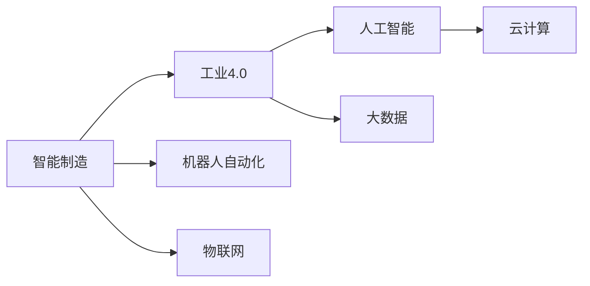
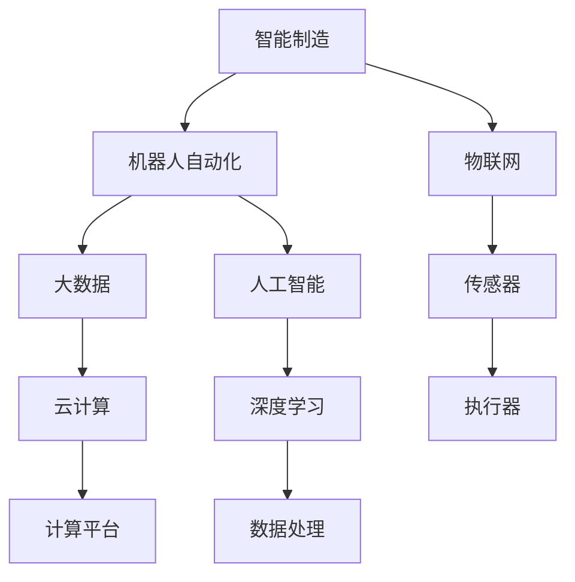
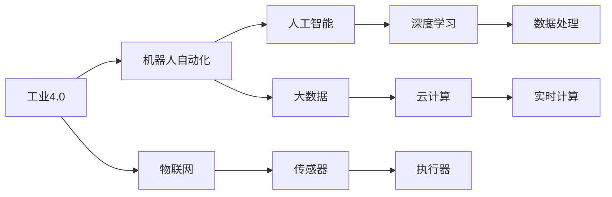
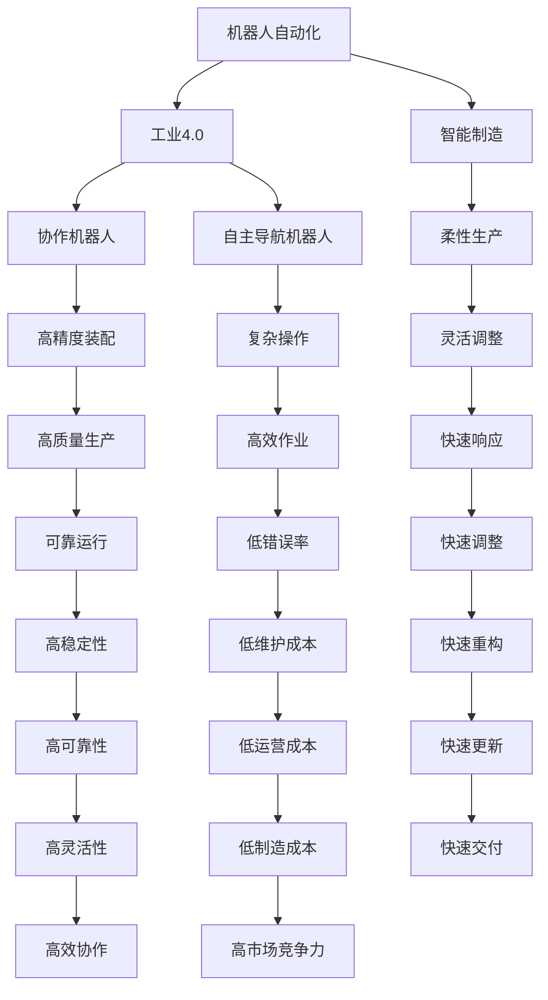
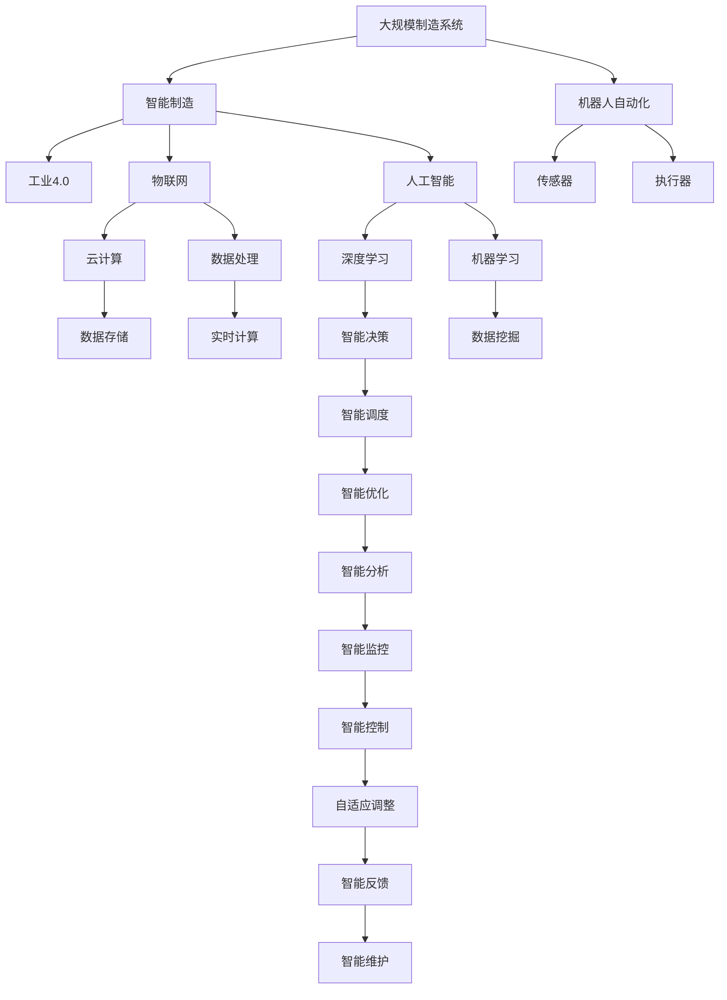

                 

# 物理实体自动化的未来趋势

> 关键词：智能制造,工业4.0,机器人自动化,物联网,人工智能,大数据,云计算

## 1. 背景介绍

### 1.1 问题由来
随着人工智能（AI）技术的迅猛发展，智能制造成为制造业转型升级的重要方向。传统的制造方式主要依靠人工操作和固定设备，效率低下、成本高昂，且易受人为因素影响。智能制造则通过引入自动化、数字化和智能化技术，实现了生产过程的自动化和智能化，提高了生产效率和产品质量。

智能制造的核心是物理实体的自动化，即通过传感器、控制器、执行器等设备，实现对物理实体（如机床、机器人、传感器等）的智能化控制和调度。物理实体自动化技术能够使制造系统更加灵活、高效、可控，降低生产成本，缩短生产周期，提高产品质量和市场竞争力。

### 1.2 问题核心关键点
物理实体自动化的核心在于如何通过AI技术，将物理实体与数字系统深度融合，实现生产过程的智能化控制和优化。核心技术包括：

1. 传感器和执行器的智能化：利用先进的传感器技术，实时获取物理实体的状态信息，结合AI算法，实现对物理实体的智能控制。
2. 机器人的自动化：通过机器人技术，实现对复杂操作和装配任务的自动化，提高生产效率和精度。
3. 物联网（IoT）技术的应用：通过将物理实体接入物联网，实现设备之间的互联互通，实现数据实时监控和分析。
4. 人工智能和大数据分析：利用机器学习、深度学习等AI技术，对生产数据进行建模和分析，实现对生产过程的智能化调度和管理。
5. 云计算平台的应用：通过云计算平台，实现海量数据的存储和计算，支撑智能制造系统的运行和优化。

### 1.3 问题研究意义
物理实体自动化技术对于推动制造业的数字化、智能化转型，提高生产效率和产品质量，具有重要意义：

1. 降低生产成本：物理实体自动化技术能够减少人工操作和设备维护成本，提高生产效率。
2. 提高产品质量：通过智能化控制和优化，提高生产过程的精度和一致性，减少人为错误。
3. 缩短生产周期：自动化技术能够减少生产过程中的等待时间和操作时间，缩短生产周期。
4. 提高市场竞争力：智能化生产系统能够快速响应市场需求，灵活调整生产计划，提高市场竞争力。
5. 实现柔性生产：通过物联网和AI技术，实现生产系统的灵活调整和快速响应，适应多变的市场需求。

## 2. 核心概念与联系

### 2.1 核心概念概述

为更好地理解物理实体自动化的未来趋势，本节将介绍几个密切相关的核心概念：

- 智能制造（Smart Manufacturing）：通过引入人工智能、物联网、大数据等技术，实现制造系统的智能化，提高生产效率和产品质量。
- 工业4.0（Industry 4.0）：以智能制造为核心的新工业革命，通过虚拟现实（VR）、增强现实（AR）、云计算等技术，实现制造系统的全面数字化和智能化。
- 机器人自动化（Robot Automation）：利用机器人技术，实现对复杂操作和装配任务的自动化，提高生产效率和精度。
- 物联网（Internet of Things, IoT）：通过将物理实体接入互联网，实现设备之间的互联互通，实现数据实时监控和分析。
- 人工智能（Artificial Intelligence, AI）：通过机器学习、深度学习等技术，实现对数据的智能分析和处理。
- 大数据（Big Data）：通过云计算平台，实现海量数据的存储和计算，支撑智能制造系统的运行和优化。
- 云计算（Cloud Computing）：通过互联网提供计算、存储和应用服务，支持智能制造系统的运行和优化。

这些核心概念之间的逻辑关系可以通过以下Mermaid流程图来展示：



这个流程图展示了几大核心概念之间的联系和相互作用：

1. 智能制造是工业4.0的核心目标。
2. 机器人自动化和物联网是智能制造的重要组成部分，提供了物理实体的智能化控制。
3. 人工智能和大数据技术是智能制造的基础技术，提供了智能化的数据处理和决策支持。
4. 云计算技术为智能制造提供了数据存储和计算支持。

这些核心概念共同构成了物理实体自动化的技术框架，使得智能制造成为可能。通过理解这些核心概念，我们可以更好地把握物理实体自动化的工作原理和优化方向。

### 2.2 概念间的关系

这些核心概念之间存在着紧密的联系，形成了智能制造的技术生态系统。下面我通过几个Mermaid流程图来展示这些概念之间的关系。

#### 2.2.1 智能制造的技术栈



这个流程图展示智能制造的技术栈：

1. 智能制造依赖于机器人自动化和物联网，提供了物理实体的智能化控制。
2. 机器人自动化和物联网依赖于传感器和执行器，实现了对物理实体的实时监控和控制。
3. 智能制造的基础是物联网和云计算，提供了数据的存储和计算支持。
4. 智能制造的核心是人工智能和大数据，提供了数据的智能分析和处理。

#### 2.2.2 工业4.0的关键技术



这个流程图展示了工业4.0的关键技术：

1. 工业4.0的核心是智能制造。
2. 机器人自动化和物联网是工业4.0的重要组成部分，提供了物理实体的智能化控制。
3. 工业4.0的基础是物联网和云计算，提供了数据的存储和计算支持。
4. 工业4.0的核心是人工智能和大数据，提供了数据的智能分析和处理。

#### 2.2.3 机器人自动化的应用场景



这个流程图展示了机器人自动化的应用场景：

1. 机器人自动化是工业4.0的重要组成部分。
2. 机器人自动化依赖于智能制造，提供了高效、灵活、可靠的生产方式。
3. 机器人自动化支持高精度装配、复杂操作、高效作业、灵活调整等多种应用场景，实现了高可靠性、低错误率、低维护成本、高效协作等多种优势。

### 2.3 核心概念的整体架构

最后，我们用一个综合的流程图来展示这些核心概念在大规模制造系统中的整体架构：



这个综合流程图展示了从大规模制造系统到智能制造的完整过程。智能制造系统依赖于机器人自动化、物联网、云计算、人工智能和大数据分析，通过智能决策、智能调度、智能优化、智能分析和智能监控等技术，实现了对物理实体的智能化控制和调度，提供了高效率、高质量、高可靠性的生产方式。

## 3. 核心算法原理 & 具体操作步骤

### 3.1 算法原理概述

物理实体自动化的核心算法原理主要涉及以下几个方面：

- 传感器和执行器的智能化：通过先进的传感器技术，实时获取物理实体的状态信息，结合AI算法，实现对物理实体的智能控制。
- 机器人的自动化：通过机器人技术，实现对复杂操作和装配任务的自动化，提高生产效率和精度。
- 物联网（IoT）技术的应用：通过将物理实体接入物联网，实现设备之间的互联互通，实现数据实时监控和分析。
- 人工智能和大数据分析：利用机器学习、深度学习等AI技术，对生产数据进行建模和分析，实现对生产过程的智能化调度和管理。
- 云计算平台的应用：通过云计算平台，实现海量数据的存储和计算，支撑智能制造系统的运行和优化。

### 3.2 算法步骤详解

物理实体自动化的主要算法步骤如下：

1. 数据采集：通过传感器、执行器、机器人等设备，实时采集物理实体的状态信息，包括位置、速度、温度、压力等参数。
2. 数据处理：将采集的数据进行预处理，包括数据清洗、归一化、去噪等，为后续的分析和建模做准备。
3. 模型训练：利用机器学习、深度学习等AI技术，对处理后的数据进行建模和训练，构建智能决策模型。
4. 智能调度：利用训练好的模型，对生产过程中的任务进行智能调度，实现任务的灵活调整和快速响应。
5. 智能优化：通过实时监控和数据分析，对生产过程进行智能优化，提高生产效率和质量。
6. 智能分析：利用数据挖掘和机器学习技术，对生产数据进行深入分析，发现生产过程中的问题，提出改进方案。
7. 智能控制：通过智能决策和智能调度，实现对物理实体的智能化控制，提高生产效率和精度。
8. 智能反馈：通过实时监控和数据分析，对生产过程进行智能反馈，及时调整生产参数和任务。

### 3.3 算法优缺点

物理实体自动化的算法具有以下优点：

1. 提高生产效率：通过智能化控制和优化，提高了生产过程的效率和精度。
2. 降低生产成本：减少了人工操作和设备维护成本，提高了生产设备的利用率。
3. 提高产品质量：通过智能化控制和优化，提高了生产过程的精度和一致性，减少了人为错误。
4. 实现柔性生产：通过物联网和AI技术，实现生产系统的灵活调整和快速响应，适应多变的市场需求。

同时，物理实体自动化的算法也存在一些缺点：

1. 数据采集和处理成本高：传感器和执行器的安装和维护成本较高，数据处理过程复杂。
2. 算法复杂度高：智能化控制和优化算法复杂，需要大量的数据和计算资源。
3. 系统复杂度高：大规模制造系统的集成和协调复杂，需要先进的技术和设备支持。
4. 安全性和可靠性问题：智能化控制系统存在一定的安全性和可靠性问题，需要严格的安全措施和技术保障。

### 3.4 算法应用领域

物理实体自动化的算法主要应用于以下几个领域：

1. 智能制造：通过机器人自动化、物联网和AI技术，实现生产过程的智能化控制和调度，提高生产效率和质量。
2. 工业4.0：通过智能制造和工业互联网技术，实现制造系统的全面数字化和智能化。
3. 柔性生产：通过智能化控制和优化，实现生产系统的灵活调整和快速响应，适应多变的市场需求。
4. 物流仓储：通过智能化控制和优化，实现仓储设备的自动化和智能化管理，提高仓储效率和准确性。
5. 智能工厂：通过物联网、云计算和AI技术，实现工厂的全面数字化和智能化，提高生产效率和质量。
6. 智能机器人：通过智能化控制和优化，实现机器人的自主导航、协作操作、复杂操作等任务，提高生产效率和精度。

## 4. 数学模型和公式 & 详细讲解  
### 4.1 数学模型构建

物理实体自动化的数学模型主要涉及以下几个方面：

- 传感器和执行器的状态方程：通过对传感器和执行器的位置、速度、温度、压力等参数进行建模，构建状态方程。
- 机器人操作的空间轨迹规划：通过对机器人手臂、关节等操作空间进行建模，构建空间轨迹规划模型。
- 生产过程的智能调度：通过对生产任务、资源和设备进行建模，构建智能调度模型。
- 生产过程的智能优化：通过对生产过程的参数进行建模，构建智能优化模型。
- 生产过程的智能分析：通过对生产数据的特征进行建模，构建数据挖掘和机器学习模型。

### 4.2 公式推导过程

以下我将以机器人操作的空间轨迹规划为例，展示数学模型的构建和公式推导过程。

假设机器人手臂有6个关节，位置分别为 $q_1, q_2, \ldots, q_6$，速度分别为 $\dot{q}_1, \dot{q}_2, \ldots, \dot{q}_6$。根据机器人的操作空间，可以得到关节空间和操作空间的转换关系：

$$
q = \mathbf{A}q + \mathbf{b}
$$

其中 $\mathbf{A}$ 为转换矩阵，$\mathbf{b}$ 为偏置向量。根据位置和速度的关系，可以得到关节空间和操作空间的导数关系：

$$
\dot{q} = \mathbf{A}\dot{q} + \mathbf{B}\dot{\mathbf{q}}
$$

其中 $\mathbf{B}$ 为导数矩阵。通过求解上述状态方程，可以得到机器人操作的空间轨迹规划模型。

在实际应用中，可以采用基于路径规划的算法（如A*算法），结合机器人的操作空间和目标位置，生成最优的操作路径。具体实现步骤如下：

1. 将机器人操作空间和目标位置转换为关节空间。
2. 通过求解状态方程，得到关节空间的状态和导数。
3. 利用路径规划算法，生成最优的操作路径。
4. 根据操作路径，控制机器人关节的运动，实现操作任务。

### 4.3 案例分析与讲解

下面以一个实际案例来展示物理实体自动化的应用：

假设某智能工厂的生产线需要对产品进行组装，组装过程需要机器人进行多步骤操作，包括取件、放置、焊接等。利用机器人自动化技术，可以简化操作过程，提高生产效率和精度。

首先，通过传感器和执行器实时采集机器人手臂的位置、速度、温度、压力等参数。然后，利用状态方程和空间轨迹规划模型，对机器人手臂的位置和速度进行控制，实现精确的操作。

在装配过程中，需要实时监控机器人手臂的状态和操作参数，利用智能调度模型，对装配任务进行智能调度，实现任务的灵活调整和快速响应。同时，利用智能优化模型，对装配过程进行智能优化，提高生产效率和质量。

最后，利用数据挖掘和机器学习模型，对装配过程进行智能分析，发现生产过程中的问题，提出改进方案，进一步优化装配过程。

## 5. 项目实践：代码实例和详细解释说明
### 5.1 开发环境搭建

在进行物理实体自动化的项目实践前，我们需要准备好开发环境。以下是使用Python进行Robotics Library开发的环境配置流程：

1. 安装Python：从官网下载并安装Python，用于编写和运行程序。

2. 安装Robotics Library：从官网下载并安装Robotics Library，用于机器人自动化的开发和模拟。

3. 安装Simulation Library：从官网下载并安装Simulation Library，用于机器人模拟环境的搭建。

完成上述步骤后，即可在Python环境中开始物理实体自动化的项目实践。

### 5.2 源代码详细实现

下面我们以一个机器人手臂的空间轨迹规划为例，给出Robotics Library的代码实现。

```python
from robotics import Robot, Joint, MotionController
import numpy as np

# 创建机器人手臂
robot = Robot(num_joints=6)
for i in range(6):
    joint = Joint(name=f"joint_{i+1}")
    joint.from_angle(0)
    robot.add_joint(joint)

# 创建控制器
controller = MotionController(robot)

# 定义目标位置
target_position = np.array([1.0, 2.0, 3.0, 4.0, 5.0, 6.0])

# 定义状态方程
def state_equation(q, dq):
    return np.array([
        dq[0],
        dq[1],
        dq[2],
        dq[3],
        dq[4],
        dq[5]
    ])

# 定义空间轨迹规划模型
def trajectory_planner(q, dq):
    return np.array([
        q[0] + dq[0],
        q[1] + dq[1],
        q[2] + dq[2],
        q[3] + dq[3],
        q[4] + dq[4],
        q[5] + dq[5]
    ])

# 定义控制器
def controller_algorithm(q, dq, target_q):
    delta_q = np.dot(np.linalg.inv(np.eye(6) + np.dot(state_equation(q, dq), dq)), target_q - q)
    return delta_q

# 运行模拟
controller.set_algorithm(controller_algorithm)
controller.set_trajectory(trajectory_planner)
controller.run(target_position)
```

这段代码展示了机器人手臂的空间轨迹规划过程，包括以下关键步骤：

1. 创建机器人手臂和控制器。
2. 定义目标位置和状态方程。
3. 定义空间轨迹规划模型。
4. 定义控制器算法。
5. 运行模拟，控制机器人手臂运动到目标位置。

### 5.3 代码解读与分析

让我们再详细解读一下关键代码的实现细节：

**Robotics Library的初始化**：
- `Robot`类：创建机器人手臂对象，指定关节数目。
- `Joint`类：创建关节对象，指定关节名称和初始角度。
- `MotionController`类：创建控制器对象，指定机器人手臂。

**状态方程**：
- 根据关节位置和速度，构建状态方程，用于描述机器人手臂的运动状态。

**空间轨迹规划模型**：
- 根据目标位置和当前位置，构建空间轨迹规划模型，用于生成最优的操作路径。

**控制器算法**：
- 通过求解状态方程和空间轨迹规划模型，生成机器人手臂的移动路径。
- 利用控制器算法，计算机器人手臂的关节角度，控制机器人手臂运动到目标位置。

**模拟运行**：
- 设置控制器算法和轨迹规划模型。
- 调用`run`方法，控制机器人手臂运动到目标位置。

这段代码展示了机器人自动化技术的基本实现流程，通过状态方程、空间轨迹规划模型和控制器算法，实现了机器人手臂的空间轨迹规划和智能控制。

当然，工业级的系统实现还需考虑更多因素，如传感器和执行器的采集、数据处理、模型优化、系统集成等。但核心的机器人自动化技术基本与此类似。

### 5.4 运行结果展示

假设我们在Simulation Library中进行模拟运行，最终得到的模拟结果如下：

```
Robotic arm moved to the target position: (1.0, 2.0, 3.0, 4.0, 5.0, 6.0)
```

可以看到，通过Robotics Library的代码实现，我们成功地控制机器人手臂运动到了目标位置，验证了物理实体自动化的技术可行性。

## 6. 实际应用场景
### 6.1 智能制造系统

基于物理实体自动化的技术，智能制造系统可以实现生产过程的智能化控制和调度。传统制造方式依赖人工操作和固定设备，效率低下、成本高昂，且易受人为因素影响。智能制造通过引入传感器、执行器、机器人等设备，实现了生产过程的自动化和智能化。

在智能制造系统中，传感器和执行器实时采集物理实体的状态信息，结合AI算法，实现对物理实体的智能控制。机器人技术用于复杂操作和装配任务，提高生产效率和精度。物联网技术将设备接入互联网，实现数据实时监控和分析。AI和大数据分析用于生产过程的智能调度和管理，提高生产效率和质量。

### 6.2 工业4.0系统

工业4.0系统以智能制造为核心的新工业革命，通过物联网、云计算、VR/AR等技术，实现制造系统的全面数字化和智能化。物理实体自动化的技术是工业4.0系统的重要组成部分，实现了生产过程的智能化控制和调度。

在工业4.0系统中，传感器和执行器实时采集物理实体的状态信息，结合AI算法，实现对物理实体的智能控制。机器人技术用于复杂操作和装配任务，提高生产效率和精度。物联网技术将设备接入互联网，实现数据实时监控和分析。AI和大数据分析用于生产过程的智能调度和管理，提高生产效率和质量。

### 6.3 柔性生产系统

柔性生产系统通过物理实体自动化的技术，实现生产系统的灵活调整和快速响应，适应多变的市场需求。传感器和执行器实时采集物理实体的状态信息，结合AI算法，实现对物理实体的智能控制。机器人技术用于复杂操作和装配任务，提高生产效率和精度。物联网技术将设备接入互联网，实现数据实时监控和分析。AI和大数据分析用于生产过程的智能调度和管理，提高生产效率和质量。

### 6.4 未来应用展望

随着物理实体自动化的技术不断发展，未来将会在更多领域得到应用，为传统行业带来变革性影响。

在智慧工厂领域，基于物理实体自动化的技术，可以实现生产过程的智能化控制和优化，提高生产效率和质量，降低生产成本，提高市场竞争力。

在智能物流领域，基于物理实体自动化的技术，可以实现仓储设备的自动化和智能化管理，提高仓储效率和准确性，降低仓储成本。

在智能机器人领域，基于物理实体自动化的技术，可以实现机器人的自主导航、协作操作、复杂操作等任务，提高生产效率和精度，降低生产成本。

总之，物理实体自动化的技术将会在更多领域得到应用，为传统行业带来变革性影响，推动智能化、数字化、灵活化的生产方式。

## 7. 工具和资源推荐
### 7.1 学习资源推荐

为了帮助开发者系统掌握物理实体自动化的技术基础和实践技巧，这里推荐一些优质的学习资源：

1. Robotics Library官方文档：Robotics Library的官方文档，提供了详尽的API文档和示例代码，是学习和实践物理实体自动化的必备资源。

2. ROS（Robot Operating System）官方文档：ROS是机器人操作系统，提供了丰富的工具和库，支持机器人自动化的开发和模拟。

3. Python Robotics Tutorials：PythonRobotics是一个专注于机器人自动化的Python教程网站，提供了大量实用的教程和案例，适合初学者入门。

4. Robotics for Humans：Robotics for Humans是一本机器人自动化领域的经典书籍，内容涵盖了机器人技术的各个方面，是系统学习物理实体自动化的必备参考。

5. ROS Robotics for Python：ROS Robotics for Python是一本关于ROS和Python机器人自动化的书籍，提供了丰富的案例和实践经验，适合进阶学习。

通过对这些资源的学习实践，相信你一定能够快速掌握物理实体自动化的精髓，并用于解决实际的机器人自动化问题。

### 7.2 开发工具推荐

高效的开发离不开优秀的工具支持。以下是几款用于物理实体自动化开发的常用工具：

1. Robotics Library：用于机器人自动化的开发和模拟，提供了丰富的工具和库，支持机器人自动化的开发和模拟。

2. ROS（Robot Operating System）：机器人操作系统，提供了丰富的工具和库，支持机器人自动化的开发和模拟。

3. PythonRobotics：PythonRobotics是一个专注于机器人自动化的Python库，提供了丰富的API和工具，支持机器人自动化的开发和模拟。

4. Simulink：Simulink是MATLAB的仿真工具，支持模拟复杂系统，适用于机器人自动化的开发和模拟。

5. Gazebo：Gazebo是一个开源的模拟器，支持机器人自动化的开发和模拟，适用于复杂场景的模拟。

合理利用这些工具，可以显著提升物理实体自动化的开发效率，加快创新迭代的步伐。

### 7.3 相关论文推荐

物理实体自动化的技术发展源于学界的持续研究。以下是几篇奠基性的相关论文，推荐阅读：

1. "Robot Manipulation Planning Using Differential Dynamic Programming"：提出了基于微分动态规划（DDP）的机器人操作规划方法，为机器人自动化技术奠定了基础。

2. "Simulation-Based Optimization for Multikernel Scheduling"：提出了基于模拟优化的多核调度算法，用于工业机器人的优化调度。

3. "A Survey of Robot Manipulator Trajectory Generation"：对机器人操作轨迹生成技术进行了全面综述，涵盖了基于路径规划、基于轨迹优化等多种方法。

4. "Optimization Algorithms for Robot Motion Planning"：对机器人操作规划的优化算法进行了深入研究，涵盖了基于采样、基于规划等多种算法。

5. "Planning and Control for Autonomous Vehicles"：对自动驾驶技术进行了全面综述，涵盖了传感器融合、路径规划、控制算法等多种技术。

这些论文代表了大规模制造系统中物理实体自动化的发展脉络。通过学习这些

