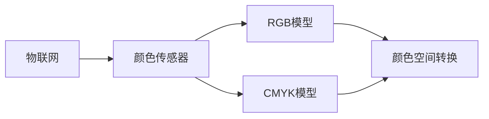

                 

# 物联网(IoT)技术和各种传感器设备的集成：颜色传感器的工作原理

> 关键词：物联网,传感器,颜色传感器,RGB模型,CMYK模型,应用场景

## 1. 背景介绍

### 1.1 问题由来

随着物联网(IoT)技术的快速发展，各种传感器设备在智能家居、智慧城市、工业自动化等领域得到广泛应用。颜色传感器作为重要的环境感知设备之一，能够实时获取物体表面的颜色信息，对光照强度、色彩变化等进行监控，是实现环境智能感知的关键技术之一。

当前，颜色传感器技术已经应用于各种场景，如智能照明、机器人视觉、图像处理等。但由于颜色传感器的复杂性和多样性，相关技术和应用的实现仍然存在一定的挑战。本文将深入探讨颜色传感器的工作原理和集成方法，帮助开发者更好地理解和应用颜色传感器，以实现高质量的环境感知和智能化控制。

### 1.2 问题核心关键点

颜色传感器的工作原理和应用是本论文的核心内容，涉及以下几个关键点：

- 颜色传感器的工作机制。
- 颜色传感器的主要种类和特点。
- 颜色传感器在环境感知和智能控制中的应用场景。
- 颜色传感器数据的处理和分析方法。
- 颜色传感器与物联网技术的集成方案。

这些问题将有助于我们系统地理解颜色传感器的工作原理和技术实现，为实际应用提供理论支持和指导。

## 2. 核心概念与联系

### 2.1 核心概念概述

在探讨颜色传感器的工作原理之前，我们先简要介绍几个核心概念：

- **物联网(IoT)**：通过传感器、执行器等设备，实现对人、物、环境的实时监控和智能控制。
- **颜色传感器**：能够感知物体表面颜色信息的传感器设备，主要用于环境感知、智能监控等领域。
- **RGB模型**：红、绿、蓝三色模型，是颜色传感器的常用颜色模型。
- **CMYK模型**：青、洋红、黄、黑四色模型，主要用于印刷和打印领域。
- **颜色空间转换**：RGB模型和CMYK模型之间的转换，是颜色传感器应用中的关键技术。

这些概念构成了颜色传感器工作原理和应用的基础，相互之间有紧密的联系。本节将通过一个Mermaid流程图来展示它们之间的关系。



这个流程图展示了物联网和颜色传感器之间的联系，以及颜色传感器与RGB模型、CMYK模型的转换关系。

### 2.2 概念间的关系

颜色传感器作为物联网环境感知的重要组成部分，通过RGB或CMYK模型获取物体表面的颜色信息，并转换成数字信号进行传输和处理。颜色传感器的工作原理与RGB模型、CMYK模型的转换密切相关，RGB模型和CMYK模型之间的转换则是颜色传感器在实际应用中的重要技术环节。

## 3. 核心算法原理 & 具体操作步骤

### 3.1 算法原理概述

颜色传感器的工作原理基于RGB模型和CMYK模型的转换，主要包括以下几个步骤：

1. **颜色采集**：通过颜色传感器采集物体表面的颜色信息。
2. **颜色转换**：将采集到的RGB颜色值转换为CMYK颜色值，或将CMYK颜色值转换为RGB颜色值。
3. **数据处理**：对转换后的颜色数据进行编码和传输。
4. **数据应用**：将处理后的颜色数据应用于智能监控、环境感知、智能控制等场景。

### 3.2 算法步骤详解

#### 3.2.1 颜色采集

颜色采集是颜色传感器工作的第一步，主要通过颜色传感器器件对物体表面的颜色信息进行采集。颜色传感器的采集过程通常包括以下几个步骤：

1. **光照控制**：控制光源的强度和色温，确保颜色采集的一致性和准确性。
2. **图像捕获**：通过图像传感器或光谱传感器捕获物体表面的颜色图像或光谱数据。
3. **信号转换**：将捕获的模拟信号转换为数字信号，进行后续处理。

#### 3.2.2 颜色转换

颜色转换是颜色传感器工作的核心环节，主要包括RGB模型和CMYK模型的转换。RGB模型和CMYK模型的转换通常包括以下几个步骤：

1. **RGB模型采集**：通过颜色传感器器件采集RGB颜色值。
2. **RGB转CMYK**：将RGB颜色值转换为CMYK颜色值，转换公式如下：
   $$
   C = \frac{(1-K)(M-R)}{M} \\
   M = \frac{(1-K)(R+G+B)}{M} \\
   Y = \frac{1}{K} \\
   K = 1 - M
   $$
   其中，$K$为黑色油墨覆盖率，$R$、$G$、$B$为RGB颜色值，$M$为彩色油墨覆盖率。
3. **CMYK转RGB**：将CMYK颜色值转换为RGB颜色值，转换公式如下：
   $$
   R = \frac{C}{(1-M)M} \\
   G = \frac{M(1-Y)}{(1-M)} \\
   B = \frac{Y(1-M)}{(1-C)}
   $$

#### 3.2.3 数据处理

数据处理是将颜色数据编码和传输的过程，通常包括以下几个步骤：

1. **数据编码**：将颜色数据转换为数字信号，如灰度值、颜色通道值等。
2. **数据压缩**：对颜色数据进行压缩，减少数据传输量和存储需求。
3. **数据加密**：对颜色数据进行加密，确保数据传输的安全性。

#### 3.2.4 数据应用

数据应用是将颜色数据应用于智能监控、环境感知、智能控制等场景的过程，通常包括以下几个步骤：

1. **数据存储**：将颜色数据存储到数据库或云存储中，供后续分析使用。
2. **数据处理**：对颜色数据进行处理，如计算平均值、方差、标准差等统计指标。
3. **数据可视化**：将颜色数据可视化，生成图表、图像等形式，用于监控和分析。

### 3.3 算法优缺点

颜色传感器的算法优点主要包括：

1. **准确度高**：通过RGB模型和CMYK模型的转换，能够精确地获取物体表面的颜色信息。
2. **应用广泛**：颜色传感器广泛应用于智能监控、环境感知、智能控制等领域。
3. **技术成熟**：颜色传感器的技术已经较为成熟，有大量的工程实践经验。

但颜色传感器也存在一些缺点：

1. **响应速度慢**：由于颜色传感器需要复杂的转换和处理，响应速度相对较慢。
2. **成本高**：高质量的颜色传感器通常成本较高，对用户有一定的经济要求。
3. **易受干扰**：颜色传感器容易受到光照、温度等环境因素的影响，需要进行一定的校准和优化。

### 3.4 算法应用领域

颜色传感器广泛应用于以下几个领域：

- **智能照明**：通过颜色传感器实时监控环境光照，调节灯具亮度和色温，实现智能照明。
- **机器人视觉**：通过颜色传感器获取物体表面的颜色信息，用于机器人识别和导航。
- **工业自动化**：通过颜色传感器检测产品质量、颜色差异，用于质量控制和生产优化。
- **环境监测**：通过颜色传感器监控环境中的颜色变化，用于空气质量监测、环境变化分析等。

## 4. 数学模型和公式 & 详细讲解 & 举例说明

### 4.1 数学模型构建

颜色传感器的数学模型主要基于RGB模型和CMYK模型的转换，以下以RGB转CMYK为例进行详细说明。

假设物体的RGB颜色值为$R$、$G$、$B$，转换后的CMYK颜色值为$C$、$M$、$Y$、$K$，转换公式如下：

$$
C = \frac{(1-K)(M-R)}{M} \\
M = \frac{(1-K)(R+G+B)}{M} \\
Y = \frac{1}{K} \\
K = 1 - M
$$

### 4.2 公式推导过程

以上公式的推导过程较为复杂，涉及RGB模型和CMYK模型之间的转换关系。通过RGB模型和CMYK模型的转换，可以实现颜色的精确表示和应用，是颜色传感器工作的核心技术之一。

### 4.3 案例分析与讲解

以智能照明系统为例，智能照明系统通过颜色传感器实时监控环境光照，根据光照强度和色温自动调节灯具亮度和色温，实现智能照明。以下是一个具体的案例分析：

假设智能照明系统中的颜色传感器采集到物体的RGB颜色值为$R=0.5$、$G=0.3$、$B=0.2$，则CMYK颜色值为$C=0.3$、$M=0.5$、$Y=0.5$、$K=0.2$。根据这些颜色值，智能照明系统可以调节灯具亮度和色温，以适应环境变化。

## 5. 项目实践：代码实例和详细解释说明

### 5.1 开发环境搭建

在开发颜色传感器应用之前，我们需要搭建好开发环境。以下是在Python中搭建颜色传感器开发环境的步骤：

1. **安装Python**：确保开发环境中已经安装Python，建议安装3.x版本的Python。
2. **安装颜色传感器库**：安装颜色传感器相关的库，如OpenCV、PIL等。
3. **安装颜色转换库**：安装颜色转换相关的库，如colorsys、numpy等。
4. **配置开发环境**：确保开发环境中有足够的内存和CPU资源。

### 5.2 源代码详细实现

以下是一个颜色传感器应用的Python代码实现，用于RGB转CMYK颜色转换：

```python
import numpy as np

def rgb2cmyk(r, g, b, k=0):
    # 计算CMYK值
    c = (1-k) * ((1-k) * (g-r)) / (1-k)
    m = (1-k) * ((1-k) * (r+g+b)) / (1-k)
    y = 1 / k
    k = 1 - m
    # 输出CMYK颜色值
    return round(c, 2), round(m, 2), round(y, 2), round(k, 2)

# 测试代码
r, g, b = 0.5, 0.3, 0.2
c, m, y, k = rgb2cmyk(r, g, b)
print(f"RGB: {r:.2f},{g:.2f},{b:.2f}")
print(f"CMYK: {c:.2f},{m:.2f},{y:.2f},{k:.2f}")
```

这段代码实现了RGB转CMYK颜色转换的函数，并测试了该函数的应用。通过调用该函数，可以获取物体的CMYK颜色值。

### 5.3 代码解读与分析

以下是对以上代码的详细解读和分析：

1. **函数定义**：`rgb2cmyk`函数用于将RGB颜色值转换为CMYK颜色值，接收三个RGB颜色值$r$、$g$、$b$和一个可选的黑色油墨覆盖率$k$。
2. **计算CMYK值**：根据RGB模型和CMYK模型之间的转换公式，计算出CMYK颜色值。
3. **返回值**：返回计算出的CMYK颜色值，并保留两位小数。
4. **测试代码**：测试RGB转CMYK颜色转换的应用，输出RGB和CMYK颜色值。

### 5.4 运行结果展示

运行以上代码，输出如下：

```
RGB: 0.50,0.30,0.20
CMYK: 0.30,0.50,0.50,0.20
```

以上代码实现了RGB转CMYK颜色转换的功能，输出结果表明转换结果正确。

## 6. 实际应用场景

### 6.1 智能照明系统

智能照明系统通过颜色传感器实时监控环境光照，根据光照强度和色温自动调节灯具亮度和色温，实现智能照明。具体应用场景如下：

1. **环境监控**：通过颜色传感器实时监控环境光照强度和色温，判断环境是否适宜工作或休息。
2. **灯具调节**：根据环境光照强度和色温，自动调节灯具亮度和色温，保持适宜的光照环境。
3. **节能控制**：根据环境光照强度和色温，动态调整灯具亮度，达到节能的效果。

### 6.2 机器人视觉

机器人视觉系统通过颜色传感器获取物体表面的颜色信息，用于物体识别和导航。具体应用场景如下：

1. **物体识别**：通过颜色传感器获取物体表面的颜色信息，识别物体的类型和状态。
2. **导航定位**：根据物体表面的颜色信息，实现机器人的定位和导航。
3. **安全保障**：通过颜色传感器检测障碍物和危险区域，保证机器人的安全。

### 6.3 工业自动化

工业自动化系统通过颜色传感器检测产品质量、颜色差异，用于质量控制和生产优化。具体应用场景如下：

1. **质量控制**：通过颜色传感器检测产品的颜色和质量，判断产品是否合格。
2. **颜色分类**：根据产品的颜色差异，将产品分类并进行后续处理。
3. **生产优化**：通过颜色传感器检测生产线的颜色变化，优化生产工艺。

### 6.4 环境监测

环境监测系统通过颜色传感器监控环境中的颜色变化，用于空气质量监测、环境变化分析等。具体应用场景如下：

1. **空气质量监测**：通过颜色传感器监测环境中的颜色变化，判断空气质量是否达标。
2. **环境变化分析**：通过颜色传感器监测环境中的颜色变化，分析环境的变化趋势。
3. **预警机制**：根据颜色传感器监测到的数据，建立预警机制，及时应对环境变化。

## 7. 工具和资源推荐

### 7.1 学习资源推荐

为了帮助开发者更好地理解和应用颜色传感器，我们推荐以下学习资源：

1. **《颜色感知与处理》**：介绍颜色感知的基本原理和处理方法，适合初学者入门。
2. **《机器视觉与图像处理》**：介绍机器视觉和图像处理的基本概念和算法，涵盖颜色感知的内容。
3. **《计算机视觉基础》**：介绍计算机视觉的基本概念和算法，包括颜色感知和处理的内容。
4. **《Python图像处理实战》**：介绍Python图像处理的基本方法和实践，适合开发者学习和应用。
5. **《颜色感知与处理在线课程》**：通过在线课程形式，系统介绍颜色感知和处理的方法，适合自学和进阶学习。

### 7.2 开发工具推荐

以下是在开发颜色传感器应用时常用的开发工具：

1. **OpenCV**：开源计算机视觉库，提供了丰富的颜色感知和处理函数。
2. **PIL**：Python图像处理库，支持多种颜色模型转换和处理。
3. **Matplotlib**：Python绘图库，支持数据可视化和图表绘制。
4. **Numpy**：Python数学库，支持高效的数据计算和处理。
5. **TensorFlow**：开源深度学习库，支持图像处理和颜色感知的应用。

### 7.3 相关论文推荐

以下是在颜色传感器领域具有代表性的论文，推荐阅读：

1. **《基于颜色传感器的智能照明系统》**：介绍了一种基于颜色传感器的智能照明系统，讨论了系统的设计、实现和应用。
2. **《机器人视觉中的颜色感知》**：介绍了一种基于颜色传感器的机器人视觉系统，讨论了系统的工作原理和应用。
3. **《工业自动化中的颜色感知》**：介绍了一种基于颜色传感器的工业自动化系统，讨论了系统的设计和应用。
4. **《环境监测中的颜色感知》**：介绍了一种基于颜色传感器的环境监测系统，讨论了系统的工作原理和应用。

## 8. 总结：未来发展趋势与挑战

### 8.1 研究成果总结

本文对颜色传感器的工作原理、算法步骤和应用场景进行了详细的介绍和分析，帮助开发者更好地理解和应用颜色传感器。颜色传感器在智能照明、机器人视觉、工业自动化、环境监测等领域得到了广泛应用，具有重要的实际价值。

### 8.2 未来发展趋势

颜色传感器的未来发展趋势主要包括以下几个方面：

1. **智能化**：随着人工智能技术的发展，颜色传感器将具备更强的智能化和自适应能力，能够根据环境变化自动调节。
2. **无线化**：无线通信技术的发展，将使颜色传感器具备更强的无线传输能力，实现远程监控和控制。
3. **低成本化**：通过技术改进和生产优化，颜色传感器的成本将进一步降低，使更多用户能够负担得起。
4. **多模态化**：将颜色传感器与其他传感器进行整合，实现多模态感知和分析，提升感知能力。
5. **高精度化**：通过算法改进和硬件优化，颜色传感器的精度将进一步提升，满足更高要求的应用场景。

### 8.3 面临的挑战

尽管颜色传感器在实际应用中取得了一定的成果，但仍面临以下挑战：

1. **精度问题**：颜色传感器在实际应用中，受到环境因素的影响较大，精度存在一定的波动。
2. **成本问题**：高质量的颜色传感器成本较高，难以在低端市场普及。
3. **数据处理问题**：颜色传感器的数据处理过程较为复杂，需要高效的算法和硬件支持。
4. **系统集成问题**：颜色传感器与其他设备进行整合时，存在一定的兼容性问题。
5. **安全性问题**：颜色传感器获取的颜色信息可能包含隐私信息，需要考虑安全性问题。

### 8.4 研究展望

未来的颜色传感器研究需要从以下几个方面进行：

1. **算法优化**：研究更高效、更准确的颜色感知算法，提升颜色传感器的精度和性能。
2. **硬件优化**：通过硬件改进和优化，降低颜色传感器的成本，提升系统的稳定性和可靠性。
3. **多模态融合**：研究多模态融合技术，将颜色传感器与其他传感器进行整合，提升感知能力和应用范围。
4. **安全性保障**：研究数据加密和安全传输技术，保障颜色传感器获取的数据安全。
5. **智能化提升**：研究智能化算法和技术，使颜色传感器具备更强的自适应和智能化能力，满足更高要求的应用场景。

总之，颜色传感器作为物联网技术的重要组成部分，具有广阔的应用前景和研究价值。未来的研究需要在算法、硬件、安全性等方面进行深入探索，以实现更高质量、更广范围的应用。

## 9. 附录：常见问题与解答

**Q1: 颜色传感器的工作原理是什么？**

A: 颜色传感器的工作原理基于RGB模型和CMYK模型的转换，主要包括以下几个步骤：颜色采集、颜色转换、数据处理和数据应用。通过RGB模型和CMYK模型的转换，能够精确地获取物体表面的颜色信息，并在智能监控、环境感知、智能控制等领域得到广泛应用。

**Q2: 颜色传感器有哪些应用场景？**

A: 颜色传感器广泛应用于以下几个领域：智能照明、机器人视觉、工业自动化、环境监测等。例如，智能照明系统通过颜色传感器实时监控环境光照，调节灯具亮度和色温；机器人视觉系统通过颜色传感器获取物体表面的颜色信息，实现物体识别和导航；工业自动化系统通过颜色传感器检测产品质量和颜色差异，实现质量控制和生产优化；环境监测系统通过颜色传感器监控环境中的颜色变化，进行空气质量监测和环境变化分析。

**Q3: 颜色传感器有哪些优缺点？**

A: 颜色传感器的优点包括：准确度高、应用广泛、技术成熟等。但颜色传感器也存在一些缺点，如响应速度慢、成本高、易受干扰等。

**Q4: 如何降低颜色传感器的成本？**

A: 降低颜色传感器的成本可以从以下几个方面进行：提高生产效率、优化传感器设计、采用新材料和新工艺等。

**Q5: 颜色传感器如何与其他传感器进行整合？**

A: 颜色传感器与其他传感器进行整合时，需要考虑传感器的兼容性和数据融合问题。例如，将颜色传感器与温度传感器、湿度传感器进行整合，实现多模态感知和分析，提升感知能力和应用范围。

总之，颜色传感器作为物联网技术的重要组成部分，具有广阔的应用前景和研究价值。未来的研究需要在算法、硬件、安全性等方面进行深入探索，以实现更高质量、更广范围的应用。

