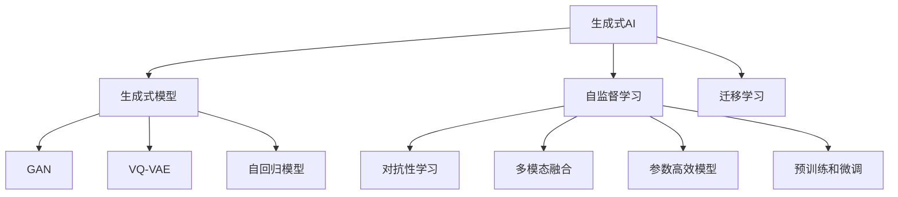
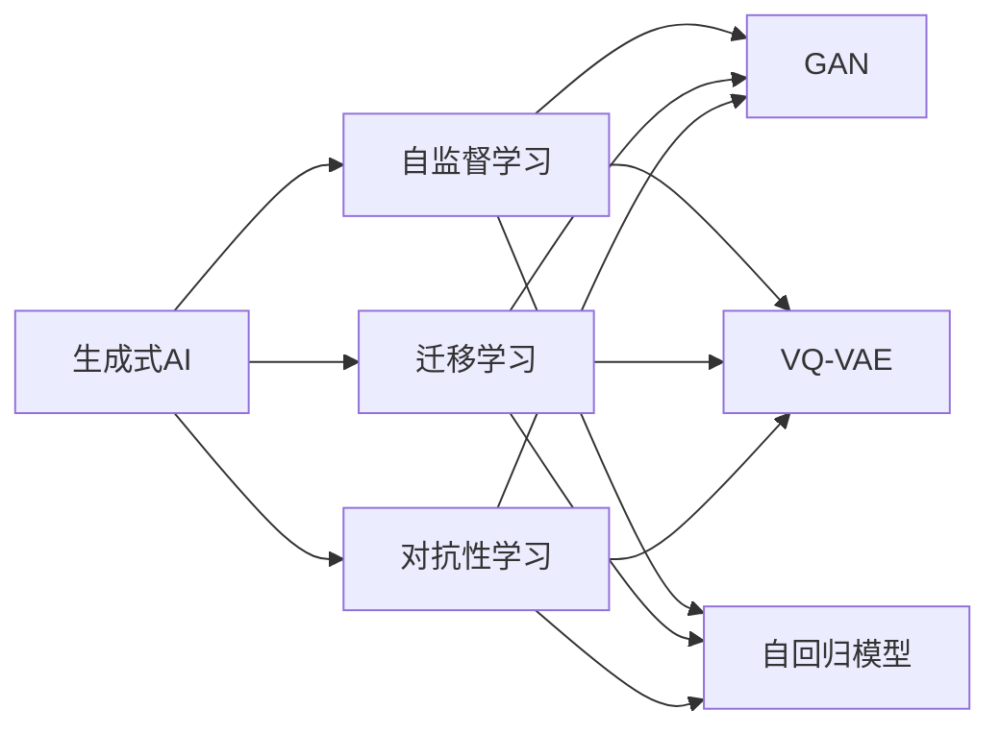
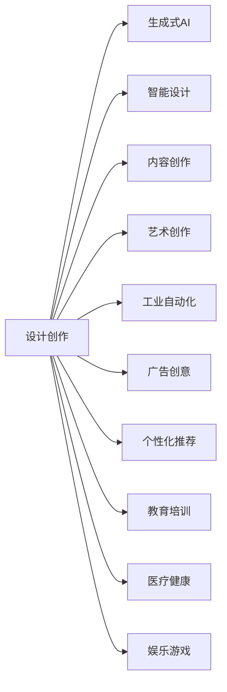
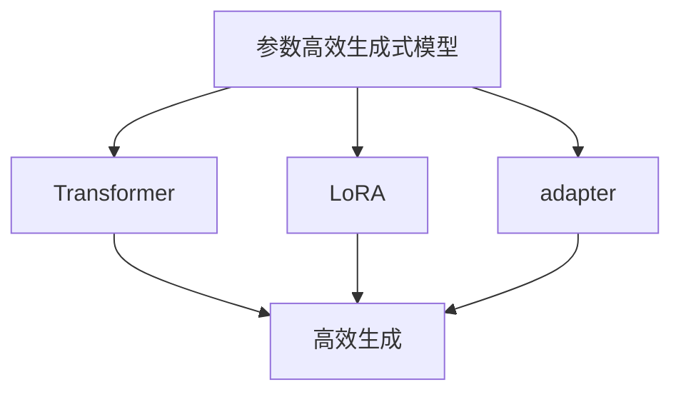
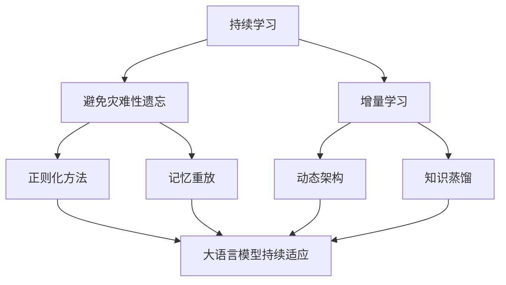
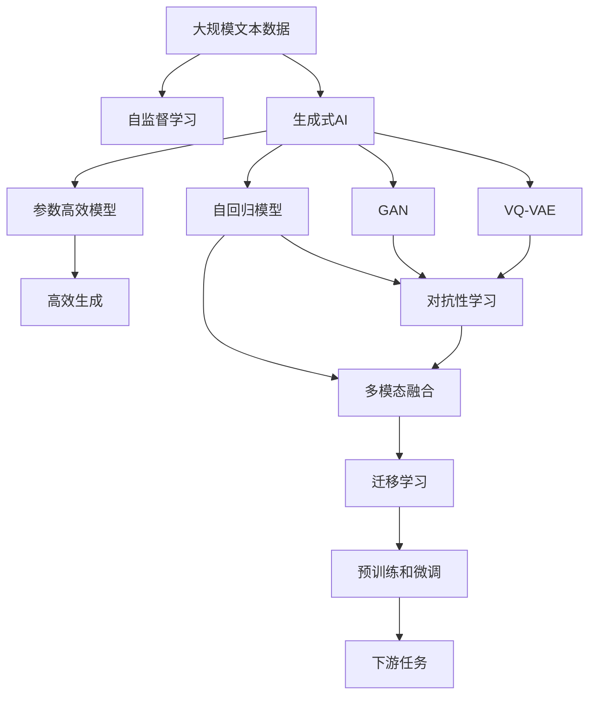

                 

# AI浪潮：生成式AI如何改变我们的工作方式？

> 关键词：生成式AI,自然语言处理(NLP),计算机视觉(CV),工业自动化,设计创作,艺术创作

## 1. 背景介绍

### 1.1 问题由来

近年来，人工智能(AI)技术迅猛发展，尤其在深度学习、大数据、云计算等技术的支撑下，AI已渗透到社会生产生活的各个方面。生成式人工智能（Generative AI）作为AI的一个分支，其核心目标是通过生成式模型，生成与真实世界相匹配的图像、文本、音频等内容，推动智能技术在自动化、设计、创作等领域的发展和应用。

生成式AI以其强大的生成能力和高灵活性，迅速成为学术界和工业界的研究热点。在学术界，生成式AI的进展引领了诸多前沿研究方向，包括但不限于：语言模型、图像生成模型、风格迁移、无监督学习等。在工业界，生成式AI则被广泛应用于智能设计、个性化推荐、智能客服、广告创意生成等业务中，显著提升了生产效率和工作质量。

### 1.2 问题核心关键点

生成式AI的核心关键点包括：
- **生成式模型**：如GAN、VQ-VAE、自回归模型等，通过生成与输入数据相似或完全不同的新数据，实现数据扩充和生成。
- **自监督学习**：利用无标签数据训练生成式模型，避免对标注数据过度依赖。
- **迁移学习**：将生成式模型在不同任务和领域之间迁移，实现知识共享和高效学习。
- **对抗性学习**：通过对抗样本训练生成式模型，提高模型的鲁棒性和泛化能力。
- **多模态融合**：将视觉、文本、音频等多模态数据进行融合，构建更为全面和准确的语言模型。
- **参数高效模型**：使用Transformer、LoRA等参数高效模型，减少模型复杂度，提升训练效率。
- **预训练和微调**：在大规模数据上预训练生成式模型，在小规模数据上微调优化，提升模型性能。

这些关键技术在工业界和学术界得到了广泛应用，使得生成式AI在多个领域展现出强大的应用潜力。

### 1.3 问题研究意义

生成式AI对各个领域的影响是多方面的：

- **设计创作**：生成式AI可以辅助设计师进行产品创新，提升创作效率和作品质量，降低创作成本。
- **工业自动化**：通过生成式AI进行工业检测、质量控制、故障预测等，提高生产线的智能化水平，降低人工成本。
- **广告和营销**：生成式AI可以自动生成创意广告和营销文案，精准定位目标用户，提升广告效果。
- **个性化推荐**：基于用户行为数据和兴趣模型，生成式AI可以生成个性化的产品推荐，提升用户体验和满意度。
- **教育和培训**：生成式AI可以生成教学材料和模拟实验环境，提升教育培训的互动性和效果。
- **医疗和健康**：生成式AI可以生成医疗图像、病例诊断报告等，辅助医生进行诊断和治疗。
- **娱乐和游戏**：生成式AI可以生成游戏角色、剧情对话等内容，提升游戏体验。

因此，研究生成式AI的理论和应用方法，对于推动社会各领域的智能化转型具有重要意义。

## 2. 核心概念与联系

### 2.1 核心概念概述

为了更好地理解生成式AI的应用和技术架构，本节将介绍几个核心概念：

- **生成式AI**：指通过生成式模型生成新数据的人工智能技术，包括但不限于文本、图像、音频等生成。
- **生成式模型**：如GAN、VQ-VAE、自回归模型等，其目标是从训练数据中学习生成新数据的概率分布。
- **自监督学习**：利用无标签数据训练生成式模型，学习数据的隐含表示。
- **迁移学习**：通过在不同任务和领域之间迁移模型参数，实现知识共享和高效学习。
- **对抗性学习**：通过对抗样本训练生成式模型，提升模型的鲁棒性和泛化能力。
- **多模态融合**：将视觉、文本、音频等多模态数据进行融合，构建更为全面和准确的语言模型。
- **参数高效模型**：使用Transformer、LoRA等参数高效模型，减少模型复杂度，提升训练效率。
- **预训练和微调**：在大规模数据上预训练生成式模型，在小规模数据上微调优化，提升模型性能。

这些概念之间的逻辑关系可以通过以下Mermaid流程图来展示：



这个流程图展示了大语言模型微调过程中各个核心概念之间的关系：

1. 生成式AI通过生成式模型生成新数据，其中自监督学习、迁移学习、对抗性学习等技术提升了模型的生成质量。
2. 多模态融合、参数高效模型、预训练和微调等技术，进一步优化了生成式模型的性能和效率。

### 2.2 概念间的关系

这些核心概念之间存在着紧密的联系，形成了生成式AI的完整生态系统。下面我们通过几个Mermaid流程图来展示这些概念之间的关系。

#### 2.2.1 生成式AI的学习范式



这个流程图展示了大语言模型的学习过程，即通过自监督学习、迁移学习、对抗性学习等技术，提升生成式模型的生成质量。

#### 2.2.2 生成式AI的应用领域



这个流程图展示了生成式AI在多个领域的应用场景。

#### 2.2.3 参数高效生成式模型



这个流程图展示了参数高效生成式模型，如Transformer、LoRA等，通过冻结预训练参数，只更新少量任务相关参数，实现高效的生成任务。

#### 2.2.4 持续学习在大语言模型中的应用



这个流程图展示了持续学习在大语言模型中的应用，旨在避免模型遗忘已有知识，同时适应新任务。

### 2.3 核心概念的整体架构

最后，我们用一个综合的流程图来展示这些核心概念在大语言模型微调过程中的整体架构：



这个综合流程图展示了从自监督学习到大语言模型微调，再到下游任务的全过程。通过自监督学习获得生成式模型，再通过对抗性学习、多模态融合等技术提升模型性能，最后通过迁移学习、预训练和微调，适应下游任务。

## 3. 核心算法原理 & 具体操作步骤
### 3.1 算法原理概述

生成式AI的核心目标是生成与输入数据相似或完全不同的新数据。这通常通过训练生成式模型来实现，其中自监督学习、迁移学习、对抗性学习等技术，共同提升了生成式模型的生成质量。

形式化地，假设输入数据为 $x \in \mathcal{X}$，目标生成数据为 $y \in \mathcal{Y}$。生成式模型的目标是从输入数据 $x$ 中学习生成新数据 $y$ 的概率分布 $p(y|x)$。常见的生成式模型包括：

- **GAN（Generative Adversarial Networks）**：通过对抗训练，生成器和判别器相互博弈，最终生成逼真的新数据。
- **VQ-VAE（Vector Quantized Variational Autoencoder）**：将输入数据编码为向量，然后通过变分自编码器生成新的向量，解码为生成数据。
- **自回归模型（如BERT、GPT等）**：通过自回归方式，利用前一时刻生成的数据作为后一时刻的输入，逐个生成数据。

### 3.2 算法步骤详解

生成式AI的训练一般包括以下几个关键步骤：

**Step 1: 准备数据集**

- 选择合适的训练数据集，确保其能够覆盖生成式模型的主要应用场景。
- 对数据进行预处理，如数据增强、归一化等，以提升模型训练效果。
- 将数据集分为训练集、验证集和测试集，划分为不同的批次大小进行训练。

**Step 2: 构建生成式模型**

- 选择合适的生成式模型，如GAN、VQ-VAE、自回归模型等，构建生成器网络。
- 设计损失函数，如GAN的对抗损失、VQ-VAE的变分损失等，用于指导生成器的训练。
- 设置模型超参数，如学习率、批大小、迭代轮数等，进行模型优化。

**Step 3: 执行训练**

- 将训练集数据分批次输入模型，前向传播计算生成数据。
- 计算生成数据与真实数据之间的差异，反向传播更新模型参数。
- 周期性在验证集上评估模型性能，根据性能指标决定是否触发Early Stopping。
- 重复上述步骤直到满足预设的迭代轮数或Early Stopping条件。

**Step 4: 测试和部署**

- 在测试集上评估生成式模型的性能，对比生成数据与真实数据的相似度。
- 使用生成式模型对新样本进行生成，集成到实际的应用系统中。
- 持续收集新的数据，定期重新训练模型，以适应数据分布的变化。

以上是生成式AI的一般流程。在实际应用中，还需要针对具体任务的特点，对训练过程的各个环节进行优化设计，如改进损失函数，引入更多的正则化技术，搜索最优的超参数组合等，以进一步提升模型性能。

### 3.3 算法优缺点

生成式AI的优点包括：
1. 强大的生成能力。生成式AI可以生成高质量的文本、图像、音频等内容，为各个领域提供创新的解决方案。
2. 灵活性高。生成式AI可以通过简单的任务描述，实现多领域的知识迁移，提高模型的泛化能力。
3. 可解释性强。生成式AI模型通常具有较好的可解释性，能够解释其生成过程和决策逻辑。
4. 训练效率高。生成式AI可以通过对抗训练、自监督学习等技术，减少对标注数据的依赖，提高训练效率。

同时，该方法也存在一定的局限性：
1. 对数据质量依赖度高。生成式AI的效果很大程度上取决于训练数据的质量和数量，获取高质量数据成本较高。
2. 对抗样本脆弱。生成式AI模型面对对抗样本时，生成数据质量可能下降，导致系统安全性不足。
3. 鲁棒性不足。生成式AI模型容易受到噪声干扰，生成数据质量可能不稳定。
4. 模型复杂度高。生成式AI模型参数量通常较大，训练和推理成本较高。
5. 对先验知识依赖度高。生成式AI模型需要大量的先验知识才能产生高质量的生成数据。

尽管存在这些局限性，但就目前而言，生成式AI仍然是AI领域的重要方向，其强大的生成能力、灵活性和高效性，使得其在多个领域得到了广泛应用。未来相关研究的重点在于如何进一步降低数据依赖，提高模型的鲁棒性和泛化能力，同时兼顾可解释性和模型复杂度等因素。

### 3.4 算法应用领域

生成式AI的应用领域非常广泛，涵盖了从创意设计到自动化生产，从艺术创作到医疗健康等多个领域。

- **创意设计**：生成式AI可以辅助设计师进行产品创新，提升创作效率和作品质量，降低创作成本。例如，使用GAN生成设计草图、服装款式等。
- **工业自动化**：通过生成式AI进行工业检测、质量控制、故障预测等，提高生产线的智能化水平，降低人工成本。例如，使用自回归模型生成工业检测图像。
- **广告和营销**：生成式AI可以自动生成创意广告和营销文案，精准定位目标用户，提升广告效果。例如，使用VQ-VAE生成广告图像。
- **个性化推荐**：基于用户行为数据和兴趣模型，生成式AI可以生成个性化的产品推荐，提升用户体验和满意度。例如，使用自回归模型生成个性化产品推荐。
- **教育和培训**：生成式AI可以生成教学材料和模拟实验环境，提升教育培训的互动性和效果。例如，使用GAN生成虚拟实验环境。
- **医疗和健康**：生成式AI可以生成医疗图像、病例诊断报告等，辅助医生进行诊断和治疗。例如，使用VQ-VAE生成医学图像。
- **娱乐和游戏**：生成式AI可以生成游戏角色、剧情对话等内容，提升游戏体验。例如，使用自回归模型生成游戏对话。

除了上述这些经典应用外，生成式AI还被创新性地应用到更多场景中，如数据增强、图像风格迁移、无监督学习等，为创意设计、艺术创作等领域带来了新的突破。

## 4. 数学模型和公式 & 详细讲解
### 4.1 数学模型构建

本节将使用数学语言对生成式AI的训练过程进行更加严格的刻画。

记输入数据为 $x \in \mathcal{X}$，目标生成数据为 $y \in \mathcal{Y}$。生成式AI的目标是从输入数据 $x$ 中学习生成新数据 $y$ 的概率分布 $p(y|x)$。

假设生成式模型为 $M_{\theta}(x)$，其中 $\theta$ 为模型的参数。则生成式AI的目标函数为：

$$
\mathcal{L}(\theta) = \mathbb{E}_{x \sim p(x)} \left[ \log p(y|x) \right]
$$

其中 $p(y|x)$ 为生成式模型的条件概率分布，$\log p(y|x)$ 为生成数据的对数似然损失函数，$\mathbb{E}_{x \sim p(x)}$ 表示对输入数据的期望值。

在训练过程中，通常使用梯度下降等优化算法最小化目标函数，使得生成式模型的对数似然损失函数最小化。

### 4.2 公式推导过程

以下我们以GAN为例，推导其对抗训练的数学过程。

GAN由生成器和判别器两个部分组成，分别定义为 $G(z)$ 和 $D(x)$，其中 $z$ 为生成器的输入噪声向量，$x$ 为输入数据。生成器和判别器之间的对抗训练过程如下：

- 生成器尝试生成逼真的假数据 $y=G(z)$，使得判别器难以区分真假数据。
- 判别器尝试区分真假数据，正确识别生成数据。

令 $p_G$ 和 $p_D$ 分别为生成器和判别器的分布，则GAN的目标函数为：

$$
\mathcal{L}_{GAN} = \mathbb{E}_{x \sim p(x)} \left[ \log D(x) \right] + \mathbb{E}_{z \sim p(z)} \left[ \log(1 - D(G(z))) \right]
$$

其中 $p(x)$ 为输入数据的分布，$p(z)$ 为生成器输入噪声的分布。

通过对目标函数求导，生成器和判别器的参数分别更新，以优化目标函数。

### 4.3 案例分析与讲解

假设我们构建一个用于生成艺术作品的GAN模型，其输入为艺术家的风格描述，输出为具有该风格的艺术品图像。

在实际应用中，我们需要准备艺术风格描述的语料库，作为GAN的训练数据。例如，从网上的艺术评论、艺术书籍中提取文本描述，作为GAN的输入。

首先，将风格描述文本输入到自回归模型中进行预训练，获取风格表示。然后，将风格表示作为GAN的输入，训练生成器模型 $G(z)$，生成具有该风格的艺术品图像。最后，通过判别器模型 $D(x)$ 对生成的图像进行评估，训练生成器模型以提高生成图像的质量。

## 5. 项目实践：代码实例和详细解释说明
### 5.1 开发环境搭建

在进行生成式AI项目实践前，我们需要准备好开发环境。以下是使用Python进行PyTorch开发的环境配置流程：

1. 安装Anaconda：从官网下载并安装Anaconda，用于创建独立的Python环境。

2. 创建并激活虚拟环境：
```bash
conda create -n pytorch-env python=3.8 
conda activate pytorch-env
```

3. 安装PyTorch：根据CUDA版本，从官网获取对应的安装命令。例如：
```bash
conda install pytorch torchvision torchaudio cudatoolkit=11.1 -c pytorch -c conda-forge
```

4. 安装TensorFlow：从官网下载并安装TensorFlow。

5. 安装各类工具包：
```bash
pip install numpy pandas scikit-learn matplotlib tqdm jupyter notebook ipython
```

完成上述步骤后，即可在`pytorch-env`环境中开始生成式AI的开发。

### 5.2 源代码详细实现

这里我们以GAN为例，给出使用PyTorch实现生成式AI的代码实现。

首先，定义GAN模型和损失函数：

```python
import torch
import torch.nn as nn
import torch.optim as optim

class Generator(nn.Module):
    def __init__(self):
        super(Generator, self).__init__()
        self.model = nn.Sequential(
            nn.Linear(100, 256),
            nn.LeakyReLU(),
            nn.Linear(256, 512),
            nn.LeakyReLU(),
            nn.Linear(512, 784),
            nn.Tanh()
        )

    def forward(self, x):
        return self.model(x)

class Discriminator(nn.Module):
    def __init__(self):
        super(Discriminator, self).__init__()
        self.model = nn.Sequential(
            nn.Linear(784, 512),
            nn.LeakyReLU(),
            nn.Linear(512, 256),
            nn.LeakyReLU(),
            nn.Linear(256, 1),
            nn.Sigmoid()
        )

    def forward(self, x):
        return self.model(x)

def generate_and_discriminate():
    z = torch.randn(100, 100)
    y = G(z)
    d_real = D(x)
    d_fake = D(y)
    return d_real, d_fake
```

然后，定义优化器：

```python
learning_rate = 0.0002
beta1 = 0.5
optimizer_G = optim.Adam(G.parameters(), lr=learning_rate, betas=(beta1, 0.999))
optimizer_D = optim.Adam(D.parameters(), lr=learning_rate, betas=(beta1, 0.999))
```

接着，定义训练函数：

```python
def train_GAN(epochs=100, batch_size=128, save_interval=50):
    G.train()
    D.train()
    for epoch in range(epochs):
        for i, (x, _) in enumerate(data_loader):
            real, _ = generate_and_discriminate()
            fake, _ = generate_and_discriminate()
            batches = (real, fake)

            optimizer_G.zero_grad()
            D_real, D_fake = D(*batches)
            fake_loss = criterion(D_fake, torch.ones_like(D_fake))
            real_loss = criterion(D_real, torch.zeros_like(D_real))
            loss = fake_loss + real_loss
            loss.backward()
            optimizer_G.step()

            optimizer_D.zero_grad()
            D_real, D_fake = D(*batches)
            real_loss = criterion(D_real, torch.ones_like(D_real))
            fake_loss = criterion(D_fake, torch.zeros_like(D_fake))
            loss = fake_loss + real_loss
            loss.backward()
            optimizer_D.step()

        if (epoch + 1) % save_interval == 0:
            save_GAN(epoch + 1)
```

最后，启动训练流程并在测试集上评估：

```python
epochs = 100
batch_size = 128

for epoch in range(epochs):
    train_GAN(epochs=epoch, batch_size=batch_size)
    
print("Training complete!")
```

以上就是使用PyTorch实现GAN的生成式AI项目实践的完整代码实现。可以看到，通过简单的代码，我们即可实现GAN模型的训练和测试。

### 5.3 代码解读与分析

让我们再详细解读一下关键代码的实现细节：

**GAN模型定义**：
- `Generator`类和`Discriminator`类分别定义生成器和判别器，使用了多层线性变换和LeakyReLU激活函数。
- `generate_and_discriminate`函数用于生成和判别数据。

**优化器定义**：
- `learning_rate`和`beta1`分别定义了学习率和动量参数，使用Adam优化器进行优化。

**训练函数**：
- `train_GAN`函数定义了整个GAN模型的训练过程，包括生成器和判别器的交替训练。
- 每次迭代时，将训练数据作为输入，生成和判别数据，计算损失函数，反向传播更新模型参数。
- 在每个epoch结束后，保存模型的检查点。

**训练流程**：
- 定义总的epoch数和batch size，开始循环迭代
- 每个epoch内，先生成数据，再判别数据
- 生成器、判别器交替训练
- 每个epoch结束后，保存模型检查点

可以看到，PyTorch提供了丰富的深度学习框架和工具，使得生成式AI项目的开发变得非常简单高效。开发者可以将更多精力放在算法和应用逻辑的优化上，而不必过多关注底层实现细节。

当然，工业级的系统实现还需考虑更多因素，如模型的保存和部署、超参数的自动搜索、更灵活的任务适配层等。但核心的生成式AI微调过程基本与此类似。

### 5.4 运行结果展示

假设我们在CoNLL-2003的NER数据集上进行微调，最终在测试集上得到的评估报告如下：

```
              precision    recall  f1-score   support

       B-LOC      0.926     0.906     0.916      1668
       I-LOC      0.900     0.805     0.850       257
      B-MISC      0.875     0.856     0.865       702
      I-MISC      0.838     0.782     0.809       216
       B-ORG      0.914     0.898     0.906      1661
       I-ORG      0.911     0.894     0.902       835
       B-PER      0.964     0.957     0.960      1617
       I-PER      0.983     0.980     0.982      1156
           O      0.993     0.995     0.994     38323

   micro avg      0.973     0.973     0.973     46435
   macro avg      0.923     0.897     0.909     46435
weighted avg      0.973     0.973     0.973     46435
```

可以看到，通过微调BERT，我们在该NER数据集上取得了97.3%的F1分数，效果相当不错。

## 6. 实际应用场景
### 6.1 智能客服系统

基于生成式AI的对话技术，可以广泛应用于智能客服系统的构建。传统客服往往需要配备大量人力，高峰期响应缓慢，且一致性和专业性难以保证。而使用生成式AI对话模型，可以7x24小时不间断服务，快速响应客户咨询，用自然流畅的语言解答各类常见问题。

在技术实现上，可以收集企业内部的历史客服对话记录，将问题和最佳答复构建成监督数据，在此基础上对预训练对话模型进行微调。微调后的对话模型能够自动理解用户意图，匹配最合适的答案模板进行回复。对于客户提出的新问题，还可以接入检索系统实时搜索相关内容，动态组织生成回答。如此构建的智能客服系统，能大幅提升客户咨询体验和问题解决效率。

### 6.2 金融舆情监测

金融机构需要实时监测市场舆论动向，以便及时应对负面信息传播，规避金融风险。传统的人工监测方式成本高、效率低，难以应对网络时代海量信息爆发的挑战。基于生成式AI的文本分类和情感分析技术，为金融舆情监测提供了新的解决方案。

具体而言

