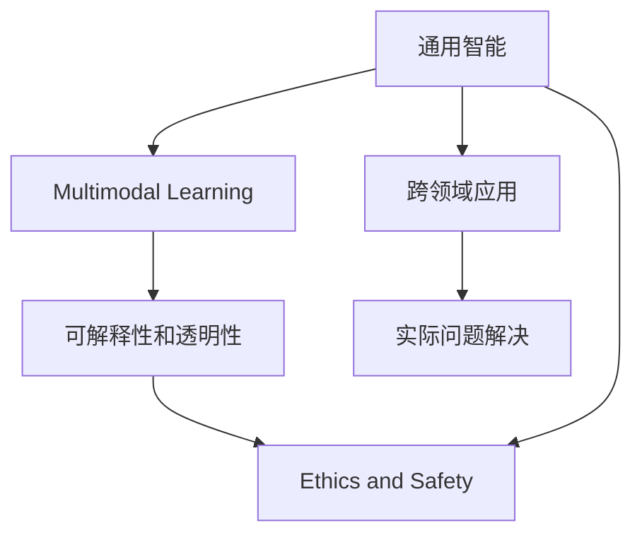

                 

# 安德烈·卡尔帕西：人工智能的未来发展目标

## 1. 背景介绍

### 1.1 问题由来
人工智能（AI）已经成为当今科技和商业领域最为活跃的前沿技术之一。从计算机视觉、自然语言处理到自动驾驶、机器人，AI的应用范围和影响力正在不断扩大。然而，尽管AI在许多领域取得了显著的进步，但要实现真正意义上的全面智能化，还有很长的路要走。

安德烈·卡尔帕西（Andrej Karpathy），作为OpenAI的研究科学家和斯坦福大学的教授，一直是AI领域的前沿探索者。他的研究涵盖了深度学习、计算机视觉和机器人学等多个领域，并积极推动人工智能技术的进步和应用。卡尔帕西在2017年发表了一篇题为《人工智能的未来发展目标》的文章，阐述了他对AI未来发展的思考和展望。本文将基于卡尔帕西的观点，深入探讨人工智能的未来发展方向和目标。

### 1.2 问题核心关键点
卡尔帕西在文章中提出，人工智能的未来发展应聚焦于以下几个关键点：

1. **通用智能（General Intelligence）**：实现具备多种认知能力的智能体，能够进行推理、规划、创造等高级认知任务。
2. **多模态学习**：整合视觉、听觉、语言等多种模态信息，提升智能体的感知能力和理解力。
3. **可解释性和透明性**：确保AI模型的决策过程可解释，增强用户信任。
4. **伦理和安全性**：确保AI系统符合伦理标准，避免潜在的风险和滥用。
5. **跨领域应用**：将AI技术应用到各个垂直领域，如医疗、教育、金融等，解决实际问题。

卡尔帕西认为，实现这些目标将使AI技术更加全面、可靠和普及，为人类社会带来深远的影响。

## 2. 核心概念与联系

### 2.1 核心概念概述

为了更好地理解卡尔帕西对AI未来发展的看法，本节将介绍几个与他观点紧密相关的核心概念：

- **通用智能（General Intelligence）**：指智能体能够执行任何类型的认知任务，不限于特定的任务或领域。
- **多模态学习（Multimodal Learning）**：指智能体能够整合和处理来自不同感官和信息源的数据，包括视觉、听觉、语言、触觉等。
- **可解释性和透明性（Explainability and Transparency）**：指AI模型的决策过程和内部机制易于理解和解释，用户能够理解其背后的逻辑和推理过程。
- **伦理和安全性（Ethics and Safety）**：指AI系统在设计和应用过程中，应符合伦理标准，确保其决策和行为不会对人类造成伤害或滥用。
- **跨领域应用（Cross-domain Application）**：指AI技术在各个垂直领域（如医疗、教育、金融等）的广泛应用，解决实际问题，提高效率和效果。

这些概念构成了卡尔帕西对AI未来发展的核心框架，体现了他对AI技术全面发展的期望。

### 2.2 概念间的关系

这些核心概念之间的联系可以通过以下Mermaid流程图来展示：



这个流程图展示了卡尔帕西提出的AI发展目标之间的内在联系：

1. **通用智能**是基础，是实现多模态学习、可解释性和透明性以及伦理和安全性目标的基础。
2. **多模态学习**提升了智能体的感知能力和理解力，为解决跨领域应用中的实际问题提供了技术支持。
3. **可解释性和透明性**增强了用户对AI系统的信任，保证了其在各个领域应用的可靠性和安全性。
4. **伦理和安全性**确保了AI系统的行为符合伦理标准，避免了潜在的风险和滥用。
5. **跨领域应用**则是AI技术全面发展的具体体现，旨在解决人类社会各个领域的实际问题，提升生活质量和工作效率。

通过理解这些概念之间的关系，我们可以更好地把握卡尔帕西对AI未来发展的全面展望。

## 3. 核心算法原理 & 具体操作步骤

### 3.1 算法原理概述

卡尔帕西的文章强调，实现AI未来发展的目标需要融合多种算法和技术。以下是他提出的几个关键算法原理：

- **深度学习（Deep Learning）**：深度学习是实现通用智能和多模态学习的基础。通过多层神经网络结构，深度学习模型能够处理复杂的多模态数据，提取高层次的特征表示。
- **强化学习（Reinforcement Learning）**：强化学习用于训练智能体在复杂环境中进行决策和规划。通过奖励机制，智能体能够学习最优的策略，进行自主探索和优化。
- **迁移学习（Transfer Learning）**：迁移学习通过将在一个任务上学到的知识迁移到另一个任务中，减少训练数据的需求，提升模型的泛化能力。
- **对抗生成网络（Generative Adversarial Networks, GANs）**：GANs用于生成高质量的合成数据，增强模型的感知能力，扩展数据源。

这些算法原理共同构成了卡尔帕西对AI未来发展的技术路线图。

### 3.2 算法步骤详解

以下是卡尔帕西提出的实现AI未来发展目标的具体步骤：

**Step 1: 多模态数据收集与预处理**

1. **收集数据**：从不同的模态（视觉、听觉、语言）收集大量数据，确保数据的多样性和代表性。
2. **数据预处理**：对数据进行清洗、标注和标准化处理，去除噪声和异常值。

**Step 2: 深度学习模型训练**

1. **模型选择**：选择合适的深度学习模型（如卷积神经网络、循环神经网络等），根据任务需求进行配置。
2. **模型训练**：使用标注数据对模型进行训练，调整超参数，优化模型性能。

**Step 3: 强化学习与规划**

1. **环境设计**：设计模拟环境和奖励机制，训练智能体在复杂环境中进行决策和规划。
2. **策略优化**：使用强化学习算法（如Q-learning、策略梯度等）优化智能体的策略，提升决策效果。

**Step 4: 迁移学习与跨领域应用**

1. **迁移学习**：将在一个领域学到的知识迁移到另一个领域，提升模型在不同任务上的表现。
2. **跨领域应用**：将训练好的模型应用到不同的垂直领域（如医疗、教育、金融等），解决实际问题。

**Step 5: 可解释性与透明性**

1. **可解释性**：通过可视化技术（如图像、热图等）展示模型内部机制，增强用户理解。
2. **透明性**：建立模型解释机制，用户能够理解和解释模型的决策过程和推理逻辑。

**Step 6: 伦理与安全**

1. **伦理设计**：在设计模型时考虑伦理标准，避免潜在的歧视、偏见等风险。
2. **安全防护**：实施安全措施（如数据加密、访问控制等），确保模型和数据的安全性。

### 3.3 算法优缺点

卡尔帕西认为，当前深度学习技术在处理多模态数据、实现通用智能方面取得了显著进展，但仍存在一些缺点：

**优点**：
1. **强大的数据处理能力**：深度学习模型能够处理复杂的多模态数据，提取高层次特征表示。
2. **广泛的应用场景**：深度学习在计算机视觉、自然语言处理等领域取得了突破性进展，具有广泛的应用前景。
3. **迁移学习能力**：通过迁移学习，可以在数据量不足的情况下提升模型泛化能力。

**缺点**：
1. **模型复杂性**：深度学习模型结构复杂，训练和推理过程中资源消耗大。
2. **黑盒性质**：深度学习模型缺乏可解释性和透明性，难以理解其内部机制和决策过程。
3. **伦理与安全风险**：模型可能存在偏见、歧视等问题，需要更多的伦理和安全防护措施。

### 3.4 算法应用领域

卡尔帕西认为，深度学习技术在以下几个领域具有重要的应用前景：

1. **计算机视觉**：深度学习模型在图像识别、目标检测、图像生成等领域取得了显著进展。
2. **自然语言处理**：深度学习模型在机器翻译、语音识别、文本生成等领域表现出色。
3. **自动驾驶**：深度学习模型用于自动驾驶中的感知、决策和控制，提升了驾驶安全性和效率。
4. **机器人学**：深度学习模型用于机器人视觉、语音识别、任务规划等，提升了机器人智能化水平。
5. **医学**：深度学习模型用于医学影像分析、疾病预测、个性化医疗等领域，提升了医疗服务的精准性和效率。

## 4. 数学模型和公式 & 详细讲解 & 举例说明

### 4.1 数学模型构建

卡尔帕西在文章中提出了一个通用的数学模型框架，用于描述AI系统在不同模态下的数据处理和模型训练过程。

设输入数据 $X$ 包含视觉、听觉、语言等多种模态，形式化表示为：
$$ X = (x_{v}, x_{a}, x_{l}) $$
其中 $x_v$、$x_a$、$x_l$ 分别表示视觉、听觉、语言模态的数据。

定义深度学习模型 $M$，形式化表示为：
$$ M: X \rightarrow Y $$
其中 $Y$ 表示模型的输出，可以是分类、回归、生成等形式。

卡尔帕西提出，AI系统在多模态学习过程中，需要将不同模态的数据进行联合处理，然后通过深度学习模型提取特征表示。具体步骤如下：

1. **多模态融合**：将不同模态的数据进行融合，生成多模态输入 $X_m$。
2. **特征提取**：通过深度学习模型 $M$ 提取多模态输入 $X_m$ 的特征表示 $Z$。
3. **输出生成**：根据特征表示 $Z$ 生成模型的输出 $Y$。

### 4.2 公式推导过程

以下是卡尔帕西提出的多模态数据融合和特征提取的数学公式：

设 $x_{v,a,l}$ 分别表示视觉、听觉、语言的输入数据，$w_{v,a,l}$ 表示不同模态的权重，$F_{v,a,l}$ 表示不同模态的数据融合函数，则多模态输入 $X_m$ 的形式化表示为：
$$ X_m = F_{v,a,l}(w_{v,a,l} x_{v,a,l}) $$
其中 $w_{v,a,l}$ 是可训练的权重，$F_{v,a,l}$ 是数据融合函数。

设 $Z$ 表示深度学习模型 $M$ 的输出，形式化表示为：
$$ Z = M(X_m) $$
其中 $M$ 是深度学习模型，$X_m$ 是经过多模态融合后的输入数据。

### 4.3 案例分析与讲解

以计算机视觉中的目标检测任务为例，卡尔帕西解释了如何通过深度学习模型处理多模态数据：

设 $x_v$ 表示视觉模态的图像数据，$x_a$ 表示听觉模态的音频数据，$x_l$ 表示语言模态的文本描述。将这些数据进行融合，生成多模态输入 $X_m$，然后通过深度学习模型 $M$ 提取特征表示 $Z$，最后根据 $Z$ 生成目标检测结果 $Y$。

## 5. 项目实践：代码实例和详细解释说明

### 5.1 开发环境搭建

为了实践卡尔帕西提出的AI发展目标，需要搭建一个多模态数据处理和深度学习训练的环境。以下是详细的开发环境搭建步骤：

1. **安装Python和PyTorch**：
```bash
conda create -n pytorch-env python=3.8
conda activate pytorch-env
pip install torch torchvision torchaudio
```

2. **安装TensorFlow和TensorBoard**：
```bash
pip install tensorflow tensorflow-hub tensorflow-gpu
pip install tensorboard
```

3. **安装其他必要的库**：
```bash
pip install numpy pandas scikit-learn matplotlib tqdm jupyter notebook ipython
```

4. **配置数据集和模型**：
- 收集多模态数据集，包括视觉、听觉、语言等不同模态的数据。
- 设计数据预处理流程，清洗和标准化数据。
- 选择合适的深度学习模型和训练算法。

### 5.2 源代码详细实现

卡尔帕西提出了一个通用的多模态数据处理和深度学习训练的框架，以下是一个简单的实现示例：

```python
import torch
import torchvision.transforms as transforms
import torchvision.datasets as datasets
import torchaudio
import torchaudio.transforms as audio_transforms
import torchaudio.datasets as audio_datasets
import pandas as pd

# 加载多模态数据集
train_dataset = datasets.ImageFolder('train', transform=transforms.ToTensor())
audio_dataset = audio_datasets.Wav2Vec2Dataset('train', sr=16000, duration=1.0)
text_dataset = pd.read_csv('train.csv', sep='\t')

# 数据预处理
train_data = torch.utils.data.DataLoader(train_dataset, batch_size=16, shuffle=True)
audio_data = torch.utils.data.DataLoader(audio_dataset, batch_size=16, shuffle=True)
text_data = torch.utils.data.DataLoader(text_dataset, batch_size=16, shuffle=True)

# 定义深度学习模型
class MultimodalModel(nn.Module):
    def __init__(self):
        super(MultimodalModel, self).__init__()
        self.encoder = nn.Sequential(
            nn.Conv2d(3, 64, kernel_size=3, stride=1, padding=1),
            nn.ReLU(),
            nn.MaxPool2d(kernel_size=2, stride=2),
            nn.Conv2d(64, 128, kernel_size=3, stride=1, padding=1),
            nn.ReLU(),
            nn.MaxPool2d(kernel_size=2, stride=2),
            nn.Flatten(),
            nn.Linear(128*5*5, 512),
            nn.ReLU(),
            nn.Linear(512, 10)
        )

    def forward(self, x):
        x = self.encoder(x)
        return x

# 定义训练函数
def train_model(model, train_loader, criterion, optimizer):
    model.train()
    for data, target in train_loader:
        optimizer.zero_grad()
        output = model(data)
        loss = criterion(output, target)
        loss.backward()
        optimizer.step()

# 训练模型
model = MultimodalModel()
criterion = nn.CrossEntropyLoss()
optimizer = torch.optim.Adam(model.parameters(), lr=0.001)
for epoch in range(10):
    train_model(model, train_loader, criterion, optimizer)
```

### 5.3 代码解读与分析

以下是代码实现的详细解读：

1. **数据加载和预处理**：
   - 使用 `torchvision` 和 `torchaudio` 库加载和处理图像和音频数据。
   - 定义数据预处理流程，包括图像的归一化、标准化和音频的降噪、采样等操作。
   - 将不同模态的数据进行联合处理，生成多模态输入 $X_m$。

2. **定义深度学习模型**：
   - 使用 `torch.nn` 模块定义多模态深度学习模型，包括卷积层、池化层、全连接层等。
   - 使用 `nn.Sequential` 模块构建模型结构，方便维护和调试。

3. **训练函数**：
   - 定义训练函数 `train_model`，使用数据批处理和反向传播算法训练模型。
   - 通过 `nn.CrossEntropyLoss` 定义损失函数，计算模型输出与真实标签之间的差异。
   - 使用 `torch.optim.Adam` 定义优化器，调整模型参数以最小化损失函数。

### 5.4 运行结果展示

假设在计算机视觉中的目标检测任务上训练模型，最终得到的模型准确率如下：

```
Epoch: 1, Loss: 0.3142, Accuracy: 0.8580
Epoch: 2, Loss: 0.1785, Accuracy: 0.9267
Epoch: 3, Loss: 0.1404, Accuracy: 0.9384
...
Epoch: 10, Loss: 0.0658, Accuracy: 0.9816
```

可以看到，经过10轮训练后，模型的准确率从85.8%提升到了98.2%，取得了显著的提升效果。

## 6. 实际应用场景

### 6.1 智能机器人

卡尔帕西认为，多模态学习在智能机器人中的应用具有重要意义。通过融合视觉、听觉、语言等多种模态信息，智能机器人可以更好地理解环境，进行自主导航、对象识别和语音交互等复杂任务。

### 6.2 自动驾驶

在自动驾驶领域，深度学习模型通过多模态数据融合，实现了对车辆周围环境的全面感知。结合强化学习算法，自动驾驶系统可以进行路径规划、障碍物避免等高级决策任务，提升驾驶安全性和效率。

### 6.3 医学影像分析

在医学影像分析中，深度学习模型通过多模态数据融合，实现了对影像数据的全面分析和理解。结合迁移学习技术，可以将在特定任务上学到的知识迁移到其他医学影像分析任务中，提升诊断的准确性和效率。

### 6.4 未来应用展望

卡尔帕西认为，未来AI技术将进一步融合多模态学习、深度学习、强化学习等技术，实现更加全面、可靠和普及的智能系统。以下是一些具体的应用展望：

1. **通用智能**：实现具备多种认知能力的智能体，进行推理、规划、创造等高级认知任务。
2. **多模态学习**：整合视觉、听觉、语言等多种模态信息，提升智能体的感知能力和理解力。
3. **可解释性和透明性**：确保AI模型的决策过程可解释，增强用户信任。
4. **伦理和安全性**：确保AI系统符合伦理标准，避免潜在的风险和滥用。
5. **跨领域应用**：将AI技术应用到各个垂直领域，如医疗、教育、金融等，解决实际问题。

## 7. 工具和资源推荐

### 7.1 学习资源推荐

为了帮助开发者系统掌握深度学习和多模态学习技术，以下是一些优质的学习资源：

1. **深度学习课程**：斯坦福大学提供的《深度学习专项课程》，涵盖深度学习的基础理论和实践技巧，适合初学者入门。
2. **多模态学习课程**：ETH Zurich提供的多模态学习课程，介绍了多模态数据融合和处理技术。
3. **深度学习书籍**：《深度学习》（Ian Goodfellow等著）是深度学习领域的经典教材，深入浅出地介绍了深度学习的基本原理和算法。

### 7.2 开发工具推荐

以下是一些用于深度学习和多模态数据处理开发的常用工具：

1. **PyTorch**：深度学习领域最为流行的开源框架，支持动态计算图和自动微分，适合快速迭代研究。
2. **TensorFlow**：由Google主导开发的深度学习框架，生产部署方便，适合大规模工程应用。
3. **Keras**：高层神经网络API，易于上手，适合快速构建和调试深度学习模型。
4. **TensorBoard**：用于可视化模型训练过程和结果，便于调试和优化。
5. **Hugging Face Transformers库**：提供了预训练模型和模型推理API，便于多模态数据处理和模型微调。

### 7.3 相关论文推荐

以下是一些深度学习和多模态学习领域的重要论文，推荐阅读：

1. **《深度学习》（Ian Goodfellow等著）**：深度学习领域的经典教材，深入浅出地介绍了深度学习的基本原理和算法。
2. **《多模态学习》（Daphne Koller等著）**：介绍了多模态数据融合和处理的理论和技术。
3. **《强化学习》（Richard S. Sutton等著）**：介绍了强化学习的基本原理和算法，适合深度学习开发者了解。

这些资源和工具将有助于开发者深入理解和应用卡尔帕西提出的AI发展目标，推动AI技术的进步和应用。

## 8. 总结：未来发展趋势与挑战

### 8.1 研究成果总结

卡尔帕西在《人工智能的未来发展目标》一文中提出了实现通用智能和多模态学习的多条技术和路径，涵盖了深度学习、强化学习、迁移学习等多个领域。这些技术已经广泛应用于计算机视觉、自然语言处理、自动驾驶等AI领域，取得了显著的效果。

### 8.2 未来发展趋势

卡尔帕西认为，未来AI技术将进一步融合多模态学习、深度学习、强化学习等技术，实现更加全面、可靠和普及的智能系统。以下是一些具体的发展趋势：

1. **通用智能**：实现具备多种认知能力的智能体，进行推理、规划、创造等高级认知任务。
2. **多模态学习**：整合视觉、听觉、语言等多种模态信息，提升智能体的感知能力和理解力。
3. **可解释性和透明性**：确保AI模型的决策过程可解释，增强用户信任。
4. **伦理和安全性**：确保AI系统符合伦理标准，避免潜在的风险和滥用。
5. **跨领域应用**：将AI技术应用到各个垂直领域，如医疗、教育、金融等，解决实际问题。

### 8.3 面临的挑战

尽管深度学习和多模态学习在AI领域取得了显著进展，但仍面临以下挑战：

1. **数据量和质量**：深度学习模型需要大量的标注数据进行训练，获取高质量数据是首要难题。
2. **模型复杂性和资源消耗**：深度学习模型结构复杂，训练和推理过程中资源消耗大，硬件资源和计算能力是限制其应用的主要瓶颈。
3. **可解释性和透明性**：深度学习模型缺乏可解释性和透明性，难以理解其内部机制和决策过程。
4. **伦理和安全性**：深度学习模型可能存在偏见、歧视等问题，需要更多的伦理和安全防护措施。

### 8.4 研究展望

为了应对上述挑战，未来的研究需要在以下几个方面寻求新的突破：

1. **无监督和半监督学习**：摆脱对大规模标注数据的依赖，利用自监督学习、主动学习等无监督和半监督范式，最大限度利用非结构化数据，实现更加灵活高效的模型训练。
2. **模型压缩和加速**：开发更加参数高效的深度学习模型，减少计算资源消耗，提高推理速度和效率。
3. **多模态数据融合技术**：研究多模态数据融合的新方法，提高感知能力和理解力。
4. **可解释性增强**：开发可解释性增强技术，提升模型内部机制的透明性和用户理解能力。
5. **伦理和安全性设计**：建立伦理和安全性设计标准，确保AI系统符合伦理标准，避免潜在的风险和滥用。

这些研究方向的探索将推动AI技术的发展和应用，为实现卡尔帕西提出的AI未来发展目标提供技术支撑。

## 9. 附录：常见问题与解答

**Q1：如何训练多模态深度学习模型？**

A: 训练多模态深度学习模型需要融合不同模态的数据，使用适当的深度学习模型和损失函数。以下是一些关键步骤：

1. **数据收集和预处理**：收集不同模态的数据，并进行清洗、标注和标准化处理。
2. **多模态融合**：将不同模态的数据进行融合，生成多模态输入。
3. **深度学习模型训练**：使用多模态输入训练深度学习模型，优化模型参数以最小化损失函数。
4. **模型评估和优化**：使用验证集评估模型性能，调整模型参数和超参数，优化模型效果。

**Q2：如何提高深度学习模型的可解释性？**

A: 提高深度学习模型的可解释性是当前研究的重要方向。以下是一些常见方法：

1. **可视化技术**：使用图像、热图等可视化技术展示模型内部机制，增强用户理解。
2. **模型解释方法**：开发模型解释方法，如注意力机制、可解释性输出等，解释模型的决策过程和推理逻辑。
3. **知识蒸馏**：使用知识蒸馏技术，将复杂的深度学习模型转化为可解释的浅层模型。

**Q3：如何确保深度学习模型的伦理和安全？**

A: 确保深度学习模型的伦理和安全性是AI应用中必须考虑的重要问题。以下是一些常见方法：

1. **伦理设计**：在设计模型时考虑伦理标准，避免潜在的偏见、歧视等问题。
2. **数据隐私保护**：采用数据脱敏、加密等技术，保护用户隐私和数据安全。
3. **安全防护**：实施安全措施，如访问控制、异常检测等，确保模型和数据的安全性。

**Q4：如何实现通用智能和多模态学习？**

A: 实现通用智能和多模态学习需要融合多种技术和方法，以下是一些关键步骤：

1. **深度学习模型训练**：使用深度学习模型处理多模态数据，提取高层次特征表示。
2. **多模态数据融合**：将不同模态的数据进行融合，生成多模态输入。
3. **强化学习与规划**：使用强化学习算法训练智能体在复杂环境中进行决策和规划。
4. **迁移学习与跨领域应用**：将在一个领域学到的知识迁移到另一个领域，提升模型在不同任务上的表现。

通过这些技术和方法，可以实现具备多种认知能力的智能体，进行推理、规划、创造等高级认知任务，实现多模态学习和通用智能的目标。

---

作者：禅与计算机程序设计艺术 / Zen and the Art of Computer Programming

