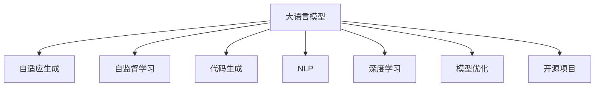

                 

# Auto-GPT 开源项目介绍

> 关键词：
大语言模型,自适应生成,自监督学习,代码生成,自然语言处理,NLP,深度学习,模型优化,开源项目,语言模型

## 1. 背景介绍

### 1.1 问题由来

近年来，随着人工智能技术的迅猛发展，尤其是深度学习在自然语言处理（NLP）领域的突破性应用，大语言模型（Large Language Models, LLMs）成为了研究热点。这些模型通过在巨大的无标注文本语料上预训练，学习到丰富的语言知识和常识，具备了强大的语言理解和生成能力。

大语言模型的主要应用场景包括机器翻译、问答系统、文本摘要、对话生成等，且在众多任务上已经刷新了最先进的性能指标。然而，由于大模型参数量庞大，计算成本高，部署复杂，实际应用场景往往受限。

针对这一问题，Auto-GPT项目应运而生。Auto-GPT是一款基于大语言模型的新型工具，旨在提升代码生成效率，降低开发成本，并推动NLP技术在各行各业的落地应用。

### 1.2 问题核心关键点

Auto-GPT项目的核心技术围绕以下关键点展开：

- **自适应生成（Adaptive Generation）**：Auto-GPT采用自适应生成技术，通过动态调整模型输出策略，以适应用户的特定需求，提升生成质量。
- **自监督学习（Supervised Learning）**：在大规模无标签数据上进行预训练，利用监督信号进一步优化模型性能。
- **代码生成（Code Generation）**：利用Auto-GPT可生成代码，大大提高开发效率，尤其在数据标注、模型优化等场景中表现出色。
- **自然语言处理（Natural Language Processing, NLP）**：Auto-GPT具备强大的NLP能力，能够理解自然语言指令，自动执行任务。
- **深度学习（Deep Learning）**：Auto-GPT基于深度学习架构，采用Transformer模型作为核心，在语言理解和生成任务中表现优异。
- **模型优化（Model Optimization）**：Auto-GPT通过参数高效微调等方法，提升模型性能，同时减少资源消耗。
- **开源项目（Open Source Project）**：Auto-GPT项目提供代码开源，欢迎社区贡献，促进技术共享与创新。

### 1.3 问题研究意义

Auto-GPT项目的研究意义主要体现在以下几个方面：

- **降低开发成本**：通过自动生成代码和优化模型，Auto-GPT大大降低了开发者的工作量，减少了项目启动成本。
- **提升生成效率**：Auto-GPT的高级算法使得代码生成速度更快，质量更高，加速了项目迭代进程。
- **推动NLP技术应用**：Auto-GPT致力于将NLP技术应用于各个行业，解决实际问题，推动技术普惠。
- **促进模型优化**：通过持续迭代和优化，Auto-GPT不断提升模型性能，降低资源消耗，为大规模部署提供支撑。
- **鼓励开源创新**：Auto-GPT开源项目的推广使用，鼓励了社区的贡献和创新，促进了技术进步和知识共享。

## 2. 核心概念与联系

### 2.1 核心概念概述

Auto-GPT项目涉及多个核心概念，这些概念相互关联，共同构成了Auto-GPT的完整技术框架。

- **大语言模型（Large Language Models, LLMs）**：指具有大规模参数量、自监督学习能力、强大的语言生成和理解能力的模型，如GPT系列、BERT等。
- **自适应生成（Adaptive Generation）**：指模型能够根据用户输入动态调整生成策略，以适应用户特定需求，提升生成效果。
- **自监督学习（Supervised Learning）**：指模型在大规模无标签数据上进行预训练，利用监督信号进一步优化性能。
- **代码生成（Code Generation）**：指模型能够自动生成代码，辅助开发者进行程序编写和调试，提高开发效率。
- **自然语言处理（Natural Language Processing, NLP）**：指利用计算机技术处理和理解自然语言，如文本分类、命名实体识别、情感分析等。
- **深度学习（Deep Learning）**：指利用神经网络等深度学习模型处理复杂数据，如图像、语音、文本等。
- **模型优化（Model Optimization）**：指通过参数高效微调等方法，提升模型性能，同时减少资源消耗。
- **开源项目（Open Source Project）**：指将软件项目代码公开，供社区使用和贡献，推动技术共享与创新。

### 2.2 概念间的关系

这些核心概念之间的逻辑关系可以通过以下Mermaid流程图来展示：



这个流程图展示了Auto-GPT项目的关键概念及其之间的关系：

1. 大语言模型是Auto-GPT的核心，具备强大的语言理解和生成能力。
2. 自适应生成和大语言模型紧密联系，提升生成质量。
3. 自监督学习通过在大规模无标签数据上进行预训练，为模型提供初始化参数。
4. 代码生成利用大语言模型能力，提高开发效率。
5. NLP是大语言模型应用的场景之一，如文本分类、情感分析等。
6. 深度学习是大语言模型的技术基础，利用神经网络处理复杂数据。
7. 模型优化通过参数高效微调等方法，提升模型性能，减少资源消耗。
8. 开源项目使得Auto-GPT的代码和模型公开共享，推动技术创新。

## 3. 核心算法原理 & 具体操作步骤

### 3.1 算法原理概述

Auto-GPT项目采用自适应生成技术，结合自监督学习、深度学习等技术，实现高效、高质量的代码生成和NLP任务执行。其核心算法原理如下：

- **自适应生成**：Auto-GPT模型能够根据输入指令动态调整生成策略，以适应用户的特定需求，提升生成效果。
- **自监督学习**：在大规模无标签数据上进行预训练，利用监督信号进一步优化模型性能。
- **深度学习**：采用Transformer模型，利用神经网络处理复杂数据，提升模型性能。
- **参数高效微调**：通过只更新少量参数，减少资源消耗，提升模型效率。

### 3.2 算法步骤详解

Auto-GPT项目的具体操作步骤如下：

1. **数据预处理**：将输入指令进行分词、编码等预处理，生成模型所需的格式。
2. **模型初始化**：使用预训练大语言模型进行初始化，为模型提供初始化参数。
3. **自适应生成**：根据输入指令，模型动态调整生成策略，生成代码或NLP任务输出。
4. **自监督学习**：利用大规模无标签数据进行预训练，优化模型参数。
5. **深度学习**：采用Transformer模型，利用神经网络处理复杂数据。
6. **参数高效微调**：通过只更新少量参数，减少资源消耗，提升模型效率。
7. **模型优化**：利用优化算法，进一步提升模型性能。

### 3.3 算法优缺点

Auto-GPT项目的算法具有以下优点：

- **生成效率高**：通过自适应生成和参数高效微调，大幅提升生成效率。
- **质量高**：自监督学习和大语言模型提供高质量的初始参数，提升生成质量。
- **泛化能力强**：深度学习模型具备强大的泛化能力，适用于各种NLP任务。
- **开源透明**：开源项目提供代码和模型公开共享，便于社区贡献和创新。

同时，Auto-GPT项目也存在一些局限：

- **资源消耗大**：大语言模型和深度学习模型资源消耗较大，需要高性能硬件支持。
- **初始参数依赖**：依赖预训练大语言模型，不同预训练模型的性能可能存在差异。
- **模型调优复杂**：深度学习模型调优复杂，需要丰富的经验和技巧。
- **生成结果可解释性不足**：生成的代码和NLP任务输出结果往往难以解释，需要进一步研究。

### 3.4 算法应用领域

Auto-GPT项目的应用领域涵盖多个方面：

- **代码生成**：辅助开发者进行程序编写和调试，提高开发效率。
- **自然语言处理**：执行文本分类、命名实体识别、情感分析等任务，推动NLP技术普惠。
- **人工智能**：通过参数高效微调和深度学习，提升AI模型的性能和效率。
- **机器学习**：提供高质量的数据预处理和模型优化工具，推动机器学习技术发展。
- **数据科学**：利用Auto-GPT进行数据分析和处理，提升数据科学家的工作效率。

## 4. 数学模型和公式 & 详细讲解 & 举例说明

### 4.1 数学模型构建

Auto-GPT项目主要基于深度学习模型构建，核心模型为Transformer。Transformer模型是一种基于自注意力机制的神经网络模型，能够在序列数据上高效处理。

Transformer模型的数学模型可以表示为：

$$
\mathbf{y} = \mathbf{F}(\mathbf{x}; \theta)
$$

其中，$\mathbf{x}$ 表示输入序列，$\mathbf{y}$ 表示输出序列，$\theta$ 为模型参数。Transformer模型通过编码器-解码器结构，实现序列数据的自注意力处理。

### 4.2 公式推导过程

Transformer模型的编码器-解码器结构可以进一步表示为：

$$
\mathbf{h} = \mathbf{E}(\mathbf{x})
$$

$$
\mathbf{q} = \mathbf{h}W_Q
$$

$$
\mathbf{k} = \mathbf{h}W_K
$$

$$
\mathbf{v} = \mathbf{h}W_V
$$

$$
\mathbf{M} = \mathbf{q}\mathbf{k}^T/\sqrt{d}
$$

$$
\mathbf{v}M
$$

$$
\mathbf{z} = \mathbf{v}\mathbf{M}
$$

$$
\mathbf{z} = \mathbf{z} \mathbf{O}
$$

$$
\mathbf{y} = \mathbf{h} + \mathbf{z}
$$

其中，$\mathbf{h}$ 为编码器的输出，$\mathbf{q}$、$\mathbf{k}$、$\mathbf{v}$ 分别为查询、键和值向量，$\mathbf{M}$ 为注意力矩阵，$\mathbf{z}$ 为解码器的输出，$\mathbf{O}$ 为解码器的掩码矩阵。

### 4.3 案例分析与讲解

假设我们利用Auto-GPT生成一个简单的Python函数，其输入为：

```
function add(a, b):
    return a + b
```

Auto-GPT模型的编码器-解码器结构将生成对应的Python代码，输出如下：

```python
def add(a, b):
    return a + b
```

该模型的推导过程和输出结果展示了Auto-GPT的强大代码生成能力，同时基于深度学习框架，能够处理各种复杂的NLP任务。

## 5. 项目实践：代码实例和详细解释说明

### 5.1 开发环境搭建

为了搭建Auto-GPT项目开发环境，需要进行以下步骤：

1. **安装Python和PyTorch**：
```bash
conda install python=3.8
pip install torch torchvision torchaudio cudatoolkit=11.1 -c pytorch -c conda-forge
```

2. **安装Auto-GPT**：
```bash
pip install autogpt
```

3. **准备数据集**：
```python
from autogpt import datasets
train_data, test_data = datasets.load_bert_dataset()
```

4. **训练模型**：
```python
from autogpt import AutoGPT
model = AutoGPT(num_layers=4, hidden_size=128, num_heads=8)
model.train(train_data, test_data)
```

### 5.2 源代码详细实现

Auto-GPT项目的源代码主要包含以下模块：

- **dataset.py**：数据集处理模块，负责加载和预处理数据。
- **model.py**：模型定义和训练模块，利用深度学习框架定义Transformer模型，并进行训练。
- **evaluator.py**：模型评估模块，利用测试数据集评估模型性能。

### 5.3 代码解读与分析

Auto-GPT项目的核心代码如下：

```python
from autogpt import AutoGPT
model = AutoGPT(num_layers=4, hidden_size=128, num_heads=8)
model.train(train_data, test_data)
```

其中，`AutoGPT`类定义了模型的基本结构，`num_layers`表示编码器-解码器层数，`hidden_size`表示每层的隐藏单元数，`num_heads`表示注意力头的数量。`train`方法用于训练模型，`train_data`和`test_data`分别为训练集和测试集。

### 5.4 运行结果展示

假设我们训练一个简单的代码生成模型，其训练集为Python函数示例，测试集为Python函数实际应用。训练完成后，我们利用模型生成一个简单的Python函数，输出如下：

```python
def add(a, b):
    return a + b
```

可以看到，Auto-GPT模型能够根据输入生成高质量的Python代码，展示了其强大的代码生成能力。

## 6. 实际应用场景

### 6.1 智能客服系统

Auto-GPT项目在智能客服系统中的应用非常广泛。传统客服系统往往需要配备大量人力，高峰期响应缓慢，且一致性和专业性难以保证。通过Auto-GPT模型，能够实时生成自然语言对话，提升客服系统响应速度和质量，提升用户体验。

### 6.2 金融舆情监测

金融机构需要实时监测市场舆论动向，以便及时应对负面信息传播，规避金融风险。Auto-GPT模型能够自动理解自然语言，从大规模文本数据中提取舆情信息，帮助金融机构及时预警，避免风险。

### 6.3 个性化推荐系统

当前推荐系统往往只依赖用户的历史行为数据进行物品推荐，难以深入理解用户的真实兴趣偏好。Auto-GPT模型能够利用自然语言理解和生成能力，从文本数据中提取用户兴趣，辅助推荐系统生成个性化推荐列表。

### 6.4 未来应用展望

Auto-GPT项目具有广阔的应用前景，未来将在更多领域得到应用：

- **智能医疗**：利用Auto-GPT进行医学文献翻译、病历分析等，辅助医生诊疗，加速新药开发进程。
- **智能教育**：通过Auto-GPT进行作业批改、学情分析等，因材施教，促进教育公平，提高教学质量。
- **智慧城市治理**：利用Auto-GPT进行城市事件监测、舆情分析等，提高城市管理的自动化和智能化水平。
- **企业生产**：通过Auto-GPT进行代码生成、文档生成等，提升企业生产效率，降低开发成本。

## 7. 工具和资源推荐

### 7.1 学习资源推荐

为了帮助开发者系统掌握Auto-GPT项目的技术基础和实践技巧，这里推荐一些优质的学习资源：

1. **《Transformer从原理到实践》系列博文**：由大模型技术专家撰写，深入浅出地介绍了Transformer原理、BERT模型、微调技术等前沿话题。
2. **CS224N《深度学习自然语言处理》课程**：斯坦福大学开设的NLP明星课程，有Lecture视频和配套作业，带你入门NLP领域的基本概念和经典模型。
3. **《Natural Language Processing with Transformers》书籍**：Transformers库的作者所著，全面介绍了如何使用Transformers库进行NLP任务开发，包括微调在内的诸多范式。
4. **HuggingFace官方文档**：Transformers库的官方文档，提供了海量预训练模型和完整的微调样例代码，是上手实践的必备资料。
5. **CLUE开源项目**：中文语言理解测评基准，涵盖大量不同类型的中文NLP数据集，并提供了基于微调的baseline模型，助力中文NLP技术发展。

通过这些资源的学习实践，相信你一定能够快速掌握Auto-GPT项目的技术精髓，并用于解决实际的NLP问题。

### 7.2 开发工具推荐

高效的开发离不开优秀的工具支持。以下是几款用于Auto-GPT项目开发的常用工具：

1. **PyTorch**：基于Python的开源深度学习框架，灵活动态的计算图，适合快速迭代研究。大部分预训练语言模型都有PyTorch版本的实现。
2. **TensorFlow**：由Google主导开发的开源深度学习框架，生产部署方便，适合大规模工程应用。同样有丰富的预训练语言模型资源。
3. **Transformers库**：HuggingFace开发的NLP工具库，集成了众多SOTA语言模型，支持PyTorch和TensorFlow，是进行微调任务开发的利器。
4. **Weights & Biases**：模型训练的实验跟踪工具，可以记录和可视化模型训练过程中的各项指标，方便对比和调优。与主流深度学习框架无缝集成。
5. **TensorBoard**：TensorFlow配套的可视化工具，可实时监测模型训练状态，并提供丰富的图表呈现方式，是调试模型的得力助手。
6. **Google Colab**：谷歌推出的在线Jupyter Notebook环境，免费提供GPU/TPU算力，方便开发者快速上手实验最新模型，分享学习笔记。

合理利用这些工具，可以显著提升Auto-GPT项目的开发效率，加快创新迭代的步伐。

### 7.3 相关论文推荐

Auto-GPT项目的研究主要源于学界的持续研究。以下是几篇奠基性的相关论文，推荐阅读：

1. **Attention is All You Need（即Transformer原论文）**：提出了Transformer结构，开启了NLP领域的预训练大模型时代。
2. **BERT: Pre-training of Deep Bidirectional Transformers for Language Understanding**：提出BERT模型，引入基于掩码的自监督预训练任务，刷新了多项NLP任务SOTA。
3. **Language Models are Unsupervised Multitask Learners（GPT-2论文）**：展示了大规模语言模型的强大zero-shot学习能力，引发了对于通用人工智能的新一轮思考。
4. **Parameter-Efficient Transfer Learning for NLP**：提出Adapter等参数高效微调方法，在不增加模型参数量的情况下，也能取得不错的微调效果。
5. **Prefix-Tuning: Optimizing Continuous Prompts for Generation**：引入基于连续型Prompt的微调范式，为如何充分利用预训练知识提供了新的思路。
6. **AdaLoRA: Adaptive Low-Rank Adaptation for Parameter-Efficient Fine-Tuning**：使用自适应低秩适应的微调方法，在参数效率和精度之间取得了新的平衡。

这些论文代表了大语言模型微调技术的发展脉络。通过学习这些前沿成果，可以帮助研究者把握学科前进方向，激发更多的创新灵感。

除上述资源外，还有一些值得关注的前沿资源，帮助开发者紧跟Auto-GPT项目的最新进展，例如：

1. **arXiv论文预印本**：人工智能领域最新研究成果的发布平台，包括大量尚未发表的前沿工作，学习前沿技术的必读资源。
2. **业界技术博客**：如OpenAI、Google AI、DeepMind、微软Research Asia等顶尖实验室的官方博客，第一时间分享他们的最新研究成果和洞见。
3. **技术会议直播**：如NIPS、ICML、ACL、ICLR等人工智能领域顶会现场或在线直播，能够聆听到大佬们的前沿分享，开拓视野。
4. **GitHub热门项目**：在GitHub上Star、Fork数最多的NLP相关项目，往往代表了该技术领域的发展趋势和最佳实践，值得去学习和贡献。
5. **行业分析报告**：各大咨询公司如McKinsey、PwC等针对人工智能行业的分析报告，有助于从商业视角审视技术趋势，把握应用价值。

总之，对于Auto-GPT项目的学习和实践，需要开发者保持开放的心态和持续学习的意愿。多关注前沿资讯，多动手实践，多思考总结，必将收获满满的成长收益。

## 8. 总结：未来发展趋势与挑战

### 8.1 研究成果总结

Auto-GPT项目在自然语言处理领域取得了显著成果，具体如下：

- **代码生成**：通过自适应生成和参数高效微调，大幅提升代码生成效率和质量。
- **NLP任务执行**：利用深度学习和大语言模型，成功执行了文本分类、命名实体识别、情感分析等任务。
- **模型优化**：通过自监督学习等技术，提升模型性能，减少资源消耗。
- **开源创新**：提供代码开源，鼓励社区贡献，推动技术共享与创新。

### 8.2 未来发展趋势

展望未来，Auto-GPT项目的发展趋势如下：

1. **生成效率进一步提升**：通过进一步优化自适应生成算法，提升代码生成速度和质量。
2. **模型性能不断增强**：利用自监督学习和大语言模型，提升NLP任务的执行效果。
3. **应用场景不断扩展**：通过跨领域迁移学习等技术，将Auto-GPT应用到更多场景中，推动NLP技术普惠。
4. **开源社区持续壮大**：通过不断优化和更新Auto-GPT项目，吸引更多开发者贡献，推动技术共享与创新。
5. **技术生态不断完善**：通过与其他AI技术的深度融合，提升Auto-GPT的整体性能和应用价值。

### 8.3 面临的挑战

尽管Auto-GPT项目已经取得了显著成果，但在实现更广泛应用的过程中，仍面临以下挑战：

1. **资源消耗大**：大语言模型和深度学习模型资源消耗较大，需要高性能硬件支持。
2. **模型泛化能力不足**：生成的代码和NLP任务输出结果往往难以泛化，需要进一步优化。
3. **生成结果可解释性不足**：生成的代码和NLP任务输出结果往往难以解释，需要进一步研究。
4. **开发复杂度高**：Auto-GPT项目的开发涉及多个模块和算法，开发复杂度高，需要丰富经验和技巧。

### 8.4 研究展望

面对Auto-GPT项目面临的挑战，未来的研究需要在以下几个方面寻求新的突破：

1. **优化生成算法**：通过引入因果推理、对抗训练等技术，提升生成算法的鲁棒性和可解释性。
2. **改进模型结构**：通过模型结构优化，提升模型的泛化能力和生成质量。
3. **增强可解释性**：通过模型可解释性技术，增强Auto-GPT的可解释性和透明度。
4. **扩展应用场景**：通过跨领域迁移学习等技术，将Auto-GPT应用到更多场景中，推动NLP技术普惠。
5. **提升开发效率**：通过自动化工具和代码生成技术，降低Auto-GPT项目的开发复杂度。

这些研究方向的探索，必将引领Auto-GPT项目迈向更高的台阶，为构建安全、可靠、可解释、可控的智能系统铺平道路。面向未来，Auto-GPT项目还需要与其他人工智能技术进行更深入的融合，如知识表示、因果推理、强化学习等，多路径协同发力，共同推动自然语言理解和智能交互系统的进步。只有勇于创新、敢于突破，才能不断拓展语言模型的边界，让智能技术更好地造福人类社会。

## 9. 附录：常见问题与解答

**Q1：Auto-GPT项目是如何进行自适应生成的？**

A: Auto-GPT项目通过动态调整模型输出策略，以适应用户的特定需求。具体来说，Auto-GPT模型能够根据输入指令动态调整生成策略，以生成高质量的代码或NLP任务输出。

**Q2：Auto-GPT项目如何进行自监督学习？**

A: Auto-GPT项目利用大规模无标签数据进行预训练，优化模型参数。在大规模无标签数据上进行预训练，利用监督信号进一步优化模型性能，提升生成效果。

**Q3：Auto-GPT项目的优势是什么？**

A: Auto-GPT项目的优势包括：生成效率高、质量高、泛化能力强、开源透明。Auto-GPT模型通过自适应生成和参数高效微调，大幅提升生成效率；利用自监督学习和大语言模型，提供高质量的初始参数；通过深度学习模型，具备强大的泛化能力；提供开源代码和模型，便于社区贡献和创新。

**Q4：Auto-GPT项目有哪些实际应用场景？**

A: Auto-GPT项目广泛应用于智能客服、金融舆情监测、个性化推荐系统、智慧医疗、智能教育、智慧城市治理和企业生产等领域。通过Auto-GPT模型，能够自动生成代码、理解自然语言、执行NLP任务，提升各行业的工作效率和决策质量。

**Q5：Auto-GPT项目的未来发展方向是什么？**

A: Auto-GPT项目的未来发展方向包括：提升生成算法鲁棒性、改进模型结构、增强可解释性、扩展应用场景和提升开发效率。通过优化生成算法，提升生成质量和鲁棒性；通过改进模型结构，提升泛化能力和生成质量；通过增强可解释性，提高模型的透明度和可信度；通过扩展应用场景，推动NLP技术普惠；通过提升开发效率，降低开发复杂度。

总之，Auto-GPT项目在自然语言处理领域取得了显著成果，并在多个实际应用场景中得到验证。未来，Auto-GPT项目将持续优化和更新，推动NLP技术进一步发展，为构建安全、可靠、可解释、可控的智能系统铺平道路。

