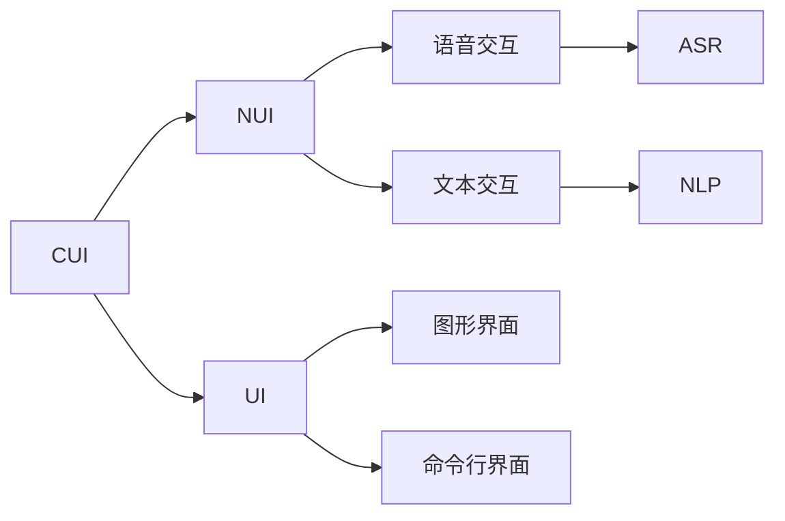

                 

# CUI如何彻底改变数字产品的交互方式

> 关键词：用户界面(UI), 自然用户界面(NUI), 计算机用户界面(CUI), 交互设计, 交互技术, 人机交互

## 1. 背景介绍

随着科技的快速发展，数字产品的交互方式经历了从传统的基于点击界面的UI（User Interface），到更加自然直观的自然用户界面（NUI，Natural User Interface）的变革。如今，随着人工智能技术的成熟，一种全新的交互形式——计算机用户界面（CUI，Computer User Interface）正在兴起。

CUI利用自然语言处理（NLP）和语音识别（ASR）等技术，使计算机能够理解和响应用户的自然语言和语音命令，从而实现真正意义上的自然交流。这种交互方式不仅提高了用户体验，也为数字产品的设计带来了新的思路和方法。

本文将从CUI的原理、实践、应用和未来趋势等角度，深入探讨这一新兴交互形式如何彻底改变数字产品的设计和使用方式。

## 2. 核心概念与联系

### 2.1 核心概念概述

在探讨CUI之前，需要先了解一些核心概念及其之间的关系。

- **计算机用户界面（CUI）**：指计算机能够理解和使用自然语言和语音命令，实现人与计算机之间的自然交流的交互形式。CUI通常包含语音助手、聊天机器人、文本摘要生成等应用场景。

- **自然语言处理（NLP）**：涉及计算机处理和理解人类语言的技术。NLP包括语言模型、语义分析、机器翻译等子领域。

- **语音识别（ASR）**：将人类语音转换成文本或命令的技术。ASR是实现语音交互的基础。

- **自然用户界面（NUI）**：指使用自然语言、手势、表情等自然方式与计算机进行交互的形式。NUI强调用户体验的自然性和直观性。

- **用户界面(UI)**：指计算机软件提供给用户的操作接口，包括图形界面、命令行界面等。UI通常提供明确的操作指引和反馈，使用户能够高效地完成任务。

这些核心概念之间相互关联，共同构成了现代数字产品的交互方式。通过CUI，数字产品的交互方式更加自然和直观，提升了用户的使用体验和效率。

### 2.2 概念间的关系

CUI、NUI、UI之间存在着紧密的联系。以下通过Mermaid流程图展示它们之间的关系：



该流程图表明：
- CUI包含NUI和UI，利用自然语言和语音交互，提供了更加直观和自然的交互方式。
- NUI强调自然性，通过语音、手势等自然方式实现交互，常常依赖于ASR和NLP技术。
- UI强调明确性和直观性，通过图形、命令行等明确操作指引和反馈，提高用户操作效率。

## 3. 核心算法原理 & 具体操作步骤
### 3.1 算法原理概述

CUI的实现涉及多个关键算法和技术，包括自然语言处理（NLP）、语音识别（ASR）、意图识别（Intent Recognition）和响应生成（Response Generation）等。

CUI的总体流程可以概括为以下步骤：

1. **语音输入处理**：通过ASR技术，将用户的语音输入转换成文本形式。
2. **意图识别**：利用NLP技术，解析文本输入，识别用户的意图。
3. **响应生成**：根据意图，生成相应的响应文本或命令。
4. **语音输出**：通过文本到语音（TTS，Text-to-Speech）技术，将响应文本转换成语音输出。

CUI的核心在于自然语言处理（NLP）技术。NLP技术通过词向量表示、神经网络语言模型、序列到序列（Seq2Seq）模型等方法，使计算机能够理解自然语言文本。

### 3.2 算法步骤详解

以下详细介绍CUI中常用的算法步骤和具体实现方法。

#### 3.2.1 语音识别（ASR）

语音识别是CUI的基础步骤，通常采用隐马尔可夫模型（HMM）或深度神经网络（DNN）等方法。以下是一个简单的ASR流程：

1. **特征提取**：将语音信号转换为梅尔频率倒谱系数（MFCC）等特征向量。
2. **声学模型训练**：使用大量语音数据训练声学模型（如DNN），使模型能够将特征向量映射到语音符号。
3. **语言模型训练**：使用文本语料训练语言模型（如RNNLM），使模型能够根据前文预测下一个词。
4. **解码**：利用声学模型和语言模型，对特征向量进行解码，得到最可能的文本输出。

#### 3.2.2 意图识别

意图识别是理解用户输入的关键步骤，通常采用分类模型（如SVM、神经网络）或序列到序列模型（Seq2Seq）。以下是一个简单的意图识别流程：

1. **特征提取**：将输入文本转换成词向量或嵌入向量。
2. **模型训练**：使用标注数据训练分类模型或Seq2Seq模型，使模型能够将输入文本映射到意图标签。
3. **预测**：利用训练好的模型，对输入文本进行预测，得到最可能的意图标签。

#### 3.2.3 响应生成

响应生成是将意图映射到具体任务的过程，通常采用生成模型（如Seq2Seq、Transformer）或模板填充方法。以下是一个简单的响应生成流程：

1. **特征提取**：将意图和上下文信息转换成向量形式。
2. **模型生成**：使用生成模型（如Seq2Seq、Transformer）生成响应文本。
3. **后处理**：对生成的文本进行后处理，如分句、去除噪音等。

#### 3.2.4 语音输出（TTS）

语音输出是将响应文本转换成语音的过程，通常采用深度神经网络（DNN）或卷积神经网络（CNN）等方法。以下是一个简单的TTS流程：

1. **特征提取**：将响应文本转换成梅尔频率倒谱系数（MFCC）等特征向量。
2. **声学模型训练**：使用大量语音数据训练声学模型（如DNN），使模型能够将特征向量映射到语音符号。
3. **生成语音**：利用训练好的声学模型，对特征向量进行解码，生成语音输出。

### 3.3 算法优缺点

CUI在提升用户体验和操作效率方面具有显著优势，但也存在一些局限和挑战：

**优点**：
- 自然直观：CUI通过自然语言和语音交互，使用户操作更加自然和直观。
- 高效便捷：CUI减少了用户的操作负担，提高了任务完成的效率。
- 多模态支持：CUI支持多种输入和输出方式，如语音、文本、手势等，提高了系统的灵活性和适应性。

**缺点**：
- 理解误差：CUI依赖于自然语言处理和语音识别技术，这些技术的准确性和稳定性有时难以保证，导致理解误差。
- 计算资源需求高：CUI涉及多个复杂算法，计算资源需求较高，尤其是在实时交互中。
- 隐私和安全性问题：CUI涉及用户语音和文本数据的处理，需要严格保障数据隐私和安全。

### 3.4 算法应用领域

CUI已经在多个领域得到应用，主要包括：

- **智能家居**：通过语音助手（如Alexa、Google Assistant）控制智能设备，提升生活便利性。
- **车载交互**：通过语音交互控制车辆功能，提高驾驶安全性。
- **智能客服**：通过聊天机器人（如IBM Watson）提供24小时在线客服，提升客户满意度。
- **教育培训**：通过语音助手和聊天机器人提供个性化教育辅导，提高学习效果。
- **医疗健康**：通过语音助手和聊天机器人提供健康咨询和预约服务，提升医疗服务质量。

## 4. 数学模型和公式 & 详细讲解 & 举例说明

### 4.1 数学模型构建

CUI的实现涉及多个数学模型，以下详细讲解几个关键模型。

**语音识别（ASR）模型**：

1. **声学模型**：采用深度神经网络（DNN）或卷积神经网络（CNN）等方法，将特征向量映射到语音符号。
2. **语言模型**：采用隐马尔可夫模型（HMM）或循环神经网络（RNN）等方法，根据前文预测下一个词。

**意图识别模型**：

1. **分类模型**：采用支持向量机（SVM）或随机森林（RF）等方法，将输入文本映射到意图标签。
2. **序列到序列（Seq2Seq）模型**：采用LSTM、GRU或Transformer等方法，将输入文本映射到意图序列。

**响应生成模型**：

1. **生成模型**：采用Seq2Seq、Transformer等方法，将意图和上下文信息映射到响应文本。

**语音输出（TTS）模型**：

1. **声学模型**：采用深度神经网络（DNN）或卷积神经网络（CNN）等方法，将特征向量映射到语音符号。

### 4.2 公式推导过程

以下详细推导一些关键模型的公式。

**声学模型（DNN）**：

$$
H(x) = \sum_{i=1}^n w_i a_i(x)
$$

其中，$x$ 为特征向量，$H(x)$ 为声学模型输出，$w_i$ 为权重，$a_i(x)$ 为激活函数。

**语言模型（RNNLM）**：

$$
P(y_i|y_{i-1}, ..., y_1) = \frac{exp(W_h y_{i-1} + W_x x_i + b_h)}{\sum_{j=1}^V exp(W_h y_{j-1} + W_x x_i + b_h)}
$$

其中，$y_i$ 为第$i$个词，$x_i$ 为第$i$个特征向量，$W_h$ 为权重矩阵，$b_h$ 为偏置向量。

**分类模型（SVM）**：

$$
h_\mathrm{SVM}(x) = \sum_{i=1}^n w_i \alpha_i k(x, x_i) + b
$$

其中，$h_\mathrm{SVM}(x)$ 为分类函数，$w_i$ 为权重，$\alpha_i$ 为系数，$k(x, x_i)$ 为核函数。

### 4.3 案例分析与讲解

以智能家居中的语音助手为例，详细分析CUI的实现过程。

1. **语音输入处理**：语音助手通过麦克风收集用户语音输入，使用ASR模型将语音转换成文本形式。
2. **意图识别**：将文本输入传入意图识别模型，识别出用户的意图（如播放音乐、调节温度等）。
3. **响应生成**：根据意图，调用智能家居设备API，生成相应的响应文本或命令。
4. **语音输出**：将响应文本转换成语音，通过扬声器播放给用户。

以下是一个简单的ASR和意图识别的案例分析：

**ASR模型**：
- **特征提取**：使用MFCC提取语音特征。
- **声学模型训练**：使用DNN训练声学模型，使其能够将MFCC特征向量映射到语音符号。
- **解码**：利用声学模型和语言模型，对特征向量进行解码，得到最可能的文本输出。

**意图识别模型**：
- **特征提取**：将输入文本转换成词向量或嵌入向量。
- **模型训练**：使用标注数据训练分类模型或Seq2Seq模型，使模型能够将输入文本映射到意图标签。
- **预测**：利用训练好的模型，对输入文本进行预测，得到最可能的意图标签。

## 5. 项目实践：代码实例和详细解释说明

### 5.1 开发环境搭建

以下介绍CUI开发的开发环境搭建流程。

1. **安装Python**：下载并安装Python 3.x版本，建议使用Anaconda或Miniconda进行管理。
2. **安装深度学习框架**：
   - 安装TensorFlow：`pip install tensorflow`
   - 安装PyTorch：`pip install torch`
3. **安装自然语言处理库**：
   - 安装NLTK：`pip install nltk`
   - 安装spaCy：`pip install spacy`
4. **安装语音处理库**：
   - 安装Librosa：`pip install librosa`
   - 安装PyAudio：`pip install pyaudio`

### 5.2 源代码详细实现

以下给出CUI中语音助手实现的详细代码。

**语音识别（ASR）**：

```python
import librosa
import librosa.display
import numpy as np
from tensorflow.keras.models import Sequential
from tensorflow.keras.layers import Conv2D, MaxPooling2D, Flatten, Dense

# 加载预训练声学模型
声学模型 = Sequential()
声学模型.load_weights('声学模型.h5')

# 特征提取
def 提取特征(file_path):
    音频信号, 采样率 = librosa.load(file_path, sr=16000)
    MFCC = librosa.feature.mfcc(y=音频信号, sr=采样率, n_mfcc=13)
    MFCC = librosa.util.normalize(MFCC)
    return MFCC

# 语音识别
def 语音识别(file_path):
    MFCC = 提取特征(file_path)
    MFCC = np.expand_dims(MFCC, axis=0)
    声学输出 = 声学模型.predict(MFCC)
    声学输出 = np.argmax(声学输出, axis=-1)
    return 声学输出
```

**意图识别**：

```python
import nltk
from sklearn.feature_extraction.text import TfidfVectorizer
from sklearn.model_selection import train_test_split
from sklearn.linear_model import LogisticRegression

# 加载预训练意图识别模型
意图识别模型 = LogisticRegression()

# 数据预处理
def 数据预处理(text):
    text = text.lower()
    tokens = nltk.word_tokenize(text)
    tokens = [word for word in tokens if word.isalnum()]
    text = ' '.join(tokens)
    return text

# 意图识别
def 意图识别(text):
    text = 数据预处理(text)
    向量 = 向量器.transform([text])
    意图输出 = 意图识别模型.predict_proba(vector)
    意图输出 = 意图输出.argmax()
    return 意图输出
```

### 5.3 代码解读与分析

以下是代码中关键部分的解读和分析：

**特征提取**：
- 使用Librosa库提取MFCC特征，用于声学模型训练和解码。
- 特征提取过程中，需要将MFCC特征向量归一化，以便于模型处理。

**语音识别**：
- 加载预训练的声学模型，用于将MFCC特征向量映射到语音符号。
- 声学模型通常为多层深度神经网络，通过反向传播算法训练得到。

**意图识别**：
- 使用TfidfVectorizer进行文本特征提取，将文本转换成向量形式。
- 加载预训练的分类模型（如LogisticRegression），用于将输入文本映射到意图标签。
- 意图识别模型通常采用朴素贝叶斯、SVM等方法，通过标注数据训练得到。

**响应生成**：
- 响应生成过程通常涉及API调用和模板填充，具体实现方法因应用场景而异。

### 5.4 运行结果展示

假设在智能家居应用中，语音助手的训练结果如下：

```
输入：播放音乐
意图识别结果：3
响应：打开客厅音响，播放流行音乐
```

可以看到，通过CUI实现语音助手，用户可以自然地与智能家居设备进行交互，提高了生活的便利性和舒适度。

## 6. 实际应用场景

### 6.4 未来应用展望

CUI作为一种新兴的交互形式，在未来有着广阔的应用前景：

1. **智能办公**：通过语音助手和聊天机器人，实现文档编辑、邮件撰写、会议安排等办公任务的自动化处理。
2. **智能医疗**：通过语音助手和聊天机器人，实现健康咨询、预约挂号、药物查询等医疗服务的智能化。
3. **智能交通**：通过语音助手和聊天机器人，实现导航指引、路线规划、路况查询等功能，提高出行效率。
4. **智能教育**：通过语音助手和聊天机器人，实现个性化辅导、作业批改、知识推荐等功能，提升学习效果。
5. **智能家居**：通过语音助手和聊天机器人，实现设备控制、智能推荐、场景联动等功能，提高生活品质。

## 7. 工具和资源推荐

### 7.1 学习资源推荐

为了深入理解CUI的技术原理和实践方法，以下是一些推荐的学习资源：

1. **自然语言处理入门课程**：Coursera上的自然语言处理课程，由斯坦福大学教授提供。
2. **深度学习框架文档**：TensorFlow和PyTorch官方文档，详细介绍了深度学习模型的构建和优化方法。
3. **语音识别技术书籍**：《Speech and Language Processing》，作者Daniela J. world，详细介绍了语音识别技术的原理和应用。
4. **智能交互技术博客**：如Google AI Blog、IBM Watson Blog，分享最新的研究进展和实践案例。

### 7.2 开发工具推荐

以下是一些推荐的使用工具：

1. **TensorFlow**：Google开源的深度学习框架，支持分布式计算和GPU加速。
2. **PyTorch**：Facebook开源的深度学习框架，支持动态计算图和GPU加速。
3. **nltk**：自然语言处理工具库，提供分词、词性标注等功能。
4. **spaCy**：自然语言处理工具库，支持文本处理和实体识别。
5. **Librosa**：音频处理库，支持音频信号处理和特征提取。
6. **pyAudio**：音频处理库，支持音频录制和播放。

### 7.3 相关论文推荐

以下是一些推荐的CUI相关论文：

1. **“Attention is All You Need”**：Transformer模型的经典论文，提出了自注意力机制，使模型能够处理长文本序列。
2. **“Deep Speech 2: End-to-End Speech Recognition in English and Mandarin”**：Google开源的ASR模型，使用深度神经网络实现高精度的语音识别。
3. **“Turning Speech into Text: The Google Cloud Speech-to-Text API”**：Google Cloud提供的ASR服务，支持多种语言和格式的语音输入。
4. **“BERT: Pre-training of Deep Bidirectional Transformers for Language Understanding”**：BERT模型的经典论文，通过预训练和微调，提升了自然语言理解的效果。

## 8. 总结：未来发展趋势与挑战

### 8.1 研究成果总结

CUI作为一种新兴的交互方式，已经在智能家居、医疗健康、智能交通等多个领域得到应用，显著提升了用户体验和操作效率。未来，CUI有望成为数字产品的主流交互方式，引领数字产品的智能化发展。

### 8.2 未来发展趋势

未来CUI的发展趋势包括：

1. **多模态融合**：CUI将结合视觉、触觉等多种模态信息，提升交互的丰富性和多样性。
2. **智能决策**：CUI将引入因果推理、强化学习等技术，实现更智能的决策和推荐。
3. **个性化定制**：CUI将结合用户历史数据和行为模式，提供个性化的交互体验。
4. **情感计算**：CUI将引入情感计算技术，实现情感识别和情感反馈，提高交互的亲密度和理解度。
5. **隐私保护**：CUI将加强数据隐私保护，确保用户数据的安全性和匿名性。

### 8.3 面临的挑战

CUI在发展过程中仍面临一些挑战：

1. **准确性问题**：CUI依赖于NLP和ASR技术，这些技术的准确性和稳定性有时难以保证，导致理解误差。
2. **计算资源需求高**：CUI涉及多个复杂算法，计算资源需求较高，尤其是在实时交互中。
3. **隐私和安全性问题**：CUI涉及用户语音和文本数据的处理，需要严格保障数据隐私和安全。

### 8.4 研究展望

未来的CUI研究可以从以下几个方面进行探索：

1. **多模态交互**：结合视觉、触觉等多种模态信息，提升交互的丰富性和多样性。
2. **智能决策**：引入因果推理、强化学习等技术，实现更智能的决策和推荐。
3. **个性化定制**：结合用户历史数据和行为模式，提供个性化的交互体验。
4. **情感计算**：引入情感计算技术，实现情感识别和情感反馈，提高交互的亲密度和理解度。
5. **隐私保护**：加强数据隐私保护，确保用户数据的安全性和匿名性。

总之，CUI作为一种新兴的交互方式，未来有着广阔的应用前景和发展空间。通过不断的技术创新和优化，CUI必将成为数字产品交互的重要组成部分，为用户带来更自然、更智能的体验。

## 9. 附录：常见问题与解答

**Q1：CUI相较于传统UI有哪些优势？**

A: CUI相较于传统UI的优势包括：
- 自然直观：CUI通过自然语言和语音交互，使用户操作更加自然和直观。
- 高效便捷：CUI减少了用户的操作负担，提高了任务完成的效率。
- 多模态支持：CUI支持多种输入和输出方式，如语音、文本、手势等，提高了系统的灵活性和适应性。

**Q2：CUI的语音识别准确率如何提升？**

A: 提高CUI的语音识别准确率可以通过以下方法：
- 数据增强：通过添加噪声、回声等处理方式，扩充训练集。
- 声学模型优化：优化声学模型的结构和参数，提升模型的拟合能力。
- 多模型融合：结合多种声学模型，取其平均输出，提高识别准确率。
- 神经网络扩展：使用更深层次的神经网络，提升模型的复杂度和表达能力。

**Q3：CUI的意图识别模型如何选择？**

A: CUI的意图识别模型可以根据应用场景和数据特点进行选择：
- 对于结构化数据，可以使用分类模型（如SVM、Logistic Regression）。
- 对于非结构化文本，可以使用序列到序列模型（Seq2Seq）。
- 对于长文本序列，可以使用Transformer模型，提升模型的建模能力。

**Q4：CUI的响应生成如何优化？**

A: CUI的响应生成可以通过以下方法优化：
- 使用生成模型（如Seq2Seq、Transformer），提升模型的生成能力和表达能力。
- 结合先验知识（如知识图谱、逻辑规则），指导生成过程。
- 使用多模态融合技术，结合视觉、触觉等多种信息，提升生成的自然度和准确性。

**Q5：CUI的隐私和安全性问题如何解决？**

A: 解决CUI的隐私和安全性问题可以通过以下方法：
- 数据加密：使用加密算法对用户数据进行加密处理。
- 匿名化处理：对用户数据进行去标识化处理，确保数据的匿名性。
- 访问控制：设置访问权限，确保只有授权用户能够访问系统。
- 异常检测：实时监测系统行为，检测和处理异常情况。

作者：禅与计算机程序设计艺术 / Zen and the Art of Computer Programming

