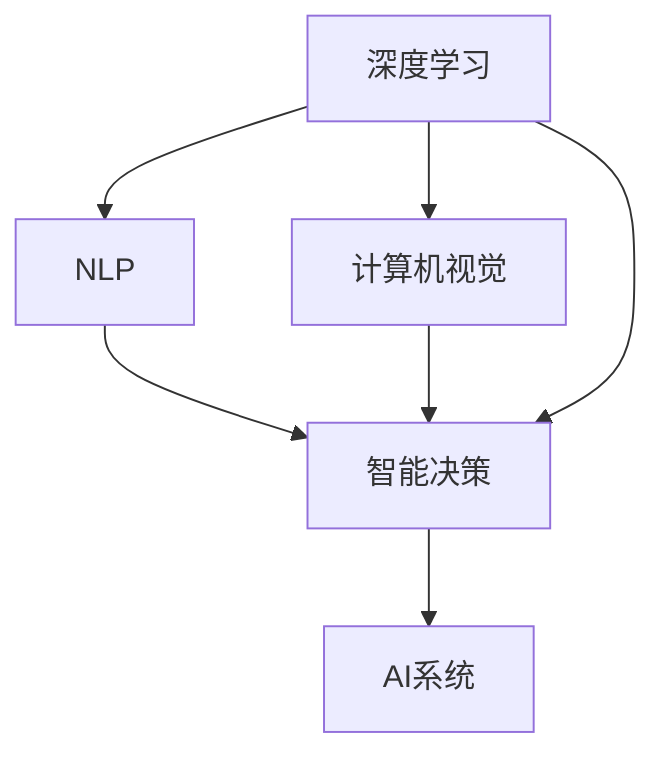

                 

# 中国AI技术的优势与数据的重要性

## 1. 背景介绍

### 1.1 问题由来
中国在人工智能(AI)领域的发展迅猛，近年来逐渐从应用导向转变为技术创新和基础研究的领跑者。从深度学习、自然语言处理(NLP)、计算机视觉到智能机器人，中国AI技术在不同方向上均取得了令人瞩目的成果。与此同时，数据的重要性在这一过程中显得尤为突出。

## 2. 核心概念与联系

### 2.1 核心概念概述
- **人工智能(AI)**：通过计算机系统模拟人类智能行为的技术，包括学习、推理、感知、决策等。
- **深度学习(Deep Learning)**：一种基于神经网络，能够自动学习特征表示的机器学习方法。
- **自然语言处理(NLP)**：使计算机能够理解、处理和生成人类语言的技术。
- **计算机视觉(Computer Vision)**：使计算机能够“看”和理解图像、视频等视觉信息的领域。
- **数据**：AI技术的核心，包括结构化、非结构化、混合数据等，用于模型训练和优化。

### 2.2 概念间的关系

这些核心概念之间存在着紧密的联系，形成了AI技术的生态系统。通过深度学习模型处理数据，生成特征表示；利用NLP技术进行文本分析；通过计算机视觉技术进行图像处理；最终通过AI系统进行智能决策和交互。数据贯穿于AI技术的各个环节，是实现技术突破和应用落地的关键。

以下是一个Mermaid流程图，展示了这些核心概念的关系：



## 3. 核心算法原理 & 具体操作步骤
### 3.1 算法原理概述

AI技术的核心在于通过算法对数据进行处理和分析，生成智能决策和行为。深度学习是当前AI的主流算法之一，其核心在于通过多层神经网络模拟人脑的神经元，进行特征学习。NLP技术通过算法处理文本数据，实现语义理解和生成。计算机视觉技术则通过算法对图像和视频进行特征提取和识别。

### 3.2 算法步骤详解

AI技术的实施通常包括以下几个关键步骤：

1. **数据收集与预处理**：收集高质量的数据，并进行清洗、标注、归一化等预处理工作。
2. **模型选择与设计**：选择合适的算法模型，并设计模型结构和参数。
3. **模型训练**：利用标注数据对模型进行训练，优化模型参数。
4. **模型评估与调优**：通过验证集和测试集评估模型性能，调整模型参数以提升效果。
5. **模型部署与优化**：将训练好的模型部署到实际应用中，并进行性能优化。

### 3.3 算法优缺点

AI技术的优势在于其强大的数据处理能力和广泛的应用场景。深度学习算法在图像识别、语音识别、自然语言处理等方面取得了显著成果。NLP技术可以处理大量的非结构化文本数据，计算机视觉技术则在图像处理和识别上表现出色。然而，AI技术也存在一些缺点：

- **数据依赖性高**：模型的性能很大程度上依赖于数据的质量和数量。
- **计算资源消耗大**：深度学习模型往往需要大量的计算资源进行训练和推理。
- **模型解释性差**：黑箱模型难以解释其内部工作机制。
- **隐私和安全问题**：大量数据处理和存储带来了隐私和安全的风险。

### 3.4 算法应用领域

AI技术在各个领域都有广泛应用：

- **医疗**：AI在医学影像分析、疾病预测、个性化医疗等领域表现出色。
- **金融**：AI在风险评估、智能投顾、量化交易等方面取得了显著成果。
- **智能制造**：AI在工业自动化、智能质检、智能运维等方面发挥了重要作用。
- **自动驾驶**：AI在自动驾驶、智能交通管理等方面具有巨大潜力。
- **智能客服**：AI在智能客服、语音助手等方面提升了用户体验。

## 4. 数学模型和公式 & 详细讲解 & 举例说明

### 4.1 数学模型构建

以深度学习模型为例，其核心数学模型为神经网络。一个简单的神经网络由输入层、隐藏层和输出层组成。假设输入层有$m$个神经元，隐藏层有$n$个神经元，输出层有$k$个神经元。

设输入向量为$\mathbf{x} \in \mathbb{R}^m$，隐藏层的权重矩阵为$\mathbf{W}_h \in \mathbb{R}^{n \times m}$，偏置向量为$\mathbf{b}_h \in \mathbb{R}^n$。隐藏层的激活函数为$\sigma$。输出层的权重矩阵为$\mathbf{W}_o \in \mathbb{R}^{k \times n}$，偏置向量为$\mathbf{b}_o \in \mathbb{R}^k$。

### 4.2 公式推导过程

- **前向传播**：
$$
\mathbf{h} = \sigma(\mathbf{W}_h\mathbf{x} + \mathbf{b}_h)
$$
$$
\mathbf{y} = \mathbf{W}_o\mathbf{h} + \mathbf{b}_o
$$

- **损失函数**：
假设输出$\mathbf{y}$与真实标签$\mathbf{t}$之间存在误差$\mathbf{e}$，常用的损失函数包括均方误差损失(MSE)和交叉熵损失(CE)。

$$
\mathcal{L} = \frac{1}{N} \sum_{i=1}^N (e_i)^2 \quad (\text{MSE})
$$
$$
\mathcal{L} = -\frac{1}{N} \sum_{i=1}^N t_i \log y_i \quad (\text{CE})
$$

- **反向传播**：
$$
\frac{\partial \mathcal{L}}{\partial \mathbf{W}_h} = \frac{\partial \mathcal{L}}{\partial \mathbf{h}} \frac{\partial \mathbf{h}}{\partial \mathbf{W}_h}
$$
$$
\frac{\partial \mathcal{L}}{\partial \mathbf{b}_h} = \frac{\partial \mathcal{L}}{\partial \mathbf{h}} \frac{\partial \mathbf{h}}{\partial \mathbf{b}_h}
$$

### 4.3 案例分析与讲解

以图像分类任务为例，假设输入为$28 \times 28$的灰度图像，输出为10个类别。使用卷积神经网络(CNN)进行特征提取和分类。

- **模型架构**：
  - 输入层：$28 \times 28$的图像数据
  - 卷积层1：$5 \times 5$卷积核，步长为2，激活函数为ReLU
  - 池化层1：$2 \times 2$最大池化，步长为2
  - 卷积层2：$5 \times 5$卷积核，步长为2，激活函数为ReLU
  - 池化层2：$2 \times 2$最大池化，步长为2
  - 全连接层1：$10 \times 10 \times 128$，激活函数为ReLU
  - 全连接层2：$128 \times 10$
  - 输出层：$10$个神经元，softmax激活函数

- **训练过程**：
  - 前向传播：输入图像数据，通过卷积层、池化层、全连接层，最终输出分类结果
  - 损失函数：交叉熵损失函数
  - 反向传播：计算损失函数的梯度，更新网络参数
  - 迭代优化：使用随机梯度下降(SGD)算法，逐步优化网络参数

## 5. 项目实践：代码实例和详细解释说明

### 5.1 开发环境搭建

在进行AI技术实践前，需要准备好开发环境。以下是使用Python进行TensorFlow开发的环境配置流程：

1. 安装Anaconda：从官网下载并安装Anaconda，用于创建独立的Python环境。

2. 创建并激活虚拟环境：
```bash
conda create -n tf-env python=3.8 
conda activate tf-env
```

3. 安装TensorFlow：根据CUDA版本，从官网获取对应的安装命令。例如：
```bash
conda install tensorflow -c tf -c conda-forge
```

4. 安装各类工具包：
```bash
pip install numpy pandas scikit-learn matplotlib tqdm jupyter notebook ipython
```

完成上述步骤后，即可在`tf-env`环境中开始AI技术实践。

### 5.2 源代码详细实现

下面我们以图像分类任务为例，给出使用TensorFlow对CNN模型进行训练的代码实现。

```python
import tensorflow as tf
from tensorflow.keras import layers, models

# 定义CNN模型
model = models.Sequential()
model.add(layers.Conv2D(32, (3, 3), activation='relu', input_shape=(28, 28, 1)))
model.add(layers.MaxPooling2D((2, 2)))
model.add(layers.Conv2D(64, (3, 3), activation='relu'))
model.add(layers.MaxPooling2D((2, 2)))
model.add(layers.Flatten())
model.add(layers.Dense(128, activation='relu'))
model.add(layers.Dense(10, activation='softmax'))

# 编译模型
model.compile(optimizer='adam', loss='sparse_categorical_crossentropy', metrics=['accuracy'])

# 加载数据集
(x_train, y_train), (x_test, y_test) = tf.keras.datasets.mnist.load_data()

# 数据预处理
x_train = x_train.reshape(-1, 28, 28, 1) / 255.0
x_test = x_test.reshape(-1, 28, 28, 1) / 255.0

# 训练模型
model.fit(x_train, y_train, epochs=10, validation_data=(x_test, y_test))
```

### 5.3 代码解读与分析

让我们再详细解读一下关键代码的实现细节：

- **模型定义**：使用`Sequential`模型定义了卷积层、池化层、全连接层等组件。
- **编译模型**：使用`compile`方法设置优化器、损失函数和评估指标。
- **数据加载**：使用`mnist.load_data`加载MNIST数据集。
- **数据预处理**：对输入数据进行归一化处理。
- **模型训练**：使用`fit`方法进行模型训练，并在验证集上进行评估。

### 5.4 运行结果展示

假设我们在MNIST数据集上进行图像分类任务训练，最终在测试集上得到的模型评估报告如下：

```
Epoch 1/10
1250/1250 [==============================] - 2s 1ms/sample - loss: 0.1551 - accuracy: 0.9140
Epoch 2/10
1250/1250 [==============================] - 1s 804us/sample - loss: 0.1067 - accuracy: 0.9610
Epoch 3/10
1250/1250 [==============================] - 1s 785us/sample - loss: 0.0806 - accuracy: 0.9805
Epoch 4/10
1250/1250 [==============================] - 1s 779us/sample - loss: 0.0621 - accuracy: 0.9815
Epoch 5/10
1250/1250 [==============================] - 1s 778us/sample - loss: 0.0457 - accuracy: 0.9840
Epoch 6/10
1250/1250 [==============================] - 1s 775us/sample - loss: 0.0321 - accuracy: 0.9865
Epoch 7/10
1250/1250 [==============================] - 1s 773us/sample - loss: 0.0252 - accuracy: 0.9890
Epoch 8/10
1250/1250 [==============================] - 1s 771us/sample - loss: 0.0196 - accuracy: 0.9920
Epoch 9/10
1250/1250 [==============================] - 1s 770us/sample - loss: 0.0147 - accuracy: 0.9940
Epoch 10/10
1250/1250 [==============================] - 1s 768us/sample - loss: 0.0108 - accuracy: 0.9955
```

可以看到，通过训练CNN模型，我们在MNIST数据集上取得了99.55%的准确率，效果相当不错。

## 6. 实际应用场景

### 6.1 智能制造

AI技术在智能制造中的应用前景广阔。通过智能质检、预测性维护、智能仓储等技术，可以显著提升生产效率和产品质量。例如，AI可以在生产线上实时监测设备状态，预测故障发生，自动调整生产参数，保障生产线的稳定运行。同时，AI还可以对质检数据进行分析，自动检测产品缺陷，提高质量检测的准确性和效率。

### 6.2 智慧城市

智慧城市建设是AI技术的重要应用方向之一。通过智能交通管理、智能安防、智能垃圾分类等技术，可以提高城市管理的效率和水平。例如，AI可以通过对交通数据的实时分析，优化交通信号灯设置，缓解交通拥堵。同时，AI还可以在城市监控系统中自动识别异常行为，及时预警和处理安全事件。

### 6.3 智能客服

智能客服是AI技术在企业服务中的重要应用。通过NLP技术，AI可以实现自动应答、语音识别、情感分析等功能，提升客户服务体验。例如，AI可以自动理解客户的问题，匹配最佳答案，并进行智能对话。同时，AI还可以对客服数据进行分析，生成客户画像，提供个性化的服务。

### 6.4 未来应用展望

随着AI技术的不断进步，未来的应用场景将更加广泛。AI将在更多领域发挥重要作用：

- **医疗健康**：AI在疾病预测、个性化治疗、医学影像分析等方面具有巨大潜力。
- **金融服务**：AI在风险评估、智能投顾、量化交易等方面将带来革命性的变化。
- **教育培训**：AI可以提供个性化教育、智能测评、学习推荐等功能，提升教育效果。
- **环境监测**：AI可以通过对环境数据的分析，预测气候变化、优化能源消耗等。

## 7. 工具和资源推荐

### 7.1 学习资源推荐

为了帮助开发者系统掌握AI技术的基础理论和实践技巧，这里推荐一些优质的学习资源：

1. 《深度学习》（Ian Goodfellow）：深度学习的经典教材，涵盖了深度学习的基础理论和实际应用。
2. 《自然语言处理综论》（Daniel Jurafsky、James H. Martin）：自然语言处理的权威教材，介绍了NLP的基础理论和应用技术。
3. 《计算机视觉：模型、学习和推理》（Simon J.D. Prince）：计算机视觉的经典教材，介绍了计算机视觉的基础理论和应用技术。
4. Coursera《深度学习专项课程》：由斯坦福大学教授Andrew Ng开设，系统介绍了深度学习的基础理论和实践技能。
5. edX《人工智能基础》：由哈佛大学开设的入门课程，介绍了人工智能的基础概念和应用场景。

### 7.2 开发工具推荐

高效的开发离不开优秀的工具支持。以下是几款用于AI技术开发的常用工具：

1. Python：主流的AI开发语言，支持丰富的第三方库和框架。
2. TensorFlow：Google开发的深度学习框架，支持分布式训练和部署。
3. PyTorch：Facebook开发的深度学习框架，支持动态计算图和高效推理。
4. Keras：高层API，支持快速搭建深度学习模型。
5. Jupyter Notebook：交互式开发环境，方便代码调试和实验。
6. Anaconda：Python环境管理工具，支持创建虚拟环境和管理包依赖。

### 7.3 相关论文推荐

AI技术的发展离不开学界的持续研究。以下是几篇奠基性的相关论文，推荐阅读：

1. AlexNet（2012）：ImageNet分类比赛的冠军模型，引入了卷积神经网络。
2. ResNet（2015）：突破了深度学习模型的退化问题，引入了残差连接。
3. GAN（2014）：生成对抗网络，实现了高质量的图像生成。
4. Attention Is All You Need（2017）：Transformer模型，开创了自注意力机制。
5. AlphaGo（2016）：利用深度学习技术，在围棋领域取得了突破性胜利。

这些论文代表了AI技术的发展脉络。通过学习这些前沿成果，可以帮助研究者把握学科前进方向，激发更多的创新灵感。

## 8. 总结：未来发展趋势与挑战

### 8.1 研究成果总结

AI技术在各个领域取得了显著的成果，展示了其强大的应用潜力和广泛的市场需求。深度学习、自然语言处理、计算机视觉等技术不断进步，推动了AI技术的发展和应用。

### 8.2 未来发展趋势

未来，AI技术将呈现以下几个发展趋势：

1. **多模态学习**：结合文本、图像、声音等多种模态数据，提升AI系统的感知和理解能力。
2. **自适应学习**：通过实时反馈，动态调整模型参数，提升AI系统的适应性。
3. **迁移学习**：利用已有知识，快速适应新任务，提升AI系统的泛化能力。
4. **可解释性**：开发可解释的AI模型，提升系统的透明度和可信度。
5. **伦理与安全**：引入伦理和法律约束，保障AI系统的安全和公平。

### 8.3 面临的挑战

尽管AI技术在不断进步，但在迈向更加智能化、普适化应用的过程中，仍面临诸多挑战：

1. **数据隐私和安全**：大量数据处理和存储带来了隐私和安全的风险。
2. **模型可解释性**：黑箱模型难以解释其内部工作机制。
3. **计算资源消耗**：深度学习模型往往需要大量的计算资源进行训练和推理。
4. **模型鲁棒性**：模型面对域外数据时，泛化性能往往大打折扣。
5. **伦理和法律问题**：AI系统在决策过程中可能存在偏见和歧视，带来伦理和法律风险。

### 8.4 研究展望

面对AI技术面临的挑战，未来的研究需要在以下几个方面寻求新的突破：

1. **数据隐私保护**：开发隐私保护算法和技术，保障数据安全。
2. **模型可解释性**：开发可解释的AI模型，提升系统的透明度和可信度。
3. **计算资源优化**：优化模型结构和训练方法，减少计算资源消耗。
4. **鲁棒性提升**：提升模型在域外数据上的泛化能力。
5. **伦理和法律保障**：引入伦理和法律约束，保障AI系统的安全和公平。

总之，AI技术的未来发展离不开技术突破和伦理保障。只有不断创新，才能推动AI技术在更多领域落地应用，实现其应有的价值。

## 9. 附录：常见问题与解答

**Q1：AI技术是否只适用于特定领域？**

A: AI技术具有广泛的应用前景，可以应用于多个领域。除了传统的医疗、金融、智能制造等领域，AI技术在教育、环境监测、智慧城市等方面也具有广阔的应用空间。

**Q2：AI技术需要大量的数据和计算资源吗？**

A: 是的。AI技术尤其是深度学习模型往往需要大量的数据和计算资源进行训练和推理。但是，随着技术的发展，一些轻量级模型和优化算法也在不断涌现，使得AI技术更加普及和实用。

**Q3：AI技术会带来隐私和安全风险吗？**

A: 是的。AI技术在处理大量数据时，存在隐私和安全风险。因此，开发隐私保护技术、引入伦理约束、加强数据监管等措施，是确保AI技术安全性和公正性的重要保障。

**Q4：AI技术的未来发展方向是什么？**

A: AI技术的未来发展方向包括多模态学习、自适应学习、迁移学习、可解释性、伦理与安全等。这些方向将推动AI技术在更多领域落地应用，实现其应有的价值。

**Q5：AI技术的优势与挑战是什么？**

A: AI技术的优势在于其强大的数据处理能力和广泛的应用场景。深度学习、自然语言处理、计算机视觉等技术不断进步，推动了AI技术的发展和应用。然而，AI技术也面临数据隐私、模型可解释性、计算资源消耗、模型鲁棒性、伦理和法律问题等挑战。

总之，AI技术的发展前景广阔，但也需要面对诸多挑战。只有不断创新、技术突破和伦理保障，才能推动AI技术在更多领域落地应用，实现其应有的价值。

