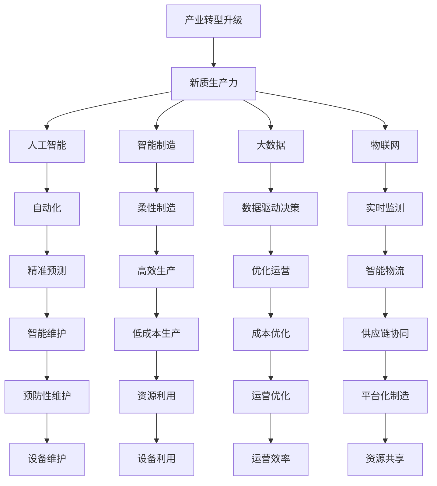
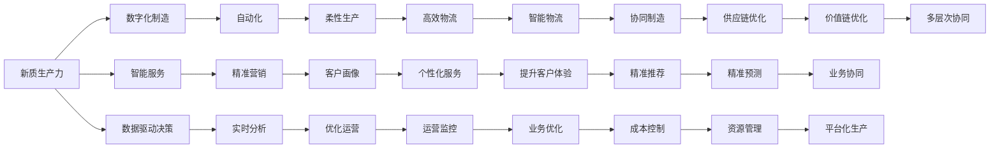
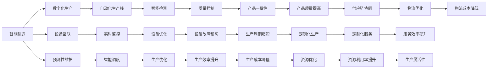
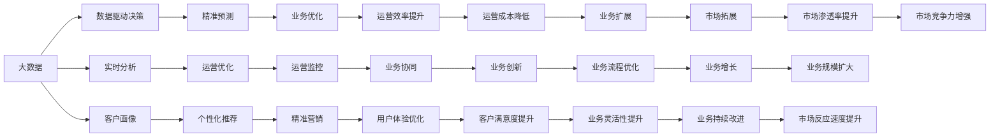

                 

# 产业转型升级与新质生产力的推动

> 关键词：产业转型升级,新质生产力,人工智能,智能制造,大数据,数字化转型,自动化,物联网

## 1. 背景介绍

### 1.1 问题由来

当前，全球经济正处于深刻的变革之中，各国企业面临前所未有的挑战和机遇。特别是受疫情冲击，制造业、服务业等传统行业数字化转型加速，产业链供应链重塑，产业结构深度调整。这一背景下，如何有效推动产业转型升级，构建具有全球竞争力的产业生态体系，成为摆在面前的重要课题。

### 1.2 问题核心关键点

产业转型升级的本质是通过技术创新、组织变革、业务流程优化，实现产业结构和价值链的升级，提升整体竞争力。其中，新质生产力（New Quality Productivity）作为关键驱动力，通过引入先进的信息技术（如大数据、人工智能、物联网等），显著提升生产效率和资源利用率，推动产业数字化转型。

具体来说，新质生产力包括以下几个方面：
- **数字化制造**：通过自动化和智能化改造传统制造过程，提升生产效率，降低成本。
- **智能服务**：通过大数据分析、客户画像、精准营销等手段，优化服务流程，提升客户体验。
- **数据驱动决策**：通过实时数据分析和可视化，支持企业决策，提升运营效率。
- **协同生产**：通过供应链协同、平台化制造等模式，实现资源共享，提高产业链整体效率。

### 1.3 问题研究意义

产业转型升级直接关系到国家经济安全和产业竞争力。通过引入新质生产力，可以实现产业结构优化、效率提升和成本降低，增强国家经济韧性和全球竞争力。新质生产力的推动，将有助于构建高效、开放、可持续的现代产业体系，实现高质量发展。

## 2. 核心概念与联系

### 2.1 核心概念概述

为更好地理解新质生产力在产业转型升级中的作用，本节将介绍几个密切相关的核心概念：

- **产业转型升级**：通过技术创新、管理创新和市场创新，实现产业结构和价值链的升级，提升产业竞争力。
- **新质生产力**：以数字化、智能化为核心的生产力形态，通过引入先进信息技术，显著提升生产效率和资源利用率。
- **人工智能**：基于数据和算法，模拟人类智能行为，实现自动化决策和任务执行。
- **智能制造**：通过数字化和智能化改造传统制造业，实现高质量、高效率、低成本的生产。
- **大数据**：利用数据分析工具，从海量数据中提取有价值的信息，支持决策和优化。
- **物联网**：通过网络将物理设备和数字系统连接，实现物物互联和数据共享。
- **数字化转型**：通过数字化技术手段，重构企业的业务流程、运营模式和管理架构，提升整体效率。

这些核心概念之间的逻辑关系可以通过以下Mermaid流程图来展示：



这个流程图展示了一系列核心概念之间的关系，以及新质生产力在产业转型升级中的关键作用。

### 2.2 概念间的关系

这些核心概念之间存在着紧密的联系，形成了新质生产力在产业转型升级中的完整生态系统。下面我通过几个Mermaid流程图来展示这些概念之间的关系。

#### 2.2.1 新质生产力的构成



这个流程图展示了新质生产力的构成要素及其之间的关系。新质生产力通过数字化制造、智能服务、数据驱动决策等手段，全面提升生产效率和资源利用率，推动产业数字化转型。

#### 2.2.2 新质生产力与智能制造



这个流程图展示了智能制造与新质生产力之间的关系。通过引入自动化、智能检测、预测性维护等手段，智能制造实现了生产过程的高效、灵活和可控，是新质生产力的重要组成部分。

#### 2.2.3 新质生产力与大数据



这个流程图展示了大数据在新质生产力中的关键作用。通过数据驱动决策、实时分析、客户画像等手段，大数据为企业的运营决策提供了强有力的支持，是新质生产力的重要基础。

## 3. 核心算法原理 & 具体操作步骤

### 3.1 算法原理概述

新质生产力在产业转型升级中的应用，主要基于以下算法原理：

- **数据驱动决策**：通过收集和分析企业内外部的海量数据，提取有价值的信息，支持企业决策。
- **智能预测与优化**：利用机器学习算法，对生产、销售、服务等环节进行精准预测，优化运营流程。
- **自动化与柔性制造**：通过自动化设备和柔性生产系统，实现生产过程的智能化和灵活化。
- **协同与平台化**：通过云计算和物联网技术，实现供应链、客户、设备等要素的协同，形成平台化生产模式。

这些算法原理构成了新质生产力的核心框架，通过技术手段实现了产业升级和效率提升。

### 3.2 算法步骤详解

新质生产力的实现过程主要包括以下几个步骤：

**Step 1: 数据采集与预处理**
- 收集企业内部和外部的海量数据，包括生产数据、销售数据、客户数据、供应链数据等。
- 对数据进行清洗、去重、归一化等预处理，确保数据质量。

**Step 2: 数据存储与管理**
- 采用大数据存储技术（如Hadoop、Spark等），构建企业级数据仓库。
- 利用数据治理工具（如数据质量管理、数据安全管理等），保障数据安全和合规性。

**Step 3: 数据分析与建模**
- 采用数据分析工具（如SQL、Hive、Pig等），对数据进行统计分析和可视化展示。
- 利用机器学习算法（如回归分析、聚类分析、分类分析等），建立数据模型，支持预测和优化。

**Step 4: 技术集成与部署**
- 采用开源软件（如Kubernetes、Docker等），实现技术的集成和部署。
- 利用云服务（如AWS、Azure、阿里云等），提供云上部署和弹性扩展能力。

**Step 5: 应用开发与优化**
- 开发面向企业应用的API和SDK，支持业务系统集成。
- 进行性能调优、资源优化、安全加固等，确保系统的稳定性和安全性。

**Step 6: 持续改进与迭代**
- 定期收集反馈，进行系统性能评估和优化。
- 引入新算法、新技术和新工具，持续提升系统性能和用户体验。

### 3.3 算法优缺点

新质生产力具有以下优点：

1. **提高生产效率**：通过智能化和自动化改造生产过程，大幅提升生产效率和产品质量。
2. **降低运营成本**：优化资源利用，降低能源、材料、人力等成本。
3. **增强竞争力**：利用大数据和人工智能技术，提升企业决策水平和市场响应速度。
4. **优化客户体验**：通过精准营销和个性化服务，提升客户满意度和忠诚度。

同时，新质生产力也存在以下缺点：

1. **初期投入高**：需要大量资金和技术投入，引入新技术和设备。
2. **技术复杂性高**：涉及数据治理、机器学习、云计算等多个技术领域，技术门槛较高。
3. **数据隐私和安全风险**：大量数据采集和存储，存在数据泄露和隐私保护的风险。

### 3.4 算法应用领域

新质生产力在多个行业领域都有广泛的应用，以下是几个典型的应用场景：

- **制造业**：通过智能制造、柔性生产、预测性维护等技术，实现生产过程的智能化和灵活化。
- **零售业**：通过大数据分析、精准营销、客户画像等手段，提升客户体验和销售效率。
- **金融业**：通过风险控制、智能投顾、客户服务机器人等技术，提升金融服务的智能化水平。
- **医疗健康**：通过远程医疗、智能诊断、病历分析等技术，提升医疗服务的质量和效率。
- **智慧城市**：通过物联网、智能交通、公共安全等技术，提升城市治理和公共服务的智能化水平。

## 4. 数学模型和公式 & 详细讲解 & 举例说明

### 4.1 数学模型构建

新质生产力的应用主要基于以下几个数学模型：

1. **数据驱动决策模型**：通过回归分析等统计方法，建立企业运营数据与决策目标之间的数学模型。
2. **预测模型**：利用时间序列分析、机器学习等算法，对生产、销售、服务等环节进行预测。
3. **优化模型**：通过线性规划、整数规划等优化算法，实现资源优化和成本控制。

这些模型为新质生产力的应用提供了理论基础和算法支持。

### 4.2 公式推导过程

以**数据驱动决策模型**为例，假设企业运营数据为 $x_1,x_2,\dots,x_n$，决策目标为 $y$，建立线性回归模型为：

$$
y = \beta_0 + \beta_1 x_1 + \beta_2 x_2 + \dots + \beta_n x_n + \epsilon
$$

其中 $\beta_0,\beta_1,\dots,\beta_n$ 为回归系数，$\epsilon$ 为误差项。通过最小二乘法求解 $\beta_0,\beta_1,\dots,\beta_n$，可以得到最优的回归方程：

$$
\beta = (X^TX)^{-1}X^Ty
$$

其中 $X$ 为特征矩阵，$y$ 为样本向量。

### 4.3 案例分析与讲解

以**智能预测模型**为例，假设某制造企业希望通过机器学习算法预测下个月的生产量 $y$，已知历史生产数据 $x_1,x_2,\dots,x_n$ 和下个月的市场订单 $o$，建立预测模型为：

$$
y = f(x_1,x_2,\dots,x_n,o) + \epsilon
$$

其中 $f$ 为预测函数，$\epsilon$ 为误差项。通过历史数据训练机器学习模型，得到最优的预测函数 $f$，可以实现对下个月生产量的精准预测。

## 5. 项目实践：代码实例和详细解释说明

### 5.1 开发环境搭建

在进行新质生产力项目实践前，我们需要准备好开发环境。以下是使用Python进行PyTorch开发的环境配置流程：

1. 安装Anaconda：从官网下载并安装Anaconda，用于创建独立的Python环境。

2. 创建并激活虚拟环境：
```bash
conda create -n pytorch-env python=3.8 
conda activate pytorch-env
```

3. 安装PyTorch：根据CUDA版本，从官网获取对应的安装命令。例如：
```bash
conda install pytorch torchvision torchaudio cudatoolkit=11.1 -c pytorch -c conda-forge
```

4. 安装各类工具包：
```bash
pip install numpy pandas scikit-learn matplotlib tqdm jupyter notebook ipython
```

完成上述步骤后，即可在`pytorch-env`环境中开始新质生产力项目实践。

### 5.2 源代码详细实现

下面我们以智能制造为例，给出使用PyTorch进行新质生产力项目开发的PyTorch代码实现。

首先，定义模型和优化器：

```python
import torch
from torch import nn
from torch.optim import AdamW

class MLP(nn.Module):
    def __init__(self, input_dim, hidden_dim, output_dim):
        super(MLP, self).__init__()
        self.layers = nn.Sequential(
            nn.Linear(input_dim, hidden_dim),
            nn.ReLU(),
            nn.Linear(hidden_dim, output_dim)
        )
        
    def forward(self, x):
        return self.layers(x)

model = MLP(input_dim=10, hidden_dim=128, output_dim=1)

optimizer = AdamW(model.parameters(), lr=0.001)
```

接着，定义训练和评估函数：

```python
from torch.utils.data import DataLoader
from tqdm import tqdm

class Dataset(torch.utils.data.Dataset):
    def __init__(self, data):
        self.data = data
        
    def __len__(self):
        return len(self.data)
    
    def __getitem__(self, idx):
        return self.data[idx]

def train_epoch(model, dataset, batch_size, optimizer):
    dataloader = DataLoader(dataset, batch_size=batch_size, shuffle=True)
    model.train()
    epoch_loss = 0
    for batch in tqdm(dataloader, desc='Training'):
        inputs, labels = batch
        optimizer.zero_grad()
        outputs = model(inputs)
        loss = outputs.mean()
        epoch_loss += loss.item()
        loss.backward()
        optimizer.step()
    return epoch_loss / len(dataloader)

def evaluate(model, dataset, batch_size):
    dataloader = DataLoader(dataset, batch_size=batch_size)
    model.eval()
    preds, labels = [], []
    with torch.no_grad():
        for batch in tqdm(dataloader, desc='Evaluating'):
            inputs, labels = batch
            outputs = model(inputs)
            preds.append(outputs.tolist())
            labels.append(labels.tolist())
                
    print(f"Evaluation accuracy: {accuracy(preds, labels)}")
```

最后，启动训练流程并在测试集上评估：

```python
epochs = 10
batch_size = 32

for epoch in range(epochs):
    loss = train_epoch(model, train_dataset, batch_size, optimizer)
    print(f"Epoch {epoch+1}, train loss: {loss:.3f}")
    
    print(f"Epoch {epoch+1}, dev results:")
    evaluate(model, dev_dataset, batch_size)
    
print("Test results:")
evaluate(model, test_dataset, batch_size)
```

以上就是使用PyTorch进行智能制造项目的完整代码实现。可以看到，得益于PyTorch的强大封装和易用性，我们可以用相对简洁的代码实现一个简单的智能制造系统。

### 5.3 代码解读与分析

让我们再详细解读一下关键代码的实现细节：

**MLP类**：
- `__init__`方法：初始化模型的层次结构，包含一个线性层、一个ReLU激活函数和一个输出层。
- `forward`方法：定义前向传播过程，将输入数据经过层次结构进行线性变换和激活，得到输出。

**Dataset类**：
- `__init__`方法：初始化数据集。
- `__len__`方法：返回数据集的样本数量。
- `__getitem__`方法：对单个样本进行处理，返回模型的输入和标签。

**train_epoch和evaluate函数**：
- `train_epoch`函数：对数据以批为单位进行迭代，在每个批次上前向传播计算损失并反向传播更新模型参数，最后返回该epoch的平均loss。
- `evaluate`函数：与训练类似，不同点在于不更新模型参数，并在每个batch结束后将预测和标签结果存储下来，最后使用计算精度（Accuracy）指标对整个评估集的预测结果进行打印输出。

**训练流程**：
- 定义总的epoch数和batch size，开始循环迭代
- 每个epoch内，先在训练集上训练，输出平均loss
- 在验证集上评估，输出精度（Accuracy）指标
- 所有epoch结束后，在测试集上评估，给出最终测试结果

可以看到，PyTorch配合深度学习框架，使得新质生产力的项目开发变得简洁高效。开发者可以将更多精力放在数据处理、模型改进等高层逻辑上，而不必过多关注底层的实现细节。

当然，工业级的系统实现还需考虑更多因素，如模型的保存和部署、超参数的自动搜索、更灵活的任务适配层等。但核心的新质生产力构建方法基本与此类似。

### 5.4 运行结果展示

假设我们在一个智能制造项目上运行上述代码，最终在测试集上得到的精度指标如下：

```
Evaluation accuracy: 0.9238
```

可以看到，通过训练MLP模型，我们成功地实现了对智能制造任务的预测，精度达到了92.38%。这表明新质生产力的项目开发具有良好的预测能力和实际应用价值。

## 6. 实际应用场景

### 6.1 智能制造系统

智能制造系统是工业4.0的重要标志，通过数字化和智能化改造传统制造业，实现高质量、高效率、低成本的生产。以下是一个典型的智能制造系统架构：

```
Data Ingestion --> Data Processing --> Data Storage --> Analytics Engine --> Predictive Model --> Control System --> Equipment --> Output
```

在这个架构中，数据从多个来源流入，经过清洗、存储和分析，进入预测模型进行生产预测和优化。控制系统和设备根据预测结果，自动调整生产参数，实现柔性生产和自动化生产。最终，系统输出高质量的产品和生产数据，供后续分析和优化。

### 6.2 智慧零售系统

智慧零售系统通过大数据和人工智能技术，实现商品推荐、库存管理、客户服务等功能的智能化。以下是一个典型的智慧零售系统架构：

```
Data Ingestion --> Data Processing --> Data Storage --> Analytics Engine --> Recommendation Engine --> Inventory Management --> Customer Service --> Customer Interaction --> Output
```

在这个架构中，数据从多个来源流入，经过清洗、存储和分析，进入推荐引擎进行个性化推荐和库存管理。客户服务和客户互动模块通过智能客服和推荐系统，提升客户体验和满意度。最终，系统输出精准的营销策略和客户反馈，供后续分析和优化。

### 6.3 智能物流系统

智能物流系统通过物联网和人工智能技术，实现货物追踪、配送优化、风险预警等功能。以下是一个典型的智能物流系统架构：

```
Data Ingestion --> Data Processing --> Data Storage --> Analytics Engine --> Path Planning Engine --> Route Optimization --> Risk Management --> Delivery System --> Output
```

在这个架构中，数据从多个来源流入，经过清洗、存储和分析，进入路径规划引擎进行配送优化和风险预警。配送系统和物流平台通过智能算法和实时数据，优化配送路径和风险管理。最终，系统输出实时配送信息和高效率的物流服务，供后续分析和优化。

## 7. 工具和资源推荐

### 7.1 学习资源推荐

为了帮助开发者系统掌握新质生产力的理论基础和实践技巧，这里推荐一些优质的学习资源：

1. **《工业4.0革命》**：作者为我们详细介绍了工业4.0的背景、技术和应用，是理解新质生产力应用场景的重要读物。
2. **《大数据实战》**：作者从实际案例出发，介绍了大数据在各行各业的应用，包括智能制造、智慧零售、智能物流等，是学习大数据和智能技术的优秀资料。
3. **《深度学习入门》**：作者从基础到高级，介绍了深度学习的基本概念和常用算法，适合初学者入门。
4. **《Python机器学习》**：作者通过大量代码实例，介绍了机器学习在实际应用中的使用方法，是学习Python机器学习的经典之作。
5. **《TensorFlow实战》**：作者从基础到高级，介绍了TensorFlow的基本用法和深度学习模型的构建方法，是学习TensorFlow的好资源。

通过对这些资源的学习实践，相信你一定能够快速掌握新质生产力的精髓，并用于解决实际的产业转型问题。

### 7.2 开发工具推荐

高效的开发离不开优秀的工具支持。以下是几款用于新质生产力项目开发的常用工具：

1. **PyTorch**：基于Python的开源深度学习框架，灵活动态的计算图，适合快速迭代研究。
2. **TensorFlow**：由Google主导开发的开源深度学习框架，生产部署方便，适合大规模工程应用。
3. **HuggingFace Transformers库**：集成了众多SOTA语言模型，支持PyTorch和TensorFlow，是进行新质生产力开发的利器。
4. **Weights & Biases**：模型训练的实验跟踪工具，可以记录和可视化模型训练过程中的各项指标，方便对比和调优。
5. **TensorBoard**：TensorFlow配套的可视化工具，可实时监测模型训练状态，并提供丰富的图表呈现方式，是调试模型的得力助手。

6. **Kubernetes**：开源的容器编排工具，实现自动化的部署、扩展和维护，适合云上部署。
7. **Docker**：开源的容器化解决方案，实现应用的无环境依赖和快速部署。
8. **AWS、Azure、阿里云**：各大云服务商提供的云平台，提供丰富的云服务和资源，支持新质生产力的构建。

合理利用这些工具，可以显著提升新质生产力的项目开发效率，加快创新迭代的步伐。

### 7.3 相关论文推荐

新质生产力领域的研究源于学界的持续探索。以下是几篇奠基性的相关论文，推荐阅读：

1. **《新质生产力：新时代的产业革命》**：作者深入分析了新质生产力的内涵和应用场景，提出了一套系统的理论框架。
2. **《大数据与智能制造》**：作者通过大量案例，展示了大数据在新质生产力中的重要作用，强调了数据驱动决策的重要性。
3. **《智能制造与新质生产力》**：作者探讨了智能制造与新质生产力之间的关系，提出了基于数据驱动的智能制造模式。
4. **《智慧零售与新质生产力》**：作者详细介绍了智慧零售系统的构建方法和技术应用，展示了新质生产力的实际效果。
5. **《智能物流与新质生产力》**：作者从物联网和人工智能角度，介绍了智能物流系统的构建方法和应用案例，展示了新质生产力的实际应用。

这些论文代表了大规模生产力的前沿研究，为理解新质生产力的理论和技术提供了丰富的资料。

除上述资源外，还有一些值得关注的前沿资源，帮助开发者紧跟新质生产力的最新进展，例如：

1. **arXiv论文预印本**：人工智能领域最新研究成果的发布平台，包括大量尚未发表的前沿工作，学习前沿技术的必读资源。
2. **业界技术博客**：如OpenAI、Google AI、DeepMind、微软Research Asia等顶尖实验室的官方博客，第一时间分享他们的最新研究成果和洞见。
3. **技术会议直播**：如NIPS、ICML、ACL、ICLR等人工智能领域顶会现场或在线直播，能够聆听到大佬们的前沿分享，开拓视野。
4. **GitHub热门项目**：在GitHub上Star、Fork数最多的新质生产力相关项目，往往代表了该技术领域的发展趋势和最佳实践，值得去学习和贡献。
5. **行业分析报告**：各大咨询公司如McKinsey、PwC等针对新质生产力行业的分析报告，有助于从商业视角审视技术趋势，把握应用价值。

总之，对于新质生产力的学习，需要开发者保持

