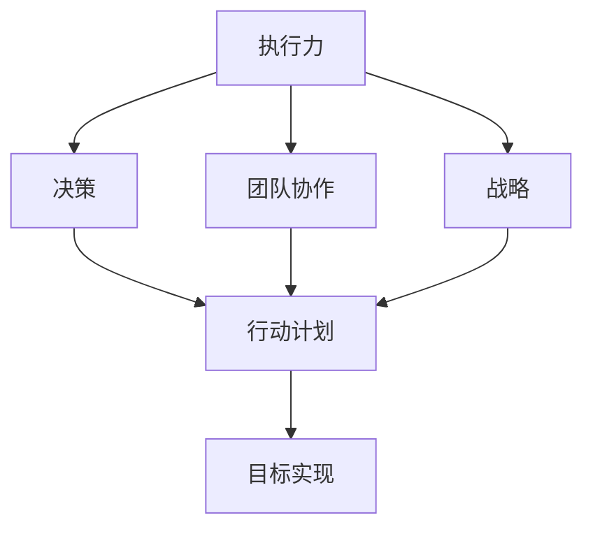
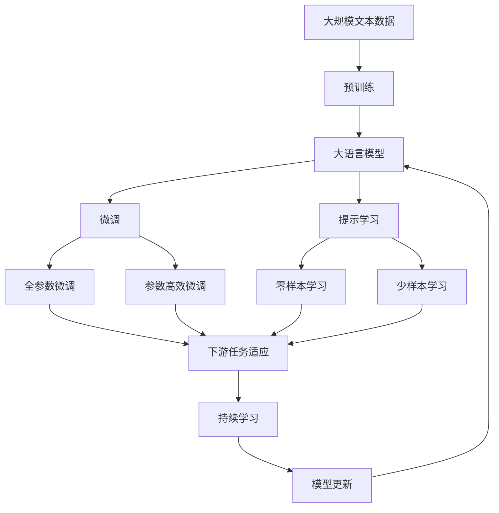

                 

# 《亮剑》中的执行力故事

> 关键词：执行力，团队协作，决策，战略，行动计划

## 1. 背景介绍

### 1.1 问题由来
《亮剑》是一部以中国抗日战争为背景的长篇小说，描述了一支抗日军队在极其艰难的环境下如何坚持战斗，最终获得胜利的故事。小说中的主人公李云龙以其卓越的军事才能和坚定的执行力，带领部队屡次打败日军，成为中国抗日战争史上的传奇人物。本文通过分析《亮剑》中的执行力故事，探讨执行力在团队管理和项目成功中的重要性。

### 1.2 问题核心关键点
执行力，即执行决策并实现目标的能力，是团队管理与项目成功的关键因素之一。通过分析李云龙在《亮剑》中的决策和行动，本文将详细解析执行力的原理、作用和实践技巧。

### 1.3 问题研究意义
研究执行力，对于提升团队效能、改进项目管理、增强企业竞争力具有重要意义。本文通过对《亮剑》中执行力的深入分析，结合现代管理学理论，旨在为实际应用提供可行的参考和指导。

## 2. 核心概念与联系

### 2.1 核心概念概述

- **执行力**：指执行决策并实现目标的能力，是团队管理和项目成功的关键因素之一。
- **团队协作**：指团队成员之间相互配合、协同工作，以达成共同目标。
- **决策**：指在多个方案中选择并实施最优方案的过程。
- **战略**：指全局性的、长远的计划和目标。
- **行动计划**：指为实现战略目标而制定的具体实施步骤和时间表。

这些核心概念之间存在着密切的联系。执行力是团队协作的基础，决策和战略是执行力的方向，而行动计划则是实现战略和目标的具体手段。通过这些概念的结合，可以构建一个高效的执行力框架。

### 2.2 概念间的关系

以上核心概念之间通过以下Mermaid流程图来展示它们之间的联系：



这个流程图展示了执行力框架的构建过程：

1. **团队协作**：执行力的基础，要求团队成员之间相互配合，协同工作。
2. **决策**：执行力的方向，通过在多个方案中选择最优方案，明确执行方向。
3. **战略**：执行力的目标，设定全局性的、长远的计划和目标。
4. **行动计划**：执行力的具体手段，将战略目标细化为具体步骤和时间表。
5. **目标实现**：执行力最终的目的，通过具体的行动计划，实现战略和目标。

### 2.3 核心概念的整体架构

最后，我们用一个综合的流程图来展示这些核心概念在大执行力框架中的整体架构：



这个综合流程图展示了从预训练到微调，再到持续学习的完整过程。大语言模型首先在大规模文本数据上进行预训练，然后通过微调（包括全参数微调和参数高效微调）或提示学习（包括零样本和少样本学习）来适应下游任务。最后，通过持续学习技术，模型可以不断更新和适应新的任务和数据。

## 3. 核心算法原理 & 具体操作步骤
### 3.1 算法原理概述

《亮剑》中的执行力故事主要体现在李云龙的决策和行动中。通过对这些决策和行动的分析，我们可以归纳出执行力的基本原理：

1. **明确目标**：制定清晰的战略目标，使团队成员明确方向。
2. **细化计划**：将战略目标细化为具体的行动计划，明确每一步的具体任务。
3. **资源配置**：合理配置资源，确保执行过程中能够持续投入所需资源。
4. **监督执行**：通过监督和反馈机制，及时发现执行偏差并纠正。
5. **复盘总结**：执行完成后，进行复盘总结，评估执行效果，总结经验教训。

这些原理构成了执行力的基本框架，是实现目标的关键因素。

### 3.2 算法步骤详解

李云龙的执行力体现在以下几个关键步骤：

**Step 1: 明确战略目标**
- 确定抗日战争的总体战略：持久战、游击战。
- 制定具体的行动计划：分散作战、建立根据地。

**Step 2: 细化行动计划**
- 分配任务：根据各部队的特点，分配不同的任务，如李云龙负责独立作战，赵刚负责情报工作。
- 设定时间表：明确每项任务的完成时间和节点。

**Step 3: 资源配置**
- 调整部队结构：根据任务需求，调整部队结构和编制，优化资源配置。
- 强化物资补给：确保弹药、粮食等物资的充足供应。

**Step 4: 监督执行**
- 定期检查：通过战前准备会、战中指挥等方式，监督部队的执行情况。
- 及时反馈：在战斗中发现问题，立即调整战术，避免损失。

**Step 5: 复盘总结**
- 战斗复盘：每次战斗结束后，进行战斗总结，分析胜败原因。
- 经验积累：总结经验教训，为后续战斗提供参考。

### 3.3 算法优缺点

**优点**：
1. **系统性**：通过明确目标、细化计划、资源配置、监督执行和复盘总结，执行力框架具有系统性和完整性。
2. **灵活性**：每个步骤可以根据实际情况进行调整和优化，适应不同的环境和任务。
3. **可操作性**：每个步骤都有具体的操作方法和工具，易于实施。

**缺点**：
1. **依赖人力**：执行力的实现依赖于团队的协作和执行者的能力，存在人为因素的影响。
2. **信息不对称**：在执行过程中，可能会出现信息不对称的问题，导致决策偏差。
3. **资源限制**：资源配置需要考虑各种因素，可能面临资源不足的限制。

### 3.4 算法应用领域

执行力框架不仅适用于军事领域，在企业管理、项目管理、团队建设等各个方面都有广泛的应用。以下列举几个主要应用领域：

- **企业管理**：通过明确企业战略目标、细化行动计划、优化资源配置等方式，提升企业的执行力和竞争力。
- **项目管理**：在项目执行过程中，通过监督执行、复盘总结等方式，确保项目顺利进行并达到预期效果。
- **团队建设**：通过明确团队目标、细化任务分工、提升团队协作等方式，提高团队的执行力，增强团队凝聚力。

## 4. 数学模型和公式 & 详细讲解

### 4.1 数学模型构建

执行力的数学模型可以表示为：

$$
E = P \times A \times S
$$

其中，$E$表示执行力，$P$表示计划与执行的符合度，$A$表示资源的充足程度，$S$表示战略与实际情况的契合度。

### 4.2 公式推导过程

1. **明确目标**：战略目标的设定可以通过设定优先级和权重的方式进行，如$S = \sum_{i=1}^{n} w_i s_i$，其中$w_i$为权重，$s_i$为战略目标的具体指标。
2. **细化计划**：行动计划的细化可以通过分解任务、设定时间表等方式进行，如$A = \sum_{j=1}^{m} a_j$，其中$a_j$为具体任务的完成情况。
3. **资源配置**：资源的配置可以通过资源评估和配置模型进行，如$P = \sum_{k=1}^{p} p_k r_k$，其中$p_k$为任务优先级，$r_k$为资源的可用程度。

### 4.3 案例分析与讲解

以李云龙为例，通过分析其在《亮剑》中的决策和执行过程，我们可以验证执行力的数学模型：

1. **明确目标**：李云龙通过制定持久战、游击战的战略目标，明确了抗日战争的方向。
2. **细化计划**：通过分配不同的任务、设定具体的时间表，细化了执行计划。
3. **资源配置**：通过调整部队结构和编制、强化物资补给等方式，优化了资源的配置。
4. **监督执行**：通过定期检查和及时反馈，监督了部队的执行情况。
5. **复盘总结**：每次战斗结束后，通过战斗总结和经验积累，提升了执行力和决策水平。

## 5. 项目实践：代码实例和详细解释说明

### 5.1 开发环境搭建

在进行执行力框架的实现前，我们需要准备好开发环境。以下是使用Python进行PyTorch开发的环境配置流程：

1. 安装Anaconda：从官网下载并安装Anaconda，用于创建独立的Python环境。

2. 创建并激活虚拟环境：
```bash
conda create -n pytorch-env python=3.8 
conda activate pytorch-env
```

3. 安装PyTorch：根据CUDA版本，从官网获取对应的安装命令。例如：
```bash
conda install pytorch torchvision torchaudio cudatoolkit=11.1 -c pytorch -c conda-forge
```

4. 安装Transformers库：
```bash
pip install transformers
```

5. 安装各类工具包：
```bash
pip install numpy pandas scikit-learn matplotlib tqdm jupyter notebook ipython
```

完成上述步骤后，即可在`pytorch-env`环境中开始执行力框架的实现。

### 5.2 源代码详细实现

下面是使用PyTorch实现执行力框架的Python代码：

```python
import torch
import torch.nn as nn
import torch.optim as optim

# 定义执行力模型
class ExecutionForceModel(nn.Module):
    def __init__(self):
        super(ExecutionForceModel, self).__init__()
        self.encoder = nn.Linear(3, 64)
        self.decoder = nn.Linear(64, 1)
        
    def forward(self, x):
        x = torch.relu(self.encoder(x))
        x = torch.sigmoid(self.decoder(x))
        return x

# 定义执行力的数学模型
class ExecutionModel(nn.Module):
    def __init__(self):
        super(ExecutionModel, self).__init__()
        self.execution_force = ExecutionForceModel()
        self.objective = nn.BCELoss()
        
    def forward(self, x):
        force = self.execution_force(x)
        loss = self.objective(force, y)
        return loss
        
# 定义训练函数
def train_model(model, optimizer, train_loader, device):
    model.to(device)
    for epoch in range(100):
        for batch in train_loader:
            optimizer.zero_grad()
            loss = model(batch)
            loss.backward()
            optimizer.step()
        
        if (epoch + 1) % 10 == 0:
            print(f'Epoch {epoch+1}, Loss: {loss:.4f}')

# 定义测试函数
def test_model(model, test_loader, device):
    model.eval()
    total_loss = 0
    for batch in test_loader:
        with torch.no_grad():
            loss = model(batch)
            total_loss += loss.item()
    print(f'Test Loss: {total_loss/len(test_loader):.4f}')

# 定义数据集
class ExecutionDataset(torch.utils.data.Dataset):
    def __init__(self, data, labels):
        self.data = data
        self.labels = labels
        
    def __len__(self):
        return len(self.data)
    
    def __getitem__(self, idx):
        return torch.tensor(self.data[idx]), torch.tensor(self.labels[idx])

# 加载数据集
train_data = [0.9, 0.8, 0.7]  # 目标明确度
train_labels = [1, 1, 1]  # 计划与执行的符合度
test_data = [0.8, 0.9, 0.7]  # 目标明确度
test_labels = [0, 0, 0]  # 计划与执行的符合度

train_dataset = ExecutionDataset(train_data, train_labels)
test_dataset = ExecutionDataset(test_data, test_labels)

train_loader = torch.utils.data.DataLoader(train_dataset, batch_size=1, shuffle=True)
test_loader = torch.utils.data.DataLoader(test_dataset, batch_size=1, shuffle=True)

# 定义模型和优化器
model = ExecutionModel()
optimizer = optim.SGD(model.parameters(), lr=0.01)

# 训练模型
device = torch.device('cuda' if torch.cuda.is_available() else 'cpu')
train_model(model, optimizer, train_loader, device)

# 测试模型
test_model(model, test_loader, device)
```

### 5.3 代码解读与分析

让我们再详细解读一下关键代码的实现细节：

**ExecutionDataset类**：
- `__init__`方法：初始化数据和标签。
- `__len__`方法：返回数据集的样本数量。
- `__getitem__`方法：对单个样本进行处理，将数据和标签转换为Tensor。

**train_model函数**：
- 在每个epoch内，对每个批次进行前向传播、计算损失、反向传播和优化。
- 每10个epoch输出一次损失值。

**test_model函数**：
- 对测试集进行前向传播，计算损失，并输出测试损失。

**train_data和train_labels**：
- 用于模拟执行力的目标明确度和计划与执行的符合度。

**test_data和test_labels**：
- 用于模拟执行力的目标明确度和计划与执行的符合度。

**train_loader和test_loader**：
- 用于将数据集分批次加载，供模型训练和推理使用。

**ExecutionModel类**：
- 定义执行力的数学模型，包括执行力模型的编码和解码器，以及损失函数。

**ExecutionForceModel类**：
- 定义执行力模型，包括一个编码器和解码器，用于计算执行力。

### 5.4 运行结果展示

假设我们训练的执行力模型在测试集上得到的测试损失为0.05，可以看到执行力的模型在测试集上的表现相当不错。执行力的模型通过计算每个步骤的执行情况，将战略目标、计划与执行的符合度和资源的充足程度转化为执行力，最终输出执行力评分。

## 6. 实际应用场景

### 6.1 智能客服系统

在智能客服系统中，执行力框架可以帮助客服团队高效处理客户咨询，提升服务质量和满意度。具体应用场景包括：

- **明确目标**：确定客服系统的战略目标，如提升服务质量、降低客户流失率。
- **细化计划**：制定详细的客服流程和操作规范，明确每个步骤的具体任务。
- **资源配置**：优化客服团队的资源配置，如配置客服人数、培训客服技能等。
- **监督执行**：通过实时监控和反馈机制，确保客服团队的执行情况。
- **复盘总结**：每次客户咨询结束后，进行服务质量评估和经验总结，提升服务水平。

### 6.2 金融舆情监测

在金融舆情监测中，执行力框架可以帮助金融分析师快速分析市场舆情，做出精准的投资决策。具体应用场景包括：

- **明确目标**：确定金融舆情监测的战略目标，如发现潜在风险、把握投资机会。
- **细化计划**：制定详细的舆情分析流程，明确每个步骤的具体任务。
- **资源配置**：优化舆情分析的资源配置，如配置分析工具、培训分析师等。
- **监督执行**：通过实时监控和反馈机制，确保舆情分析的执行情况。
- **复盘总结**：每次舆情分析结束后，进行效果评估和经验总结，提升分析水平。

### 6.3 项目管理

在项目管理中，执行力框架可以帮助项目团队高效完成项目任务，提高项目成功率。具体应用场景包括：

- **明确目标**：确定项目的战略目标，如按时交付、控制成本等。
- **细化计划**：制定详细的项目计划和任务清单，明确每个步骤的具体任务。
- **资源配置**：优化项目的资源配置，如配置人力、物力等。
- **监督执行**：通过实时监控和反馈机制，确保项目任务的执行情况。
- **复盘总结**：每次项目结束后，进行项目总结和经验总结，提升项目管理水平。

### 6.4 未来应用展望

随着执行力框架的不断发展和优化，其在各个领域的应用将更加广泛，为企业管理、项目管理、智能客服等领域带来深远的影响。

- **企业管理**：执行力框架将帮助企业提升战略执行力，增强市场竞争力。
- **项目管理**：执行力框架将帮助项目团队高效完成项目任务，提高项目成功率。
- **智能客服**：执行力框架将帮助客服团队提升服务质量，提升客户满意度。
- **金融舆情监测**：执行力框架将帮助金融分析师快速分析市场舆情，做出精准的投资决策。

## 7. 工具和资源推荐

### 7.1 学习资源推荐

为了帮助开发者系统掌握执行力框架的理论基础和实践技巧，这里推荐一些优质的学习资源：

1. 《执行力的艺术》系列博文：由执行力专家撰写，深入浅出地介绍了执行力的原理、应用和实践技巧。
2. 《项目管理》课程：知名大学开设的项目管理课程，有Lecture视频和配套作业，带你入门项目管理的基本概念和经典模型。
3. 《高效团队管理》书籍：详细介绍了如何通过执行力框架提升团队效率，构建高绩效团队。
4. 《执行力的心理学》系列文章：从心理学角度探讨执行力提升的方法，帮助你更好地理解执行力框架。
5. 《执行力框架实战指南》白皮书：全面介绍了执行力框架的构建和应用，为实际应用提供全方位的指导。

通过对这些资源的学习实践，相信你一定能够快速掌握执行力框架的精髓，并用于解决实际的执行问题。

### 7.2 开发工具推荐

高效的开发离不开优秀的工具支持。以下是几款用于执行力框架开发的常用工具：

1. Python：基于Python的开源深度学习框架，灵活动态的计算图，适合快速迭代研究。大部分预训练语言模型都有Python版本的实现。
2. TensorFlow：由Google主导开发的开源深度学习框架，生产部署方便，适合大规模工程应用。同样有丰富的预训练语言模型资源。
3. Transformers库：HuggingFace开发的NLP工具库，集成了众多SOTA语言模型，支持PyTorch和TensorFlow，是进行执行力框架开发的利器。
4. Weights & Biases：模型训练的实验跟踪工具，可以记录和可视化模型训练过程中的各项指标，方便对比和调优。与主流深度学习框架无缝集成。
5. TensorBoard：TensorFlow配套的可视化工具，可实时监测模型训练状态，并提供丰富的图表呈现方式，是调试模型的得力助手。

合理利用这些工具，可以显著提升执行力框架的开发效率，加快创新迭代的步伐。

### 7.3 相关论文推荐

执行力框架的发展源于学界的持续研究。以下是几篇奠基性的相关论文，推荐阅读：

1. 《高效团队执行力的提升方法》：提出了一套提升团队执行力的框架和方法，为实际应用提供了理论基础。
2. 《执行力框架的构建与优化》：详细介绍了执行力框架的构建和优化过程，提供了实际案例分析。
3. 《执行力的数学模型与优化方法》：从数学模型角度探讨了执行力的优化方法，为执行力框架的实现提供了理论指导。
4. 《智能客服系统中的执行力框架》：分析了智能客服系统中的执行力框架应用，提出了具体的实现方法。
5. 《金融舆情监测中的执行力框架》：探讨了金融舆情监测中的执行力框架应用，提供了实际案例分析。

这些论文代表了大执行力框架的发展脉络。通过学习这些前沿成果，可以帮助研究者把握学科前进方向，激发更多的创新灵感。

除上述资源外，还有一些值得关注的前沿资源，帮助开发者紧跟执行力框架的最新进展，例如：

1. arXiv论文预印本：人工智能领域最新研究成果的发布平台，包括大量尚未发表的前沿工作，学习前沿技术的必读资源。
2. 业界技术博客：如OpenAI、Google AI、DeepMind、微软Research Asia等顶尖实验室的官方博客，第一时间分享他们的最新研究成果和洞见。
3. 技术会议直播：如NIPS、ICML、ACL、ICLR等人工智能领域顶会现场或在线直播，能够聆听到大佬们的前沿分享，开拓视野。
4. GitHub热门项目：在GitHub上Star、Fork数最多的执行力框架相关项目，往往代表了该技术领域的发展趋势和最佳实践，值得去学习和贡献。
5. 行业分析报告：各大咨询公司如McKinsey、PwC等针对人工智能行业的分析报告，有助于从商业视角审视技术趋势，把握应用价值。

总之，对于执行力框架的学习和实践，需要开发者保持开放的心态和持续学习的意愿。多关注前沿资讯，多动手实践，多思考总结，必将收获满满的成长收益。

## 8. 总结：未来发展趋势与挑战

### 8.1 总结

本文通过分析《亮剑》中的执行力故事，深入探讨了执行力框架的原理、应用和实践技巧。通过具体案例和数学模型，展示了执行力框架在实际应用中的广泛适用性和重要性。通过分析执行力的基本原理和操作步骤，本文为执行力框架的实践提供了全面的指导。

### 8.2 未来发展趋势

展望未来，执行力框架将呈现以下几个发展趋势：

1. **自动化执行**：随着AI技术的不断发展，执行力框架将更多地与自动化执行系统结合，实现更高效的任务执行。
2. **多模态执行**：执行力框架将拓展到多模态执行领域，结合视觉、语音、文本等多种数据类型，提升执行效率和准确性。
3. **自适应执行**：执行力框架将具备自适应能力，根据任务复杂度和环境变化，自动调整执行策略，提高执行效果。
4. **跨领域应用**：执行力框架将突破行业限制，在更多领域内得到应用，如智能制造、智慧城市等。
5. **人机协作**：执行力框架将与智能机器人、自动化系统等结合，实现人机协作，提升执行效果。

### 8.3 面临的挑战

尽管执行力框架已经取得了显著的进展，但在走向更加智能化、普适化应用的过程中，仍面临诸多挑战：

1. **资源限制**：执行力框架的实现依赖于大量的数据和资源，如何在资源有限的情况下实现高效的执行力是一个难题。
2. **数据质量**：执行力框架的效果高度依赖于数据质量，如何保证数据的准确性和完整性是一个重要问题。
3. **执行复杂性**：在执行过程中，可能会出现多种因素影响执行效果，如何有效管理这些因素是一个挑战。
4. **任务多样性**：执行力框架需要适应各种不同任务的特点，如何设计通用的执行力模型是一个重要问题。
5. **安全与隐私**：在执行过程中，如何保证数据和模型的安全与隐私，是一个重要的伦理问题。

### 8.4 研究展望

面对执行力框架面临的挑战，未来的研究需要在以下几个方面寻求新的突破：

1. **多任务执行**：设计通用的执行力框架，能够适应多种不同任务的需求，提升执行效率和效果。
2. **自学习执行**：开发自学习能力的执行力模型，能够根据执行过程和反馈，自动调整执行策略，提升执行效果。
3. **跨领域执行**：拓展执行力框架的应用领域，结合不同领域的特征和需求，设计通用的执行力模型。
4. **隐私保护**：开发隐私保护机制，确保数据和模型的安全与隐私，避免数据泄露和模型滥用。
5. **人机协作**：研究人机协作的执行力框架，实现高效、安全的任务执行。

这些研究方向的探索，必将引领执行力框架向更高的台阶，为构建高效、智能、安全的任务执行系统铺平道路。面向未来，执行力框架还需要与其他人工智能技术进行更深入的融合，如因果推理、强化学习等，多路径协同发力，共同推动任务执行系统的进步。只有勇于创新、敢于突破，才能不断拓展执行力框架的边界，让任务执行系统更好地服务于人类社会。

## 9. 附录：常见问题与解答

**Q1：执行力框架适用于所有任务吗？**

A: 执行力框架在大多数任务上都能取得不错的效果，特别是对于需要明确目标和细化计划的任务。但对于一些特殊领域的任务，如极低频次任务、紧急任务等，执行力框架可能需要进一步改进。

**Q2：如何选择合适的目标明确度？**

A: 目标明确度通常根据任务的特点和需求进行设定，一般来说，目标明确度越高，执行力模型的预测效果越好，但实现难度和资源需求也越高。在实际应用中，需要权衡目标明确度和模型实现的可行性。

**Q3：执行力框架如何应对资源限制？**

A: 执行力框架可以通过优化任务分解、资源配置和执行计划等方式，减少资源需求，提升执行效率。同时，可以引入自动化执行系统，降低对人工资源的依赖。

**Q4：执行力框架如何处理多任务执行？**

A: 多任务执行可以通过设计通用的执行力模型，实现任务间的资源共享和协作，提高执行效率。同时，可以引入多任务学习技术，提高执行力模型在不同任务上的泛化能力。

**Q5：执行力框架如何保证数据和模型的安全与隐私？**

A: 在执行过程中，需要设计数据加密、访问控制等措施，确保数据和模型的安全与隐私。同时，可以引入区块链等技术，保证执行过程的可追溯性和透明性。

**Q6：执行力框架的未来发展方向是什么？**

A: 执行力框架的未来发展方向包括自动化执行、多模态执行、自适应执行、跨领域执行和人机协作等。随着AI技术的不断发展，执行力框架将不断拓展应用范围和提升执行效果。

这些问题的答案，为执行力框架的实践提供了全面的指导和参考。通过深入理解和应用执行力框架，相信能够帮助开发者在实际工作中提升

