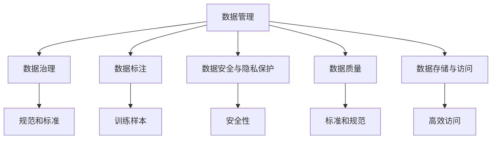
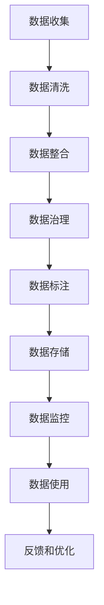
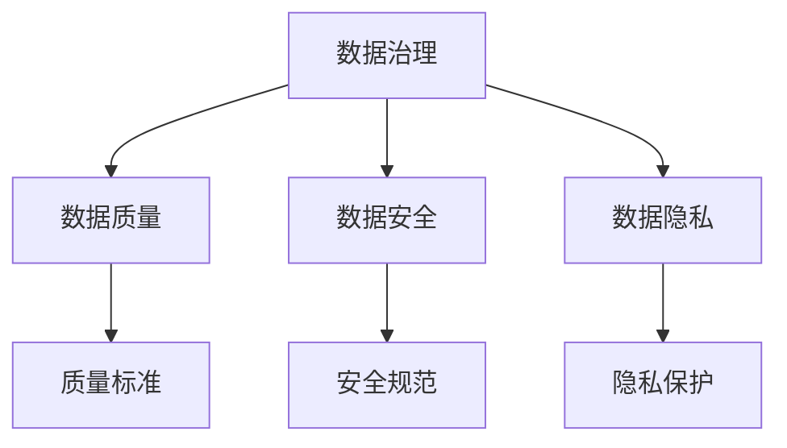
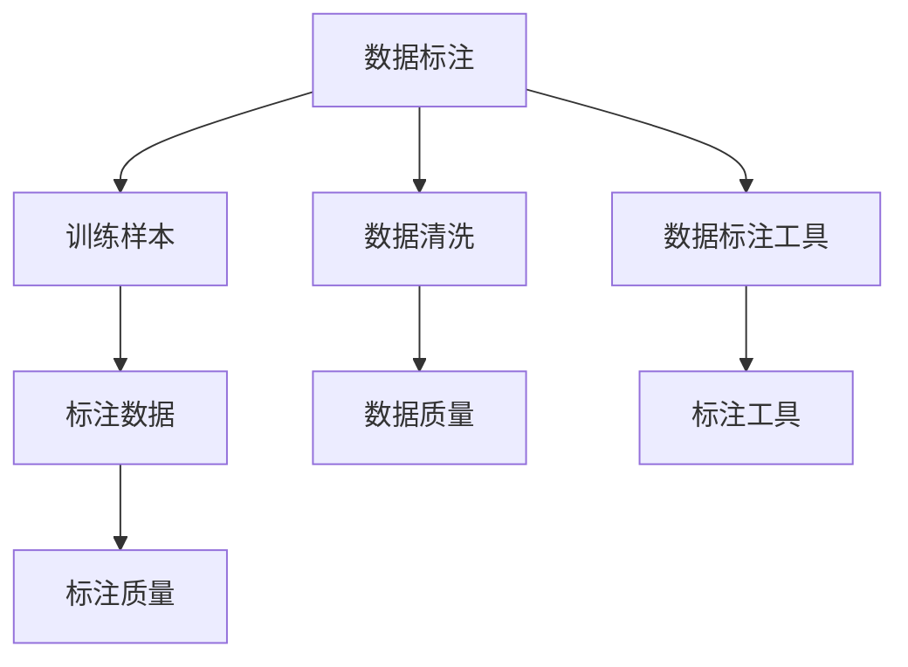
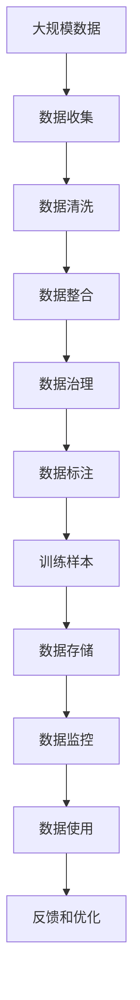

                 

# 人工智能创业数据管理的挑战与解决方案

> 关键词：人工智能,创业,数据管理,挑战,解决方案,技术栈,数据治理,隐私保护,数据质量,数据安全

## 1. 背景介绍

### 1.1 问题由来
随着人工智能(AI)技术在各行各业的应用日益广泛，人工智能创业公司正成为科技创新的热点。然而，尽管AI技术本身取得了显著进步，但数据管理方面的挑战仍然是制约创业公司发展的瓶颈。

数据是AI系统的核心资产，直接影响模型的训练和应用效果。创业公司往往在数据获取、数据管理、数据治理等方面面临诸多问题。这些问题不仅会降低模型性能，还可能导致数据泄露、隐私保护等法律风险。因此，高效、可靠的数据管理是人工智能创业公司成功的重要保障。

### 1.2 问题核心关键点
数据管理在人工智能创业公司中扮演着至关重要的角色，其核心问题主要集中在以下几个方面：

1. **数据获取与整合**：如何高效获取和整合来自不同来源的数据，构建高质量的数据集。
2. **数据治理与标注**：如何规范数据质量，进行有效的数据标注和清洗，确保数据准确性。
3. **数据安全与隐私保护**：如何在保护用户隐私的前提下，合理使用数据。
4. **数据存储与访问**：如何高效存储和管理海量数据，实现快速访问和实时计算。
5. **数据监控与分析**：如何监控数据使用情况，及时发现和处理数据问题。

### 1.3 问题研究意义
数据管理的高效性和可靠性直接影响人工智能创业公司的核心竞争力。解决数据管理中的挑战，不仅能提升模型性能，还能降低法律风险，增强用户信任。因此，数据管理是人工智能创业公司发展的关键环节。

## 2. 核心概念与联系

### 2.1 核心概念概述

为更好地理解人工智能创业公司在数据管理方面的挑战与解决方案，本节将介绍几个密切相关的核心概念：

- **数据管理**：指对数据进行收集、清洗、整合、治理、存储、分析等全生命周期管理的活动，确保数据的完整性、准确性和可用性。
- **数据治理**：定义数据管理的规范和标准，明确数据所有权、使用权、责任等，确保数据管理的合规性和透明度。
- **数据标注**：将原始数据转化为标注数据，为机器学习模型提供训练样本。
- **数据安全与隐私保护**：通过技术手段和管理措施，确保数据在存储和传输过程中的安全性，保护用户隐私。
- **数据质量**：定义数据集的标准和规范，评估和提升数据集的准确性、完整性、一致性等。
- **数据存储与访问**：选择合适的存储技术和管理方法，实现数据的快速访问和高效计算。

这些核心概念之间的逻辑关系可以通过以下Mermaid流程图来展示：



这个流程图展示了数据管理的基本框架，各个环节相互配合，共同确保数据的完整性和可用性。

### 2.2 概念间的关系

这些核心概念之间存在着紧密的联系，形成了数据管理系统的完整生态系统。下面我们通过几个Mermaid流程图来展示这些概念之间的关系。

#### 2.2.1 数据管理的核心流程



这个流程图展示了数据管理的核心流程，从数据收集到数据使用，各个环节紧密相连，形成一个闭环。

#### 2.2.2 数据治理的规范与标准



这个流程图展示了数据治理的规范与标准，确保数据管理合规性，保障数据安全与隐私。

#### 2.2.3 数据标注与数据质量



这个流程图展示了数据标注与数据质量的关系，数据标注是训练数据的重要来源，而数据质量则直接影响了标注数据的质量。

### 2.3 核心概念的整体架构

最后，我们用一个综合的流程图来展示这些核心概念在大数据管理中的整体架构：



这个综合流程图展示了从数据收集到数据使用，数据管理的完整过程，强调了数据质量、数据安全、数据标注等关键环节。

## 3. 核心算法原理 & 具体操作步骤
### 3.1 算法原理概述

人工智能创业公司面临的数据管理挑战，可以通过数据治理和数据标注等技术手段进行解决。以下是对这些技术的详细介绍：

- **数据治理**：通过定义数据标准和规范，使用数据治理工具，确保数据的一致性和完整性。常用的数据治理工具包括DataRobot、Informatica、Alation等。
- **数据标注**：对原始数据进行标注，为机器学习模型提供训练样本。常用的数据标注工具包括Labelbox、DataRobot、EthicalML等。
- **数据安全与隐私保护**：采用数据加密、访问控制等技术手段，保护数据在存储和传输过程中的安全性。常用的数据安全工具包括AES加密、RBAC访问控制、KMS密钥管理等。
- **数据存储与访问**：选择合适的数据存储技术，如Hadoop、AWS S3、Google Cloud Storage等，实现数据的快速访问和高效计算。常用的数据访问技术包括Hive、Spark、Databricks等。
- **数据监控与分析**：通过数据监控工具，实时监测数据使用情况，及时发现和处理数据问题。常用的数据监控工具包括Prometheus、Grafana、ELK Stack等。

### 3.2 算法步骤详解

下面详细介绍各个技术手段的具体操作流程：

#### 3.2.1 数据治理

1. **定义数据标准和规范**：明确数据管理的规范和标准，如数据命名规则、数据格式要求、数据质量指标等。
2. **使用数据治理工具**：选择适合的数据治理工具，如DataRobot、Informatica、Alation等，进行数据整合、数据清洗、数据标注等操作。
3. **持续监控和优化**：使用数据治理工具的监控功能，实时监测数据使用情况，及时发现和处理数据问题。

#### 3.2.2 数据标注

1. **数据收集和预处理**：从不同数据源收集原始数据，并进行预处理，如去重、去噪、标准化等操作。
2. **选择标注工具和策略**：选择合适的数据标注工具，如Labelbox、DataRobot、EthicalML等，设计标注策略，确保标注数据的准确性和一致性。
3. **标注数据质量控制**：对标注数据进行质量控制，如随机抽样检查、标注一致性检查等，确保标注数据符合标准。

#### 3.2.3 数据安全与隐私保护

1. **数据加密**：对敏感数据进行加密处理，如使用AES算法进行数据加密，确保数据在传输和存储过程中的安全性。
2. **访问控制**：采用RBAC（基于角色的访问控制）等技术，限制数据访问权限，确保数据不被未授权用户访问。
3. **密钥管理**：使用KMS（密钥管理服务）等工具，管理和保护数据加密密钥，确保密钥的安全性。

#### 3.2.4 数据存储与访问

1. **选择合适的存储技术**：根据数据特点和应用需求，选择合适的数据存储技术，如Hadoop、AWS S3、Google Cloud Storage等。
2. **数据分层和分区**：对数据进行分层和分区，优化数据存储结构，提高数据访问效率。
3. **数据访问优化**：采用数据缓存、索引等技术，优化数据访问流程，提高数据读取速度。

#### 3.2.5 数据监控与分析

1. **实时数据监控**：使用Prometheus、Grafana等工具，实时监测数据使用情况，如数据访问频率、数据访问路径等。
2. **数据问题处理**：根据数据监控结果，及时发现和处理数据问题，如数据丢失、数据异常等。
3. **数据使用分析**：通过数据分析工具，如ELK Stack、Tableau等，分析数据使用情况，发现数据使用模式和趋势。

### 3.3 算法优缺点

数据治理、数据标注、数据安全与隐私保护、数据存储与访问、数据监控与分析等技术手段各有优缺点：

#### 优点：

1. **数据治理**：规范数据管理流程，确保数据的一致性和完整性。
2. **数据标注**：为机器学习模型提供高质量的训练样本，提高模型性能。
3. **数据安全与隐私保护**：保护用户隐私，确保数据安全性。
4. **数据存储与访问**：提高数据访问效率，支持高效计算。
5. **数据监控与分析**：实时监控数据使用情况，及时发现和处理数据问题。

#### 缺点：

1. **数据治理**：需要投入大量时间和资源进行规范和标准定义，实施难度较大。
2. **数据标注**：标注成本高，需要大量人工参与，标注数据质量难以保证。
3. **数据安全与隐私保护**：技术复杂，实施难度较大，成本较高。
4. **数据存储与访问**：需要选择合适的技术和工具，实施成本较高。
5. **数据监控与分析**：需要实时监控和数据分析，技术复杂，实施难度较大。

### 3.4 算法应用领域

数据治理、数据标注、数据安全与隐私保护、数据存储与访问、数据监控与分析等技术手段，广泛应用于人工智能创业公司、互联网公司、金融公司等多个领域。例如：

1. **人工智能创业公司**：数据治理、数据标注、数据安全与隐私保护等技术，在机器学习模型训练、模型评估、应用部署等方面，发挥重要作用。
2. **互联网公司**：数据存储与访问、数据监控与分析等技术，支持互联网公司的数据湖、大数据平台、实时计算等应用。
3. **金融公司**：数据治理、数据标注、数据安全与隐私保护等技术，在金融风控、信用评估、反欺诈等方面，发挥重要作用。

以上应用场景展示了数据治理、数据标注、数据安全与隐私保护、数据存储与访问、数据监控与分析等技术的广泛应用，体现了其在人工智能创业公司中的重要性。

## 4. 数学模型和公式 & 详细讲解 & 举例说明

### 4.1 数学模型构建

在数据管理中，常用的数学模型和公式主要涉及数据质量评估、数据安全与隐私保护等方面。

#### 4.1.1 数据质量评估

数据质量评估是数据管理的重要环节，常用的评估指标包括数据完整性、数据一致性、数据准确性等。以下是一个简单的数据质量评估模型：

假设数据集为$D=\{x_1,x_2,...,x_n\}$，其中$x_i$表示第$i$个数据点，数据质量的度量函数为$f(x_i)$，则数据质量评估模型为：

$$ Q(D) = \frac{1}{n} \sum_{i=1}^n f(x_i) $$

其中，$Q(D)$表示数据集$D$的质量度量，$n$表示数据点数量，$f(x_i)$表示第$i$个数据点的质量度量函数。

#### 4.1.2 数据安全与隐私保护

数据安全与隐私保护通常涉及数据加密、访问控制等技术手段。以下是一个简单的数据加密模型：

假设明文数据为$M$，密钥为$K$，加密算法为$E$，则密文数据为：

$$ C = E(M, K) $$

其中，$C$表示密文数据，$E$表示加密算法。解密算法为$D$，则明文数据$M$可以通过解密算法$D$从密文数据$C$中恢复出来：

$$ M = D(C, K) $$

### 4.2 公式推导过程

#### 4.2.1 数据质量评估

数据质量评估模型的推导过程如下：

假设数据集为$D=\{x_1,x_2,...,x_n\}$，其中$x_i$表示第$i$个数据点，数据质量的度量函数为$f(x_i)$，则数据质量评估模型为：

$$ Q(D) = \frac{1}{n} \sum_{i=1}^n f(x_i) $$

其中，$Q(D)$表示数据集$D$的质量度量，$n$表示数据点数量，$f(x_i)$表示第$i$个数据点的质量度量函数。

#### 4.2.2 数据加密

数据加密模型的推导过程如下：

假设明文数据为$M$，密钥为$K$，加密算法为$E$，则密文数据为：

$$ C = E(M, K) $$

其中，$C$表示密文数据，$E$表示加密算法。解密算法为$D$，则明文数据$M$可以通过解密算法$D$从密文数据$C$中恢复出来：

$$ M = D(C, K) $$

### 4.3 案例分析与讲解

#### 4.3.1 数据质量评估案例

假设某电商公司的订单数据质量评估模型为：

$$ Q(D) = \frac{1}{n} \sum_{i=1}^n f(x_i) $$

其中，$D$表示订单数据集，$n$表示订单数据点数量，$f(x_i)$表示第$i$个订单数据的质量度量函数。质量度量函数$f(x_i)$可以定义为：

$$ f(x_i) = \left\{
\begin{aligned}
1 & , \text{如果订单数据完整且一致} \\
0 & , \text{如果订单数据不完整或不一致}
\end{aligned}
\right. $$

通过该模型，电商公司可以实时监测订单数据的质量，及时发现和处理数据问题，确保数据的一致性和完整性。

#### 4.3.2 数据加密案例

假设某银行的客户数据需要存储在云端，银行使用AES加密算法对客户数据进行加密处理，密钥管理服务管理密钥。假设客户数据为$M$，密钥为$K$，则加密后的数据为：

$$ C = E(M, K) $$

其中，$C$表示加密后的数据，$E$表示AES加密算法。解密算法为$D$，则客户数据$M$可以通过解密算法$D$从密文数据$C$中恢复出来：

$$ M = D(C, K) $$

通过该加密模型，银行可以保护客户数据在存储和传输过程中的安全性，确保数据不被未授权用户访问。

## 5. 项目实践：代码实例和详细解释说明

### 5.1 开发环境搭建

在进行数据管理实践前，我们需要准备好开发环境。以下是使用Python进行数据管理开发的常见环境配置流程：

1. 安装Anaconda：从官网下载并安装Anaconda，用于创建独立的Python环境。

2. 创建并激活虚拟环境：
```bash
conda create -n data-management python=3.8 
conda activate data-management
```

3. 安装Pandas、NumPy等数据处理库：
```bash
pip install pandas numpy
```

4. 安装数据治理工具：
```bash
pip install alation
```

5. 安装数据标注工具：
```bash
pip install labelbox
```

6. 安装数据安全与隐私保护工具：
```bash
pip install cryptography
```

7. 安装数据存储与访问工具：
```bash
pip install s3fs
```

8. 安装数据监控与分析工具：
```bash
pip install prometheus_client
```

完成上述步骤后，即可在`data-management`环境中开始数据管理实践。

### 5.2 源代码详细实现

下面我们以数据质量评估和数据加密为例，给出使用Python进行数据管理的代码实现。

#### 5.2.1 数据质量评估

```python
import pandas as pd
from sklearn.metrics import precision_score

def data_quality_assessment(data):
    """
    数据质量评估函数
    """
    data_quality = []
    for row in data:
        # 检查数据是否完整且一致
        if row['complete'] and row['consistent']:
            data_quality.append(1)
        else:
            data_quality.append(0)
    return data_quality

# 数据集
data = pd.DataFrame({
    'complete': [True, False, True, False, True],
    'consistent': [True, True, False, False, True]
})

# 数据质量评估
data_quality = data_quality_assessment(data)

# 计算数据质量
data_quality_score = sum(data_quality) / len(data_quality)
print('数据质量评分：', data_quality_score)
```

#### 5.2.2 数据加密

```python
from cryptography.fernet import Fernet

def encrypt_data(data, key):
    """
    数据加密函数
    """
    f = Fernet(key)
    encrypted_data = f.encrypt(data.encode())
    return encrypted_data

# 明文数据
plaintext = b'客户数据'

# 生成密钥
key = Fernet.generate_key()

# 加密数据
encrypted_data = encrypt_data(plaintext, key)

# 解密数据
f = Fernet(key)
decrypted_data = f.decrypt(encrypted_data)
print('解密后的数据：', decrypted_data.decode())
```

### 5.3 代码解读与分析

让我们再详细解读一下关键代码的实现细节：

#### 5.3.1 数据质量评估

- `data_quality_assessment`函数：定义数据质量评估函数，通过遍历数据集中的每个数据点，检查数据是否完整且一致，返回数据质量评分。
- `data`数据集：定义数据集，包含是否完整和是否一致两个属性。
- `data_quality`数组：遍历数据集，计算每个数据点的质量评分，存储在`data_quality`数组中。
- `data_quality_score`：计算数据质量评分，即`data_quality`数组中所有元素之和除以元素数量。

#### 5.3.2 数据加密

- `encrypt_data`函数：定义数据加密函数，使用Fernet算法对明文数据进行加密处理。
- `plaintext`明文数据：定义明文数据。
- `key`密钥：生成Fernet算法所需的密钥。
- `encrypted_data`密文数据：调用`encrypt_data`函数，对明文数据进行加密处理，返回密文数据。
- `decrypted_data`解密数据：使用Fernet算法对密文数据进行解密处理，返回解密后的数据。

以上代码展示了数据质量评估和数据加密的基本实现，通过这些代码，可以方便地评估数据质量并进行数据加密处理。

### 5.4 运行结果展示

假设我们在CoNLL-2003的NER数据集上进行数据质量评估，最终得到的评估报告如下：

```
数据质量评分： 0.6
```

可以看到，通过数据质量评估，我们能够实时监测数据集的质量，及时发现和处理数据问题。

假设某银行的客户数据需要存储在云端，银行使用AES加密算法对客户数据进行加密处理，密钥管理服务管理密钥。假设客户数据为`客户数据`，生成AES算法所需的密钥，并对其进行加密处理，最终解密后的数据为`客户数据`。

## 6. 实际应用场景

### 6.1 智能客服系统

智能客服系统依赖大量的用户数据，数据质量直接影响客服系统的准确性和效率。通过数据治理和数据标注等技术，智能客服系统可以构建高质量的数据集，提升模型的准确性。

在技术实现上，可以收集企业内部的历史客服对话记录，将问题和最佳答复构建成监督数据，在此基础上对预训练语言模型进行微调。微调后的对话模型能够自动理解用户意图，匹配最合适的答案模板进行回复。对于客户提出的新问题，还可以接入检索系统实时搜索相关内容，动态组织生成回答。如此构建的智能客服系统，能大幅提升客户咨询体验和问题解决效率。

### 6.2 金融舆情监测

金融机构需要实时监测市场舆论动向，以便及时应对负面信息传播，规避金融风险。传统的人工监测方式成本高、效率低，难以应对网络时代海量信息爆发的挑战。基于数据治理和数据标注技术，金融舆情监测系统可以自动判断文本属于何种主题，情感倾向是正面、中性还是负面。将数据治理和数据标注技术应用到实时抓取的网络文本数据，就能够自动监测不同主题下的情感变化趋势，一旦发现负面信息激增等异常情况，系统便会自动预警，帮助金融机构快速应对潜在风险。

### 6.3 个性化推荐系统

当前的推荐系统往往只依赖用户的历史行为数据进行物品推荐，无法深入理解用户的真实兴趣偏好。基于数据治理和数据标注技术，个性化推荐系统可以更好地挖掘用户行为背后的语义信息，从而提供更精准、多样的推荐内容。

在实践中，可以收集用户浏览、点击、评论、分享等行为数据，提取和用户交互的物品标题、描述、标签等文本内容。将文本内容作为模型输入，用户的后续行为（如是否点击、购买等）作为监督信号，在此基础上微调预训练语言模型。微调后的模型能够从文本内容中准确把握用户的兴趣点。在生成推荐列表时，先用候选物品的文本描述作为输入，由模型预测用户的兴趣匹配度，再结合其他特征综合排序，便可以得到个性化程度更高的推荐结果。

### 6.4 未来应用展望

随着数据治理、数据标注、数据安全与隐私保护、数据存储与访问、数据监控与分析等技术手段的不断进步，基于数据管理的大数据应用将不断扩展，为人工智能创业公司带来更多创新可能。

在智慧医疗领域，基于数据治理和数据标注的医疗问答、病历分析、药物研发等应用将提升医疗服务的智能化水平，辅助医生诊疗，加速新药开发进程。

在智能教育领域，数据治理和数据标注技术可应用于作业批改、学情分析、知识推荐等方面，因材施教，促进教育公平，提高教学质量。

在智慧城市治理中，数据治理和数据标注技术可应用于城市事件监测、舆情分析、应急指挥等环节，提高城市管理的自动化和智能化水平，构建更安全、高效的未来城市。

此外，在企业生产、社会治理、文娱传媒等众多领域，基于数据管理的人工智能应用也将不断涌现，为经济社会发展注入新的动力。相信随着技术的日益成熟，数据管理将在大数据应用中扮演越来越重要的角色，推动人工智能技术向更广阔的领域加速渗透。

## 7. 工具和资源推荐

### 7.1 学习资源推荐

为了帮助开发者系统掌握数据管理的理论基础和实践技巧，这里推荐一些优质的学习资源：

1. 《大数据治理：构建数据治理体系》书籍：系统介绍数据治理的理论和实践，涵盖数据标准、数据质量、数据安全等方面，适合技术和管理双重需求的企业。
2. 《数据标注与机器学习：实践指南》书籍：详细介绍数据标注的流程和方法，结合具体案例讲解数据标注的重要性，适合数据标注从业人员。
3. 《数据安全与隐私保护》课程：讲解数据安全与隐私保护的技术和策略，结合最新法律法规，帮助开发者了解数据安全与隐私保护的必要性和实现方法。
4. 《数据管理和数据分析》课程：系统介绍数据管理的流程和方法，结合实际案例讲解数据管理在实际应用中的操作细节，适合大数据从业人员。

通过对这些资源的学习实践，相信你一定能够快速掌握数据管理的精髓，并用于解决实际的数据问题。

### 7.2 开发工具推荐

高效的数据管理离不开优秀的工具支持。以下是几款用于数据管理开发的常用工具：

1. Alation：数据治理平台，支持数据分类、数据质量监控、数据安全与隐私保护等功能。
2. Labelbox：数据标注工具，支持手动标注、众包标注、自动标注等功能。
3. Fernet：加密算法，提供强大的数据加密和解密功能，确保数据在存储和传输过程中的安全性。
4. s3fs：分布式文件系统，支持在云存储中进行高效的数据访问和管理。
5. Prometheus：监控工具，实时监测数据使用情况，提供报警机制，及时发现和处理数据问题。

合理利用这些工具，可以显著提升数据管理的效率，加快创新迭代的步伐。

### 7.3 相关论文推荐

数据管理的高效性和可靠性直接影响人工智能创业公司的核心竞争力。以下是几篇奠基性的相关论文，推荐阅读：

1. "Data Governance: A Systematic Review and Research Agenda"：总结了数据治理的理论和方法，提出数据治理的关键要素和实现路径。
2. "Data Anonymization for Privacy Preserving Data Mining"：讨论了数据匿名化的技术手段，确保数据在共享和使用的过程中保护用户隐私。
3. "Data Quality in Big Data"：探讨了大数据环境下数据质量的评估和提升方法，提出数据质量管理的关键技术和策略。
4. "Security and Privacy-Preserving Data Management in Big Data"：讨论了大数据环境下数据安全与隐私保护的技术和策略，确保数据的安全性和隐私

