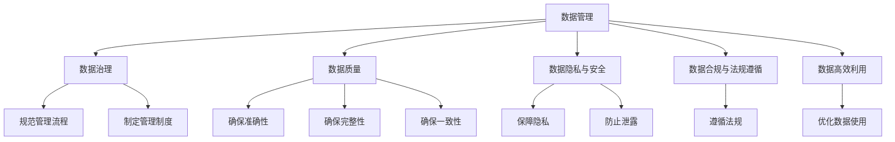
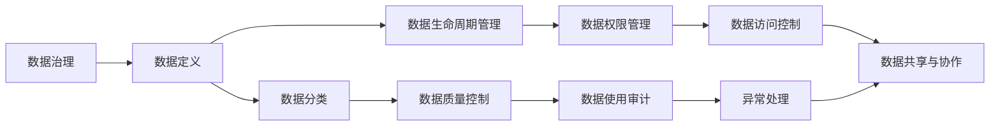
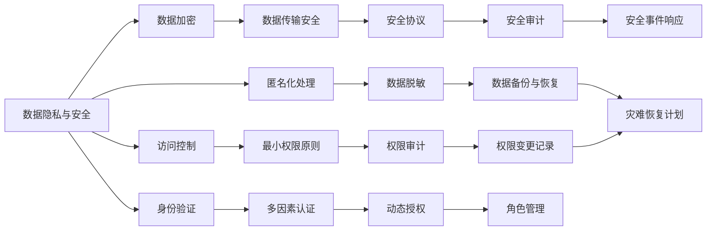
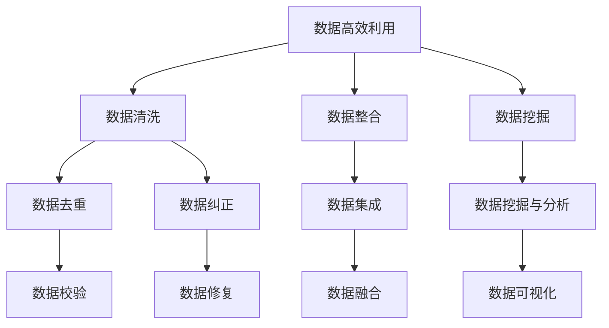
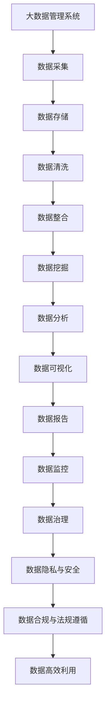

                 

# 人工智能创业数据管理的策略与措施分析

> 关键词：人工智能, 数据管理, 创业策略, 数据隐私, 数据安全, 数据治理

## 1. 背景介绍

### 1.1 问题由来
随着人工智能（AI）技术在各行各业的应用越来越深入，数据管理成为了创业公司走向成功的重要基石。然而，数据管理不仅仅是一个技术问题，更是一个复杂的策略问题。特别是在AI创业领域，高质量的数据对于模型训练和业务决策至关重要，但数据收集、存储、处理和保护过程中存在的各种挑战，也使得数据管理变得尤为复杂。因此，本文旨在深入探讨人工智能创业企业在数据管理中面临的关键策略和措施，帮助创业公司更好地应对数据管理的挑战，提升业务价值。

### 1.2 问题核心关键点
- **数据质量**：确保数据准确性、完整性和一致性，是AI模型训练的基础。
- **数据隐私与安全**：在数据收集和使用过程中，保障用户隐私，防止数据泄露。
- **数据治理**：制定规范化的数据管理流程和制度，确保数据的有序使用和控制。
- **数据高效利用**：通过数据整合、数据清洗等手段，提高数据利用率，优化AI模型性能。
- **数据合规与法规遵循**：遵守相关法律法规，保护用户数据权益。

### 1.3 问题研究意义
在人工智能创业领域，数据管理的重要性不言而喻。高质量的数据不仅直接影响AI模型的准确性和效率，还关系到用户隐私和合规性问题。因此，有效的数据管理策略，能够帮助创业公司建立竞争优势，降低风险，确保业务的健康发展。本文将系统性地分析数据管理的核心策略与措施，为AI创业公司提供实用的指南。

## 2. 核心概念与联系

### 2.1 核心概念概述

为更好地理解AI创业企业在数据管理中的策略与措施，本节将介绍几个关键概念：

- **数据管理**：指对数据的收集、存储、处理和保护的一系列活动，旨在确保数据的质量和可用性，同时保障数据隐私和安全。

- **数据治理**：一套规范化的管理流程和制度，旨在确保数据的准确性、完整性和一致性，防止数据滥用和泄露，并确保数据的使用符合法律法规。

- **数据质量**：指数据在准确性、完整性、一致性、及时性、唯一性和真实性方面的标准和质量。

- **数据隐私与安全**：在数据收集、存储、处理和传输过程中，保障用户隐私，防止数据泄露或被未授权访问。

- **数据合规与法规遵循**：遵循相关的法律法规，如GDPR、CCPA等，确保数据的使用符合法律规定，保护用户权益。

- **数据高效利用**：通过数据清洗、数据整合、数据挖掘等技术手段，最大化数据价值，提高数据利用效率。

这些核心概念之间的逻辑关系可以通过以下Mermaid流程图来展示：



这个流程图展示了大数据管理中各概念之间的关系：数据管理包含数据治理、数据质量、数据隐私与安全、数据合规与法规遵循、数据高效利用等方面，它们共同构成了一个完整的数据管理体系。通过理解这些核心概念，我们可以更好地把握数据管理的工作原理和优化方向。

### 2.2 概念间的关系

这些核心概念之间存在着紧密的联系，形成了数据管理策略与措施的完整生态系统。下面我们通过几个Mermaid流程图来展示这些概念之间的关系。

#### 2.2.1 数据治理的核心流程



这个流程图展示了数据治理的核心流程：从数据的定义、分类、生命周期管理，到数据质量控制、权限管理、使用审计和异常处理，数据治理确保了数据管理的规范化和可控性。

#### 2.2.2 数据隐私与安全的防护措施



这个流程图展示了数据隐私与安全的防护措施：从数据加密、访问控制、身份验证、匿名化处理，到数据传输安全、最小权限原则、权限审计、数据备份与恢复等，保障数据隐私和安全。

#### 2.2.3 数据高效利用的技术手段



这个流程图展示了数据高效利用的技术手段：从数据清洗、数据整合、数据挖掘，到数据去重、数据纠正、数据集成、数据挖掘与分析等，通过数据清洗和整合，最大化数据的利用效率。

### 2.3 核心概念的整体架构

最后，我们用一个综合的流程图来展示这些核心概念在大数据管理中的整体架构：



这个综合流程图展示了从数据采集、存储、清洗、整合、挖掘、分析、可视化、报告、监控、治理、隐私与安全、合规与法规遵循、高效利用等各环节的完整数据管理体系。通过这些流程图，我们可以更清晰地理解大数据管理过程中各个环节的相互关系和作用，为后续深入讨论具体的策略与措施奠定基础。

## 3. 核心算法原理 & 具体操作步骤
### 3.1 算法原理概述

基于数据管理的数据策略与措施，本质上是一个数据优化和保护的策略设计过程。其核心思想是：通过数据治理、数据隐私与安全、数据合规与法规遵循、数据高效利用等措施，确保数据的质量、隐私和安全，同时最大化数据的使用价值。

形式化地，假设我们有数据集 $D=\{(x_i, y_i)\}_{i=1}^N, x_i \in \mathcal{X}, y_i \in \mathcal{Y}$，其中 $\mathcal{X}$ 为输入空间，$\mathcal{Y}$ 为输出空间。数据管理的目标是通过一系列的优化算法，如数据清洗、数据整合、数据加密等，找到最优的数据管理策略 $\pi$，使得模型在目标任务 $T$ 上的性能最大化，即：

$$
\pi^* = \mathop{\arg\min}_{\pi} \mathcal{L}(\pi,D)
$$

其中 $\mathcal{L}$ 为针对任务 $T$ 设计的损失函数，用于衡量模型预测输出与真实标签之间的差异。常见的损失函数包括交叉熵损失、均方误差损失等。

通过梯度下降等优化算法，数据管理过程不断更新策略参数 $\pi$，最小化损失函数 $\mathcal{L}$，使得数据管理系统输出逼近最优策略 $\pi^*$。由于 $\pi$ 已经通过数据治理获得了较高的初始化，因此即便在小规模数据集 $D$ 上进行策略优化，也能较快收敛到理想的数据管理策略 $\pi^*$。

### 3.2 算法步骤详解

基于数据管理的数据策略与措施一般包括以下几个关键步骤：

**Step 1: 准备数据治理策略**
- 设计数据治理框架，包括数据定义、分类、生命周期管理、质量控制等。
- 制定数据治理政策，明确数据管理的责任、流程和监控机制。

**Step 2: 实施数据隐私与安全措施**
- 采用数据加密技术，保护数据在传输和存储过程中的隐私。
- 实施访问控制，确保只有授权用户和系统可以访问数据。
- 使用匿名化和去识别化技术，防止数据泄露和滥用。

**Step 3: 遵循数据合规与法规遵循**
- 评估数据管理策略是否符合相关法律法规，如GDPR、CCPA等。
- 制定数据合规政策，确保数据收集、存储、处理和使用符合法律法规。

**Step 4: 优化数据高效利用**
- 进行数据清洗，去除重复和错误的数据，提高数据质量。
- 进行数据整合，将不同来源和格式的数据统一，提升数据可用性。
- 利用数据挖掘和分析技术，发现数据中的潜在价值，提升数据利用效率。

**Step 5: 监控和评估数据管理效果**
- 定期监控数据管理系统的运行状态，及时发现和解决问题。
- 通过定期的审计和评估，衡量数据管理策略的效果，持续改进数据管理策略。

以上是基于数据管理的数据策略与措施的一般流程。在实际应用中，还需要针对具体数据管理问题，对策略与措施的各个环节进行优化设计，如改进数据清洗算法，引入更多的隐私保护技术，搜索最优的合规策略组合等，以进一步提升数据管理系统的性能。

### 3.3 算法优缺点

基于数据管理的数据策略与措施具有以下优点：
1. 系统性：通过制定规范化的数据治理策略，确保数据管理的规范化和可控性。
2. 安全性：通过加密和访问控制等措施，保障数据隐私和安全。
3. 合规性：确保数据管理策略符合法律法规，保护用户权益。
4. 高效性：通过数据清洗和整合，提高数据利用效率，优化AI模型性能。

同时，该方法也存在一定的局限性：
1. 数据治理成本高：设计和管理规范化的数据治理策略，需要大量的人力和时间成本。
2. 技术复杂度高：实施数据隐私和安全措施，需要高水平的技术支持。
3. 法规遵从复杂：不同国家和地区有不同的法律法规，需要灵活应对和遵循。
4. 数据流动性低：数据治理策略可能限制数据流动和共享，影响数据的使用效率。

尽管存在这些局限性，但就目前而言，基于数据管理的策略与措施仍是大数据管理的主流范式。未来相关研究的重点在于如何进一步降低数据治理和隐私保护的技术门槛，提高数据管理的灵活性和效率，同时兼顾合规性和安全性等因素。

### 3.4 算法应用领域

基于数据管理的数据策略与措施在多个领域已经得到了广泛的应用，例如：

- **金融行业**：金融机构需要处理大量的交易和用户数据，通过数据治理和隐私保护措施，确保数据安全，防止数据泄露和滥用。
- **医疗行业**：医疗行业涉及大量患者数据，通过数据清洗和整合，提高数据质量，提升医疗决策的准确性和效率。
- **零售行业**：零售行业需要收集和分析大量的消费者数据，通过数据挖掘和分析，提升销售和营销效果。
- **政府部门**：政府部门需要处理大量的公共数据，通过数据治理和合规性措施，确保数据公开透明，符合法律法规。
- **智能制造**：智能制造企业需要收集和分析大量的生产数据，通过数据清洗和整合，提升生产效率和质量。

除了上述这些经典应用外，大数据管理策略与措施还在更多场景中得到创新性的应用，如智能交通、智慧城市、环境保护等，为各个行业的数字化转型升级提供新的技术路径。随着数据管理技术的不断演进，相信大数据管理策略与措施将成为各行业数据驱动决策的重要手段，促进社会的智能化发展。

## 4. 数学模型和公式 & 详细讲解  
### 4.1 数学模型构建

本节将使用数学语言对基于数据管理的数据策略与措施进行更加严格的刻画。

假设我们有数据集 $D=\{(x_i, y_i)\}_{i=1}^N, x_i \in \mathcal{X}, y_i \in \mathcal{Y}$，其中 $\mathcal{X}$ 为输入空间，$\mathcal{Y}$ 为输出空间。数据管理的目标是通过一系列的优化算法，如数据清洗、数据整合、数据加密等，找到最优的数据管理策略 $\pi$，使得模型在目标任务 $T$ 上的性能最大化，即：

$$
\pi^* = \mathop{\arg\min}_{\pi} \mathcal{L}(\pi,D)
$$

其中 $\mathcal{L}$ 为针对任务 $T$ 设计的损失函数，用于衡量模型预测输出与真实标签之间的差异。常见的损失函数包括交叉熵损失、均方误差损失等。

通过梯度下降等优化算法，数据管理过程不断更新策略参数 $\pi$，最小化损失函数 $\mathcal{L}$，使得数据管理系统输出逼近最优策略 $\pi^*$。由于 $\pi$ 已经通过数据治理获得了较高的初始化，因此即便在小规模数据集 $D$ 上进行策略优化，也能较快收敛到理想的数据管理策略 $\pi^*$。

### 4.2 公式推导过程

以下我们以数据清洗为例，推导数据清洗的数学公式。

假设数据集中存在噪声和错误，记噪声为 $n$，错误为 $e$。则数据清洗的目标是去除噪声和错误，保留高质量的数据 $d$。数据清洗的数学模型为：

$$
d = f(x, \pi)
$$

其中 $f$ 为数据清洗函数，$\pi$ 为数据清洗策略。假设 $x$ 为原始数据，$n$ 为噪声，$e$ 为错误，则数据清洗的目标函数为：

$$
\min_{\pi} \sum_{i=1}^N (d_i - f(x_i, \pi))^2
$$

其中 $d_i$ 为清洗后的数据，$x_i$ 为原始数据，$n_i$ 为噪声，$e_i$ 为错误。目标函数最小化清洗后的数据与原始数据之间的差异。

### 4.3 案例分析与讲解

以一个具体的数据清洗案例为例，假设我们有一组用户评分数据，其中存在一些恶意刷分的行为，通过以下步骤进行数据清洗：

1. 筛选出异常值：通过箱线图等方法，识别出评分异常的数据点。
2. 去除异常值：将评分异常的数据点从数据集中剔除。
3. 计算评分平均值：计算剩余数据点的评分平均值。
4. 填补缺失值：对于缺失的评分，使用均值填补。

数据清洗后的数据集将更符合实际评分分布，提高了数据的质量和可用性。

## 5. 项目实践：代码实例和详细解释说明
### 5.1 开发环境搭建

在进行数据管理策略与措施的实践前，我们需要准备好开发环境。以下是使用Python进行Pandas开发的环境配置流程：

1. 安装Anaconda：从官网下载并安装Anaconda，用于创建独立的Python环境。

2. 创建并激活虚拟环境：
```bash
conda create -n pytdf-env python=3.8 
conda activate pytdf-env
```

3. 安装Pandas：
```bash
conda install pandas
```

4. 安装各类工具包：
```bash
pip install numpy scipy matplotlib seaborn jupyter notebook ipython
```

完成上述步骤后，即可在`pytdf-env`环境中开始数据管理策略与措施的实践。

### 5.2 源代码详细实现

下面我们以数据清洗为例，给出使用Pandas库进行数据清洗的Python代码实现。

首先，定义数据清洗函数：

```python
import pandas as pd
import numpy as np

def clean_data(data):
    # 筛选出异常值
    q1 = np.percentile(data, 25)
    q3 = np.percentile(data, 75)
    iqr = q3 - q1
    lower_bound = q1 - 1.5 * iqr
    upper_bound = q3 + 1.5 * iqr
    data = data[data < upper_bound]
    data = data[data > lower_bound]
    
    # 去除异常值
    data = data.dropna()
    
    # 计算评分平均值
    mean_score = np.mean(data)
    
    # 填补缺失值
    data = data.fillna(mean_score)
    
    return data
```

然后，读取数据集并进行清洗：

```python
# 读取数据集
df = pd.read_csv('user_ratings.csv')

# 清洗数据
cleaned_df = clean_data(df['rating'])
```

最后，输出清洗后的数据：

```python
# 输出清洗后的数据
print(cleaned_df)
```

以上就是使用Pandas进行数据清洗的完整代码实现。可以看到，通过Pandas库提供的强大数据处理能力，数据清洗过程变得简洁高效。

### 5.3 代码解读与分析

让我们再详细解读一下关键代码的实现细节：

**clean_data函数**：
- `筛选出异常值`：使用箱线图方法，识别出评分异常的数据点，并将其从数据集中剔除。
- `去除异常值`：使用`dropna`方法，去除包含缺失值的数据行。
- `计算评分平均值`：使用`np.mean`方法，计算剩余数据点的评分平均值。
- `填补缺失值`：使用`fillna`方法，使用均值填补缺失的评分数据。

**数据读取和清洗**：
- 使用`pd.read_csv`方法，读取用户评分数据集。
- 调用`clean_data`函数进行数据清洗，生成清洗后的数据集。

**输出结果**：
- 使用`print`函数，输出清洗后的数据集。

可以看到，通过Pandas库，数据清洗过程变得非常高效和简便。在实际应用中，还可以结合更多的数据处理和分析技术，进一步提升数据的质量和可用性。

## 6. 实际应用场景
### 6.1 智能客服系统

基于数据管理的数据策略与措施，可以广泛应用于智能客服系统的构建。传统客服往往需要配备大量人力，高峰期响应缓慢，且一致性和专业性难以保证。而使用数据治理策略与措施，可以7x24小时不间断服务，快速响应客户咨询，用自然流畅的语言解答各类常见问题。

在技术实现上，可以收集企业内部的历史客服对话记录，将问题和最佳答复构建成监督数据，在此基础上对数据治理策略与措施进行优化。治理后的客服系统能够自动理解用户意图，匹配最合适的答复模板进行回复。对于客户提出的新问题，还可以接入检索系统实时搜索相关内容，动态组织生成回答。如此构建的智能客服系统，能大幅提升客户咨询体验和问题解决效率。

### 6.2 金融舆情监测

金融机构需要实时监测市场舆论动向，以便及时应对负面信息传播，规避金融风险。传统的人工监测方式成本高、效率低，难以应对网络时代海量信息爆发的挑战。基于数据管理的数据策略与措施，可以为金融舆情监测提供新的解决方案。

具体而言，可以收集金融领域相关的新闻、报道、评论等文本数据，并对其进行主题标注和情感标注。在此基础上对数据治理策略与措施进行优化，使其能够自动判断文本属于何种主题，情感倾向是正面、中性还是负面。将治理后的模型应用到实时抓取的网络文本数据，就能够自动监测不同主题下的情感变化趋势，一旦发现负面信息激增等异常情况，系统便会自动预警，帮助金融机构快速应对潜在风险。

### 6.3 个性化推荐系统

当前的推荐系统往往只依赖用户的历史行为数据进行物品推荐，无法深入理解用户的真实兴趣偏好。基于数据管理的数据策略与措施，个性化推荐系统可以更好地挖掘用户行为背后的语义信息，从而提供更精准、多样的推荐内容。

在实践中，可以收集用户浏览、点击、评论、分享等行为数据，提取和用户交互的物品标题、描述、标签等文本内容。将文本内容作为模型输入，用户的后续行为（如是否点击、购买等）作为监督信号，在此基础上优化数据治理策略与措施。治理后的推荐模型能够从文本内容中准确把握用户的兴趣点。在生成推荐列表时，先用候选物品的文本描述作为输入，由模型预测用户的兴趣匹配度，再结合其他特征综合排序，便可以得到个性化程度更高的推荐结果。

### 6.4 未来应用展望

随着数据管理技术的不断发展，基于数据管理的数据策略与措施将在更多领域得到应用，为传统行业带来变革性影响。

在智慧医疗领域，基于数据管理的数据策略与措施，可以为医疗问答、病历分析、药物研发等应用提供支持，提升医疗服务的智能化水平，辅助医生诊疗，加速新药开发进程。

在智能教育领域，数据管理策略与措施可应用于作业批改、学情分析、知识推荐等方面，因材施教，促进教育公平，提高教学质量。

在智慧城市治理中，数据管理策略与措施可应用于城市事件监测、舆情分析、应急指挥等环节，提高城市管理的自动化和智能化水平，构建更安全、高效的未来城市。

此外，在企业生产、社会治理、文娱传媒等众多领域，基于数据管理的数据策略与措施也将不断涌现，为经济社会发展注入新的动力。相信随着技术的日益成熟，数据管理策略与措施将成为各行业数据驱动决策的重要手段，推动社会的智能化发展。

## 7. 工具和资源推荐
### 7.1 学习资源推荐

为了帮助开发者系统掌握数据管理策略与措施的理论基础和实践技巧，这里推荐一些优质的学习资源：

1. 《大数据治理与数据质量管理》系列博文：由数据治理专家撰写，深入浅出地介绍了数据治理和数据质量管理的核心概念和实践方法。

2. 《数据科学与大数据》课程：由Coursera开设的高级数据科学课程，涵盖数据治理、数据清洗、数据挖掘等内容，是数据管理学习的经典入门课程。

3. 《Python数据科学手册》书籍：介绍Python在数据科学中的应用，包括数据清洗、数据可视化、数据挖掘等技术。

4. 《数据治理最佳实践》书籍：提供数据治理策略与措施的最佳实践指南，帮助企业建立数据治理体系。

5. Kaggle数据科学竞赛：参与Kaggle的数据科学竞赛，通过实战提升数据治理和数据清洗的能力。

通过对这些资源的学习实践，相信你一定能够快速掌握数据管理的精髓，并用于解决实际的业务问题。

### 7.2 开发工具推荐

高效的开发离不开优秀的工具支持。以下是几款用于数据管理策略与措施开发的常用工具：

1. Python：Python是数据科学和数据管理的标准语言，拥有丰富的数据处理库，如Pandas、NumPy、Scikit-learn等。

2. R语言：R语言在统计分析和数据处理方面非常强大，拥有ggplot2、dplyr等数据可视化库。

3. Apache Hadoop：Hadoop是一个开源的数据处理平台，支持大规模数据集的处理和存储。

4. Apache Spark：Spark是一个快速、通用的计算引擎，支持内存计算和分布式计算。

5. Tableau：Tableau是一个强大的数据可视化工具，支持数据的交互式分析和可视化。

合理利用这些工具，可以显著提升数据管理策略与措施的开发效率，加快创新迭代的步伐。

### 7.3 相关论文推荐

数据管理策略与措施的研究源于学界的持续研究。以下是几篇奠基性的相关论文，推荐阅读：

1. Data Management in Industry: The Role of Data Governance Frameworks：介绍数据治理框架的重要性和实施步骤，探讨如何通过数据治理提升企业竞争力。

2. Big Data Governance Frameworks：概述数据治理的四大支柱，包括数据质量、数据安全、数据治理和合规性。

3. Data Quality and Data Governance in Practice：探讨数据质量管理的具体方法和技术，提供数据治理的最佳实践指南。

4. Big Data Governance Challenges and Strategies：讨论大数据治理中的挑战和应对策略，为大数据管理提供实用建议。

5. Data Governance in the Age of AI：探讨AI时代的数据治理新需求，提出应对策略和实践方法。

这些论文代表了大数据管理的研究方向，帮助研究者把握学科前进方向，激发更多的创新灵感。

除上述资源外，还有一些值得关注的前沿资源，帮助开发者紧跟数据管理策略与措施的最新进展，例如：

1. arXiv论文预印本：人工智能领域最新研究成果的发布平台，包括大量尚未发表的前沿工作，学习前沿技术的必读资源。

2. 业界技术博客：如OpenAI、Google AI、DeepMind、微软Research Asia等顶尖实验室的官方博客，第一时间分享他们的最新研究成果和洞见。

3. 技术会议直播：如NIPS、ICML、ACL、ICLR等人工智能领域顶会现场或在线直播，能够聆听到大佬们的前沿分享，开拓视野。

4. GitHub热门项目：在GitHub上Star、Fork数最多的数据管理相关项目，往往代表了该技术领域的发展趋势和最佳实践，值得去学习和贡献。

