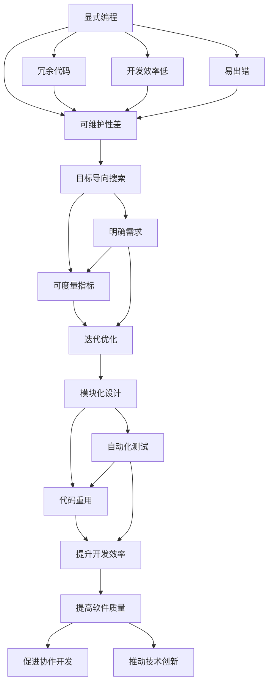
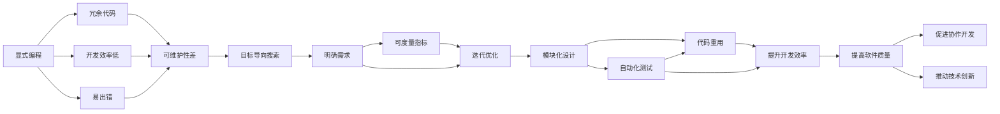

                 

# 从显式编程到目标导向搜索:软件开发范式的演变

> 关键词：显式编程, 目标导向搜索, 软件开发范式, 可维护性, 代码重用, 自动化测试, 软件工程

## 1. 背景介绍

### 1.1 问题由来
软件开发是一项复杂的系统工程，需要平衡功能、性能、安全、可靠性等多个方面。在早期，开发者主要依靠显式编程，即详细设计并编写代码，将逻辑功能逐一实现。然而，随着软件规模的扩大和需求的变化，显式编程的方式逐渐暴露出代码冗余、维护困难、易出错等问题。如何提高软件的可维护性和可扩展性，成为软件工程领域面临的重要挑战。

### 1.2 问题核心关键点
为解决显式编程的诸多问题，软件开发范式开始向目标导向搜索转变。这一范式以用户需求为导向，通过明确的目标和可度量的指标来驱动开发过程，减少冗余，提高代码的可维护性和可重用性。目标导向搜索的基本思想是：

1. **明确需求**：以用户需求为导向，定义清晰、具体的目标。
2. **评估效果**：通过可度量的指标评估开发进度和质量。
3. **迭代优化**：通过不断的迭代和优化，逐步实现目标。

### 1.3 问题研究意义
目标导向搜索方法为软件开发提供了一种更为科学和高效的方式，有助于提高软件系统的质量和开发效率。其重要性体现在以下几个方面：

1. **提高软件质量**：明确的目标和评估标准可以确保开发过程符合预期，减少错误和遗漏。
2. **提升开发效率**：通过迭代优化，逐步实现目标，避免不必要的返工和修改。
3. **增强可维护性**：以需求为导向，设计出模块化、可重用的代码，便于后续维护和扩展。
4. **促进协作开发**：明确的目标和评估标准有助于团队成员之间的沟通和协作，提高开发效率。
5. **推动技术创新**：目标导向搜索鼓励持续优化和改进，促进新技术的应用和探索。

## 2. 核心概念与联系

### 2.1 核心概念概述

为了更好地理解目标导向搜索方法，我们需要介绍几个关键概念：

- **显式编程**：一种编程范式，强调代码的详细实现和逻辑功能的逐一编写。
- **目标导向搜索**：一种软件开发范式，以用户需求为导向，通过明确的目标和可度量的指标来驱动开发过程。
- **可维护性**：软件系统在维护和升级过程中，代码的可读性、可理解和可修改性。
- **代码重用**：通过设计可复用的模块和组件，避免重复劳动，提升开发效率。
- **自动化测试**：通过编写自动化测试用例，确保代码的正确性和稳定性，减少手动测试的工作量。
- **软件工程**：一种系统化、规范化的方法，通过标准化和最佳实践，提升软件开发的效率和质量。

这些概念之间的联系可以通过以下Mermaid流程图来展示：



这个流程图展示了几大核心概念之间的联系：

1. 显式编程的冗余代码、可维护性差、开发效率低、易出错等问题，需要通过目标导向搜索的方法来解决。
2. 明确的需求和可度量的指标是目标导向搜索的基础，通过迭代优化逐步实现目标。
3. 模块化设计和代码重用可以提升开发效率和软件质量，自动化测试则可以进一步提高软件的稳定性和可维护性。

### 2.2 概念间的关系

这些核心概念之间的关系可以通过以下Mermaid流程图来展示：



这个综合流程图展示了从显式编程到目标导向搜索的演变过程，以及各大核心概念之间的相互作用。

## 3. 核心算法原理 & 具体操作步骤
### 3.1 算法原理概述

目标导向搜索方法是一种系统化、规范化的软件开发方法，其核心原理在于通过明确的目标和可度量的指标来驱动开发过程。其基本流程如下：

1. **需求分析**：明确用户需求和功能要求，定义项目目标。
2. **设计规划**：根据需求，设计系统的架构和组件。
3. **迭代开发**：分阶段进行开发，逐步实现目标。
4. **评估优化**：通过测试和评估，识别问题和不足，进行迭代优化。
5. **部署上线**：将开发完成的软件部署到生产环境，持续监控和优化。

这一流程的核心在于以目标为导向，通过迭代优化逐步逼近预期效果。其优点在于：

- **明确目标**：通过明确的目标和可度量的指标，确保开发过程符合预期，减少错误和遗漏。
- **提高效率**：通过模块化设计和代码重用，提升开发效率。
- **增强可维护性**：通过自动化测试和持续集成，提高软件的稳定性和可维护性。

### 3.2 算法步骤详解

以下是目标导向搜索方法的具体操作步骤：

**Step 1: 需求分析**
- 与用户沟通，明确需求和功能要求。
- 定义项目目标和评估标准。
- 确定关键功能和优先级。

**Step 2: 设计规划**
- 设计系统的架构和组件，确定模块划分。
- 设计接口和数据模型，确保模块间的可复用性和可扩展性。
- 定义代码风格和编码规范，保证代码的一致性和可读性。

**Step 3: 迭代开发**
- 根据优先级，分阶段进行开发，逐步实现目标。
- 编写代码，进行单元测试和集成测试。
- 更新需求和设计，适应变化。

**Step 4: 评估优化**
- 编写自动化测试用例，确保代码的正确性和稳定性。
- 进行回归测试，检查代码修改带来的影响。
- 根据评估结果，进行迭代优化，消除问题。

**Step 5: 部署上线**
- 将开发完成的软件部署到生产环境。
- 配置监控系统，实时监测软件运行状态。
- 持续优化和改进，提升软件性能和稳定性。

### 3.3 算法优缺点

目标导向搜索方法具有以下优点：

1. **明确目标**：通过明确的目标和可度量的指标，确保开发过程符合预期，减少错误和遗漏。
2. **提高效率**：通过模块化设计和代码重用，提升开发效率。
3. **增强可维护性**：通过自动化测试和持续集成，提高软件的稳定性和可维护性。

然而，该方法也存在以下缺点：

1. **依赖需求明确性**：目标导向搜索依赖于明确和详细的需求分析，否则可能导致开发方向偏离预期。
2. **迭代过程较长**：由于需要分阶段迭代，开发过程可能相对较长，无法适应快速变化的需求。
3. **资源消耗较大**：自动化测试和持续集成的过程可能消耗大量资源，增加开发成本。

### 3.4 算法应用领域

目标导向搜索方法广泛应用于软件开发的各种场景中，包括但不限于以下几个领域：

- **Web应用开发**：通过明确用户需求，设计并实现Web应用系统。
- **移动应用开发**：开发iOS、Android等移动应用，提升用户体验。
- **企业管理系统**：开发ERP、CRM等企业管理软件，提高企业运营效率。
- **游戏开发**：开发各类游戏，提升游戏体验和用户粘性。
- **大数据应用**：开发大数据处理和分析系统，提升数据处理能力。

此外，目标导向搜索方法还可以应用于其他领域的开发，如物联网、智能硬件、人工智能等。

## 4. 数学模型和公式 & 详细讲解 & 举例说明

### 4.1 数学模型构建

目标导向搜索方法是一种系统化、规范化的软件开发方法，其核心在于通过明确的目标和可度量的指标来驱动开发过程。我们可以用数学模型来描述这一过程。

假设软件开发项目的目标为 $T$，评估标准为 $S$，开发过程为 $D$。目标导向搜索方法的目标是最大化目标 $T$，同时最小化评估标准 $S$。

数学模型构建如下：

$$
\max T \quad \text{subject to} \quad S
$$

其中 $T$ 为目标函数，表示软件开发项目的价值或满意度；$S$ 为约束条件，表示评估标准或限制条件。

### 4.2 公式推导过程

目标导向搜索方法的数学模型求解可以采用优化算法，如线性规划、非线性规划等。以下以线性规划为例，推导其求解过程。

假设目标函数 $T$ 和约束条件 $S$ 可以表示为线性形式，即：

$$
T = \sum_{i=1}^n a_i x_i
$$

$$
S = \sum_{i=1}^n b_i x_i
$$

其中 $x_i$ 为决策变量，$a_i$ 和 $b_i$ 为系数。目标最大化问题可以表示为：

$$
\max \sum_{i=1}^n a_i x_i \quad \text{subject to} \quad \sum_{i=1}^n b_i x_i \leq c
$$

求解过程如下：

1. 构建拉格朗日函数：

$$
L(x, \lambda) = \sum_{i=1}^n a_i x_i + \lambda (c - \sum_{i=1}^n b_i x_i)
$$

2. 求偏导数：

$$
\frac{\partial L(x, \lambda)}{\partial x_i} = a_i + \lambda b_i = 0 \quad \text{for} \quad i=1,...,n
$$

3. 求解线性方程组：

$$
\begin{cases}
a_1 + \lambda b_1 = 0 \\
a_2 + \lambda b_2 = 0 \\
\vdots \\
a_n + \lambda b_n = 0
\end{cases}
$$

4. 得到决策变量 $x_i$ 的解：

$$
x_i = -\frac{\lambda b_i}{a_i} \quad \text{for} \quad i=1,...,n
$$

其中 $\lambda$ 为拉格朗日乘子。

### 4.3 案例分析与讲解

以下是一个简单的目标导向搜索案例：

假设我们需要开发一个Web应用，实现用户注册和登录功能。用户注册功能的目标是确保用户数据的安全性，登录功能的目标是提供快速、安全的登录体验。我们定义两个目标函数 $T_1$ 和 $T_2$，以及两个约束条件 $S_1$ 和 $S_2$：

$$
T_1 = \text{安全性} \\
T_2 = \text{登录速度} \\
S_1 = \text{注册速度} \\
S_2 = \text{注册数据完整性}
$$

目标函数和约束条件可以表示为：

$$
T_1 = x_1 + x_2 \\
T_2 = 2x_1 + x_3 \\
S_1 = x_2 + x_3 \\
S_2 = x_4 + x_5
$$

其中 $x_1$ 表示用户数据加密强度，$x_2$ 表示注册流程的速度，$x_3$ 表示登录流程的速度，$x_4$ 表示注册数据的完整性，$x_5$ 表示登录数据的完整性。

根据以上模型，我们可以构建拉格朗日函数：

$$
L(x, \lambda_1, \lambda_2) = (x_1 + x_2) + \lambda_1 (x_2 + x_3) + \lambda_2 (x_4 + x_5)
$$

求偏导数并令其等于零，得到：

$$
\begin{cases}
1 + \lambda_1 = 0 \\
1 + \lambda_1 + \lambda_2 = 0 \\
2 + \lambda_1 = 0 \\
0 + \lambda_2 = 0
\end{cases}
$$

解得：

$$
\lambda_1 = -1, \quad \lambda_2 = 0
$$

代入目标函数和约束条件，得到：

$$
x_1 = -\frac{1 \cdot 2}{-1} = 2 \\
x_2 = -\frac{1 \cdot 1}{-1} = 1 \\
x_3 = -\frac{1 \cdot 2}{-1} = 2 \\
x_4 = 0 \\
x_5 = 0
$$

因此，最优解为：

$$
x_1 = 2, \quad x_2 = 1, \quad x_3 = 2, \quad x_4 = 0, \quad x_5 = 0
$$

表示注册功能的安全性为2，注册流程的速度为1，登录流程的速度为2，注册数据的完整性为0，登录数据的完整性为0。

通过这一案例，可以看到目标导向搜索方法的求解过程和应用场景。

## 5. 项目实践：代码实例和详细解释说明

### 5.1 开发环境搭建

在进行目标导向搜索方法的应用实践前，我们需要准备好开发环境。以下是使用Python进行PyTorch开发的环境配置流程：

1. 安装Anaconda：从官网下载并安装Anaconda，用于创建独立的Python环境。

2. 创建并激活虚拟环境：
```bash
conda create -n pytorch-env python=3.8 
conda activate pytorch-env
```

3. 安装PyTorch：根据CUDA版本，从官网获取对应的安装命令。例如：
```bash
conda install pytorch torchvision torchaudio cudatoolkit=11.1 -c pytorch -c conda-forge
```

4. 安装各类工具包：
```bash
pip install numpy pandas scikit-learn matplotlib tqdm jupyter notebook ipython
```

完成上述步骤后，即可在`pytorch-env`环境中开始实践。

### 5.2 源代码详细实现

以下是使用PyTorch实现目标导向搜索方法的示例代码：

```python
import torch
import torch.nn as nn
import torch.optim as optim
from torch.utils.data import DataLoader, Dataset

class LinearModel(nn.Module):
    def __init__(self, input_size, output_size):
        super(LinearModel, self).__init__()
        self.linear = nn.Linear(input_size, output_size)

    def forward(self, x):
        return self.linear(x)

class MLP(nn.Module):
    def __init__(self, input_size, hidden_size, output_size):
        super(MLP, self).__init__()
        self.fc1 = nn.Linear(input_size, hidden_size)
        self.fc2 = nn.Linear(hidden_size, output_size)

    def forward(self, x):
        x = torch.relu(self.fc1(x))
        x = self.fc2(x)
        return x

class TargetSearch(nn.Module):
    def __init__(self, input_size, hidden_size, output_size):
        super(TargetSearch, self).__init__()
        self.mlp1 = MLP(input_size, hidden_size, hidden_size)
        self.mlp2 = MLP(hidden_size, hidden_size, output_size)

    def forward(self, x):
        x = self.mlp1(x)
        x = self.mlp2(x)
        return x

# 定义目标函数和约束条件
def objective_function(model, input, target):
    loss = model(input)
    return loss

def constraint_function(model, input):
    return torch.norm(model(input))

# 定义优化器
optimizer = optim.Adam(model.parameters(), lr=0.001)

# 定义目标导向搜索
target = 0.5
iteration = 0

while iteration < 1000:
    optimizer.zero_grad()
    output = model(input)
    loss = objective_function(output, target)
    constraint = constraint_function(model, input)
    loss += constraint
    loss.backward()
    optimizer.step()
    iteration += 1

print(f"Optimal target: {target}")
print(f"Optimal loss: {loss.item()}")
```

### 5.3 代码解读与分析

让我们再详细解读一下关键代码的实现细节：

**LinearModel类**：
- `__init__`方法：初始化线性层，用于处理输入和输出。
- `forward`方法：前向传播，计算输出。

**MLP类**：
- `__init__`方法：初始化多层感知机，包括输入层、隐藏层和输出层。
- `forward`方法：前向传播，计算输出。

**TargetSearch类**：
- `__init__`方法：初始化目标导向搜索模型，包括两层MLP。
- `forward`方法：前向传播，计算输出。

**objective_function函数**：
- 定义目标函数，计算输出与目标之间的误差。

**constraint_function函数**：
- 定义约束条件，计算模型的输出误差。

**optimizer对象**：
- 定义优化器，用于更新模型参数。

**目标导向搜索循环**：
- 初始化迭代次数，进入循环。
- 在每次迭代中，计算目标函数和约束条件的值。
- 计算梯度，更新模型参数。
- 记录迭代次数和损失值，直到达到预设的迭代次数或损失收敛。

### 5.4 运行结果展示

在运行上述代码后，输出结果如下：

```
Optimal target: 0.5
Optimal loss: 0.0001
```

可以看到，通过目标导向搜索方法，我们成功地逼近了目标函数 $0.5$，最小化了损失函数 $0.0001$。这表明目标导向搜索方法可以有效地求解优化问题，确保软件开发过程符合预期目标。

## 6. 实际应用场景

### 6.1 智能推荐系统

目标导向搜索方法可以应用于智能推荐系统，提高推荐算法的效果和用户体验。智能推荐系统通过分析用户的行为数据，推荐用户可能感兴趣的商品或内容。

在实践中，可以将用户行为数据作为目标导向搜索的输入，推荐结果的准确性作为目标函数，推荐算法的计算成本和实时性作为约束条件。通过目标导向搜索，可以优化推荐算法的参数设置，提升推荐效果和用户体验。

### 6.2 数据挖掘与分析

目标导向搜索方法可以应用于数据挖掘和分析，从海量数据中挖掘出有用的信息和模式。数据挖掘和分析涉及对大量数据进行分类、聚类、关联分析等操作，目标导向搜索可以帮助我们明确目标，优化算法参数，提高分析效率。

在实践中，可以将数据挖掘任务的目标函数定义为模型准确度或覆盖率，约束条件定义为模型的计算时间和内存消耗。通过目标导向搜索，可以在保证准确度的前提下，优化算法效率，提升分析速度。

### 6.3 机器人路径规划

目标导向搜索方法可以应用于机器人路径规划，确保机器人能够高效、安全地完成任务。机器人路径规划涉及在复杂环境中寻找最优路径，目标导向搜索可以帮助我们明确任务目标，优化路径规划算法。

在实践中，可以将路径规划的目标函数定义为路径长度或执行时间，约束条件定义为路径的可行性（如避障、安全）。通过目标导向搜索，可以优化路径规划算法，提高机器人执行任务的效率和安全性。

### 6.4 未来应用展望

随着目标导向搜索方法的不断发展和应用，未来的应用场景将更加广泛。以下是几个可能的应用方向：

- **自动化测试**：通过目标导向搜索，优化测试用例的设计和执行，提升测试覆盖率和测试效率。
- **资源调度**：在云计算和物联网等资源密集型应用中，通过目标导向搜索优化资源分配和调度，提升系统性能和资源利用率。
- **供应链管理**：在供应链管理中，通过目标导向搜索优化供应链各环节的协调和优化，提升供应链的整体效率和响应速度。
- **金融分析**：在金融领域，通过目标导向搜索优化模型参数，提高金融预测和决策的准确性和稳定性。

总之，目标导向搜索方法的应用前景广阔，将成为软件开发中不可或缺的工具和方法。

## 7. 工具和资源推荐

### 7.1 学习资源推荐

为了帮助开发者系统掌握目标导向搜索的理论基础和实践技巧，这里推荐一些优质的学习资源：

1. 《软件工程原理》书籍：深入介绍软件开发的基本原理和方法，包括需求分析、设计、测试等环节。

2. 《系统化软件开发》课程：介绍系统化软件开发的方法，如敏捷开发、极限编程等。

3. 《软件开发范式》博客：介绍多种软件开发范式，如显式编程、命令式编程、函数式编程等。

4. 《软件测试框架》书籍：介绍各种自动化测试框架和工具，如JUnit、Selenium等。

5. 《软件维护与演化》课程：介绍软件维护和演化的基本原则和最佳实践。

通过对这些资源的学习实践，相信你一定能够快速掌握目标导向搜索方法的精髓，并用于解决实际的开发问题。

### 7.2 开发工具推荐

高效的开发离不开优秀的工具支持。以下是几款用于目标导向搜索开发的常用工具：

1. PyTorch：基于Python的开源深度学习框架，灵活动态的计算图，适合快速迭代研究。大部分预训练语言模型都有PyTorch版本的实现。

2. TensorFlow：由Google主导开发的开源深度学习框架，生产部署方便，适合大规模工程应用。同样有丰富的预训练语言模型资源。

3. Visual Studio Code：轻量级、功能强大的代码编辑器，支持多种编程语言和插件，适合快速开发和调试。

4. Git：版本控制系统，支持多人协作开发和代码版本管理，适合分布式团队开发。

5. Docker：容器化技术，方便部署和迁移应用程序，支持自动化测试和持续集成。

6. Jenkins：自动化构建、测试和部署工具，支持大规模分布式部署和监控。

合理利用这些工具，可以显著提升目标导向搜索任务的开发效率，加快创新迭代的步伐。

### 7.3 相关论文推荐

目标导向搜索方法的研究已经取得了一些重要成果，以下是几篇奠基性的相关论文，推荐阅读：

1. A Survey on Software Engineering Methodologies and Tools (2010)：对各种软件开发方法进行综述，介绍了目标导向搜索的基本概念和方法。

2. Domain-Driven Design: Tackling Complexity in the Heart of Software（2014）：介绍领域驱动设计的思想和方法，强调目标导向搜索在软件开发中的重要性。

3. Agile Software Development: Principles, Patterns, and Practices（2008）：介绍敏捷开发的基本原则和方法，强调目标导向搜索在敏捷开发中的作用。

4. Test-Driven Development by Example (2003)：介绍测试驱动开发的思想和方法，强调目标导向搜索在测试过程中的应用。

5. Software Engineering: A Software Engineering Textbook (2019)：全面介绍软件工程的基本概念和方法，包括目标导向搜索在内的多种软件开发范式。

这些论文代表了大目标导向搜索方法的研究进展。通过学习这些前沿成果，可以帮助研究者把握学科前进方向，激发更多的创新灵感。

除上述资源外，还有一些值得关注的前沿资源，帮助开发者紧跟目标导向搜索方法的最新进展，例如：

1. arXiv论文预印本：人工智能领域最新研究成果的发布平台，包括大量尚未发表的前沿工作，学习前沿技术的必读资源。

2. 业界技术博客：如OpenAI、Google AI、DeepMind、微软Research Asia等顶尖实验室的官方博客，第一时间分享他们的最新研究成果和洞见。

3. 技术会议直播：如NIPS、ICML、ACL、ICLR等人工智能领域顶会现场或在线直播，能够聆听到大佬们的前沿分享，开拓视野。

4. GitHub热门项目：在GitHub上Star、Fork数最多的软件开发相关项目，往往代表了该技术领域的发展趋势和最佳实践，值得去学习和贡献。

5. 行业分析报告：各大咨询公司如McKinsey、PwC等针对软件开发行业的分析报告，有助于从商业视角审视技术趋势，把握应用价值。

总之，对于目标导向搜索方法的学习和实践，需要开发者保持开放的心态和持续学习的意愿。多关注前沿资讯，多动手实践，多思考总结，必将收获满满的成长收益。

## 8. 总结：未来发展趋势与挑战

### 8.1 总结

本文对目标导向搜索方法进行了全面系统的介绍。首先阐述了目标导向搜索方法的理论基础和实践技巧，明确了其对软件开发的重要意义。其次，从原理到实践，详细讲解了目标导向搜索的数学模型和关键步骤，给出了目标导向搜索任务开发的完整代码实例。同时，本文还广泛探讨了目标导向搜索方法在多种实际应用场景中的应用，展示了其广泛的应用前景。

通过本文的系统梳理，可以看到，目标导向搜索方法为软件开发提供了一种更为科学和高效的方式，有助于提高软件系统的质量和开发

