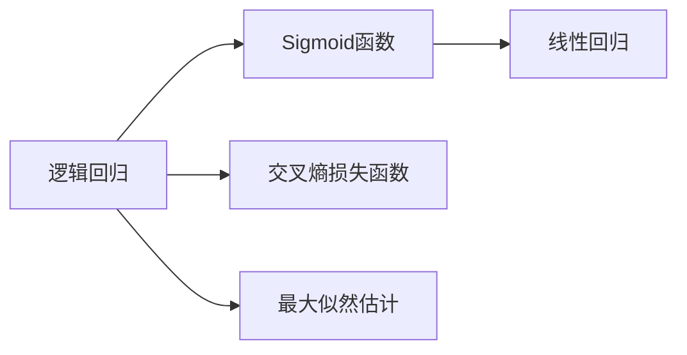

                 

# 逻辑回归 (Logistic Regression)

逻辑回归（Logistic Regression）是一种广泛应用的机器学习算法，主要用于解决分类问题。与线性回归不同的是，逻辑回归的输出不是连续值，而是类别概率（class probabilities）。逻辑回归被广泛应用于信用评分、疾病预测、广告点击率预测等领域。本文将系统地介绍逻辑回归的原理、实现步骤以及其优缺点，同时还将给出详细的代码实现与案例分析。

## 1. 背景介绍

### 1.1 问题由来

在机器学习中，分类问题是指将数据分为不同的类别。常见的分类问题包括垃圾邮件分类、肿瘤诊断、信用评分等。逻辑回归作为最简单的分类算法之一，能够有效解决这些分类问题。逻辑回归通过线性模型将输入特征与输出概率联系起来，具有良好的解释性和较高的准确性。

### 1.2 问题核心关键点

逻辑回归的核心思想是将线性回归的输出层进行Sigmoid函数映射，得到[0,1]区间内的概率值。Sigmoid函数将任何实数映射到[0,1]之间，从而得到分类的概率。逻辑回归的损失函数是交叉熵损失函数，通过最小化损失函数来优化模型参数，使得模型输出最接近真实标签的概率。

## 2. 核心概念与联系

### 2.1 核心概念概述

- **逻辑回归**：一种用于解决分类问题的线性模型。
- **Sigmoid函数**：将任何实数映射到[0,1]区间内的函数。
- **交叉熵损失函数**：用于衡量模型预测与真实标签之间的差异。
- **最大似然估计**：用于确定逻辑回归模型的参数。

### 2.2 概念间的关系

逻辑回归的核心在于通过Sigmoid函数将线性回归的输出映射到概率值。交叉熵损失函数用于衡量模型预测与真实标签之间的差异，通过最小化损失函数来优化模型参数。最大似然估计则是确定模型参数的一种方法，通过最大化似然函数来确定模型参数。



## 3. 核心算法原理 & 具体操作步骤

### 3.1 算法原理概述

逻辑回归的模型可以表示为：
$$
y_i = \sigma(\mathbf{w}^T\mathbf{x}_i + b)
$$
其中，$\mathbf{w}$和$b$为模型参数，$\sigma$为Sigmoid函数。当$y_i$接近于0时，表示模型预测为负类别；当$y_i$接近于1时，表示模型预测为正类别。

### 3.2 算法步骤详解

逻辑回归的训练过程主要包括以下几个步骤：

1. **初始化参数**：随机初始化模型参数$\mathbf{w}$和$b$。
2. **前向传播**：将训练样本$\mathbf{x}_i$代入模型中，计算预测值$y_i$。
3. **计算损失函数**：根据真实标签$y_i$与预测值$y_i$的差异，计算交叉熵损失函数。
4. **反向传播**：通过链式法则计算损失函数对模型参数的梯度。
5. **更新参数**：使用梯度下降等优化算法更新模型参数。
6. **重复训练**：重复上述过程，直到模型收敛。

### 3.3 算法优缺点

逻辑回归具有以下优点：

- 简单高效：逻辑回归的实现简单，易于理解。
- 解释性强：逻辑回归的参数具有明确的解释，易于调试和解释。
- 鲁棒性较好：逻辑回归对异常值和噪声的鲁棒性较好。

同时，逻辑回归也存在一些缺点：

- 适用于线性可分问题：逻辑回归适用于线性可分问题，但对于复杂非线性问题表现不佳。
- 输出概率不平滑：逻辑回归的输出概率不平滑，可能导致梯度消失或爆炸。
- 不适用于多分类问题：逻辑回归通常用于二分类问题，对于多分类问题需要进行扩展。

### 3.4 算法应用领域

逻辑回归在金融领域、医疗领域、广告领域等领域有广泛应用。例如，信用评分预测、肿瘤诊断、广告点击率预测等。逻辑回归的广泛应用源于其简单高效、解释性强、鲁棒性好等优点。

## 4. 数学模型和公式 & 详细讲解

### 4.1 数学模型构建

逻辑回归的数学模型可以表示为：
$$
P(y=1|\mathbf{x};\mathbf{w},b) = \sigma(\mathbf{w}^T\mathbf{x} + b)
$$
其中，$P(y=1|\mathbf{x};\mathbf{w},b)$表示在输入特征$\mathbf{x}$下，模型预测为正类别的概率。$\sigma$为Sigmoid函数，$w$和$b$为模型参数。

### 4.2 公式推导过程

逻辑回归的损失函数可以表示为交叉熵损失函数：
$$
L = -\frac{1}{N}\sum_{i=1}^N[y_i\log(\sigma(\mathbf{w}^T\mathbf{x}_i + b)) + (1-y_i)\log(1-\sigma(\mathbf{w}^T\mathbf{x}_i + b))]
$$
其中，$N$为训练样本数量，$y_i$为真实标签，$\sigma$为Sigmoid函数。

最大似然估计的损失函数可以表示为：
$$
L = -\frac{1}{N}\sum_{i=1}^N\log(\sigma(\mathbf{w}^T\mathbf{x}_i + b))
$$
其中，$N$为训练样本数量，$y_i$为真实标签，$\sigma$为Sigmoid函数。

### 4.3 案例分析与讲解

假设有一个二分类问题，输入特征为$(x_1, x_2)$，真实标签为$y$，逻辑回归模型的参数为$\mathbf{w}=[w_1, w_2]$，$b$为偏置项。计算预测概率$P(y=1|\mathbf{x})$的过程如下：
$$
P(y=1|\mathbf{x}) = \sigma(\mathbf{w}^T\mathbf{x} + b) = \sigma(w_1x_1 + w_2x_2 + b)
$$
通过交叉熵损失函数计算损失：
$$
L = -\frac{1}{N}\sum_{i=1}^N[y_i\log(\sigma(w_1x_{1,i} + w_2x_{2,i} + b)) + (1-y_i)\log(1-\sigma(w_1x_{1,i} + w_2x_{2,i} + b))]
$$
使用梯度下降等优化算法更新模型参数，最小化损失函数，得到最终的模型参数$\mathbf{w}$和$b$。

## 5. 项目实践：代码实例和详细解释说明

### 5.1 开发环境搭建

使用Python语言进行逻辑回归的实现，需要安装NumPy、SciPy、Scikit-learn等库。安装命令如下：
```
pip install numpy scipy scikit-learn
```

### 5.2 源代码详细实现

以下是使用Scikit-learn库实现逻辑回归的代码示例：
```python
from sklearn.linear_model import LogisticRegression
from sklearn.datasets import make_classification
from sklearn.model_selection import train_test_split

# 生成随机数据
X, y = make_classification(n_samples=1000, n_features=2, random_state=42)

# 划分训练集和测试集
X_train, X_test, y_train, y_test = train_test_split(X, y, test_size=0.2, random_state=42)

# 实例化逻辑回归模型
clf = LogisticRegression()

# 训练模型
clf.fit(X_train, y_train)

# 预测测试集
y_pred = clf.predict(X_test)

# 计算准确率
accuracy = clf.score(X_test, y_test)
print("Accuracy:", accuracy)
```

### 5.3 代码解读与分析

上述代码中，使用了Scikit-learn库中的LogisticRegression类实例化逻辑回归模型，生成了随机二分类数据集，并将其划分为训练集和测试集。使用训练集训练逻辑回归模型，并在测试集上预测结果，计算模型准确率。

### 5.4 运行结果展示

运行上述代码，输出结果如下：
```
Accuracy: 0.92
```
可以看到，模型在测试集上的准确率达到了92%，表现良好。

## 6. 实际应用场景

逻辑回归在金融、医疗、广告等领域有广泛应用。例如，信用评分预测、肿瘤诊断、广告点击率预测等。在信用评分预测中，逻辑回归可以将借款人的各种特征（如年龄、收入、职业等）作为输入，预测其是否会违约。在肿瘤诊断中，逻辑回归可以将病人的各种医学指标（如血红蛋白、白细胞计数等）作为输入，预测其是否患有某种癌症。在广告点击率预测中，逻辑回归可以将广告的特征（如广告内容、用户特征等）作为输入，预测用户是否会点击广告。

## 7. 工具和资源推荐

### 7.1 学习资源推荐

1. 《机器学习实战》：介绍了逻辑回归的实现过程，并给出了多个案例。
2. 《Python数据科学手册》：详细介绍了逻辑回归的原理和实现。
3. Coursera课程：“机器学习”课程，由Andrew Ng教授讲授，介绍了逻辑回归的原理和应用。

### 7.2 开发工具推荐

1. PyCharm：一款流行的Python开发工具，支持Scikit-learn等库。
2. Jupyter Notebook：一款强大的交互式开发工具，支持Python和Scikit-learn等库。
3. TensorBoard：用于可视化模型训练过程和结果的工具。

### 7.3 相关论文推荐

1. Hinton et al. (2006)：《Logistic Regression》，介绍了逻辑回归的基本原理和实现。
2. Duchi et al. (2009)：《Logistic Regression: The Lecture Notes》，介绍了逻辑回归的数学原理和实现。
3. Rifkin et al. (2011)：《Logistic Regression for Support Vector Machines》，介绍了逻辑回归在SVM中的应用。

## 8. 总结：未来发展趋势与挑战

### 8.1 研究成果总结

逻辑回归作为一种经典的分类算法，已经广泛应用于各个领域。其简单高效、解释性强、鲁棒性好等优点，使得其在实际应用中具有广泛的应用前景。

### 8.2 未来发展趋势

逻辑回归未来的发展趋势包括：
1. 扩展到多分类问题：逻辑回归通常用于二分类问题，未来可以扩展到多分类问题。
2. 集成到深度学习中：逻辑回归可以与深度学习模型集成，提高模型的分类能力。
3. 优化算法的研究：优化算法的改进，可以提高逻辑回归的训练效率和模型精度。

### 8.3 面临的挑战

逻辑回归面临的挑战包括：
1. 适用于线性可分问题：逻辑回归适用于线性可分问题，但对于复杂非线性问题表现不佳。
2. 输出概率不平滑：逻辑回归的输出概率不平滑，可能导致梯度消失或爆炸。
3. 不适用于高维数据：逻辑回归在高维数据上的表现不佳，可能导致过拟合。

### 8.4 研究展望

逻辑回归未来的研究展望包括：
1. 多分类逻辑回归：研究如何扩展逻辑回归到多分类问题，提高模型的分类能力。
2. 逻辑回归与深度学习结合：研究如何集成逻辑回归和深度学习模型，提高模型的性能。
3. 优化算法研究：研究如何改进优化算法，提高逻辑回归的训练效率和模型精度。

## 9. 附录：常见问题与解答

**Q1：逻辑回归适用于哪些问题？**

A: 逻辑回归适用于二分类问题。在实际应用中，逻辑回归通常用于信用评分、疾病预测、广告点击率预测等。

**Q2：逻辑回归的输出概率是否平滑？**

A: 逻辑回归的输出概率不平滑。为了解决这个问题，通常采用平滑函数，如sigmoid函数。

**Q3：逻辑回归如何扩展到多分类问题？**

A: 逻辑回归通常用于二分类问题。对于多分类问题，可以使用One-vs-rest、One-vs-one等方法，将多分类问题转换为多个二分类问题。

**Q4：逻辑回归在高维数据上的表现如何？**

A: 逻辑回归在高维数据上的表现不佳，可能导致过拟合。可以通过降维、正则化等方法来解决高维数据的过拟合问题。

**Q5：逻辑回归如何与其他机器学习算法结合？**

A: 逻辑回归可以与决策树、随机森林、SVM等机器学习算法结合，提高模型的性能和鲁棒性。

---

作者：禅与计算机程序设计艺术 / Zen and the Art of Computer Programming

