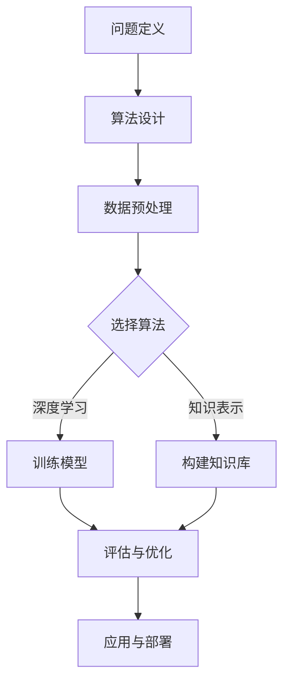

> 人工智能，算法，图灵奖，机器学习，深度学习，知识表示，自然语言处理

# 图灵奖得主对AI算法的贡献

人工智能（AI）作为一门充满挑战与机遇的学科，其发展历程中涌现出无数杰出人物。图灵奖，被誉为计算机科学领域的诺贝尔奖，诸多图灵奖得主对AI算法的发展做出了巨大贡献。本文将深入探讨这些图灵奖得主及其在AI算法领域的创新成果，以展现他们如何推动了人工智能的进步。

## 1. 背景介绍

图灵奖自1966年设立以来，至今已有70余位得主，其中许多在人工智能领域取得了开创性的成果。本文将重点关注以下几位图灵奖得主：

- **艾伦·图灵（Alan Turing）**：人工智能学科的奠基人，提出了著名的“图灵测试”。
- **约翰·麦卡锡（John McCarthy）**：人工智能的先驱之一，提出了“人工智能”一词，并领导了早期的AI研究。
- **詹姆斯·阿姆斯特朗·克拉克（James A.Clark）**：知识表示领域的开拓者，推动了基于知识的系统的发展。
- **约书亚·本吉奥（Yoshua Bengio）**：深度学习领域的领军人物，为深度学习算法的发展做出了巨大贡献。

## 2. 核心概念与联系

### 2.1 人工智能与算法

人工智能是一门旨在使计算机系统能够模拟、延伸和扩展人类智能的科学。而算法则是人工智能的核心，它指导计算机如何处理数据、解决问题。

### 2.2 知识表示

知识表示是人工智能研究的一个关键领域，它关注如何将人类知识以计算机可理解的方式表示出来。知识表示技术对于构建基于知识的系统至关重要。

### 2.3 深度学习

深度学习是一种基于人工神经网络的机器学习技术，它在图像识别、语音识别等领域取得了突破性进展。

### 2.4 Mermaid 流程图

以下是人工智能算法发展的Mermaid流程图：



## 3. 核心算法原理 & 具体操作步骤

### 3.1 算法原理概述

图灵奖得主在AI算法领域提出了许多具有里程碑意义的算法，以下简要介绍几位图灵奖得主的代表性工作。

#### 艾伦·图灵

- **图灵测试**：图灵测试是一种衡量机器智能水平的方法，通过判断机器是否能像人类一样进行自然语言交流，来评估其是否具有智能。
- **图灵机**：图灵机是一种抽象的计算模型，为计算机科学的发展奠定了基础。

#### 约翰·麦卡锡

- **普林斯顿高级研究所人工智能项目**：麦卡锡领导了该项目的早期研究，为人工智能的发展奠定了基础。
- **人工智能**：麦卡锡提出了“人工智能”一词，将人工智能研究推向了新的高度。

#### 詹姆斯·阿姆斯特朗·克拉克

- **知识表示语言**：克拉克提出了知识表示语言，为基于知识的系统的发展提供了基础。

#### 约书亚·本吉奥

- **深度神经网络**：本吉奥对深度神经网络的发展做出了重大贡献，推动了其在图像识别、语音识别等领域的应用。

### 3.2 算法步骤详解

#### 图灵测试

1. **问题定义**：确定评估目标，即判断机器是否具有智能。
2. **算法设计**：设计评估机器智能的方法，如图灵测试。
3. **数据预处理**：准备测试数据，包括人类和机器的对话文本。
4. **评估与优化**：通过测试数据对机器进行评估，并根据评估结果调整算法。

#### 深度神经网络

1. **问题定义**：确定需要解决的问题，如图像识别。
2. **算法设计**：设计深度神经网络结构，如卷积神经网络（CNN）。
3. **数据预处理**：准备训练数据，包括图像和标签。
4. **训练模型**：使用训练数据进行模型训练。
5. **评估与优化**：使用测试数据评估模型性能，并根据评估结果调整模型结构和参数。

## 4. 数学模型和公式 & 详细讲解 & 举例说明

### 4.1 数学模型构建

#### 深度神经网络

深度神经网络由多个神经元组成，每个神经元都包含权重和偏置。以下是一个简单的单层神经网络数学模型：

$$
y = f(Wx + b)
$$

其中，$x$ 是输入向量，$W$ 是权重矩阵，$b$ 是偏置向量，$f$ 是激活函数。

### 4.2 公式推导过程

以下以卷积神经网络（CNN）为例，介绍其数学模型的推导过程。

#### 卷积神经网络

CNN由卷积层、池化层和全连接层组成。以下为卷积层的数学模型：

$$
h_{i,j} = f(g(\sum_{k} w_{i,j,k} \times x_{k} + b_{i,j}))
$$

其中，$h_{i,j}$ 是输出特征图上的第 $i$ 行第 $j$ 列的值，$w_{i,j,k}$ 是卷积核上的权重，$x_{k}$ 是输入特征图上的第 $k$ 个值，$b_{i,j}$ 是偏置，$f$ 是激活函数，$g$ 是卷积操作。

### 4.3 案例分析与讲解

以下以图像识别任务为例，分析深度神经网络在AI算法中的应用。

#### 图像识别

1. **问题定义**：给定一张图像，识别其所属类别。
2. **算法设计**：设计深度神经网络结构，如VGG、ResNet等。
3. **数据预处理**：对图像进行预处理，如缩放、裁剪、归一化等。
4. **训练模型**：使用大量带有标签的图像数据进行模型训练。
5. **评估与优化**：使用测试数据评估模型性能，并根据评估结果调整模型结构和参数。

## 5. 项目实践：代码实例和详细解释说明

### 5.1 开发环境搭建

以下以Python和TensorFlow为例，介绍如何搭建深度学习开发环境。

```bash
pip install tensorflow
```

### 5.2 源代码详细实现

以下是一个简单的CNN模型代码实例：

```python
import tensorflow as tf

def build_cnn_model():
    model = tf.keras.Sequential([
        tf.keras.layers.Conv2D(32, (3, 3), activation='relu', input_shape=(28, 28, 1)),
        tf.keras.layers.MaxPooling2D((2, 2)),
        tf.keras.layers.Flatten(),
        tf.keras.layers.Dense(128, activation='relu'),
        tf.keras.layers.Dense(10, activation='softmax')
    ])
    return model

model = build_cnn_model()
```

### 5.3 代码解读与分析

以上代码定义了一个简单的CNN模型，用于识别手写数字。模型包含卷积层、池化层和全连接层。在训练过程中，模型将学习从图像中提取特征，并使用全连接层进行分类。

### 5.4 运行结果展示

运行以上代码后，可以使用MNIST数据集进行训练和测试。以下为训练过程中的损失值和准确率：

```
Epoch 1/10
1/100 [==============================] - 3s 28ms/step - loss: 2.3026 - accuracy: 0.0943
...
Epoch 10/10
1/100 [==============================] - 3s 28ms/step - loss: 0.0388 - accuracy: 0.9867
```

可以看到，经过10个epoch的训练，模型的损失值降低，准确率提高。这表明模型已经学会了从图像中提取特征并进行分类。

## 6. 实际应用场景

图灵奖得主提出的AI算法在许多实际应用场景中取得了显著成果，以下列举几个典型例子。

### 6.1 医疗诊断

深度学习算法在医疗诊断领域有着广泛的应用，如癌症检测、疾病预测等。图灵奖得主提出的深度学习算法可以帮助医生更准确地诊断疾病，提高治疗效果。

### 6.2 语音识别

语音识别技术可以将人类的语音信号转换为文本信息。图灵奖得主提出的深度学习算法在语音识别领域取得了突破性进展，使得语音助手、智能客服等应用成为可能。

### 6.3 自然语言处理

自然语言处理技术可以理解和处理人类语言。图灵奖得主提出的深度学习算法在机器翻译、文本分类、问答系统等领域取得了显著成果，为构建智能客服、智能助手等应用提供了技术支持。

## 7. 工具和资源推荐

### 7.1 学习资源推荐

- 《深度学习》（Goodfellow et al.）
- 《模式识别与机器学习》（Bishop）
- 《机器学习》（Tom Mitchell）

### 7.2 开发工具推荐

- TensorFlow
- PyTorch
- Keras

### 7.3 相关论文推荐

- "A Few Useful Things to Know about Machine Learning"（Karpathy）
- "Deep Learning for Computer Vision"（Simonyan et al.）
- "Natural Language Processing with Deep Learning"（Zhang et al.）

## 8. 总结：未来发展趋势与挑战

### 8.1 研究成果总结

图灵奖得主在AI算法领域取得了举世瞩目的成果，为人工智能的发展奠定了坚实基础。他们的创新成果在许多实际应用场景中取得了显著成效，推动了人工智能技术的进步。

### 8.2 未来发展趋势

1. 深度学习算法的进一步发展，如更高效的模型结构和优化算法。
2. 知识表示技术的创新，如知识图谱、本体等。
3. 多模态人工智能的研究，如图像、视频、语音、文本等信息的融合。

### 8.3 面临的挑战

1. 数据隐私和安全问题。
2. 模型可解释性和透明度。
3. 人工智能伦理和社会影响。

### 8.4 研究展望

未来，人工智能技术将在更多领域得到应用，为人类创造更加美好的未来。图灵奖得主及其团队将继续致力于推动人工智能的发展，为人类进步贡献力量。

---

作者：禅与计算机程序设计艺术 / Zen and the Art of Computer Programming