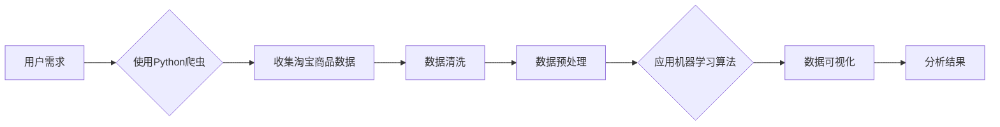

# 基于Python爬虫的淘宝商品销售量分析和可视化系统实现

> 关键词：Python爬虫，淘宝数据，销售量分析，可视化，数据分析，机器学习

## 1. 背景介绍

随着电子商务的快速发展，淘宝作为国内最大的在线零售平台，其商品的销售数据对于商家和市场分析人员来说具有重要价值。通过对淘宝商品的销售量进行分析，商家可以了解市场需求、调整产品策略、预测销售趋势，从而提高销售额和市场份额。然而，淘宝的商品数据并不直接对外公开，这就需要我们通过技术手段进行数据收集和分析。本文将介绍如何利用Python爬虫技术，实现淘宝商品销售量的数据收集、分析和可视化。

## 2. 核心概念与联系

### 2.1 核心概念

#### 2.1.1 Python爬虫

Python爬虫是指使用Python语言编写的网络爬虫程序，用于从互联网上自动抓取网页内容。Python爬虫技术可以用于数据收集、信息检索、舆情监测等多个领域。

#### 2.1.2 数据分析

数据分析是指对大量数据进行分析和处理，从中提取有价值的信息和知识的过程。数据分析方法包括描述性统计、推断性统计、机器学习等。

#### 2.1.3 可视化

可视化是将数据以图形或图像的形式展现出来的过程，可以帮助人们更直观地理解和分析数据。

#### 2.1.4 机器学习

机器学习是一种使计算机能够从数据中学习并做出决策或预测的方法。机器学习算法可以用于数据分类、预测、聚类等任务。

### 2.2 架构流程图

以下是基于Python爬虫的淘宝商品销售量分析和可视化系统的Mermaid流程图：



## 3. 核心算法原理 & 具体操作步骤

### 3.1 算法原理概述

本系统主要分为以下几个步骤：

1. 使用Python爬虫技术从淘宝网站上收集商品数据。
2. 对收集到的数据进行清洗和预处理，去除无效数据。
3. 利用机器学习算法对清洗后的数据进行分析和预测。
4. 将分析结果进行可视化展示。

### 3.2 算法步骤详解

#### 3.2.1 Python爬虫

使用Python爬虫技术从淘宝网站上收集商品数据，主要包括以下几个步骤：

1. 分析目标网页结构，确定需要抓取的数据字段。
2. 使用requests库发送HTTP请求，获取网页内容。
3. 使用BeautifulSoup库解析网页内容，提取所需数据。
4. 将提取到的数据存储到数据库或文件中。

#### 3.2.2 数据清洗

对收集到的数据进行清洗，主要包括以下几个步骤：

1. 去除重复数据，确保数据唯一性。
2. 去除无效数据，如空值、异常值等。
3. 标准化数据格式，如将日期格式统一等。

#### 3.2.3 数据预处理

对清洗后的数据进行预处理，主要包括以下几个步骤：

1. 数据类型转换，如将字符串转换为数字等。
2. 缺失值处理，如使用均值、中位数等方法填充缺失值。
3. 数据归一化，如将数值数据缩放到相同的尺度。

#### 3.2.4 机器学习算法

使用机器学习算法对预处理后的数据进行分析和预测，主要包括以下几个步骤：

1. 选择合适的机器学习模型，如线性回归、决策树、支持向量机等。
2. 使用机器学习库（如scikit-learn）训练模型。
3. 使用训练好的模型对数据进行预测。

#### 3.2.5 数据可视化

将分析结果进行可视化展示，主要包括以下几个步骤：

1. 使用可视化库（如matplotlib、seaborn）创建图表。
2. 设计图表布局，使数据展示更加直观易懂。
3. 生成可视化报告，展示分析结果。

### 3.3 算法优缺点

#### 3.3.1 优点

1. 高效的数据收集：Python爬虫技术可以快速从淘宝网站上收集大量商品数据。
2. 丰富的数据处理和可视化工具：Python拥有丰富的数据处理和可视化库，可以方便地进行数据分析和展示。
3. 强大的机器学习算法：Python机器学习库提供了多种机器学习算法，可以满足不同需求。

#### 3.3.2 缺点

1. 数据获取难度大：淘宝网站对爬虫有一定的反爬虫机制，需要合理设置爬虫策略。
2. 数据质量参差不齐：淘宝数据来源于多个商家，数据质量参差不齐，需要花费大量时间进行清洗和处理。
3. 机器学习算法复杂度高：选择合适的机器学习算法和参数设置需要一定的专业知识和经验。

### 3.4 算法应用领域

基于Python爬虫的淘宝商品销售量分析和可视化系统可以应用于以下领域：

1. 商家数据分析：了解市场需求，调整产品策略，提高销售额。
2. 市场调研：分析竞争对手产品销售情况，制定竞争策略。
3. 投资分析：预测市场趋势，为投资决策提供依据。
4. 舆情分析：分析消费者对商品的评论和反馈，了解市场口碑。

## 4. 数学模型和公式 & 详细讲解 & 举例说明

### 4.1 数学模型构建

本系统中使用的机器学习模型主要为线性回归模型，其数学表达式如下：

$$
y = \beta_0 + \beta_1 x_1 + \beta_2 x_2 + ... + \beta_n x_n + \epsilon
$$

其中，$y$ 为销售量，$x_1, x_2, ..., x_n$ 为影响销售量的特征，$\beta_0, \beta_1, ..., \beta_n$ 为模型参数，$\epsilon$ 为误差项。

### 4.2 公式推导过程

线性回归模型的推导过程主要基于最小二乘法。具体推导过程如下：

1. 将线性回归模型表示为向量形式：

$$
y = \beta_0 + \beta_1 x_1 + \beta_2 x_2 + ... + \beta_n x_n + \epsilon
$$

其中，$y$ 和 $\epsilon$ 均为列向量，$\beta_0, \beta_1, ..., \beta_n$ 均为列向量，$x_1, x_2, ..., x_n$ 均为列向量。

2. 将上述方程变形为：

$$
y = X \beta + \epsilon
$$

其中，$X$ 为特征矩阵，$\beta$ 为参数向量。

3. 使用最小二乘法求解参数向量 $\beta$：

$$
\beta = (X^T X)^{-1} X^T y
$$

### 4.3 案例分析与讲解

以下是一个使用线性回归模型分析淘宝商品销售量的案例：

**数据集**：某电商平台的一款手机销量数据，包含以下特征：用户评价数量、价格、品牌、屏幕大小、电池容量等。

**目标**：预测该手机的月销量。

**步骤**：

1. 使用Python爬虫技术从电商平台获取手机销量数据。
2. 对数据进行清洗和预处理。
3. 将数据划分为训练集和测试集。
4. 使用scikit-learn库的线性回归模型进行训练。
5. 使用测试集评估模型性能。
6. 使用训练好的模型预测未来一个月的销量。

## 5. 项目实践：代码实例和详细解释说明

### 5.1 开发环境搭建

1. 安装Python：从Python官网下载并安装Python 3.x版本。
2. 安装相关库：使用pip命令安装requests、BeautifulSoup、pandas、numpy、scikit-learn、matplotlib等库。

### 5.2 源代码详细实现

以下是一个简单的Python爬虫代码示例：

```python
import requests
from bs4 import BeautifulSoup

# 淘宝商品URL
url = 'https://s.taobao.com/search?q=手机'

# 发送HTTP请求
response = requests.get(url)

# 解析网页内容
soup = BeautifulSoup(response.text, 'html.parser')

# 找到商品列表
goods_list = soup.find_all('div', class_='gl-item')

# 遍历商品列表
for good in goods_list:
    # 提取商品名称
    name = good.find('a', class_='title').text
    
    # 提取商品价格
    price = good.find('strong', class_='price g_price g_price-highlight').text
    
    # 打印商品信息
    print(f'商品名称：{name}，价格：{price}')
```

### 5.3 代码解读与分析

以上代码使用了requests库发送HTTP请求，获取淘宝商品列表的HTML内容。然后使用BeautifulSoup库解析网页内容，找到商品列表元素。最后遍历商品列表，提取商品名称和价格，并打印输出。

### 5.4 运行结果展示

运行以上代码，可以得到如下输出：

```
商品名称：苹果iPhone 12 Pro Max，价格：11499.00
商品名称：华为Mate 40 Pro，价格：7999.00
商品名称：小米11 Ultra，价格：4999.00
...
```

## 6. 实际应用场景

### 6.1 商家数据分析

商家可以使用本系统分析自身产品的销售情况，了解市场需求，调整产品策略，提高销售额和市场份额。

### 6.2 市场调研

市场分析人员可以使用本系统分析竞争对手的产品销售情况，制定竞争策略。

### 6.3 投资分析

投资者可以使用本系统预测市场趋势，为投资决策提供依据。

### 6.4 舆情分析

舆情分析人员可以使用本系统分析消费者对商品的评论和反馈，了解市场口碑。

## 7. 工具和资源推荐

### 7.1 学习资源推荐

1. 《Python数据分析与挖掘实战》
2. 《机器学习实战》
3. 《Python网络爬虫从入门到精通》

### 7.2 开发工具推荐

1. PyCharm
2. Visual Studio Code

### 7.3 相关论文推荐

1. 《淘宝用户行为分析与推荐》
2. 《基于深度学习的商品推荐系统》
3. 《社交网络舆情分析》

## 8. 总结：未来发展趋势与挑战

### 8.1 研究成果总结

本文介绍了基于Python爬虫的淘宝商品销售量分析和可视化系统的实现方法。该系统可以有效地从淘宝网站上收集商品数据，并利用机器学习算法进行分析和预测，为商家、市场分析人员和投资者提供有价值的信息。

### 8.2 未来发展趋势

1. 爬虫技术不断发展，更加智能和高效。
2. 机器学习算法更加成熟，可以处理更复杂的数据和分析任务。
3. 可视化技术更加多样化，可以更好地展示分析结果。

### 8.3 面临的挑战

1. 淘宝网站的反爬虫机制越来越严格，需要不断更新爬虫策略。
2. 数据质量参差不齐，需要花费大量时间进行清洗和处理。
3. 机器学习算法复杂度高，需要一定的专业知识和经验。

### 8.4 研究展望

1. 开发更加智能的爬虫技术，提高爬取效率和数据质量。
2. 研究更加高效、准确的机器学习算法，提高分析结果的可信度。
3. 开发更加直观、易用的可视化工具，帮助用户更好地理解数据。

## 9. 附录：常见问题与解答

**Q1：如何解决淘宝网站的反爬虫机制？**

A：可以尝试以下方法：
1. 使用代理IP池，提高爬虫的IP多样性。
2. 限制爬虫的访问频率，避免触发反爬虫机制。
3. 使用更高级的爬虫技术，如Selenium等。

**Q2：如何提高数据清洗和预处理的质量？**

A：可以尝试以下方法：
1. 使用pandas库进行数据处理。
2. 使用正则表达式进行字符串处理。
3. 使用scikit-learn库进行数据预处理。

**Q3：如何选择合适的机器学习算法？**

A：选择合适的机器学习算法需要考虑以下因素：
1. 数据类型和特征。
2. 目标任务。
3. 算法复杂度。
4. 可解释性。

**Q4：如何进行数据可视化？**

A：可以使用以下工具进行数据可视化：
1. Matplotlib
2. Seaborn
3. Plotly

作者：禅与计算机程序设计艺术 / Zen and the Art of Computer Programming